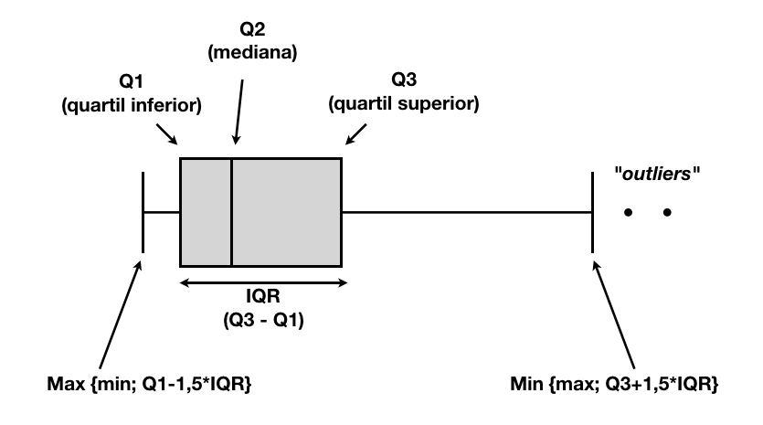

# Introdução

## Estatística e o Raciocínio Científico 

A prática Científica e de Engenharia comumente envolve o uso de dados experimentais para chegar a alguma conclusão a respeito do fenômeno de interesse do investigador.  Este é um processo de inferência, que constitui parte fundamental do método científico. E o papel da Estatística nesse processo é justamente o que veremos a seguir.


```{r ch1-metodo-cientifico, echo=FALSE, fig.cap='Método Científico: processo iterativo indutivo-dedutivo.', out.width = '100%', message=FALSE, warning=FALSE}
knitr::include_graphics("img/metodo-cientifico.png")
```


Podemos definir Ciência como sendo um corpo de conhecimentos sistematizados adquiridos via observação, identificação, pesquisa e explicação de determinados fenômenos e fatos, e formulados de maneira metódica e racional.

O método de investigação científica sempre começa por uma pergunta. Formula-se uma hipótese, que nada mais é que uma conjectura a respeito de como determinado fenômeno funciona. A partir do pensamento crítico, então, a hipótese é desafiada e testada objetivamente através de observações e experimentos, ou seja, através de evidências. Se a explicação original sobreviver ao teste, pode ser aceita como válida; caso contrário, novas conjecturas ou hipóteses precisam ser formuladas para explicar o fenômeno sendo investigado e novamente o ciclo se repete; este é, portanto, um processo iterativo.

O raciocínio dedutivo é utilizado para chegar a uma conclusão lógica a partir de premissas verdadeiras. No método científico, empregamos o raciocínio dedutivo quando dada a hipótese considerada, criamos a expectativa de observar um certo resultado para o experimento. Se a hipótese for verdadeira, o resultado é uma consequência lógica verdadeira. Parte-se do geral (a teoria, a hipótese) para o específico (as observações, as evidências empíricas).


Já através do raciocínio indutivo, tenta-se chegar a generalizações a partir de um conjunto de observações, um conjunto de dados. Portanto, indução consiste na elaboração de hipóteses e teorias para explicar um determinado fenômeno que se observa; esta atividade sempre envolve incertezas, devido às imperfeições do processo de observação e experimentação e também à incompletude e imperfeição da informação que temos disponível (afinal de contas, observamos apenas uma seleção, um subconjunto, de todos os resultados possíveis e, muitas vezes, é impossível reproduzir de maneira exata o fenômeno sendo investigado através de um experimento planejado).

Sendo assim, as práticas científicas apóiam-se no emprego do Método Científico para construir novos conhecimentos. Note que o método científico em si não produz as respostas à questão científica, mas propõe um método sistemático para chegar a essas respostas.

O método científico é caracterizado pela formulação e avaliação de hipóteses e teorias, a observação e experimentação sistemática do fenômeno sendo investigado, além do emprego dos raciocínios dedutivo e indutivo para chegar a conclusões objetivas e válidas.

A função da Estatística, como disciplina, consiste em tornar os estágios de experimentação e conclusão objetivos, rigorosos e eficientes. A Estatística permite responder de maneira satisfatória a três perguntas: 

(1) Qual a melhor maneira de coletar os dados? 

(2) Como os dados devem ser analisados? 

(3) O que se pode concluir a partir da análise?


## O que é Estatística?

O uso corriqueiro da palavra "estatística" normalmente se refere a uma coleção de números ou valores relativos a nascimentos, mortes, populações, acidentes, esportes e assim por diante... ou seja, coloquialmente, acabamos utilizando a palavra estatística como um sinônimo de "dados". Porém, nosso entendimento será um pouco mais amplo: entendemos Estatística como a ciência responsável por planejar estudos e experimentos, coletar dados, classificar, resumir, modelar e analisar esses dados com o propósito de auxiliar o processo de tomada de decisão e de descoberta científica, quando a informação disponível é limitada e variável (ou seja, quando há informação incompleta e imperfeita). Por este motivo, podemos definir Estatística como sendo a ciência do aprendizado pela experiência, isto é, aprendemos a partir de evidências, a partir da análise de dados.

Vivemos em um mundo cada vez mais sofisticado quantitativamente. À medida em que engenheiros e cientistas se deparam com o desafio de manipular, analisar e extrair informação de uma quantidade cada vez maior de dados, a Estatística assume um papel científico proporcionalmente importante na fusão de dados, quantificação de incertezas e, principalmente, como ferramenta de apoio ao processo de tomada de decisão com base em evidências.

Sendo assim, neste curso estudaremos ferramentas estatísticas para gerar informação a partir de dados, a fim de auxiliar o processo de tomada de decisão na presença de incertezas e variabilidade, ou seja, quando a informação é incompleta e imperfeita.

Esse processo de transformação de dados em informação envolve coletar, organizar, processar e disponibilizar essa informação obtida para torná-la compreensível e útil.

## O Papel da Probabilidade em Estatística

A teoria de probabilidades teve origem no século XVII com a troca de correspondência entre os dois grandes matemáticos franceses, Blaise Pascal e Pierre de Fermat, que na tentativa de resolver dois problemas envolvendo jogos de azar acabaram desenvolvendo as bases matemáticas para a teoria. Embora o início dessa disciplina não pareça muito nobre ou digno, o fato é que esses estudos iniciais acabaram por chamar a atenção de outros matemáticos ilustres como Huyghens, Bernoulli e DeMoivre para a necessidade de estabelecer uma teoria matemática de probabilidades. 

Hoje, a teoria de probabilidades é um ramo da matemática bem estabelecido e encontra aplicações em praticamente todas as áreas do conhecimento humano, de física às artes, além de estar presente em nossa experiência cotidiana, desde a previsão do tempo diária, à avaliação de riscos associados a novos tratamentos médicos.

Essa ampla aplicação da teoria de probabilidades, em parte, decorre do princípio fundamental da inferência estatística, que se resume à seguinte frase: ESTATÍSTICA utiliza PROBABILIDADE para descrever, compreender e quantificar incertezas.

Bem, claro que essa não é a única coisa que os estatísticos fazem; também desenhamos algumas figuras de vez em quando, mas calcular probabilidades definitivamente é algo que todos os estatísticos fazem e é algo em que investimos uma quantidade significativa do nosso tempo.


Como nós veremos adiante, probabilidade é um conceito matemático bem definido. Já o que se entende por incerteza pode ter diferentes interpretações. Na verdade, este é um conceito sutil que divide o mundo da estatística em dois:

+ o mundo da Estatística Clássica (ou frequentista); e

+ o mundo da Estatística Bayesiana.


Neste curso, estudaremos métodos de inferência estatística segundo o paradigma clássico.

## Elementos Fundamentais em Estatística

### População e Amostra {-}

Na terminologia estatística, o conjunto de dados que desejamos descrever, aquele que caracteriza em sua totalidade o fenômeno sendo investigado é chamado **população**. A população pode ser finita ou infinita, real ou conceitual. 

Uma **população finita** é aquela em que é possível determinar o número de elementos que a compõe. Um exemplo de população finita é o conjunto dos alunos do 2o ano de engenharia de uma determinada escola. 

Em uma **população infinita** não é possível enumerar todos os seus elementos. Por exemplo, os itens produzidos (existentes ou não) por um certo processo industrial constitui uma população infinita. O conjunto de todas as estrelas no universo também pode ser considerado uma população infinita. 

Uma população conceitual é aquela que não necessariamente existe de maneira concreta na ocasião em que os dados são coletados (talvez porque seja uma população crescente, como a coleção de todos os indivíduos nascidos ou que ainda nascerão em uma determinada localidade). Quando os elementos que compõe a população existem de maneira tangível ou concreta, esta é dita uma população real.

Podemos definir **amostra** como sendo um subconjunto de indivíduos selecionados a partir da população de interesse. A fim de que as inferências estatísticas realizadas com base na amostra sejam confiáveis, é necessário que a amostra seja representativa da população de onde foi retirada. Para isso, é necessário que os elementos que compõe a amostra, os dados que serão utilizados para realizar inferência, sejam selecionados de uma maneira adequada. Como é possível fazer isso? É possível evitar introdução de viés na amostra utilizando uma estratégia chamada aleatorização; isso significa que os indivíduos que comporão a amostra devem ser sorteados. A maneira mais simples de selecionar aleatoriamente uma amostra é através de um processo de amostragem aleatória simples, em cada indivíduo na população tem a mesma chance de ser selecionado para compor a amostra e não existe relação intencional entre os indivíduos na amostra.


É fundamental notar que inferências realizadas com base em dados amostrais são sujeitas a incertezas, pois uma amostra, por mais representativa que seja, não é capaz de fornecer uma imagem perfeita da população de interesse.

As **unidades experimentais** correspondem aos elementos, os objetos ou indivíduos que compõe a amostra e a partir dos quais são coletadas as medidas que compõe o conjunto de dados a ser analisado. Uma unidade experimental pode ser um paciente num teste clínico, uma combinação de tipo de solo + fertilizante num estudo agronômico e, assim por diante. Uma **observação** consiste no conjunto de medidas registradas para uma unidade experimental; representa, portanto toda a informação relativa a uma certa unidade experimental. Em um paciente submetido a um teste clínico, podemos estar interessados em monitorar o nível de glicose no sangue, o nível de colesterol e o peso, por exemplo; a observação para o i-ésimo paciente corresponde ao conjunto de valores apresentados pelo paciente para cada uma dessas quantidades.

### Variáveis  {-}

As variáveis correspondem aos atributos monitorados nas unidades experimentais.
Para o nosso teste clínico, as variáveis seriam nível de glicose no sangue, nível de colesterol e peso. As variáveis podem ter diferentes níveis de refinamento em suas medidas. 

**Variáveis categóricas** (qualitativas) são aquelas que podem ser divididas em classes ou categorias. Elas são ditas nominais quando não há ordenamento intrínseco entre as classes. Por exemplo, para um carro, modelo é uma variável categórica, em que cada modelo corresponde a uma classe diferente e, como não há um ordenamento natural das diferentes classes, esta é uma variável **nominal**. Quando há ordenamento intrínseco entre as classes, a variável categórica é dita **ordinal**. Por exemplo, a variável nível educacional assumindo três níveis (fundamental, médio, superior, pós-graduação) pressupõe uma ordem, em que o nível superior é mais alto que o nível médio que, por sua vez, é mais alto que o nível fundamental. Note que as distâncias entre os níveis não são iguais. 

Quando distâncias iguais entre diferentes níveis de uma variável tem mesmo valor, teríamos uma **variável numérica**, ou quantitativa. Por exemplo, a variável renda medida em números de salários mínimos é uma variável numérica. As variáveis numéricas são ditas discretas quando assumem uma quantidade finita ou infinita e enumerável de valores distintos; e contínuas, se assumem um número infinito não enumerável de valores. Essa classificação é importante pois os procedimentos estatísticos adequados dependem da natureza das variáveis sendo analisadas.


### Dados e Fontes de Dados {-}

Os dados utilizados na análise podem ser originados de fontes primárias (quando a coleta dos dados faz parte da investigação científica, por exemplo através de experimentos planejados ou estudos observacionais) ou fontes secundárias (quando os dados foram obtidos a partir de outras fontes, tais como relatórios, periódicos, publicações oficiais, entre outros).  Os dados podem ser obtidos de diversas maneiras, incluindo experimentos planejados e estudos observacionais. 

Em um **estudo experimental**, o investigador ativamente manipula certas variáveis associadas ao estudo (os chamados fatores) e, então, registra os valores observados para as respostas associadas aos indivíduos investigados. Um esforço ativo é realizado para controlar todas as outras fontes de variabilidade que podem afetar a resposta sendo investigada. Por este motivo, um efeito observado na resposta pode ter causa atribuída à variação dos fatores controlados. A partir de estudos experimentais é possível estabelecer relações de causa-e-efeito entre variáveis. Por exemplo, é possível conduzir um experimento para avaliar se a inclusão de um certo aditivo exerce influência na resistência de um material. Se o experimento tiver sido realizado de maneira controlada de forma a eliminar efeitos de perturbações espúrias, é possível concluir que variações observadas na resistência do material são decorrentes da inclusão do aditivo, ou seja, foram provocadas pela presença do aditivo. 

Em um **estudo observacional**, por outro lado, o pesquisador registra a informação a respeito dos indivíduos investigados sem nenhuma interferência no processo que gera a informação. O pesquisador é um observador passivo dos eventos. Neste caso, muito cuidado é necessário para evitar vieses e problemas de amostragem que podem comprometer a qualidade dos dados, com relação a sua representatividade. Estudos observacionais podem ser comparativos ou descritivos. Nos estudos comparativos, vários grupos são comparados com relação a um atributo em comum, por exemplo, podemos desejar realizar a comparação dos salários inicias de engenheiros graduados em faculdades publicas ou privadas. Já nos estudos descritivos o objetivo é caracterizar uma população ou processo com base em certos atributos nesta população ou processo, como por exemplo, estudar as condições de saúde das crianças menores de 5 anos em famílias sem plano de saúde.

Uma limitação severa dos estudos observacionais está associada ao fato de que as respostas observadas podem ter sido afetadas por outras variáveis não incluídas no estudo. Sendo assim, dados obtidos a partir de estudos observacionais não permitem estabelecer relações de causa-e-efeito entre fatores, apenas associações (pois como o investigador não tem controle sobre as circunstâncias em que os dados foram gerados, muitas fontes espúrias, desconhecidas, de variabilidade podem ser as causadoras do efeito observado). 

Por exemplo, imagine que um estudo observacional que monitorou o uso de protetor solar e a ocorrência de câncer de pele, tenha levado à conclusão de que quanto maior o uso de protetor solar, maior a chance de a pessoa desenvolver cancer de pele. É possível concluir que o uso de protetor solar *causa* cancer de pele? Há evidências científicas de que, na verdade, o uso de protetor solar reduz o risco de desenvolver  câncer de pele. Então, pode ser que haja uma outra variável não incluída no estudo que explique essa aparente associação entre uso de protetor solar e ocorrência de cancer de pele. Uma informação não registrada, por exemplo, é a exposição do indivíduo ao sol. Quanto maior a exposição ao sol, maior a chance de que o indivíduo utilize proteção solar e, também, maior a chance de que desenvolva cancer de pele. Exposição ao sol foi uma variável omitida do estudo que se relaciona a ambas as variáveis para as quais se tenta estabelecer uma relação; esta é uma variável chamada variável de confusão.

## Tipos de Problemas

A ciência Estatística comumente é aplicada a dois tipos de problemas: 

**Exploração:** as atividades associadas ao que se chama hoje no mundo de *data science*, ou ciência de dados, de *analytics*. Basicamente, essas atividades estão associadas ao primeiro encontro com os dados, em que desejamos resumir, descrever, explorar e formular hipóteses ou conjecturas a respeito dos dados.

**Inferência:** temos acesso a um conjunto de dados, que de maneira alguma representa a totalidade ou população de interesse (isto é, temos uma amostra) e, com base nas observações dessa amostra queremos chegar a conclusões que sejam válidas para toda a população de que essa amostra faz parte, queremos generalizar, estimar uma quantidade populacional desconhecida, prever um comportamento não observado do sistema investigado e, finalmente, tomar uma decisão em um cenário de incerteza.

## O Processo de Análise de Dados

O processo de análise de dados é aquele através do qual dados são transformados em informação para dar suporte à tomada de decisões.

Nosso estudo de Estatística será conduzido considerando uma sequência de passos normalmente realizados quando tentamos aprender algo a partir de evidências empíricas (isto é, a partir de dados). E, como podemos imaginar, este ciclo de aprendizado tem conexões fortes com o método científico, compreendendo a formulação da questão científica, planejamento da coleta de dados (ou seja, o protocolo experimental), a coleta de dados propriamente dita, análise e interpretação dos dados e, finalmente, a comunicação dos resultados.

```{r ch1-analise-dados, echo=FALSE, fig.cap='O processo de análise de dados.', out.width = '100%', message=FALSE, warning=FALSE}
knitr::include_graphics("img/analise-dados.png")
```


O processo inicia com a definição do problema (ou da pergunta científica que se deseja responder). Com vistas a fornecer respostas para a pergunta formulada ou o objetivo do estudo é necessário desenvolver um plano para obtenção dos dados, quer por meio de um estudo observacional ou de um experimento. Tendo os dados disponíveis, é necessário prepará-los para a análise; e esta etapa normalmente envolve algum tipo de resumo e exploração dos dados. Em seguida os dados precisam então passar por um processo de modelagem e análise, dentro do contexto dos objetivos da investigação a fim de que seja possível obter uma interpretação para os resultados obtidos da análise e, assim, comunicá-los à audiência de interesse.

De fato, a menos que o problema esteja claramente definido e que os dados tenham sido coletados da maneira adequada, a interpretação dos resultados da análise realizada pode acabar sendo comprometida por ser baseada em dados que não têm relação com o problema, ou que porventura sejam incompletos ou contenham informações incorretas. Com isso, informações enganosas podem levar a ações equivocadas por parte do tomador de decisão. Para cada uma dessas atividades é de suma importância que o método científico seja aplicado, ou seja, gera-se uma expectativa (constrói-se uma hipótese), submete-se essa expectativa a uma prova (confronta-se evidências e expectativas) e chega-se a uma conclusão (é necessário rever expectativas ou obter mais evidências, ou modificar os métodos de se obter as evidências). O ciclo do método científico é repetido até que expectativas e evidências estejam de acordo.


Por exemplo, na etapa da formulação da pergunta científica, devemos avaliar se a pergunta científica considerada é relevante para a audiência de interesse. Essa hipótese precisa ser colocada à prova através de observação ou experimentação (neste caso, deve-se consultar a literatura ou especialistas a fim de avaliar a relevância da pergunta). Caso se chegue a conclusão de que a pergunta é irrelevante, pode ser necessário revisar a pergunta científica.

Na etapa de exploração dos dados, devemos nos questionar se os dados são apropriados para responder à pergunta de interesse. Para isso, realiza-se análise exploratória dos dados; a partir daí, pode-se chegar à conclusão de que é necessário rever a pergunta científica, ou coletar mais dados.

A análise dos dados geralmente envolve a construção de modelos estatísticos formais. Neste caso é preciso questionar se o modelo inicial é satisfatório. Essa hipótese é desafiada ajustando-se outros modelos, ou através de análise de sensibilidade. Caso a hipótese de adequação do modelo seja derrotada, o modelo inicial deve ser revisto e, assim por diante.

A primeira etapa do processo é a exploração dos dados. Vejamos então alguns métodos para a exploração, resumo e descrição de dados.

## Métodos para Exploração, Resumo e Descrição de Dados

Vamos assumir, então, que temos em mãos um conjunto de dados de interesse, e que desejamos extrair informação a partir deles.  

Consideraremos apenas de dados *estruturados*, que são aqueles podem ser organizados em uma tabela. No entanto, tentar obter informação a partir de dados tabulados nem sempre é uma tarefa simples, quando por exemplo, o conjunto de dados é muito grande. 

Antes de mais nada, precisamos fazer a distinção entre parâmetros e estatísticas.

**Parâmetros**  são quantidades relativas a uma população, que normalmente são desconhecidas, pois é comum não observarmos a totalidade dos elementos que compõe a população.

**Estatísticas**, por sua vez, são quantidades calculadas a partir de uma amostra. Portanto, não representam de maneira perfeita a população.

Se o conjunto de dados representa uma população, ferramentas exploratórias podem ser muito úteis para caracterizar essa população. Mas, como frequentemente, os dados constituem uma amostra, tais ferramentas exploratórias também podem ser utilizadas para auxiliar o processo de inferência, através da formulação de hipóteses (e, note, apenas para esse propósito).


### Análise Exploratória de Dados ("Exploratory Data Analysis", EDA) {-}

O objetivo de realizar análise exploratória de dados é o de ganhar uma melhor compreensão sobre os dados que se têm disponíveis.

Análise Exploratória de Dados envolve examinar: 

(1) a estrutura e componentes do conjunto de dados (isto é, observamos que variáveis temos disponíveis, quantas observações há na massa de dados, como estão formatados e outras características da massa de dados); 

(2) como se caracteriza a variabilidade (ou distribuição) das variáveis observadas; e 

(3) se há indícios de associações ou relações entre diferentes variáveis.

Esta análise preliminar deve ser realizada com 3 propósitos fundamentais:  

(1) determinar se existem problemas com os dados (e aqui é necessário avaliar se as medidas estão de acordo com o que deveriam? se as ordens de magnitude são compatíveis com o esperado, se a gama de valores observados é adequada? se há dados faltantes? se há erros de registro evidentes?). 

(2) EDA também serve para determinar se a pergunta de interesse pode ser respondida com os dados disponíveis (isto é, os dados são adequados, são suficientes para responder à pergunta original? podem ser utilizados para responder a outras questões? é necessário obter mais dados ou outros dados? outras perguntas são mais interessantes?) e, finalmente 

(3) Obter respostas preliminares à pergunta científica.

Note que EDA não deve ser utilizada para realizar inferência (generalizações) ou previsões, ou seja, não serve para chegar a conclusões científicas definitivas.

#### Resumos Exploratórios {-}

Podemos construir resumos exploratórios numéricos ou gráficos. O principal objetivo de obter resumos exploratórios é o de melhorar a compreensão dos dados que se tem disponíveis para análise, a fim de priorizar as análises a serem realizadas em sequência. Os procedimentos mais adequados dependem da natureza das variáveis analisada, isto é, se se tratam de variáveis categóricas ou numéricas.

Resumos numéricos correspondem a estatísticas, ou seja, são valores calculados a partir do conjunto de dados em análise que nos permitem adquirir conhecimento a respeito de características importantes dos dados.

Ao descrever variáveis qualitativas, são definidas categorias ou classes de forma que cada observação pertence a apenas uma classe. Sendo assim, este tipo de variável pode ser explorado numericamente através de tabelas de frequência, que registram o número de observações (ou a proporção de observações) em cada categoria diferente.


Resumos gráficos permitem visualizar os dados e ganhar noções sobre sua natureza de maneira muito intuitiva. 

Veremos a seguir diversas ferramentas estatísticas básicas utilizadas para explorar um conjunto de dados, utilizando para isso o ambiente computacional R/RStudio.


**Medidas de Localização (Centro da Distribuição)**

a. Média (aritmética)  

A média aritmética ou, simplesmente, média, é uma maneira muito comum de representar o centro da distribuição dos dados. Ela representa o centro de massa ou ponto de equilíbrio dos dados, mas é uma medida muito sensível a assimetrias na distribuição, ou à presença de pontos extremos que exercem influência no valor da soma, de forma que sua interpretação pode acabar sendo enganosa.

\begin{align*}
  \bar{X} = \frac{1}{n}\sum_{i=1}^{n}X_i
\end{align*}

b. Mediana  

Se os dados são ordenados em ordem crescente, a mediana é o valor que divide os valores observados em duas metades, ou seja, 50% das observações apresentam valor inferior à mediana e 50% das observações apresentam valor superior à mediana. Essa é uma medida de centro resistente a assimetrias e pontos extremos, pois cada observação apresenta o mesmo peso na determinação da mediana. Por este motivo, esta é uma estatística chamada robusta.

c. Moda  

A moda é uma medida bem menos utilizada que as outras duas, exceto em situações em que a frequência relativa de ocorrências é importante, e ela representa o pico da distribuição, ou seja, o valor mais frequentemente observado no conjunto de dados.

Em suma, a medida de localização adequada para um certo conjunto de dados depende exatamente do tipo de informação descritiva que se deseja obter.

```{r ch1-medidas-localizacao, echo=FALSE, fig.cap='Medidas de centro ou localização.', out.width = '100%', message=FALSE, warning=FALSE}
knitr::include_graphics("img/medidas-de-centro.png")
```


**Medidas de Dispersão (Variabilidade)**

Além de descrever o centro da distribuição, é importante compreender como os dados se espalham ou variam em torno desse centro. Para isso podemos utilizar as medidas de dispersão variância, desvio-padrão e amplitude.

a. Variância  

A variância corresponde à distância média quadrática das observação à média, ou seja, é a soma das distâncias (ou desvios) quadráticas de cada observação à média, dividida por n-1, não por n. A razão disso ficará mais clara no futuro.

\begin{align*}
  S^2 = \frac{1}{n-1}\sum_{i=1}^n (X_i - \bar{X})^2
\end{align*}

b. Desvio-padrão  

O desvio-padrão é dado pela raiz quadrada da variância e representa quão próximo em média os dados estão do centro da distribuição.

\begin{align*}
  S = \sqrt{S^2} = \sqrt{\frac{1}{n-1}\sum_{i=1}^n (X_i - \bar{X})^2}
\end{align*}

c. Amplitude  

A amplitude é a diferença entre o máximo e o mínimo valor observado para os dados. Esta é uma medida de dispersão também robusta, pois diferentes conjuntos de dados podem apresentar mesma amplitude e diferentes comportamentos para a variabilidade. Em geral, a amplitude é útil como medida de dispersão no caso de amostras pequenas, em que se tem poucas observações.

**Medidas de Posição Relativa**

Com os dados ordenados em ordem crescente, é possível descrever a posição de uma observação com relação às demais observações no conjunto de dados.

a. Quantis/percentis/quartis  

Os quartis são as posições que dividem a massa de dados em quartos. Sendo assim, 1/4 (ou 25%) das observações se encontram abaixo do 1o quartil (também chamado quartil inferior ou Q1) e 1/4 (ou 25%) das observações se encontram acima do 3o. quartil (o quartil superior, também chamado de Qo). A diferença entre o 3o e o 1o quartis é chamada amplitude inter-quartis. O primeiro quartil também é chamado de percentil 25% ou quantil 0,25. Note que a mediana corresponde ao 2o quartil ou ao percentil 50% ou ao quantil 0,5.

```{r ch1-medidas-posicao-relativa, echo=FALSE, fig.cap='Quantis, percentis, quartis.', out.width = '70%', message=FALSE, warning=FALSE}
knitr::include_graphics("img/medidas-posicao-relativa.jpg")
```

b. Escores-z  

Já os escores-z medem a posição das observações com relação a média, em números de desvios-padrão. Valores negativos para o escore-z indicam que a observação correspondente encontra-se abaixo da média. Valores positivos, indicam que a observação se encontra acima da média. Quanto maior o valor do escore-z em módulo, mais distante da média se encontra a observação.

\begin{align*}
  z_i = \frac{X_i - \bar{X}}{S}
\end{align*}

Segundo a Regra Empírica, a maior parte das observações em um conjunto de dados deve se encontrar a uma distância de dois desvios-padrão da média (isto é, os escores-z serão menores que 2, em valor absoluto) e quase a totalidade das observações deve estar a uma distância de 3 desvios-padrão da média (ou seja, terão escores-z inferiores a 3, em valor absoluto).


**Observações Extremas (*Outliers*)**

Por vezes, observações inconsistentes estão presentes da massa de dados. Essa inconsistência pode se manifestar através de um valor de observação atipicamente grande ou pequeno, relativamente às demais observações no conjunto de dados. Tais observações são chamadas *outliers*, pontos extremos ou observações extremas.

*Outliers* normalmente podem ter uma das possíveis causas:

(1) A observação pode ter sido incorretamente medida, registrada ou lida pelo computador;  
(2) A observação pode pertencer a uma população distinta; ou  
(3) A observação é correta, mas representa um evento raro.


O método mais usual para detecção de *outliers* é o cálculo do escore-z. Desta maneira, *outliers* apresentam valores absolutos de escore-z maiores que 3. Outro procedimento é baseado na ferramenta gráfica chamada *boxplot*, que veremos com mais detalhes em seguida.    

::: {.example name="Prevalência de Diabetes Mellitus entre as mulheres indígenas Pima"} 
<br />
:::


Fonte: Smith, JW; Everhat, JE; Dickson, WC; Knowler, WC; Johhannes, RS (1988). Using the ADAP learning algorithm to forecast the onset of diabetes mellitus. In: *Proceedings of the Symposium on Computer Applications and Medical Care (pp. 261-265).*

Vamos utilizar a massa de dados `pima` para ilustrar o processo de análise exploratória de dados. Diversas restrições foram aplicadas na seleção das observações a partir de um conjunto contendo um número maior de observações. Todas as pacientes têm idade superior a 21 anos e são de origem Pima.


```{r ch1-pima-uci, echo=FALSE, fig.cap='Conjunto de dados `pima`, disponível no repositório de dados da UCI.', out.width = '100%', message=FALSE, warning=FALSE}
knitr::include_graphics("img/pima.png")
```


Este conjunto de dados foi obtido a partir do repositório de dados da Universidade da Californa Irvine, que contém uma grande quandidade de conjuntos de dados disponíveis para diversos tipos de análise. O objetivo inicial desse estudo era construir um algoritmo capaz de prever se a paciente mostra sinais de diabetes mellitus, de acordo com os critérios estabelecidos pela OMS, isto é se o teste oral de tolerância a glicose, ou TTOG, apresenta resultado igual ou superior a 200mg/dl. Os dados disponíveis foram pré-selecionados a partir de uma massa de dados que continha um número maior de observações.

Temos aqui algumas informações preliminares: Há um total de 768 observações registradas para 8 variáveis de interesse. E precisamos estar preparados para lidar com dados faltantes, conforme nos informa o resumo dos dados.


**Variáveis**

`times_pregnant`: número de gravidezes  
`glucose_tot`: concentração de glicose no plasma a 2h no TTOG  
`diastolic_pb`: pressão sanguínea diastólica (mmHg)  
`triceps`: espessura de dobra cutânea de tríceps (mm)  
`insulin`: dosagem de insulina 2h em soro (µU/ml)  
`mass_index`: índice de massa corporal (kg/m^2)  
`pedigree`: função de pedigree para diabetes   
`age`: idade (anos)  
`class`: diabetes (0 ou 1) 

As variáveis são estas. A princípio podemos identificar algumas variáveis numéricas e uma variável categórica (que corresponde à classificação da paciente em diabética ou não). 

#### Análise Exploratória da Base da Dados `pima` {-}

O primeiro passo consiste em limpar a área de trabalho, utilizando o comando `rm(list = ls())`, para então ler os dados que se encontram no arquivo `pima-indians-diabetes.data`. Nota que os dados estão dentro de uma pasta chamada `pima-indians-diabetes`, que por sua vez, encontra-se dentro de uma pasta chamada `data`, que é o local onde eu armazeno minhas massas de dados.
Eu leio esses dados e os armazeno em um objeto do tipo tabela, chamada `pima`. Eu sei, de antemão, que não há cabeçalho no arquivo de entrada, ou seja, a primeira linha do arquivo não corresponde aos nomes das variáveis; as colunas não têm nomes - por isso, faço `col_names = FALSE`.

```{r ch1-inicializa, out.width = '100%', message=FALSE}
# Limpa área de trabalho
rm(list=ls())

library(tidyverse)

# Carrega os dados e armazena em um objeto do tipo tabela
pima <- read_csv("data/pima-indians-diabetes/pima-indians-diabetes.data", 
                 col_names = FALSE)
```

Veja que podemos obter algumas informações do objeto `pima`, simplesmente digitando `pima`. Verificamos que há um total de 768 linhas e 9 colunas. Cada coluna da tabela corresponde a uma variável (atributo) e as linhas correspondem a diferentes observações, ou seja, toda informação coletada para cada um dos indivíduos avaliados. As variáveis não tem nomes que façam sentido e todas foram codificadas como variáveis numéricas contínuas, doubles, ou números reais `<dbl>`. 


```{r ch1-obj-pima}
pima
```

Vamos dar nomes às variáveis. Para isso, utilizamos o comando `colnames` no objeto `pima` e atribuímos a esse objeto o vetor contendo os nomes das variáveis.

```{r ch1-nomeia-col}
# Atribui nomes às colunas da tabela
colnames(pima) <- c("times_pregnant","glucose_tot", "diastolic_pb",
                    "triceps", "insulin", "mass_index", "pedigree",
                    "age", "class")
pima
```

Também percebemos que há valores medidos para as variáveis `diastolic_pb`, `insulin`, `triceps` e `mass_index` iguais a zero. Será que correspondem a erro de codificação? Valores não observados? Há mais um problema com os dados: a variável `class` é categórica e precisa ser codificada adequadamente como fator; precisamos corrigir isto, bem como os outros problemas com a massa de dados.


```{r ch1-recodifica-class}
# recodifica `class` como sendo fator
pima$class <- as.factor(pima$class) 

# muda os rótulos dos níveis do fator
levels(pima$class) <- c("neg", "pos")

# Verifica recodificação  
pima
```

#### Resumos numéricos {-}

Um resumo numérico simples pode ser obtido utilizando a função `summary`:

```{r ch1-summary-pima}
summary(pima)
```

Para a variável categórica, a função `summary` retorna o número de observações em cada classe.

Para as variáveis quantitativas, a função `summary` fornece o chamado resumo de 5-números (mais a média) . Temos valores mínimo, máximo, 1o. e 3o. quartis, mediana e média. Para os dados analisados, observamos 5 variáveis com valor mínimo igual a zero: `times_pregnant`, `glucose_tot`, `diastolic_pb`, `triceps`, `insulin`, `mass_index`.


Num exercício de validação externa, podemos concluir que possivelmente há algo de errado com as variáveis `glucose_tot`, `diastolic_pb`, `triceps`, `insulin`, `mass_index`, pois não seria natural observar valores iguais a zero para essas quantidades. Provavalmente há erro na codificação de valores faltantes. Antes de corrigir este problema, vejamos como utilizar ferramentas gráficas para visualizar dados qualitativos.


**Tabela de Frequência e Barplot**  

Podemos também contar as ocorrências de todos os valores que a variável assume e incluir uma representação gráfica.

Essa visualização é especialmente útil quando temos uma variável categórica com mais de duas classes.

```{r ch1-tabela-freq-barplot, eval=FALSE }
# Conta ocorrências em cada uma das classes
pima %>%
  select(class) %>% 
  table %>%
  print %>%
  barplot
```

```{r bar-plot-pima, echo=FALSE, fig.cap='Número de ocorrências em cada classe.', out.width='33%'}
par(mar=c(2,2,1,0))
# Conta ocorrências em cada uma das classes
pima %>%
  select(class) %>% 
  table %>%
  print %>%
  barplot
```

**Não utilize gráficos de pizza para visualizar dados!** Gráficos de pizza não são muito úteis para gerar visualizações de dados, pois é mais difícil comparar os tamanhos dos grupos em uma escala não linear do que utilizando um barplot, especialmente quando as categorias têm proporções muito parecidas.

Vamos analisar agora as variáveis quantitativas. Iniciemos com a  investigação da variável `diastolic_pb`:

```{r ch1-conta-ocorr}
# Conta ocorrências de zeros
pima %>% summarise(count = sum(diastolic_pb == 0))
```

Temos um total de 35 observações faltantes para a variável `diastolic_pb`. Podemos, ainda, identificar quantos valores únicos há para essa variável (neste caso, 47).


```{r ch1-conta-distintos}
# Conta quantidade de valores distintos
pima %>% summarise(n = n_distinct(diastolic_pb))
```

É possível realizar procedimento análogo para as demais variáveis.

Vamos recodificar os zeros para representar valores não observados, onde couber e, em seguida, podemos verificar novamente o resumo dos dados.

```{r ch1-recodifica-na}
# Recodifica dados faltantes como 'NA' (not available)
pima <- pima %>%
  mutate(diastolic_pb = replace(diastolic_pb, diastolic_pb == 0, NA)) %>%
  mutate(glucose_tot = replace(glucose_tot, glucose_tot == 0, NA)) %>%
  mutate(triceps = replace(triceps, triceps == 0, NA)) %>%
  mutate(insulin = replace(insulin, insulin == 0, NA)) %>%
  mutate(mass_index = replace(mass_index, mass_index == 0, NA))
summary(pima) # resumo
```

Aparentemente, o problema foi resolvido. Podemos agora construir alguns resumos gráficos.


#### Resumos Gráficos {-}

**Boxplots**  

O *boxplot* é uma ferramenta gráfica, que fornece um resumo da distribuição dos valores da variável sendo analisada. O *boxplot* nos dá 5 estatísticas e também mostra possíveis valores extremos (os chamados *outliers*). A linha no centro da caixa corresponde à mediana.  A caixa é delimitada pelos quartis inferior e superior.  Portanto, 50% das observações se encontram entre os valores que determinam as extremidades da caixa. O comprimento da caixa é chamado distância ou amplitude inter-quartis (ou IQR) e corresponde à diferença entre os quartis superior e inferior.

As linhas horizontais que se afastam da caixa são os *whiskers*, cujo comprimento máximo vale 1,5 * IQR em cada direção, de forma que a distância máxima entre as extremidades dos *whiskers* vale 4 * IQR (comprimento máximo do *whisker* inferior vale 1,5 IQR, a caixa tem largura IQR e o comprimento máximo do *whisker* superior vale 1,5 IQR). Se a observação mais extrema em qualquer das direções estiver a uma distância da caixa menor que 1,5 * IQR, então o alcance do respectivo *whisker* vai até essa observação. Qualquer valor além dos *whiskers* é marcado como um ponto extremo, ou outlier.

```{r ch1-elementos-boxplot, echo=FALSE, fig.cap='Elementos de um boxplot.', out.width = '100%', fig.height= 2, message=FALSE, warning=FALSE}

```


Vamos construir boxplots para a variável `insulin`, utilizando a função `boxplot.` 

```{r ch1-boxplot-isulin, out.width='100%',  fig.height= 2, message=FALSE, warning=FALSE}
ggplot(pima, aes(x = insulin)) +
  geom_boxplot() +
  labs(x = "insulin")
```

No gráfico, percebemos alguns valores de insulina bastante elevados (e pode até valer a pena uma análise mais cuidadosa em um momento posterior). Para o exemplo, já tínhamos calculado anteriormente na tabela de resumos numéricos o valor do 1o quartil, que vale Q1 = 76.25. Esse valor está representado pela extremidade inferior da caixa (localizada à esquerda). A mediana vale Q2 = 125 e está representada graficamente pela linha no interior da caixa. O 3o quartil, cujo valor é Q3 = 190 corresponde à extremidade superior da caixa (à direita). A amplitude interquartis é dada pela diferença entre o 3o e o 1o quartil e vale IQR =  Q3(190) - Q1(76,25) = 113,75. Esse é o comprimento da caixa. Como não há pontos extremos à esquerda, o whisker inferior corresponde ao menor valor observado para os dados, o valor mínimo, igual 14. No caso do whisker superior, há alguns possíveis outliers à direita, portanto, o whisker superior  vale 1,5*IQR igual a  360,625. O valor máximo observado para esses dados é 846, e está representado como o ponto mais extremo à direita.

É importante examinar os dados com relação à existência de possíveis outliers pois eles podem indicar:

(1) forte assimetria na distribuição das observações;    
(2) erros (de medida, de registro ou leitura);   
(3) ou mesmo, podem revelar propriedades interessantes e inesperadas da massa de dados (talvez a observação pertença a uma outra população).  


**Histogramas**

Uma outra maneira de representar a distribuição dos valores observados para  uma variável é através de um histograma, que pode ser gerado utilizando a função `hist`. O histograma é útil para descrever a forma da distribuição.

Por exemplo, vemos que a distribuição de insulina é assimétrica; a maioria das mulheres observadas apresenta valores de insulina abaixo de 250, mas há algumas poucas observações com valores de insulina bastante elevados. A distribuição de insulina apresenta cauda longa à direita. Já a distribuição de glicose apresenta maior simetria.

```{r ch1-hist-insulin, out.width='100%',  fig.height= 3, warning=FALSE, message=FALSE}
ggplot(pima, aes(x = insulin)) +
  geom_histogram() +
  labs(x = "insulin")

ggplot(pima, aes(x = glucose_tot)) +
  geom_histogram() +
  labs(x = "glucose_tot")

```

Podemos adicionar marcações nos gráficos. Por exemplo, vamos adicionar uma reta vertical marcando o valor da média dos valores observados para cada uma das variáveis analisadas. 


Aqui, a média está sinalizada pelas retas verticais vermelhas:

```{r ch1-hist-insulin-retas, out.width='100%',  fig.height= 3, warning=FALSE, message=FALSE}
xbar <- mean(pima$insulin, na.rm = TRUE)
ggplot(pima, aes(x = insulin)) +
  geom_histogram() +
  labs(x = "insulin") +
  geom_vline(aes(xintercept = xbar), col = 'red')                            #<<

xbar <- mean(pima$glucose_tot, na.rm = TRUE)
ggplot(pima, aes(x = glucose_tot)) +
  geom_histogram() +
  labs(x = "glucose_tot") +
  geom_vline(aes(xintercept = xbar), col = 'red')                            #<<
```

**Histogramas e Gráficos de Densidade**

Que tal obter um pouco mais de detalhes com a função `rug()`, que nos mostra cada uma das observações? Aqui, além de adicionarmos as observações na margem inferior, também ajustamos a largura das bandas. Note que o histograma é muito sensível à largura (ou discretização) das bandas, de forma que se não for adequadamente ajustado, pode trazer informações enganosas. No caso de glicose, o histograma resultante perdeu muito de sua informação. Tente gerar outros histogramas, variando o valor de `binwidth`. 


Também temos sobreposição a cada histograma da respectiva curva de densidade, que corresponde a uma suavização do histograma. Para isso, também foi modificado o eixo vertical que, em vez de representar o número de observações em cada faixa, agora apresenta a frequencia relativa (isto é, o no. de observações na faixa, didivido pelo no. total de observações).

```{r ch1-hist-insulin-anotado, out.width='100%',  fig.height= 3, warning=FALSE, message=FALSE}
xbar <- mean(pima$insulin, na.rm = TRUE)
ggplot(pima, aes(x = insulin)) +
  geom_histogram(aes(y = ..density..),                                       #<<
                 binwidth = 45) +                                            #<<
  labs(x = "insulin") +
  geom_vline(aes(xintercept = xbar), col = 'red') + 
  geom_rug(sides = 'b', col = 'blue') +                                      #<<
  geom_density(alpha = 0.1, fill = 'blue')                                   #<<
```

```{r ch1-density-insulin, out.width='100%',  fig.height= 3, warning=FALSE, message=FALSE}
xbar <- mean(pima$glucose_tot, na.rm = TRUE)
ggplot(pima, aes(x = glucose_tot)) +
  geom_histogram(aes(y = ..density..),                                       #<<
                 binwidth = 45) +                                            #<<
  labs(x = "glucose_tot") +
  geom_vline(aes(xintercept = xbar), col = 'red') + 
  geom_rug(sides = 'b', col = 'blue') +                                      #<<
  geom_density(alpha = 0.1, fill = 'blue')                                   #<<
```


**Resumos Multidimensionais**

Podemos também utilizar boxplots para comparar duas distribuições. Por exemplo, podemos querer saber como se comparam os valores de insulina para mulheres diabéticas e não-diabéticas.

```{r ch1-boxplot-insulin-class, out.width='100%',  fig.height= 3, warning=FALSE, message=FALSE}
ggplot(pima, aes(x = insulin, y = class, fill = class)) +
  geom_boxplot() +
  labs(x = "insulin", x = "class")
```

Podemos perceber que a mediana observada para os valores de insulina para mulheres diabéticas é um pouco maior que aquela para mulheres não-diabéticas. Embora não seja possível afirmar que existe uma diferença estatisticamente significativa entre os dois grupos, esta é uma hipótese interessante, que pode ser testada formalmente posteriormente. Vamos adicionar uma reta no valor de glicose igual a 200 mg/dl (valor de referência no TTOG):

```{r ch1-boxplot-insulin-anotado, out.width='100%',  fig.height= 3, warning=FALSE, message=FALSE}
ggplot(pima, aes(x = insulin, y = class, fill = class)) +
  geom_boxplot() +
  labs(x = "insulin", x = "class") +
  geom_vline(aes(xintercept = 200), lwd = 1, lty = 'dashed', col = 1)
```

É possível modificar a cor, espessura e tipo dessa reta. Fica como exercício.

Pode ser útil construir múltiplos histogramas ou curvas de densidade, para diferentes categorias. Podemos sobrepor as duas distribuições, para tornar a comparação imediata.

```{r ch1-density-insulin-mult, out.width='100%',  fig.height= 3, warning=FALSE, message=FALSE}
ggplot(pima, aes(insulin, fill = class)) + 
  geom_histogram(aes(y = ..density..), binwidth = 40) 

ggplot(pima,  aes(insulin, fill = class)) + 
  geom_density(alpha = 0.2) 
```


**Relações entre Variáveis**

Para variáveis contínuas, é interessante observar gráficos de dispersão, a fim de avaliar relações entre pares de variáveis:

```{r ch1-dispersao-2d, out.width='100%',  fig.height= 3, warning=FALSE, message=FALSE}
ggplot(pima, aes(x = insulin, y = glucose_tot)) + 
  geom_point() +
  labs(x = "insulin", x = "glucose_tot")
```

Podemos adicionar mais informação ao gráfico, com retas:

```{r ch1-dispersao-2d-reta, out.width='100%',  fig.height= 3, warning=FALSE, message=FALSE}
ggplot(pima, aes(x = insulin, y = glucose_tot)) +  
  geom_point() +
  geom_vline(aes(xintercept = 200), col = 1) +                               #<<
  labs(x = "insulin", x = "glucose_tot")
```

Podemos adicionar uma terceira dimensão, utilizando cores:

```{r ch1-dispersao-3d, out.width='100%',  fig.height= 3, warning=FALSE, message=FALSE}
ggplot(pima, aes(x = insulin, y = glucose_tot, 
                 color = class)) +                                           #<<
  geom_point() +
  labs(x = "insulin", x = "glucose_tot")
```

Podemos adicionar uma quarta dimensão com diferentes tamanhos para os pontos: 

```{r ch1-dispersao-4d, out.width='100%',  fig.height= 3, warning=FALSE, message=FALSE}
ggplot(pima, aes(x = insulin, y = glucose_tot,                               #<<
                 color = class, size = age)) +                               #<<
  geom_point() +
  labs(x = "insulin", x = "glucose_tot")
```

Assim, chegamos ao fim de nossa primeira análise exploratória de dados.   
E este é apenas o começo...
