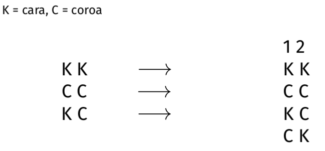
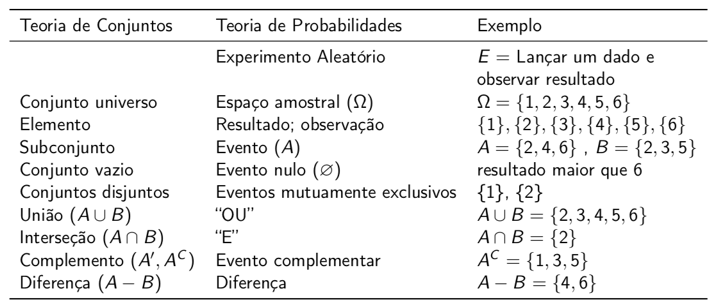

# Introdução à Teoria de Probabilidades


## Breve Histórico


A Teoria de Probabilidades é a disciplina matemática que trata de fenômenos aleatórios, através da construção dos chamados modelos probabilísticos.

Atribui-se a Aristóteles a declaração de que, para a melhor compreensão de algo, é necessário observar suas origens e seu desenvolvimento. Sendo assim, para que tenhamos uma melhor apreciação da Teoria Matemática de Probabilidades, é interessante observar suas origens.


### Chance e Incerteza {-}


Chance e incerteza são conceitos tão antigos quanto a civilização; os seres humanos sempre estiveram sujeitos e, por este motivo, sempre se esforçaram para compreender e reduzir as incertezas presentes em seu ambiente, a fim de garantir sua sobrevivência.

As primeiras civilizações agrícolas, por exemplo, eram profundamente sensíveis a flutuações climáticas. Uma enchente poderia destruir toda a reserva de grãos necessária para alimentar um povoado; uma seca poderia ser igualmente destrutiva, tornando os estoques de água insuficientes para atender de maneira satisfatória as necessidades locais. Doenças, conflitos e escassez de recursos necessários tornavam a existência humana extremamente incerta e frágil. E, assim, em resposta a essas vulnerabilidades, com o tempo, os seres humanos passaram a desenvolver meios de prever mudanças em seu ambiente a fim de melhor se proteger.


### Jogos de Azar {-}


Também, desde tempos remotos, os seres humanos conscientemente e intencionalmente produziram aleatoriedade utilizando dados, ossos de animais, conchas ou outros objetos com diversas finalidades, como para proporcionar entretenimento, para prever o futuro ou como uma maneira de se comunicar com o sobrenatural.

As civilizações antigas da Grécia, Roma e Egito, por exemplo, utilizavam astrágalos (pequenos ossos do calcanhar de certos animais que serviam como dados assimétricos de 4 lados) para realizar divinações ou previsões; e era popular entre os antigos egípcios (e me refiro a um período por volta de 2000 anos AC) um jogo de azar chamado "cães e chacais"; 

O dado cúbico foi desenvolvido por volta de 1500 AC. Os jogos de azar envolvendo dados eram uma obsessão tão grande entre os antigos romanos, que se tornaram ilegais, exceto em ocasiões especiais, como durante grandes eventos como o festival Saturnalia, torneios de gladiadores ou corridas.

O fato é que, através da prática de jogos de azar, os seres humanos desenvolveram intuição a respeito da aleatoriedade e das probabilidades, associadas, neste caso, à frequência de observação de certos eventos imprevisíveis. No entanto, apesar desse envolvimento com processos aleatórios controlados, as pessoas ainda não compreendiam a aleatoriedade em termos matemáticos.


### Origem da Teoria Matemática de Probabilidades {-}


O desenvolvimento de uma teoria matemática de probabilidades é um evento muito mais recente na história humana. Apenas no século XVI é que surgiram os primeiros estudos matemáticos a respeito de eventos envolvendo incertezas ou o acaso. Luca Paccioli (1445-1514), Nicolò Tartaglia (1499-1557), Girolamo Cardano (1501-1576) e Galileu Galilei (1564-1642) foram os primeiros matemáticos proeminentes que calcularam probabilidades associadas a diferentes jogos de azar; eles também tentaram construir bases matemáticas para o cálculo de probabilidades.

Ainda assim, a primeira contribuição significativa para a construção de fundamentos matemáticos para a teoria de probabilidades se deu em 1654, através de uma troca de correspondência entre os matemáticos franceses Blaise Pascal (1623-1662) e Pierre de Fermat (1601-1665) que, na necessidade de determinar a probabilidade de certos resultados obtidos em jogos de azar, acabaram construindo métodos para a enumeração combinatória das possibilidades.

Tal discussão foi motivada por um desafio proposto por Antoine Gombaud, autodenominado Chevalier de Méré, ao seu amigo Blaise Pascal. De Méré foi um escritor e filósofo conhecido, uma figura importante na corte do rei Luis XIV, além de um aficcionado por jogos de azar.

De Méré apresentou a Pascal dois problemas para os quais não conseguia encontrar a solução correta:  

(1) O problema dos dados e;   
(2) O problema dos pontos.  

No problema dos dados, de Méré desejava determinar o número crítico de lançamentos, isto é, o número de jogadas necessárias para alcançar 50% de chance de obter pelo menos um sucesso em dois jogos de dados. Ele não compreendia "Por que era mais fácil obter pelo menos um ‘6’ em 4 lançamentos de um dado do que pelo menos um ‘duplo 6’ em 24 lançamentos de um par de dados?” Este problema ficou conhecido como "O Paradoxo de de Méré".

Já no problema dos pontos, a questão colocada era como repartir de maneira justa, entre dois jogadores, o prêmio de um torneio que é interrompido antes que chegue ao fim. Diferentes noções de justiça podem ser utilizadas para determinar como o prêmio deve ser dividido; por exemplo, os jogadores podem partilhar igualmente o prêmio; ou, o jogador com maior pontuação pode levar todo o dinheiro...  A solução proposta por Pascal foi absolutamente revolucionária na história da teoria de probabilidades. Ele sugeriu que o prêmio fosse dividido de acordo com a expectativa de vitória de cada jogador, com base em suas pontuações no momento em que o jogo foi interrompido, ou seja, deveria ser calculada considerando a probabilidade de cada um dos jogadores vencer, dado o atual estágio do torneio, em que há ainda um certo número de jogos ou pontos para atingir. 

No futuro, nós falaremos mais sobre esta e também a respeito de outras contribuições de Pascal tanto para a Teoria Matemática de Probabilidades, bem como para a Teoria de Decisão.


### Formalização Matemática {-}


Como veremos mais adiante, há várias maneiras de interpretar o conceito probabilidade e, a partir do século XVII, diversos matemáticos se debruçaram sobre o problema de como formalizá-lo, alcançando maior ou menor sucesso.

Uma das dificuldades no desenvolvimento de uma teoria matemática das probabilidades consistia em obter uma definição de probabilidade precisa o bastante para ser usada em matemática, e abrangente o suficiente para ser aplicável a uma grande variedade de problemas. 

Este objetivo só foi finalmente alcançado com a definição axiomática, proposta por Andrei Kolmogorov e publicada em 1933 no livro "Fundamentos de Teoria de Probabilidades". Neste trabalho, ele declara acreditar que "a Teoria das Probabilidades, como disciplina matemática, poderia e deveria ser desenvolvida exatamente como a Geometria ou a Álgebra, a partir de axiomas", com base nos quais todos os desenvolvimentos subsequentes deveriam ser obtidos.

Contando com uma definição formal e abrangente, a teoria de probabilidades passou a ser aplicada nas mais diversas áreas do conhecimento e atividade humanos, incluindo engenharia, economia, negócios, ciêcias, psicologia e tantas outras, de forma que o conhecimento de Teoria de Probabilidades é algo indispensável nos dias de hoje.


## Definições Iniciais


Um modelo probabilístico consiste em uma descrição matemática de uma situação de incerteza. Isto significa que podemos utilizá-lo para:
  
(1) Investigar e descobrir padrões regulares em eventos aleatórios — eventos que, a princípio, são imprevisíveis; e também para  

(2) Descrever incerteza em termos matemáticos; quer dizer, queremos ser capazes de quantificar as incertezas.  

A fim de descrever a estrutura geral de tais modelos e suas propriedades, precisamos ter claras algumas definições iniciais.

Os modelos probabilísticos são descritos a partir de alguns ingredientes básicos, representados neste diagrama. São eles: um experimento aleatório, associado a um espaço amostral, que por sua vez é composto por uma coleção de eventos, e uma lei de probabilidade definida em todos os eventos.

Examinaremos, a seguir, cada um desses elementos.


```{r ch2-probabilidade-modelo, echo=FALSE, fig.cap='Elementos básicos de um modelo probabilístico.', out.width = '100%', message=FALSE, warning=FALSE}
knitr::include_graphics("img/probabilidade-modelo.png")
```


### Experimento Aleatório  {-}

  
O primeiro elemento é o chamado experimento aleatório, que vamos representar de maneira genérica pela letra “E”. Um experimento aleatório representa um processo cujo resultado a ser obtido é desconhecido e imprevisível e que pode (pelo menos conceitualmente) ser repetido indefinidamente sob condições idênticas. As condições em que o experimento é realizado não garantem a ocorrência de um certo resultado, ou seja, a ocorrência do resultado é incerta. Vamos considerar que sempre é possível obter um resultado que pertence a um conjunto fixo e conhecido de possibilidades.

Vamos considerar o seguinte experimento aleatório, que consiste em lançar um dado e registrar o resultado obtido. Bem, nós conhecemos os resultados possíveis deste experimento; sabemos que podemos obter qualquer um dos resultados 1 ou 2 ou 3 ou 4 ou 5 ou 6. Porém, antes de o dado ser lançado, e observarmos o número efetivamente obtido, é impossível prever com certeza qual será o resultado do lançamento do dado. Percebemos também que, a princípio, ou pelo menos mentalmente, é possível repetir um experimento como esse indefinidamente, nas mesmas condições. Isto quer dizer que poderíamos, em teoria, lançar um dado uma quantidade interminável de vezes e registrar os resultados obtidos. Note que ao realizar esse experimento apenas uma vez, apenas um desses resultados é observado. Isso nos leva à próxima definição.


### Espaço Amostral e Evento  {-}

  
A coleção de todos os resultados elementares possíveis de um experimento aleatório constituem um conjunto chamado espaço amostral, representado pela letra grega $\Omega$. Qualquer conjunto contendo resultados possíveis do experimento aleatório (isto é, qualquer subconjunto do espaço amostral) constitui um evento, que representaremos pelas letras maiúsculas do alfabeto latino (A, B, C, D etc.).

Esses eventos podem ser simples (quando não podem ser decompostos em eventos mais elementares) ou compostos. De forma geral, um certo evento (A) corresponde a um conjunto de resultados de um experimento aleatório que satisfaz determinadas condições.

- evento impossível  
- evento união  
- envento interseção  
- evento complementar  
- eventos mutuamente exclusivos   
- partição do espaço amostral  


::: {.example} 
<br />
:::

Experimento Aleatório:  E = lançar um dado e observar o resultado  
Eventos simples: 1, 2, 3, 4, 5, 6  
Espaço Amostral: $\Omega$  = {1, 2, 3, 4, 5, 6}  

Neste exemplo do lançamento de um dado, o espaço amostral é composto por todos os resultados possíveis, ou seja, é o conjunto que contém os elementos 1, 2, 3, 4, 5 e 6. 

Outros Eventos:  
  
A = resultado par = {2, 4, 6}  
B = resultado ímpar = {1, 3, 5}  
C = resultado > 3 = {4, 5, 6}  
D = resultado igual a 1 = {1}   
G = resultado < 2 e par = { }  

Para esse experimento, podemos estar interessados na situação em que o resultado obtido é um número par. Vamos representar esta situação pelo evento A, que consiste no conjunto contendo os valores 2, 4 e 6. Um outro evento B pode representar a situação em que o resultado é um número ímpar. Então, o evento B corresponde ao conjunto contendo os valores 1, 3 e 5. Podemos definir outros eventos, tais como (1) um evento C, que representa a situação em que o resultado obtido é um número maior que 3 (2) ou um outro evento D, que representa a situação em que o resultado é igual a 1 ou, ainda, (3) um evento G, que representa a situação em que o resultado é menor que 2 e, ao mesmo tempo, par. Note que o evento G é impossível de ser observado e constitui um conjunto vazio, que não contém nenhum elemento.

Descrevemos o espaço amostral em termos da definição matemática de conjunto. Portanto, podemos manipular matematicamente os eventos utilizando álgebra de conjuntos. É desejável, então, neste ponto, fazer uma revisão de álgebra de conjuntos, que nós não abordaremos aqui. Fica como tarefa para casa.

Mesmo para um experimento aleatório trivial, é importante identificar corretamente os eventos simples. Por exemplo, imagine o experimento aleatório que consiste em lançar duas moedas e registrar todos os eventos simples associados a esse experimento. A primeira impressão é de que os eventos possíveis são observar duas caras, observar duas coroas e observar uma cara e uma coroa. No entanto, o último evento pode ser decomposto em dois eventos simples: (Cara e Coroa) e (Coroa e Cara). Portanto, os eventos simples associados a este experimento são: (cara,cara), (coroa, coroa), (cara, coroa) e (coroa, cara).


::: {.example} 
<br />
:::


Experimento Aleatório:  E = lançar duas moedas e observar os resultados


```{r ch2-experimento-moeda, echo=FALSE, fig.cap='Eventos simples associados ao experimento.', out.width = '60%', message=FALSE, warning=FALSE}

```


#### Eventos Especiais {-}


Alguns eventos são especiais:
  
**Evento Impossível** $\varnothing$   

O evento impossível (também chamado evento nulo) é aquele representado por um conjunto vazio (por exemplo, o resultado do lançamento do dado ser maior que 6 — sabemos que não é possível obter esse resultado); 

**União** $A \cup B$   

A união de dois eventos A e B corresponde à ocorrência simultânea dos eventos A e B OU quando apenas um dos dois eventos ocorre, ou seja:  
  OU ocorre apenas A OU ocorre apenas B OU ocorrem simultaneamente A e B.  
Por exemplo, se o evento A  corresponde a dizer que o resultado do lançamento de um dado é par, A é o conjunto dos elementos {2, 4, 6}. Se o evento B corresponder aos resultados ímpares, B é o conjunto dos elementos {1, 3, 5}. Então A U B é o conjunto dos resultados {1, 2, 3, 4, 5, 6}.  

A = {2, 4, 6}   
B = {1, 3, 5}  $\qquad \Rightarrow {A\cup B}$ = {1, 2, 3, 4, 5, 6} = $\Omega$
  
**Interseção** $A \cap B$  

Já a interseção de dois eventos A e C corresponde à ocorrência simultânea dos eventos A e C.  
Se A é o conjunto dos resultados pares e C é o conjunto dos resultados maiores que 3, então A interseção C corresponde ao conjunto dos resultados {4, 6}

A = {2, 4, 6}   
C = {4, 5, 6}  $\qquad \Rightarrow {A\cup C}$ = {4, 6}

**Eventos Mutuamente Exclusivos** $A \cap B = \varnothing$  

Dois eventos A e B são ditos mutuamente exclusivos quando a ocorrência de um deles implica na não ocorrência do outro. Neste caso, é impossível observar a ocorrência simultânea de A e B. Assim, a intersecção entre os conjuntos que os definem é o conjunto vazio. 
Os eventos A (= o resultado é par)   e   B (= o resultado é ímpar) são mutuamente exclusivos: 
  
  $A \cap B = \{2, 4, 6\} \cap \{1, 3, 5\} = \{ \}$,  pois observar um resultado par implica em não observar um resultado ímpar.

**Partição do Espaço Amostral**   

Os eventos A e B definidos anteriormente apresentam uma característica especial: são mutuamente exclusivos e coletivamente exaustivos (ou seja,a interseção de A e B é o conjunto vazio e a união de A e B corresponde ao espaço amostral). Neste caso, dizemos que A e B formam uma partição do espaço amostral.

  $A \cap B = \{\}$  
  $A \cup B = \Omega$

Duas definições adicionais importantes para Teoria de Probabilidades são idênticas àquelas correspondentes em Teoria de Conjuntos:
  
**Evento Complementar**  $A^\prime = A^C$   

O complementar de um evento A, representado por ($A^\prime$ ou $A^C$), corresponde ao evento que ocorre apenas se A não ocorrer.

**Diferença entre Eventos** $A - B = A \cap B^C$    

A diferença entre dois eventos A e B, representada por $A-B$ corresponde ao evento que ocorre quando A ocorre mas B não ocorre.
A diferença $A-B$ pode ser representada matematicamente pela interseção entre o evento A e o complementar de B.  

A = {2, 4, 6}   
B = {1, 3, 5}  $\qquad \Rightarrow  {A - B}$ = {2, 4, 6} $\cap$ {2, 4, 6} = {2, 4, 6}


A tabela abaixo mostra a equivalência entre os conceitos fundamentais de teoria de conjuntos e a terminologia utilizada em teoria de probabilidades.


```{r ch2-probabilidade-conjuntos, echo=FALSE, out.width = '100%', message=FALSE, warning=FALSE}

```


### Lei de Probabilidade  {-}


A Lei de Probabilidade  $P[A]$  atribui a todo evento no espaço amostral um número não negativo que codifica, isto é, que  define a medida de incerteza associada a cada evento no espaço amostral. Na ilustração, altura da barra está associada à propensão da ocorrência dos eventos A e B, ou seja, das probabilidades de observar os eventos A e B, respectivamente.

Precisamos definir qual medida de incerteza será utilizada para a análise de um determinado experimento aleatório. É importante uma escolha cuidadosa, pois tudo que a teoria matemática faz é calcular valores com base na medida definida. Diferentes interpretações são possíveis e veremos algumas a seguir. 


## Interpretações de Probabilidade


> *"Probability is the most important concept in modern science, especially as nobody has the slightest notion what it means."*
>
> ---Bertrand Russell, 1929 Lecture<br><br>
  
Vimos que probabilidade é utilizada como uma medida de incerteza. No entanto, existem diferentes maneiras de pensar a respeito de probabilidades e é preciso compreender que interpretações são adequadas a cada situação, ou seja,  é necessário definir qual medida de incerteza será utilizada para a análise de uma determinada situação aleatória. É importante uma escolha cuidadosa, pois tudo que a teoria matemática de probabilidades faz é calcular valores com base na medida definida.

Vamos fazer um exercício de imaginar qual seria a resposta para cada uma das perguntas a seguir:
  
(1) Suponha que você tenha uma caixa com 4 bolas brancas e 8 bolas vermelhas. Você retira uma bola da caixa, selecionada ao acaso. Qual a probabilidade de que a bola sorteada seja branca?  
(2) Você lança uma moeda 20 vezes e obtém 19 caras. Qual a probabilidade de que o resultado do próximo lançamento seja cara?  
(3) Qual a probabilidade de que você consiga ser aprovado num processo seletivo para estágio de verão, dado que o outro candidato também parece ser muito qualificado?
(4) Qual a probabilidade de chover amanhã?  
(5) Qual a probabilidade de que existam civilizações parecidas com a nossa em outras partes do universo?
  
Corriqueiramente ouvimos perguntas como essas. Mas o que elas significam?
  
É possível perceber que, nas perguntas formuladas, não temos o mesmo entendimento do que significa probabilidade em cada uma das situações consideradas; e, além disso, pode ser muito difícil quantificar a incerteza associada a algumas dessas perguntas. 

É importante compreender como o nosso entendimento a respeito do significado da probabilidade se relaciona com o mundo real e, mais ainda, como o conhecimento da probabilidade de um determinado evento pode ser útil ao tomar decisões relacionadas a esse evento. Veremos a seguir diferentes interpretações do conceito de probabilidade, que podem ser úteis para responder a diferentes tipos de pergunta que envolvem situações de incerteza.


### Interpretação Clássica (*a priori*): Laplace, 1812 {-}


$$P_N(A) = \frac{n_A}{N}$$
  
onde:
  
$n_A$: número de resultados favoráveis   
$N$: número de resultados possíveis  

+ igualmente prováveis    
+ mutuamente exclusivos e    
+ coletivamente exaustivos  

A interpretação clássica, ou a priori, de probabilidade deve-se a Laplace e constitui a primeira tentativa rigorosa de definir probabilidade.   

Antes de Laplace, a teoria de probabilidades consistia apenas na análise matemática de jogos de azar específicos. Laplace introduziu uma grande quantidade de novas idéias e técnicas matemáticas em seu livro "Teoria Analítica das Probabilidades" e mostrou aplicações científicas e práticas, como teoria dos erros, mecânica estatística, ciências atuariais, entre outros. Laplace foi um matemático prodigioso, que deu contribuições a todos os problemas matemáticos existentes em sua época.  

De acordo com a interpretação clássica, o primeiro passo consiste em representar o espaço amostral (o espaço de possibilidades) como um conjunto de eventos igualmente prováveis, mutuamente exclusivos e coletivamente exausivos, isto é, devemos ter uma partição do espaço amostral em eventos equiprováveis. Desta forma, a probabilidade de observar um certo evento A é definida como a razão entre o número de resultados favoráveis (em que se observa A) e o número total de resultados possíveis. Como o espaço amostral é definido antes (ou independentemente) da realização do experimento aleatório, esta definição determina probabilidades _a priori_.   

O que significa dizer que um resultado é "favorável"? 

Vamos supor que um dado honesto seja lançado e deseja-se determinar a probabilidade de observar um resultado ímpar. Este experimento aleatório está associado a um espaço amostral, que pode ser definido de diversas maneiras: resultado ímpar ou par; resultado menor ou maior ou igual a 4, e assim por diante. No entanto, se quisermos ser capazes de utilizar a definição clássica de probabilidade, precisamos de uma representação do espaço amostral formada por uma partição de eventos equiprováveis.

Como o dado é honesto, é conveniente representar o espaço amostral como sendo composto pelos números de um a seis. A definição clássica de probabilidade pode, então, ser utilizada, pois estes resultados têm a mesma chance de manifestar-se, a ocorrência de qualquer um dessses resultados implica na não ocorrência dos demais; e eles representam todas as possibilidades (assumindo que o dado não possa parar de maneira estável em um vértice ou aresta). Os resultados favoráveis ao evento "o resultado é ímpar" são 1, 3 e 5; que correspondem a 3 dos 6 resultados possíveis; portanto, a probabilidade de obter resultado ímpar é 3/6 = 0,5.

Note que a definição clássica toma por hipóteses uma série de condições para o experimento aleatório em análise:
  
Primeiro, que o número de resultados possíveis deve ser finito.

Outra questão a se considerar é como decidir se os resultados individuais que compõe o espaço amostral são realmente equiprováveis. Isto é determinado pelo chamado "princípio da indiferença" que afirma que: dois resultados devem ter a mesma probabilidade de ocorrência se não podem ser diferenciados a não ser por seus nomes ou rótulos. Como esse argumento pode ser utilizado para quaisquer dois resultados do experimento com o dado, chega-se à conclusão de todos os resultados devem ter mesma probabilidade.

Essa definição, embora seja matematicamente consistente, apresenta algumas limitações: não pode ser aplicada para calcular a probabilidade de eventos associados a um experimento com um número infinito de resultados possíveis; não é capaz de definir a probabilidade de eventos supostamente não equiprovávesi e note que esta é também uma definição circular: o conceito de equiprobabilidade de resultados é baseado no conceito de probabilidade que queremos definir.

**Premissas:**  
  
+ Número N finito de resultados possíveis   
+ Hipótese de equiprobabilidade de resultados    
+ Princípio da "Indiferença"    

**Dificuldades:**  
  
+ Não faz sentido para N infinito  
+ Definição circular  
+ Não se aplica a eventos supostamente não equiprováveis 


### Interpretação Empírica ou de Frequência Relativa (*a posteriori*): Richard V. Mises, 1919 {-}


$$P_N(A) = \lim_{N\to\infty}\frac{n(A)}{N}$$
  
onde:   
$n_A:$ número de ocorrências do evento $A$   
$N:$ número de realizações do experimento aleatório  

De acordo com a definição empírica, a probabilidade de um certo evento A corresponde à frequência relativa da ocorrência deste evento quando o experimento aleatório é realizado um número suficientemente grande de vezes, em condições uniformes. 

Segundo esta definição, a fim de calcular a probabilidade de obter um resultado ímpar no lançamento de um dado, deveríamos repetir este experimento um grande número de vezes e calcular a razão entre o número de vezes em que foi observado um resultado ímpar e o número de vezes que o experimento foi realizado.

Este é o tipo de interpretação de probabilidade que implicitamente está sendo utilizado ao realizarmos testes clínicos para determinar a eficácia de uma nova vacina, por exemplo.

A definição de frequência relativa difere da definição clássica das seguintes maneiras:
  
i. Ela não se refere ao princípio da indiferença; pelo contrário, as probabilidades de ocorrência dos eventos não podem ser determinadas antes da realização do experimento, através da simples análise do espaço amostral e, por esta razão, as probabilidades nesta definição são determinadas 'a posteriori'. 

ii. Probabilidades não podem ser definidas para uma única realização do experimento. Não existe probabilidade de obter um resultado ímpar em um único lançamento de um dado honesto.

Esta definição se apóia no "princípio da regularidade estatística", que determina que eventos aleatórios apresentam uma certa regularidade ao serem realizados um número muito grande de vezes. 

Quando um experimento aleatório é replicado, os resultados diferem de maneira imprevisível de uma realização para outra. Uma sequência de realizações constitui, então, um caminho aleatório; e diferentes caminhos aleatórios (isto é, diferentes sequências de realizações do mesmo experimento) são únicos, distintos entre si, mas apresentam um comportamento estável no longo prazo; desta forma, a frequência relativa de ocorrência de um certo evento se estabiliza quando o número total de realizações do experimento aumenta e, assim se aproxima de um limite, que define a probabilidade deste evento.

Von Mises acreditava que um valor numérico de probabilidade somente fazia sentido no caso de um experimento replicável. Sendo assim, para ele, a teoria de probabilidades não tinha nada a ver com a probabilidade de o seu time de futebol preferido vencer o campeonato brasileiro. No entanto, é claro que as pessoas associam valores numéricos para as probabilidades em tais situações, na hora de fazerem suas apostas, por exemplo. Para Von Mises, porém, probabilidades desta natureza estão fora do domínio da teoria de probabilidades.

E este é exatamente o tipo de situação tratado pelo conceito subjetivo de probabilidade, apresentada em seguida.

**Premissas:**   
  
+ Número "suficientemente" grande de realizações do experimento aleatório   
+ Condições uniformes para realização do experimento  
+ Princípio da "Regularidade Estatística"   

**Dificuldades:**  
  
+ Definição de um número "suficientemente" grande    
+ Não se aplica a eventos que não podem ser repetidos   


### Interpretação Subjetiva {-}


De acordo com a interpretação subjetiva, probabilidades correspondem a níveis de convicção (ou crença) a respeito da ocorrência de acontecimentos imprevisíveis, ou da veracidade de uma hipótese ou de uma afirmação. Em outras palavras, probabilidades representam um julgamento individual a respeito da chance de ocorrência do evento. 

De acordo com este paradigma, as probabilidades devem refletir o conhecimento e a experiência pessoal do indivíduo que faz a afirmação probabilística. Por este mesmo motivo, não há garantias de que um único valor seja atribuído para a probabilidade de um certo evento por diferentes sujeitos.

Por exemplo, um médico cirurgião, baseado em sua experiência e nas informações de que dispõe, afirma que a chance de um determinado procedimento ser bem sucedido é de 90%. Já um outro especialista poderia atribuir um valor diferente de probabilidade para o mesmo evento.

**Premissas:**  
  
+ Probabilidade assinalada a um determinado evento é baseada nas experiências pessoais e informação individual sobre o processo  
+ Não há aferição do resultado  
+ Pode ser matematicamente formalizado sob determinadas condições de consistência        

**Dificuldades**  
  
+ Humanos são seres inconsistentes e contraditórios   
+ Não há garantias de obtenção de resultados únicos   


### Resumo {-} 

  
Vimos três interpretações para o conceiro de probabilidade. 

A interpretação clássica de probabilidade permite o cálculo de probabilidades com base na análise da estrutura do problema. Para que seja possível utilizar essa interpretação, é preciso definir de antemão o espaço amostral associado ao experimento aleatório em termos de eventos equiprováveis. 

A interpretação de frequência relativa é útil quando a situação aleatória em análise pode ser entendida como um experimento possível de ser realizado repetidas vezes em condições idênticas. Neste caso a probabilidade de um evento corresponde à proporção dos experimentos em que o evento ocorre.

Já a interpretação subjetiva corresponde ao julgamento pessoal que pode ser empregado para avaliar a chance de ocorrência única de um evento, de acordo com a experiência do avaliador e das informações de que dispõe.

As três maneiras de interpretar probabilidades permitem quantificar incertezas em uma grande variedade de situações. O fato é que as diferentes interpretações de probabilidade não competem entre si; pelo contrário, são complementares no sentido em que nos auxiliam a quantificar as incertezas associadas a diferentes tipos de situações imprevisíveis, e nos permitem uma melhor compreensão intuitiva de como os valores numéricos de probabilidade se relacionam ao o mundo real e como podem ser utilizados para nos auxiliar no processo de tomada de decisão.


## Definição Axiomática


A definição matemática (ou axiomática) de probabilidade foi proposta por Andrey Kolmogorov em 1933. Esta definição estabelece um conjunto de regras universais, que se aplicam a qualquer interpretação de probabilidade. Essa é, portanto, uma definição matemática, que estabelece as condições para uma função matemática qualquer ser considerada uma função probabilidade. 

Para definir função probabilidade, é necessário definir o espaço de eventos, que corresponde ao conjunto que contém todos os eventos possíveis de um experimento aleatório. 

**Espaço de Eventos** $\mathcal{A}$

Uma coleção de eventos é $\mathcal{A}$ quando são satisfeitas as seguintes condições:
  
+ $\Omega \in \mathcal{A}$
+ Se $A \in \mathcal{A} \Longrightarrow A^C \in \mathcal{A}$
+ Se $A, B \in \mathcal{A}$ $\Longrightarrow A \cup B \in \mathcal{A}$ 
  
O espaço de eventos $\mathcal{A}$ não deve ser confundido com o espaço amostral $\Omega$, pois enquanto o espaço amostral de um experimento aleatório contém todos os  resultados possíveis deste experimento (isto é, a coleção de todos os eventos simples), o espaço de eventos contém todos os conjuntos de resultados do experimento, isto é, todos os subconjuntos do espaço amostral. O espaço de eventos e inclui o espaço amostral $\Omega$ e é fechado para o complemento e para a união de eventos. 

**Função Probabilidade**
  
  $P: \mathcal{A} \longrightarrow \Re$
  
i. Se $A \in \mathcal{A} \Longrightarrow P[A] \geq 0$  

ii. $P[\Omega] = 1$  

iii. $A_1, A_2, \ldots,$ eventos tais que $A_i \cap_{i \neq j} A_j = \varnothing$  
  $\Longrightarrow P\left[ \cup_{i=1}^\infty A_i\right] = \sum_{i=1}^{\infty} P[A_i]$
  
Então, uma função real $P$ definida no espaço de eventos do experimento aleatório é função probabilidade se satisfaz as seguintes condições: (i). a probabilidade de ocorrência de qualquer evento é sempre um número não negativo; (ii). se um evento é certo, então sua probabilidade vale 1 (em outras palavras, toda vez que o experimento aleatório é realizado, alguma coisa acontece);  e, finalmente,  (iii). para qualquer sequência infinita de eventos mutuamente exclusivos, vale a propriedade adiditva de probabilidade, isto é, a probabilidade de algum deles ocorrer é igual à soma das probabilidades individuais.

Note que a definição axiomática não nos ensina como escolher essa função; ela não nos ensina como calcular o valor de $P$ para um determinado evento conhecido $\mathcal{A}$; e também não nos revela a natureza de processos aleatórios.

A definição matemática garante, no entanto, que qualquer função que satisfaça os três axiomas, terá certas propriedades que intuitivamente associamos a uma probabilidade, sob quaisquer das interpretações descritas anteriormente. 

**Propriedades de Função Probabilidade**

A partir dos três axiomas que definem função probabilidade, é possível deduzir outras propriedades dessa função.

i. $P[\varnothing] = 0$  
  
ii. $P\left[\cup_{i=1}^{n}A_i\right] = \sum_{i=1}^{n} P[A_i]\quad$ (se $A_1, A_2, \ldots, A_n$ mutuamente exclusivos)  
$\Rightarrow \quad P[B] = P[B\cap A] + P[B\cap A^C]$
  
iii. $P[A] + P[A^C] = 1$ 
  
iv. $0 \leq P[A] \leq 1$    
  
v. $P[A \cup B] = P[A] + P[B] - P[A \cap B]\quad$ (.ired[Regra da Adição]) 

vi. outras propriedades  

Por exemplo,  primeira propriedade afirma que a probabilidade de observar o evento impossível é zero; a segunda propriedade nos garante que se um experimento pode ser repetido indefinidamente, então, para uma coleção finita de eventos mutuamente exclusivos, a proporção das vezes que a união dos eventos ocorre é igual à soma das proporções das ocorrências individuais desses eventos; a soma das probabilidades de eventos complementares vale 1; a probabilidade de ocorrência de um evento A, qualquer, é sempre um número entre 0 e 1; a probabilidade da união de dois eventos A e B, é a soma das probabilidades dos eventos menos a probabilidade da ocorrência simultânea dos dois eventos.

Faremos uso desses e de outros teoremas para resolver problemas de cálculo de probabilidades.


## Revisitando o Paradoxo de De Méré: O Problema dos Dados


> *"A probabilidade de obter pelo menos um ‘6’ em 4 lançamentos seguidos de um dado deveria ser a mesma de obter pelo menos um ‘6 duplo’ em 24 lançamentos de um par de dados"*
>
> ---Chevalier de Méré (Antoine Gombaud, 1607-1684)

Na França do século XVII, jogos de azar (*jeux de hasard*) eram uma prática disseminada entre a nobreza e esta era considerada, sobretudo, uma atividade refinada na corte do rei Luis XIV, a tal ponto de ser reconhecida como a única forma "honrada" de um nobre endividado (algo muito comum na época) obter algum dinheiro. Em realidade, etiqueta, jogos e divertimentos foram maneiras sutis que Louis XIV encontrou de manipular e enfraquecer econômicamente a nobreza, que passou a ser endividada demais para armar exércitos que pudessem se levantar contra o rei, e cujo destino dependia da capacidade de agradá-lo.

Embora não fosse de origem nobre, Antoine Gombaud, conhecido como Chevalier de Méré era um filósofo e escritor conhecido, além de uma figura importante na corte do rei-sol, onde atuava como conselheiro em situações delicadas e árbitro em conflitos entre nobres. Ele era também um aficcionado por jogos de azar.

Diz-se que ele consistentemente ganhava dinheiro em um jogo de azar, apostando que obteria pelo menos um '6' em quatro lançamentos de um dado. A fim de incluir mais jogadores (e, assim, ganhar mais dinheiro), modificou o jogo, passando a apostar que obteria pelo menos um 'duplo 6' em 24 lançamentos de um par de dados. A nova estratégia não funcionou na prática e de Méré passou a acumular enormes prejuízos! Ele tinha a impressão que 25 (não 24) lançamentos seriam necessários para que o novo jogo lhe fosse favorável, mas não conseguia identificar o erro em sua solução matemática...Desesperado, procurou a ajuda de seu amigo matemático Blaise Pascal que, intrigado com o problema, passou a se corresponder com Pierre de Fermat, em busca de uma solução.

**Estratégia de solução (errada) proposta por De Méré**  

> "*Ao lançar um dado, tenho 1/6 de chance de obter um '6'. <br>Como 3 x 1/6 = 50% e 4 x 1/6 = 67%, preciso jogar o dado 4 vezes para tornar o jogo favorável para mim!*"

Este é o número crítico de lançamentos para este jogo; é o número que faz o jogo se tornar favorável para o jogador. Ele agora deseja encontrar o número crítico de lançamentos para o jogo modificado...E, assim, prossegue:
  
> "*Quando jogo um par de dados, tenho 36 possibilidades, ou seja, seis vezes mais possibilidades que no jogo anterior.  Portanto, é necessário lançar o par de dados  6 x 4 = 24 vezes, para ter chance maior do que 50% de obter pelo menos um 'duplo 6'.*"

Obviamente, esta solução está errada. 

Vamos retomar o problema dos dados proposto pelo Chevalier de Méré ao seu amigo, o matemático Blaise Pascal, e reconstruir a solução correta para esse problema, utilizando diferentes estratégias. A primeira estratégia a ser considerada será através do emprego da interpretação clássica de probabilidade.

**Solução via interpretação clássica**

EXPERIMENTO 1:   
Jogue um dado honesto 4 vezes e observe a quantidade de ocorrências do número '6'.

Espaço amostral: $\Omega_1$ = {A0, A1, A2, A3, A4}, em que:
  
Ai:  conjunto dos resultados em que são obtidas _i_ ocorrências do número '6'   

O experimento 1 representa o jogo original, em que apenas um dado é lançado 4 vezes e a quantidade de vezes que aparece o número 6 nesses 4 lançamentos é registrado. Os resultados possíveis são: 
  
- nenhum '6' foi observado, que representamos por A0    
- apenas um '6' foi observado, representado por A1   
- dois '6' foram obtidos, correspondendo a A2    
- três '6' obtidos, evento dado por A3; ou, finalmente    
- o valor '6' foi obtido em todos os 4 lançamentos; evento este representado por A4.  

A fim de utilizar a interpretação clássica, é necessário escrever o espaço amostral em termos de um conjunto finito de resultados possíveis igualmente prováveis.   

Note que os eventos A0, A1, A2, A3, A4 que compõem o espaço amostral não
são equiprováveis. Precisamos, então, reescrever os eventos que compõe o espaço amostral, a fim de que ele seja definido em termos de resultados equiprováveis.  

Vamos reescrever cada um dos eventos A0, A1, A2 etc enumerando todos os eventos simples que os compõe:
  
A0:  conjunto dos resultados em que nenhum '6' ocorre   
A0 = {(1, 1, 1, 1), (1, 2, 1, 1), (1, 1, 2, 1), (1, 1, 1, 2),..., (5, 5, 5, 5)} 

A1: conjunto dos resultados em que ocorre um unico '6'    
A1 = {(6, 1, 1, 1), (1, 6, 1, 1), (1, 1, 6, 1), (1, 1, 1, 6),..., (5, 5, 5, 6)}

A2: conjunto dos resultados em que ocorrem dois '6'   
A2 = {(6, 6, 1, 1), (6, 1, 6, 1), (6, 1, 1, 6),..., (5, 5, 6, 6)}

A3: conjunto dos resultados em que ocorrem três '6'  
A3 = {(6, 6, 6, 1), (6, 1, 6, 6), (1, 6, 6, 6),..., (5, 6, 6, 6)}  

A4: conjunto dos resultados em que ocorrem quatro '6'  
A4 = {(6, 6, 6, 6)}

Sendo assim,
A0 é dado pelo conjunto das sequências de 4 lançamentos que não contém nenhum resultado '6'

O mesmo é feito para os demais eventos, de forma que o novo espaço amostral é dado por:
  
  $\Omega_1^\prime$ =   
  {(1, 1, 1, 1), (1, 2, 1, 1), (1, 1, 2, 1), (1, 1, 1, 2), (1, 3, 1, 1),..., (5, 5, 5, 5),   
    (6, 1, 1, 1), (1, 6, 1, 1), (1, 1, 6, 1), (1, 1, 1, 6), (6, 2, 1, 1),..., (5, 5, 5, 6),  
    (6, 6, 1, 1), (6, 1, 6, 1), (6, 1, 1, 6), (1, 6, 6, 1), (1, 6, 1, 6),..., (5, 5, 6, 6),  
    (1, 6, 6, 6), (6, 1, 6, 6), (6, 6, 1, 6), (6, 6, 6, 1),..., (6, 6, 6, 5), (6, 6, 6, 6)}

Pela definição clássica de probabilidades:  
  
  $$\text{PC.1 = n.favoráveis/n.possíveis}$$  

onde:
  
  $$\text{n.possíveis} =  {N[\Omega_1^\prime]= 6 \times 6 \times 6 \times 6 = 6^4}$$ 
  
Cada um dos elementos simples que compõe o espaço amostral representa uma  possível sequência de números resultantes de 4 lançamentos de uma dado. 

Esses resultados são equiprováveis e, por este motivo, agora podemos definir a probabilidade de interesse, isto é, de obter pelo menos um '6' em 4 lançamentos de um dado como sendo a razão entre o número de resultados favoráveis e o número de resultados possíveis.

O número de resultados possíveis é dado pelo tamanho do espaço amostral e vale $6^4$, pois temos 6 possibilidades para cada lançamento do dado.

Precisamos determinar agora o número de eventos favoráveis.

Os resultados favoráveis são aqueles em que pelo menos uma '6' foi obtido, ou seja, são obtidos pela união dos eventos A1, A2, A3, A4: 
  
$$\text{Af.1 = A1 U A2 U A3 U A4}$$
  
Precisamos agora determinar o número de resultados favoráveis, ou seja, o tamanho do conjunto Af.1. Esta quantidade pode ser mais facilmente calculada utilizando-se a definição de evento complementar:  o número de eventos favoráveis é igual número de resultados possíveis (o tamanho do espaço amostral) menos o tamanho do conjunto A0, em que nenhum resultado '6' é observado nos 4 lançamentos. Assim, o número de resultados favoráveis é dado por:  
  
$$\text{n.favoraveis = N[Af.1]} =  {N[\Omega_1^\prime] - N[A0] = 6^4 - (5 \times 5 \times 5 \times 5) = 6^4 - 5^4}$$
  
Portanto:
  
$$\text{PC.1} =  {1 - (5/6)^4 = 0.518}$$
O tamanho do espaço amostral foi calculado anteriormente e vale $6^4$ e o tamanho do conjunto A0 é daddo por $5^4$, pois como nenhum '6' pode ser observado, isso significa que, para cada um dos 4 lançamentos tínhamos apenas 5 resultados possíveis, os números de 1 a 5. 

Dessa forma, o número de resultados favoráveis é $6^4$ - $5^4$.

Portanto, a probabilidade de obter pelo menos um '6' em 4 lançamentos é 51,8%. O jogo é favorável para o Chevalier, mas não da maneira que ele supunha...

Vamos fazer agora, da mesma forma, a análise para o jogo modificado: um par de dados é lançado 24 vezes e são registradas as ocorrências de 'duplos 6'.

EXPERIMENTO 2:   
Jogue um par de dados honestos 24 vezes e observe os resultados em que se obteve pelo menos um 'duplo 6'.  

Espaço amostral: $\Omega_2$ = {B0, B1, B2, B3, B4, B5, B6, ..., B24}, em que:  
  
Bi:  conjunto dos resultados em que são obtidas _i_ ocorrências de 'duplos 6'.

Semelhantemente ao experimento 1, os eventos Bi que compõe o espaço amostral, embora representem todos os resultados possíveis do experimento 2, não são equiprováveis e, por este motivo, não podemos utilizar a definição clássica para calcular a probabilidade de obter pelo menos um 'duplo 6' nos 24 lançamentos.

Precisamos então, reescrever o espaço amostral para esse experimento em termos de eventos equiprováveis... mas eu vou deixar essa tarefa de exercício para vocês!

A partir de um espaço amostral composto por eventos que têm iguais probabilidades de ocorrer, é possível utilizar a definição clássica para calcular a probabilidade de interesse através da razão entre o número de resultados favoráveis (em que pelo menos um 'duplo 6' foi obtido na sequência de 24 lançamentos) e o número de resultados possíveis (tamanho do espaço amostral).

Pela definição clássica de probabilidades:
  
$$\text{PC.2 = n.favoráveis/n.possíveis}$$  
  
A cada um dos 24 lançamentos temos 6 possibilidades para o primeiro dado e 6 possibilidades para o segundo dado. Portanto, o número de resultados possíveis é dado por:
  
$$\text{n.possíveis} =  {N[\Omega_2]= (6\times 6)^{24} = 36^{24}}$$
  
O número de resultados favoráveis pode ser facilmente calculado utilizando-se a definição de evento complementar, isto é, o número dos resultados possíveis, menos o número de resultados "desfavoráveis", dado pelo tamanho do conjunto B0. Assim, o número de resultados favoráveis é dado por:
  
$$\text{n.favoraveis} =  {N[\Omega_2] - N[B0]}$$ 
  
Em cada lançamento do par de dados, são possíveis 36 resultados, em que apenas um resultado corresponde a um 'duplo 6'. 

Para que nenhum 'duplo 6' tenha sido obtido na sequência de 24 lançamentos do par de dados, temos que observar algum dos 35 resultados alternativos em cada uma das 24 vezes. Sendo assim, o evento B0, que corresponde à situação em que nenhum 'duplo 6' é obtido nos 24 lançamentos, pode ser observado de $35^{24}$ maneiras:
  
$$\text{N[B0]} =  {[(6 \times 6) - 1]^{24} = 35^{24}}$$

Então o número de resultados favoráveis vale:

$$\text{n.favoráveis} =  {36^{24} - 35^{24}}$$
  
Portanto, a probabilidade de obter pelo menos um 'duplo 6' em 24 lançamentos é igual a 1 - a probabilidade de não obter nenhum 'duplo 6', dada por:
  
$$\text{PC.2} =  {1 - (35/36)^{24} = 0.491}$$

De fato, De Méré teve evidências empíricas de que o novo jogo lhe era desfavorável. A probabilidade de vencer ao lançar 24 vezes um par de dados é menor que 50%. E, assim, para que o jogo se tornasse favorável, seriam necessários 25 lançamentos do par de dados... 

Que tal calcular a probabilidade de vencer a aposta em 25 lançamentos?
  
De Méré obteve evidências empíricas de que seu cálculo de probabilidades estava errado. E, de maneira não intencional, aplicou a interpretação de frequência relativa para chegar a essa conclusão.

A princípio, precisaríamos repetir cada um dos experimentos um grande número de vezes e observar a frequência relativa em que se observam os resultados favoráveis a fim de calcular os valores de probabilidade correspondentes.

Felizmente, dispomos de um atalho: SIMULAÇÃO

**Solução via interpretação de frequência relativa (simulação)**
  
Vamos considerar os dois eventos que representam os resultados de cada um dos jogos de dados do Chevalier de Méré. O experimento 1 consiste em lançar um dado honesto 4 vezes e observar a quantidade de ocorrências do número '6'. O experimento 2 corresponde a lançar um par de dados honestos 24 vezes e observar os resultados em que se obteve pelo menos um 'duplo 6'.

E1 = pelo menos um ‘6’ em 4 lançamentos de um dado  
E2 = pelo menos um ‘duplo 6’ em 24 lançamentos de um par de dados

Estamos interessados em determinar as probabilidades de vencer nos dois jogos, isto é, observar os eventos E1 e E2 nos experimentos 1 e 2, respectivamente. Desejamos calcular: P[E1] e P[E2].

Para isso, vamos utilizar o software R para simular a realização desses dois jogos um grande número de vezes, digamos 1000 vezes. É como se tívessemos 1000 dias e em cada um desses dias, jogássemos uma partida dos dois jogos.

Em seguida, registraremos o número de ocorrências de cada um dos eventos E1 e E2 na longa sequência de realizações dos experimentos, isto é em quantas das 1000 vezes em que jogamos cada jogo, conseguimos ganhar. A probabilidade dos eventos será aproximada pela frequência relativa de ocorrência de E1 e E2.

Vamos definir algumas variáveis: 
  
  `nRep` é o número de replicações de cada um dos experimentos, ou seja, o no. de vezes que cada um dos experimentos será realizado.

`n1` e `n2` correspondem ao no. de lançamentos dos dados nos experimentos 1 e 2, respectivamente.

Então, vamos fazer: `nRep = 1000`, `n1 = 4` e `n2 = 24`.

As respostas serão as frequências relativas de ocorrência dos eventos E1 e E2. Então, vamos criar os vetores que armazenarão essas quantidades em nossa simulação: `frel.E1` e `frel.E2`. E vamos criar variáveis intermediárias que registrarão se a cada partida, o Chevalier ganhou ou não.  Feito isto, vamos realizar os experimentos 1 e 2.


```{r ch2-demere-setup, cache=TRUE}
# Variáveis
# nRep: no. de replicações do experimento
# n1: no. de lançamentos de 1 dado no Experimento 1
# n2: no. de lançamentos de 2 dados no Experimento 2
nRep <- 1000
n1 <- 4
n2 <- 24

# Respostas
# frel.E1: frequencia relativa do evento E1 para o Experimento 1
# frel.E2: frequencia relativa do evento E2 para o Experimento 2
frel.E1 <- c()
frel.E2 <- c()

# Variáveis intermediárias: registram a cada jogo se o Chevalier venceu
ganhou.E1 <- c()
ganhou.E2 <- c()
```


EXPERIMENTO 1:  
Lançar um dado honesto 4 vezes e observar a quantidade de ocorrências do número '6'. 

O experimento é replicado `nRep` vezes. Para cada uma das replicações, simulamos 4 lançamentos de um dado; o que corresponde a sortear com reposição 4 números de 1 a 6. Isso é obtido utilizando a função `sample`.

Em seguida, realizamos um teste lógico para verificar se pelo menos um '6' foi obtido nos 4 lançamentos. Primeiro, testamos se em cada lançamento foi obtido  um número '6'; isto é feito pelo comando `res.E1 == 6`. Esse procedimento resulta em uma sequência de 4 valores `TRUE` ou `FALSE`, dependendo se esta condição foi atendida. Não estamos interessados na quantidades de lançamentos que resultaram em um '6'; apenas se houve pelo menos um '6'. A soma desses valores lógicos, então, vai indicar exatamente isso; se houve pelo menos um '6' nos 4 lançamentos. O vetor `ganhou.E1` vai acumulando valores lógicos `TRUE` ou `FALSE`, conforme em cada partida tenha sido obtido pelo menos um resultado '6'.

Após todas as `nRep` realizações, calcula-se a frequência relativa de ganhos.


```{r ch2-demere-experimento1-code, echo = TRUE, eval=FALSE,  warning=FALSE, message=FALSE}
# Realiza Experimento 1 `nRep` vezes
for(i in 1:nRep){
  # lança `n1`  vezes um dado 
  # e registra resultados
  res.E1 <- sample(1:6, n1, replace = TRUE)  
  # Saiu pelo menos um '6'? 
  # Registra `TRUE` ou `FALSE`
  ganhou.E1 <- c(ganhou.E1, sum(res.E1 == 6) != 0)
}

# Registra frequencia relativa de ganhos    
frel.E1 <- cumsum(ganhou.E1)/1:nRep

# Gráfico de Freq. Relativa
plot(frel.E1, pch = "*", cex.axis = 0.7, las = 1, 
     ylim = c(0,1), yaxp = c(0, 1, 20),
     ylab = "freq. relativa de ganhos: E1", xlab = "Realizações do Experimento")
abline(h = 1 - (5/6)^n1,  lty = "dashed", lwd = 2, col = "red")
```


```{r ch2-demere-experimento1-res,  echo = FALSE, eval=TRUE, cache=TRUE, out.width='100%',  fig.height= 3, warning=FALSE, message=FALSE, fig.cap='Evolução dos valores de frequência relativa de ganhos para E1.'}
par(mar = c(4,4,1,1))
# Realiza Experimento 1 `nRep` vezes
for(i in 1:nRep){
  # lança `n1`  vezes um dado 
  # e registra resultados
  res.E1 <- sample(1:6, n1, replace = TRUE)  
  # Saiu pelo menos um '6'? 
  # Registra `TRUE` ou `FALSE`
  ganhou.E1 <- c(ganhou.E1, 
                 sum(res.E1 == 6) != 0)
}

# Registra frequencia relativa de ganhos    
frel.E1 <- cumsum(ganhou.E1)/1:nRep

# Gráfico de Freq. Relativa
plot(frel.E1, pch = "*", 
     cex.axis = 0.7, las = 1, 
     ylim = c(0,1), yaxp = c(0, 1, 20),
     ylab = "freq. relativa de ganhos: E1",
     xlab = "")
mtext("Realizações do Experimento", side = 1, line = 2)
abline(h = 1 - (5/6)^n1, 
       lty = "dashed", lwd = 2, col = "red")
```


Observe o gráfico que mostra a evolução do valores de frequência relativa calculados. Há uma grande variabilidade para os valores de frequência relativa, correspondendo a um número pequeno de replicações do experimento, mas a frequência relativa tende a estabilizar-se, conforme o número de replicações aumenta. Este limite é o valor que aproxima a probabilidade que desejamos calcular. A reta vermelha horizontal mostra o valor de probabilidade teórico calculado anteriormente, utilizando a definição clássica.

Para o segundo experimento, o procedimento é praticamente idêntico ao anterior, exceto que agora o teste lógico para verificar se o Chevalier venceu a partida consiste em observar a soma dos resultados. Soma igual à 12 indica a ocorrência de um 'duplo 6'.

EXPERIMENTO 2:   
Lançar um par de dados 24 vezes e observar a quantidade de ocorrências de um 'duplo 6'.  


```{r ch2-demere-experimento2-code, echo = TRUE, eval=FALSE,  warning=FALSE, message=FALSE}
frel.E2 <- ganhou.E2 <- c()

# Realiza Experimento 2 `nRep` vezes
for(i in 1:nRep){
  # lanca `n2`  vezes um par de dados e registra resultados
  res.E2 <- cbind(sample(1:6, n2, replace = TRUE), 
                  sample(1:6, n2, replace = TRUE)) 
  # Saiu pelo menos uma soma '12' (duplo '6')?
  # Registra `TRUE` ou `FALSE`
  ganhou.E2 <- c(ganhou.E2, sum(rowSums(res.E2) == 12) != 0)
}

# Registra frequencia relativa de ganhos    
frel.E2 <- cumsum(ganhou.E2)/1:nRep

# Gráfico de Freq. Relativa
plot(frel.E2, pch = "*", cex.axis = 0.7, las = 1, 
     ylim = c(0,1), yaxp = c(0, 1, 20),
     ylab = "freq. relativa de ganhos: E2", xlab = "Realizações do Experimento")
abline(h = 1 - (35/36)^n2, lty = "dashed", lwd =2, col = "red")
```


```{r ch2-demere-experimento2-res,  echo = FALSE, eval=TRUE, cache=TRUE, out.width='100%',  fig.height= 3, warning=FALSE, message=FALSE, fig.cap='Evolução dos valores de frequência relativa de ganhos para E2.'}
par(mar = c(4,4,1,1))

frel.E2 <- ganhou.E2 <- c()

# Realiza Experimento 2 `nRep` vezes
for(i in 1:nRep){
  # lanca `n2`  vezes um par de dados e registra resultados
  res.E2 <- cbind(sample(1:6, n2, replace = TRUE), 
                  sample(1:6, n2, replace = TRUE)) 
  # Saiu pelo menos uma soma '12' (duplo '6')?
  # Registra `TRUE` ou `FALSE`
  ganhou.E2 <- c(ganhou.E2, sum(rowSums(res.E2) == 12) != 0)
}

# Registra frequencia relativa de ganhos    
frel.E2 <- cumsum(ganhou.E2)/1:nRep

# Gráfico de Freq. Relativa
plot(frel.E2, pch = "*", 
     cex.axis = 0.7, las = 1, 
     ylim = c(0,1), yaxp = c(0, 1, 20),
     ylab = "freq. relativa de ganhos: E2", 
     xlab = "")
mtext("Realizações do Experimento", side = 1, line = 2)
abline(h = 1 - (35/36)^n2, 
       lty = "dashed", lwd =2, col = "red")
```


Novamente, o gráfico mostra a evolução do valores de frequência relativa calculados como função do número de replicações do experimento; e o mesmo padrão de comportamento é observado. A flutuação nos valores de frequência relativa é elevada para um número pequeno de replicações do experimento, mas também observamos uma estabilização desses valores, conforme aumenta o número de realizações do experimento, tendendo para o valor de probabilidade que desejamos calcular.

**Regularidade Estatística**  

Os gráficos de frequência relativa obtidos para os experimentos, que nós observamos para os dois experimentos, representam apenas um caminho aleatório para cada simulação. Cada simulação consiste em realizar, neste caso, `nRep` replicações de cada um dos jogos.

Se repetirmos esse processo um número muito grande de vezes, isto é, realizar novas simulações, dos mesmos experimentos, teremos novos e diferentes caminhos aleatórios, ou seja, os caminhos aleatórios variam de simulação para simulação.

A questão agora é: como se comporta a variabilidade desses caminhos alternativos? Será que existe um padrão no comportamento aleatório desses caminhos; em outras palavras, existe uma distribuição de probabilidade no espaço dos caminhos possíveis? O princípio da regularidade estatística nos diz que sim... É difícil perceber isso olhando para o caminho aleatório inteiro, mas podemos olhar para uma posição específica do caminho aleatório: vamos olhar para a posição final!
  
Encontramos regularidade estatística quando realizamos um grande número de replicações independentes da simulação e olhamos para a distribuição nas posições finais. Façamos isto, então! 

EXPERIMENTO 1:    


```{r ch2-regularidade-experimento1,  echo = FALSE, eval=TRUE, cache=TRUE, out.width='100%',  fig.height= 3, warning=FALSE, message=FALSE, fig.cap='Regularidade Estatística: E1.'}
nRep <- 1000  # no. de replicações do experimento
nSim <- 100   # no. de simulações
n1   <- 4     # no. de lançamentos do dado 

# frel.E1: frequencia relativa do evento E1
frel.E1 <- c()

# frel.M1: matriz para armazenar todas os caminhos aleatórios
frel.M1 <- c()

for (s in 1:nSim){
  # variável que registra se venceu a cada jogo
  ganhou.E1 <- c()
  # Realiza Experimento 1 `nRep` vezes
  for(i in 1:nRep){
    # lança `n1`  vezes um dado 
    # e registra resultados
    res.E1 <- sample(1:6, n1, replace = TRUE)  
    # Saiu pelo menos um '6'? 
    # Registra `TRUE` ou `FALSE`
    ganhou.E1 <- c(ganhou.E1, 
                   sum(res.E1 == 6) != 0)
  }
  # Registra frequencia relativa de ganhos  
  frel.E1 <- cumsum(ganhou.E1)/1:nRep
  # Armazena todas os caminhos aleatórios em uma matriz
  # cada linha corresponde a uma simulação
  frel.M1 <- rbind(frel.M1, frel.E1)
}
# Plota caminhos aleatórios
par(mfrow =c(1,2), mar = c(4,4,1,1), 
    cex.lab = 0.7, cex.axis = 0.7)

plot(NULL, type="n", 
     xlim = c(0, ncol(frel.M1)), 
     ylim=c(0,1),
     xlab = "no. realizações (tamanho do caminho)",
     ylab = "Freq. relativa 'E1'")
for(s in 1: nSim) lines(frel.M1[s,], col="gray")
abline(h = 1 - (5/6)^n1, lty = "dashed", lwd = 2)
abline(v = c(nRep/10, nRep), lty = "dashed", col = "black")

hist(frel.M1[, nRep/10], 
     col = "red", density = 50, 
     xlim =c(0.3, 0.7), 
     ylim = c(0, 100), freq = FALSE,
     main = "",
     xlab = "Freq. relativa 'E1'")
hist(frel.M1[, nRep], 
     col = "blue", density = 30,
     freq = FALSE, 
     add = TRUE)

abline(v = quantile(frel.M1[, nRep/10], probs=c(0.025, 0.975)), 
       col = "red", lty = "dashed")
abline(v = quantile(frel.M1[, nRep], probs=c(0.025, 0.975)), 
       col = "blue", lty = "dashed")

# Legenda
leg.text <- c( nRep/10, nRep)
legend("topright", 
       legend = leg.text, cex = 0.5, bty = "n",
       title = "no. realizações:",
       pch = c( 19, 19), 
       col = c("red", "blue"))
```


Cada linha no gráfico à esquerda corresponde a um caminho aleatório diferente. Ao todo, temos `r nSim` caminhos aleatórios, ou simulações, cada uma correspondendo a `r nRep` realizações do Experimento 1. A reta horizontal tracejada é o valor de probabilidade teórico, calculado a partir da definição clássica.

As linhas verticais tracejadas indicam duas fatias que vamos analisar desse experimento: uma correspondendo a um caminho de tamanho `r nRep/10`, isto é com `r nRep/10` realizações do experimento; e a outra, a um caminho de tamanho `r nRep`, ou seja, considerando as `r nRep` realizações do experimento.

Aqui percebemos claramente a regularidade estatística: quando repetimos o experimento um pequeno número de vezes (ou seja, quando o caminho aleatório é "curto"), a frequência relativa calculada a partir desse pequeno número de realizações varia bastante de um caminho para outro; no entanto, a variabilidade para os diferentes valores de frequência relativa é muito menor, quando calculados com base em `r nRep` realizações.

Isso torna-se ainda mais claro, comparando os histogramas para os valores de frequência relativas calculados a partir das `r nSim` simulações do experimento 1, com `r nRep/10` e `r nRep` realizações desse experimento.

As linhas verticais tracejadas coloridas correspondem aos quantis da distribuição amostral associada (isto é, dos valores observados) que englobam 95% das observações; ou seja, 95% dos valores de frequência relativa calculados com base em `r nSim` realizações do experimento 1 encontram-se entre os valores delimitados pelas linhas tracejadas vermelhas. O mesmo raciocínio pode ser aplicado para as linhas verticais azuis.

Note que o espalhamento para o histograma correspondendo a `r nRep/10` realizações (em vermelho) é muito mais disperso que aquele para `r nRep` realizações do experimento; isso significa que aumentamos a precisão da estimativa da probabilidade desejada conforme aumentamos o número de realizações do experimento.

EXPERIMENTO 2:    


```{r ch2-regularidade-experimento2,  echo = FALSE, eval=TRUE, cache=TRUE, out.width='100%',  fig.height= 3, warning=FALSE, message=FALSE, fig.cap='Regularidade Estatística: E2.'}
nRep <- 1000  # no. de replicações do experimento
nSim <- 100   # no. de simulações
n2   <- 24     # no. de lançamentos do dado 

# frel.E2: frequencia relativa do evento E1
frel.E2 <- c()

# frel.M2: matriz para armazenar todas os caminhos aleatórios
frel.M2 <- c()

for (s in 1:nSim){
  # variável que registra se venceu a cada jogo
  ganhou.E2 <- c()
  # Realiza Experimento 2 `nRep` vezes
  for(i in 1:nRep){
    # lança `n1`  vezes um dado 
    # e registra resultados
    res.E2 <- cbind(sample(1:6, n2, replace = TRUE), 
                    sample(1:6, n2, replace = TRUE)) 
    # Saiu pelo menos um 'duplo 6'? 
    # Registra `TRUE` ou `FALSE`
    ganhou.E2 <- c(ganhou.E2, 
                   sum(rowSums(res.E2) == 12) != 0)
  }
  # Registra frequencia relativa de ganhos  
  frel.E2 <- cumsum(ganhou.E2)/1:nRep
  # Armazena todas os caminhos aleatórios em uma matriz
  # cada linha corresponde a uma simulação
  frel.M2 <- rbind(frel.M2, frel.E2)
}
# Plota caminhos aleatórios
par(mfrow =c(1,2), mar = c(4,4,1,1), 
    cex.lab = 0.7, cex.axis = 0.7)

plot(NULL, type="n", 
     xlim = c(0, ncol(frel.M2)), 
     ylim=c(0,1),
     xlab = "no. realizações (tamanho do caminho)",
     ylab = "Freq. relativa 'E2'")
for(s in 1: nSim) lines(frel.M2[s,], col="gray")
abline(h = 1 - (35/36)^n2, lty = "dashed", lwd = 2)
abline(v = c(nRep/10, nRep), lty = "dashed", col = "black")

hist(frel.M2[, nRep/10], 
     col = "red", density = 50, 
     xlim =c(0.3, 0.7), 
     ylim = c(0, 100), freq = FALSE,
     main = "",
     xlab = "Freq. relativa 'E2'")
hist(frel.M2[, nRep], 
     col = "blue", density = 30,
     freq = FALSE, 
     add = TRUE)

abline(v = quantile(frel.M2[, nRep/10], probs=c(0.025, 0.975)), 
       col = "red", lty = "dashed")
abline(v = quantile(frel.M2[, nRep], probs=c(0.025, 0.975)), 
       col = "blue", lty = "dashed")

# Legenda
leg.text <- c( nRep/10, nRep)
legend("topright", 
       legend = leg.text, cex = 0.5, bty = "n",
       title = "no. realizações:",
       pch = c( 19, 19), 
       col = c("red", "blue"))
```


O mesmo procedimento foi realizado para o experimento 2 e percebemos que
conclusões semelhantes podem ser obtidas.

