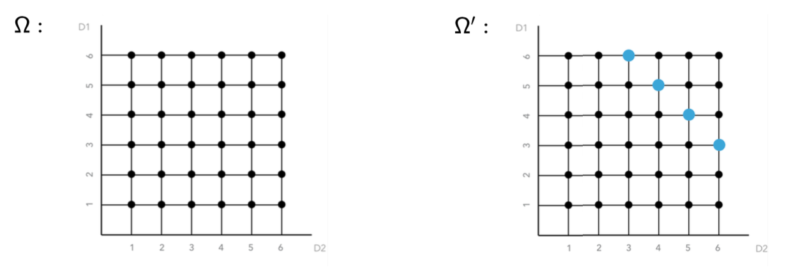
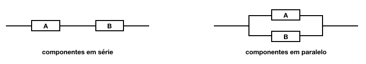

# Probabilidade Condicional e Independência


Até agora, tratamos de probabilidades da seguinte maneira:  primeiro, associado a um experimento aleatório, define-se um espaço amostral $\Omega$  para, em seguida, calcular todas as probabilidades de interesse com relação a esse espaço amostral.

Em muitas situções, no entanto, temos a possibilidade de **atualizar**, isto é, modificar o espaço amostral à luz de nova informação.

Em tais casos, é desejável sermos capazes de também atualizar os cálculos das probabilidades de interesses.

Isso significa que agora calcularemos probabilidades condicionais, ou seja, probabilidades que dependem de certos acontecimentos que sabemos terem ocorrido.

Sendo assim, probabilidades condicionais nos permitem analisar os resultados de um experimento aleatório (o que quer dizer que podemos calcular probabilidades), quando existe **intervenção** no espaço amostral; o espaço amostral foi modificado com a informação adicional que se obteve.

Nos exemplos a seguir, os eventos condicionantes, ou os acontecimentos prévios estão ressaltados em negrito. Esses eventos constituem informação adicional a respeito dos experimentos aleatórios investigados.

   
```{example}
```


Um dado é lançado duas vezes e **sabe-se que a soma dos resultados vale 9**. Qual a probabilidade de que o primeiro resultado tenha sido 6? 

O experimento aleatório consiste em lançar um dado duas vezes e observar o resultado do primeiro lançamento. Queremos calcular a probabilidade de que este resultado tenha sido '6'. 

Sem nenhuma informação adicional, sabemos que esta probabilidade vale 1/6, se o dado for honesto. Para chegar a esta conclusão, basta analisarmos o espaço amostral associado ao experimento, como mostra o diagrama, a seguir. 


```{r ch3-pcondicional-soma-dados, echo=FALSE, out.width = '100%', message=FALSE, warning=FALSE}

```


Nesse diagrama, temos uma representação do espaço amostral original: o eixo vertical (D1) representa os resultados possíveis para o primeiro dado, e no eixo horizontal (D2), temos os resultados possíveis para o segundo dado. Temos um total de 36 resultados possíveis para esse experimento (que correspondem às combinações dos seis resultados possíveis para cada um dos dados); e, deste total, é possível observar o resultado '6' para o primeiro dado de seis maneiras diferentes. 

Mas, temos a informação adicional de que a soma dos resultados vale '9'. O que essa informação adicional faz?... Ela restringe o meu espaço amostral original. Agora, nós sabemos que nem todas as possibilidades originais continuam sendo possíveis. 

Ao fornecer a informação adicional de que a soma dos dois resultados vale '9', o espaço amostral sofre uma modificação; dos 36 resultados incialmente possíveis, são compatíveis com a nova informação, apenas quatro resultados, representados em azul. Agora, das novas possibilidades, apenas em uma o resultado do primeiro dado é o número '6'; portanto, a probabilidade de obter '6' no primeiro dado é ser atualizada e agora vale 1/4.

Veja que, pelo fato de ter uma informação adicional, não é mais possível calcular a probabilidade de que o primeiro resultado tenha sido '6', com base no universo original, no espaço amostral associado ao experimento de lançar o dado duas vezes e observar o resultado do primeiro dado... agora, é necessário **condicionar** ao fato de que agora sabe-se que a soma dos dois resultados vale '9'.


```{example}
``` 


**Um objeto é detectado por um radar**. Qual a probabilidade de que seja um avião?

Este experimento aleatório consiste em observar um radar e verificar se houve detecção de um avião. Note que é possível que haja um avião e que o radar não seja capaz de detectá-lo; mas também é possível que o radar detecte a presença de um objeto que não é um avião. 

Por que a probabilidade desejada é uma probabilidade condicional? Qual é o evento que está modificando o espaço amostral original, ou seja, qual é o evento condicionante? Este evento é justamente a informação adicional adquirida. Neste caso, essa informação corresponde ao fato de que a detecção ocorreu. 

Portanto, o espaço amostral original sofre uma alteração, já que eliminamos a possibilidade de um avião passar sem ser detectado e, com isso, a probabilidade associada ao evento desejado também é modificada.

Agora, sabendo que houve a detecção (e conhecendo com que probabilidade isto ocorre), resta calcular a probabilidade de que o objeto detectado seja um avião.


```{example}
```


Qual a probabilidade de que o paciente esteja doente, **dado que o teste deu negativo?**

Neste exemplo, temos uma situação semelhante à do exemplo anterior: um paciente desconfia de que esteja doente e se submete a um teste laboratorial. Antes de realizar o teste, tem uma determinada probabilidade de estar doente, determinada pela incidência da doença na população a que pertence. Ele faz um teste e o resultado é negativo.  À luz deste resultado, qual é a probabilidade de que ele **esteja doente**, e que o resultado corresponda a um falso negativo? A informação fornecida pelo resultado do teste é útil? 

Dependendo da qualidade do teste, sim. Pois os testes comumente têm uma certa sensibilidade (que corresponde à capacidade do teste identificar corretamente a presença da doença; é o verdadeiro positivo) e uma especificidade (que corresponde à capacidade do teste dar resultado negativo quando o paciente não tem a doença sendo investigada; o verdadeiro negativo). Sendo assim, conhecendo as características teste, a incidência da doença na população de interesse e a informação de que o resultado deu negativo, temos elementos para atualizar nosso cálculo da probabilidade de que o paciente esteja, de fato, doente, a despeito do resultado negativo obtido.

Novamente, estamos diante de uma situação em que ocorre intervenção no espaço amostral.

Nós podemos, então, atualizar as probabilidades de eventos, quando obtemos nova informação, através do cálculo de probabilidades condicionais. 


## Probabilidade Condicional


Sejam A e B dois eventos associados a um experimento aleatório E e definidos em um espaço amostral $\Omega$; ; então A e B são dois conjuntos de resultados possíveis para esse experimento aleatório. 

Define-se a **probabilidade condicional do evento A ao evento B** como sendo a razão entre a probabilidade da ocorrência simultânea dos eventos A e B e a probabilidade de ocorrência do evento B.

$$P[A|B] \stackrel{\Delta}{=} \frac{P[AB]}{P[B]}, \quad P[B] > 0 $$
onde P[A|B] é a probabilidade condicional de A, dado B.  

O evento A é chamado **evento condicionado**.  
O evento B é chamado **evento condicionante** ou **espaço amostral reduzido**.

A probabilidade condicional $P[A|B]$ é a probabilidade de o evento A ocorrer, DADO QUE (sabendo-se que) o evento B ocorreu.

Queremos calcular a probabilidade de ocorrência do evento A condicionada à ocorrência anterior do evento B. Portanto, A é chamado evento condicionado e B é o evento condicionante, ou seja, é aquele que ocorreu. Obviamente, a probabilidade de B deve ser maior que zero, pois não podemos condicionar a ocorrência de um evento à ocorrência de algo que é impossível de acontecer, ou seja, que tem probabilidade zero.

O evento B passa a ser o novo espaço amostral. Temos certeza da ocorrência do evento B, considerando que a informação adicional seja verdadeira. Assim, a probabilidade de B dado que B ocorreu vale 1. A probabilidade condicional é a proporção desse novo espaço amostral B "ocupada" pelo evento A (lógico que isso só acontece com a interseção entre A e B). Então, a probabilidade de A dado B representa quanto da chance de ocorrência de B pode ser representada como a chance de ocorrência de AB.

Uma informação adicional sempre restringe o número de possibilidades do espaço amostral original.  Quando condicionamos a ocorrência do evento A à ocorrência do evento B, isso significa que eliminamos todos os outros resultados prévios possíveis que não incluam B. Com isso, estamos transformando ou reduzindo o espaço amostral ao evento B. Uma informação adicional sempre restringe o número de possibilidades do espaço amostral original. Por esse motivo, B também é chamado de espaço amostral reduzido.

**Regra do Produto**

Na definição de probabilidade condicional, se passarmos o denominador multiplicando para o outro lado da igualdade, temos a chamada **regra do produto**, que expressa a probabilidade de A e B ocorrerem simultaneamente em função de probabilidades condicionais. 

Posso condicionar a ocorrência de A com relação a B. Então a probabilidade de A e B ocorrerem simultaneamente é a probabilidade condicional de A dado B, vezes a probabilidade de o evento condicionante B ocorrer. 

Mas também posso escrever a probabilidade de A e B em termos da probabilidade condicional de B dado A vezes a probabilidade de A, que agora é o evento condicionante.

$P[AB] = P[A|B] P[B] = P[B|A] P[A] \qquad$ (Regra do Produto)


### Propriedades {-}


Probabilidade condicional é função probabilidade; isto significa que ela é uma medida de incerteza válida e, portanto precisa satisfazer os três axiomas de Kolmogorov.

Isso quer dizer que: (i) probabilidade condicional precisa ser um número não negativo; (ii) a probabilidade do espaço amostral condicionada à ocorrência do evento B vale 1; e  (iii) se tivermos uma coleção infinita de eventos mutuamente exclusivos, então a probabilidade da união desses eventos mutuamente exclusivos condicionada a um evento B vai ser igual à soma das probabilidades condicionais de cada um desses eventos.

(1) $P[A|B] \geq 0$ 

(2) $P[\Omega|B] = 1$   

(3) $A_1, A_2, \ldots$ tais que $A_i \cap A_j = \varnothing, \; \forall i\neq j \Rightarrow \; P[\cup_i A_i |B] = \sum_i P[A_i|B]$  

(4) $P[A^c|B] = 1 - P[A|B]$ <br>   
No entanto, geralmente, $P[A|B^c] \neq 1 - P[A|B]$
    
(5) $P[A \cup B|C] = P[A|C] + P[B|C] - P[A B|C], \; P[C]>0$  

(6) $AB = \varnothing \; \Rightarrow \; P[A|B] = 0$  

(7) $B \subset A \; \Rightarrow \; P[A|B] = 1$  


Como probabilidade condicional satisfaz os três axiomas que definem função probabilidade, 
também satisfaz às propriedades decorrentes dos axiomas. Existe um número muito grande de propriedades, das quais apenas algumas são apresentadas aqui... É importante estudar cuidadosamente essas propriedades.

Em tempo, vale uma última observação: Não existe relação entre as probabilidades condicionais e as probabilidades a priori correspondentes. Então a probabilidade condicional de A dado B pode ser menor ou maior ou igual à probabilidade de A, não condicionada, de forma que podemos ter:  

$\quad P[A|B] < P[A] \quad$ ou $\quad P[A|B] > P[A] \quad$ ou $\quad P[A|B] = P[A]$ 

O conceito de probabilidade condicional leva à noção de independência de eventos, conforme veremos a seguir.


## Independência de Eventos


Um outro conceito associado a probabilidade condicional que precisamos discutir é o conceito de independência.

Dois eventos A e B são independentes quando (e essa condição é necessária e suficiente) ao obter uma informação adicional, a probabilidade original (a priori) não se modifica.

A probabilidade de A condicionada a ocorrência de B é igual à probabilidade a priori de A; o mesmo ocorre, se o evento condicionante passa a ser A e o condicionado é o evento B. 

Consequentemente, a probabilidade da ocorrência simultânea de dois eventos A e B é igual ao produto das probabilidades de cada um desses eventos.

Portanto, dois eventos A e B são ditos **independentes** se, e somente se:

$$P[A|B] = P[A]; \qquad  P[B|A] = P[B]$$

$$\Longrightarrow P[AB] 
  = P[A|B] P[B] = P[B|A] P[A]
  = P[A] P[B]$$

Quando dois eventos são estatisticamente independentes, a ocorrência de um não exerce nenhuma influência na probabilidade de ocorrência do outro. É importante ter em mente que independência é hipótese (não é de natureza estatística).


### Propriedades {-}


Seguem então algumas propriedades associadas a eventos independentes:

(1) Para qualquer evento A, contido no espaço amostral $\forall A \subset \Omega$:  
+ $A$ e $\varnothing$ são independentes  
+ $A$ e $\Omega$ são independentes

(2) E, se tivermos dois eventos independentes A e B, contidos no espaço amostral, $\forall A, B \subset \Omega$, com $A$ e $B$ independentes:
+ ${A^c}$ e ${B^c}$  
+ ${A}$ e ${B^c}$  
+ ${A^c}$ e ${B}$  .... também são independentes.

Essas propriedades são válidas para um par de eventos independentes. 

Vejamos agora as condições de independência quando temos uma coleção maior de eventos, digamos $n$ eventos. 

Para garantir independência aos pares basta garantir que a probabilidade da ocorrência simultânea de um par qualquer desses eventos é o produto das probabilidades marignais de cada um dos eventos:

(3) ${A_1, A_2, \ldots A_n}$ são independentes aos pares se
    $${P[A_iA_j] = P[A_i]P[A_j], \quad \forall i \neq j}$$
    
Note que essa condição que era necessária e suficiente para garantir independência de um par de eventos, agora não vai garantir que todos os eventos que compõe essa coleção sejam mutuamente independentes.     

Para garantir que essa coleção seja globalmente independente, precisamos garantir independência dois-a-dois, três-a-três e assim, sucessivamente, até n-a-n. Então a probabilidade de interseção (i.e., a probabilidade conjunta) vai ser igual ao produto das probabilidades marginais para cada subconjunto dessa coleção. 

(4) ${A_1, A_2, \ldots A_n}$ são **globalmente independentes** se  
    ${\forall k \leq n}$, quaisquer que sejam os eventos ${A_{i(1)}, A_{i(2)}, \ldots, A_{i(k)}}$, temos:
    $${P[A_{i(1)} A_{i(2)} \ldots A_{i(k)}] = P[A_{i(1)}] \cdots P[A_{i(k)k}]},$$
    onde ${i(j) \neq i(m)}$ se ${i \neq j}$.

Temos um número muito grande de condições a verificar para garantir independência mútua de todos os eventos que compõe essa coleção: 

${\sum_{k=2}^n \binom{n}{k} = \sum_{k=0}^n \binom{n}{k} -  \binom{n}{0} - \binom{n}{1} = 2^n - n -1}$ (T.Bin. de Newton)

Essas condições correspondem a todas as igualdades de produtos que precisamos verificar: 2-a-2, 2-a-2 e, assim por diante. Se os eventos forem globalmente independentes, podemos tomar conjuntos de eventos 2-a-2, 3-a-3, ..., n-a-n e a probabilidade de interseção é o produto das probabilidades marginais.


### Independência Condicional {-}


Se dois eventos A e B são independentes quando condicionados a um terceiro evento C, isto é, quando a probabilidade de ocorrência simultânea de A e B, sabendo que C ocorreu é igual ao produto das probabilidades condicionais de A dado C e B dado C, os eventos A e B são ditos **condicionalmente independentes**, isto é, dois eventos A e B são ditos condicionalmente independentes com relação a um evento C se

$${P[AB|C] = P[A|C]P[B|C]}$$


### Eventos Independentes x Eventos Mutuamente Exclusivos {-}


Para finalizar, é importante a atenção para um ponto que pode causar confusão a muitos alunos: não devemos confundir eventos independentes e eventos mutuamente exclusivos. 

Eventos independentes são aqueles para os quais a ocorrência de um não exerce nenhuma influencia na ocorrência do outro; já eventos mutuamente exclusivos são aqueles em que há dependência perfeita, ou seja, a ocorrência de um garante (dá a certeza da)  impossibilidade da ocorrência do outro. Eles nunca podem ocorrer simultaneamente.


```{example name="Aplicação: Confiabilidade de Sistemas"}
```


Uma aplicação interessante de independência de eventos é a análise de confiabilidade de sistemas. A confiabilidade é medida pela probabilidade de que o sistema não falhe, ou em outras palavras, de que o sistema continue a operar.

Normalmente, queremos determinar a confiabilidade de um sistema a partir das confiabilidades conhecidas das partes (individuais ou subsistemas) que compõe esse sistema de interesse. E essa informação pode ser utilizada, por exemplo, para decidir dentre algumas alternativas aquela que atende aos requisitos de projeto da melhor maneira.

Neste sentido, é comum adotar a seguinte nomenclatura: a probabilidade de falha do componente também é chamada taxa de falha do componente. 

**Confiabilidade do sistema** = P[sistema funcionar] = P[sistema não falhar] = 1 - Ps

Vamos considerar, para fins de ilustração, um sistema formado por apenas dois componentes: A e B. Esses componentes podem estar dispostos dentro do sistema em série ou em paralelo. 


```{r ch3-confiabilidade, echo=FALSE, out.width = '100%', message=FALSE, warning=FALSE}

```


E vamos definir os seguintes eventos de interesse:

A = componente 'A' falha  
B = componente 'B' falha

Quando os componentes estão distribuídos em série o sistema só funciona se A e B estiverem ambos funcionando simultaneamente. Portanto, se pelo menos um dos componentes que estão organizados em série falhar, o sistema falha. Então o sistema falha se A falha ou se B falha, ou se A e B falham simultaneamente. Sendo assim, a probabilidade de falha do sistema com componentes em série é dada pela probabilidade da união dos eventos A e B. Empregando as propriedades decorrentes da definição axiomática, essa probabilidade é dada por:

**Em série:** Ps = P[A U B] = P[A] + P[B] - P[AB]

Este resultado pode ser facilmente visualizado utilizando um diagrama de Venn.

Por outro lado, para o sistema em paralelo, o sistema só falha se for observada a falha simultânea dos dois componentes. Caso contrário, se pelo menos um deles funcionar, o sistema continua funcionando. Sendo assim, a probabilidade de o sistema com componentes em paralelo falhar corresponde à probabilidade de A e B falharem ao mesmo tempo. Assumindo independência do funcionamento dos componentes, essa probabilidade é igual ao produto das probabilidade de falha de cada um dos componentes A e B.


**Em paralelo:** Ps = P[AB] = P[A] x P[B] (sob independência)

Por esse motivo, os sistemas em paralelo são chamados sistemas redundantes!


```{example}
```


Um certo avião com quatro turbinas precisa de duas ou mais turbinas funcionando para garantir a segurança de vôo. Um outro avião tem duas turbinas e precisa de pelo menos uma turbina funcionando para voar em segurança. Considere que as turbinas sejam independentes e cada uma tem uma probabilidade $p$ de funcionar corretamente durante um vôo. *Qual avião é mais seguro e em que condições?*

Este é um exemplo simples que envolve o conceito de independência para comparar a confiabilidade dos dois tipos de aeronaves.

Vamos iniciar pela solução analítica desse problema.

**Solução analítica**

Em primeiro lugar, precisamos definir os eventos associados ao experimento aleatório. Assim, sejam  os seguintes eventos:

T2 = o avião de 2 turbinas (A2) faz pouso forçado  
T4 = o avião de 4 turbinas (A4 )faz pouso forçado  

Precisamos calcular a probabilidade de pouso forçado para cada um dos tipos de aeronaves, P[T2] e P[T4]. 

Quando temos pouso forçado para o avião de duas turbinas?
Quando uma ou as duas turbinas falham. Ou seja em termos dos eventos complementares, a probabilidade de pouso forçado é igual a 1 - a probabilidade de o sistema funcionar. O sistema funciona com uma ou duas turbinas funcionando. Então a probabilidade de pouso forçado para A2 vale:


\begin{align*}
P[T2]
&= 1 - P[\text{uma turbina funcionando OU duas turbinas funcionando}]\\
&= 1 - P[\text{uma turbina funcionando}] - P[\text{duas turbinas funcionando}]\\
&= {1-{{2}\choose{1}}(1-p)p + p^2 = 1 + p^2 - 2p}
\end{align*}


Vamos entender o que representam essas parcelas: no primeiro termo, temos uma turbina funcionando e duas turbinas disponíveis; a p[uma turbina funcionar] vale $p$ e de não funcionar vale $1-p$; portanto, temos o produto $(1-p) \times p$, mas precisamos identificar de quantas maneiras podemos ter uma turbina funcionando de um total de duas turbinas disponíveis: esse número é dado pela combinação de 2 1-a-1. No caso de duas turbinas funcionando, a probabilidade é $p \times p = p^2$. Portanto, a probabilidade de pouso forçado para o avião de duas turbinas é $1 + p^2 - 2p$.

O avião de 4 turbinas faz pouso forçado quando três ou quatro turbinas falham. Utilizando o raciocínio análogo ao do caso anterior, a probabilidade de pouso forçado para A4 vale:


\begin{align*}
P[T4] 
&= 1 - P[\text{duas funcionando OU três funcionando OU quatro  funcionando}]\\
&= 1 - P[\text{duas funcionando}] - P[\text{três funcionando}] - P[\text{quatro funcionando}]\\
&= 1 - {{4}\choose{2}}p^2(1-p)^2 - {{4}\choose{3}}p^3(1-p) - p^4 = 1 - 3p^4 + 8 p^3 - 6p^2
\end{align*}


O avião de 4 turbinas é mais seguro que o avião de 2 turbinas se, e somente se, P[T4] < P[T2]. Fica como exercício verificar que isso é verdade para $p > 2/3$. Note que este resultado se baseia na hipótese de independência de funcionamento das turbinas!

Abaixo, temos uma representação gráfica da solução analítica (e o código utilizado para obtê-la): a curva em azul corresponde à probabilidade de pouso forçado para o aviao de 2 turbinas e a curva em vermelho é a probabilidade de pouso forçado para o aviao de 4 turbinas. Note que quando a probabilidade de falha de cada turbina é maior que 2/3 (valor representado pela reta tracejada vertical) o avião de quatro turbinas passa a ser mais seguro, pois sua probabilidade de pouso forçado é menor que aquela para o aviao de 2 turbinas.


```{r ch3-confiabilidade-sol-analitica, echo = FALSE,  out.width = '100%', fig.height = 3, message=FALSE, warning=FALSE}
library(tidyverse)
# para gráficos com fundo branco
theme_set(theme_minimal()) 

# funções para probabilidades teoricas
x <- seq(0, 1, by = 0.01)
p4.fcn <- function(p) 1 - 3*p^4 + 8 * p^3 - 6 * p^2
p2.fcn <- function(p) 1 + p^2 - 2 * p

# tabela de dados
turbinas <- data.frame(x = x, 
                       p4 = p4.fcn(x), p2 = p2.fcn(x))

# cores para curvas e legenda
colors <- c("T4" = "red", "T2" = "blue")

# gráfico da solução analítica
ggplot(turbinas, aes(x=x)) + 
  geom_line(aes(y = p4, color = "T4"), size = 1.5) + 
  geom_line(aes(y = p2, color = "T2"), size = 1.5) +
  geom_vline(aes(xintercept = 2/3), lty = 'dashed')+
  labs(x = "\nP[funcionamento de cada turbina]", 
       y = "P[pouso forçado]\n", 
       color = "Legenda") +
  scale_color_manual(values = colors)
```


```{r ch3-confiabilidade-sol-analitica-code, eval=FALSE}
library(tidyverse)
theme_set(theme_minimal()) # para gráficos com fundo branco

# funções para probabilidades teoricas
x <- seq(0, 1, by = 0.01)
p4.fcn <- function(p) 1 - 3*p^4 + 8 * p^3 - 6 * p^2
p2.fcn <- function(p) 1 + p^2 - 2 * p

# tabela de dados
turbinas <- data.frame(x = x, p4 = p4.fcn(x), p2 = p2.fcn(x))

# cores para curvas e legenda
colors <- c("T4" = "red", "T2" = "blue")

# gráfico da solução analítica
ggplot(turbinas, aes(x=x)) + 
  geom_line(aes(y = p4, color = "T4"), size = 1.5) + 
  geom_line(aes(y = p2, color="T2"), size = 1.5) +
  geom_vline(aes(xintercept = 2/3), lty = 'dashed')+
  labs(x = "P[funcionamento de cada turbina]", 
       y = "P[pouso forçado]", color = "Legenda") +
  scale_color_manual(values = colors)
```


**Solução computacional**  

Vamos resolver agora este problema através de simulação. Primeiro, Vamos construir uma função para simular voos para cada uma das aeronaves: ela se chama `simula.voo` e recebe como argumentos a probabilidade de cada turbina funcionar perfeitamente e o no. de voos simulados `nS`.


```{r ch3-confiabilidade-simula-voo-fcn}
simula.voo <- function(p, nS){
    ### Args:
    # p      : probabilidade de funcionamento perfeito (cada turbina)
    # nS     : no. de voos simulados
    ### Resposta:
    # ans$frel.2 : freq. relativas de pousos forcados para avião com 2 turbinas
    # ans$frel.4 : freq. relativas de pousos forcados para avião com 4 turbinas
    ans <-c()
    # Atribui status para as turbinas de cada aviao para cada um 
    # dos `nS` voos realizados. 
    # Os resultados sao registrados em matrizes:
    # cada linha corresponde a um voo simulado; 
    # cada coluna corresponde a uma turbina
    voos.2 <- matrix(sample(c(0,1), 2*nS, replace=TRUE, prob=c(1-p, p)), 
                     ncol = 2, nrow = nS)  # aviao de 2 turbinas
    voos.4 <- matrix(sample(c(0,1), 4*nS, replace=TRUE, prob=c(1-p, p)), 
                     ncol = 4, nrow = nS)  # aviao de 4 turbinas
    # Verifica se o voo foi mal sucedido (pouso forcado)
    voo.fail.2 <- rowSums(voos.2) < 1
    voo.fail.4 <- rowSums(voos.4) < 2
    # Calcula frequencia relativa de pousos forcados
    ans$frel.2 <- cumsum(voo.fail.2)/(1:nS)
    ans$frel.4 <- cumsum(voo.fail.4)/(1:nS)
    # Retorna as frequencias relativas de pousos forçados
    return(ans)
}
```


Vamos utilizar a função construída para simular voos e estimar a probabilidade de pousos forçados para cada um dos tipos de aeronaves. Ao utilizar essa função apenas uma vez, temos apenas uma estimativa das probabilidades desejadas, com base em um caminho aleatório de tamanho `nS`. A fim de construir uma distribuição aproximada de frequências relativas que estimam a probabilidade de pouso forçado, precisamos repetir esse procedimento um número `nRep` grande de vezes, para cada valor de probabilidade `p` de funcionamento das turbinas. Para isso, será criada uma função que realiza uma simulação de Monte Carlo, ou seja vamos replicar os `nS` voos simulados `nRep` vezes.

A função abaixo realiza `nRep` replicações de `nS` vôos simulados:


```{r ch3-confiabilidade-simula-MC-fcn}
simula.MC <- function(p, nRep, nS){
  ans <- c()
  # gera estrutura para receber resultados
  frel.2 <- frel.4 <- c()  # cada coluna corresponde a um voo simulado
                           # cada linha corresponde a uma replicação  
  # Realiza simulacao de Monte Carlo
  for (i in 1:nRep){
    voos <- simula.voo(p, nS)
    frel.2 <- rbind(frel.2, voos[[1]])
    frel.4 <- rbind(frel.4, voos[[2]])
  }
  # Retorna frequencias relativas
  ans$frel.2 <- frel.2
  ans$frel.4 <- frel.4
  return(ans)
}
```


A seguir, vamos definir o número de replicações `nRep` e o número de vôos simulados. A fim de ilustrar o processo, vamos simular com probabilidade de funcionamento individual das turbinas igual a 50% (ou seja, vc joga uma moeda honesta para determinar se cada turbina vai funcionar...)


```{r ch3-confiabilidade-sim-setup, eval = TRUE, cache=TRUE}
# Setup da simulação
nRep <- 100    # no. de replicacoes do experimento
nS   <- 2000   # no. de voos simulados
p    <- 0.5   

# Roda simulação
sim.data <- simula.MC(p, nRep, nS)

# Armazena resultados da simulação
# Frequencias relativas de pousos forçados
frel.2 <- sim.data$frel.2  # avião de 2 turbinas
frel.4 <- sim.data$frel.4  # avião de 4 turbinas
```


Neste exemplo, os caminhos aleatórios, a partir dos quais as frequências relativas de pousos forçados são calculadas, têm tamanho `r nS` e um total de `r nRep` replicações, que correspondem ao número de caminhos percorridos.

O código abaixo produz as figuras que analisaremos em seguida.


```{r ch3-confiabilidade-sol-comp-code, eval=FALSE}
### Gráficos `sample paths` (caminhos aleatórios)
plot(NULL, type="n", main = "",
     xlim = c(0, nS), ylim = c(0,1),
     xlab = "no. voos simulados",
     ylab = "Freq. relativa pousos forçados")

# Para aviao de 2 turbinas
for(i in 1: nRep) lines(frel.2[i,], col="blue") 
# Para aviao de 4 turbinas
for(i in 1: nRep) lines(frel.4[i,], col="red")

# probabilidades teóricas
abline(h = c(p2.fcn(p), p4.fcn(p)), 
       lty = "dashed", col = c("blue", "red"), lwd = 2)
# Legenda
leg.text <- c("2 turbinas", "4 turbinas")
legend("topright", leg.text, 
       bty = "n", pch = c(19,19), col = c("blue", "red"))

### Histogramas
# Para aviao de 2 turbinas
hist(frel.2[,nS], 
     xlim = c(0, 1), col = "blue",  
     density = 45,  # preenche com linhas coloridas
     main = "",
     xlab = "Freq. relativa de pousos forçados")
# Para aviao de 4 turbinas
hist(frel.4[,nS], add = TRUE, density = 45,
     xlim = c(0, 1), col = "red", 
     main = " ", xlab = "")
# probabilidades teóricas
abline(v = c(p2.fcn(p), p4.fcn(p)),  
       lty = "dashed", col = c("blue", "red"), lwd = 2)
# Legenda
leg.text <- c("2 turbinas", "4 turbinas")
legend("topright", leg.text, 
       bty = "n", pch = c(19,19), col = c("blue", "red"))
```


```{r ch3-confiabilidade-sol-comp-0-5, echo=FALSE, fig.cap='Resultados da simulação para p = 0,5.', out.width = '100%', fig.height=3, message=FALSE, warning=FALSE}
par(mfrow = c(1,2), 
    mar=c(4, 4, 1, 1)#, 
    #cex.lab = 0.7, cex.axis = 0.7
    )
### Gráficos `sample paths` (caminhos aleatórios)
plot(NULL, type="n", main = "",
     xlim = c(0, nS), ylim = c(0,1),
     xlab = "no. voos simulados",
     ylab = "Freq. relativa pousos forçados")

# Para aviao de 2 turbinas
for(i in 1: nRep) lines(frel.2[i,], col="blue") 
# Para aviao de 4 turbinas
for(i in 1: nRep) lines(frel.4[i,], col="red")

# probabilidades teóricas
abline(h = c(p2.fcn(p), p4.fcn(p)), 
       lty = "dashed", col = c("blue", "red"), lwd = 2)
# Legenda
leg.text <- c("2 turbinas", "4 turbinas")
legend("topright", leg.text, #cex = 0.7,
       bty = "n", pch = c(19,19), col = c("blue", "red"))

### Histogramas
# Para aviao de 2 turbinas
hist(frel.2[,nS], 
     xlim = c(0, 1), col = "blue",  
     density = 45,  # preenche com linhas coloridas
     main = "",
     xlab = "Freq. relativa de pousos forçados")
# Para aviao de 4 turbinas
hist(frel.4[,nS], add = TRUE, density = 45,
     xlim = c(0, 1), col = "red", 
     main = " ", xlab = "")
# probabilidades teóricas
abline(v = c(p2.fcn(p), p4.fcn(p)),  
       lty = "dashed", col = c("blue", "red"), lwd = 2)
# Legenda
leg.text <- c("2 turbinas", "4 turbinas")
legend("topright", leg.text, #cex = 0.7,
       bty = "n", pch = c(19,19), col = c("blue", "red"))
```


O gráfico da esquerda mostra os `r nRep` caminhos aleatórios que foram percorridos para os `r nS` voos simulados. Em vermelho temos a evolução dos valores calculados para as frequências relativas de pousos forçados para o avião de 4 turbinas e em azul, para o avião de 2 turbinas. Como era de se esperar, a frequência de pousos forcados é maior para o avião de 4 turbinas. As retas horizontais tracejadas correspondem aos valores teóricos. O gráfico à direita mostra as distribuições de frequência relativa de pousos forçados para cada aeronave, para caminhos aleatórios de tamanho `nS`.

O mesmo processo é repetido para p = 2/3:


```{r ch3-confiabilidade-sol-comp-2-3, echo=FALSE, fig.cap='Resultados da simulação para p = 2/3.', out.width = '100%', fig.height=3, message=FALSE, warning=FALSE}
# Gera dados
p <- 2/3   

sim.data <- simula.MC(p, nRep, nS)

frel.2 <- sim.data$frel.2
frel.4 <- sim.data$frel.4

par(mfrow = c(1,2), 
    mar=c(4, 4, 1, 1)#, 
    #cex.lab = 0.7, cex.axis = 0.7
    )
### Gráficos `sample paths` (caminhos aleatórios)
plot(NULL, type="n", main = "",
     xlim = c(0, nS), ylim = c(0,1),
     xlab = "no. voos simulados",
     ylab = "Freq. relativa pousos forçados")

# Para aviao de 2 turbinas
for(i in 1: nRep) lines(frel.2[i,], col="blue") 
# Para aviao de 4 turbinas
for(i in 1: nRep) lines(frel.4[i,], col="red")

# probabilidades teóricas
abline(h = c(p2.fcn(p), p4.fcn(p)), 
       lty = "dashed", col = c("blue", "red"), lwd = 2)
# Legenda
leg.text <- c("2 turbinas", "4 turbinas")
legend("topright", leg.text, #cex = 0.7,
       bty = "n", pch = c(19,19), col = c("blue", "red"))

### Histogramas
# Para aviao de 2 turbinas
hist(frel.2[,nS], 
     xlim = c(0, 1), col = "blue",  
     density = 45,  # preenche com linhas coloridas
     main = "",
     xlab = "Freq. relativa de pousos forçados")
# Para aviao de 4 turbinas
hist(frel.4[,nS], add = TRUE, density = 45,
     xlim = c(0, 1), col = "red", 
     main = " ", xlab = "")
# probabilidades teóricas
abline(v = c(p2.fcn(p), p4.fcn(p)),  
       lty = "dashed", col = c("blue", "red"), lwd = 2)
# Legenda
leg.text <- c("2 turbinas", "4 turbinas")
legend("topright", leg.text, #cex = 0.7,
       bty = "n", pch = c(19,19), col = c("blue", "red"))
```


Note que agora os caminhos aleatórios se confundem e as frequências relativas de pouso forçado tem aproximadamente mesma distribuição para os dois tipos de aeronaves. Este é o valor de `p` para o qual as duas aeronaves tem mesma confiabilidade.


```{r ch3-confiabilidade-sol-comp-0-8, echo=FALSE, fig.cap='Resultados da simulação para p = 0,8.', out.width = '100%', fig.height=3, message=FALSE, warning=FALSE}
# Gera dados
p <- 0.8  

sim.data <- simula.MC(p, nRep, nS)

frel.2 <- sim.data$frel.2
frel.4 <- sim.data$frel.4

par(mfrow = c(1,2), 
    mar=c(4, 4, 1, 1)#, 
    #cex.lab = 0.7, cex.axis = 0.7
    )
### Gráficos `sample paths` (caminhos aleatórios)
plot(NULL, type="n", main = "",
     xlim = c(0, nS), ylim = c(0,1),
     xlab = "no. voos simulados",
     ylab = "Freq. relativa pousos forçados")

# Para aviao de 2 turbinas
for(i in 1: nRep) lines(frel.2[i,], col="blue") 
# Para aviao de 4 turbinas
for(i in 1: nRep) lines(frel.4[i,], col="red")

# probabilidades teóricas
abline(h = c(p2.fcn(p), p4.fcn(p)), 
       lty = "dashed", col = c("blue", "red"), lwd = 2)
# Legenda
leg.text <- c("2 turbinas", "4 turbinas")
legend("topright", leg.text, #cex = 0.7,
       bty = "n", pch = c(19,19), col = c("blue", "red"))

### Histogramas
# Para aviao de 2 turbinas
hist(frel.2[,nS], 
     xlim = c(0, 1), col = "blue",  
     density = 45,  # preenche com linhas coloridas
     main = "",
     xlab = "Freq. relativa de pousos forçados")
# Para aviao de 4 turbinas
hist(frel.4[,nS], add = TRUE, density = 45,
     xlim = c(0, 1), col = "red", 
     main = " ", xlab = "")
# probabilidades teóricas
abline(v = c(p2.fcn(p), p4.fcn(p)),  
       lty = "dashed", col = c("blue", "red"), lwd = 2)
# Legenda
leg.text <- c("2 turbinas", "4 turbinas")
legend("topright", leg.text, #cex = 0.7,
       bty = "n", pch = c(19,19), col = c("blue", "red"))
```


Agora, para p = 0,8, veja como a frequência relativa de pousos forçados para a aeronave de duas turbinas passa a ser maior que aquela para a aeronave de 4 turbinas; isso significa que o avião com 4 turbinas passa a ter maior confiabilidade.


```{r ch3-confiabilidade-sol-comp-0-9, echo=FALSE, fig.cap='Resultados da simulação para p = 0,9.', out.width = '100%', fig.height=3, message=FALSE, warning=FALSE}
# Gera dados
p <- 0.9  

sim.data <- simula.MC(p, nRep, nS)

frel.2 <- sim.data$frel.2
frel.4 <- sim.data$frel.4

par(mfrow = c(1,2), 
    mar=c(4, 4, 1, 1)#, 
    #cex.lab = 0.7, cex.axis = 0.7
    )
### Gráficos `sample paths` (caminhos aleatórios)
plot(NULL, type="n", main = "",
     xlim = c(0, nS), ylim = c(0,1),
     xlab = "no. voos simulados",
     ylab = "Freq. relativa pousos forçados")

# Para aviao de 2 turbinas
for(i in 1: nRep) lines(frel.2[i,], col="blue") 
# Para aviao de 4 turbinas
for(i in 1: nRep) lines(frel.4[i,], col="red")

# probabilidades teóricas
abline(h = c(p2.fcn(p), p4.fcn(p)), 
       lty = "dashed", col = c("blue", "red"), lwd = 2)
# Legenda
leg.text <- c("2 turbinas", "4 turbinas")
legend("topright", leg.text, #cex = 0.7,
       bty = "n", pch = c(19,19), col = c("blue", "red"))

### Histogramas
# Para aviao de 2 turbinas
hist(frel.2[,nS], 
     xlim = c(0, 1), col = "blue",  
     density = 45,  # preenche com linhas coloridas
     main = "",
     xlab = "Freq. relativa de pousos forçados")
# Para aviao de 4 turbinas
hist(frel.4[,nS], add = TRUE, density = 45,
     xlim = c(0, 1), col = "red", 
     main = " ", xlab = "")
# probabilidades teóricas
abline(v = c(p2.fcn(p), p4.fcn(p)),  
       lty = "dashed", col = c("blue", "red"), lwd = 2)
# Legenda
leg.text <- c("2 turbinas", "4 turbinas")
legend("topright", leg.text, #cex = 0.7,
       bty = "n", pch = c(19,19), col = c("blue", "red"))
```


Finalmente, para p = 0,9, fica um pouco mais difícil de visualizar (teríamos que mudar as escalas dos gráficos, mas para fins de comparação, foram mantidas as mesmas escalas para todos os gráficos), mas ambas as confiabilidades se aproximam de 1, com o avião de 4 turbinas se mostrando mais seguro. 

Você pode modificar os parâmetros utilizados na simulação, `p`, `nS` e `nRep` e tentar entender como as conclusões obtidas a partir dos resultados da simulação são afetadas. 
