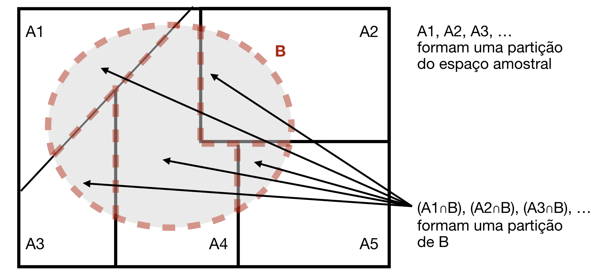
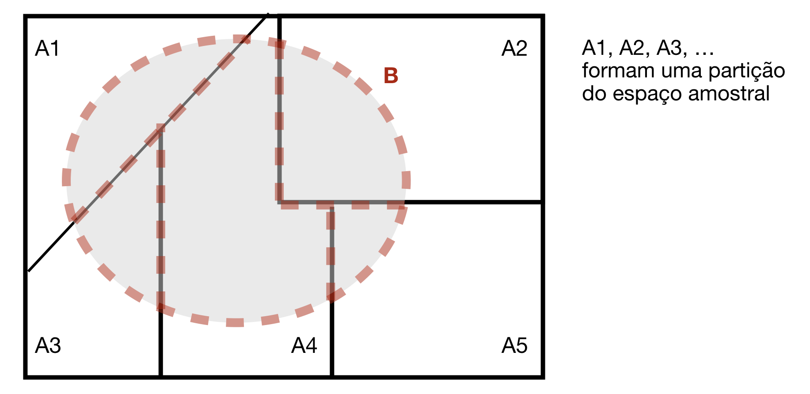

# Teoremas Fundamentais da Probabilidade


Veremos agora dois resultados em teoria de probabilidades que, somados ao conceito de independência, nos permitem resolver problemas de probabilidade bastante complexos; eles são os chamados teoremas fundamentais da probabilidade: o Teorema da Probabilidade Total e o Teorema de Bayes. Eles se apóiam na construção de uma partição adequada do espaço amostral. 

**Partição do Espaço Amostral**

Uma partição de ${\Omega}$ é um conjunto de eventos ${A_1, A_2, \ldots}$, tais que:

(i). ${P[A_i] > 0, \quad \forall i}$  

(ii). ${A_1, A_2, \ldots}$ são mutuamente exclusivos: ${A_i \cap A_j = \varnothing, \quad \forall i\neq j}$

(iii).  ${A_1, A_2, \ldots}$ são coletivamente exaustivos: ${\cup_{i} A_i = \Omega}$

Em outras palavras, (i) a probabilidade de cada um desses eventos deve ser maior do que zero; (ii) essa coleção é formada por eventos mutuamente exclusivos, o que quer dizer que nenhum par deles pode ocorrer simultaneamente (a interseção entre eles é nula); e, (iii)  esses eventos são coletivamente exaustivos, o que significa que a união de todos eles cobre de maneira completa o espaço amostral.

Temos abaixo exemplos gráficos de algumas partições possíveis. A primeira consiste em uma partição do espaço amostral em apenas dois eventos (neste caso, a partição é formada por um evento e o seu complementar); no segundo exemplo, temos uma partição finita e no terceiro, temos uma partição infinita.


```{r ch4-particao, echo=FALSE, fig.cap='Exemplos de partições do espaço amostral.', out.width = '100%', message=FALSE, warning=FALSE}
knitr::include_graphics("img/particao.png")
```


## Teorema da Probabilidade Total: ...dividir para conquistar!


O primeiro resultado a ser analisado é o teorema da probabilidade total, inspirado pelo princípio que os antigos romanos chamavam de "dividir para conquistar", ilustrado no diagrama abaixo.


```{r ch4-TPT, echo=FALSE, fig.cap='Ilustração do Teorema da Probabilidade Total.', out.width = '80%', message=FALSE, warning=FALSE}

```


Queremos calcular a probabilidade do evento B, representado no diagrama pela elipse em vermelho. No entanto, pode ser que seja muito difícil calcular essa probabilidade a partir da análise do espaço amostral. Então vamos tentar analisar o espaço amostral por partes: a caixa retangular representa o espaço amostral $\Omega$; vamos, então, escolher uma coleção de eventos $A_1, A_2, A_3, \ldots$, para os quais conseguimos calcular as probabilidades, de tal forma que esta coleção forme uma partição do espaço amostral, ou seja, esses eventos são mutuamente exclusivos e coletivamente exaustivos. 

**Partição do Espaço Amostral:** $\Omega = \cup_i A_i$  

De que maneira isto nos ajuda a calcular a probabilidade do evento B? Bem, como a união de todos os eventos $A_i$ corresponde ao espaço amostral, vamos então reescrever o evento B em termos dessa partição:

$B = B\cap \Omega = B \cap (\cup_i A_i) = \cup_i (BA_i) = (A_1B) \cup (A_2B) \cup \ldots \cup (A_kB)$  

O evento $B$ pode ser escrito como a interseção de $B$ com o espaço amostral, que por sua vez, é equivalente à união dos eventos que formam a partição. Sendo assim, o evento $B$ pode ser representado pela união das interseções de $B$ com cada um dos eventos que formam a partição. Note que, como os eventos que formam a partição são mutuamente exclusivos, também são mutuamente exclusivas as interseções dos eventos da partição com o evento $B$.

Sendo assim, utilizando as propriedades derivadas dos axiomas, podemos concluir que a probabilidade de $B$ vai ser igual a soma de cada uma das probabilidade de $A_i$ interseção $B$:

$P[B] = \sum_{i=1}^{k} P[A_iB]$  

Ainda assim, pode ser que não tenhamos meios de calcular as probabilidades dos termos $A_i\cap B$. Utilizando a regra do produto, podemos reescrever cada probabilidade conjunta de $A_i\cap B$ como sendo o produto da probabilidade condicional de B com relação ao evento da partição $A_i$ pela probabilidade de ocorrência de $A_i$. Obviamente, as probabilidades dos eventos que formam a partição são não nulas, pois nenhum evento que forma a partição pode ser o evento impossível.

De maneira resumida, o teorema da probabilidade total nos diz que podemos particionar o espaço amostral de uma maneira que nos seja conveniente (isto é, de forma que possamos calcular as probabilidades dos eventos que compõe a partição) para que, a partir daí, possamos calcular mais facilmente a probabilidade do evento $B$.

Se $P[A_i] >0, \quad i= 1, \ldots, k$:
$\quad P[B] = \sum_{i=1}^{k} P [B\cap A_i] = \sum_{i=1}^{k} P[B|A_i] P[A_i]$


## Teorema de Bayes: ...aprendendo pela experiência


Esse teorema representa o aprendizado pela experiência, em que experiência se refere a novas evidências, ou informação adicional que é obtida. O teorema de Bayes é comumente utilizado para realizar inferência, em que existe um certo número de causas que podem produzir um determinado efeito. O teorema de Bayes se aplica a situações em que  observamos o efeito e desejamos inferir a causa que o provocou.

Observamos o efeito representado pelo evento $B$; isso significa que o evento B constitui a evidência obtida e agora queremos determinar que possível causa, dentre os eventos $A_1, A_2, \ldots, A_k$, o provocou. Conhecemos as probabilidades a priori $P[A_i]$ das possíveis causas; elas são as probabilidades válidas antes da obtenção da nova evidência.

Com a observação do efeito $B$, obtemos informação adicional. Portanto, é necessário atualizar a crença a respeito das possíveis causas à luz dessa nova evidência.  Isto se dá através do cálculo das probabilidades *a posteriori* (que são probabilidades condicionais) de cada uma das possíveis causas, dado que o efeito $B$ foi observado. 


```{r ch4-TBayes, echo=FALSE, fig.cap='Ilustração do Teorema de Bayes.', out.width = '80%', message=FALSE, warning=FALSE}

```

Novamente, temos uma partição adequada do espaço amostral formada pelos eventos A1,...,Ak associados às causas; o evento B representa o efeito. Tanto os eventos que formam a partição, quanto o evento B não podem ser o evento impossível, então esses eventos têm valor de probabilidade maior do que zero.

$P[B] > 0$;   
$P[A_i] > 0, \quad i =1, \ldots,k$  

A probabilidade a posteriori desejada é a probabilidade condicional de a causa $A_j$ estar presente dado que o efeito B foi observado, e corresponde à razão entre a probabilidade conjunta de $A_j$ e $B$ dividida pela probabilidade de ocorrência do evento $B$. 

$$ P[A_j|B] = \frac{P[A_jB]}{P[B]} =\frac{P[B|A_j]P[A_j]}{\sum_{i=1}^{k} P[B|A_i] P[A_i]},  \qquad \forall \; j= 1, \ldots, k$$

onde:  

$P[A_i], P[A_j]$ : probabilidades *a priori*   
$P[B|A_i]:$ prob. de observar o efeito B quando a causa ${A_i}$ está presente;   
$P[A_j|B]:$ prob. de que a causa ${A_j}$ esteja presente, dado que o efeito ${B}$ foi observado.

No teorema de Bayes, a probabilidade conjunta do numerador foi reescrita com o auxílio da regra do produto como sendo a probabilidade condicional do efeito B dado que a causa $A_j$ estava presente vezes a probabilidade de a causa $A_j$ estar presente; no denominador, a probabilidade de $B$ foi reescrita na forma do teorema da probabilidade total, ou seja, em termos da partição do espaço amostral como função das possíveis causas.


```{example name="Utilizando os teoremas fundamentais da probabilidade para realizar inferência"}
```


Vamos supor que um paciente tenha sido submetido a um exame de raio-X e que uma mancha tenha sido observada. Esta é a evidência, o efeito que foi observado, o evento $B$.

Vamos supor, ainda, que estejamos interessados em determinar o que pode ter provocado esse efeito. Aí entra a necessidade da escolha inteligente de uma partição do espaço amostral; precisamos escolher uma partição do espaço amostral que ajuda a resolver o problema de nosso interesse.

Queremos determinar as chances de que essa mancha seja explicada por uma das potenciais causas apresentadas abaixo; essas possíveis causas precisam ser mutuamente exclusivas e coletivamente exaustivas a fim de constituir uma partição do espaço amostral:

+ Causa A1: o paciente tem COVID-19   
+ Causa A2: o paciente tem tuberculose   
+ Causa A3: outra causa   

Note que estamos preocupados em identificar se a mancha foi provocada por COVID-19 ou tuberculose; não estamos preocupados com as outras inúmeras possíveis explicações para a ocorrência de uma mancha num exame de raio-x. Não me interessa se o paciente está com pneumonia, se o paciente aspirou algum corpo estranho ou se o aparelho de raio-x está com defeito. Por esse motivo, a minha partição é formada pelos eventos: causa A1 (o paciente tem covid-19), causa A2 (o paciente tem tuberculose) ou causa A3 (a mancha foi provocada por outra causa).

Queremos então, calcular as probabilidades *a posteriori* dessas causas, dado que observamos uma mancha no exame de raio-X. Essas probabilidades podem ser calculadas utilizando o teorema de Bayes, mas para isso, são necessárias  algumas informações: precisamos conhecer as probabilidades *a priori* de cada uma das causas consideradas, bem como a probabilidade de observar uma mancha no raio-X,  independentemente da causa.

Considerando a história médica do paciente e, com base apenas no conhecimento da incidência dessas doenças na população brasileira, sabe-se que ele pode ter as possíveis condições (causas) com as seguintes probabilidades:

$${P[A1] = 0,02;  \quad  P[A2] = 0,01;  \quad  P[A3] = 0,97}$$ 
A avaliação do exame de raio-X nem sempre é perfeita e, por este motivo, nem sempre é possível chegar à conclusão correta. Tem-se as seguintes probabilidades de observar uma mancha no exame, dado que está presente cada uma das causas:

$${P[B|A1] = 0,90;  \quad  P[B|A2] = 0,95;  \quad  P[B|A3] = 0,07}$$ 

Na posse dessas informações, e *dado que a mancha foi observada, qual a probabilidade de o paciente ter COVID-19?*

Queremos: $P[A1|B]$

O primeiro passo consiste em representar no espaço amostral a partição considerada, composta pelos eventos $A1$, $A2$ e $A3$; e também vamos representar no espaço amostral o evento $B$. As interseções entre os eventos que formam a partição do espaço amostral e o evento $B$ formam uma partição de $B$. E, assim, podemos reescrever o evento $B$ em termos dessa partição.

Espaço amostral: $\Omega$  


```{r ch4-raio-x-venn, echo=FALSE, fig.cap='Representação do espaço amostral para o exemplo do raio-X.', out.width = '70%', message=FALSE, warning=FALSE}
knitr::include_graphics("img/raio-x-venn.png")
```


$A1$, $A2$, $A3$ formam uma partição de ${\Omega}$  
$A1B$, $A2B$, $A3B$ formam uma partição de $B$:  $A1B \cup A2B \cup A3B = B$

Usando a definição de probabilidade condicional, a probabilidade de que o paciente tenha COVID-19, dado que a mancha foi observada é dada pela razão da probabilidade da ocorrência simultânea de COVID-19 e de uma mancha no raio-X e a probabilidade de haver uma mancha no exame de raio-X. Com o auxílio da regra do produto, o numerador é reescrito em termos da probabilidade condicional de observar uma mancha no exame de raio-X, quando o paciente está acometido de COVID-19 vezes a probabilidade de que o paciente tenha COVID-19. E o denominador pode ser calculado através do teorema da probabilidade total, com base na partição do espaço amostral considerada.

$$P[A1|B] = \frac{P[A1B]}{P[B]} \stackrel{regra\\ prod.}{=}\frac{P[B|A1] P[A1]}{P[B]}$$

Precisamos calcular a probabilidade $P[B]$ utilizando uma partição adequada.  

Partição de $B$: $\quad B = A1B \cup A2B \cup A3B$

Portanto, 


\begin{align*}
P[B] 
&= P[A1B ∪ A2B ∪ A3B]\\
&= P[A1B] + P[A2B] + P[A3B]\\
&= P[B|A1] P[A1] + P[B|A2] P[A2] + P[B|A3] P[A3]\\
&= 0,9 \times 0,02 + 0,95 \times 0,01 + 0,07 \times 0,97 = 0,0954
\end{align*}


$P[B]$ é a probabilidade da união dos eventos que constituem uma partição de $B$; como esses eventos são mutuamente exclusivos, a probabilidade da união é igual à soma das probabilidades de cada um deles. E essas probabilidades conjuntas podem ser reescritas em função das probabilidades condicionais e probabilidades *a priori* conhecidas de cada uma das causas estar presente. Então, a probabilidade de ocorrência de uma mancha no exame de raio-X, qualquer que seja a causa, vale  aproximadamente 9,5%.

E, assim,

$$P[A1|B] = \frac{P[B|A1]P[A1]}{P[B]}=\frac{0,9 \times 0,02}{0,0954} = \frac{0,0180}{0,0954} = 0,1887.$$

Portanto, a probabilidade de o paciente ter COVID-19, dado que a mancha foi observada vale aproximadamente 19%. Podemos repetir o mesmo procedimento para as outras causas, obtendo as seguintes probabilidades:  
$P[A2|B] = 0,0996$ e $P[A3|B] = 0,7117$.

Chegamos à conclusão que a probabilidade de o paciente ter tuberculose é de cerca de 10% e a probabilidade de o paciente não ter essas doenças é próxima de 71%, dado que foi detectada uma mancha no exame de raio-X.

Podemos fazer algumas reflexões a respeito desses resultados obtidos: antes do exame de raio-X, havia uma probabilidade *a priori* igual a 2% de o paciente ter COVID-19. Após o resultado positivo do exame (a observação da mancha), essa probabilidade passou a ser de aproximadamente 19% de que o paciente esteja com COVID-19. Nossa crença a respeito da presença da causa COVI-19 aumentou de 2% para 19%, após as evidências que foram obtidas.  Esta é exatamente a ideia central que o Teorema de Bayes representa e que esse exemplo bem ilustra: quando novas evidências são obtidas, a crença original (*a priori*) é atualizada (*a posteriori*) . No exemplo, se o médico desejar ter mais certeza de que o paciente, de fato, tem COVID-19, novas evidências são necessárias (ou seja, o paciente pode ser submetido a exames adicionais). E, assim, a probabilidade de o paciente ter COVID-19 pode ser novamente atualizada.
