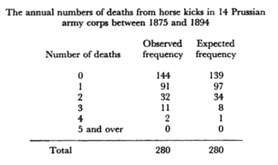
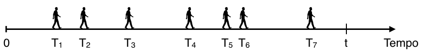
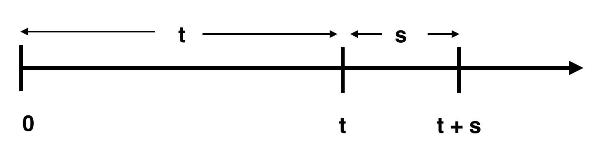

# Modelos Probabilísticos: Distribuições Associadas a Processos de Poisson


No capítulo anterior, estudamos algumas distribuições associadas aos chamados processos de Bernoulli, formados por sequências de experimentos aleatórios independentes, para os quais há apenas dois resultados possíveis, rotulados "sucesso" e "fracasso", de forma que a probabilidade de "sucesso" é a mesma para todos os experimentos. Estes processos aleatórios foram estudados por muitos matemáticos como Jakob Bernoulli I, Abraham de Moivre, entre muitos outros. 

Na primeira metade do século XIX, o matemático francês Siméon-Denis Poisson,  (1781-1840) analisou uma longa sequência de experimentos de Bernoulli (ou seja,  em que $n$ é grande), para os quais a probabilidade $p$ de sucesso em cada experimento era muito pequena. Assim, encontrou uma forma limite para a distribuição Binomial que recebeu seu nome, ficando conhecida como distribuição de Poisson.


## Uma aproximação para a Distribuição Binomial


Vamos considerar uma v.a. $X$ que tem distribuição Binomial com parâmetros $n$ e $p$, tal que $n$ é muito grande ( $n \rightarrow \infty$ ) e $p$ muito pequeno ( $p \rightarrow 0$ ), de forma que o número esperado de sucessos $\lambda = np$, seja constante. 

Substituindo $p$ por $\lambda/n$, é possível escrever a probabilidade de observar $x$ sucessos como segue:


\begin{align*}
  X \sim \mathit{Bin}(n, p): \quad P[X = x] &= \frac{n!}{(n-x)!x!} p^x (1-p)^{n-x}\\
           &= \frac{n!}{(n-x)!x!} \left(\frac{\lambda}{n}\right)^x \left(1-\frac{\lambda}{n}\right)^{n-x}\\
           &= \frac{n(n-1)\ldots(n-x+1)}{n^x} \frac{\lambda^x}{x!} \frac{(1- \lambda/n)^n}{(1- \lambda/n)^x}\\
  \begin{array}{l} 
    n \rightarrow \infty, \; p \rightarrow 0\\ 
    np \stackrel{n \rightarrow \infty}{\longrightarrow}\lambda = cte.
  \end{array}&\longrightarrow \frac{\lambda^x}{x!}e^{-\lambda}\\\\
\end{align*}


Vamos analisar os termos da expressão para $P[X=x]$, ao se manter $x$ e $\lambda$ constantes e fazendo $n$ tender ao infinito $n\rightarrow \infty$:
+ o termo $n/n$ é exatamente igual a 1;  
+ cada um dos termos $n-1/n$, $n-2/n$, até $(n-x+1)/n$ tende a 1;  
+ o limite de $(1 - \lambda/n)^n$ quando $n \rightarrow \infty$ é o limite exponencial fundamental e, portanto, este limite vai a $e^{-\lambda}$; e, finalmente, 
+ o denominador $(1 - \lambda/n)^x$ tem limite igual a 1 quando $n \rightarrow \infty$, já que $\lambda$ e $x$ são mantidos constantes.

Portanto, a probabilidade de observar exatamente $x$ sucessos em uma longa sequência de experimentos de Bernoulli tende a $(\lambda^x/x!) e^{-\lambda}$. Esta é a chamada distribuição de Poisson. Note que ela depende apenas do produto $\lambda = np$, não de $n$ e $p$, separadamente. Esta aproximação é válida quando $np \approx 5$, ou seja, quando $n\geq 50$ e $p \leq 0.1$, ou $n \geq 100$ e $p \leq 0.05$. Se estivermos diante de uma situação em que a probabilidade de sucesso é muito elevada, próxima de um, basta inverter os rótulos "sucesso" e "fracasso" e a aproximação continua sendo válida, claro! 


## Distribuição de Poisson


Uma v.a. $X$ com distribuição de Poisson com parâmetro $\lambda > 0$ tem fdp dada por: 

Seja a v.a. $X \sim Pois(\lambda)$

$X =$ no. de ocorrências em uma longa sequência de experimentos de Bernoulli.


\begin{align*}
  &{} f_{X}(x) = \left\{
  \begin{array}{rl}
    \frac{\lambda^x}{x!} e^{-\lambda}, & x = 0, 1, \ldots\\
    0,           & c.c.
  \end{array}\right.
  \quad \lambda > 0
  \\ \\
  &{} E[X] = \lambda \qquad Var[X] = \lambda
\end{align*}


A v.a. de Poisson modela o número de sucessos em uma longa sequência de experimentos de Bernoulli, em que a chance de sucesso em cada experimento é muito pequena. Sendo assim, sua distribuição pode ser entendida como descrição do número de ocorrências de um evento raro, quando se submete a uma grande exposição ao fenômeno que produz tais eventos.

Como modela a contagem de um número de ocorrências, a v.a. $X$ pode assumir qualquer valor inteiro não negativo. A média, ou o número esperado de ocorrências, é dado pela constante $\lambda$, que é o mesmo valor da variância desta v.a.

A distribuição de Poisson pode ser utilizada também para modelar os chamados "never events", que consistem em erros médicos que nunca deveriam ocorrer, como por exemplo, realizar uma cirurgia na parte errada do corpo do paciente, ou trocar mãe e bebê em uma maternidade.

Esta distribuição foi desenvolvida por Poisson em 1837 em um livro que escreveu, mostrando o uso de teoria de probabilidades em aplicações jurídicas, embora o próprio Poisson nunca mais tenha apresentado este resultado em qualquer de suas numerosas publicações matemáticas.

A distribuição de Poisson começou a ganhar notoriedade apenas depois da publicação,  em 1898, de um trabalho desenvolvido pelo estatístico russo Ladislaus Bortkiewicz (1868-1931), que mostrou pela primeira vez como esta distribuição poderia ser utilizada para explicar a regularidade estatística observada na ocorrência de certos eventos raros, como nós veremos no exemplo a seguir.


```{example}
```


No final do século XIX, unidades de cavalaria estavam presentes em grande parte dos exércitos e, vez por outra, alguém em uma dessas unidades acabava morrendo como consequência de um coice de cavalo recebido. Bortkiewicz registrou as ocorrências de tais mortes para 14 unidades de cavalaria do exército prussiano durante o período de 20 anos de 1875 a 1894, obtendo um total de 280 observações, e analisou os dados estatisticamente. 

A chance de um soldado ser morto por um coice de cavalo em um determinado ano era extremamente baixa, mas como o número de soldados nas unidades era muito grande, o número de mortes deveria seguir a distribuição de Poisson. Os dados coletados por Bortkiewicz são apresentados na tabela apresentada a seguir. A primeira coluna corresponde ao número de mortes observadas; a segunda coluna registra a frequência observada para cada quantidade de mortes. O total de mortes registrado é de 196 (que corresponde a $91 \times 1 + 32 \times 2 + 11 \times 3 + 2 \times 4$ ), portanto o número de mortes por unidade por ano é 196/280 = 0.7.  Bortkiewicz utilizou esse valor como uma estimativa para $\lambda$. 


```{r ch7-prussian-cavalry-horse-kick-table, echo=FALSE, fig.cap='Fonte: Bortkewitsch, L (1898). *Das Gesetz der kleinen Zahlen*. In: Bulmer, MG. (1979) *Principles of Statistics*, Dover Publications.', out.width = '70%', message=FALSE, warning=FALSE}

```


A coluna com as frequências esperadas foi obtida utilizando $\lambda = 0,7$ no cálculo das probabilidades que seriam obtidas a partir da distribuição de Poisson (multiplicando cada valor por 280). Então, o valor 139 corresponde à probabilidade de não observar nenhuma morte (que vale aproximadamente 49,7%) vezes 280. Os outros valores são obtidos de maneira análoga. Você pode tentar realizar o exercício de calcular os outros valores da coluna. Se calcularmos a variância para os dados observados temos um valor igual a 0,75 (o que é compatível com a distribuição de Poisson). Note a semelhança entre os valores observados e os valores estimados utilizando o modelo matemático. 

De fato, é possível testar a hipótese de que os dados seguem a distribuição de Poisson e chegar à conclusão de que não há diferença estatisticamente significativa entre os valores estimados e os valores observados. E isto foi feito por um dos grandes nomes da Estatística do século XX, Sir Ronald Fisher, que foi o primeiro a demonstrar quantitativamente a adequação do modelo probabilístico de Poisson a este conjunto de dados, utilizando o teste de aderência Qui-quadrado.

A distribuição de Poisson é uma das mais importantes na prática, devido à sua ampla aplicação nas mais diversas áreas científicas que incluem genética, astronomia, geologia, finanças e muitas outras, além de grande importância na análise de sistemas de filas, presentes em sistemas de produção, logística, transporte, comunicação, entre tantos outros. Alguns exemplos de situações que podem ser satisfatoriamente modeladas pela v.a. de Poisson incluem: o número de mensagens de email que chegam a um servidor; o número de pessoas que chegam a um estabelecimento comercial; o número de asteróides que atingem o planeta terra (pode ser analisado com relação ao domínio do tempo ou localização); o número de imperfeições em um material; a quantidade de organismos em uma quantidade de fluido, e assim, por diante.

Basicamente, cada uma dessas situações e inúmeras outras podem ser modeladas aproximadamente por uma distribuição de Poisson pelo mesmo motivo: o fato de a distribuição de Poisson ser uma aproximação para a distribuição Binomial.  


## O Processo de Poisson


A distribuição de Poisson também pode ser utilizada para modelar a contagem de "sucessos" ocorrendo em um outro tipo de processo aleatório, chamado Processo de Poisson. Diferentemente de um processo de Bernoulli, em que a contagem se dava em um domínio discreto, em um processo de Poisson as ocorrências se dão em um domínio contínuo (que pode ser tempo, comprimento, área, volume etc). Por conveniência (e sem perda de generalidade), vamos analisar o caso em que observamos certas ocorrências de um fenômeno de interesse no tempo.

Vamos ilustrar um processo de Poisson considerando a seguinte situação: Suponha que observamos a chegada de pessoas a um local onde se encontra um caminhão pipa que fornece água para famílias de uma certa localidade. Vamos registrar o número de famílias que chegam a esse posto  num determinado período de tempo, que pode ser, por exemplo, um dia.

Historicamente, sabe-se que, *em média*, 10 famílias costumam buscar água neste local diariamente. O caminhão tem capacidade de abastecer no máximo 15 famílias. Então, se houver uma demanda superior a 15, as famílias excedentes terão que ser redirecionadas a outro local.

*Qual a probabilidade de que, em um determinado dia, algumas famílias tenham que ser desviadas para outro posto?* Portanto, queremos determinar a probabilidade de que a demanda exceda a capacidade de atendimento do posto.

Então, estamos monitorando o processo de chegada de pessoas a este posto e podemos facilmente imaginar que esse processo não é completamente previsível. Podemos considerar que as famílias chegam ao local em instantes aleatórios, $T_1, T_2, T_3 \ldots$ , durante o intervalo de tempo $(0, t]$ que, no nosso caso, corresponde ao período de operação diária do caminhão pipa. As ocorrências no tempo podem ser representadas da seguinte maneira:


```{r ch7-processo-poisson-tempo, echo=FALSE,  out.width = '100%', message=FALSE, warning=FALSE}

```


Vamos considerar uma *ocorrência*  como sendo a chegada de uma família até o posto e vamos iniciar a contagem das ocorrências no instante $t = 0$. O número de ocorrências  $N(t)$ é um processo estocástico de contagem se satisfaz às  condições apresentadas a seguir.


Se iniciamos a contagem de ocorrências no instante de tempo igual a 0, então o número $N(t)$ de ocorrências registradas  no instante $t\geq0$ é o resultado de um processo aleatório $\{N(t): t \geq 0\}$, tal que:

+ $N(0) = 0$  
+ $N(t) \in \{0, 1, 2, \ldots\}$  
+ $u < t \Rightarrow N(u) \leq N(t)$   

Portanto, onúmero de ocorrências no instante inicial é igual a zero, o que, para o nosso exemplo, significa que não há famílias esperando no posto antes de iniciar o período de operação do caminhão pipa; o número de ocorrências em cada instante de tempo $t$ é um número inteiro não negativo; e para um determinado instante $u$ anterior ao instante $t$, o número de ocorrências no instante $u$ será menor ou igual ao número de ocorrências no instante $t$.

Sejam $t, s >0$ instantes quaisquer após o instante inicial $t_0 = 0$:


```{r ch7-processo-poisson-tempo-2, echo=FALSE,  out.width = '60%', message=FALSE, warning=FALSE}

```


+ o intervalo $(0,t]$ tem comprimento $t$;  
+ o intervalo $(t, t+s]$ tem comprimento $s$; de forma que  
+ o número de ocorrências entre os instantes $t$ e $t+s$ vale $N(t+s) - N(t)$.

Um processo estocástico de contagem apresenta incrementos independentes quando o número de ocorrências em intervalos disjuntos são independentes e apresenta incrementos estacionários quando o número de ocorrências em um intervalo só depende do comprimento do intervalo. Um dos processos estocásticos de contagem mais importantes é o **Processo de Poisson**, que apresenta as seguintes características:

+ **(Homogeneidade, estacionariedade fraca)** A probabilidade de exatamente uma ocorrência em um pequeno intervalo de comprimento $h$ é aproximadamente proporcional ao  comprimento do intervalo:
  $$P[N(h) = 1] = \lambda h + o(h); \qquad \lim_{h \rightarrow 0}  \frac{o(h)}{h} = 0$$

+ A probabilidade de **mais de uma ocorrência** em um pequeno intervalo de comprimento $h$ é desprezível:
  $$P[N(h) > 1] = o(h)$$ 
  
+ **(Independência, ausência de memória)** O número de ocorrências em qualquer intervalo de comprimento $h$ é 
  independente do histórico de ocorrências em outros instantes fora deste intervalo.  

Portanto, um processo de contagem aleatório é um Processo de Poisson se é possível assumir que: 

(i) a probabilidade de observar *exatamente uma ocorrência* em um pequeno intervalo de comprimento $h$ é aproximadamente proporcional ao comprimento desse intervalo, de forma que, para pequenos valores de $h$,  essa probabilidade vale $\lambda h$ mais algo que é muito menor se comparado a $h$ ( $\lambda$ é a constante de proporcionalidade, chamada de taxa do processo e
a função $o(h)$ é uma função nula, que vai mais rapidamente para zero que $h$ ); 

(ii) a probabilidade de observar duas ou mais ocorrências em um pequeno intervalo é desprezível, o que significa que a probabilidade de duas ou mais ocorrências simultâneas é nula; e, finalmente, 

(iii) as ocorrências se dão de maneira independente, de forma que o que quer que aconteça em determinado intervalo, isto não tem efeito probabilístico em outros intervalos não sobrepostos a este.


Sob essas condições, precisamos determinar, para qualquer valor de $k$, a probabilidade de **exatamente** $k$ ocorrências em um intervalo de comprimento $t+h$:

$$P_k(t+h) = P[N(t+h) = k]$$

Façamos, então, para $k=0$, $k=1$ e, assim, sucessivamente.

+ Para $k = 0$:


\begin{align*}
  P_0(t+h) &= P[\text{nenhuma ocorrência no intervalo } (0, t+h]]\\
           &= P[\text{nenhuma ocorrência em } (0, t] \cap 
                \text{nenhuma ocorrência em } (t, t+h] ]\\
  \stackrel{\text{(indep.)}}{} 
           &= P[\text{nenhuma ocorrência em } (0, t]] \cdot  
              P[\text{nenhuma ocorrência em }(t, t+h]]\\  
           &= P_0(t) \cdot P_0(h)
\end{align*}


Mas,


\begin{align*}
  P_0(h)  &= P[\text{nenhuma ocorrência no intervalo } (t, t+h]]\\
          &= 1 - P [\text{pelo menos uma ocorrência em }(t, t+h]]\\
          &= 1 - P[\text{exatamente uma ocorrência em } (t, t+h]] \\
          & \phantom{= 1\;}- P[\text{pelo menos duas ocorrências em }(t, t+h]]\\
          &= 1 - \lambda h - o(h) - o(h)
\end{align*}


Portanto,


\begin{align*}
  P_0(t+h) &= P_0(t) \cdot P_0(h)  \\
           &= P_0(t) \cdot (1 - \lambda h - o(h) - o(h))\\
           &= P_0(t) - \lambda h P_0(t) - P_0(t) (o(h) + o(h))\\
\end{align*}


Dividindo toda a expressão por $h$:

$$\frac{P_0(t+h) - P_0(t)}{h} = - \lambda P_0(t) - P_0(t) \frac{o(h) + o(h)}{h}$$

Tomando o limite quando $h \rightarrow 0:$

$$\lim_{h \rightarrow 0} \frac{P_0(t+h) - P_0(t)}{h} = - \lambda P_0(t)$$
Obtemos:

$P_0^\prime(t) = - \lambda P_0(t)$

Sob a condição inicial $P_0(0) = 1$, esta é uma equação diferencial cuja solução é:

$$P_0(t) = e^{-\lambda t}$$
Analogamente,

+ Para $k = 1$:


\begin{align*}
  P_1(t+h) &= P_1(t)\cdot P_0(h) + P_0(t)\cdot P_1(h)\\ 
           &= P_1(t)(1 - \lambda h - o(h)) + P_0(t)(\lambda h + o(h))\\   
\end{align*}


Que leva à equação diferencial:

$P_1^\prime(t) = - \lambda P_1(t) + \lambda P_0(t)$

Cuja solução, sob a condição inicial $P_1(0) = 0$, é:

$$P_1(t) = (\lambda t) e^{-\lambda t}$$

É possível mostrar que:

$P_k^\prime(t) = - \lambda P_k(t) + \lambda P_{k-1}(t), \quad$ para $k = 2, 3, \ldots$

Este sistema de equações diferenciais tem solução:

$$P_k(t) = \frac{(\lambda t)^k}{k!} e^{-\lambda t}$$

Se
$P[N(t)=k]:$ probabilidade de exatamente $k$ ocorrências em um intervalo de tempo qualquer de comprimento $t\geq 0$

então:
$$\sum_{k=0}^\infty P[N(t)=k] = 1,$$
ou seja, em cada intervalo de comprimento $t$, devemos ter exatamente ou 0, ou 1, ou 2 etc ocorrências.

Note que $P[N(t)=k]$ é fdp com relação a $k$, mas não é fdp com relação a $t$. Podemos garantir apenas que:
$$0 \leq \int_{t=0}^\infty P[N(t)=k] dt < \infty$$

A distribuição de probabilidade para o número de ocorrências em um intervalo de tempo de comprimento $t$ é dada por:

$$P[X = k] = \frac{(\lambda t)^k}{k!} e^{-\lambda t}$$
Portanto, para o exemplo de motivação, definindo a v.a.

$X =$ no. de famílias que chegam ao posto a uma taxa $\lambda = 10$/dia; $t=1$ dia.

A probabilidade de que algumas famílias precisem ser desviadas para outro local é igual à probabilidade de que mais do que 15 famílias cheguem ao local em um dia. Utilizando o complementar, essa probabilidade é igual a 1 - a probabilidade de $X \leq 15$, que vale aproximadamente 5%: 


\begin{align*}
P[X > 15] = 1 - P[X \leq 15] = 1 - \sum_{x=0}^{15}\frac{e^{-\lambda}}{x!}\lambda^x 
          = 1 - 0,9513 = 0,0487 \approx 5\% 
\end{align*}


Como acabamos de ver, um processo de Poisson consiste em um experimento em que ocorrências de um determinado fenômeno aleatório que possui certas características especiais se dão em um domínio contínuo. A v.a. de Poisson é utilizada para modelar o número dessas ocorrências. 

Agora, suponha que uma dessas ocorrências tenha apenas sido observada. Por exemplo, uma família tenha acabado de chegar ao posto onde se encontra o caminhão pipa. O que podemos afirmar sobre o tempo de espera até a chegada da próxima família? Podemos perceber que se as chegadas acontecem de maneira aleatória, de forma que o instante dessas ocorrências é também uma variável aleatória. Portanto, resta determinar qual a distribuição do tempo de espera até observar a próxima ocorrência em um Processo de Poisson? Este aspecto do processo de Poisson é modelado pela distribuição Exponencial.


## Distribuição Exponencial


Para um processo de Poisson, consideremos $X$ o instante de ocorrência do primeiro evento.  Se o primeiro evento ocorrer após o instante $t$, isso significa que nenhuma ocorrência no processo de Poisson foi observada no intervalo que vai de 0 a $t$. Portanto, a probabilidade de observar a primeira ocorrência após o instante $t$ vale: 

$P[X > t] = P[$ nenhuma ocorrência no intervalo  $(0,t]] = P_{0}(t) = e^{-\lambda t}$

A função distribuição acumulada para essa v.a. corresponde à probabilidade de que o tempo de espera seja no máximo igual a $t$, que é o complementar da probabilidade calculada anteriormente. Assim, a FDA de $X$ vale: 

$P[X \leq t] = F_{X}(t) = 1 - P[X > t] = 1 - e^{-\lambda t}, \quad t >0$.

A fdp de $X$ pode ser obtida derivando-se a FDA:

$$f_{X}(x) =\frac{dF_X(x)}{dx} = \lambda e^{-\lambda x}, \quad x > 0$$

Sendo assim, uma v.a. $X$ que representa o tempo de espera entre ocorrências sucessivas em um processo de Poisson tem distribuição exponencial com parâmetro $\lambda$, em que $\lambda$ é a taxa de ocorrência no processo de Poisson. Por se tratar de um tempo de espera, a v.a. pode assumir valores reais não negativos, de acordo com fdp $f_X(x)$, dada abaixo. 

Seja a v.a. $X \sim Exp(\lambda)$

$X =$ tempo de espera entre ocorrências sucessivas em um processo de Poisson


\begin{align*}
  &{} f_{X}(x) = \left\{
  \begin{array}{rl}
    \lambda e^{-\lambda x}, & x \geq 0\\
    0,           & c.c.
  \end{array}\right.
  \quad \lambda > 0
  \\ \\
  &{} E[X] = \frac{1}{\lambda} \qquad Var[X] = \frac{1}{\lambda^2}
\end{align*}


É possível mostrar que o valor esperado desta v.a. é $1/\lambda$, ou seja, o tempo médio de espera é o inverso da taxa média de ocorrências, e que a variância vale $1/\lambda^2$.

Vimos anteriormente que o processo de Poisson pode ser visto como um limite para um processo de Bernoulli, portanto há analogias entre esses dois tipos de processos aleatórios e também entre as distribuições associadas a eles.

A distribuição de Poisson é análoga à distribuição Binomial; ambas descrevem o número de ocorrências (ou sucessos). A distribuição exponencial pode ser vista como uma análoga contínua da distribuição geométrica; ambas descrevem o tempo de espera. Uma v.a. com distribuição geométrica estava associada a um processo de Bernoulli e descrevia o número de experimentos necessários até obter o primeiro sucesso (ou seja, num domínio discreto); já a distribuição exponencial descreve o tempo de espera até observar  a primeira ocorrência em um processo de Poisson, cujo domínio é contínuo.

Como podemos suspeitar, existe também relação limite entre as distribuições geométrica e exponencial. Se $Y$ for uma v.a. com distribuição geométrica e probabilidade de sucesso igual a $\lambda/n$, então a distribuição de $Y/n$ converge para a distribuição exponencial com parâmetro $\lambda$.


### Propriedade de Ausência de Memória {-}


Geralmente, em Engenharia, modelos matemáticos servem de representações simplificadas de fenômenos observados no mundo real. Tais simplificações frequentemente são resultantes de nossa incapacidade de perceber e representar o fenômeno em sua totalidade, ou podem ser necessárias para tornar o problema matematicamente tratável. No entanto, sempre há o risco de super-simplificar o problema, de forma que as conclusões obtidas a partir da solução matemática podem acabar vagamente relacionadas ao problema real. Então, no processo de modelagem matemática de um fenômeno real, é necessário dosar de maneira adequada o nível de simplificação do modelo a fim de que ele seja tratável, mas não tanto que se acabe por resolver perfeitamente um problema que não existe. Uma simplificação comumente adotada na modelagem de certos fenômenos aleatórios é de que a v.a. tem distribuição exponencial. Como vimos, esta variável aleatória descreve tempo de espera e, por este motivo, é frequentemente utilizada em confiabilidade para modelar o tempo de vida de sistemas.  

Assim como sua correspondente discreta, a distribuição exponencial também possui a propriedade de ausência de memória, enunciada a seguir:

$$P[X \geq t + s | X \geq t]  = P [X \geq s], \quad \forall t, s \geq 0$$

Se modelarmos a vida de um componente por uma v.a. $X$ com distribuição exponencial, a propriedade de ausência de memória afirma o seguinte: a probabilidade de que o componente funcione um período de pelo menos $t+s$, dado que funcionou pelo menos até o instante $t$ é igual à probabilidade inicial de que dure pelo menos até o instante $s$. Em outras palavras, se o componente durou até o instante $t$, então a distribuição do restante de vida é igual à distribuição da vida original. Ou seja, a vida residual do componente tem fdp independente da idade do componente, o componente "não lembra" que já funcionou até o instante $t$, ele não sofre desgaste, é tão bom quanto um novo. Dizemos que a função taxa de falha para a distribuição exponencial é constante e vale $\lambda$.

Esta é uma hipótese um tanto restritiva que implicitamente precisamos aceitar  como válida ao utilizar a distribuição Exponencial para modelar a vida de componentes, instrumentos ou sistemas. Por este motivo, a distribuição exponencial deve ser utilizada com cautela, já que há inúmeras situações em que esta hipótese não é válida. Neste caso, o modelo exponencial não é adequado e outros modelos para tempo de vida são  possíveis, tais como a distribuição de Weibull, que é uma generalização da distribuição exponencial. A distribuição de Weibull é bastante flexível e permite representar sistemas com função taxa de falha crescente (para valores do parâmetro $\beta > 1$ ), constante ( $\beta= 1$ ) e decrescente ( $\beta < 1$ ).


#### Distribuição Exponencial: {-}     


$F_X(x) = P[X \leq x] = 1 - e^{-\lambda x}$ : função taxa de falha constante = $\lambda$


### Distribuição de Weibull: {-}   


$F_X(x) = P[X \leq x] = 1 - e^{-(x/\eta)^\beta}; \; x \geq 0, \beta >0, \eta >0$ : função taxa de falha crescente $(\beta > 1)$, constante $(\beta=1)$, decrescente $(\beta < 1)$

O caso de função taxa de falha crescente é bastante intuitivo e representa situações em que o sistema se degrada e sofre desgaste com o tempo. O caso de função taxa de falha decrescente representa situações em que o sistema "melhora" com o tempo. Um exemplo clássico é um sistema que apresenta um período de mortalidade infantil. Este tipo de falha normalmente está associado a erro de projeto, baixo controle de qualidade ou defeitos de material,  de forma que quando o período inicial é superado, o sistema apresenta menor taxa de falha conforme o tempo passa. 

Vejamos alguns exemplos.


```{example}
```


Suponha que é razoável modelar o tempo de espera por atendimento em um banco por uma v.a. com distribuição exponencial, com média 10 min (isto é, $\lambda = 1/10$). 

+ Qual a probabilidade de que um cliente espere por um tempo maior do que 15 min?

+ Qual a probabilidade de que um cliente espere por um tempo maior do que 15 min, dado que já está esperando há 10 min?


```{solution}
```


Representamos o tempo que o cliente espera na fila do banco por uma v.a. $X$ com distribuição Exponencial. O tempo médio de espera é de 10 min, portanto o parâmetro $\lambda$ da distribuição vale 1/10.

Seja $X$ =  tempo que o cliente espera na fila do banco  
$X \sim Exp(\lambda = 1/10)$.

+ Queremos $P[X > 15]$:  
$P[X > 15] = 1 - P[X \leq 15] = e^{-\lambda t} = e^{- 15/10} \approx 0.223$  
Portanto, esta probabilidade é de aproximadamente 22,3%.

+ Queremos $P[X > 15 | X > 10]$:    
$P[X > 15 | X > 10] = P[X > 10 + 5 | X > 10] = P[X > 5] = e^{-5\lambda}= e^{-5/10}$ $\approx 0.607$  

Pela propriedade de ausência de memória, como a distribuição exponencial não se lembra de que o  cliente já está esperando há 10 min, a probabilidade de que espere por pelo menos 5 min adicionais é igual à probabilidade de ele esperar pelo menos 5 min no momento em que entra no banco. Neste caso, a probabilidade desejada vale aproximadamente 60%.

Os comandos para obter esses valores de probabilidade utilizando o software R, são dados abaixo.


```{r, eval=FALSE}
1 - pexp(15, rate = 1/10)  
1 - pexp(5, rate = 1/10)
```


O próximo exemplo traz uma ilustração simples de aplicação de distribuição exponencial em confiabilidade.


```{example}
```


Um sistema contém componentes cuja vida (em anos) é dada pela v.a. $T$, que segue distribuição exponencial com média 5.

Se 5 desses componentes são instalados em diferentes sistemas, qual a probabilidade de que pelo menos 2 deles continuem funcionando ao final de 8 anos?


```{solution}
```


Sabemos que o tempo de falha de cada um dos componentes pode ser adequadamente modelado por uma va exponencial com média 5, de forma que a taxa de falha, $\lambda$ vale 1/5. Portanto, temos: $T \sim Exp(\lambda = 1/5)$.

Em primeiro lugar, precisamos calcular a probabilidade de que a falha em um desses componentes ocorra após um período de 8 anos, isto é, precisamos calcular $P[T \geq 8]$. 

Para um componente:  
$P[T \geq 8] = \frac{1}{5} \int_{8}^{\infty} e^{-t/5} dt = e^{8/5} \approx 0.2$

Mas nós ainda não resolvemos o problema completamente... essa é apenas a probabilidade de que um componente dure pelo menos 8 anos!

Queremos a probabilidade de que pelo menos dois de um total de 5 desses componentes instalados em sistemas independentes durem pelo menos 8 anos. Ou seja, temos uma outra variável aleatória. Os sistemas são idênticos e funcionam de forma independente.  Precisamos definir uma v.a. $X$ com distribuição binomial, com parâmetros $n =5$ (esse é o número de repetições do experimento de Bernoulli) e probabilidade de sucesso (que neste caso significa funcionar por pelo menos 8 anos) igual a 0,2.  Portanto, a probabilidade desejada é $P[X \geq 2]$.

Seja $X=$ número de componentes funcionando ao final de 8 anos  
$X \sim Bin(n = 5, p = 0.2)$


\begin{align*}
  P[X \geq 2] = \sum_{x=2}^{5}Bin(n=5, p=0.2)
              &= 1- \sum_{x=0}^{1}Bin(n=5, p=0.2)\\
              &= 1 - 0.7373 = 0.2627\\  
\end{align*}


A probabilidade de que pelo menos 2 dos 5 componentes instalados continuem funcionando ao final de 8 anos vale aproximadamente 26%.

Vejamos, agora, um outro exercício interessante que faz uso da propriedade de ausência de memória.


```{example}
```


Em um pronto-atendimento oftalmológico há dois consultórios médicos e os pacientes podem ser atendidos por qualquer um dos dois plantonistas. Quando o paciente C chega até a clínica, descobre que os dois consultórios já estão ocupados, um pelo paciente A e o outro, pelo B. O paciente C é informado que será atendido assim que terminar a consulta de um dos pacientes A ou B. 

Suponha que o tempo de duração de uma consulta seja uma v.a. com distribuição exponencial com média $1/\lambda$. 

*Qual a probabilidade de que, dos três pacientes, C seja o último a deixar a clínica?*


```{solution}
```


A resposta pode se obtida utilizando a propriedade de ausência de memória, seguindo este raciocínio: no momento em que um dos consultórios for liberado e o paciente C iniciar o atendimento, um dos outros dois pacientes A ou B, digamos B, terá deixado a clínica enquanto o paciente A ainda estará sendo atendido. No entanto, devido à propriedade de ausência de memória, o tempo remanescente de atendimento do paciente A tem distribuição exponencial com média $1/\lambda$, independentemente do tempo que a consulta já durou. Ou seja, a situação aleatória se comporta como se o atendimento do paciente A tivesse acabado de iniciar, no mesmo instante em que o atendimento do paciente C foi iniciado. Sendo assim, a probabilidade de que o paciente A deixe a clínica antes do paciente C é de 50%.


## Distribuição Gama


Assim como encontramos analogias entre a distribuição exponencial e a distribuição geométrica, em um processo de Poisson, a distribuição correspondente à binomial negativa no processo de Bernoulli é a distribuição Gama. Essa v.a. modela o tempo de espera até observar um certo número de ocorrências em um processo de Poisson.

Sendo assim, uma v.a. $X$ tem distribuição gama com parâmetros $\alpha$ e $\beta$ em que $\alpha$ é o número de ocorrências desejadas (também chamado parâmetro de forma) e $\beta$ é o inverso da taxa de ocorrência do processo de Poisson (também chamado de parâmetro de escala). Por se tratar de um tempo de espera, a v.a. pode assumir valores reais não negativos, de acordo com fdp $f_X(x)$ abaixo. 

Seja a v.a. $X \sim Gama(\alpha, \beta)$

$X =$ tempo de espera até $\alpha$-ésima ocorrência em um processo de Poisson


\begin{align*}
  &{} f_{X}(x) = \left\{
  \begin{array}{rl}
    \frac{1}{\beta^\alpha\Gamma(\alpha)}x^{\alpha -1} e^{-x/\beta}, & x \geq 0\\
    0,           & c.c.
  \end{array}\right.
  \quad \alpha, \; \beta > 0
  \\ \\
  &{} E[X] = \alpha\beta \qquad Var[X] = \alpha\beta^2
\end{align*}


**OBS: Função Gama**
$$\Gamma(\alpha) = \int_{0}^{\infty} x^{\alpha -1} e^{-x} dx, \; \alpha >0  \quad \textsf{ tq: } \quad \begin{array}{l}
    \alpha \in \mathcal{Z}^{+}: \Gamma(\alpha) = (\alpha-1)! \quad (\textsf{dist. Erlang})\\
    \Gamma(1/2) = \sqrt{\pi}
  \end{array}$$


A distribuição gama tem valor esperado $\alpha \beta$ (o mesmo que $\alpha/\lambda$ ) e variância $\alpha \beta^2$ (ou seja, $\alpha/\lambda^2$ ). 
Obviamente, quando $\alpha = 1$, temos a distribuição exponencial. Quando $\alpha$ é um número inteiro positivo, a distribuição resultante também é chamada de distribuição de Erlang, em referência ao engenheiro dinamarquês Agner Erlang (1878-1929), que deu contribuições pioneiras para o desenvolvimento da teoria de filas.


```{example}
```


Suponha que chamadas chegando a uma central de atendimento sigam um processo de Poisson com taxa de 5 telefonemas por minuto.

Qual a probabilidade de que não mais que um minuto se passe até dois telefonemas sejam recebidos?


```{solution}
```


Seja $X=$ tempo até que 2 chamadas sejam recebidas.  
Temos uma va gama, com parâmetros $\alpha = 2$ e $\beta = 1/\lambda = 1/5$.

$X \sim Gama(\alpha = 2, \beta = 1/\lambda = 1/5)$

$P[X \leq 1] = \int_{0}^{1} \frac{1}{\beta^2}x e^{-x/\beta} dx = 25 \int_{0}^{1} x e^{-5x} dx = 1 - e^{-5}(1+5) = 0.96$

Portanto, a probabilidade de que $X$ seja menor ou igual a 1 vale aproximadamente 96%. Este valor de probabilidade pode ser facilmente obtido com o auxílio do R, utilizando o código abaixo.


```{r, eval=FALSE}
pgamma(1, shape = 2, scale = 1/5)
```


```{example}
```


Vejamos agora uma aplicação da distribuição Gama a um problema de tomada de decisão:

Vamos supor que as reclamações de clientes a respeito de um certo produto sejam adequadamente modeladas de acordo com um processo de Poisson, de forma que o período entre duas reclamações sucessivas siga a distribuição gama com parâmetros $\alpha = 1$ e $\beta = 4$. Isto nos daria uma expectativa de 4 meses até observar a primeira reclamação.

Não satisfeito com essa situação, o fabricante implementou modificações no controle de qualidade do processo de produção, de forma que, após essas modificações, a primeira reclamação ocorreu somente após 12 meses.

Antes que essa modificação seja implementada em outras plantas da empresa, é necessário determinar se este aparente aumento no tempo de espera até a primeira reclamação  foi resultado das modificações no processo produtivo, ou seja, queremos saber se o novo controle de qualidade foi efetivo.


```{solution}
```


Antes de modelar o problema matematicamente, precisamos identificar que aspecto desse problema nos ajuda a tomar essa decisão.

Veja que estamos monitorando uma v.a. $X$, que descreve o tempo de espera até a primeira reclamação.

Se o processo modificado for idêntico ao original, observaremos um tempo de espera de 12 meses com alta probabilidade; isso implica que o novo controle de qualidade não foi efetivo e que o processo é descrito pela distribuição Gama com parâmetros $\alpha = 1$ e $\beta = 4$. Neste caso, podemos concluir que observar um tempo de espera de 12 meses é algo corriqueiro, que não estamos diante de uma situação incomum. Esta seria uma observação completamente compatível com o esperado para um processo como esse.

Por outro lado, se chegarmos à conclusão de que a probabilidade de observar a primeira reclamação após 12 meses é muito baixa, significa que estamos diante de uma de duas situações: (i) ou acabamos de presenciar a ocorrência de um evento raro; ou (ii) o processo não se comporta da maneira que imaginávamos, de forma que a distribuição que representava o comportamento aleatório não se aplica mais e, portanto, o novo controle de qualidade de fato, modificou o processo produtivo.

Portanto, precisamos calcular a probabilidade $P[X \geq 12]$ para que possamos chegar a uma conclusão.

Utilizando as informações apresentadas e, com o auxílio do software R (veja o código fornecido abaixo), obtemos um valor de probabilidade ligeiramente inferior a 5%.


```{r eval=FALSE}
1 - pgamma(12, shape = 1, scale = 4)
```


Isso significa que, se o processo produtivo não tiver sido efetivamente modificado com a implantação do novo controle de qualidade, em cerca de 5% das vezes, observaremos um tempo de espera de 12 meses até a primeira reclamação. 

Quão rara é essa situação? A resposta a essa pergunta depende do risco que estamos dispostos a correr ao tomar essa decisão.  Se considerarmos que a probabilidade 5% é pequena o bastante para que essa situação não seja considerada corriqueira, então é razoável concluir que a mudança no controle de qualidade foi, de fato, efetiva.
