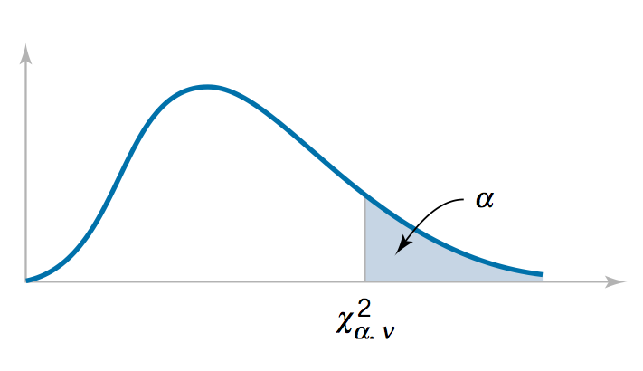
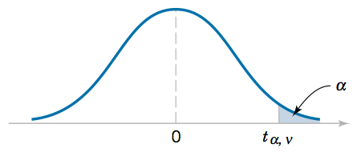

# Distribuições Amostrais


## Introdução à Inferência Estatística


Chegamos agora no momento em precisamos fazer a conexão entre a teoria de probabilidades que vimos até agora (que culminou com o estudo de diversos modelos de distribuições) e a teoria de inferência estatística que veremos em seguida. 

Anteriormente, estudamos diversas ferramentas matemáticas para descrever e estudar populações. No entanto, na prática, nem sempre temos conhecimento perfeito a respeito das populações de interesse.

Conduzimos experimentos a fim de obter informação a respeito de populações que não são perfeitamente compreendidas. Experimentos produzem dados, que por sua vez, constituem na matéria prima de que se utilizam os métodos estatísticos, na tarefa de realizar inferência a respeito da população sendo investigada. 

Para entendermos o tipo de problema que buscamos resolver, vamos considerar o seguinte exemplo:

Imagine que você é um produtor e possui 10 milhões de bulbos que produzem tulipas brancas ou vermelhas. Mas um de seus encarregados inadvertidamente misturou os bulbos.
E agora você precisa saber:

> De um total de 10 milhões de bulbos que produzem tulipas brancas ou vermelhas, que percentual produzirá tulipas brancas?

A única maneira de responder **com certeza** a esta pergunta é plantando exatamente todos os 10 milhões de bulbos e observando quantos produzem flores brancas, certo?

Bem, esta estratégia não parece viável, especialmente se quisermos vender os bulbos pois, desta maneira, o produto é destruído no processo de avaliação. E mesmo que esse não fosse o caso, deve haver um jeito de responder a esta pergunta sem ter de despender tanto esforço.

Que tal realizar o seguinte experimento: plantar alguns bulbos e, com base na observação desse pequeno número de resultados, chegar a uma conclusão com relação aos 10 milhões de bulbos.
Parece uma boa idéia, certo?

Mas o fato é que nunca poderemos ter certeza (ou seja, fornecer uma previsão exata) sobre o número de bulbos que produzirão flores brancas. Não é possível ter certeza absoluta, mas dependendo de como o experimento é realizado, podemos ter uma certa **confiança** (ou seja, seremos capazes de obter uma medida probabilística) no resultado esperado para o total dos 10 milhões de bulbos. Este é um processo de **inferência indutiva**.

> A inferência indutiva consiste no processo de obter informação a partir de evidências.

Neste tipo de inferência, busca-se chegar a conclusões plausíveis para um universo, a partir de evidências observadas para um subconjunto deste universo; ou seja, queremos fazer previsões ou generalizações das evidências empíricas que foram obtidas.

Existe outro tipo de inferência também, chamada de **inferência dedutiva**. Diferentemente da inferência indutiva, a inferência dedutiva consiste num processo de obter informação a partir de um conjunto de premissas verdadeiras. 

Este tipo de inferência tem como exemplo clássico o silogismo, que consiste em um processo dedutivo em que se chega a uma conclusão lógica a partir de duas proposições consideradas verdadeiras.


::: {.example name="Silogismo"} 
<br />
:::


I. Afirmação Geral  
II. Afirmação Específica  
III. Conclusão


Parte-se de uma verdade geral, válida para um universo e são obtidas conclusões para uma parte deste universo, como no exemplo a seguir: Se é verdade que alienígenas são perigosos e que marcianos são um tipo de alienígenas, conclui-se que marcianos também são perigosos. Essa conclusão é uma verdade lógica irrefutável, se as premissas em que se baseia forem verdadeiras.

Em forma de silogismo:

I. Todas as visitas de alienígenas são um risco  para a humanidade    
II. Marcianos são alienígenas    
III. As visitas de marcianos são  um risco para a humanidade  

Esses dois tipos de inferências diferem no sentido em que as conclusões obtidas a partir de um processo de inferência indutiva são prováveis; já as conclusões obtidas a partir de um processo de inferência dedutiva são irrefutáveis!


A lógica matemática, por exemplo, se apoia na inferência dedutiva para provar teoremas; as ciências empíricas, por outro lado, se apoiam na inferência indutiva para construir novos conhecimentos. As premissas de um argumento dedutivo válido proporcionam suporte absoluto para a conclusão, que consiste em uma consequência lógica verdadeira, estabelecida pela veracidade das premissas. A lógica indutiva estende essa ideia para argumentos um pouco mais fracos; ela se baseia em evidências, não em verdades absolutas. Em um argumento indutivo, as evidências dão suporte para que seja plausível crer na veracidade da conclusão, embora não se possa garantir que a conclusão seja verdadeira. O grau de confiança é medido em alguma escala numérica. E uma das maneiras mais utilizadas para medir essa crença na plausibilidade das conclusões de um processo de inferência indutiva é dada em termos de probabilidades.


### Inferência Estatística {-}


>A inferência estatística consiste no processo de interpretar evidências na presença de incertezas.]

De fato, um dos objetivos da Estatística é justamente fornecer um conjunto de técnicas que permitam:

i. realizar **inferências indutivas** a partir de evidências empíricas, i.e., dados amostrais; e

ii. **medir o grau de incerteza** de tais inferências.

Esta incerteza é medida em termos de probabilidades e este é o motivo por que investimos tanto tempo estudando teoria de probabilidades!

É importante ressaltar que **sempre há incerteza ao realizar inferência indutiva**:
simplesmente, não é possível fazer generalizações absolutamente certas. Podemos fazer generalizações incertas, e o grau de incerteza pode ser medido se os dados que compõe a amostra tiverem sido selecionados observando-se certos princípios.

Como selecionar a amostra que será examinada? É isso o que veremos a seguir.


## Amostras e Distribuições Amostrais


Uma amostra consiste em um subconjunto de indivíduos que compõe a população de interesse.
Utilizamos amostras para  obter informação a respeito dessa população em diversas circunstâncias: quando há escassez de recursos e tempo, ou quando a população é infinita (e portanto não pode ser complemente observada). Amostragem pode, ainda, ser o único procedimento possível para obter informação quando os indivíduos que compõe a população são destruídos no processo de observação, como no caso de ensaios destrutivos.

A partir de agora, passaremos a estudar técnicas capazes de extrair informação a partir de dados amostrais, de forma que possamos realizar **algumas inferências** a respeito de **certas características da população** que originou a amostra disponível. Podemos, por exemplo, desejar estimar uma determinada quantidade populacional, ou avaliar se uma hipótese a respeito da população parece ou não plausível. 

É fundamental notar que inferências realizadas com base em dados amostrais são sujeitas a erros, pois nenhuma amostra, por mais representativa que seja, é capaz de fornecer uma imagem perfeita da população de interesse.

Quando podemos, então, confiar em uma amostra? Isso depende de como a amostra foi selecionada.


### Amostra Aleatória {-}


Podemos confiar em uma amostra (dentro de certos limites que podem ser calculados) se **cada indivíduo da população tem a mesma chance de ser selecionado para compor a amostra**. Uma amostra coletada desta maneira é chamada amostra aleatória (a.a.). 

O procedimento empregado para obtenção de uma a.a. é o seguinte:

1. Atribui-se um número para cada elemento da população.
2. Determina-se o tamanho da amostra. (utilizando um método adequado).   
3. Emprega-se procedimento aleatório para sortear elementos que comporão a amostra. 

Embora esta ideia pareça bastante simples, na prática nem sempre esta é uma tarefa simples de realizar. Por este motivo, existem outros esquemas de amostragem (tais como amostragem sistemática, amostragem estratificada, amostragem por conglomerados etc.) que não estudaremos neste curso.

Se a v.a. $X$ representa a característica de interesse de uma população representada matematicamente pela distribuição $f_X(x)$, então um conjunto de $n$ observações que compõe uma a.a. pode ser entendido como uma sequencia de $n$ v.a.'s independentes e identicamente distribuídas de acordo com $f_X(x)$:  

Seja $X \sim f_X(\cdot)$ a característica em análise da população de interesse. 

Então, as v.a.'s   

$X_1, X_2, \ldots, X_n$ i.i.d. $f_X(\cdot)$ formam uma a.a. de tamanho $n$ desta população.

**OBS:**  
Utilizamos letras maiúsculas para representar as v.a.'s que representam matematicamente os elementos que compõe a amostra; e letras minúsculas, para representar os valores numéricos efetivamente assumidos pelas v.a.'s, que correspondem aos valores numéricos registrados na amostra que foi coletada.

+ as v.a.'s $X_i$, $i =1, 2, \ldots, n$ correspondem à representação simbólica do valor numérico assumido pelo i-ésimo elemento da amostra;  
+ após a efetiva coleta dos dados, tem-se um conjunto de valores numéricos $x_1, x_2, \ldots, x_n$.


### Parâmetos vs. Estatísticas {-}


Utilizaremos amostras para realizar inferências a respeito de uma população. O que isso quer dizer? 
No mundo de estatística paramétrica, isso quer dizer que utilizaremos quantidades calculadas a partir dos valores observados na amostra para chegar a conclusões a respeito de parâmetros populacionais.

Os **parâmetros populacionais** são quantidades fixas que caracterizam uma população, modelada matematicamente por uma distribuição de probabilidade. Essas quantidades populacionais são tipicamente desconhecidas, caso contrário não seria necessário realizar qualquer inferência. 

Já uma **estatística** corresponde a qualquer função dos valores conhecidos, observados, em uma amostra que tenha sido obtida a partir da população de interesse. Sendo assim, uma estatística é uma quantidade amostral.

Note que os valores calculados para uma estatística variam de amostra para amostra e sua variabilidade deve ser levada em conta nos procedimentos de inferência realizados. Portanto, uma estatística é também uma v.a. e sua variabilidade amostral pode ser descrita matematicamente em termos de uma distribuição de probabilidades. 

A distribuição de probabilidades de uma estatística tem um nome e chama-se **distribuição amostral**.


### Distribuição Amostral{-}


Sejam:
$X \sim f_X(x)$, v.a.  
$X_1, X_2, \ldots, X_n$ i.i.d. $f_X(x)$:  a.a. de tamanho $n$.  
$W$ uma estatística qualquer, i.e., função de $X_1, X_2, \ldots, X_n$:  
$$W = g (X_1, X_2, \ldots, X_n)$$
Define-se:

$f_W(w)$: distribuição amostral de $W$;  
$\sigma[W]$: erro-padrão de $W$.

Em outras palavras, se tivermos uma amostra aleatória de tamanho $n$ obtida de uma população $f_X(x)$, qualquer função $W$ dos valores da amostra, $W = g(X_1, X_2, \ldots X_n)$ é uma v.a. que tem distribuição de probabilidade $f_W(w)$ chamada **distribuição amostral**. O desvio-padrão da distribuição amostral de uma estatística é chamado **erro padrão**:


A distribuição amostral de uma estatística $W$ depende do:

+ tamanho $n$ da amostra;  
+ tamanho da população; e  
+ método de amostragem (ou seja, de como foi realizada a coleta dos dados).

::: {.example name="Medidas de Antebraço"} 
<br />
:::

Fonte: Hand, D et al. (1993). Handbook of Small Data Sets, CRC Press.

Vamos ilustrar os conceitos apresentados analisando os dados analisados por Karl Pearson e Alice Lee em 1903, no trabalho intitulado "On the Laws of Inheritance in Man" e republicados 90 anos depois na referência fornecida acima.

Suponha que estejamos interessados no comprimento de antebraços de indivíduos adultos do sexo masculino e desejamos chegar a alguma conclusão a respeito dessa quantidade. Por exemplo, desejamos responder à seguinte pergunta:

> Qual o comprimento médio do antebraço de um indivíduo adulto do sexo masculino?

Para isso, utilizaremos os dados que correspondem às medidas (em pol.) de antebraços coletadas de um total de 140 indivíduos adultos do sexo masculino. Esta é uma amostra, mas, para fins de ilustração, vamos supor que esta é nossa população.

Vamos então realizar inferência a partir de amostras retiradas desta "pseudo-população".

**Pseudo-População:**


```{r echo = TRUE}
(forearm <- scan("data/FOREARM.dat"))

summary(forearm)
```


Aqui temos o conjunto das 140 observações coletadas. Como estamos assumindo que esta seja nossa população, vamos chamá-la de **pseudo-população**. O valor calculado para a média será considerado o valor populacional, que suporemos desconhecido e a respeito do qual desejamos realizar inferência. Para isso, vamos supor que não conhecemos a população e que retiraremos dela algumas amostras aleatórias.

**Amostragem:**

Vamos retirar um total de 100 amostras aleatórias a partir dessa população, cada uma contendo 10 observações. O que estas amostras nos dizem a respeito da média populacional?


```{r}
# Obtenção de 100 a.a.'s de tamanho 10
AA10 <- replicate(100, sample(forearm, size = 10, replace = TRUE))
```


Abaixo temos os valores de média amostral calculados para cada uma das 100 amostras. Temos, portanto, um total de 100 valores de médias amostrais. A média populacional valia 18,8 polegadas. Percebemos que algumas amostras levaram a valores de média próximos (ou até exatamente iguais) ao valor populacional, mas nem todos. Há uma flutuação estatística nos valores amostrais, pois as observações que compõe as amostras são diferentes. 


```{r}
# Médias amostrais
(AA10_means <- colMeans(AA10))
```


Veja, por exemplo, os valores observados para duas dessas amostras:


```{r}
# Duas a.a.'s obtidas
t(AA10[,1:2])
```


A estatística média amostral é uma v.a. e, portanto, tem uma distribuição de probabilidade associada. Vejamos, então, a distribuição amostral da média amostral.

**Distribuições Amostrais:**

Vamos construir histogramas para os valores observados para 100 amostras, com tamanhos $n=10$, $n=20$ e $n=30$: 


```{r eval = FALSE, echo = TRUE}
# n = 10
hist(AA10_means,freq = FALSE, 
     main = "n = 10", ylab = "", xlab = "comprimento (pol.)")
abline(v = mean(forearm), col = 2)
# n = 20
hist(AA20_means,freq = FALSE, 
     main = "n = 20", ylab = "", xlab = "comprimento (pol.)")
abline(v = mean(forearm), col = 2)
# n = 30
hist(AA30_means,freq = FALSE, 
     main = "n = 30", ylab = "", xlab = "comprimento (pol.)")
abline(v = mean(forearm), col = 2)
```


```{r echo = FALSE, fig.align='center', fig.height=2.5, out.width = '100%', message=FALSE, warning=FALSE}
par(mfrow = c(1,3), mar=c(3, 2, 1, 1))

hist(AA10_means,freq = FALSE, 
     xlim=c(17,21), ylim = c(0,1.8),
     main = "n = 10", ylab = "",
     xlab = "comprimento (pol.)",
     cex.axis = 0.8, cex.main = 1, cex.lab = 0.8)
abline(v = mean(forearm), 
       col = 2, lwd = 4, lty="dashed")

AA20_means <- colMeans(replicate(100, sample(forearm, size = 20, replace = TRUE)))
hist(AA20_means,freq = FALSE, 
     xlim=c(17,21), ylim = c(0,1.8),
     main = "n = 20", ylab = "",
     xlab = "comprimento (pol.)",
     cex.axis = 0.8, cex.main = 1, cex.lab = 0.8)
abline(v = mean(forearm), 
       col = 2, lwd = 4, lty="dashed")

AA30_means <- colMeans(replicate(100, sample(forearm, size = 30, replace = TRUE)))
hist(AA30_means,freq = FALSE, 
     xlim=c(17,21), ylim = c(0,1.8),
     main = "n = 30", ylab = "",
     xlab = "comprimento (pol.)",
     cex.axis = 0.8, cex.main = 1, cex.lab = 0.8)
abline(v = mean(forearm), 
       col = 2, lwd = 4, lty="dashed")
```


Os histogramas mostram as frequências relativas para os valores das estatísticas $\bar{X}_{10}$  $\bar{X}_{20}$ e $\bar{X}_{30}$ (médias amostrais com base em amostras de tamanho 10, 20 e 30, respectivamente), observados para cada conjunto de 100 amostras; mas não correspondem às distribuições amostrais destas estatísticas. São apenas estimativas destas distribuições. 

A fim de obter a distribuição amostral da estatística média amostral $\bar{X}_n$, precisaríamos representar os valores de médias amostrais calculados a partir de todas as possíveis amostras de tamanho $n$ obtidas a partir da população investigada. Perceba que a distribuição amostral varia conforme muda o tamanho das amostras consideradas. O que você nota de diferente neles?


## Distribuição da Média Amostral


A seguir, generalizaremos as observações que fizemos anteriormente e chegaremos à Lei dos Grandes números e ao Teorema do Limite Central que, sem dúvida, constituem dois dos resultados mais importantes para inferência estatística. Ambos nos dizem o que acontece com a média amostral à medida que obtemos mais e mais dados.


### Propriedades da Média Amostral {-}


Vamos considerar um experimento aleatório que pode ser realizado, identicamente e independentemente, inúmeras, quantas vezes desejarmos. Vamos descrever essa situação supondo a existência de uma sequência de variáveis aleatórias, $X_1, X_2, \ldots  X_n$, e vamos assumir que essas variáveis aleatórias têm média e variância finitas, dadas, respectivamente por $\mu$ e $\sigma^2$. Sob essas condições, estudaremos o comportamento da média amostral, conforme o tamanho $n$ da amostra aumenta.

Portanto, seja a a.a.: $X_1, X_2, \ldots, X_n$ i.i.d. $f_X(x)$, t.q. $E[X] = \mu$ e $Var[X] = \sigma^2$.

**Média Amostral:**

$$\overline{X}_n = (X_1 + X_2 + \ldots + X_n)/n$$

+ $E[\bar{X}_n] = \mu$  
+ $Var[\bar{X}_n]  = \sigma^2/n$  

Por definição, a média populacional corresponde ao valor esperado da variável aleatória $X$. O mesmo ocorre para a média amostral: o valor esperado da média amostral è igual à média populacional, $\mu$.

Mas há uma diferença crucial entre as v.a.'s $X_i$ e $\bar{X}_n$: a tendência de uma v.a. assumir valores próximos de seu valor esperado é quantificada pela variância. A variância de $X_i$ vale $\sigma^2$; já a variância de $\bar{X}_n$ vale $\sigma^2/n$!

Portanto, a média amostral apresenta menor variabilidade que qualquer uma das v.a.'s individuais que compõe a amostra. Quando tomamos a média, a variância se reduz, de tal forma que fazendo $n$ tender a infinito, a variância da média amostral tende a zero. Isto significa que, ao repetir o experimento aleatório um número suficientemente grande de vezes (ou seja, ao obter uma amostra aleatória suficientemente grande) podemos tornar a variância da média amostral tão pequena quanto se queira.


### Lei dos Grandes Números {-}


Sejam $X_1, X_2, \ldots, X_n$  i.i.d. $f_X(\cdot)$, com média populacional $\mu$. 

Então:

$$P\left[|\bar{X}_n - \mu| < \epsilon \right] \stackrel{n \rightarrow \infty}{\longrightarrow} 1, \quad \forall \epsilon > 0$$

A Lei dos Grandes Números (LGN) garante que, conforme o tamanho de uma a.a. (conjunto de variáveis aleatórias independentes e identicamente distribuídas) aumenta, sua média converge para a média populacional.

Este teorema foi provado pela primeira vez por Jakob Bernoulli em 1713 (para o caso especial de uma amostra aleatória retirada de uma distribuição de Bernoulli) e consiste em uma representação matemática da interpretação de frequência relativa da probabilidade, que formaliza nossa intuição de que no longo prazo, as frequências relativas convergem para a média. 

Sendo assim, a Lei dos Grandes Números é de fundamental importância para a prática científica em geral. Se considerarmos que dados são obtidos a partir de um grande número de replicações independentes de um experimento (que pode ter sido realizado através de simulação ou em um laboratório, ou observado no mundo real), cada vez que utilizamos a frequência relativa de ocorrências de um evento de interesse para estimar sua probabilidade, estamos implicitamente invocando a Lei dos Grandes Números.


::: {.example} 
<br />
:::


Vamos ilustrar a Lei dos Grandes Números através de um exemplo computacional. Primeiro, devemos escolher uma população idealizada. Em seguida, fingindo não conhecer esta população, vamos retirar amostras (de diferentes tamanhos) desta população, e calcular as respectivas médias amostrais. A Lei dos Grandes Números garante que, conforme o tamanho da amostra aumenta, a média amostral deve se aproximar da média populacional.

Vamos considerar três populações idealizadas: Binomial, Exponencial e Normal.
Para cada uma das ilustrações, foram geradas 100 amostras de tamanhos variando de 1 até 1000.

**CASO 1: População Binomial (n = 20, p = 0.5)**

No primeiro caso, vamos considerar a população idealizada Binomial com parâmetros n = 20 e p = 0.5. Veja que, conforme o tamanho da a.a. aumenta, as médias amostrais convergem para a média populacional que vale $np = 10$, com varibilidade decrescente.


```{r eval = FALSE, echo =TRUE}
n       <- 20     # tamanho do experim.
p       <- 0.5    # prob. sucesso
aa_size <- 1000   # tamanho da amostra
nSim    <- 100    # no. replicações

gen_path <- function(aa_size, n, p){
  return(cumsum(rbinom(aa_size, n, p))/1:aa_size)
}
  
media_amostral <- replicate(100, gen_path(aa_size, n, p))

plot(NULL, type="n", 
     xlim = c(0, aa_size), 
     ylim = range(media_amostral),
     xlab = "tamanho da amostra",
     ylab = "Média amostral")
for(s in 1: nSim) lines(media_amostral[,s], col="gray")
abline(h = n*p, lty = "dashed", lwd = 2)
```


```{r eval = TRUE, echo = FALSE, fig.height=3, fig.align='center', out.width = '100%', message=FALSE, warning=FALSE}
n       <- 20     # tamanho do experim.
p       <- 0.5    # prob. sucesso
aa_size <- 1000   # tamanho da amostra
nSim    <- 100    # no. replicações

gen_path <- function(aa_size, n, p){
  return(cumsum(rbinom(aa_size, n, p))/1:aa_size)
}
  
media_amostral <- replicate(100, gen_path(aa_size, n, p))

par(mfrow = c(1,2), 
    cex.lab = 0.8, cex.axis = 0.8, mar=c(4,4,1,0))
plot(NULL, type="n", 
     xlim = c(0, aa_size), 
     ylim = range(media_amostral),
     xlab = "tamanho da amostra",
     ylab = "Média amostral")
for(s in 1: nSim) lines(media_amostral[,s], col="gray")
abline(h = n*p, lty = "dashed", lwd = 2)

fatias <- c(200, 600, 1000)
abline(v = fatias, lty = "dashed", lwd = 2,
       col = 1+(1:length(fatias)))

x.lim <- range(c(floor(range(media_amostral[fatias,])),
               ceiling(range(media_amostral[fatias,]))))   

pos <- 1
hist(media_amostral[fatias[1], ], 
     col = pos + 1, density = 50,  
     xlim = x.lim, 
     ylim = c(0,12), freq = FALSE,
     main = "",
     ylab = "",
     xlab = "Freq. relativa: média amostral")

for (j in fatias[-1]){
  pos <- pos + 1
  hist(media_amostral[j, ], add = TRUE,
     col = pos + 1 , density = 50, freq = FALSE)
}
abline(v = n*p, lty = "dashed", lwd = 2)
```


**CASO 2: População Exponencial (lambda = 2)**

No segundo caso, temos uma população exponencial com parâmetro lambda = 2. Observamos a mesma convergência da média amostral para o valor 1/lambda = 0.5, que corresponde à média populacional. 


```{r eval = FALSE, echo =TRUE}
lambda  <- 2
aa_size <- 1000   # tamanho da amostra
nSim    <- 100    # no. replicações

gen_path <- function(aa_size, lambda){
  return(cumsum(rexp(aa_size, lambda))/1:aa_size)
}
  
media_amostral <- replicate(nSim, gen_path(aa_size, lambda))

plot(NULL, type="n", 
     xlim = c(0, aa_size), 
     ylim = range(media_amostral),
     xlab = "tamanho da amostra",
     ylab = "Média amostral")
for(s in 1: nSim) lines(media_amostral[,s], col="gray")
abline(h = 1/lambda, lty = "dashed", lwd = 2)
```


```{r eval = TRUE, echo = FALSE, fig.height=3, fig.align='center', out.width = '100%', message=FALSE, warning=FALSE}
lambda  <- 2
aa_size <- 1000   # tamanho da amostra
nSim    <- 100    # no. replicações

gen_path <- function(aa_size, lambda){
  return(cumsum(rexp(aa_size, lambda))/1:aa_size)
}
  
media_amostral <- replicate(nSim, gen_path(aa_size, lambda))

par(mfrow = c(1,2), 
    cex.lab = 0.8, cex.axis = 0.8, mar=c(4,4,1,0))
plot(NULL, type="n", 
     xlim = c(0, aa_size), 
     ylim = range(media_amostral),
     xlab = "tamanho da amostra",
     ylab = "Média amostral")
for(s in 1: nSim) lines(media_amostral[,s], col="gray")
abline(h = 1/lambda, lty = "dashed", lwd = 2)

fatias <- c(200, 600, 1000)
abline(v = fatias, lty = "dashed", lwd = 2,
       col = 1+(1:length(fatias)))

x.lim <- range(c(floor(range(media_amostral[fatias,])),
               ceiling(range(media_amostral[fatias,]))))   

pos <- 1
hist(media_amostral[fatias[1], ], 
     col = pos + 1, density = 50,  
     xlim = x.lim, 
     ylim = c(0,30), freq = FALSE,
     main = "",
     ylab = "",
     xlab = "Freq. relativa: média amostral")


for (j in fatias[-1]){
  pos <- pos + 1
  hist(media_amostral[j, ], add = TRUE,
     col = pos + 1 , density = 50, freq = FALSE)
}
abline(v = 1/lambda, lty = "dashed", lwd = 2)
```


**CASO 3: População Normal (0, 1)**

Finalmente, a terceira população idealizada é normal padronizada. E, assim como nos casos anteriores, observamos a convergência da média amostral para a média populacional, conforme o tamanho da amostra aumenta.


```{r eval = FALSE, echo =TRUE}
mu      <- 0      # media populacional
sigma   <- 1      # desvio-padrão populacional
aa_size <- 1000   # tamanho da amostra
nSim    <- 100    # no. replicações

gen_path <- function(aa_size, mu, sigma){
  return(cumsum(rnorm(aa_size, mu, sigma))/1:aa_size)
}
  
media_amostral <- replicate(nSim, gen_path(aa_size, mu, sigma))

plot(NULL, type="n", 
     xlim = c(0, aa_size), 
     ylim = range(media_amostral),
     xlab = "tamanho da amostra",
     ylab = "Média amostral")
for(s in 1: nSim) lines(media_amostral[,s], col="gray")
abline(h = mu, lty = "dashed", lwd = 2)
```


```{r eval = TRUE, echo = FALSE, fig.height=3, fig.align='center', out.width = '100%', message=FALSE, warning=FALSE}
mu      <- 0      # media pop.
sigma   <- 1      # desv-pad. pop.
aa_size <- 1000   # tamanho da amostra
nSim    <- 100    # no. replicações

gen_path <- function(aa_size, mu, sigma){
  return(cumsum(rnorm(aa_size, mu, sigma))/1:aa_size)
}
  
media_amostral <- replicate(nSim, gen_path(aa_size, mu, sigma))

par(mfrow = c(1,2), 
    cex.lab = 0.8, cex.axis = 0.8, mar=c(4,4,1,0))
plot(NULL, type="n", 
     xlim = c(0, aa_size), 
     ylim = range(media_amostral),
     xlab = "tamanho da amostra",
     ylab = "Média amostral")
for(s in 1: nSim) lines(media_amostral[,s], col="gray")
abline(h = mu, lty = "dashed", lwd = 2)

fatias <- c(200, 600, 1000)
abline(v = fatias, lty = "dashed", lwd = 2,
       col = 1+(1:length(fatias)))

x.lim <- range(c(floor(range(media_amostral[fatias,])),
               ceiling(range(media_amostral[fatias,]))))   

pos <- 1
hist(media_amostral[fatias[1], ], 
     col = pos + 1, density = 50,  
     xlim = x.lim, 
     ylim = c(0,12), freq = FALSE,
     main = "",
     ylab = "",
     xlab = "Freq. relativa: média amostral")


for (j in fatias[-1]){
  pos <- pos + 1
  hist(media_amostral[j, ], add = TRUE,
     col = pos + 1 , density = 50, freq = FALSE)
}
abline(v = mu, lty = "dashed", lwd = 2)
```


Como pudemos perceber nestas ilustrações, a lei dos grandes números sugere que, se a média populacional $\mu$ for desconhecida, podemos realizar inferências a respeito deste parâmetro a partir da observação do comportamento da média amostral. Esta observação é central a muitos dos procedimentos que utilizaremos daqui por diante.

Ainda assim, por mais interessante e útil que seja este resultado, algumas perguntas permanecem sem resposta:

- Quão rápido a média amostral tende para a média populacional?
- O que se pode afirmar a respeito da distribuição da média amostral conforme o tamanho da amostra aumenta?

Estas respostas podem ser satisfatoriamente respondidas pelo próximo resultado: o aguardado Teorema do Limite Central!


## Teorema do Limite Central


Seja $\overline{X}_n$ a média amostral de uma a.a. de tamanho $n$ obtida a partir de uma população $f_X(x)$, **qualquer**, com média $\mu$ e variância $\sigma$, ambas finitas.

Então:


\begin{align*}
  Z_n 
  = \frac{\overline{X}_n - E[\overline{X}_n]}{\sqrt{\mathit{Var}[\overline{X}_n]}}
  = \frac{\overline{X}_n - \mu}{\sigma/\sqrt{n}} 
  \; \underset{n\rightarrow \infty}{\longrightarrow} \; N(0,1) 
\end{align*}


De forma que: 
$$\overline{X}_n \; \dot{\sim} \; N(\mu, \sigma^2/n)$$

O Teorema do Limite Central (TLC) afirma que o comportamento aleatório da média amostral se assemelha ao comportamento aleatório de uma variável aleatória normalmente distribuída. E isto é verdade, idependentemente da população da qual é retirada a amostra aleatória.

Sendo assim, este resultado nos permite aproximar uma variedade de probabilidades que, de outra maneira, poderiam ser intratáveis. Para que essa aproximação seja válida, precisamos ter uma amostra de tamanho suficientemente grande; e este número depende da distribuição populacional. Em geral, uma regra de bolso diz é que a aproximação normal é válida para médias amostrais calculadas a partir de amostras com 30 ou mais observações.

Vamos ilustrar o TLC através de um exemplo computacional, assim como fizemos para a LGN. Vamos considerar três populações idealizadas: Uniforme, Exponencial e Normal.


::: {.example} 
<br />
:::


Simular a distribuição amostral de $\overline{X}_n$ para as seguintes amostras aleatórias:

1. $X_1, X_2, \ldots, X_n$ i.i.d. U(0,1)   
2. $X_1, X_2, \ldots, X_n$ i.i.d. Exp(2)  
3. $X_1, X_2, \ldots, X_n$ i.i.d. N(0,1)   

para os tamanhos de amostra n = 10, 25, 50, 500.

**CASO 1: População Uniforme (0, 1)**


```{r eval = TRUE, echo = FALSE,  fig.height=3, fig.align='center', out.width = '100%', message=FALSE, warning=FALSE}
nob <- c(10, 25, 50, 500)
a <- 0
b <- 1
aa_size <- max(nob)  # tamanho da amostra
nSim    <- 1000   # no. replicações

gen_path <- function(aa_size, a, b){
  return(cumsum(runif(aa_size, a, b))/1:aa_size)
}
  
media_amostral <- replicate(nSim, gen_path(aa_size, a, b))

nob <- c(10, 25, 50, 100)
par(mfcol=c(2,length(nob)))
par(cex.lab = 0.8, cex.axis = 0.8, cex.main= 0.8,
    mar=c(4,3,1,0))

for(n in nob){
  # media amostral
  Xnbar <- colMeans(media_amostral[1:n, ])
  # Valor esperado e erro padrão
  med <- mean(Xnbar)
  std <- sd(Xnbar)
  # Histograma para media amostral
  h <- hist(Xnbar, freq = FALSE, 
         main = paste("n =", n),
         ylab = "", xlab="")
  # Adição da curva normal correspondente
  x <- seq(0, 1, l=100)
  curve(dnorm(x, med, std), add = TRUE, col = 2, lwd = 2)
  # Compara distribuição amostral de Xmed com distribuicao teorica
    # 1. Normal
    qqnorm(Xnbar)
    qqline(Xnbar, col=2, lty = 2)
}
```


**CASO 2: População Exponencial (lambda = 2)**


```{r eval = TRUE, echo = FALSE,  fig.height=3, fig.align='center', out.width = '100%', message=FALSE, warning=FALSE}
nob <- c(10, 25, 50, 500)
lambda  <- 2
aa_size <- max(nob)  # tamanho da amostra
nSim    <- 1000   # no. replicações

gen_path <- function(aa_size, lambda){
  return(cumsum(rexp(aa_size, lambda))/1:aa_size)
}
  
media_amostral <- replicate(nSim, gen_path(aa_size, lambda))

nob <- c(10, 25, 50, 100)
par(mfcol=c(2,length(nob)))
par(cex.lab = 0.8, cex.axis = 0.8, cex.main= 0.8,
    mar=c(4,3,1,0))
for(n in nob){
  # media amostral
  Xnbar <- colMeans(media_amostral[1:n, ])
  # Valor esperado e erro padrão
  med <- mean(Xnbar)
  std <- sd(Xnbar)
  # Histograma para media amostral
  h <- hist(Xnbar, freq = FALSE, 
         main = paste("n =", n),
         ylab = "", xlab="")
  # Adição da curva normal correspondente
  x <- seq(0, 1, l=100)
  curve(dnorm(x, med, std), add = TRUE, col = 2, lwd = 2)
  # Compara distribuição amostral de Xmed com distribuicao teorica
    # 1. Normal
    qqnorm(Xnbar)
    qqline(Xnbar, col=2, lty = 2)
}
```


**CASO 3: População Normal (0, 1)**


```{r eval = TRUE, echo = FALSE, fig.height=3, fig.align='center', out.width = '100%', message=FALSE, warning=FALSE}
nob <- c(10, 25, 50, 500)
mu      <- 0      # media populacional
sigma   <- 1      # desvio-padrão populacional
aa_size <- max(nob)  # tamanho da amostra
nSim    <- 1000   # no. replicações

gen_path <- function(aa_size, mu, sigma){
  return(cumsum(rnorm(aa_size, mu, sigma))/1:aa_size)
}
  
media_amostral <- replicate(nSim, gen_path(aa_size, mu, sigma))

par(mfcol=c(2,length(nob)))
par(cex.lab = 0.8, cex.axis = 0.8, cex.main= 0.8,
    mar=c(4,3,1,0))

for(n in nob){
  # media amostral
  Xnbar <- colMeans(media_amostral[1:n, ])
  # Valor esperado e erro padrão
  med <- mean(Xnbar)
  std <- sd(Xnbar)
  # Histograma para media amostral
  h <- hist(Xnbar, freq = FALSE, 
         main = paste("n =", n),
         ylab = "", xlab="")
  # Adição da curva normal correspondente
  x <- seq(0, 1, l=100)
  curve(dnorm(x, med, std), add = TRUE, col = 2, lwd = 2)
  # Compara distribuição amostral de Xmed com distribuicao teorica
    # 1. Normal
    qqnorm(Xnbar)
    qqline(Xnbar, col=2, lty = 2)
}
```


Essas ilustrações permitem perceber como as distribuições das médias amostrais convergem para a distribuição Normal conforme aumenta o tamanho da amostra, exatamente como afirma o TLC, exceto no caso da população normal, em que a distribuição da média amostral é Normal, independentemente do tamanho da amostra.

O TLC tem uma longa história. Como vimos anteriormente, para o caso especial em que a v.a. tem distribuição de Bernoulli com probabilidade de sucesso igual a $p$, a versão do TLC para o total amostral foi desenvolvida por De Moivre em 1733, como uma aproximação para a distribuição Binomial. A primeira contribuição para uma versão mais geral para o TLC foi feita por Laplace em 1810, mas resultados definitivos só foram obtidos na primeira metade do século XX.

A beleza do TLC consiste no fato de que, a partir de praticamente nenhuma hipótese, exceto independência e existência de média e variância, chegamos na normalidade da distribuição da média amostral, qualquer que seja a população de origem. O ponto importante é que a normalidade é decorrente da soma de perturbações independentes (mas essas perturbações precisam ser pequenas, daí a necessidade de variância finita). Mas esse encanto não deve ofuscar nosso senso prático. É necessário também ter em mente as limitações deste resultado. Embora o TLC nos dê uma aproximação geral, não há meios de determinar quão boa é a aproximação, ou qual o tamanho de amostra mínimo necessário para obter uma boa aproximação, exceto analisando-se caso a caso, já que isto sim depende da população original. Além disso, com a grande disponibilidade atual de recursos computacionais,  aproximações como o TLC, de certa forma, perdem um pouco sua importância prática. 

Embora o TLC não assuma normalidade da população que originou a amostra, essa hipótese é necessária para obter a distribuição amostral de outras estatísticas que não a média amostral, como veremos mais adiante.


::: {.example} 
<br />
:::


Um pacote de granola tem peso aproximadamente normalmente distribuído com média 800g e desvio-padrão 40g. Qual a probabilidade de que uma a.a. contendo 16 pacotes tenha peso médio inferior a 775g?


::: {.solution} 
<br />
:::


Dados do problema:  

$X$ = peso de um pacote de granola $\stackrel{\cdot}{\sim} N(\mu = 800, \sigma^2 = 40^2)\qquad$  
a.a. $X_1, X_2, \ldots, X_n, \; n=16$.

Queremos: $P[\bar{X}_n < 775]$

Neste caso, não precisamos do TLC, pois a população tem distribuição aproximadamente normal. Sendo assim:

$\bar{X}_n \stackrel{\cdot}{\sim} N(E[\bar{X}_n], Var[\bar{X}_n]): \qquad$
$E[\bar{X}_n] = \mu = 800$  e
$Var[\bar{X}_n] = \sigma^2/n = 40^2/16= 100$

Portanto:
$$P[\bar{X}_n < 775] = P\left[\frac{\bar{X}_n - E[\bar{X}_n]}{\sqrt{Var[\bar{X}_n]}} = Z < \frac{775 -800}{10}\right] = P[Z < -2.5] = 0.0062$$

Conclusão:

Há aproximadamente 0,62% de chance de observar uma a.a. de 16 pacotes de granola com peso médio inferior a 775g.

no R:   


```{r eval=FALSE}
pnorm(775, mean = 800, sd = 10)
```


::: {.example} 
<br />
:::


Um determinado processo de fabricação produz peças cilíndricas para uso na indústria aeronáutica. O engenheiro responsável acredita que o diâmetro médio de todas as peças produzidas por tal processo esteja de acordo com a especificação e seja de 5cm.  Sabe-se ainda que o desvio-padrão do processo vale 0,1cm. 

Um experimento é conduzido em que 100 peças produzidas por tal processo são escolhidas aleatoriamente. O diâmetro de cada uma das peças da amostra é medido.  O experimento resulta  em um valor médio para o diâmetro das peças de 5,027cm.


A informação obtida através da análise da amostra valida ou refuta a conjectura do engenheiro responsável? 


::: {.solution} 
<br />
:::


Seja $X$ = diâmetro de uma peça cilíndrica  tq. $\mu =$ 5cm; $\sigma =$ 0,1cm   
(não há informação a respeito da distribuição desta v.a.)  
a.a. $X_1, X_2, \ldots, X_n, \; n=100$.

Para a estatística média amostral $\bar{X}_n$, temos:  
$E[\bar{X}_n] = \mu = 5$ e $\sigma[\bar{X}_n] = \sigma/\sqrt{n} = 0.1/\sqrt{100} = 0.01$

A fim de verificar se os dados amostrais refutam ou validam a conjectura de que $\mu = 5$, precisamos responder à seguinte pergunta:

>  Qual a probabilidade de observar $|\bar{X}_n - \mu| \geq 0,027$, em uma a.a. de tamanho $n=100$, quando $\mu = 5$?

+ Se a probabilidade for baixa, refuta-se a conjectura;
+ Se a probabilidade for alta, valida-se a conjectura.

A média amostral observada para a amostra coletada dista da média esperada de $|\bar{x}_n - \mu| = 0.027$.  

Portanto:

$$|W| = \frac{|\bar{X}_n - \mu|}{\sigma} = \frac{|5.027 - 5|}{0.01} = 2.7$$

então: $w_1 = -2.7$ e $w_2 = 2.7$


```{r echo=FALSE, fig.align='center', fig.height=1.5, fig.align='center', out.width = '80%', message=FALSE, warning=FALSE}
mu <- 0
sd <- 1

 par(oma = c(0,0, 0,0),
     mar = c(1,0,0,0))
#par(mar = c(2,2,0,0))

x <- seq(-4, 4, by = 0.05)
x1 <- -2.7
x2 <- 2.7

plot(NULL, type = "n", bty = "n", yaxt = "n",
     xlab = "", ylab = "", axes = FALSE,
     xlim = c(min(x),max(x)), 
     ylim = c(-0.05,0.45))

curve(dnorm(x, mu, sd), add = TRUE, 
        col = 1, lwd = 1)
abline(h=0, lwd=2)
abline(v=0, lty="dashed")

i <- x >= x1 & x <= x2
hx <- dnorm(x, mu, sd)
polygon(c(x1, x[i], x2), c(0, hx[i], 0), 
        density = 30, angle = 135,
        col = "blue") 
text(x1, -0.05, expression(~ -2.7 ), cex=0.8,  col = 1)
text(x2, -0.05, expression(~ 2.7 ), cex=0.8, col = 1)
text(mu, -0.05, expression(~ 0),  cex=0.8, col = 1)
```


Vamos calcular a probabilidade de observar uma amostra com essa característica (assumindo que a população tenha média $\mu$ e desvio-padrão $\sigma$):


\begin{align*}
  P[|\bar{X}_n - \mu| \geq 0.027] = P[|W| \geq 2.7]
  &= P[W \leq w_1] + P[W \geq w_2] \\
  &= 2 P[W \leq -2.7] = 2 \cdot 0.003467 \approx 0.007.
\end{align*}


Conclusão:

Para as condições consideradas, a probabilidade de que a média amostral $\bar{X}_n$ se afaste 0.027cm da especificação 5cm é de aproximadamente 0,7%. Isto significa que espera-se observar uma diferença como esta em apenas 7 a cada 1000 amostras (de tamanho 100).

Portanto, não parece plausível validar a conjectura do engenheiro de que as peças estejam sendo produzidas dentro da especificação.

no R:  


```{r eval=FALSE}
2*(1 - pnorm(5.027, mean = 5, sd = 0.01))
2*pnorm(-2.7)
```


Suponha agora que nova informação tenha sido obtida e passou-se a acreditar que o processo tem desvio-padrão $\sigma = 0.2$cm e a média continua sendo $\mu =5$cm:


\begin{align*}
\mu = 5       & \qquad \Rightarrow \quad E[\bar{X}_n] = 5
\sigma = 0.2  & \qquad \Rightarrow \quad \sigma[\bar{X}_n] = 0.2/\sqrt{100} = 0.02
\end{align*}


$$w_1 = \frac{-0.027}{0.02} =  -1.35 \qquad w_2 = \frac{0.027}{0.02} = 1.35$$
Portanto,  

$$P[|\bar{X}_n - 5| \geq 0.027] =  2 P[W \leq -1.35] = 2 \cdot 0.088508 = 0.177 \approx 18\%$$

E agora, o que se pode concluir?...


## Distribuições Amostrais Associadas a Populações Normais


Distribuições amostrais de estatísticas importantes nos permitem aprender sobre os parâmetros de distribuições. Vimos que podemos utilizar a média amostral para realizar inferências a respeito da média populacional. Seria natural que pudéssemos utilizar a variância amostral para realizar inferências a respeito da variância populacional.

No entanto, não existem teoremas análogos ao TLC que garantam uma aproximação para a distribuição amostral da variância amostral ou para outras estatísticas importantes (mesmo quando $n \rightarrow \infty$ ), quando a população original é arbitrária.

Ainda assim, algumas distribuições amostrais exatas podem ser obtidas para estatísticas calculadas a partir de amostras retiradas de uma população normal. Estas estatísticas são chamadas Qui-Quadrado, T-Student e F-Snedecor.


### Distribuição Qui-Quadrado {-}


Sejam  $X_1, X_2, \ldots, X_n$ i.i.d. $N(\mu, \sigma^2)$. Então:

$$Q^2 = \frac{(n-1)S_n^2}{\sigma^2} = \sum_{i=1}^{n}\frac{(X_i - \bar{X}_n)^2}{\sigma^2} \sim \chi^2_\nu$$

onde:  
$\nu = n-1$: no. de graus de liberdade  
$S_n^2 = \frac{1}{n-1} \sum_{i=1}^n (X_i - \overline{X}_n)^2$: variância amostral.


Em outras palavras, se uma a.a. com $n$ observações $X_1, X_2, \ldots X_n$ é selecionada a partir de uma população Normal com média $\mu$ e variância $\sigma^2$, então a distribuição amostral da estatística $Q^2$ segue a distribuição Qui-Quadrado com $\nu = n-1$ graus de liberdade. 

O número de g.d.l. da distribuição $\chi^2$  pode ser interpretado como uma medida de informação, da seguinte maneira: a uma a.a. de tamanho $n$ estão associados $n$ graus de liberdade, já que cada uma das observações que compõe a amostra foi obtida de maneira independente. Quando não conhecemos a média populacional $\mu$, precisamos estimá-la utilizando a média amostral, $\bar{X}_n$. Ao estimar a variância populacional $\sigma^2$ utilizando a variância amostral $S_n^2$, temo um total de $n-1$ g.d.l, já que $S_n^2$ é função da média amostral. Perdemos um grau de liberdade para cada parâmetro populacional estimado a partir do mesmo conjunto de dados. 


#### Propriedades {-}


A distribuição $\chi^2$ tem algumas propriedades interessantes:

+ Se $Z \sim N(0,1)$ então $Z^2 \sim \chi^2_1$  
  i.e., quadrado de uma v.a. normal padronizada tem distribuição $\chi^2$ com 1 g.d.l.

+ Se $X_1, \ldots, X_n$ independentes, com $X_i \sim \chi^2_{\nu_i}$ então $X_1 + \ldots + X_n \sim \chi^2_{\nu_1 + \ldots + \nu_n}$  
  i.e., a soma de v.a.'s $\chi^2$ independentes também tem distribuição $\chi^2$ , e o número de graus de liberdade da soma corresponde à soma dos números de g.d.l.


```{r ch9-distr-chi2, echo=FALSE,  fig.align='center', out.width = '50%', message=FALSE, warning=FALSE}

```


+ 95% da área da distribuição encontra-se entre $\chi^2_{0,975}$ e $\chi^2_{0,025}$:  
  A distribuição Qui-Quadrado é assimétrica e tem suporte no conjunto dos números reais não negativos. Ela deixa uma área igual a $\alpha$ à direita do quantil $\chi^2_\alpha$ , de forma que 95% da área sob a curva de densidade $\chi^2$ se encontra entre os percentis 97,5% e 2,5%. 

Portanto, para um certo número de graus de liberdade, $\nu$:

+ Se $Q^2 > \chi^2_{0,025; \nu}$: resultado improvável (P < 0,025), a menos que $\sigma^2 \downarrow$  
+ Se $Q^2 < \chi^2_{0,975; \nu}$: resultado improvável (P < 0,025), a menos que $\sigma^2 \uparrow$  


Podemos utilizar esta distribuição para realizar inferência a respeito da variância populacional. Para um certo número de graus de liberdade, $\nu$: se o valor observado da estatística $Q^2$ se encontrar à direita do percentil 2,5% temos um resultado bastante improvável (já que a área à direita do valor da estatística é inferior a 2,5%), a menos que a variância populacional seja menor que o imaginado. Um raciocínio análogo se aplica para valores observados da estatística $Q^2$ menores que o percentil 97,5%. Isso significa que é possível observar $Q^2$ à esquerda de do percentil 97,5% e à direita do percentil 2,5%, quando $\sigma^2$ está correto, mas é mais provável que nossa ideia a respeito deste parâmetro esteja errada.
  

::: {.example} 
<br />
:::


Uma companhia produz medicamentos que contém 8g de um determinado composto em um frasco do medicamento. Engenheiros da qualidade determinaram que o processo estará operando em conformidade com o especificado se a variabilidade real $\sigma^2$ do composto por frasco for menos que 0,0025. 

Uma a.a. de 10 frascos  é selecionada e a quantidade do composto em cada frasco é medida. 
Assuma que a quantidade do composto seja normalmente distribuída. 
Estamos interessados na variância amostral, $Sn^2$. 

Se, de fato, $\sigma^2 =$ 0,001, qual a probabilidade de que $S_n^2$ exceda 0,0025? 


::: {.solution} 
<br />
:::


Temos: $X_1, X_2, \ldots, X_{n=10} \sim N(\mu, \sigma^2)$.  
Queremos: $P[S_n^2 > 0.0025]$: 

+ Para calcular esta probabilidade, utilizaremos a estatística: 
$$Q^2 = (n-1) S_n^2/\sigma^2 \sim \chi^2_{\nu = n-1}$$
Portanto:  


\begin{align*}
  P[S_n^2 > 0.0025]
  &= P\left[(n-1)\frac{S_n^2}{\sigma^2} > (n-1)\frac{0.0025}{\sigma^2}\right]; \quad n = 10; \sigma^2 = 0.001\\
  &= P\left[\chi^2 > 9 \frac{0.0025}{0.001}\right] = P[\chi^2 > 22.5]\\
\end{align*}


Da tabela, $\nu=9$, $\chi^2_\alpha = 22.5$. Precisamos encontrar o valor de $\alpha$ (probabilidade).

Na linha de $\nu =9$, temos apenas $\chi^2_{0.01} = 21.67$ e $\chi^2_{0.005} = 23.59$.
Podemos interpolar os valores de probabilidade associados a esses quantis, ou encontrar uma faixa de valores em que se encontra a probabilidade desejada:

$0.005 < P[\chi^2 > 22.5] < 0.01$, se a variância populacional for de fato $\sigma^2 = 0.001$.


no R:   


```{r eval=FALSE}
1 - pchisq(22.5, df = 9)  
```


### Distribuição t-Student {-}


Sejam $X_1, X_2, \ldots, X_n$ i.i.d. $N(\mu, \sigma^2)$. 

Se $\sigma$ conhecido: $\quad \frac{\overline{X}_n - \mu}{\sigma/\sqrt{n}}   \sim N(0,1)$

Se $\sigma$ **desconhecido** (em geral, este é o caso):

$$T = \frac{\overline{X}_n - \mu}{S_n/\sqrt{n}}   \sim t_\nu$$


```{r ch9-distr-t-Student, echo=FALSE,  fig.align='center', out.width = '50%', message=FALSE, warning=FALSE}

```


onde: 

$\nu = n-1$: no. de graus de liberdade  

Simetria: $t_{1-\alpha,\nu} = - t_{\alpha, \nu}$

Em outras palavras, se $X_1, X_2, \ldots X_n$ constituem uma a.a. de uma população Normal com média $\mu$ e variância $\sigma^2$, sabemos, independentemente do TLC, que a estatística padronizada tem distribuição normal padronizada. Quando o valor de $\sigma$ é conhecido, podemos utilizar essa estatística para realizar inferência a respeito da média populacional $\mu$, já que esta é a única quantidade populacional desconhecida.

Na maioria dos casos práticos em que se deseja realizar inferência a respeito da média populacional, no entanto, é irreal acreditar que a variância populacional $\sigma^2$ seja conhecida. Na realidade, se temos dúvidas a respeito da localização do centro da distribuição, o que dizer a respeito de sua dispersão? Como podemos realizar inferência a respeito de $\mu$, neste caso?

Este problema foi investigado por William Gosset (que publicou seus resultados sob o pseudônimo de Student) no início do século XX. Este trabalho resultou no desenvolvimento da distribuição t-Student. Gosset fez o óbvio: olhou para a distribuição amostral da estatística $T$, em que a variância populacional desconhecida $\sigma^2$ é substituída pelo estimador variância amostral. Ele percebeu que a distribuição da estatística $T$ tinha uma forma semelhante à da distribuição normal, exceto por apresentar um maior achatamento e, portanto, caudas mais longas, explicadas pela maior variabilidade observada em decorrência da incerteza associada ao desconhecimento e consequente necessidade de estimar a variância populacional. De fato, ele desenvolveu uma formulação matemática para a distribuição da estatística $T$, que ficou conhecida como distribuição t-Student.

Em suma, a distribuição t−Student é útil para realizar inferências a respeito da média populacional (ou entre diferenças de duas médias populacionais) quando a variância populacional $\sigma^2$ é desconhecida.

É importante observar que, para amostras de tamanho pequen,o a variância amostral $S_n^2$ flutua muito de amostra para amostra, de forma que a distribuição $t$ correspondente é muito mais achatada que a distribuição normal padronizada. Conforme o tamanho da amostra aumenta, a distribuição t se aproxima da distribuição normal padronizada, de forma que é indiferente utilizar a distribuição t ou normal padronizada para realizar inferência a respeito da média populacional com base em amostras grandes. Para amostras pequenas (com n < 30), deve-se utilizar a distribuição t-Student.


::: {.example} 
<br />
:::


Determine o valor de $k$ de forma que 
$$P[k < T < -1,761] = 0.045$$
para uma a.a. $X_1, \ldots, X_n$ de tamanho $n=15$ selecionada a partir de uma distribuição normal, em que 
$$T = \frac{\overline{X}_n - \mu}{S_n/\sqrt{n}}.$$


::: {.solution} 
<br />
:::


Se a população é normal, então a estatística $T \sim t_\nu$ onde:  $\nu = n -1 = 14$ g.d.l.  

Temos: $-1.761 = -t_\alpha = t_{1-\alpha}$ (simetria)  

Da tabela da distribuição t-Student: $\nu = 14 \; \Rightarrow t_\alpha = 1.761 \quad \therefore \alpha = 0.05$

Seja $k = - t_\beta: \quad 0.045 =  \alpha - \beta = 0.05 - \beta \; \therefore \beta = 0.005$.  

Portanto: $k = - t_\beta = - 2.977$.


**OBS:**  Exatamente 95% dos valores da distribuição $t-$Student com $\nu = n-1$ g.d.l. encontram-se entre $-t_{0.025}$ e $t_{0.025}$ (valores tabelados). E, assim, valores observados para a estatística $T$ fora deste intervalo caracterizam eventos **raros**.

no R: 


```{r eval=FALSE}
pt(-1.761, 14) - pt(-2.977, 14)
```


::: {.example} 
<br />
:::


Um engenheiro afirma que a concentração média (populacional) de uma determinada substância química é de 500mg/ml de solução. Considere  que a distribuição da concentração desta substância seja aproximadamente normal.

A fim de avaliar esta conjectura, todo mês ele mede a concentração média de uma amostra obtida a partir de 25 frascos de solução. Se o valor $T$ calculado estiver entre $-t_{0,05}$ e $t_{0,05}$, a hipótese é mantida.

A que conclusão pode-se chegar a partir de uma amostra cuja concentração média vale $\overline{x} = 518$mg/ml, com desvio-padrão de $s=40$mg/ml? 


::: {.solution} 
<br />
:::


Temos:
$\mu = 500$mg/ml; n = 25 $\Rightarrow \nu = 25-1 = 24$; 

Para a amostra obtida: $\overline{x} = 518$mg/ml e $s=40$mg/ml.

O engenheiro está satisfeito se $-t_{0.05; 24} < T < t_{0.05; 24}$.  
Da tabela da distribuição t-Student, $t_{0.05; 24} = 1.711$. 

$$T = \frac{518 - 500}{40/\sqrt{25}} = 2.25 > t_{0,05}!$$

Portanto, a hipótese de que $\mu=500$ml/mg não parece ser válida.   
É mais provável que  $\mu>500$ml/mg.


no R:   


```{r eval=FALSE}
c(qt(0.05, 24), qt(0.95, 24))
```


## Aproximando Distribuições Amostrais via Simulação de Monte Carlo


Vimos que as distribuições amostrais relacionam o que se espera de uma amostra às características da população.  Vimos também que é possível determinar as distribuições amostrais exatas de algumas estatísticas obtidas a partir de amostras retiradas de populações normais.

No entanto, distribuições amostrais de estatísticas podem ser determinadas matematicamente apenas em casos muito simples e para uma quantidade limitada de estatísticas. Uma estratégia  alternativa é utilizar simulação para obter uma distribuição amostral aproximada para uma estatística arbitrária, calculada a partir de uma amostra retirada de uma população também arbitrária.

Se nem simulação for possível, ainda nos resta o recurso de obter uma descrição aproximada utilizando a regra empírica, no caso de distribuições simétricas e unimodais, ou a regra de Chebyshev, no caso de distribuições completamente arbitrárias, para as quais se conhece apenas média e variância.

Vejamos como obter aproximações para as distribuições amostrais de algumas estatísticas utilizando simulação de Monte Carlo. Para isso, consideraremos amostras de tamanho fixo igual a 30, retiradas de três populações idealizadas:  a população uniforme entre 0 e 1, a população exponencial com parâmetro $\lambda = 2$ e população normal padronizada.


### Distribuição Aproximada da Mediana Amostral {-}


#### População Idealizada: U(0,1) {-}


```{r echo = FALSE, eval = TRUE, fig.height=2, out.width = '100%', message=FALSE, warning=FALSE}
aa_size <- 30
a <- 0; b <- 1
nSim    <- 1000

gen_stat <- function(aa_size, a, b){
  return(median(runif(aa_size, a, b)))
}
stat_obs <- replicate(nSim, gen_stat(aa_size, a, b))

par(mfrow=c(1,2), mar = c(4,4,0,0), cex.axis = 0.8, cex.lab = 0.8)
h <- hist(stat_obs, freq = FALSE, 
         main = "",
         ylab = "", 
         xlab="mediana amostral")
qqnorm(stat_obs, main = "")
qqline(stat_obs, col=2, lty = 2)
```


#### População Idealizada: Exp(2) {-}


```{r echo = FALSE, eval = TRUE, fig.height=2, out.width = '100%', message=FALSE, warning=FALSE}
aa_size <- 30
lambda  <- 2
nSim    <- 1000

gen_stat <- function(aa_size, lambda){
  return(median(rexp(aa_size, lambda)))
}
stat_obs <- replicate(nSim, gen_stat(aa_size, lambda))

par(mfrow=c(1,2), mar = c(4,4,0,0), cex.axis = 0.8, cex.lab = 0.8)
h <- hist(stat_obs, freq = FALSE, 
         main = "",
         ylab = "", 
         xlab="mediana amostral")
qqnorm(stat_obs, main = "")
qqline(stat_obs, col=2, lty = 2)
```


#### População Idealizada: N(0,1) {-}


```{r echo = FALSE, eval = TRUE, fig.height=2, out.width = '100%', message=FALSE, warning=FALSE}
aa_size <- 30
aa_size <- 50
mu  <- 0
sigma <- 1
nSim    <- 1000

gen_stat <- function(aa_size, mu, sigma){
  return(median(rnorm(aa_size, mu, sigma)))
}
stat_obs <- replicate(nSim, gen_stat(aa_size, mu, sigma))

par(mfrow=c(1,2), mar = c(4,4,0,0), cex.axis = 0.8, cex.lab = 0.8)
h <- hist(stat_obs, freq = FALSE, 
         main = "",
         ylab = "", 
         xlab="mediana amostral")
qqnorm(stat_obs, main="")
qqline(stat_obs, col=2, lty = 2)
```


É possível demonstrar que a distribuição amostral da mediana se aproxima de uma distribuição normal, embora a média amostral apresente variâncias menores. Para outras estatísticas, não há garantia de convergência da distribuição amostral.


### Distribuição Aproximada do Desvio-Padrão Amostral {-}


#### População Idealizada: U(0,1) {-}


```{r echo = FALSE, eval = TRUE, fig.height=2, out.width = '100%', message=FALSE, warning=FALSE}
aa_size <- 30
a <- 0; b <- 1
nSim    <- 1000

gen_stat <- function(aa_size, a, b){
  return(sd(runif(aa_size, a, b)))
}
stat_obs <- replicate(nSim, gen_stat(aa_size, a, b))

par(mfrow=c(1,2), mar = c(4,4,0,0), cex.axis = 0.8, cex.lab = 0.8)
h <- hist(stat_obs, freq = FALSE, 
         main = "",
         ylab = "", 
         xlab="desvio-padrão amostral")
qqnorm(stat_obs, main = "")
qqline(stat_obs, col=2, lty = 2)
```


#### População Idealizada: Exp(2) {-}


```{r echo = FALSE, eval = TRUE,  fig.height=2, out.width = '100%', message=FALSE, warning=FALSE}
aa_size <- 30
lambda  <- 2
nSim    <- 1000

gen_stat <- function(aa_size, lambda){
  return(sd(rexp(aa_size, lambda)))
}
stat_obs <- replicate(nSim, gen_stat(aa_size, lambda))

par(mfrow=c(1,2), mar = c(4,4,0,0), cex.axis = 0.8, cex.lab = 0.8)
h <- hist(stat_obs, freq = FALSE, 
         main = "",
         ylab = "", 
         xlab="desvio-padrão amostral")
qqnorm(stat_obs, main = "")
qqline(stat_obs, col=2, lty = 2)
```


#### População Idealizada: N(0,1) {-}


```{r echo = FALSE, eval = TRUE,  fig.height=2, out.width = '100%', message=FALSE, warning=FALSE}
aa_size <- 30
aa_size <- 50
mu  <- 0
sigma <- 1
nSim    <- 1000

gen_stat <- function(aa_size, mu, sigma){
  return(sd(rnorm(aa_size, mu, sigma)))
}
stat_obs <- replicate(nSim, gen_stat(aa_size, mu, sigma))

par(mfrow=c(1,2), mar = c(4,4,0,0), cex.axis = 0.8, cex.lab = 0.8)
h <- hist(stat_obs, freq = FALSE, 
         main = "",
         ylab = "", 
         xlab="desvio-padrão amostral")
qqnorm(stat_obs, main="")
qqline(stat_obs, col=2, lty = 2)
```


### Distribuição Aproximada da Variância Amostral {-}


#### População Idealizada: U(0,1) {-}


```{r echo = FALSE, eval = TRUE,  fig.height=2, out.width = '100%', message=FALSE, warning=FALSE}
aa_size <- 30
a <- 0; b <- 1
nSim    <- 1000

gen_stat <- function(aa_size, a, b){
  return(var(runif(aa_size, a, b)))
}
stat_obs <- replicate(nSim, gen_stat(aa_size, a, b))

par(mfrow=c(1,2), mar = c(4,4,0,0), cex.axis = 0.8, cex.lab = 0.8)
h <- hist(stat_obs, freq = FALSE, 
         main = "",
         ylab = "", 
         xlab="variância amostral")
qqnorm(stat_obs, main = "")
qqline(stat_obs, col=2, lty = 2)
```


#### População Idealizada: Exp(2) {-}


```{r echo = FALSE, eval = TRUE,  fig.height=2, out.width = '100%', message=FALSE, warning=FALSE}
aa_size <- 30
lambda  <- 2
nSim    <- 1000

gen_stat <- function(aa_size, lambda){
  return(var(rexp(aa_size, lambda)))
}
stat_obs <- replicate(nSim, gen_stat(aa_size, lambda))

par(mfrow=c(1,2), mar = c(4,4,0,0), cex.axis = 0.8, cex.lab = 0.8)
h <- hist(stat_obs, freq = FALSE, 
         main = "",
         ylab = "", 
         xlab="variância amostral")
qqnorm(stat_obs, main = "")
qqline(stat_obs, col=2, lty = 2)
```


#### População Idealizada: N(0,1) {-}


```{r echo = FALSE, eval = TRUE,  fig.height=2, out.width = '100%', message=FALSE, warning=FALSE}
aa_size <- 30
aa_size <- 50
mu  <- 0
sigma <- 1
nSim    <- 1000

gen_stat <- function(aa_size, mu, sigma){
  return(sd(rnorm(aa_size, mu, sigma)))
}
stat_obs <- replicate(nSim, gen_stat(aa_size, mu, sigma))

par(mfrow=c(1,2), mar = c(4,4,0,0), cex.axis = 0.8, cex.lab = 0.8)
h <- hist(stat_obs, freq = FALSE, 
         main = "",
         ylab = "", 
         xlab="variância amostral")
qqnorm(stat_obs, main="")
qqline(stat_obs, col=2, lty = 2)
```


### Distribuição Aproximada do MAD (Desvio Mediano Absoluto) {-}


#### População Idealizada: U(0,1) {-}


```{r echo = FALSE, eval = TRUE,  fig.height=2, out.width = '100%', message=FALSE, warning=FALSE}
aa_size <- 30
a <- 0; b <- 1
nSim    <- 1000

gen_stat <- function(aa_size, a, b){
  return(mad(runif(aa_size, a, b)))
}
stat_obs <- replicate(nSim, gen_stat(aa_size, a, b))

par(mfrow=c(1,2), mar = c(4,4,0,0), cex.axis = 0.8, cex.lab = 0.8)
h <- hist(stat_obs, freq = FALSE, 
         main = "",
         ylab = "", 
         xlab="MAD")
qqnorm(stat_obs, main = "")
qqline(stat_obs, col=2, lty = 2)
```


#### População Idealizada: Exp(2) {-}


```{r echo = FALSE, eval = TRUE,  fig.height=2, out.width = '100%', message=FALSE, warning=FALSE}
aa_size <- 30
lambda  <- 2
nSim    <- 1000

gen_stat <- function(aa_size, lambda){
  return(mad(rexp(aa_size, lambda)))
}
stat_obs <- replicate(nSim, gen_stat(aa_size, lambda))

par(mfrow=c(1,2), mar = c(4,4,0,0), cex.axis = 0.8, cex.lab = 0.8)
h <- hist(stat_obs, freq = FALSE, 
         main = "",
         ylab = "", 
         xlab="MAD")
qqnorm(stat_obs, main = "")
qqline(stat_obs, col=2, lty = 2)
```


#### População Idealizada: N(0,1) {-}


```{r echo = FALSE, eval = TRUE,  fig.height=2, out.width = '100%', message=FALSE, warning=FALSE}
aa_size <- 30
aa_size <- 50
mu  <- 0
sigma <- 1
nSim    <- 1000

gen_stat <- function(aa_size, mu, sigma){
  return(mad(rnorm(aa_size, mu, sigma)))
}
stat_obs <- replicate(nSim, gen_stat(aa_size, mu, sigma))

par(mfrow=c(1,2), mar = c(4,4,0,0), cex.axis = 0.8, cex.lab = 0.8)
h <- hist(stat_obs, freq = FALSE, 
         main = "",
         ylab = "", 
         xlab="MAD")
qqnorm(stat_obs, main="")
qqline(stat_obs, col=2, lty = 2)
```


### Distribuição Aproximada da Amplitude Inter-Quartis (IQR) {-}


#### População Idealizada: U(0,1) {-}


```{r echo = FALSE, eval = TRUE,  fig.height=2, out.width = '100%', message=FALSE, warning=FALSE}
aa_size <- 30
a <- 0; b <- 1
nSim    <- 1000

gen_stat <- function(aa_size, a, b){
  return(IQR(runif(aa_size, a, b)))
}
stat_obs <- replicate(nSim, gen_stat(aa_size, a, b))

par(mfrow=c(1,2), mar = c(4,4,0,0), cex.axis = 0.8, cex.lab = 0.8)
h <- hist(stat_obs, freq = FALSE, 
         main = "",
         ylab = "", 
         xlab="IQR")
qqnorm(stat_obs, main = "")
qqline(stat_obs, col=2, lty = 2)
```


#### População Idealizada: Exp(2) {-}


```{r echo = FALSE, eval = TRUE,  fig.height=2, out.width = '100%', message=FALSE, warning=FALSE}
aa_size <- 30
lambda  <- 2
nSim    <- 1000

gen_stat <- function(aa_size, lambda){
  return(IQR(rexp(aa_size, lambda)))
}
stat_obs <- replicate(nSim, gen_stat(aa_size, lambda))

par(mfrow=c(1,2), mar = c(4,4,0,0), cex.axis = 0.8, cex.lab = 0.8)
h <- hist(stat_obs, freq = FALSE, 
         main = "",
         ylab = "", 
         xlab="IQR")
qqnorm(stat_obs, main = "")
qqline(stat_obs, col=2, lty = 2)
```


#### População Idealizada: N(0,1) {-}


```{r echo = FALSE, eval = TRUE,  fig.height=2, out.width = '100%', message=FALSE, warning=FALSE}
aa_size <- 30
aa_size <- 50
mu  <- 0
sigma <- 1
nSim    <- 1000

gen_stat <- function(aa_size, mu, sigma){
  return(IQR(rnorm(aa_size, mu, sigma)))
}
stat_obs <- replicate(nSim, gen_stat(aa_size, mu, sigma))

par(mfrow=c(1,2), mar = c(4,4,0,0), cex.axis = 0.8, cex.lab = 0.8)
h <- hist(stat_obs, freq = FALSE, 
         main = "",
         ylab = "", 
         xlab="IQR")
qqnorm(stat_obs, main="")
qqline(stat_obs, col=2, lty = 2)
```

Neste capítulo, vimos alguns dos conceitos fundamentais mais importantes para o Estudo de Estatística. A seguir, veremos como utilizar as distribuições amostrais de estatísticas para realizar inferências a respeito de parâmetros populacionais desconhecidos.
