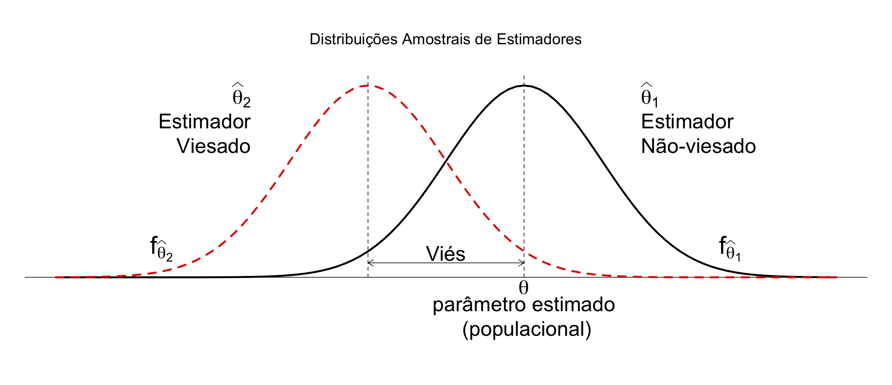
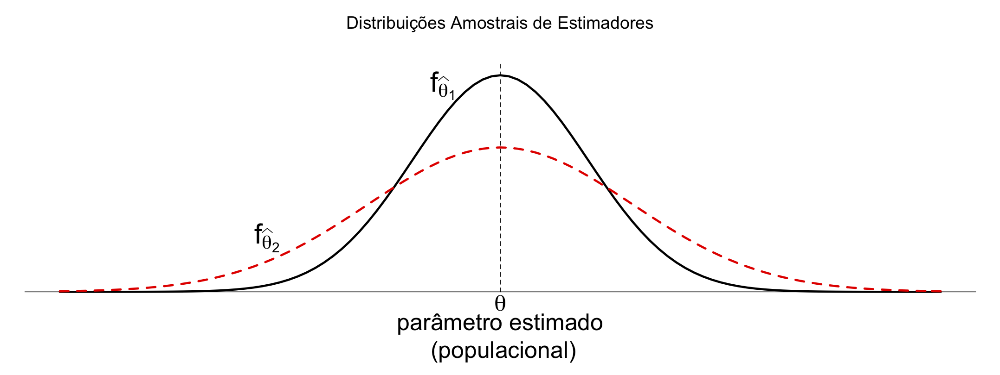
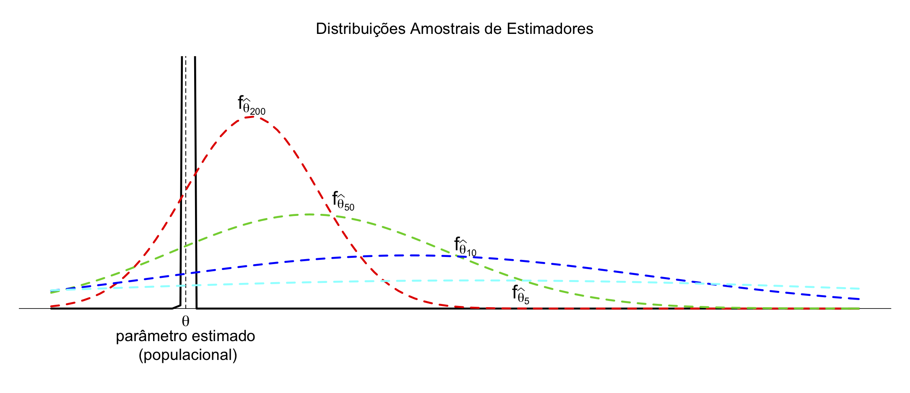
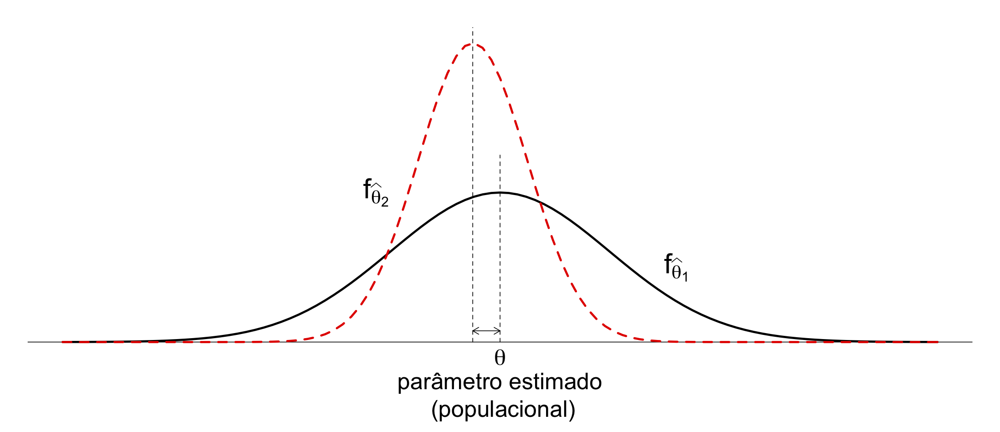

# Estimação Pontual


No capítulo anterior, vimos que um conjunto de observações pode ser entendido como uma realização de uma amostra aleatória coletada a partir de uma população com certa distribuição de probabilidade. E, considerando que esse conjunto de dados constitui uma amostra representativa da população em questão, podemos utilizá-la para fazer inferências. 

Neste sentido, realizamos inferência para transformar dados em conhecimentos, onde o conhecimento é comumente representado em termos de entidades que não estão presentes nos dados, mas estão presentes nos modelos que  utilizamos para interpretar os dados.

Em estatística clássica, assumimos que o estado da natureza (representado através de parâmetros de um modelo) é fixo, embora desconhecido. Portanto, na abordagem clássica, podemos realizar inferência de duas maneiras: 
(i) estimando o valor desconhecido de uma quantidade populacional, ou    
(ii) tomando uma decisão com relação a uma conjectura a  respeito de uma quantidade populacional.

Neste capítulo, trataremos do problema de estimação que, na estatística clássica, se baseia em duas perguntas fundamentais:

> 1. Como determinamos estimadores?  
> 2. Como avaliamos estimadores?

Veremos os conceitos de estimador e estimativa, bem como discutiremos algumas propriedades desejáveis dos estimadores para, finalmente, aprendermos como construir estimadores para certas características populacionais.

Para isso, consideremos o seguinte exemplo:

Suponha que observamos o processo de chegada de clientes a um café. E, que mais especificamente, estamos interessados em determinar: (i) taxa de chegada dos clientes; e (ii) o percentual de tempo em que nenhum novo cliente chega ao estabelecimento ( $p_o$ ).

Vimos anteriormente que, se as chegadas ocorrem completamente ao acaso no tempo e,
guardadas as hipóteses de homogeneidade e independência, o processo de chegada pode ser modelado como um processo de Poisson.


Portanto, definindo a va.  
$X$ = número de chegadas ao café (durante um certo intervalo de tempo),

então 

$X \sim Pois( \lambda )$, com $\lambda$ desconhecido.  

Utilizando o modelo de Poisson:

+ a taxa de chegada é dada pelo parâmetro $\lambda$, que corresponde ao valor esperado da distribuição;    
+ $p_o$ corresponde à probabilidade P[X = 0] = $e^{-\lambda}$.  

Inicia-se, então, a contagem do tempo e observa-se o processo de chegada por um certo período, registrando-se os valores numéricos 

$$x_1, x_2, \ldots, x_n,$$

onde:

$x_i=$ número **observado** de chegadas no $i$-ésimo instante, a partir do início da contagem do tempo.


Este exemplo ilustra a situação geral em que o conjunto de dados obtido

$$x_1, x_2, \ldots, x_n,$$

é modelado como a **realização de uma amostra aleatória**

$$X_1, X_2, \ldots, X_n,$$

retirada de uma população completamente determinada por um conjunto de parâmetros.

Note que antes de os valores serem efetivamente observados, as observações que compõe uma a.a. genérica de tamanho $n$ são representadas por letras maiúsculas.

Precisamos, então, **estimar**, com base nas quantidades observadas:

+ o parâmetro $\lambda$, e  
+ uma função do parâmetro, $p_o = e^{-\lambda}$


## Estimador e Estimativa


De maneira geral, suponha que desejamos estimar uma quantidade ou parâmetro populacional representado por $\theta$. Por exemplo, $\theta$ poderia ser a média populacional $\mu$, ou a variância populacional $\sigma^2$, ou ainda uma outra quantidade associada a essa população, como a probabilidade $p_o$ no exemplo anterior. Sendo assim, se $\theta$ for o parâmetro populacional de interesse, então:

Um **ESTIMADOR** de $\theta$, representado por $\hat\Theta$, é uma função dos valores conceituais, não-observados, de uma a.a.. O estimador é uma "regra" que nos ensina como utilizar as observações da a.a. para calcular um valor numérico que estima o parâmetro populacional em questão.

Já uma **ESTIMATIVA**, representada por $\hat\theta$, corresponde a um valor numérico calculado a partir dos valores efetivamente observados de uma a.a. em particular, utilizando a regra prescrita pelo estimador. Diferentes amostras aleatórias resultarão em diferentes estimativas para um mesmo parâmetro populacional, quando se utiliza o mesmo estimador. Qualquer que seja a regra ou o estimador utilizado, o resultado da estimativa depende apenas dos valores observados na amostra.

Imagine, por exemplo, que um alienígena deseja estimar a altura média dos seres humanos. Neste caso, o parâmetro que se deseja estimar é a média populacional $\mu$. Podemos eleger como estimador a média amostral $\bar{X}_n$. Isto significa que estimaremos a altura média populacional calculando a média aritmética dos valores observados na amostra; esta é a regra prescrita pelo estimador "média amostral". Então, coletamos uma amostra aleatória de, digamos, 20 indivíduos dessa população, calculamos a média aritmética dessas 20 observações, obtendo uma estimativa de 1,72m para a altura média populacional; uma outra amostra aleatória distinta, também contendo 20 observações, poderia nos ter dado uma estimativa de, por exemplo, 1,68m para a altura média populacional. 

Cada estimativa corresponde a um valor numérico; portanto, a estimativa $\hat\theta$ representa uma realização do estimador $\hat\Theta$. Já um estimador é uma estatística, isto é, uma função dos valores não observados de uma a.a.. Antes de os dados serem coletados, os valores da amostra aleatória são considerados v.a.'s retirados de maneira independente de uma distribuição comum. E, como qualquer função de v.a.'s é uma v.a., um estimador é também uma v.a. Portanto, um estimador possui uma distribuição amostral. Assim, a distribuição amostral do estimador descreve de maneira completa seu comportamento aleatório. Sabemos, pelo TLC, por exemplo, que o estimador média amostral tem distribuição aproximadamente normal para amostras de tamanho elevado. A ideia é, então, escolher um estimador $\hat\Theta$ capaz de nos dar boas indicações (ou estimativas) a respeito do valor "real" do parâmetro populacional $\theta$, com base nas informações disponíveis em uma amostra.


#### Estimando $\lambda$ {-}


Retomando o exemplo do café, como podemos proceder para estimar $\lambda$?

Bem, sabemos que a distribuição de Poisson tem média e variância iguais ao parâmetro populacional que a define,  $\lambda$. Já que a média populacional vale  $\lambda$, a Lei dos Grandes Números sugere que a média amostral seja um estimador natural para a média populacional. Por outro lado, o parâmetro  $\lambda$ também representa variância populacional no modelo de Poisson.  Portanto, as características da distribuição de Poisson sugerem que temos dois estimadores naturais para  $\lambda$: 

+ média amostral: 
$$\bar{X}_n = \frac{1}{n}\sum_{i=1}^n X_i$$

+ variância amostral: 
$$S_n^2 = \frac{1}{n-1}\sum_{i=1}^n (X_i - \bar{X}_n)^2$$

E as opções não param por aí... Outros estimadores também seriam possíveis! De toda forma, consideraremos apenas esses dois candidatos.


#### Estimando $p_o$ {-}


Estamos interessados também em outra quantidade populacional,  $p_o$, que corresponde à probabilidade de nenhuma ocorrência. Segundo o modelo de Poisson, esta probabilidade é dada por uma função do parâmetro $\lambda$, e vale $e^{-\lambda}$. 

Sendo assim, também temos dois estimadores naturais para  $p_o$:

+ frequência relativa de zeros observados na a.a.: 
$$\frac{\textsf{no. de observações na a.a. em que }X_i = 0}{n}$$

+ uma função do estimador de $\lambda$ (já que utilizamos a média amostral $\bar{X}_n$ para estimar a média populacional $\lambda$, podemos estimar $p_o$ substituindo o parâmetro populacional $\lambda$ na expressão de  $p_o$ pelo estimador média amostral):
$$e^{-\bar{X}_n}$$

Aqui também seria possível escolher outros estimadores, mas nos limitaremos a esses dois.


Temos inúmeras opções disponíveis de estimadores para os parâmetros populacionais de interesse; podemos empregar até mesmo funções de estimadores. Algumas questões importantes são as seguintes: 

+ *Como escolher um estimador adequado?*  
+ *Quando um estimador é melhor do que outro?*  
+ *Existe um estimador que seja o "melhor de todos"?*  
+ *Podemos determinar qual das estimativas obtidas a partir de uma mesma a.a., utilizando diferentes estimadores, se aproxima mais do valor "real" do parâmetro populacional de interesse?* 

No nosso exemplo, desejamos estimar o parâmetro $\lambda$ e, para isso, elegemos os estimadores média amostral e variância amostral para obter estimativas para o valor de $\lambda$ a partir dos valores observados para uma certa a.a.. Então, suponha que tenhamos registrado 30 observações e que tenhamos obtido as estimativas média amostral = 2,03 e variância amostral = 1,62 para essa amostra. Será que é possível determinar qual dessas estimativas (2,03 ou 1,62) se aproxima mais do valor real e desconhecido do parâmetro $\lambda$?

A resposta a esta pergunta é NÃO! As observações que compõe uma a.a. e, consequentemente, as estimativas obtidas a partir dela, são sujeitas à aleatoriedade. Portanto, não é possível afirmar com certeza qual dos valores estimados é mais próximo do valor real de lambda!

É, possível, no entanto, fazer afirmações probabilísticas a respeito da distância dessas estimativas ao valor real do parâmetro de interesse. Para isso, é necessário investigar o comportamento aleatório dos estimadores, através do conhecimento de sua distribuição amostral. E assim, sermos capazes de identificar se possuem certas características consideradas desejáveis para um estimador. É isso o que veremos a seguir.


## Propriedades de Estimadores


Há ocasiões em que muitos estimadores alternativos podem ser utilizados para estimar uma mesma quantidade populacional desconhecida. É necessário, portanto, estabelecer alguns critérios para comparar os estimadores e decidir se algum ou qual deles possui características desejáveis para um estimador. As propriedades de um estimador ideal que veremos a seguir foram conceitos introduzidos por sir Ronald Fisher na primeira metade do século XX.

A fim de discutir tais as propriedades desejadas de estimadores, vamos retomar nosso exemplo do café. Suponha que observamos as chegadas ao café que ocorreram durante 30 minutos e registramos o número de chegadas a cada minuto. Assim, obtemos um conjunto de dados, que corresponde a uma realização de uma a.a. $X_1, X_2, \ldots, X_n$, de tamanho $n=30$ de uma população com distribuição de Poisson com parâmetro ( $\lambda$ ). Com base nesta amostra, queremos estimar as quantidades populacionais de interesse: $\lambda$ e $p_o$


#### Estimando $\lambda$  {-}


Temos dois estimadores candidatos para o parâmetro $\lambda$: média amostral e variância amostral.
Qual deles devemos escolher?

Vamos utilizar simulação para nos ajudar a escolher os estimadores para os parâmetros desejados:

A título de ilustração, vamos supor que o valor real do parâmetro seja $\lambda = \ln10$;
então, vamos fingir que não conhecemos essa informação e vamos fazer um pequeno jogo de adivinhação:

+ Amostramos 30 observações a partir da população Poisson com parâmetro $\lambda = \ln10$;  
+ Calculamos os valores de $\bar{X}_n$ e $S_n^2$ para a amostra coletada; e  
+ Repetimos os dois passos anteriores um número muito grande de vezes.  

O que estamos fazendo dessa maneira? Estamos obtendo um número muito grande de valores de $\bar{X}_n$ e $S_n^2$  a fim de que possamos construir histogramas para os valores calculados para essas duas quantidades; esses histogramas estimam as distribuições amostrais das estatísticas consideradas.


```{r eval = FALSE}
lambda <- log(10)  # lambda real (desconhecido)
nS     <- 1000     # no. de a.a's coletadas
nobs   <- 30       # no. de obs. em cada amostra 
                   # (tamanho da a.a.)

# (1) obteção das amostras aleatórias
aa <- matrix(rpois(nobs*nS, lambda), ncol = nobs) 
# cada uma das 'nS' linhas recebe 
# uma amostra de tamanho 'nobs'

# (2) cálculo das estatisticas para as amostras
X_bar <- apply(aa, 1, mean)
Sn2   <- apply(aa, 1, var) 

# (3) distribuição amostral das estatisticas
# a. média amostral:
hist(X_bar, freq = FALSE,
     density = 45, col = "gray",
     main = "")
abline(v = lambda, col = 2, lty = "dashed")      # lambda "real" em  vermelho
abline(v = mean(X_bar), col = 4, lty = "dashed") # media dist. amost.em  azul

# b. variância amostral:
hist(Sn2, freq = FALSE,
     density = 45, col = "gray",
     main = "")
abline(v = lambda, col = 2, lty = "dashed")      # lambda "real" em  vermelho
abline(v = mean(Sn2), col = 4, lty = "dashed")   # media dist. amost. em  azul
```


```{r eval = TRUE, echo = FALSE, fig.height = 2.5, out.width = '100%', message=FALSE, warning=FALSE}
lambda <- log(10)  # lambda real (desconhecido)
nS     <- 1000     # no. de a.a's coletadas
nobs   <- 30       # no. de obs. em cada amostra 
                   # (tamanho da a.a.)

# (1) obteção das amostras aleatórias
aa <- matrix(rpois(nobs*nS, lambda), 
               ncol = nobs) 
# cada uma das 'nS' linhas recebe 
# uma amostra de tamanho 'nobs'

# (2) cálculo das estatisticas para as amostras
X_bar <- apply(aa, 1, mean)
Sn2   <- apply(aa, 1, var) 

# (3) distribuição amostral das estatisticas
par(mfrow = c(1,2),
    mar=c(2,4,4,0),
    cex.lab = 0.8, cex.axis = 0.8, cex.main = 0.8)
hist(X_bar, freq = FALSE, col = "gray",
     xlim=range(X_bar, Sn2),
     xlab = "",
     main = "Distribuição amostral \nmédia amostral")
abline(v = lambda, col = 2,      # lambda "real" 
       lty = "dashed", lwd = 2)  # em  vermelho
abline(v = mean(X_bar), col = 4, # media dist. amost.
       lty = "dashed", lwd = 2)  # em  azul

hist(Sn2, freq = FALSE, col = "gray",
      xlim=range(X_bar, Sn2),
     xlab = "",
     main = "Distribuição amostral \nvariância amostral")
abline(v = lambda, col = 2,      # lambda "real" 
       lty = "dashed", lwd = 2)  # em  vermelho
abline(v = mean(Sn2), col = 4,   # media dist. amost.
       lty = "dashed", lwd = 2)  # em  azul
```


Os dois gráficos com as distribuições amostrais estimadas para os estimadores média amostral e variância amostral foram obtidos com o código em R fornecido acima. Neles, é possível observar como variam os valores estimados de $\lambda$ para os diferentes estimadores, aplicados a uma grande quantidade de amostras aleatórias distintas, geradas a partir de simulação.

Para algumas amostras é possível perceber que os valores estimados diferiram consideravelmente do valor real de lambda, $\ln10$ que vale aproximadamente 2,3, independentemente do estimador utilizado. 

Queremos um estimador que, em média (ou seja, quando obtemos muitas e muitas amostras da população de origem), ofereça resultados satisfatórios, isto é, que não erre de maneira sistemática ao estimar o valor real do parâmetro de interesse.

De certa forma, os dois estimadores considerados (média amostral e variância amostral) são satisfatórios neste sentido. Note que os valores estimados para $\lambda$ parecem flutuar em torno do valor “real” em ambos os casos.

De fato, é possível demonstrar (e isso fica como exercício para casa) que
os valores esperados da média amostral e da variância amostral valem $\lambda$, ou seja, as distribuições amostrais de ambos os estimadores estão centradas no parâmetro que se quer estimar:

$$E[\bar{X}_n]=\lambda; \qquad E[S^2_n]=\lambda$$

Isto significa que os estimadores média amostral e variância amostral não apresentam uma tendência sistemática de produzir estimativas nem maiores (superestimadas) nem menores (subestimadas) do parâmetro de interesse, $\lambda$.


### Não-Tendeciosidade (exatidão) {-}


Esta é uma característica muito desejável em um estimador, chamada não-tendenciosidade ou exatidão. 
Um estimador é dito exato, ou não-tendencioso, ou não-viesado, ou não-viciado, quando sua distribuição amostral está centrada no parâmetro que se presta a estimar. Neste caso, o viés, que mede o desvio sistemático deste estimador ao parâmetro populacional, vale zero.

+ um estimador não-viesado é aquele que não tende a subestimar ou superestimar o valor real do parâmetro populacional, $\theta$  

+ a distribuição amostral de $\hat\Theta$ está centrada em $\theta$

$$E[\hat\Theta] = \theta \quad \Longrightarrow \quad \text{Viés} = b(\hat\Theta) = E[\hat\Theta] - \theta = 0$$


```{r ch10-biased-estimator, echo=FALSE, out.width = '100%', message=FALSE, warning=FALSE}

```


Ótimo, quer dizer que encontramos dois estimadores não-tendenciosos para o parâmetro $\lambda$! 

Isso significa que é indiferente escolher um dos dois? 

A resposta é NÃO! Existem outras características que também são importantes para um estimador.

Observe novamente os histogramas para os valores obtidos para os dois
estimadores. Qual a diferença entre eles?


```{r eval = TRUE, echo = FALSE, fig.height=2.5, out.width = '100%', message=FALSE, warning=FALSE}
# (3) distribuição amostral das estatisticas
par(mfrow = c(1,2),
    mar=c(3,4,3,0),
    cex.lab = 0.8, cex.axis = 0.8, cex.main = 0.8)
hist(X_bar, freq = FALSE, col = "gray",
     xlim=range(X_bar, Sn2),
     xlab = "",
     main = "Distribuição amostral \nmédia amostral")
abline(v = lambda, col = 2,      # lambda "real" 
       lty = "dashed", lwd = 2)  # em  vermelho
abline(v = mean(X_bar), col = 4, # media dist. amost.
       lty = "dashed", lwd = 2)  # em  azul
mtext(paste("variância amostral: ", round(var(X_bar), digits = 4)), 
      side = 1, line = 2, cex = 0.8 )

hist(Sn2, freq = FALSE, col = "gray",
      xlim=range(X_bar, Sn2),
     xlab = "",
     main = "Distribuição amostral \nvariância amostral")
abline(v = lambda, col = 2,      # lambda "real" 
       lty = "dashed", lwd = 3)  # em  vermelho
abline(v = mean(Sn2), col = 4,   # media dist. amost.
       lty = "dashed", lwd = 3)  # em  azul
mtext(paste("variância amostral: ", round(var(Sn2), digits = 4)), 
      side = 1, line = 2, cex = 0.8 )
```


Ambos apresentam uma certa variabilidade em torno do valor real de $\lambda$. No entanto, perceba que a variação nos valores calculados para a média amostral é menor que a variação nos valores calculados para a variância amostral. De fato, basta comparar os valores das variâncias amostrais dos dois estimadores, registradas abaixo de cada um dos histogramas. Isto indica que o estimador média amostral produz estimativas, em geral, mais próximas do valor real do parâmetro lambda que a variância amostral. E esta é uma outra característica desejável de um estimador.


### Eficiência (precisão) {-}


A eficiência é uma medida relativa de precisão de dois estimadores não tendenciosos. É dito mais eficiente o estimador não tendencioso que apresentar menor variância amostral.

+ dados dois estimadores .ired-inline[não-tendenciosos], $\hat\Theta_1$ e $\hat\Theta_2$, com variâncias amostrais dadas por $S_1^2$ e $S_2^2$:  


$\qquad \qquad S_1^2 < S_2^2 \quad \Longrightarrow \quad \hat{\Theta}_1$ é mais eficiente que $\hat{\Theta}_2$


```{r ch10-efficient-estimator, echo=FALSE, out.width = '100%', message=FALSE, warning=FALSE}

```


#### Estimando $p_o$ {-}  


Agora, vamos estimar a quantidade populacional $p_o$, que corresponde à probabilidade de nenhuma chegada no intervalo de tempo considerado (note que, como esta quantidade populacional é uma probabilidade, é um número entre 0 e 1!).

Consideraremos dois estimadores candidatos:

$$S = \frac{\textsf{no. de observações na a.a. em que }X_i = 0}{n} \qquad \textsf{e} \qquad W = e^{-\bar{X}_n}$$

O que podemos esperar desses estimadores?

Novamente, utilizaremos simulação para nos auxiliar a responder a esta pergunta, seguindo o mesmo procedimento realizado anteriormente:

+ supor $\lambda = \ln 10$ (desconhecido)  tal que $p_o = 0.1$
+ amostrar n = 30 observações a partir de Pois ( $\lambda = \ln 10$ )  
+ calcular valores os que $S$ e $W$ assumem para as observações da a.a.  
+ repetir esse procedimento um grande número de vezes
+ construir a distribuição amostral para cada estimador


```{r eval = FALSE}
lambda <- log(10)  # lambda real (desconhecido)
po <- exp(-lambda) # po real (desconhecido)

# Define Estimadores (funcoes de a.a.'s)
# Estimador freq. relativa de 0's
S_fcn <- function(x) return(sum(x == 0)/length(x))
# Estimador e^{-X_bar}
W_fcn <- function(x) return(exp(-mean(x)))

# (2) cálculo das estatisticas para as amostras
S_hat <- apply(aa, 1, S_fcn)
W_hat <- apply(aa, 1, W_fcn) 

# (3) distribuição amostral das estatisticas
# a) S
hist(S_hat, freq = FALSE,
     density = 45, col = "gray",
     main = "")
abline(v = po, col = 2,  lty = "dashed")         # po "real" em  vermelho
abline(v = mean(S_hat), col = 4, lty = "dashed") # media dist. amost. em  azul
# b) W
hist(W_hat, freq = FALSE,
     density = 45, col = "gray",
     main = "")
abline(v = po, col = 2,  lty = "dashed")         # po "real" em  vermelho
abline(v = mean(W_hat), col = 4, lty = "dashed") # media dist. amost. em  azul
```


```{r eval = TRUE, echo = FALSE, fig.height = 2.5, out.width = '100%', message=FALSE, warning=FALSE}
lambda <- log(10)  # lambda real (desconhecido)
po <- exp(-lambda) # po real (desconhecido)

# Define Estimadores (funcoes de a.a.'s)
# Estimador freq. relativa de 0's
S_fcn <- function(x) return(sum(x == 0)/length(x))
# Estimador e^{-X_bar}
W_fcn <- function(x) return(exp(-mean(x)))

# (2) cálculo das estatisticas para as amostras
S_hat <- apply(aa, 1, S_fcn)
W_hat <- apply(aa, 1, W_fcn) 

# (3) distribuição amostral das estatisticas
par(mfrow = c(1,2),
    mar=c(2,4,4,0),
    cex.lab = 0.8, cex.axis = 0.8, cex.main = 0.8)
hist(S_hat, freq = FALSE, #col = "gray",
     xlim=range(S_hat, W_hat),
     xlab = "",
     main = "Distribuição amostral \nestatística S")
abline(v = po, col = 2,          # lambda "real" 
       lty = "dashed", lwd = 2)  # em  vermelho
abline(v = mean(S_hat), col = 4, # media dist. amost.
       lty = "dashed", lwd = 2)  # em  azul

hist(W_hat, freq = FALSE, #col = "gray",
      xlim=range(S_hat, W_hat),
     xlab = "",
     main = "Distribuição amostral \nestatística W")
abline(v = po, col = 2,      # lambda "real" 
       lty = "dashed", lwd = 2)  # em  vermelho
abline(v = mean(W_hat), col = 4,# media dist. amost.
       lty = "dashed", lwd = 2)  # em  azul
```


Os gráficos com as distribuições amostrais estimadas foram obtidos com o código em R fornecido acima. Os valores estimados para $p_o$ parecem flutuar em torno do valor “real” (0,1) que pretendem estimar. Será verdade? Precisamos calcular o viés destes estimadores.

Definindo:
$Y =$ número de observações em uma amostra aleatória de tamanho $n$ em que $X_i = 0$ (sucesso), então, chegamos à conclusão de que 

$$Y \sim Bin(n, p_o)$$

É possível demonstrar (e isto fica como exercício para casa) que o estimador S, dado pela proporção de sucessos é não viesado, ou seja tem valor esperado igual a $p_o$:

$$S = \frac{Y}{n} \qquad \Rightarrow \qquad E[S] = p_o$$

Portanto, o estimador $S$ é não-viesado.

Agora, analisemos o estimador $W = e^{-\bar{X}_n}$. A partir da análise visual da distribuição amostral estimada, Podemos ter a impressão de que $W$ é também um estimador não-viesado. Mas isto não é verdade! É possível mostrar que:
$$E[W] = E[e^{-\bar{X}_n}] = e^{-n\lambda(1- e^{-1/n})}
  \quad \underset{n \rightarrow \infty}{\longrightarrow} e^{-\lambda} = p_o$$

No entanto, embora o estimador $W$ seja tendencioso, ele tem uma característica interessante: é possível mostrar que este estimador produz estimativas que convergem para o valor real de $p_o$, conforme aumenta o tamanho da amostra $n$. Sendo assim, embora o estimador seja positivamente viesado (tende a superestimar o parâmetro real), o viés tende a zero à medida em que o tamanho da amostra aumenta.


### Consistência {-}


Diz-se que um estimador é consistente quando as estimativas por ele produzidas convergem em probabilidade para o valor real do parâmetro, conforme aumenta o tamanho da amostra. Isso significa que tanto o viés quanto a variância do estimador tendem a zero, para amostras grandes.

+ à medida que o tamanho da amostra $n$ aumenta, o valor esperado do estimador consistente tende para o parâmetro populacional e a variância do estimador cai a zero: 

$$\underset{n\rightarrow \infty}{\lim} P[|\hat{\Theta}_n -\theta| < \epsilon] = 1,  \quad \{\hat\Theta_n , n\geq0\}$$


```{r ch10-consistent-estimator, echo=FALSE, out.width = '100%', message=FALSE, warning=FALSE}

```


Veja no gráfico abaixo como o valor esperado de $W$ converge para o valor real de $p_o = 0,1$, conforme tomamos amostras de tamanho crescente.


```{r eval = FALSE}
lambda <- log(10)  # lambda real
po <- exp(-lambda) # po real

# Valor esperado do estimador e^{-X_bar}
W_expectation <- function(x, lambda){ 
  return(exp(-(x*lambda)*(1-exp(-1/x))))
  }

# Gráfico de E[W] x n
plot(W_expectation(1:100, lambda), type="l",
     col = "gray", lwd = 3,
     ylab = "E [ W(n) ]",
     xlab = "tamanho da amostra, n",
     main = "")
abline(h = po, col = 2, lty = "dashed")   # po "real" em  vermelho
```


```{r eval = TRUE, echo = FALSE, fig.height = 2.5, out.width = '100%', message=FALSE, warning=FALSE}
lambda <- log(10)  # lambda real
po <- exp(-lambda) # po real

# Valor esperado do estimador e^{-X_bar}
W_expectation <- function(x, lambda){ 
  return(exp(-(x*lambda)*(1-exp(-1/x))))
  }
par(mar = c(4,4,0,0), cex.lab = 0.8)
# Gráfico de W_fcn
plot(W_expectation(1:100, lambda), type="l",
     col = "gray", lwd = 3,
     ylab = "E [ W(n) ]",
     xlab = "tamanho da amostra, n",
     main = "")
abline(h = po, col = 2,          # po "real" 
       lty = "dashed", lwd = 2)  # em  vermelho
```


::: {.example} 
<br />
:::


Seja $X_1, X_2, \ldots, X_n$ uma a.a. de uma distribuição com média $\mu$ e variância $\sigma^2$.

Responda:

1) A estatística $\overline{X}_n$ é um estimador não-tendencioso de $\mu$?    
2) A estatística $S_n^2$ é um estimador não-viesado de $\sigma^2$?    
3) A estatística $S_n$ é um estimador não-viciado de $\sigma$?    

**OBS:**  
Se $\hat{\Theta}$ é um estimador não-viesado de $\theta$, $g(\hat{\Theta})$ não-necessariamente é um estimador não-viesado de $g(\theta)$.  

Para o caso particular em que $g(\hat{\Theta}) = a\hat{\Theta} + b$, a não-tendenciosidade é transmitida. 


::: {.solution} 
<br />
:::


**1)**   
$X_1, X_2, \ldots, X_n  \overset{ind.}{\sim} f_X:$ $E[X_i] = \mu$ e $\textsf{Var}[X_i] = \sigma^2$, $i = 1, 2, \ldots, n$.

> A estatística $\bar{X}_n$ é um estimador não-tendencioso de $\mu$?

Temos: 
\begin{align*}
  E[\bar{X}_n] = E\left[\frac{1}{n}\sum X_i\right] = \frac{1}{n} \sum E[X_i] = \frac{1}{n} \sum \mu = \frac{1}{n} (n \cdot \mu) = \mu
\end{align*}

Portanto, $\bar{X}_n$ é um estimador não tendencioso de $\mu$.

**2)**  
$X_1, X_2, \ldots, X_n  \overset{ind.}{\sim} f_X:$ $E[X_i] = \mu$ e $Var[X_i] = \sigma^2$, $i = 1, 2, \ldots, n$.

> A estatística $S_n^2$ é um estimador não-viesado de $\sigma^2$?

Temos: $Var[Y] = E[Y^2] - (E[Y])^2 \Rightarrow  E[Y^2] = Var[Y] - (E[Y])^2 = \sigma^2 + \mu^2$
\begin{align*}
  E[S_n^2] 
  &= E\left[\frac{1}{n-1}\sum (X_i - \bar{X})^2\right]\\ 
  &= E\left[\frac{1}{n-1}\left(\sum X_i^2 - \frac{(\sum X_i)^2}{n}\right)\right]\\
  &= \frac{1}{n-1}\left[ \sum E[X_i^2] - \frac{E[(\sum X_i)^2]}{n} \right]
\end{align*}

\begin{align*}
  E[S_n^2] 
  &= \frac{1}{n-1}\left[ \sum (\sigma^2 + \mu^2) - \frac{Var[\sum X_i] + (E[\sum X_i])^2}{n}  \right]\\ 
   &= \frac{1}{n-1}\left[n(\sigma^2 + \mu^2) - \frac{1}{n} (n\sigma^2 + (n\mu)^2) \right]\\
  &= \frac{1}{n-1}\left[ n\sigma^2 + n\mu^2 - \sigma^2 - n\mu^2 \right] = \frac{1}{n-1}\left[(n-1)\sigma^2 \right] = \sigma^2
\end{align*}

Portanto, $S_n^2$ é um estimador não tendencioso de $\sigma^2$. 

Já $S_n$ é um estimador tendencioso de $\sigma$: $E[S_n] \neq \sigma$ (viés $\downarrow$ quando $n \uparrow$).


### Erro Médio Quadrático {-}


Nem sempre é possível obter um estimador que seja ao mesmo tempo não-tendencioso e eficiente. Além disso, pode ser difícil comparar um estimador viesado com pequena variância a um estimador não-tendencioso, mas que produz estimativas com grande dispersão.

Portanto, é desejável combinar as propriedades de não tendenciosidade e mínima variância para avaliar a qualidade de um estimador.  Esta combinação pode ser obtida através do erro médio quadrático, que corresponde à soma da variância e do viés quadrático. Sendo assim, o erro médio quadrático pode ser utilizado como uma medida relativa de eficiência na comparação de dois ou mais estimadores. Um estimador torna-se mais eficiente a medida que seu erro médio quadrático diminui.

+ O erro médio quadrático (MSE, *mean squared error*)  corresponde ao valor médio dos desvios quadráticos entre $\hat{\Theta}$ e $\theta$.

$$MSE [\hat{\Theta}] = E[(\hat\Theta - \theta)^2] = \mathit{Var}[\hat\Theta] + \left(b[\hat\Theta]\right)^2$$


```{r ch10-MSE, echo=FALSE, out.width = '100%', message=FALSE, warning=FALSE}

```


::: {.example} 
<br />
:::


Sejam $\Theta_1$ e $\Theta_2$ estimadores independentes não-tendenciosos de $\theta$, com variâncias conhecidas dadas por $\sigma_1^2$ e $\sigma_2^2$.

1)  Mostre que qualquer estimador na forma
  $$\Theta^\star = \lambda \Theta_1 + (1-\lambda) \Theta_2$$
  é também não tendencioso.

2) Qual o valor de $\lambda$ que confere a $\Theta^\star$ o menor erro médio quadrático?  


## Métodos Clássicos de Estimação de Parâmetros


Como vimos anteriormente, em alguns casos é fácil decidir como estimar certos parâmetros populacionais e as escolhas de estimadores podem ser bastante intuitivas, de forma que surgem candidatos naturais a estimadores para uma certa quantidade populacional. No entanto, há situações mais complexas em que apenas a intuição não nos servirá de muito auxílio. É necessário, portanto, estabelecer alguns métodos sistemáticos para construir estimadores para parâmetros populacionais.
Veremos a seguir dois métodos clássicos, o método dos momentos e o método da máxima verossimilhança.


### Método dos Momentos {-}


O método dos momentos é, talvez, o método de construção de estimadores mais antigo a fazer parte da caixa de ferramentas estatísticas, tendo sido desenvolvido por Karl Pearson, no final do século XIX. 
Este método de estimação baseia-se na Lei dos Grandes Números que, como vimos anteriormente, afirma que a média amostral converge para o valor esperado populacional conforme o número de observações na amostra aumenta. Sendo assim, na sua forma mais simples, o método dos momentos consiste em uma técnica que nos permite estimar os momentos de uma população com base nos momentos estimados a partir de uma amostra retirada desta população.

Seja $X_1, X_2, \ldots, X_n$ i.i.d. $f_X(x| \theta_1, \theta_2, \ldots, \theta_k)$, com $\theta = (\theta_1, \theta_2, \ldots, \theta_k)$ desconhecido.

O k-ésimo momento populacional é definido como:
$$\mu_k^\prime(\theta_1, \theta_2, \ldots, \theta_k) = E[X^k]$$

O k-ésimo momento amostral (para uma a.a. de tamanho n) é definido como:
   $$m_k^\prime  = \frac{1}{n}\sum_{i=1}^n X_i^k$$

O método dos momentos consiste em igualar os $k$ primeiros momentos amostrais aos $k$ primeiros momentos populacionais, ou seja, fazer, $m_k^\prime = \mu_k^\prime(\theta_1, \theta_2, \ldots, \theta_k)$ e resolver para $\theta_1, \theta_2, \ldots, \theta_k$; temos assim, $k$ equações a $k$ incógnitas (as incógnitas correspondem justamente aos $k$ parâmetros populacionais desconhecidos). Em geral, este procedimento leva a um conjunto de $k$ equações simultâneas não-lineares em $k$ variáveis.
 
 
O Método dos Momentos é capaz de gerar estimadores de maneira simples e intuitiva que, na maioria dos casos, são consistentes, ou seja, convergem em probabilidade para o valor real do parâmetro, conforme aumenta o tamanho da amostra. No entanto, em muitos casos, os estimadores obtidos através do método dos momentos não apresentam características desejáveis, podendo ser viesados ou ineficientes. Apesar desses inconvenientes, o método dos momentos é uma ferramenta bastante útil e amplamente utilizada, podendo ser empregado quando outros métodos de estimação de parâmetros mostram-se inviáveis.


::: {.example name="Distribuição Normal"} 
<br />
:::


Vejamos um exemplo de como obter os estimadores para a média e variância populacionais a partir de uma amostra aleatória obtida a partir de uma distribuição Normal, utilizando para isso o Método dos Momentos. Como a distribuição Normal possui dois parâmetros desconhecidos, precisaremos utilizar os dois primeiros momentos.

Seja $X_1, X_2, \ldots, X_n$ i.i.d. $N(\mu, \sigma^2)$, com $\mu,\; \sigma^2$ desconhecidos.

Momentos populacionais: $\mu_1^\prime = \mu \quad \textsf{e} \quad \mu_2^\prime = \sigma^2 + \mu^2$

Portanto, igualando aos momentos amostrais, temos:
$$\mu = \frac{1}{n} \sum_{i=1}^n X_i \quad \textsf{e} \quad \sigma^2 + \mu^2 = \frac{1}{n} \sum_{i=1}^n X_i^2$$

Resolvendo para $\mu$ e $\sigma^2$, temos:  
\begin{align*}
&\hat{\mu} = \bar{X}_n = \frac{1}{n} \sum_{i=1}^n X_i 
&\hat{\sigma}^2 = S^{\prime 2} = \frac{1}{n} \sum_{i=1}^n (X_i - \bar{X})^2
\end{align*}

Note que o estimador $\hat\sigma^2$ para a variância populacional é viesado, o que significa que o centro de sua distribuição amostral não coincide com o parâmetro $\sigma^2$ que ele se presta a estimar. Você consegue determinar o viés deste estimador?


### Método da Máxima Verossimilhança {-}


O Método da Máxima Verossimilhança é, sem dúvida, o mais utilizado para construir estimadores. O  princípio em que se baseia e a derivação das propriedades dos estimadores obtidos por este método são resultado do trabalho de sir Ronald Fisher, na primeira metade do século XX. A lógica de Fisher pode ser entendida considerando o seguinte raciocínio:

Um conjunto de $n$ observações $X_1, X_2,\ldots X_n$, obtidas de maneira independente de uma população comum $f_X(x| \theta_1, \theta_2, \ldots, \theta_k)$, com $\theta = (\theta_1, \theta_2, \ldots, \theta_k)$ desconhecido, constitui uma a.a. desta população. 

Então a probabilidade de observar estes conjunto de valores independentes de $X$ é dada pela distribuição conjunta $f(X_1, X_2, \ldots, X_n|\theta)$, que é igual ao produto das distribuições marginais, já que as variáveis aleatórias $X_1, X_2, \ldots X_n$ são independentes. 

Para uma determinada amostra, esta distribuição conjunta é uma função apenas dos parâmetros populacionais desconhecidos dado pelo vetor $\theta$, a que Fisher chamou de **Função de Verossimilhança**. 

A função de verossimilhança para uma a.a. é dada por:

$$f(X_1, X_2, \ldots, X_n| \theta) = \prod_{i = 1}^{n} f(X_i| \theta) = L(\theta)$$

Ele sugeriu então, que o valor de $\theta$ deve ser tal que maximiza a função de verossimilhança, de forma que a amostra obtida seja uma amostra bastante provável, dado o parâmetro estimado para esta população, não uma amostra rara.

O objetivo, então, é maximizar a função $L(\theta)$ para um certo conjunto de dados (uma amostra). Em muitos casos, este problema se reduz a um exercício simples de cálculo diferencial. Note que a primeira derivada nula é uma condição necessária, mas não suficiente, para garantir que um máximo foi encontrado. 

Portanto, o estimador de máxima verossimilhança é aquele que maximiza a probabilidade de obter os dados observados:
$$\frac{\partial L(\theta)}{\partial \theta_i}=0, i = 1, \ldots, k \quad \Rightarrow \quad  \hat\theta(\mathbf{x}) = \arg \underset{\theta}{\max} L(\theta|\mathbf{x})$$

Em geral, os estimadores de máxima verossimilhança coincidem com os estimadores obtidos pelo Método dos Momentos, embora o conjunto de equações simultâneas obtidas pelo Método da Máxima Verossimilhança seja mais difícil de resolver que aquele obtido para o Método dos Momentos.

Fisher mostrou, ainda, que para amostras grandes os estimadores de máxima verossimilhança costumam apresentar características muito desejáveis:

- são assimptoticamente não tendenciosos (consistentes);  
- são assimptoticamente eficientes,  de forma que apresentam a menor variância dentre todos os estimadores não viesados (BUE, "best unbiased estimators"); e, além disso,
- respeitam o **Princípio da Invariância**:  
  $\hat\theta(\mathbf{x})$ é estimador de MV de $\theta \Rightarrow g(\hat\theta(\mathbf{x}))$ é estimador de MV de $g(\theta)$

Uma observação final, digna de nota, é a seguinte: ao utilizar o princípio da máxima verossimilhança, estamos assumindo que existe um máximo global para esta função. Especialmente para dimensões elevadas (isto é, quando há  diversos parâmetros a serem estimados), a função de verossimilhança pode possuir diversos ótimos locais, de forma que encontrar o máximo global pode se converter em um problema computacional complexo.

Para observações independentes, como vimos, a função de verossimilhança consiste no produto das distribuições marginais. O máximo desta função pode ser obtido igualando as diferenciais parciais de $L$ com relação a cada parâmetro desconhecido a zero. Obter esta solução pode ser difícil, mesmo quando temos apenas um parâmetro a ser estimado. Como o $\log L$ é uma função monotônica crescente de $L$, resolver a equação obtida igualando a derivada do logaritmo da função de verossimilhança a zero é uma tarefa mais simples, que resulta na mesma solução. Assim, para maximizar a função de verossimilhança, é comum fazer $\partial\log L(\theta)/\partial\theta_i = 0$, em vez de $\partial L(\theta)/\partial \theta_i = 0, \; i = 1, \ldots, k$.


::: {.example name="Distribuição Normal"} 
<br />
:::


Assim como fizemos para o método dos momentos, vejamos um exemplo de como obter os estimadores de máxima verossimilhança para a média e variância populacionais a partir de uma amostra aleatória obtida a partir de uma distribuição Normal.

Sejam $X_1, X_2, \ldots, X_n  \overset{i.i.d.}{\sim} N(\mu, \sigma^2)$. 

A função de verossimilhança para esta a.a. é:

$$L(\mu, \sigma^2) = \prod_{i = 1}^{n} N(X_i; \mu, \sigma^2) 
                   = \left( \frac{1}{\sigma\sqrt{2\pi}} \right)^n
                     \exp\left[ -\frac{1}{2\sigma^2} \sum_{i =1}^{n} (X_i - \mu)^2\right]$$
                     
Tomando as derivadas parciais do logaritmo de $L$ ( $l = \log L$ ) com respeito a $\mu$ e $\sigma^2$, chegamos ao seguinte sistema de equações a duas incógnitas:


\begin{align*}
  \frac{\partial l}{\partial \mu} = \frac{1}{\sigma^2} \sum(X_i - \mu) =0\\
  \frac{\partial l}{\partial \sigma^2} = \frac{n}{2\sigma^2} + \frac{1}{2\sigma^4} \sum(X_i - \mu)^2 =0
\end{align*}


Resolvendo para $\mu$ e $\sigma^2$, obtemos:


\begin{align*}
&\hat{\mu} = \bar{X} = \frac{1}{n} \sum X_i \\
&\hat{\sigma}^2 = S^{\prime 2} = \frac{1}{n} \sum (X_i - \bar{X})^2
\end{align*}


Lembre-se que é necessário verificar se estes correspondem a pontos de máximo, através da avaliação das segundas derivadas.

Note que, neste caso, os estimadores de máxima verossimilhança para média e variância populacionais de uma distribuição Normal são os mesmos daqueles obtidos pelo Método dos Momentos, embora isso nem sempre ocorra.
