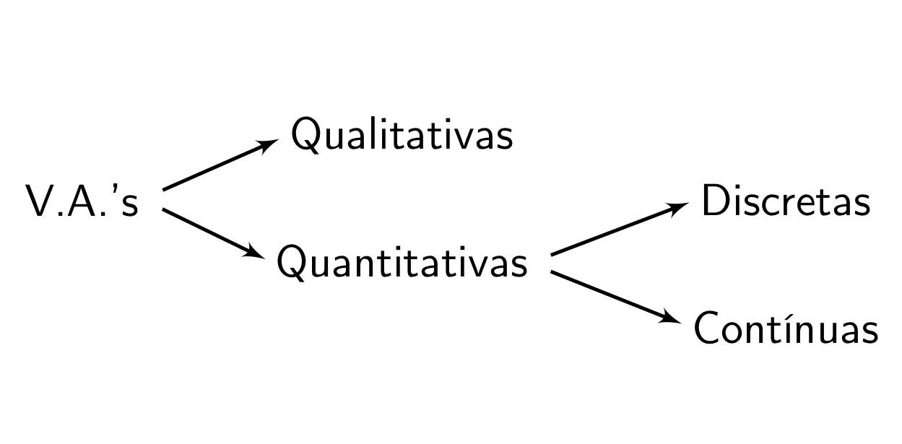
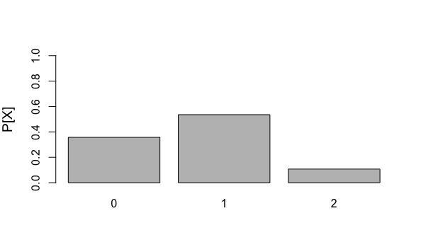
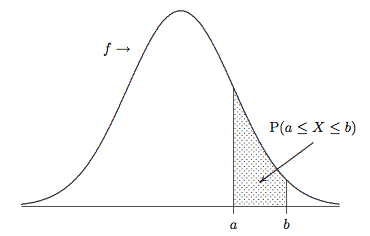
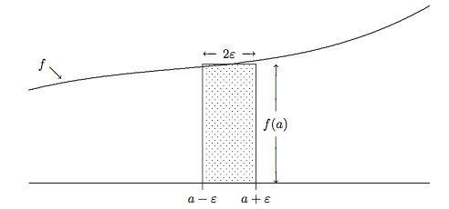
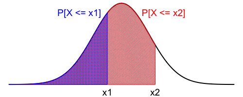
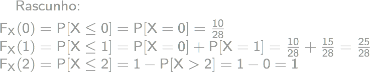
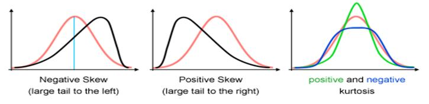

# Variáveis Aleatórias e Distribuições

A partir de agora, nosso estudo de teoria de probabilidades começa a ficar mais interessante, pois  vamos introduzir o conceito de variáveis aleatórias, que nos permitirá analisar situações de incerteza muito mais complexas do que vimos até então.

Iniciaremos relembrando brevemente o que vimos dos fundamentos de teoria de probabilidades.

Vimos que, para um experimento aleatório E, ao determinar o espaço amostral associado a este experimento (que consiste no conjunto de todos os resultados possíveis) e, ao definir a função de probabilidade a cada evento do espaço amostral (que representa a crença na propensão da ocorrência de cada evento do espaço amostral) temos uma descrição probabilística completa da situação de incerteza representada pelo experimento:

$E$: experimento aleatório;  
$\Omega$: espaço amostral associado a E; e   
$P$: função de probabilidade definida em todo evento $A \in \Omega$   
...fornecem uma **descrição probabilística completa** do experimento em questão!

Por exemplo, se considerarmos o experimento aleatório que consiste em lançar uma moeda honesta e observar o resultado obtido, a descrição completa dessa situação de incerteza é dada pelo espaço amostral (que contém todos os resultados possíveis do experimento, que neste caso, é o conjunto dos resultados cara ou coroa), bem como a definição da lei de probabilidade associada a cada elemento no espaço amostral:

$E$: Lançar uma moeda honesta e observar o resultado.  
$\Omega = \{cara, coroa\}$  
$P[cara] = 1/2$  
$P[coroa] = 1/2$  

Agora, imagine que estejamos diante de uma situação um pouco mais complexa, em que se deseja conduzir uma pesquisa de opinião a fim de obter informação a respeito do apoio de um grupo a uma certa causa. Para isso, uma amostra de 50 pessoas pertencentes a esse grupo que serão entrevistadas foi selecionada. Cada pessoa entrevistada vai, então, manifestar a sua opinião, respondendo: "sou favorável" ou "não sou favorável" à causa em análise.

De que maneira podemos representar o espaço amostral associado a esse experimento?

Registrando o valor "1" para representar uma resposta positiva e o valor "0" para representar uma resposta negativa, o espaço amostral associado a este experimento é definido por todas as n-uplas de tamanho 50, que representam todas as respostas possíveis para os 50 indivíduos que compõe a amostra:

$$\Omega = \{ (0, 0, \ldots, 0), (1, 0, \ldots, 0), \ldots, (0, 0, \ldots, 1), (1, 1, \ldots, 0), \ldots, (1, 1, \ldots, 1)\}$$

Podemos ter todas as respostas negativas; ou podemos observar apenas uma resposta positiva e, neste caso, precisamos registrar se foi o primeiro entrevistado a dar seu voto favorável, ou apenas o segundo, ou apenas o terceiro, e assim sucessivamente, até o último entrevistado; ou podemos ter apenas duas respostas positivas e, assim, por diante, até chegar ao último resultado possível, que corresponde a todos os 50 indivíduos entrevistados apresentando seu apoio em favor da causa.  

A cada elemento desse espaço amostral está associado um valor definido pela lei de probabilidade e, a partir daí, podemos calcular qualquer probabilidade relativa a este experimento. Não há problema algum com esse procedimento, exceto pelo fato de que este espaço amostral tem $2^{50}$ elementos! E, com isso, precisaríamos definir $2^{50}$ valores de probabilidade, um para cada elemento que compõe o espaço amostral.

No entanto, a questão que de fato importa é a seguinte: será que nós estamos realmente interessados na **descrição probabilística completa** desse experimento? Ou será que estamos interessados em apenas um **aspecto específico** do experimento? Será que é necessário descrever completamente esse experimento aleatório, ou podemos analisar apenas os aspectos de interesse?

Por exemplo, se estivermos interessados em responder apenas à pergunta: *"Qual a probabilidade de que no mínimo 26 das 50 pessoas apoiem a causa?"*  Como é possível transformar o espaço amostral para simplificar sua análise, reduzindo-o a fim analisar apenas os aspectos de interesse?

Podemos definir uma variável que captura a essência do problema:

$X$ = no. de pessoas que apóiam a causa, dentre as 50 entrevistadas.

O experimento aleatório associado consiste em:

$E$ = entrevistar 50 pessoas e registrar o número de respostas favoráveis.

Agora, o espaço amostral correspondente é dado por:

$$\Omega = \{0, 1, 2, \ldots, 50\}$$

...que é muito menor e, portanto, mais fácil de lidar!

Isso equivale a construir um novo experimento aleatório que agora consiste em entrevistar 50 pessoas e registrar, não a resposta de cada indivíduo, mas apenas o total de respostas favoráveis. Com isso, temos um novo espaço amostral associado a esse novo experimento. Neste caso, o espaço amostral passa ser composto pelos resultados 0, 1, 2, até 50 (representando, respectivamente os resultados em que nenhum, um, dois até 50 respostas favoráveis foram obtidas). Este novo espaço amostral tem apenas 51 elementos e, portanto, é muito mais fácil de analisar e de determinar os valores de probabilidade associados a cada elemento desse novo espaço amostral!

Portanto, chegamos à conclusão de que escolha do espaço amostral associado a uma situação de incerteza não é única, mas depende da quantidade de detalhes do fenômeno aleatório que queremos incluir no nosso modelo. Ao definir a quantidade $X$, definimos um mapeamento ou uma função do espaço original para um novo espaço amostral que pode ser mais facilmente analisado do que o espaço amostral original, como veremos a seguir.

## Variáveis Aleatórias  

### Definição (caso unidimensional)  {-}

Uma variável aleatória (v.a.) é uma **função** que associa cada elemento do espaço amostral (descrito com palavras) a um número real, i.e., **v.a. é uma representação matemática dos eventos de um espaço amostral**, ou seja, embora o nome dessa quantidade seja *variável*, ela é uma *função* que vai associar a cada elemento $s$ do espaço amostral um número real $x$, que corresponde ao valor assumido pela função $X(s)$. 

Assim, a função variável aleatória tem o domínio no espaço amostral, e o contra-domínio no conjunto dos números reais. Portanto, a probabilidade do evento $s$, que é um elemento do espaço amostral, é igual à probabilidade de que a variável aleatória $X$ associada a esse evento assuma o valor $x$; e essa probabilidade é representada simplesmente por $p(x)$. E, é claro, $p(x)$ deve satisfazer os axiomas de Kolmogorov a fim de que seja uma função probabilidade válida.

**Notação:**

$X(\cdot): \Omega \rightarrow \Re$ 

onde $s$ é qualquer evento em $\Omega$

Probabilidade do evento $s$:
$\{X(s) = x\} \; \Rightarrow \; P[X(s) = x] = P[X = x] = p(x)$

Aqui há uma observação importante a ser feita: representaremos uma variável aleatória, isto é, a função, por letra maiúscula, $X$; já o valor observado dessa função, que corresponde a uma realização dessa variável aleatória, ou os valores que essa variável aleatória pode assumir, serão representados por letras minúsculas, $x$.

### Tipos de Variáveis Aleatórias {-}

Neste curso, trataremos de variáveis aleatórias quantitativas. E essas variáveis quantitativas podem ser classificadas como sendo discretas ou contínuas.

**V.A.'s Discretas**

Uma v.a. $X$ é dita **discreta** quando o espaço amostral associado a ela é enumerável, podendo ser finito ou infinito, isto é, se assumir um número **finito** ou **infinito e enumerável** de varlores reais distintos $x_1, x_2, \ldots, x_n, \ldots$. Este é o caso quando anlisamos um processo aleatório que envolve a contagem do número de certas ocorrências: por exemplo, quando quero monitorar o número de caras em 10 lançamentos de uma moeda honesta, ou quantas vezes tenho que lançar uma bola de basquete até que eu acerte a cesta, ou posso estar interessada no número de pessoas que chegaram a uma agência bancária entre meio dia de 1h da tarde e assim por diante. Ou seja, estou modelando um processo aleatório que envolve contagem.  

**V.A.'s Contínuas**

Uma v.a. $X$ é dita **contínua** quando está associada a um espaço amostral não enumerável, ou seja, temos uma quantidade infinita de elementos e é impossível enumerável-los, ou seja, se assumir um número  **infinito não-enumerável** de varlores reais e a probabilidade de que $X$ assuma um valor em particular é nula. Este é o caso quando estamos diante de uma situação em que o resultado do experimento aleatório é uma medição, por exemplo: o tempo de duração de um atendimento médico, o comprimento de uma peça produzido por um determinado processo industrial, o tempo de vida de um equipamento eletrônico e assim por diante.

Vejamos alguns exemplos de variáveis aleatórias discretas e contínuas:

::: {.example #unnamed-chunk-1}
:::

Componentes eletrônicos fabricados em uma linha de produção são submetidos a inspeção, sendo classificados como defeituosos ou não-defeituosos (só existem essas duas possibilidades). Suponha que a probabilidade de um item defeituoso seja 0,1.

O espaço amostral associado a esse experimento é formado por dois únicos resultados possíveis: o item é classificado como defeituoso ou não-defeituoso; e, portanto, está associado a uma v.a. discreta, pois temos um conjunto de resultados possíveis finito e enumerável:

${\Omega = \{D, N\}}$   (discreto: no. finito de possibilidades)

Podemos definir a variável aleatória $X$ que vai assumir valor zero, se o item é defeituoso; e  valor um, se o item é não defeituoso. 

$${X = \left\{
      \begin{array}{ll}
      0, & \textsf{ se o componente é defeituoso}\\
      1, & \textsf{ se o componente é não-defeituoso}
      \end{array} \right.}$$

Com isso, cria-se uma função (a variável aleatória $X$) que mapeia cada elemento do espaço amostral a um número real.

Podemos representar as probabilidades dos eventos do espaço amostral em termos da variável aleatória definida: a probabilidade de o item ser defeituoso corresponde à probabilidade de que $X$ assuma valor 0 (que vale 0,1);  a probabilidade de o item ser não-defeituoso corresponde à probabilidade de que $X$ assuma valor 1 (que vale 0,9). Podemos também representar graficamente os valores de probabilidade associados aos valores da va. $X$.  

$P[D] = P[X = 0] = 0,1$  
$P[N] = P[X = 1] = 0,9$

::: {.example #unnamed-chunk-2}
:::

Vamos imaginar que estejamos interessados agora em outro aspecto do mesmo experimento aleatório: monitorar o número de itens produzidos até observar o primeiro defeituoso. Isto define a variável aleatória de interesse.

$X$ = no. de itens produzidos até a observação do primeiro defeituoso.

O espaço amostral, nesse caso, é formado pelos seguintes eventos: se o primeiro item produzido for defeituoso, temos o evento 'D' e acabou o experimento; se o primeiro item for não defeituoso e o segundo for defeituoso temos o evento 'ND', e assim, sucessivamente. Pode até ser que não se observe nenhum item defeituoso, indefinidamente... Perceba que este espaço amostral tem um número infinito de elementos. No entanto, podemos enumerá-los. E, como temos um conjunto enumerável de possibilidades a variável aleatória $X$ aqui representada, é uma v.a. discreta.

+ Espaço amostral: ${\Omega = \{D, ND, NND, NNND, \ldots\}}$   
+ ${X(\underbrace{NNN \ldots N}_{i-1}D) = i}$

::: {.example #unnamed-chunk-3}
:::

Seja a v.a. definida pelo tempo de espera (em segundos) para que duas mensagens cheguem a uma caixa de email. Esta é uma medida de tempo e vamos assumir que nosso cronômetro tenha precisão infinita. Então, o espaço amostral é definido por um intervalo, que tem uma quantidade infinita e não enumerável de possibilidades. Portanto, a va. $X$ associada a esse espaço amostral é contínua. 

+ Espaço amostral: ${\Omega = \{ x \in \Re: x \geq0\}}$ (contínuo)

::: {.example #unnamed-chunk-4}
:::

Sabe-se que uma máquina de envase de suco de laranja preenche os recipientes com um volume entre 0,9L e 1,1L. Seja $X$ a v.a. que registra o volume de suco no recipiente. Novamente, assumiremos que nosso instrumento de medição tem precisão infinita. O espaço amostral é definido por todos os volumes possíveis entre 0,9 e 1,1L. Esse é um espaço amostral com um número infinito e incontável de possbilidades e, portanto, a variável $X$ é uma v.a. contínua.

+ Espaço amostral: ${\Omega = \{ x \in \Re: 0,9 < x < 1,1 \}}$ (contínuo)

Começamos a perceber que essas v.a.'s definidas nos exemplos anteriores passam a transformar um espaço amostral em outro que seja mais conveniente, para os propósitos da investigação de interesse.

Em outras palavras, as v.a.'s servem para reduzir a complexidade do espaço amostral associado a um experimento aleatório, ao proporcionar uma descrição matemática mais sucinta, com menor nível de detalhamento do que a descrição completa do fenômeno aleatório sendo investigado, e que se relaciona mais diretamente com os aspectos de interesse desse experimento.

Ao criar um artifício matemático que simplifica os cálculos de probabilidade, obviamente há um preço a ser pago: precisamos agora **determinar a distribuição de probabilidades** associada à v.a. $X$ que, para uma v.a. discreta, corresponde aos valores de probabilidade associados cada valor que essa v.a. assume. É isso o que veremos a seguir.

## Distribuições de Probabilidade

### Função Distribuição de Probabilidade (fdp): caso discreto {-}

Uma vez definida a variável aleatória $X$, o espaço amostral $\Omega$ perde sua importância;  para descrever toda a informação probabilística a respeito da variável aleatória discreta $X$, basta identificar todos os valores discretos $x_1, x_2, \ldots$, que a variável aleatória $X$ pode assumir e os valores de probabilidade correspondentes. Essa informação está contida na função distribuição de probabilidade de $X$, dada pela função:

\begin{align*}
  f_X(\cdot): \Re \rightarrow [0,1] \quad \text{tq} \quad {f_X(x)} =
  \left\{
  \begin{array}{ll}
    P[X=x_j], & \text{ se } x = x_j, \\
    0, & \text{ se } x \neq x_j
  \end{array} 
  \right.
  \\
  \quad j = 1, 2, \ldots, n, \ldots
\end{align*}  

$f(x)$ tem como domínio o conjunto dos números reais (e isto é uma consequência da definição de variável aleatória que, por sua vez, tem domínio no espaço amostral e contradomínio na reta real). Como os valores da função distribuição de probabilidade, no caso discreto, representam valores de probabilidade, a fdp tem contradomínio no intervalo real de 0 a 1.

A função distribuição de probabilidade vai corresponder ao valor da probabilidade para cada um dos pontos em que a v.a. discreta $X$ está definida; e vale zero, para valores diferentes daqueles que a v.a. $X$ pode assumir (isso significa que a probabilidade de que $X$ assuma um valor não admissível é zero, ou seja, a probabilidade de um resultado impossível vale zero!) 

Sendo assim, a fdp indica como a probabilidade total está distribuída por todos os valores que a v.a. $X$ pode assumir;  os valores de uma v.a. discreta geralmente são chamados de **pontos de massa** e, por este motivo, também é comum que a fdp seja chamada **função massa de probabilidade**.

Precisamos garantir que a fdp seja uma função probabilidade, ou seja, que respeite as condições dadas pelos axiomas de Kolmogorov. Sendo assim, essa função não pode assumir valores negativos; ela vale zero para os pontos em que a v.a. $X$ não está definida; e, finalmente, a soma de todos os valores de probabilidade para os pontos em que ela está definida vale 1:

1. ${f_X(x_j) \geq 0}$ para  ${j = 1, 2, \ldots, n, \ldots}$  
2. ${f_X(x_j) = 0}$ para  ${x \neq x_j; \quad j = 1, 2, \ldots, n, \ldots}$  
3. ${\sum_j f_X(x_j) = 1}$

::: {.example #unnamed-chunk-5 name="Computadores defeituosos"}
:::

Um lote de 8 computadores em uma loja contém 3 defeituosos.
Um cliente seleciona 2 destes computadores ao acaso para comprar.  
Qual a distribuição de probabilidade para o número de computadores defeituosos comprados?

::: {.solution}
:::

Em primeiro lugar, precisamos identificar qual é a v.a. de interesse e quais os valores que essa variável aleatória pode assumir. Às vezes, essa tarefa se torna mais fácil identificando o espaço amostral associado ao experimento aleatório em questão. 

Note que a pergunta já orienta a identificação da variável aleatória envolvida. Então, vamos escolher a v.a. $X$ como sendo o número de computadores defeituosos comprados pelo cliente. Ele comprará 2 computadores e, dentre eles, pode ser que nenhum seja defeituoso, ou apenas um deles seja defeituoso ou os dois computadores comprados sejam defeituosos; isso, por sua vez, define o espaço amostral associado a este experimento. Portanto:

$X$ = no. de computadores defeituosos comprados pelo cliente  
${\Omega = \{0,1,2\}}$  

A fim de determinar a fdp de $X$, devemos calcular os valores das probabilidades para todos os elementos do espaço amostral:

\begin{align*}
 & f_X(0) = P[X=0] = \frac{\binom{3}{0}\binom{5}{2}}{\binom{8}{2}} = \frac{10}{28}\\
 & f_X(1) = P[X=1] = \frac{\binom{3}{1}\binom{5}{1}}{\binom{8}{2}} = \frac{15}{28}\\
 & f_X(2) = P[X=2] = \frac{\binom{3}{2}\binom{5}{0}}{\binom{8}{2}} = \frac{3}{28}
\end{align*}

A probabilidade de que nenhum computador seja defeituoso é a probabilidade de que a v.a. $X$ assuma valor igual a zero. Essa probabilidade pode ser calculada pela definição clássica, como sendo a razão entre o número de resultados favoráveis e o número de resultados possíveis. No denominador de $f_X(0)$ temos um total de 8 computadores, dos quais escolheremos 2. O número de maneiras com que isso pode ser feito é dado pela combinação de 8, 2-a-2. Já no numerador, temos o no de resultados favoráveis: neste caso, nenhum computador defeituoso será selecionado a partir dos 3 defeituosos disponíveis e os dois computadores comprados serão selecionados a partir dos 5 não-defeituosos que existem na loja. Portanto, temos o produto da combinação de 3, 0-a-0 e da combinação de 5, 2-a-2. Isso nos dá uma probabilidade de 10/28.

Um procedimento análogo é realizado para os demais valores assumidos pela v.a. $X$. Para $X=1$, temos um computador selecionado a partir dos 3 defeituosos da loja e um computador selecionado a partir dos 5 não-defeituosos. O denominador é o mesmo, pois o número de resultados possíveis não se altera. A probabilidade de comprar apenas um computador defeituoso vale, então, 15/28. E, no caso de $X = 2$,  os dois computadores comprados são selecionados a partir do total de 3 defeituosos da loja.

Podemos organizar os valores de probabilidade calculados  em uma tabela, a fim de tornar mais explícita a apresentação da distribuição de probabilidade de $X$, ou, ainda, através de um gráfico de frequências.

(\#fig:ch5-comp)Função distribuição de probabilidade do número de computadores defeituosos comprados.

### Função Distribuição de Probabilidade (fdp): caso contínuo {-}

Vamos definir agora a função distribuição de probabilidade para variáveis aleatórias contínuas. 
Primeiro, vamos lembrar que variáveis aleatórias contínuas são associadas a processos aleatórios que descrevem algum tipo de medição. Se nós pensarmos bem, todas as medições são, de fato discretas (já que não temos precisão infinita), então, em princípio, tudo pode ser modelado por variáveis aleatórias discretas. O contínuo, na realidade não existe; v.a.’s contínuas são uma abstração matemática que ajudam a simplificar os cálculos. 

Podemos entender v.a.'s contínuas como o resultado de um processo de refinamento (infinito) de v.a.'s discretas. Vejamos, através de um exemplo, o que isso quer dizer:

Suponha que  uma v.a. discreta $X$, associada a um determinado experimento aleatório, cujos detalhes não nos interessam nesse momento, assuma o valor 3,5 com probabilidade $p$. Imagine que os valores assumidos por esta va são o resultado de uma medição e, que conseguimos melhorar nosso processo de medição, de tal forma que agora conseguimos obter o valor de mais uma casa decimal. Isso significa que o valor de  probabilidade $p$ associado ao valor 3,5 terá que ser distribuído entre todos os valores obtidos a partir do refinamento. Então, $p$ deve corresponder à soma das probabilidades de observar os valores entre 3,50 e 3,59. Cada um desses valores vai ocorrer com uma probabilidade, $p_i$:

$${p = P[X = 3,50] + P[X = 3,51] + ... + P[X = 3,59] = \sum_{i=1}^{10} p_i}$$

Se for possível uma nova melhoria no processo de medição, de forma que uma casa decimal adicional seja obtida, teremos para cada $p_i$ um refinamento equivalente, ou seja, o valor de cada probabilidade $p_i$ deverá ser redistribuído. A cada novo refinamento, o valor da probabilidade $p_i$ vai ficando cada vez menor. Se o processo de refinamento continua indefinidamente, cada $p_i$ tende a zero.  

A probabilidade de que $X$ assuma um valor com maior precisão (com mais casas decimais) vai se aproximando de zero e, no entanto, a probabilidade de que os valores possíveis para a v.a. se encontrem um determinado intervalo fixo que vai de $[a,b]$, neste exemplo  $a=3,50$  a $b=3,59$, se estabiliza.

Assim, a definição de função distribuição de probabilidade para o caso contínuo é um pouco diferente daquela que vimos para o caso discreto.

Para uma variável aleatória contínua, a fdp, também chamada de .stand-out[função densidade de probabilidade], é definida como sendo a função que tem domínio no conjunto dos reais (assim como antes, já que o domínio depende da definição da função v.a.), mas o contradomínio não é o intervalo entre 0 e 1; agora,$f$ pode assumir qualquer valor real não negativo.

Seja $X$ uma v.a. contínua. Definimos a fdp de $X$ como sendo a função:

${f_X(\cdot): \Re \rightarrow [0,\infty)}$ tal que, para quaisquer números ${a \leq b}$

\begin{align*}
  P[a \leq X \leq b] =\int_{a}^{b} f_X(u) du
\end{align*}

Veja, também, que agora a fdp para uma v.a. contínua não é definida como um valor de probabilidade. A probabilidade de que $X$ se encontre em uma faixa de valores que vai de $a$ até $b$ é dada pela integral definida de $a$ até $b$ da fdp de $X$.  

As condições para que esta função seja uma função probabilidade também decorrem da definição axiomática de Kolmogorov e consistem em: que a função $f_X(x)$ não assuma valores negativos; a integral de $f_X(x)$ sobre todo o seu domínio deve ser igual a 1; e , finalmente, a probabilidade de que $X$ assuma um valor fixo igual à constante real $C$ é nula (isso significa que, num espaço amostral infinito, a probabilidade de observar **exatamente** um valor real $C$ vale zero):

1. ${f_X(x) \geq 0, \; \forall x \in \Re}$   
2. ${\int_{-\infty}^{\infty} f_X(x) dx= 1}$    
3. ${P[X=c] =0, \; \forall c \in \Re}$  

Como consequência dessa definição, ao calcular a probabilidade de que $X$ se encontre num intervalo real que vai de $a$ até $b$, não faz diferença se as extremidades do intervalo são abertas ou fechadas. Portanto, para quaisquer números $\mathsf{a < b}$:

$${P[a \leq X \leq b] = P[a < X \leq b] = P[a \leq X < b] = P[a < X < b]}$$  
Desta maneira, decorre da definição que a  probabilidade de que $X$ se encontre no intervalo $[a,b]$ é dada pela área sob a curva da fdp de $X$ no intervalo $[a,b]$, como ilustra a figura.

A fdp para uma v.a. contínua não pode ser entendida como a probabilidade de $X$ assumir um determinado valor.

$$P[a - \epsilon \leq X \leq a+ \epsilon] = \int_{a-\epsilon}^{a+\epsilon} f_X(u) du \stackrel{\epsilon \rightarrow 0}{\approx} 2 \epsilon f_X(a)$$

Para um intervalo de comprimento $2\epsilon$ centrado em $a$, conforme a largura do intervalo diminui (ou seja, fazendo $\epsilon$ tender a zero), o valor de probabilidade também tende a zero. Sendo assim, a fdp de $X$ em $a$ pode ser entendida como uma medida relativa da chance de que $X$ se encontre em uma .stand-out[vizinhança] de $a$ e pode assumir um valor arbitrariamente grande para $X=a$.

::: {.example #unnamed-chunk-7 name="Projétil"}
:::

Queremos construir um modelo probabilístico para o seguinte experimento:
um projétil atinge um disco de raio $r$ de maneira completamente arbitrária (isso significa que qualquer ponto do disco é igualmente provável e o projétil não pode cair fora do disco). Estamos interessados na distância $X$ entre o ponto atingido pelo projétil e o alvo (centro do disco). A fdp de $X$ é dada por:

\begin{align*}
  f_X(x) = 
  \left\{
  \begin{array}{ll}
    \frac{2x}{r^2}, & 0 \leq x \leq r \\
    0, & \text{caso contrário}
  \end{array} 
  \right.
\end{align*}  

1. Verifique que a condição (2) é válida.   
2. Calcule $P[0 < X \leq r/2]$.  

::: {.solution}
:::

1. Condição (2): $\int_{-\infty}^{\infty} f_X(x) dx = 1$

$$\int_{-\infty}^{\infty} f_X(x) dx = \int_{0}^{r} \frac{2x}{r^2} dx = \frac{2}{r^2}\left[\frac{1}{2}x^2\right]_{0}^{r} = \frac{1}{r^2} [r^2 - 0] = 1  \qquad \therefore \qquad \text{OK!}$$

2. Para determinar a probabilidade de que o projétil esteja a uma distância máxima do cento igual à metade do raio do disco, vamos calcular a integral de zero a $r/2$ da fdp de $X$. 

$$P[0 < X \leq r/2] =  \int_{0}^{r/2} \frac{2x}{r^2} dx = \frac{2}{r^2}\left[\frac{x^2}{2}\right]_{0}^{r/2} = \frac{1}{r^2}\left[\frac{r^2}{4} - 0 \right] = \frac{1}{4}$$

Veja que esta probabilidade encontrada independe do raio $r$ do disco!

### Função Distribuição Acumulada (FDA) {-}

É possível representar a distribuição de probabilidade de uma v.a. através de uma medida acumulada, a chamada **função distribuição acumulada**, ou FDA. Diferentemente da fpd, a FDA é **unicamente determinada** para cada v.a. e pode ser utilizada para calcular probabilidades associadas a essa v.a.

A FDA de uma v.a. $X$, representada por ${F_X(\cdot)}$ é a função:

\begin{align*}
  &{} {F_X(\cdot): \Re \rightarrow [0, 1]\qquad \text{tq} \qquad
      F_X(x) = P[X \leq x], \quad -\infty < x < \infty}
\end{align*}

A FDA de uma v.a. $X$  consiste em uma função com domínio no conjunto dos reais, que assume valores no intervalo $[0,1]$, pois representa um valor de probabilidade, independentemente se a v.a. é discreta ou contínua. A FDA é definida como sendo a probabilidade de que a v.a. $X$ assuma um valor menor ou igual a $x$, para qualquer valor de $x$ real. Para que seja FDA, a função  $F_X(x)$ deve satisfazer as seguintes condições:

1. ${F_X(\cdot)}$ é monotônica não-descrescente: $\;{F_X(x_1) < F_X(x_2), \; x_1 < x_2}$

2. ${F_X(-\infty) = \lim_{x \rightarrow -\infty}F_X(x) = 0}$  e ${F_X(+\infty)  = \lim_{x \rightarrow +\infty}F_X(x) = 1}$

3. ${F_X(\cdot)}$ é contínua pela direita: ${F_X(x) = \lim_{0<h \rightarrow 0} F_X(x+h)}$

A FDA precisa ser uma função monotônica não decrescente, de forma que, dados dois números reais $x_1$ estritamente menor que $x_2$, então a função em $x_1$ tem de ser estritamente menor que a função em $x_2$. Como a FDA representa uma probabilidade acumulada, $F_X(-\infty) = 0$ significa que em $-\infty$ nenhum valor de probabilidade foi acumulado (a probabilidade de observar um valor menor ou igual a menos infinito é zero); por outro lado, quando vamos para a outra extremidade da reta real, representada por $\infty$, todo o domínio foi varrido e todos os valores de probabilidade já foram acumulados, portanto $F_X(\infty) = 1$. Além disto, a FDA é uma função contínua pela direita. Toda função que satisfaça essas condições é uma FDA.

Seguem algumas consequências dessas condições:

::: {.theorem #unnamed-chunk-9}
:::

Dado ${x}$ qualquer,
    $${P[X > x] = 1- F_X(x)}$$

::: {.theorem #unnamed-chunk-10}
:::

Dados ${x_1}$ e ${x_2}$ tais que ${x_1 < x_2}$,

$${P[x_1< X \leq x_2] = P[X \leq x_2] - P[X \leq x_1]}$$

Esta situação é ilustrada na figura pela área em vermelho menos a área em azul, que corresponde à área sob a fdp entre $x_1$ e $x_2$.

+ ${F_X(\cdot)}$ pode ser obtida a partir de ${f_X(\cdot)}$ e vice-versa.

É necessário fazer a distinção entre o caso discreto e o caso contínuo.

**Caso Discreto:**  

i. Dada ${f_X(\cdot)}$,  
   ${F_X(x) = P[X \leq x] = \sum_{x_j <x}f_X(x_j)}$

ii. Dada ${F_X(\cdot)}$,  
    ${f_X(x_j) = F_X(x_j) - \lim_{0<h \rightarrow 0} F_X(x_j - h)}$ 
    
Para o caso discreto, para obter a FDA a partir da fdp, basta somar as probabilidades nos valores que satisfazem a condição desejada. Para obter a fdp a partir da FDA, vamos utilizar a diferença dos valores de FDA em $x_j$ e o valor da FDA em $X$ imediatamente inferior a $x_j$.  

**Caso Contínuo:**

i. Dada ${f_X(\cdot)}$,  
   ${F_X(x) = P[X \leq x] = \int_{-\infty}^{x} f_X(u) du}$

ii. Dada ${F_X(\cdot)}$,  
    ${f_X(x) = \frac{dF_X(x)}{dx}}$

Para o caso contínuo, dada a fdp, a FDA em $x$ é dada pela integral de -infinito e o valor de $x$ desejado. Para obter a fdp a partir da FDA, basta tomar a derivada da FDA com relação a $x$. 

A seguir, são apresentados alguns exemplos de aplicação imediata desses conceitos.

::: {.example #unnamed-chunk-11 name="Computadores defeituosos, continuação"}
:::

a. Determine a FDA para a v.a.  
$X$ = no. de  computadores defeituosos comprados pelo cliente

b. Usando $F_X(x)$, verifique que $f_X(2) = 3/28$

::: {.solution}
:::

a. FDA de $X$:

Resposta: 

\begin{align*}
  {F_X(x)} =
  \begin{cases}
    0,       & \mathsf{x < 0}\\
    10/28,   & \mathsf{0 \leq x < 1}\\
    25/28,   & \mathsf{1 \leq x < 2}\\
    1,       & \mathsf{x \geq 2}\\
  \end{cases}
\end{align*}

b. ${f_X(2) = F_X(2) - F_X(1) = 1 - 25/28 = 3/28 \qquad \therefore}$ OK!

::: {.example #unnamed-chunk-13 name="Projétil, continuação"}
:::

+ Determine a FDA para a v.a.  $X$ = distância do projétil ao alvo

+ Usando ${F_X(x)}$, calcule ${P[r/2 < X \leq r]}$

::: {.solution}
:::

+ FDA de $X$:  
Temos: $\quad f_X(x) = \left\{ \begin{array}{ll} \frac{2x}{r^2}, & 0 < x < r\\ 0, & \textsf{caso contrário} \end{array} \right.$  

Portanto:
$$F_X(x) = P[X\leq x] = \int_{-\infty}^{x} f(u)du =
  \begin{cases}
    0, & \phantom{0 \leq \;} x \leq 0\\ 
    \int_{0}^{x} \frac{2u} {r^2} du  = \frac{2}{r^2} \left[ \frac{u^2}{2} \right]_{0}^{x} = \frac{x^2}{r^2}, & 0 \leq x < r \\
    1, & \phantom{0 \leq \;} x \geq r\\
  \end{cases}$$

+ $P[r/2 < X \leq r] = F_X(r) - F_X(r/2) = \frac{r^2}{r^2} - \frac{r^2}{4r^2} = 1 - \frac{1}{4} = \frac{3}{4}$  

Também independe do raio do disco...

## Valor Esperado e Variância

Até agora vimos que a distribuição de probabilidade de uma v.a. pode ser representada de várias formas: através da fdp; ou de uma medida acumulada, através da FDA; ou ainda graficamente ou através de valores tabelados (de maneira exata, para uma v.a. discreta e aproximadamente, para uma va contínua).

Tanto a função distribuição de probabilidade quanto a função distribuição acumulada são modelos matemáticos construídos com a finalidade de **resumir** ou representar matematicamente fenômenos aleatórios. No entanto, dependendo da complexidade da situação, especificar tais funções de maneira completa pode ser uma empreitada extremamente difícil. Então, novamente, devemos nos perguntar se é realmente necessário construir uma representação completa da situação de incerteza sendo investigada. Pode ser interessante observar, por exemplo, determinadas características dessa distribuição que nos ajudam a formar uma ideia a respeito da incertezas associadas à situação de interesse, sem a necessidade de construir uma descrição completa. 

Neste sentido, precisamos tratar, então, de dois conceitos muito importantes em teoria de probabilidades: **valor esperado** e  **variância**.

Para cada distribuição de probabilidade, no mundo de estatística paramétrica, temos   quantidades chamadas **parâmetros da distribuição**; são os parâmetros que determinam a distribuição de probabilidade e estes parâmetros estão associados aos diferentes **momentos** da distribuição (esse é um conceito que veremos mais adiante).

O valor esperado, por exemplo, corresponde ao primeiro momento da v.a. e está associado à localização do centro da distribuição, indicando quais são os valores típicos da v.a. em questão.
Já a variância está associada ao segundo momento da v.a e nos dá uma medida da dispersão ou do espalhamento dessa v.a.

O fato é que, ainda que não forneçam uma descrição completa, valor esperado e variância resumem características importantes da distribuição, que podem ser muito úteis no processo de tomada de decisão.

### Valor Esperado {-}

Seja $X$ uma v.a. O **valor esperado** de $X$, representado por ${\mu_X}$ ou ${E[X]}$, é definido como:

**Caso Discreto:**  
${E[X] = \sum_x x\cdot f_X(x)}, \quad$ para os pontos ${x}$  em que ${X}$  é definida.

**Caso Contínuo:**    
${E[X] = \int_{-\infty}^\infty x\cdot f_X(x) d(x)}, \quad$ onde ${f_X(x)}$ é a fdp de ${X}$.

É necessário verificar a existência do valor esperado através das condições abaixo, pois há certas distribuições para as quais não existe valor esperado.

**Existência de E[X]:** 
+ caso discreto: ${\sum_x |x|f_X(x) < \infty}$  
+ caso contínuo: ${\int_{-\infty}^{\infty} |x|f_X(x)dx < \infty}$ 

Vejamos, a seguir, alguns exemplos.

::: {.example #unnamed-chunk-15 name="Computadores defeituosos, continuação"}
:::

Vamos retomar o exemplo dos computadores defeituosos. A loja tem um total de 8 computadores, dos quais 3 são defeituosos. Um cliente compra dois dos computadores disponíveis. Qual o número de computadores defeituosos que se espera observar na compra do cliente?

A v.a. de interesse é o número de computadores defeituosos que o cliente acaba comprando. 

::: {.solution}
:::

Temos:  
$X$ = no. de computadores defeituosos comprados pelo cliente.   
A fdp dessa v.a. foi determinada anteriormente, de forma que o valor esperado de $X$ pode ser calculado através da soma ponderada de cada valor que $X$ pode assumir, em que os pesos correspondem às probabilidades de observar cada um dos valores assumidos pela v.a.:

i. Distribuição de probabilidade:  

ii. Valor esperado:  

\begin{align*}
\mu = {E[X]} &= {\sum_x x \cdot f_X(x)}\\
    &= {0\cdot f_X(0) + 1\cdot f_X(1) + 2\cdot f_X(2)}\\
    &= {0 + \frac{15}{28} + \frac{6}{28} = \frac{21}{28}}\\
    &= \text{0,75}
\end{align*}

Portanto, chegamos a conclusão de que o valor esperado vale 0,75, ou seja, se uma amostra de tamanho 2 for selecionada aleatoriamente inúmeras vezes a partir de um lote contendo 5 computadores perfeitos e 3 defeituosos, espera-se que a amostra contenha, em média, 0,75 computadores defeituosos.

Algumas observações são importantes: pode ser que para uma certa compra, todos os computadores sejam defeituosos; ou, ainda, na situação do extremo oposto, que o comprador tenha tido sorte e que tenha adquirido apenas computadores em perfeito estado, ou seja, em uma certa realização desse experimento aleatório, observaremos um dos valores possíveis para a variável aleatória $X$.No entanto, se esta compra for repetida muitas e muitas vezes, o número de computadores defeituosos dentre os dois adquiridos converge, em média para 0,75. Note que o valor esperado não precisa necessariamente ser igual a um dos valores possíveis para $X$. **O valor esperado corresponde ao valor para o qual converge a média de um número muito grande de observações de uma v.a.**

::: {.example #unnamed-chunk-17 name="Projétil, continuação"}
:::

Aqui, reconsideraremos o exemplo do projétil a fim de determinar a que distância do centro espera-se que o projétil atinja o disco. A v.a. de interesse é $X$, que corresponde à distância ao centro do disco atingida pelo projétil.

::: {.solution}
:::
  

Calculamos a fdp para essa variável aleatória anteriormente. E, como a v.a. é contínua, o valor esperado é obtido integrando em todo o domínio (que, neste caso corresponde aos valores de $x$ que vão de zero a $r$) o produto de $x$ por $f_X(x)$:

i. Distribuição de probabilidade:

${f_X(x) = \frac{2x}{r^2}, \quad 0 < x < r}$

ii. Valor esperado:
\begin{align*}
\mu = {E[X]} &= {\int_{-\infty}^{\infty} x \cdot f_X(x) dx}
    = {\int_{0}^{r} x \frac{2x}{r^2} dx} = {\left.\frac{2}{r^2}\frac{x^3}{3}\right|_{0}^{r}}
    = {\frac{2}{3}r}
\end{align*}

O valor esperado é igual a 2/3 de $r$.

#### Propriedades {-}

O valor esperado tem algumas propriedades: 

+ ${E[c] = c}$, para ${c =}$ constante;  
  Obviamente, o valor esperado de uma constante é a própria constante. A v.a. não é aleatória, portanto, o que esperar da média dessa variável? Que seja igual ao único valor que pode assumir.
  
+ ${\exists \,a = }$ constante t.q. ${P[X\geq a] = 1 \Longrightarrow E[X] \geq a}$  
  ${\exists \,b = }$ constante t.q. ${P[X\leq b] = 1 \Longrightarrow E[X] \leq b}$  
  Se existir uma constante $a$ tal que é certo que $X$ assume apenas valores maiores que essa constante, então o valor esperado da v.a. também precisa ser maior que essa constante $a$. Um resultado análogo é obtido se há certeza de que $X$ assume apenas valores menores que uma certa constante $b$.

+ ${X \sim f_X(x)}$ simétrica em torno de um ponto (a cte. ${\mu}$):
  $${f_X(x) = \varphi(x-\mu) = \varphi(\mu-x) \quad \Longrightarrow \quad E[X] = \mu}$$
  Se a distribuição de $X$ é simétrica em torno de um ponto, dado pela constante $\mu$, o ponto de simetria corresponde ao valor esperado, desde que ele exista, claro.   

Suponha agora que tenhamos uma va. $X$ e sua fdp correspondente. Estamos agora interessados em calcular não o valor esperado de $X$, mas o valor esperado de alguma função $g(X)$. Como devemos proceder? Bem, podemos raciocinar que, sendo $g(X)$ também uma v.a., também tem uma distribuição de probabilidade, que pode ser obtida a partir do conhecimento da distribuição de $X$. De posse da fdp de $g(X)$, bastaria utilizar, então, a definição de valor esperado, para determinar  $E([g(X)]$. Este procedimento está absolutamente correto, mas temos uma maneira mais fácil de calcular o valor esperado de $g(X)$: como a função $g(\cdot)$ assume valor $g(x)$ quando a va. $X$ assume valor $x$, parece intuitivo que o valor esperado de $g(X)$ deve ser uma soma ponderada dos valores possíveis de $g(X)$, em que os pesos correspondem às probabilidades de observar $X=x$. É possível demonstrar que essa conjectura é verdadeira e, portanto, podemos calcular o valor esperado de uma função de uma v.a. como mostrado abaixo.  

+ ${X \sim f_X(x)}$  
  **Caso discreto:** ${E[g(X)] = \sum_x g(x)\cdot f_X(x)}$  
  **Caso contínuo:** ${E[g(X)] = \int_{-\infty}^{\infty} g(x) \cdot f_X(x) dx}$
  
Consequentemente, quando esta função é uma transformação linear, sendo o valor esperado um operador linear, o valor esperado da transformação é igual à transformação aplicada ao valor esperado:  

+ ${g(X) = a X + b, \; a,b}$ constantes ${\Longrightarrow E[g(X)] = aE[X]+b}$

Na versão multidimensional dessa propriedade, se tivermos um conjunto de v.a.'s para as quais existe valor esperado (elas nem precisam ter a mesma distribuição) então o valor esperado de uma função linear dessas va's é igual à mesma função linear aplicada aos valores esperados das va's.

+ ${X_1, \ldots, X_n}\;$ v.a.'s t.q. ${\exists \, E[X_i], i=1, \ldots, n}$, $\quad{\forall \,a_1, \ldots, a_n, b}$ constantes  
  ${\Longrightarrow E[a_1 X_1 + \ldots + a_n X_n + b] = a_1 E[X_1] + \ldots + a_n E[X_n] + b}$  

E, finalmente, o valor esperado da soma de qualquer número de v.a.'s é igual à soma dos valores esperados individuais. 

+ ${X_1, \ldots, X_n}\;$ v.a.'s t.q. ${\exists \, E[X_i], i=1, \ldots, n}$  
  ${\Longrightarrow E[X_1 + X_2 + \ldots + X_n] = E[X_1] + \ldots + E[X_n]}$

Estes são resultados simples e extremamente relevantes, que utilizaremos muitas e muitas vezes.

### O Problema dos Pontos e a Aposta de Pascal {-}

Blaise Pascal (1623-1662) foi o primeiro a descrever como obter o valor esperado de uma aposta.  O chamado "Problema dos Pontos" foi uma das questões propostas pelo Chevalier de Méré a Pascal, que envolvia a partilha justa do prêmio de um jogo de apostas que terminava prematuramente, entre dois jogadores. Em sua troca de correspondências, Pascal e Fermat desenvolveram três argumentos para chegar à solução matemática deste problema. Em sua carta de 29 de julho de 1654 a Pierre de Fermat, Pascal desenvolveu a ideia de igualar o valor do jogo à sua **"esperança matemática"**, que poderia ser calculada a partir do produto da probabilidade de vencer pelo valor da aposta. Assim, o prêmio deveria ser dividido de acordo com a expectativa de vitória de cada jogador no momento em que o jogo foi interrompido. Com isso, Pascal inventou o conceito de "Valor Esperado" como conhecemos hoje. Posteriormente, Jakob Bernoulli I denominou o valor esperado de o "princípio fundamental da arte" em seu trabalho *Ars Conjectandi* (1713).

Posteriormente, Pascal utilizou seu conceito de esperança matemática no raciocínio que ficou conhecido como a "Aposta de Pascal" e que, provavelmente é o primeiro problema moderno de análise de decisão. Em sua aposta, Pascal argumenta que a expectativa de ganho (felicidade eterna) é maior supondo a existência de Deus, do que pela sua negação. Seu argumento é muito simples; segundo ele: se Deus existe e a pessoa decide apostar que não existe e vive uma vida pautada por más ações, o preço do erro de decisão é enorme (basicamente a condenação por toda a eternidade). Por outro lado, se Deus não existe e a pessoa acredita que sim, não há grandes consequências associadas a esta decisão errada. Sendo assim, Pascal conclui que, na ausência de informação adicional, é vantajoso acreditar na existência de Deus. Em vez de tentar provar a existência de Deus, ele argumenta que uma pessoa racional deveria pautar sua vida e suas ações com sobriedade e correção, mesmo que a verdade a respeito da existência de Deus não pudesse ser conhecida de fato.

É interessante que esse raciocínio continua relevante e, talvez seja até mais útil para tomar decisões do dia-a-dia, ou questões científicas, do que aquela originalmente proposta por Pascal. Este é o caso, por exemplo, quando analisamos o debate sobre aquecimento global e mudanças climáticas. Assim como Pascal, não conseguimos ainda provas definitivas e irrefutáveis de que a ação humana é responsável pelo aquecimento global e as mudanças climáticas. Mas, assim como Pascal argumenta em sua aposta, é vantajoso acreditar que este é o caso. O argumento é tão simples quanto aquele apresentado por Pascal: se a atividade humana provoca mudanças climáticas e as pessoas decidem apostar que não, as consequências do erro de decisão são nefastas (incluindo aumento no nível dos mares e oceanos, secas, fome, conflitos e, possivelmente a extinção de nossa espécie); por outro lado, se a atividade humana não tem a ver com o processo de aquecimento global e mudanças climáticas, então o erro de decisão, que implica em levar uma vida mais sustentável, não tem um custo tão elevado. Sendo assim, sem nenhuma informação adicional, concluímos, da mesma forma que Pascal, que é racional apostar que a atividade humana está relacionada ao aquecimento global.

### Variância {-}

Enquanto o valor esperado nos dá uma medida do centro da distribuição, ou seja o valor em torno do qual os valores da v.a .se distribuem, ele nada nos informa a respeito de**como** esses valores se distribuem em torno do centro.

Uma maneira de medir a variabilidade de uma v.a. é considerando o quanto ela se afasta de sua média. A variância mede, então, o espalhamento médio quadrático das dos valores que a v.a. pode assumir, em tono do centro da distribuição, conforme definido abaixo.

Seja $X$ uma v.a. com média ${\mu_X = E[X]}$. A **variância** de $X$, representada por ${\sigma_X^2}$ ou ${Var[X]}$, é definida como:

**Caso Discreto:**  
${Var[X] = E[(X-\mu_x)^2] = \sum_x (x-\mu_x)^2 \cdot f_X(x)}$,  para os pontos em que $X$  é definida.

**Caso Contínuo:**   
${Var[X] = E[(X-\mu_x)^2] = \int_{-\infty}^{\infty} (x-\mu_x)^2 \cdot f_X(x)}$,  onde $f_X(x)$  é a fdp de $X$.

#### Propriedades {-}

+ ${Var[X] \geq 0}$  
  A variância corresponde à esperança de uma função quadrática, portanto não pode assumir valores negativos.

+ ${Var[X] = 0 \iff \exists \, c=}$ constante, t.q. ${P[X=c]=1}$  
  Se a variância é nula, isso implica que a variável em questão não é aleatória, assumindo apenas um valor constante $c$ e vice-versa.

+ ${Var[X] = E[X^2] -\big(E[X]\big)^2 = E[X^2] - \mu_x^2}$, se ${\exists \, E[X^2]}$  
  A variância da v.a. $X$ é igual ao valor esperado de $X^2$ menos o quadrado do valor esperado de $X$. Esta é uma maneira alternativa e, na prática, mais fácil de calcular a variância de uma v.a.
  
Uma identidade útil a respeito de variâncias é a seguinte:

+ ${Y = aX+b}$, $\mathsf{a,b}$ constantes ${\Longrightarrow Var[Y] = a^2 Var[X]}$

Para a variância de uma função $g(\cdot)$ de $X$, basta utilizar a definição de valor esperado aplicada ao quadrado da diferença entre $g(X)$ e o valor esperado de $g(X)$, $\mu_{g(X)}$:

+ ${X \sim f_X(x) \quad \Longrightarrow \quad Var[g(X)] = E\{[g(X) - \mu_{g(x)}]^2\}}$:

  **Caso discreto:** ${Var[g(X)] = \sum_x [g(X) - \mu_{g(x)}]^2 \cdot f_X(x)}$

  **Caso contínuo:** ${Var [g(X)] = \int_{-\infty}^{\infty} [g(X) - \mu_{g(x)}]^2 \cdot f_X(x) dx}$  
  
  
### Desvio-padrão {-}

O desvio-padrão é uma outra medida do espalhamento de uma v.a., definido como:

$${\sigma_x = +\sqrt{Var[X]}}$$

Desta maneira, o desvio-padrão é dado nas mesmas unidades da v.a., o que torna seu uso em muitas aplicações preferível à variância.

#### Padronização{-}

A padronização é uma transformação de escala e localização. A variável aleatória é centralizada com relação à sua média, e re-escalada de forma a tornar seu valor esperado nulo e variância unitária:

Se $X$ é uma v.a. com ${E[X] = \mu_x}$ e ${Var[X] = \sigma^2_x}$, então  
$${Y = \frac{X - \mu_x}{\sigma_x}}$$
é uma v.a. **padronizada**, i.e., ${E[Y] = 0}$ e ${Var[Y] = 1}$.

## Momentos

Além das medidas de localização e dispersão apresentadas anteriormente, existem outras medidas que descrevem diferentes características de uma distribuição.

Os vários momentos de uma variável aleatória representam uma classe importante de esperanças que podem ser utilizadas para descrever completamente uma distribuição de probabilidade. Isso é o que veremos a seguir.

Para qualquer variável aleatória $X$ e qualquer número inteiro positivo $k$, o valor esperado de $X^k$ é chamado **momento de ordem k** de $X$.  

O momento de ordem ${k \in \mathcal{Z}_+}$ de $X$ existe se, e somente se, 
$${E[|X|^k] < \infty}$$

e, neste caso, é dado por:

$${\mu_k^\prime = E[X^k]}$$

Em particular, o momento de primeira ordem da variável aleatória X corresponde à sua média.

O momento central de ordem k, corresponde ao momento de ordem $k$ da v.a. tomado com relação a sua média. Assim, de acordo com essa terminologia, a variância da variável aleatória $X$ corresponde ao seu segundo momento central.

O momento .stand-out[central] de ordem k de $X$ é dado por:

$${\mu_k^{} = E[(X - \mu)^k]}$$

Já vimos dois momentos importantes: a média (que corresponde ao primeiro momento de uma variável aleatória e descreve a localização do centro de sua distribuição) e a variância (que corresponde ao segundo momento central e descreve o espalhamento ou dispersão dos valores assumidos pela variável aleatória em torno de seu centro). 

No século XIX, era uma prática comum entre os estatísticos tratar qualquer distribuição de frequência como sendo normal ou Gaussiana, isto é, tendo forma de sino: histogramas multimodais (aqueles com múltiplos picos) eram ajustados com misturas de gaussianas, assimetrias eram removidas através de transformações que garantissem a normalidade da distribuição e simetria era vista como uma evidência irrefutável da normalidade da população.

Foi neste contexto que Karl Pearson propôs (1894) um sistema de curvas (de distribuições) com diversas formas possíveis, de forma a permitir uma representação mais acurada dos dados observados, utilizando para isso momentos de ordem mais elevada. Esse sistema de curvas era completamente determinado por quantidades associadas ao terceiro e quarto momentos centrais de uma variável aleatória.

### Assimetria (*skewness*) e Excesso (*kurtosis*) {-}

Os momentos centrais de 3a. e 4a. ordem estão associados aos conceitos de assimetria e excesso.

(\#fig:ch5-skewness-kurtosis)Assimetria e Excesso. [Fonte](https://dataanalyticsedge.com/2017/06/16/descriptive-statistics-in-r/)

O termo "skewness" se refere à falta de simetria de uma distribuição. As medidas de assimetria indicam a diferença da distribuição das observações, se comparadas à distribuição normal (que tem forma de sino e é simétrica). Em uma distribuição simétrica, os valores de média, mediana e moda são idênticos. 

Para distribuições com assimetria negativa, o valor da moda é maior que a média e a mediana se encontra entre a média e a moda; a distribuição apresenta cauda inferior (à esquerda) longa, de forma que a média é deslocada para baixo. Por outro lado, para distribuições com assimetria positiva, a média é maior que moda e a mediana se encontra entre a moda e a média. Distribuições com assimetria positiva admitem valores muito maiores que a maior parte das observações, de forma que a cauda à direita é mais longa e a média é deslocada para cima.  

Distribuições assimétricas surgem em diversas situações como, por exemplo, quando a variável aleatória de interesse é renda, preço de imóveis, duração ou vida de um produto, idade no instante da aposentadoria entre outras.

Enquanto "skewness" mede a assimetria de uma distribuição, "kurtosis" ou curtose é uma propriedade de distribuições simétricas e se refere ao nível de achatamento da distribuição, com relação à distribuição normal.

Distribuições mais espalhadas e achatadas que a distribuição normal são chamadas platicúrticas e apresentam valores negativos de curtose; distribuições mais concentradas em torno da média, isto é, que apresentam um pico mais elevado, são chamadas leptocúrticas e apresentam valor de curtose elevado. A distribuição normal, utilizada como referência, é chamada mesocúrtica. Valores elevados para a curtose podem estar associados à presença de observações extremas (*outliers*).

## Desigualdades de Markov e Chebyshev

Até agora, vimos que, a fim de calcular probabilidades, precisamos conhecer a distribuição de probabilidade associada a uma determinada variável aleatória. Entretanto, é comum nos depararmos com a situação em que não conseguimos determinar a distribuição de probabilidade, mas o valor esperado e/ou a variância da variável aleatória são conhecidos. Nesses casos, embora não sejamos capazes de calcular de maneira exata, ainda é possível estabelecer limites para certas probabilidades.

Por exemplo, nossa intuição nos diz que deve ser raro observar uma v.a. se desviar demasiadamente de seu valor esperado, ou seja, não esperamos observar outliers com muita frequência. Mas qual a probabilidade de observar um valor atípico de uma variável aleatória? Ou seja, qual a probabilidade de que ela assuma um valor maior que uma certa quantidade?

Veremos a seguir como dois resultados simples e universais, conhecidos como desigualdades de Markov e Chebyshev fornecem argumentos matemáticos sólidos para confirmar tais conjecturas e responder a perguntas como essas, quando aplicados a amostras aleatórias.

### Desigualdade de Markov {-}

Sejam:
O espaço de probabilidades ${(\Omega, \mathcal{A}, P)}$  
A variável aleatória ${X: \Omega \rightarrow \Re}$  
A função real ${g(\cdot): \Re \rightarrow \Re_{+}}$  

Então:
$${P[g(X) \geq k] \leq \frac{E[g(X)]}{k};  \quad \forall k>0}$$

A desigualdade de Markov, que é mais comumente enunciada na forma do corolário abaixo.

::: {.corollary #unnamed-chunk-19}
:::

Dada a v.a. $X$, para ${g(X) = X: \qquad P[X \geq k] \leq \frac{E[X]}{k};  \quad \forall k>0}$

Sendo assim, a desigualdade de Markov nos dá um limite superior para a probabilidade de uma variável aleatória não negativa ser maior ou igual a uma constante positiva $k$. Note que este limite superior é .stand-out[universalmente] válido, ou seja, independe da distribuição de $X$.

Estamos especialmente interessados em valores elevados de $k$. Quando $k$ é menor ou igual ao valor esperado de $X$, a desigualdade não nos dá nenhuma informação, pois sabemos de antemão que essa probabilidade deve ser menor ou igual a 1.

Utilizando a desigualdade de Markov, podemos verificar resultados interessantes: por exemplo, para qualquer variável aleatória não-negativa $X$, cuja média vale 1, o maior valor possível para a probabilidade de que $X$ seja maior ou igual a 100, é 0,01.

Uma consequência da desigualdade de Markov é a desigualdade de Chebyshev, que veremos a seguir. Essa desigualdade recebe o nome do matemático russo Pafnuty Chebyshev, que a enunciou pela primeira vez (sem demonstrá-la) em 1874. Dez anos depois, um aluno de Chebyshev, Andrey Markov, demonstrou a desigualdade em sua tese de Doutorado.

### Desigualdade de Chebyshev {-}

Vamos considerar que valem as condições da desigualdade de Markov, mas que, além do valor esperado da variável aleatória, também conhecemos sua variância e ambos $\mu$ e $\sigma^2$ são finitos:

\begin{align*}
{g(X) = (X - \mu)^2}, \quad &\text{onde} \quad {\mu = E[X] < \infty}\\
{k = \theta^2 \sigma^2},\quad &\text{onde} \quad {\sigma^2 = Var[X] < \infty}
\end{align*}

Então, da desigualdade de Markov: 

$${P[|X-\mu|\geq \theta\sigma] \leq \frac{1}{\theta^2}; \quad \forall \theta>0}$$ 
consequentemente: ${P[\mu - \theta\sigma < X < \mu + \theta\sigma] \geq 1 - \frac{1}{\theta^2}}$ 

Para $\theta = 1: \;$ o resultado é óbvio.    
Para $\theta = 2: \; P[\mu - 2\sigma < X < \mu + 2\sigma] \geq 75\%$       
Para $\theta = 3: \; P[\mu - 3\sigma < X < \mu + 3\sigma] \geq 89\%$  

A desigualdade de Chebyshev nos diz que a probabilidade de que $X$ se afaste de sua média pelo menos uma quantidade de $\theta$ desvios-padrão é menor que $1/\theta^2$. Em outras palavras, a probabilidade de que $X$ esteja a uma distância de sua média menor que $\theta$ desvios é de pelo menos $1 - 1/\theta^2$.

Assim, a desigualdade de Chebyshev nos diz, em particular, que para qualquer conjunto de dados, independentemente da distribuição de probabilidade associada à v.a. em análise, pelo menos 75% das observações se encontram a uma distância máxima de dois desvios de sua média; e pelo menos 89% de todas as observações se encontram a uma distância máxima de três desvios de sua média.

::: {.example #unnamed-chunk-20}
:::

Suponha que, em média, a demanda diária por um certo item seja de 28 unidades, com variância 16. Quantos itens devem ser disponibilizados diariamente para atender à demanda diária em pelo menos 90% das vezes?

::: {.solution}
:::

Seja a v.a. $X$ = demanda diária, tal que ${\mu = E[X] = 28}$ e ${\sigma^2 = Var[X] = 16}$. Queremos $k$ tal que ${P[X \leq k] \geq 0.90}$, que equivale a ${P[X \geq k] \leq 0.10}$.

**Utilizando a Desigualdade de Markov**

\begin{align*}
{P[X \geq k] \leq \frac{E[X]}{k} = \frac{28}{k} = 0.1 \quad \therefore k = 280 \quad \Rightarrow P[X \geq 280] \leq 0.1}
\end{align*}

Aplicando a desigualdade de Markov, chegamos à conclusão de que são necessários 280 itens a fim de que a demanda seja satisfeita em pelo menos 90% das vezes. Note que esse é um limite bastante conservador. Ora, a demanda média diária é de 28 itens e a desigualdade nos pede para disponibilizar uma quantidade 10 vezes maior de itens. No entanto, ela se baseia em muito pouca informação: utilizamos apenas a demanda média, sem nenhuma informação a respeito da variabilidade ou da distribuição dessa variável aleatória.

Já a desigualdade de Chebyshev utiliza a informação da média e da variância. Vejamos, então, como essa informação adicional contribui para uma melhor estimativa da quantidade de itens necessários diariamente.

**Utilizando a Desigualdade de Chebyshev**

\begin{align*}
{P[|X -28|\geq m] \leq \frac{Var[X]}{m^2} = \frac{16}{m^2} = 0.1 \quad \therefore m = 4\sqrt{10} \approx 13}\\
{\Rightarrow |X -28| \geq 13 \quad \Rightarrow X \geq 41}.
\end{align*}

Pela desigualdade de Chebyshev, chegamos à conclusão de que é necessário disponibilizar pelo menos 41 itens diariamente a fim de atender à demanda em pelo menos 90% das vezes.
 
Note agora que a quantidade de itens necessários é consideravelmente menor que aquela obtida através da desigualdade de Markov. Essa quantidade de 41 itens é suficiente para satisfazer a probabilidade desejada de 90%, independentemente da distribuição da variável aleatória. Se informação adicional a respeito da distribuição puder ser obtida, é de se esperar chegar à conclusão de que um número ainda menor de itens seja suficiente para atender à demanda nas condições consideradas.

#### Resumo {-}

Em síntese, as desigualdades de Markov e Chebyshev nos permitem fazer afirmações probabilísticas quando temos muito pouca informação a respeito de uma variável aleatória. Com essas desigualdades, podemos calcular limites para probabilidades quando apenas a média, ou apenas média e variância de uma variável aleatória são conhecidas. É claro que se fosse possível determinar a distribuição de probabilidades, poderíamos calcular as probabilidades exatas e não seria necessário recorrer a esses limites.

É interessante ressaltar que esses resultados são absolutamente gerais; isso significa que valem para qualquer variável aleatória sob mínimas condições de média e variância conhecidas. E, portanto, valem para qualquer .stand-out[população] (já que v.a.'s nada mais são do que formas de representar o comportamento aleatório de uma população).

**Desigualdade de Markov:** Permite estabelecer um limite para a probabilidade de a variável aleatória $X$ (ou uma função de $X$ ) ser maior que um certo valor.

**Desigualdade de Chebyshev:** Permite estabelecer um limite para a probabilidade de a variável aleatória $X$ se encontrar a uma certa distância máxima de sua média.
