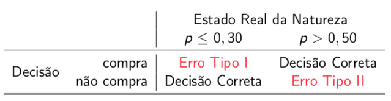
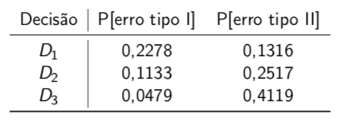

# Modelos Probabilísticos: Distribuições Associadas a Processos de Bernoulli


Consideraremos alguns modelos probabilísticos que merecem uma atenção especial. Algumas distribuições aparecem frequentemente em aplicações, por dois motivos: 

(1) ou porque o mecanismo probabilístico que define o problema em análise é tal que uma dessas distribuições é, de fato, a distribuição que descreve a situação de interesse; ou, 

(2) o problema em análise é tal que pode ser adequadamente modelado por uma dessas distribuições (neste caso, o modelo matemático nos dá uma boa aproximação da situação em questão).  

Iniciaremos estudando algumas distribuições associadas aos chamados processos de Bernoulli, que talvez sejam um dos processos aleatórios mais simples.


## O Experimento de Bernoulli


Os processos de Bernoulli são construídos com base em experimentos de Bernoulli. Já encontramos esses experimentos e processos anteriormente, mas ainda não tínhamos dado um nome a eles. 

Um experimento de Bernoulli consiste em um experimento aleatório que tem apenas dois resultados possíveis que, por conveniência rotulamos de "sucesso" ou "fracasso". Como eles são mutuamente exclusivos e coletivamente exaustivos, formam uma partição do espaço amostral. Sucesso ocorre com probabilidade $p$ e, portanto, fracasso (o complementar de sucesso) ocorre com probabilidade $1-p$.

**Experimento de Bernoulli:**  

+ Dois possíveis resultados (mutuamente exclusivos):  
  $S =$ "sucesso" e $F=$ "fracasso"  
  Espaço amostral: $\Omega = \{ S, F\}$

+ Define-se: $P[S] = p$, $P[F]= 1-p$  

Obviamente, os rótulos "sucesso" e "fracasso" não necessariamente estão associados a acontecimentos bons ou ruins; temos um sucesso quando observamos a ocorrência do evento de interesse.

O lançamento de uma moeda é um exemplo: posso considerar sucesso, a ocorrência do resultado "cara". A administração de uma vacina a um paciente é outro exemplo: sucesso pode denotar a imunização do paciente.

+ Lançamento de uma moeda:   
$S =$  cara, $F =$ coroa 

+ Administração de uma vacina:   
$S =$ paciente imunizado, $F =$ paciente não imunizado


## Distribuição de Bernoulli


Em vez de utilizar a notação de eventos, que emprega os rótulos "sucesso" e "fracasso" para representar os resultados do experimento de Bernoulli, podemos utilizar uma variável aleatória para modelar essa situação. A v.a. resultante, então, terá distribuição de Bernoulli.

Uma v.a. $X$ tem distribuição de Bernoulli com parâmetro $p$ se assumir valores 0 ou 1, com probabilidade dada pela fdp $f_X(x)$ abaixo. 

Seja a v.a. $X \sim Ber(p)$:  

$X =$ resultado do experimento de Bernoulli

\begin{align*}
  &{} f_{X}(x) = \left\{
  \begin{array}{rl}
    p^x q^{1-x}, & x=0, 1\\
    0,           & c.c.
  \end{array}\right.
  \quad 0 \leq p \leq 1; \quad q=1-p\\ 
  \\
  &{} E[X] = p \qquad Var[X] = pq
\end{align*}

Note que quando $x=0$, $f_X(x) = q = 1-p$; e, quando $x=1$, $f_X(x)= p$, em que $p$ é a probabilidade de sucesso e assume qualquer valor real entre 0 e 1; e $q$ é probabilidade de fracasso.

É possível mostrar que o valor esperado desta v.a. é $p$ e que a variância vale $pq$. 

+ Muitos modelos probabilísticos importantes são baseados na regra de Bernoulli. 
+ Uma sequência de experimentos de Bernoulli independentes constituem um **Processo de Bernoulli**.

Apesar de sua simplicidade, processos de Bernoulli podem ser utilizados para representar processos aleatórios interessantes, como veremos a seguir.


::: {.example #unnamed-chunk-1}
:::


Vamos considerar a seguinte situação... completamente fictícia, claro!

Um aluno realizará um teste que consiste em 10 questões de múltipla escolha, cada uma com 4 opções, das quais apenas uma é correta. O aluno é aprovado no curso se responder pelo menos 6 questões corretamente. 

Só que tem um problema: o aluno esqueceu que tinha de fazer esta prova e está completamente despreparado para o exame e decide apelar para a sorte, ou seja, vai escolher as respostas de maneira completamente aleatória, de forma que a resposta escolhida a uma determinada questão não tem relação com as demais.

Se o aluno adotar essa estratégia desesperada, qual a probabilidade de que ele passe no curso?


::: {.solution}
:::
  

Em primeiro lugar, precisamos identificar a variável aleatória associada a este experimento. Note que a resposta a cada questão consiste em um experimento de Bernoulli, já que o aluno pode marcar a resposta certa (o que equivale a obter sucesso) ou a resposta errada (obtendo, assim, um fracasso). Desta forma, resposta a cada questão pode ser, então modelada por uma v.a. $X_i$, que tem distribuição de Bernoulli. $X_i$ assume valor 1, se a resposta à questão $i$ é correta; e 0, se a resposta à questão $i$ é errada. A probabilidade de o aluno acertar a resposta de cada uma das questões é sempre a mesma e vale 1/4.

A resposta a cada uma das questões corresponde a um experimento de Bernoulli. Então, para $i = 1, 2, \ldots, 10$, sejam as v.a.'s:


\begin{align*}
X_i = \left\{
  \begin{array}{rl}
    1, & \text{se a i-ésima resposta está correta}\\
    0, & \text{se a i-ésima resposta está errada}
  \end{array}\right.
\end{align*}


Ainda: $P[X_i = 1] = p = 1/4$, para $i = 1, 2, \ldots, 10$.

Mas não estamos interessados em saber se o aluno acertou ou errou cada uma das questões. Estamos interessados no resultado acumulado dos acertos; ou seja, no total de respostas corretas. Portanto, precisamos definir a v.a. que equivale ao total de respostas corretas:

$X =$ total de respostas corretas  
$$X = \sum_{i=1}^{10}X_i = k, \quad k = 0, 1, 2, \ldots, 10$$ 

Então, $X$ é igual à soma dos resultados de cada uma das v.a.'s $X_i$. E esta soma pode assumir um valor $k$ igual a zero, ou 1 ou 2, e assim por diante até 10, correspondendo ao número de acertos no total das 10 questões.

Queremos calcular a probabilidade de que o número de acertos no teste seja maior ou igual a 6: $P[X \geq 6]$

Para calcular esta probabilidade, precisamos seguir o procedimento usual que consiste em calcular a probabilidade de obter cada um dos valores possíveis para a v.a. $X$ (isto é, vamos construir a fdp de $X$) e, a partir, daí, calcularemos a probabilidade do evento de interesse.

A probabilidade de nenhum acerto corresponde à probabilidade de que a v.a. $X$ assuma valor igual a zero. Isso significa que o aluno errou conjuntamente todas as questões; então cada uma das v.a.'s $X_i$ vai assumir valor zero. Como as respostas para cada questão são dadas de maneira independente, a probabilidade conjunta é igual ao produto das probabilidades individuais. A probabilidade de responder incorretamente a uma questão qualquer é a probabilidade de fracasso, que vale $1-p$. E assim, chega-se à conclusão  de que  a probabilidade de o aluno errar todas as questões vale $(1-p)^{10}$ que é igual a $(3/4)^{10}$:


\begin{align*}
P[X=0]   &= \text{probabilidade de nenhuma resposta correta}\\
         &= P[X_1 = 0, X_2 = 0, \ldots, X_{10}=0],  & \textsf{(sob indep.)} \\
         &= P[X_1 = 0]\cdot P[X_2 = 0]\cdot \ldots \cdot P[X_{10} = 0]\\
         &= (1-p)^{10} = \left(3/4\right)^{10}
\end{align*}


Vamos calcular agora a probabilidade de marcar apenas uma resposta correta. Precisamos enumerar todas as maneiras de acertar apenas uma resposta, ao responder a 10 questões. Isso significa que ou o aluno acertou apenas a resposta da primeira questão (e errou todas as outras), ou acertou apenas a resposta da segunda questão, e assim por diante, até a última situação possível que corresponde ao aluno ter  errado todas as questões, exceto a última. Para cada uma dessas situações, temos um sucesso e 9 fracasso, portanto, cada situação acontece com probabilidade $p \times (1-p)^9$. 

Como existem 10 situações em que apenas um sucesso ocorre, a probabilidade de apenas um acerto em 10 tentativas vale $p \times (1-p)^9 \times 10$.


\begin{align*}
P[X=1]   &= \textsf{probabilidade de apenas uma resposta correta}\\
         &= P[X_1 = 1]\cdot P[X_2 = 0]\cdot \ldots \cdot P[X_{10} = 0]\\
         &+ P[X_1 = 0]\cdot P[X_2 = 1]\cdot \ldots \cdot P[X_{10} = 0]\\
         & \vdots\\
         &+ P[X_1 = 0]\cdot P[X_2 = 0]\cdot \ldots \cdot P[X_{10} = 1]\\
         &= p \cdot (1-p)^9 \cdot 10 = (1/4)\left(3/4\right)^{9}\cdot 10
\end{align*}


Vamos aplicar o mesmo procedimento para 2 acertos, 3 acertos e assim, sucessivamente.

Sendo assim, a probabilidade de um total de 'k' respostas corretas, é dada pela expressão a seguir:


\begin{align*}
P[X=k] &= \textsf{probabilidade de exatamente k respostas corretas}\\
       &= {\binom{10}{k}}p^k (1-p)^{10-k}
\end{align*}


Há diversas maneiras de acertar apenas $k$ questões de um total de 10. Em todas as situações temos $k$ sucessos e $10-k$ fracassos; portanto, a probabilidade de observar cada uma dessas situações vale $p^k \times (1-p)^{10-k}$; e o número de situações em que $k$ acertos ocorrem em 10 tentativas é dado pela combinação de 10 k-a-k.

Calculando para $k \geq 6$, precisamos somar as probabilidades de obter ou 6 ou 7 ou 8 ou 9 ou 10 acertos. Essa probabilidade vale:


\begin{align*}
P[X\geq 6] &= \textsf{probabilidade de pelo menos 6 respostas corretas}\\
           &= \sum_{k=6}^{10}{\binom{10}{k}}(1/4)^k\left(3/4\right)^{10-k}\\
         &= 0,0197 \quad \approx 2\% \;!!!
\end{align*}


Então, para a infelicidade deste aluno, chegamos à triste conclusão de que ele tem um pouco menos que 2% de chance de passar no curso, se responder de maneira aleatória a cada uma das questões! Não parece ser uma boa estratégia deixar o resultado da avaliação nas mãos do acaso! 


### Resumo {-}


Um processo de Bernoulli consiste em uma sequência finita ou infinita de experimentos de Bernoulli tal que cada experimento produz um sucesso com probabilidade $p$  e fracasso, com probabilidade $1-p$', independentemente do que ocorre nas outras repetições do experimento.

Então, basicamente temos usa sequência de resultados binários aleatórios independentes e estacionários.

+ Um experimento de Bernoulli é repetido  um certo número de vezes  

+ Dois resultados possíveis em cada repetição:  
  S = "sucesso" F = "fracasso"  
  
+ Hipótese de Independência  

+ Hipótese de Estacionariedade  
  $P[S]= p =$ constante para todos os experimentos 

Podemos estar interessados em diferentes aspectos associados a um processo aleatório de Bernoulli. Cada aspecto pode ser analisado através da definição de uma v.a. aleatória que represente a situação de interesse. Por exemplo, podemos querer responder à pergunta de quantos sucessos serão observados em um determinado número de repetições do experimento de Bernoulli; ou, podemos querer determinar quantos experimentos são necessários a fim de obter um sucesso; ou $k$ sucessos; ou, ainda, podemos estar interessados em determinadas probabilidades condicionais que ocorrem em um processo de Bernoulli. A partir daí, podemos generalizar para situações em que o experimento aleatório tem mais do que dois resultados possíveis.


## Distribuição Binomial


A distribuição binomial é, sem dúvida, uma das distribuições discretas mais importantes.

A v.a. $X$ tem distribuição binomial com parâmetros $n$ e $p$ se
representa o número de sucessos em $n$ replicações de um experimento de Bernoulli, em que a probabilidade de observar sucesso em cada experimento vale $p$.

A fdp da v.a. $X$ é dada pela expressão abaixo. A validade desta função para respresentar a probabilidade desejada pode ser verificada notando-se que cada sequência de resultados com $x$ sucessos no total de $n$ tentativas independentes ocorre com probabilidade $p^x \times q^{n-x}$; esse valor de probabilidade é multiplicado pelo número de tais sequências possíveis, dado pela combinação de $n$ x-a-x.

Seja a v.a. $X \sim \mathit{Bin} (n,p)$:  

$X =$ número de sucessos em um processo de Bernoulli


\begin{align*}
  &{} f_{X}(x) = \left\{
  \begin{array}{rl}
    \binom{n}{x}p^x q^{n-x}, & x = 0, 1, \ldots, n\\
    0,           & c.c.
  \end{array}\right.
  \quad 0 \leq p \leq 1; \quad q=1-p \\
  \\ \\
  &{} E[X] = np \qquad Var[X] = npq
\end{align*}


A v.a. $X$ pode assumir qualquer valor inteiro de 0 até o número de experimentos de Bernoulli, $n$. Como a fdp de uma v.a. Binomial depende apenas dos valores assumidos pelos parâmetros $n$ e $p$, é de se esperar que sua média e variância também dependam apenas dos valores que esses parâmetros assumem. De fato, o valor esperado de $X$ é dado $np$, isto é, o número esperado de sucessos esperados em $n$ experimentos de Bernoulli independentes, quando cada sucesso ocorre com probabilidade $p$ é igual a $np$. A variância de $X$ vale $npq$.

Vejamos um exemplo.


::: {.example #unnamed-chunk-3}
:::


Se a probabilidade de um paciente se recuperar de uma doença grave for de 40% e tivermos o conhecimento de 15 pacientes portadores dessa doença, podemos estar interessados em obter algumas respostas, tais como

+ qual a probabilidade de que exatamente 5 dos 15 pacientes sejam curados; ou 
+ qual a probabilidade de que pelo menos 10 deles sobrevivam; ou
+ qual a probabilidade de que de 2 a 10 pacientes se recuperem.

Note que, se pudermos assumir que a resposta de cada paciente ao tratamento da doença seja independente dos demais e que a probabilidade de recuperação seja a mesma para todos os pacientes, estamos diante de um processo de Bernoulli com parâmetros $n = 15$ e $p = 0,4$.

Podemos então utilizar a distribuição Binomial para calcular essas probabilidades de maneira exata. E vamos comparar este resultado exato com aquele que seria obtido de maneira aproximada utilizando a desigualdade de Chebyshev.


::: {.solution}
:::


Temos: $X \sim \textsf{Bin}(n,p)$, onde n = 15 (pacientes); p = 0,4 (probabilidade de cura).

+ P[exatamente 5 pacientes serem curados]:

Para responder à primeira questão, basta calcular o valor da fdp de $X$ no ponto $X = 5$:


\begin{align*}
  P[X = 5] = \textsf{Bin}(5; 15; 0,4)  = \binom{15}{5}0,4^5 0,6^{10} = 0,1859
\end{align*}


Sendo assim, a probabilidade de que exatamente 5 dos 15 pacientes sejam curados vale aproximadamente 19%.

Esse valor de probabilidade pode ser facilmente calculado no R, utilizando o comando dado abaixo:


```r
dbinom(5, 15, 0.4)
```


+ P[pelo menos 10 pacientes sobreviverem]:

Para a segunda questão, queremos a probabilidade de observar pelo menos 10 pacientes recuperados. Essa probabilidade pode ser obtida calculando a soma das probabilidades de observar de 10 a 15 sucessos ou, alternativamente, utilizando a noção de complementar, como 1 - probabilidade de observar menos que 10 recuperações, que corresponde à soma das probabilidades de observar apenas de 0 a 9 sucessos. A probabilidade desejada é de aproximadamente 3%:


\begin{align*}
  P[X \geq 10] &= 1 - P[X < 10] \\
               &= \sum_{x=10}^{15}\textsf{Bin}(x; 15, 0,4) = 1 - \sum_{x=0}^{9}\textsf{Bin}(x; 15, 0,4) \\
               &= 1 - 0,9662 = 0,0338
\end{align*}


No R, essa probabilidade pode ser obtida utilizando os seguintes comandos:


```r
1 - pbinom(9, 15, 0.4)  
sum(dbinom(10:15, 15, 0.4))
```


+ P[2 a 10 pacientes se recuperarem]:

Finalmente, a terceira pergunta envolve o cálculo da probabilidade de que a v.a. $X$ assuma um valor de 2 a 10. Novamente, podemos calcular essa probabilidade como sendo a soma das probabilidades de observar $X$ assumindo valores de 2 a 10, ou podemos utilizar a definição de FDA e calcular essa probabilidade como sendo a diferença entre o valor da FDA para $X=10$ e o valor da FDA para $X=1$. A probabilidade desejada vale aproximadamente 99%:


\begin{align*}
  P[2 \leq X \leq 10] 
  &= \sum_{x=2}^{10}\textsf{Bin}(x; 15, 0,4) 
   = \sum_{x=0}^{10}\textsf{Bin}(x; 15, 0,4) - \sum_{x=0}^{1}\textsf{Bin}(x; 15, 0,4)\\
  &= 0,9907 - 0,0052 = 0,9855
\end{align*}


Os comandos utilizados para obter esse valor de probabilidade no R são disponibilizados abaixo.


```r
sum(dbinom(2:10, 15, 0.4))
pbinom(10, 15, 0.4) - pbinom(1, 15, 0.4)
```


Agora, vamos comparar o valor de probabilidade para a última pergunta que foi obtido de maneira exata utilizando a distribuição binomial com o limite que seria definido pela desigualdade de Chebyshev, se não fosse possível utilizar a informação da distribuição da v.a. considerada. 

A desigualdade de Chebyshev faz uso do valor esperado e da variância da v.a. Sendo assim, utilizando as propriedades da distribuição binomial o valor esperado de $X$ é dado por $np = 6$; e a variância vale $npq = 3,6$. Um intervalo de largura igual a 4 desvios em torno da média, nos dá de 2 a 10 pacientes (já que a v.a. em questão é discreta). Assim, para $X$ a uma distância máxima de dois desvios de sua média, a desigualdade de Chebyshev nos dá o limite inferior de 75% de chance de observar de 2 a 10 pacientes recuperados:

$\mu = np =  15 \cdot 0,4 = 6$;  
$\sigma^2 = npq = 15 \cdot 0,4 \cdot 0,6 = 3,6 \Rightarrow \sigma = 1,897$

Consideremos o intervalo:  $\mu \pm 2\sigma$ = $(2.206, 9.794) \rightarrow (2, 10)$ : dados discretos.

**Pela Desigualdade de Chebyshev:**

A desigualdade de Chebyshev garante que há pelo menos 75% (3/4) de chance de que 2  a 10 dos 15 pacientes sobrevivam.


## Um Problema de Tomada de Decisão


Em geral, usamos distribuições de probabilidade para decidir se uma determinada hipótese é ou não plausível. Nós retornaremos a este assunto mais formalmente em inferência estatística, mas por hora, vejamos um outro exemplo, em que os valores de probabilidade calculados a partir da distribuição binomial são utilizados para auxiliar o processo de tomada de decisão.

Vamos supor que exista uma vacina para um determinado vírus, cuja eficácia seja de apenas 25%. Porém dada a alta transmissibilidade da doença, essa eficácia é insuficiente para conter uma epidemia.

Uma nova vacina é oferecida ao Ministério da Saúde (MS) e é preciso decidir se vale a pena comprar a nova vacina.

Vamos assumir ainda que, segundo recomendações técnicas, se a vacina tiver eficácia de pelo menos 30%, pode comprar a nova vacina; e, se ela tiver eficácia maior ou igual a 50%, não pode perder a oportunidade de adquirir a nova vacina. 

Portanto, antes de mais nada, precisamos determinar se a nova  vacina é mais eficaz contra o mesmo vírus que a vacina disponível... Para isso, precisamos coletar evidências empíricas, ou seja, precisamos de dados.

Uma amostra aleatória de $n = 20$ voluntários é selecionada e são observados quantos deles não contraem a doença após o período de avaliação. Claro que esse número de pessoas testadas é completamente irreal e, de maneira alguma, um estudo científico para determinar a eficácia de uma vacina com base em uma amostra tão pequena teria qualquer validade. Usamos esse número tão somente com a finalidade de simplificar os cálculos e ilustrar os procedimentos utilizados no problema de análise de decisão.

Sendo assim, esses voluntários são  monitorados de forma que se saiba, ao final do período de avaliação, quantos deles contraíram a doença. Com base na quantidade de indivíduos imunizados, podemos tomar uma decisão mais informada se vale ou não a pena adquirir a nova vacina.

Se assumirmos que a resposta de cada indivíduo é independente da do outro, e que a eficácia das vacinas não varie de indivíduo para indivíduo, estamos diante de um processo de Bernoulli de tamanho 20. Diante disso, espera-se que a vacina atual seja capaz de imunizar em média 25% do total, ou seja 5 indivíduos.

A questão agora é determinar que regra de decisão será utilizada para definir se a vacina nova é melhor ou não que a atual.

Supondo que uma amostra de tamanho 20 seja suficiente para tirarmos conclusões estatisticamente significativas, o que devemos decidir se: 

+  20 dos 20 voluntários forem imunizados?   
   Nesta situação, parece haver evidências de que a vacina nova tem eficácia superior que a atual; 
+ se nenhum dos voluntários tiver sido imunizado e, ao final do período de avaliação, todos tiverem contraído a doença?   
  Neste caso, as evidências sugerem que a vacina nova seja pior que a atual.  

Ambas as situações representam casos extremos, em que não é tão difícil assim tomar uma decisão. Há situações, no entanto, em que o processo de tomada de decisão pode assumir um caráter bem mais dramático. 

A fim de estruturar o problema com clareza para que possamos calcular os riscos associados às decisões que serão tomadas, precisamos confrontar nossos medos e avaliar **o que se teme mais**: 

(1) comprar a nova vacina acreditando que ela é mais eficaz que a atual e acabar descobrindo com o tempo que isso não é verdade, ou seja, que a eficácia da vacina é menor que 30%? 

ou 

(2) perder a oportunidade de comprar a vacina mais eficaz e sujeitar a população ao risco de uma grave epidemia?

A partir de quantos indivíduos imunizados na amostra, podemos decidir que a nova vacina é mais eficaz que a atual e que, assim, podemos decidir comprá-la?

Vamos considerar algumas decisões possíveis:

D1: Compra se observar pelo menos 8 indivíduos imunizados   
D2: Compra se observar pelo menos 9 indivíduos imunizados     
D3: Compra se observar pelo menos 10 indivíduos imunizados  

A decisão D1 consiste em comprar se pelo menos 8 voluntários da amostra tiverem sido imunizados; a decisão D2 é um pouco mais rigorosa e nos leva a comprar  a nova vacina se pelo menos 9 voluntários tiverem sido imunizados e, por fim, a decisão D3 que recomenda a compra apenas se pelo menos a metade dos indivíduos da amostra tiver sido imunizada.

Suponha que o decisor tenha optado por D2. Podemos errar ao tomar essa decisão de 2 maneiras e os erros de decisão são chamados **erro do tipo I** e **erro tipo II**.


No erro tipo I, somos levados a crer, a partir das evidências empíricas, que a nova vacina é mais eficaz que a atual, quando ela de fato, não o é. Ou seja, segundo a regra de decisão D2, observamos um número maior que 8 indivíduos imunizados na amostra, mas esse resultado deveu-se meramente ao acaso, pois a vacina administrada não era mais eficaz que a atual.

Já no erro tipo II, temos uma perda de oportunidade, isto é, a vacina é, na realidade melhor que a atual, mas não tivemos evidência disso na amostra coletada, pois apenas um número menor ou igual a 8 dos voluntários foi imunizado.


#### Resumo {-}





Temos o estado real da natureza: ou a nova vacina não é suficientemente boa (o que quer dizer que sua eficácia é menor ou igual a 30%), ou ela é melhor que a atual (isto é, sua eficácia é maior que 50%). No entanto, esse estado real da natureza é desconhecido e precisaremos tomar uma decisão com base nas evidências que conseguirmos obter a partir da observação de uma amostra. A decisão será por não comprar a nova vacina, se não tivermos evidências de uma eficácia superior; e a decisão será por comprar a nova vacina, se formos levados a crer que a nova vacina é mais eficaz que a atual. Erramos quando as evidências empíricas não apontam para o estado real da natureza. Sendo assim, erramos quando decidimos comprar a vacina nova e ela não é mais eficaz que a atual (por que as evidências empírica nos levaram a acreditar que a vacina era boa) e erramos quando decidimos não comprar a nova vacina e ela é, de fato, melhor que a atual (por que não fomos capazes de perceber este fato empiricamente).

Os erros do tipo I e II normalmente não são simétricos. Sempre há um que é mais temido que o outro. Formulamos o problema de decisão associando o erro tipo I ao erro mais grave, ou seja, aquele que trará as piores consequências.

Vamos, então, calcular as probabilidades de cometer cada um desses erros.

Cometemos erro tipo I se decidimos compra a vacina nova quando não deveríamos. Então, utilizando a regra de decisão D2, o erro tipo I vai acontecer quando observarmos na amostra um número maior que 8 indivíduos imunizados, quando a eficácia da vacina nova é, na melhor das hipóteses igual a 30%. Portanto, a probabilidade de cometer erro tipo I é dada pela probabilidade condicional de observar $X > 8$ dado que $p = 0,3$.

Utilizando a distribuição binomial com parâmetros $n = 20$ e $p = 0,3$, calculamos o risco de  cometer erro tipo I, que é da ordem de 11%: 


\begin{align*}
  P[\text{Erro Tipo I}]
    &= P[\text{comprar quando não deveria}] \\
    &= P [X > 8 | p \leq 0,30]\\
    &= P [X > 8 | p  = 0,30] &: \text{pior caso}\\
    &= 1 - \sum_{x=0}^{8} \binom{20}{x} p^x (1-p)^{(20-x)}\\
    &= 1 - 0,8867 = 0,1133
\end{align*}


Isso significa que, toda vez que decidirmos comprar a nova vacina, em aproximadamente 11% das vezes estaremos fazendo a coisa errada.

Por outro lado, cometemos erro tipo II se decidimos não comprar a vacina nova quando deveríamos. Isso ocorre quando os resultados empíricos não nos dão evidências da superioridade da eficácia da nova vacina, e observamos na amostra um número menor ou igual a 8 indivíduos imunizados, quando na verdade a eficácia da vacina nova era, no pior caso, igual a 50%. A probabilidade de cometer erro tipo II é dada pela probabilidade condicional de observar $X \leq 8$ dado que $p = 0,5$. Utilizando a distribuição binomial com parâmetros $n=20$ e $p=0,5$, chegamos à conclusão de que o risco de cometer erro tipo II é da ordem de 25%.


\begin{align*}
  P[\textsf{Erro Tipo II}] 
    &= P [\text{não comprar quando deveria}] \\
    &= P [X \leq 8 | p > p_o]\\
    &= P [X \leq 8 | p  = 0,5] &: \text{pior caso}\\
    &= \sum_{x=0}^{8} \binom{20}{x} p^x (1-p)^{(20-x)}\\
    &= 0,2517
\end{align*}


Neste caso, em cerca de 25% das vezes que recusarmos a nova vacina, estaremos rejeitando um produto melhor que o atual.

Esses riscos calculados estão associados à regra de decisão adotada.
Estamos dispostos a correr esses riscos?

Vejamos como variam os riscos de cometer erros do tipo I e do tipo II, se optarmos por outras regras de decisão.


Procedendo de maneira análoga para as decisões D1 e D3, podemos completar a seguinte tabela que mostra os riscos associados a cada uma das decisões:





Note que ao tomar uma decisão mais rigorosa, ou seja, quando decidimos comprar a vacina nova apenas com evidências mais contundentes, como no caso da regra de decisão D3, nosso risco de comprar uma vacina de eficácia duvidosa cai de 11% para um pouco menos de 5%.  No entanto, o rigor também tem seu preço. Ao utilizar essa regra de decisão, o risco de perder uma boa oportunidade aumenta de 25% para cerca de 41%. 

Por outro lado, se nos permitimos convencer da eficácia da vacina nova com base em evidências menos robustas, o risco de cometer erro tipo I aumenta de 11% para quase 23%, enquanto o risco de cometer erro tipo II cai de 25% para aproximadamente 13%.

Algumas lições importantes que devemos levar deste exemplo são as seguintes: qualquer que seja a decisão tomada, sempre há riscos envolvidos, pois a informação de que dispomos é incompleta e imperfeita. E, assim, não é possível ter certeza de que estamos tomando a decisão correta. Para que a decisão seja a melhor possível, é necessário definir qual o erro mais temido, ou seja, que erro produz as consequências mais graves que deveriam ser evitadas; e, por fim, é necessário definir de antemão qual o risco máximo tolerado para cada tipo de erro de decisão que se pode cometer, pois esses limites ajudam a balizar as decisões a serem tomadas.


## Distribuição Geométrica


Vimos anteriormente que podemos modelar o no de sucessos em um número fixo de experimentos de Bernoulli, utilizando a distribuição binomial. No entanto, podemos estar interessados em responder a outras perguntas associadas a um processo de Bernoulli. Por exemplo, podemos desejar modelar não o número de sucessos, mas **o número de experimentos de Bernoulli necessários até que se observe o primeiro sucesso**. Esta é uma questão que pertence a uma outra classe importante de problemas, associada ao tempo que se deve esperar até que observar a ocorrência de um certo evento de interesse. Esta classe de problemas surge em diferentes contextos e, portanto, eles podem ser modelados de diferentes maneiras. No contexto de um processo de Bernoulli, esse tipo de situação pode ser modelada utilizando a distribuição geométrica, como veremos a seguir.

Considere o seguinte experimento:  

Um observador posiciona-se em um cruzamento movimentado e registra se um
pedestre tentando atravessar a rua é atropelado por um veículo.

O experimento tem dois resultados possíveis:  
S = a pessoa é atropelada  
F = a pessoa não é atropelada  

O experimento consiste em registrar o número de pessoas que conseguem atravessar a rua até que a primeira pessoa seja atropelada.

Como podemos modelar este experimento?

Bem, será necessário fazer algumas simplificações para modelar esta situação: vamos assumir que cada pessoa tem a mesma chance $p$ de ser atropelada e que os atropelamentos acontecem de maneira independente uns dos outros, ou seja, não vamos ver várias pessoas sendo atropeladas juntas, nem que um atropelamento terá influência sobre um outro. 

E assim, o espaço amostral, definido pelos possíveis resultados do experimento, é formado pelos eventos S (se a primeira pessoa a atravessar é atropelada), FS (se a segunda pessoa é a primeira a ser atropelada) e, assim por diante.  

$\Omega = \{ S,  FS, FFS, \ldots\}$; em que $S$ =  a pessoa é atropelada  

Note que a esse espaço amostral está associada uma v.a. $X$ discreta (já que o conjunto é infinito porém enumerável), que representa o número de pessoas observadas até o primeiro atropelamento. Portanto, $X$ pode assumir qualquer valor no conjunto dos números inteiros maiores que zero.

$X =$ número de pessoas observadas até o primeiro atropelamento:   
$X  = i, \quad i = 1, 2, 3, \ldots$  


A fim de caracterizar probabilisticamente esta situação, precisamos calcular os valores de probabilidade associados a cada valor que a v.a. $X$ pode assumir, isto é, precisamos determinar a fdp de $X$.

A probabilidade de $X$ assumir valor 1, que representa a situação em que a primeira pessoa a atravessar a rua é a primeira a ser atropelada, vale $p$, que é a probabilidade de qualquer pessoa ser atropelada por um veículo. 

Para $X =2$, a probabilidade vale $(1-p) \times p$, pois temos um fracasso que ocorre com probabilidade $(1-p)$, seguido de um sucesso, que ocorre com probabilidade $p$.

Para $X = 3$, temos dois fracassos, seguidos de um sucesso e, portanto, a probabilidade vale $(1-p)^2 \times p$.

E prosseguimos... Então, a probabilidade de a n-ésima pessoa a atravessar a rua ser a primeira a ser atropelada vale $(1-p)^{n-1} \times p$. Note que $n-1$ pessoas conseguiram atravessar a rua sem nenhum incidente e o experimento sempre termina com um sucesso.

Então:  


\begin{align*}
&P[X = 1] = p             &: \text{a 1a. pessoa é a primeira a ser atropelada} &\\
&P[X = 2] = (1-p) p       &: \text{a 2a. pessoa é a primeira a ser atropelada}\\
&P[X = 3] = (1-p)^2 p     &: \text{a 3a. pessoa é a primeira a ser atropelada}\\
&\vdots\\
&P[X = n] = (1-p)^{n-1} p &:  \text{a n-ésima pessoa é a primeira a ser atropelada}\\
&\vdots  &n \in \mathcal{Z} > 0
\end{align*}


Portanto, a v.a. $X$ tem distribuição geométrica com parâmetro $p$ se
representa o número de experimentos de Bernoulli necessários até que se observe o primeiro sucesso, em que a probabilidade de observar um sucesso a cada experimento vale $p$.

Seja a v.a. $X \sim Geom (p)$:  

$X =$ no. de repetições de um experimento de Bernoulli até observar o primeiro sucesso

A fdp da v.a. $X$ é dada pela expressão abaixo. 


\begin{align*}
  &{} f_{X}(x) = \left\{
  \begin{array}{rl}
    q^{x-1}p , & x = 1, 2, \ldots \\
    0,           & c.c.
  \end{array}\right.
  \quad 0 \leq p \leq 1; \quad q = 1-p \\
  \\
  &{} E[X] = \frac{1}{p} \qquad Var[X] = \frac{1-p}{p^2}
\end{align*}


Da maneira que definimos o experimento, a v.a. $X$ pode assumir qualquer valor inteiro maior que zero. No entanto, é possível definir a v.a. Geométrica como o número de tentativas **antes** do primeiro sucesso, de forma que o suporte da função passa a incluir o zero.

Para a versão da v.a. aleatória apresentada, o valor esperado de $X$ é dado $1/p$, e a variância de $X$ vale $(1-p)/p^2$.


### Propriedade de Ausência de Memória {-}


A distribuição geométrica tem uma propriedade muito interessante que se chama "Ausência de Memória", isto é, a distribuição "esquece" o que aconteceu no passado. Esta propriedade é enunciada da seguinte forma:

Temos, para n, k = 1, 2, ...

$$P[X > n+k |X> k] = P[X > n]$$

É possível chegar a essa igualdade a partir da definição de probabilidade condicional:


\begin{align*}
  P[X > n+k |X > k] &= \frac{P[X > n+k] \cap P[X > k]}{P[X > k]}\\
                    &= \frac{P[X > n+k]}{P[X > k]}\\
                    &= \frac{(1-p)^{n+k}}{(1-p)^k} = (1-p)^n = P[X > n].
\end{align*}


Assim, para dois números inteiros positivos $n$ e $k$, a probabilidade de observar $n$ fracassos adicionais, dado que $k$ fracassos já ocorreram, é igual à probabilidade de observar $n$ fracassos no início da sequência de experimentos de Bernoulli.

Em outras palavras, a probabilidade de observar uma sequência de fracassos só depende do tamanho dessa sequência, não da sua posição. O processo de Bernoulli sempre se reinicia. Essa propriedade decorre da hipótese de independência dos experimentos que compõe o Processo de Bernoulli. E a família de distribuições geométricas é a única família de distribuições discretas com esta propriedade! 

E uma nota é importante: podemos chamar as distribuições de probabilidade de famílias de distribuições, pois, na verdade, cada distribuição de probabilidades define uma família, já que cada combinação de valores dos parâmetros define uma única distribuição. 

A distribuição geométrica comumente é utilizada para modelar o tempo de vida de sistemas, quando essa medida de tempo é tomada de forma discreta (por exemplo, em dias, meses, anos etc.). Mas, para isso, é necessário que seja válida a hipótese de que o sistema em questão não envelheça, ou seja, a distribuição geométrica não é adequada para modelar tempo de vida em situações em que a probabilidade de que o sistema falhe aumenta com o tempo. Outras distribuições podem ser utilizadas com esse propósito, como veremos no futuro.


## Outras Distribuições


Há outras distribuições que podem ser desenvolvidas a partir de, ou em analogia aos Processos de Bernoulli, que representam diferentes aspectos desses processos que podem nos interessar. 

Nós não entraremos em muitos detalhes, mas é importante pelo menos apresentá-las, a fim de que possamos reconhecer que é possível modelar probabilisticamente diferentes situações de interesse.


### Distribuição Binomial Negativa (ou Distribuição de Pascal) {-}


A distribuição binomial negativa (também chamada distribuição de Pascal) consiste em uma generalização da distribuição geométrica. Em vez de estarmos interessados em modelar o número de repetições do experimento de Bernoulli necessárias para observar o primeiro sucesso, agora estamos interessados em observar os $k$ primeiros sucessos.

Portanto a v.a. $X$ segue distribuição binomial negativa com parâmetros $k$ e $p$ se representa o número de repetições necessárias de um experimento de Bernoulli  até obter o $k-$ésimo sucesso.

A fdp da v.a. binomial negativa é dada por:

$$f_X(x; k, p) = \binom{x-1}{k-1} p^kq^{x-k} \quad 0 \leq p = 1-q \leq 1; \quad x = k, k+1, k+2, \ldots$$

Podemos também compará-la também com a distribuição binomial. Enquanto a distribuição binomial conta o número de sucessos em um número **fixo de experimentos** de Bernoulli, a distribuição binomial negativa modela o número de experimentos necessários para observar um determinado **número fixo** $k$ **de sucessos**. 


### Distribuição Multinomial {-}


Podemos imaginar uma outra situação, em que generalizaremos o experimento de Bernoulli. Agora, consideraremos um experimento que pode ter não apenas dois, mas um número $m$ finito de resultados possíveis. Um experimento como esse é chamado de **experimento multinomial**.

A v.a. $X_i$ com distribuição multinomial serve de modelo para a seguinte situação: há um total de $n$ experimentos independentes. Cada um desses experimentos pode resultar em uma de $m$ possibilidades. A probabilidade do resultado $i$ vale $p_i$ em cada repetição do experimento (ou seja, também temos independência e estacionariedade). 

A v.a. $X_i$ conta o número de ocorrências de cada resultado possível nas $n$ repetições do experimento multinomial.

$$\mathbf{X} = (X_1, X_2, \ldots, X_m); \qquad
   \mathbf{p} = (p_1, p_2, \ldots, p_m)$$

$$f_{\mathbf{X}}(\mathbf{x}; \mathbf{p}, n) = \frac{n!}{x_1!x_2! \ldots x_m!} p_1^{x_1} p_2^{x_2} \ldots p_m^{x_m} \;:\qquad  \sum_{i=1}^{m} x_i = n, \;\sum_{i=1}^{m} p_i = 1.$$

Suponha que desejamos avaliar a robustez de um componente aeronáutico complexo quando sofre uma colisão com um objeto (por exemplo, um pássaro). O componente pode ser danificado de várias maneiras, cada uma com uma probabilidade diferente. Podemos utilizar a distribuição multinomial se estivermos interessados em modelar as ocorrências de determinadas combinações dos possíveis danos causados ao componente.  


### Distribuição Multinomial Negativa {-}


Outra distribuição interessante associada a uma variação do experimento de Bernoulli é a distribuição Multinomial Negativa. Ela consiste em uma generalização da distribuição binomial negativa, que modelava o número de repetições do experimento de Bernoulli necessário para observar $k$ sucessos. 

No caso da distribuição Multinomial Negativa, temos um experimento multinomial e desejamos modelar o número de ocorrências de cada resultado possível observado em um número de repetições do experimento multinomial necessário para observar uma certa quantidade fixa $k_0$ de ocorrências de um desses resultados possíveis, $X_0$:

$$\mathbf{X} = (X_0, X_1, X_2, \ldots, X_m); \qquad %\]
   \mathbf{p} = (p_0, p_1, p_2, \ldots, p_m); \qquad p_0 = 1 - \sum_{i=1}^m p_i$$

$$E[\mathbf{X}] = \frac{k_0}{p_0} \mathbf{p}; \qquad
    Var[\mathbf{X}] = \frac{k_0}{p_0^2} \mathbf{p}\mathbf{p}^\prime + \frac{k_0}{p_0} \textsf{diag}(\mathbf{p})$$
    
    
### Distribuição Hipergeométrica {-}


A distribuição hipergeométrica nos dá uma certa probabilidade condicional que ocorre em um processo de Bernoulli. Dado que sabemos haver $k$ sucessos em $N$ repetições do experimento de Bernoulli, desejamos modelar a probabilidade de observar $x$ sucessos nas primeiras $n$ repetições do experimento. 

A v.a. $X$ com distribuição hipergeomética modela o número de sucessos obtidos nas $n$ primeiras repetições do experimento de Bernoulli, dado que sabemos haver $K$ sucessos em $N$ repetições do experimento:  

$$f_X(x; N, K, n) = \frac{{\binom{n}{x}}{\binom{N-n}{K-x}}}{\binom{N}{K}}; \quad 0 \leq x \leq K$$

No denominador, temos o espaço amostral que consiste em todas as maneiras que podemos selecionar $K$ sucessos nas $N$ repetições do experimento. O número de maneiras de obter $x$ sucessos nas $n$ primeiras repetições do experimento é dado pela combinação de $n$, $x$-a-$x$; e a próxima combinação corresponde ao número de maneiras de obter os $K-x$ sucessos restantes nas $N-n$ repetições restantes.

Note que essa é a mesma probabilidade que se obtém ao modelar o número de sucessos em uma sequência de sorteios realizados **sem reposição** (diferentemente da distribuição binomial, em que os sorteios eram realizados com reposição). Neste sentido, essa distribuição encontra muitas aplicações em amostragem de populações finitas e é melhor compreendida através do exemplo clássico do modelo de urna.

**Modelo de Urna**

Suponha que em uma grande urna existam $N$ bolas idênticas, das quais $K$ são vermelhas. Uma pessoa retira da urna, ao acaso e simultaneamente, $n$ bolas (isso equivale a dizer que os sorteios das bolas são realizado sem reposição) e queremos saber qual a probabilidade de que na amostra retirada $x$ bolas sejam vermelhas.

$$\frac{\binom{N}{K}{\binom{N-K}{n-x}}}{\binom{N}{n}}$$
$N$ bolas, das quais $K$ sucessos; sorteia $n$, das quais $x$ sucessos

Como os sorteios são realizados sem reposição, os experimentos de Bernoulli são dependentes, pois a probabilidade de sucesso não se mantém mais constante ao longo do tempo.    


### Distribuição Hipergeométrica Negativa {-}


E, finalmente, temos a distribuição Hipergeométrica Negativa, raramente descrita em textos de graduação, que modela quantos itens devem ser selecionados a partir de uma população finita a fim de observar o $k$-ésimo sucesso quando a amostragem é realizada sem reposição.

As distribuições Hipergeomética Negativa e Hipergeométrica têm uma relação análoga entre aquela  existente entre as distribuição binomial negativa e binomial, isto é, enquanto a distribuição hipergeométrica modela o no. de sucessos em uma quantidade fixa de sorteios sem reposição, a distribuição hipergeométrica negativa modela o número necessário de sorteios sem reposição para obter uma quantidade fixa de sucessos.

[Ver artigo]


## Resumo {-}


Um processo de Bernoulli é um processo aleatório caracterizado pela ocorrência de "sucessos" e "fracassos" em uma série de repetições de experimentos discretos tais que:

i. Existem apenas dois resultados possíveis, rotulados como "sucesso" e "fracasso";  
ii. As repetições do experimento são mutuamente independentes; e  
iii. As probabilidades de "sucesso" e "fracasso" são as mesmas para  todos os experimentos.

Desenvolvemos diversas distribuições de probabilidade associadas a diferentes aspectos de um processo de Bernoulli:


#### (1) Distribuição Binomial {-}  


  Se estivermos interessados no número total de sucessos em uma determinada quantidade $n$ fixa de repetições do experimento de Bernoulli, temos uma v.a. que tem distribuição binomial com parâmetros $n$ e $p$, em que $p$  é a probabilidade de obter sucesso em cada experimento.  
  $X$ = número total de sucessos em $n$ repetições do experimento de Bernoulli 
  $X \sim Bin (n, p)$

#### (2) Distribuição Geométrica {-}  


  Se quisermos modelar o número de experimentos de Bernoulli necessários para observar o primeiro sucesso, temos  uma v.a. que tem distribuição geométrica com parâmetro $p$.  
  $X$ = número de experimentos necessários até observar o primeiro sucesso 
  $X \sim Geo (p)$

#### (3) Distribuição Binomial Negativa {-}


  Podemos querer modelar o numero de repetições do experimento de Bernoulli necessários até observar não 1 sucesso, mas $k$ sucessos. Neste caso, podemos empregar uma v.a. que tem distribuição binomial negativa com parâmetros  $k$ e $p$.  
  $X$ = número de experimentos necessários até observar $k$ sucessos  
  $X \sim BinNeg (k, p)$ 

E também vimos algumas variações:

Se tivermos um **experimento multinomial**, que consiste em um experimento aleatório com um número $m$ fixo de resultados possíveis, cada um ocorrendo com uma determinada probabilidade, podemos identificar as seguintes distribuições associadas a este tipo de experimento:


#### (1) Distribuição Multinomial {-}


  O número total de ocorrências de cada um desses resultados possíveis pode ser modelado através de uma v.a. que tem distribuição multinomial, com parâmetros $p$ e $n$, em que $p$ é o vetor das probabilidades dos resultados possíveis e $n$ é o numero de repetições do experimento multinomial;  
  $\mathbf{X} = (X_1, X_2, \ldots, X_m)$ =  número total de ocorrências de cada um de $m$ possíveis resultados de um experimento de De Moivre (multinomial)  
  $\mathbf{X} \sim Multin (\mathbf{p}, n)$
  

#### (2) Distribuição Multinomial Negativa {-} 


Quando desejamos modelar o número de ocorrências de cada um dos resultados possíveis observado em um número de repetições do experimento multinomial necessário para observar um certo número fixo de ocorrências de um desses resultados possíveis, temos uma v.a. com distribuição multinomial negativa.  
  $\mathbf{X} = (X_1, X_2, \ldots, X_m)$ =  número total de ocorrências de cada um de $m$ possíveis resultados de um experimento multinomial até obter $k_0$ ocorrências do resultado $X_0$  
  $\mathbf{X} \sim MultinNeg (\mathbf{p}, k_0)$

Outras variações podem ser obtidas considerando experimentos de Bernoulli **dependentes**.


#### (1) Distribuição Hipergeométrica {-}


Se estivermos interessados no numero total de sucessos em um número fixo de repetições de um experimento de Bernoulli, quando a amostragem é realizada sem reposição (o que quer dizer que a probabilidade de sucesso é alterada a cada sorteio), podemos empregar uma v.a. que segue distribuição hipergeométrica, com parâmetros $N$, $K$ e $n$, em que $N$ é o tamanho da população, $K$ é o número de sucessos na população e $n$ é o número de experimentos realizados.
  $X$ = número total de sucessos em $n$ repetições de um experimento de Bernoulli quando a amostragem é realizada sem reposição  
  $X \sim HiperGeo (N, K, n)$


#### (2) Distribuição Hipergeométrica Negativa {-}


Quando estamos interessados no número de sorteios sem reposição necessários até observar $k$ sucessos, temos um v.a. Hipergeométrica negativa, com parâmetros $N$, $K$ e $k$.
  $X$ = número de repetições de um experimento de Bernoulli com amostragem sem reposição até obter $k$ sucessos  
  $X \sim HiperGeoNeg (N, K, k)$   
  
 
Em seguida, estudaremos um outro tipo de processo aleatório, o chamado **Processo de Poisson**, para o qual também analisaremos vários aspectos e desenvolveremos as distribuições de probabilidade associadas.  
