# Modelos Probabilísticos: Distribuição Normal


## Distribuição Normal


Diferentemente das distribuições notáveis que estudamos até agora, a distribuição normal não foi construída como um modelo para uma situação aleatória bem definida; pelo contrário, trata-se de um modelo teórico, ou seja, consiste em uma abstração matemática. Ainda assim, a distribuição normal é uma das distribuições mais importantes para a Estatística, pois é útil para representar diversos fenômenos aleatórios que se manifestam no mundo real, além de modelar adequadamente a distribuição de probabilidades de estatísticas comumente utilizadas para realizar inferência.


### ...(Mais) Uma Aproximação para a Distribuição Binomial {-}


Vimos anteriormente que perguntas do tipo "qual a probabilidade de obter $k$ resultados favoráveis em $n$ repetições de um experimento de Bernoulli", poderiam ser respondidas utilizando a distribuição binomial, segundo a expressão matemática a seguir

$$P[X = k] = \frac{n!}{(n-k)!k!} p^k (1-p)^{n-k}$$

O problema é que quando o número $n$ de repetições do experimento de Bernoulli é grande, o cálculo dessa probabilidade torna-se proibitivamente intenso sem o auxílio de uma calculadora ou de outras ferramentas computacionais.

Abraham De Moivre (1667-1754) foi o primeiro a chegar à formulação matemática da distribuição normal, ainda no século XVIII. Com a revogação do Édito de Nantes em 1865 pelo rei Luis XIV, estima-se que cerca de 200 a 900 mil protestantes franceses tenham deixado o país nas duas décadas seguintes. Esta lei tinha sido promulgada quase um século antes e conferia liberdade religiosa aos huguenotes. Com o fim da garantia de liberdade religiosa na França, De Moivre se viu forçado a buscar exílio na Inglaterra onde, mesmo sendo um país protestante, não se viu livre de sofrer preconceito por causa de sua origem francesa. Por conta disso, embora fosse um matemático talentoso, além de ter conexões importantes (ele foi amigo pessoal de Edmond Halley, Isaac Newton e James Stirling), De Moivre nunca conseguiu um emprego permanente e ganhava a vida precariamente trabalhando como tutor de matemática e prestando consultoria aos apostadores que frequentavam os cafés de Londres. Estes jogadores geralmente estavam interessados em responder a perguntas do tipo "qual a probabilidade de obter 60 ou mais caras em 100 lançamentos de uma moeda honesta?". Vimos que probabilidades deste tipo podem ser calculadas de maneira exata utilizando a distribuição binomial dada na expressão matemática apresentada acima. A ocupação de De Moivre exigia que ele frequentemente realizasse esses penosos cálculos de probabilidades envolvendo a distribuição binomial.

De Moivre notou que conforme o número $n$ de repetições do experimento Bernoulli aumentava, a distribuição do número total de sucessos se aproximava de uma curva suave. 


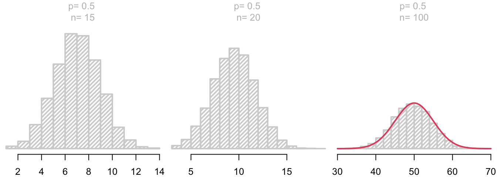


Se ele apenas fosse capaz de encontrar uma formulação matemática para esta curva, poderia calcular de maneira muito mais rápida as probabilidades de interesse. E foi exatamente isso o que ele fez em 1733, e a expressão matemática que desenvolveu para representar essa curva é o que hoje chamamos de **distribuição Normal**. 

Uma v.a. $X$ com distribuição Normal com parâmetros $\mu$ e $\sigma$ tem fdp dada pela expressão abaixo:

Seja a v.a. $X \sim N(\mu, \sigma^2)$:


\begin{align*}
  & f_{X}(x) =  \frac{1}{\sqrt{2\pi}\sigma} e^{-\frac{1}{2}\left(\frac{x-\mu}{\sigma}\right)^2}, \begin{array}{rl} & -\infty < x  < \infty\\
               & \mu \in \mathcal{R}, \; \sigma > 0.
  \end{array}
  \\ \\ \\
  & E[X] = \mu \qquad Var[X] = \sigma^2
\end{align*}


Esta densidade define, na verdade, uma família de distribuições já que cada distribuição corresponde a uma das infinitas combinações possíveis de valores para os parâmetros $\mu$ e $\sigma$. O valor esperado da distribuição normal é $\mu$ e a variância é e $\sigma^2$, ou seja, temos uma distribuição completamente determinada pelo primeiro momento e o segundo momento central, que correspondem às duas medidas descritivas mais utilizadas: localização e dispersão.


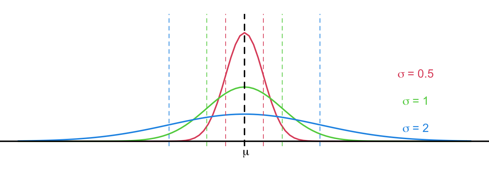


A família de distribuições normais é formada por curvas simétricas em forma de sino, cuja moda (a abcissa que corresponde ao ponto de máximo) coincide com a média e também com a mediana, que correspondem ao ponto de simetria da distribuição, $\mu$.

A curva normal possui dois pontos de inflexão dados por $\mu - \sigma$ e $\mu + \sigma$, ou seja, são os pontos que se encontram a uma distância de um desvio da média (na figura, esses pontos são representados pelas retas pontilhadas coloridas), que definem aproximadamente 2/3 da área sob cada uma das curvas.

A curva normal tende assintoticamente a zero conforme se afasta do valor médio, o que significa que valores próximos à média são observados com grande frequência e raramente ocorrem valores afastados do centro.

Como é uma fdp, a área total sob da curva normal vale 1. E o achatamento da curva depende do valor do parâmetro $\sigma$; quanto maior o valor de $\sigma$, maior o espalhamento e, assim, mais achatada é a curva.

Esta é, sem dúvida, a família de distribuições de probabilidades mais importante para a Estatística por vários motivos: primeiro, porque muitos fenômenos encontrados no mundo real tem comportamento aleatório pelo menos aproximadamente normal; segundo, e mais importante, devido às suas características matemáticas, grande parte da teoria de inferência estatística paramétrica se baseia na distribuição normal; muitas variáveis aleatórias de interesse, incluindo diversas estatísticas comumente utilizadas para realizar inferência possuem distribuições que podem ser aproximadas por uma curva normal.

De fato, uma das primeiras aplicações da distribuição normal foi na análise de erros de medidas em observações astronômicas, devidos a imperfeições dos instrumentos e também dos observadores. Ainda no século XVII, Galileu Galilei (1564-1642) notou que esses erros eram geralmente simétricos e que erros de pequena magnitude ocorriam com maior frequência que erros muito grandes. Esta conjectura levou ao desenvolvimento de inúmeras distribuições candidatas para representar o comportamento aleatório dos erros, mas foi somente no início do século XIX que Carl Friedrich Gauss (1777-1855) chegou independentemente à formulação matemática da distribuição normal, ao  perceber  que tais erros seguiam essa distribuição. No entanto, por não ter desenvolvido uma prova que considerasse válida, em 1809 Gauss publicou o resultado como uma nota de fim de capítulo de um livro sobre a teoria do movimento de corpos celestes (*Teoria Motus Corporum Celestium*). E assim a descoberta ficou por um tempo esquecida.

O resgate da distribuição normal deveu-se a Laplace, que demonstrou uma versão mais geral do resultado de De Moivre. Enquanto De Moivre tinha mostrado que o número de sucessos em um processo de Bernoulli de tamanho $n$ tinha distribuição aproximadamente normal, apoiando-se no resultado de Gauss, Laplace chegou em 1810 à mesma conclusão, com respeito ao total ou à media das observações, independentemente da distribuição dessas observações. 

Em outras palavras, ele mostrou que mesmo que uma variável aleatória não seguisse a distribuição normal, as médias de amostras retiradas dessa população teriam distribuição aproximadamente normal e essa aproximação seria tão melhor quanto maior o tamanho da amostra. Este resultado, de extrema importância para a Estatística, é o chamado .stand-out[Teorema do Limite central], que estudaremos mais adiante. O Teorema do Limite central, por exemplo, fornece o alicerce teórico para a evidência empírica de que, na prática, muitos fenômenos aleatórios naturais seguem, pelo menos de maneira aproximada, a distribuição normal.

Devido às grandes contribuições de Gauss e Laplace para sua formulação matemática, a distribuição normal é também conhecida como distribuição Gaussiana ou distribuição de Gauss-Laplace. O termo "normal" seria cunhado por Karl Pearson apenas no início do século XX.  


### Cálculo de Probabilidades {-}


Como a distribuição normal é contínua, podemos calcular probabilidades associadas a intervalos de valores que a v.a. pode assumir. Sendo assim, 

$$P[x_1 < X < x_2] = \frac{1}{\sqrt{2\pi}\sigma} \int_{x_1}^{x_2} exp\left[-\frac{1}{2}\left(\frac{x-\mu}{\sigma}\right)^2\right]dx$$

que corresponde à probabilidade de que $X$ assuma valores no intervalo que vai de $x_1$ a $x_2$ corresponde à área sombreada na figura abaixo, de forma que é necessário calcular a integral da fdp de $X$ de $x_1$ até $x_2$. Lembre-se ainda que podemos calcular essa área como a diferença entre os valores da função distribuição acumulada nesses dois pontos.


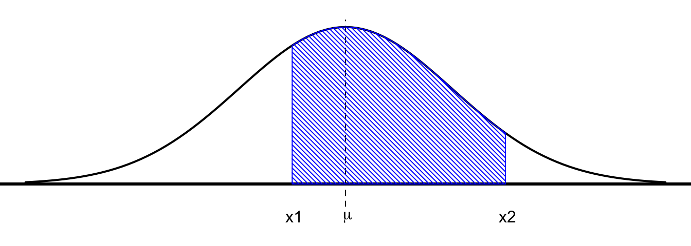


No entanto, as integrais da densidade normal não podem ser resolvidas analiticamente, de forma que os valores de probabilidade associados a essa distribuição podem ser obtidos de maneira aproximada, através de valores tabelados, ou, ainda podem ser facilmente calculados com o auxílio de pacotes estatísticos computacionais, como o R. 


### Padronização {-}


Na impossibilidade de utilização de algum software estatístico, a padronização é um recurso importante para o cálculo de probabilidades envolvendo a distribuição Normal. A padronização consiste em uma transformação de escala e origem da variável aleatória, de forma que a v.a. transformada tem média zero e variância unitária. Assim, diz-se que a v.a. foi padronizada. A v.a. resultante é adimensional. Note que essa transformação pode ser aplicada a qualquer variável aleatória.

A v.a. *normal padronizada* tem distribuição normal com média zero e variância igual a 1 e é representada pela letra $Z$.  Para esta v.a., temos valores tabelados para sua distribuição, de forma a tornar possível calcular valores de probabilidade associados qualquer distribuição da família de distribuições normais.


\begin{align*}
  X \sim N(\mu, \sigma^2) \quad \Longrightarrow \quad 
  & Z = \frac{X - \mu}{\sigma} \sim N(\mu_Z = 0, \sigma_Z^2 = 1)\\
  & \varphi(z) = f_Z (z) = \frac{1}{\sqrt{2\pi}}e^{-\frac{1}{2}z^2}\\
  & \Phi(z) = F_Z(z) = P[Z \leq z], \; \forall z \in \Re
\end{align*}


Utilizamos $varphi(z)$ e $\Phi(z)$ para representar, respectivamente, a fdp e a FDA da v.a. normal padronizada.

Como a distribuição normal é simétrica, as áreas nas extremidades dos quantis $-z_\alpha$ e $z_\alpha$ são iguais e valem $\alpha$. Consequentemente, a área interior delimitada pelos quantis $-z_\alpha/2$ e $z_\alpha/2$ vale $1 - \alpha$. 


Da simetria:  

+ $P[X \leq -z_\alpha] = P[Z \geq z_\alpha] = \alpha$  
+ $P[-z_{\alpha/2} < Z < z_{\alpha/2}] = 1 - \alpha$


::: {.example #unnamed-chunk-5}
:::


A tabela de distribuição normal nos dá as probabilidades acumuladas, ou seja, no miolo da tabela temos os valores de $P[Z \leq z] = \Phi(z)$. Podemos utilizá-la para calcular valores de probabilidades:

(a)   
$P[Z \leq 1.25] = \Phi(1.25)$


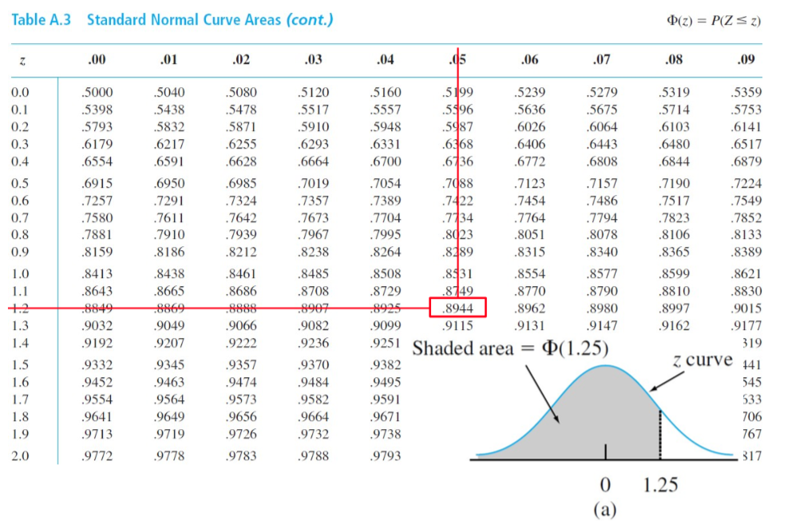


Para determinar o valor desta probabilidade, procuro na vertical a unidade e a primeira casa decimal do quantil desejado (1,2) e na horizontal, o valor da segunda casa decimal (0,05). O valor na interseção de linha e coluna corresponde ao valor de probabilidade acumulada para esse quantil. 

Essa probabilidade pode ser facilmente obtida utilizando o comando abaixo no software R.


```r
pnorm(1.25)
```


(b)  
$P[Z > 1.25] = 1- P[Z \leq 1.25] = 1 - \Phi(1.25)$


Precisamos calcular a área correspondente à cauda superior. Então, como a tabela dá a área acumulada, preciso calcular o complementar daquilo que nos é dado na tabela:

$P[Z > 1.25] = 1 - P[Z ≤ 1.25] = 1 - \Phi(1.25) = 1 - 0.8944  = 0.1056$

Podemos calcular essa probabilidade com o auxílio do software R, de acordo com o comando fornecido abaixo:


```r
1 - pnorm(1.25)
```

(c)   
 $P[Z \leq - 1.25] =  \Phi(-1.25) = 1 - \Phi(1.25)$
 


Precisamos calcular a área correspondente à cauda inferior correspondente ao quantil -1,25.  Mas, como as margens da tabela só me dão quantis positivos, é necessário utilizar-se da simetria da distribuição normal: sabemos que a área à esquerda do quantil -1,25 é igual à área à direita do quantil 1,25, portanto:

$P[Z ≤ -1.25] =  P[Z > 1.25] = 1 - P[Z ≤ 1.25] = 1 - \Phi(1.25) = 0.1056$ 
(igual ao mesmo valor de probabilidade do item anterior, claro!)

Novamente, é recomendável utilizar o software R para calcular essa probabilidade, de acordo com o comando fornecido abaixo.


```r
pnorm(-1.25)
```


(d)   
$P[-0.38 \leq Z \leq 1.25] =  \Phi(1.25) - \Phi(-0.38) = \Phi(1.25) + \Phi(0.38) - 1$


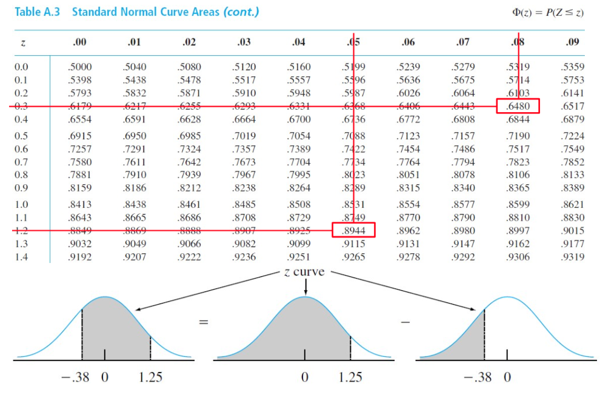


Finalmente, queremos a probabilidade de que $Z$ esteja no intervalo que vai de -0,38 a 1,25. Então, podemos subtrair as duas áreas acumuladas:

$P[Z ≤ 1.25] - P[Z ≤ -0.38]$

Como não temos na tabela os quantis negativos, é necessário expressar $P[Z ≤ -0.38]$ em termos do quantil positivo 0,38, com base na simetria da distribuição.

Então,  
$P[Z ≤ -0.38] = P[Z > 0.38] = 1 - P[Z ≤ 0.38]$

Portanto,

$P[-0.38 ≤ Z ≤ 1.25] = \Phi(1.25)  + \Phi(0.38) - 1$

O software R novamente simplifica muito o cálculo desta probabilidade, bastando utilizar o comando dado abaixo:


```r
pnorm(1.25) - pnorm(-0.38)
```


### Regra Empírica {-}


Comumente estamos interessados em determinar a probabilidade de que uma 
v.a. assuma valores a uma certa distância de $k$ desvios-padrão de sua média. Tais limites são conhecidos como *limites de tolerância*.

Vimos anteriormente que a Desigualdade de Chebyshev nos permite determinar limites inferiores para esses valores de probabilidade, qualquer que seja a distribuição da v.a., quando conhecemos apenas o valor esperado e a variância da v.a. 

Qualquer distribuição normal, independentemente dos valores assumidos por seus parâmetros $\mu$ e $\sigma$, possui a mesma probabilidade a uma distância fixa, dada em termos de número de desvios de sua média. 


\begin{align*}
  X \sim N(\mu, \sigma^2) \quad \Longrightarrow \quad 
  &Z \sim N(0,1):\\ 
  &P[|X -\mu| \leq k\sigma] = P[|Z| \leq k], \quad \forall k>0
\end{align*}


Para a distribuição normal, 68% (ou seja aproximadamente 2/3) das observações encontram-se a uma distância de 1 desvio-padrão de sua média; 95% das observações se encontram dentro dos limites de aproximadamente -2 a +2 desvios da média e, finalmente 99,7% (ou quase a totalidade) das observações se encontra a uma distância de 3 desvios da média. Sendo assim, espera-se que apenas cerca de 0,3% de todos os valores se encontrem a uma distância da média superior a três desvios. Então, embora o suporte da distribuição normal seja toda a reta real, na prática, a largura da distribuição normal é seis sigma.

A associação dos valores de probabilidade 68, 95 e 99,7 da distribuição normal aos respectivos fatores-k é chamada de *Regra Empírica*, exatamente por causa da grande utilização da distribuição normal para representar a distribuição das observações obtidas empiricamente nas mais diversas aplicações práticas.


Como curiosidade, veja como esses limites se comparam com aqueles obtidos através da Desigualdade de Chebyshev, em que os mesmos valores de probabilidade são garantidos para intervalos muito mais largos. 


### Coeficiente de Variação {-}


A distribuição normal é frequentemente utilizada para modelar vas que assumem apenas valores positivos (como área, altura, peso, distância, entre outras). O problema é que o suporte da distribuição normal é a reta real, o que significa que a v.a. normalmente distribuída pode assumir qualquer valor real, positivo ou negativo.

Como podemos contornar essa dificuldade?

Precisamos garantir que a probabilidade de observar um valor negativo seja desprezível. A regra de bolso nos diz que isso ocorre quando o coeficiente de variação, dado pela razão entre o desvio-padrão e a média, $\sigma$ sobre $\mu$ é menor que 0,3.

$$CV = \frac{\sigma}{\mu} <  0,3$$


::: {.example #unnamed-chunk-10}
:::


Peças em projeto aeronáutico comumente são unidas através de rebitagem. O cliente define a especificação do diâmetro dos rebites em 3,0 $\pm$ 0,01 mm. Qualquer rebite cujo diâmetro se encontre dentro da especificação será aceitável. 

Considerando o diâmetro dos rebites uma v.a. normalmente distribuída com média $\mu =$ 3,0 e desvio-padrão $\sigma =$ 0,005, que proporção de rebites será rejeitada?


::: {.solution}
:::


São aceitáveis os rebites cujos diâmetros se encontram no intervalo (2,99; 3,01).  
Portanto, queremos a probabilidade de rejeitar um determinado rebite, dada por:  
1 - P[2,99 < X < 3,01]

**Solução Manual**  
1. Padronizar a v.a. para uso da tabela normal  ( $\mu=$ 3 e $\sigma =$ 0,005):  
$z_1$ = (2,99 - µ)/σ = -2.0  $\quad z_2$ = (3,01 - µ)/σ = 2.0   
2. Buscar na tabela valores de probabilidade:  
P[Z < $z_1$ ] = 0,02275 e P[Z < $z_2$ ] = 0,97725   
3. Probabilidade desejada:  
1 - P[2,99 < X < 3,01] = 1 - P[-2 < Z < 2] = 1 - (0,97725 - 0,02275) = 0,0455 $\quad \therefore \quad \approx$ 4,55%

Portanto, espera-se que em média 4,55% dos rebites sejam rejeitados.

No R, é possível calcular esta probabilidade utilizando o comando abaixo:


```r
1 - (pnorm(3.01, mean = 3, sd = 0.005) - pnorm(2.99, mean = 3, sd = 0.005))
```


## Aproximação para Distribuições Discretas


A distribuição Normal comumente é utilizada para aproximar distribuições discretas simétricas. No entanto, como a distribuição normal é *contínua*, é necessário incluir uma correção para levar em conta a continuidade da distribuição. Essa correção é necessária toda as vezes que aproximamos uma população discreta por uma distribuição contínua.

Essa correção foi proposta por Augustus de Morgan em 1838, na tentativa de aperfeiçoar a aproximação de De Moivre para a distribuição Binomial, com base na ideia de que cada probabilidade binomial deveria ser interpretada como uma área de base unitária.  


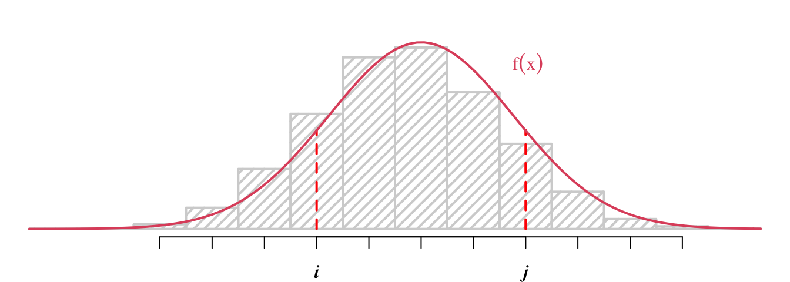


Seja $X \sim p_X(x)$ a v.a. discreta de interesse. A distribuição de $X$ é representada pelo histograma.

Queremos calcular a probabilidade: $P[i \leq X \leq j], \quad i < j;\; i,j \in \mathcal{Z}$

i. Do histograma, pode-se determinar esta probabilidade de maneira .stand-out[extata], calculando-se:  
$$P[i \leq X \leq j] = \sum_{x=i}^j p_X(x)$$


ii. Suponha $f_X(x)$ uma boa aproximação para $p_X(x)$. A fim de calcular a probabilidade associada à v.a. discreta a partir da aproximação pela função contínua $f_X(x)$, a área sob a curva contínua precisa ser obtida através da integral entre os limites $i$ e $j$ desejados, com o acréscimo de 1/2 (a metade da base) em cada direção:  
$$P[i \leq X \leq j] = \int_{x=i-1/2}^{j+1/2} f_X(x) dx$$


### Aproximação para a Distribuição Binomial {-}


Como De Moivre demonstrou, uma v.a. binomial com parâmetros $n$ e $p$ pode ter sua distribuição satisfatoriamente aproximada pela  distribuição Normal para valores elevados de $n$; isto é, para $n ≥ 30$ e quando ambos os produtos $np$ e $nq$ valem pelo menos 5:

$X \sim Bin (n, p)$

Se $n \geq 30; \; np \geq 5; \; nq \geq 5$:

$$X \sim Bin(n, p) \longrightarrow N(\mu = np, \sigma^2 = npq) \\ \frac{X - np}{\sqrt{npq}} \stackrel{\cdot}{\sim} N(0,1)$$

Nestas circunstâncias, a distribuição binomial apresenta forma de sino, com média  $pq$ e variância $npq$, de forma que, ao aplicar a transformação de padronização à v.a. $X$, a distribuição da v.a. resultante é aproximadamente normal padronizada.


::: {.example #unnamed-chunk-14}
:::


Companhias aéreas costumam praticar "overbooking", vendendo um número de passagens  superior ao número de assentos disponíveis na aeronave, a fim de maximizar seu retorno, já que existe a expectativa de que nem todos os passageiros se apresentem na hora do embarque. Tais passageiros são classificados como "no-show".

Suponha que tenham sido emitidas 200 passagens para um voo com capacidade para 197 passageiros e que  a taxa de "no-show" para este voo seja de 2%.

Qual a probabilidade de que haja *overbooking* para este voo, de forma que nem todos os passageiros que se apresentarem para embarque poderão viajar?


::: {.solution}
:::


Se considerarmos que os passageiros viajam sozinhos, sem acompanhantes, e que chegaram de maneira independente ao aeroporto, podemos modelar o número de "shows", isto é, o número de passageiros que se apresentam para o embarque como uma v.a. com distribuição Binomial, com parâmetros $n= 200$ e $p = 0.98$:

$X =$  número de "shows" (passageiros que se apresentam para embarque)  
$p =$ probabilidade de "show" $= 1 - 0,02 = 0,98$  

Portanto: $X \sim Bin ( n = 200, p = 0,98 )$

Queremos calcular a probabilidade de que o número de "shows" seja maior que a capacidade do voo, que vale 197: $P[X > 197]$


Dadas as características do problema, podemos resolvê-lo de diferentes maneiras. Primeiro, vamos considerar a solução analítica exata, utilizando a distribuição Binomial.

**Cálculo exato utilizando a Distribuição Binomial:**

Neste caso, precisamos somar os valores de probabilidade binomial para valores de $X$ que vão de 198 a 200. Fazendo isto, chegamos à conclusão de que há aproximadamente 23,5% de chance de overbooking.

$P[X > 197] = \sum_{x=198}^{200} Bin (x, n, p) = \sum_{x=198}^{200}  \frac{n!}{(n-x)!x!} p^x (1-p)^{n-x} = \ldots$   
$\approx 23.5\%$

Os cálculos são facilmente realizados com o auxílio do software R, utilizando qualquer dos comandos alternativos dados abaixo.


```r
sum(dbinom(198:200, size = 200, prob = 0.98))  
pbinom(200, 200, 0.98) - pbinom(197, 200, 0.98)
```

**Utilizando a Aproximação Normal:**

Já que o número de passagens vendidas é elevado, podemos tentar utilizar a aproximação para uma distribuição Normal com média $\mu = np = 196$ e variância igual $npq$:

$\mu = np = 200 \times 0.98 = 196$  
$\sigma = \sqrt{npq} = \sqrt{200 \times 0.98 \times 0.02} = 1.98$ 

Para que a aproximação seja adequada, precisamos verificar as condições de que $np$ e $nq$ sejam ambos maiores que 5. Estas condições garantem que a distribuição binomial seja simétrica, com forma aproximada de sino:

$np = 200 \times 0.98 = 196; \quad nq = 200 \times 0.02 = 4$. 


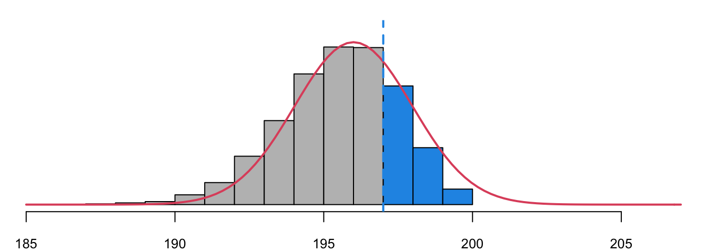


Para este exemplo, a distribuição binomial não é simétrica. Veja no gráfico, como a cauda da distribuição binomial (em cinza) é mais curta à direita. Ainda assim, prosseguiremos.

Ao aproximar a distribuição binomial (que é discreta) pela distribuição normal (que é contínua), precisamos realizar a correção para a continuidade.

Desejamos calcular a probabilidade $P[X > 197]$ (sinalizada em azul no gráfico). Portanto, o quantil considerado para a aproximação normal deverá ser de $197 + 1/2$. Padronizando este valor, temos o escore-z (que corresponde ao quantil da distribuição normal padronizada) dado por $z_2$: 

$x_2 = 197 + 0.5 = 197.5 \\ \Rightarrow \; Z \sim N(0, 1): \qquad z_2 = \frac{(197.5 - 196)}{1.98} = 0.7576$


Portanto,  
$$P[X > 197] \approx P[Z > z_1] = 1 - \Phi(z_1)  \approx 22.4\%,$$

ou seja, a probabilidade desejada vale aproximadamente 22,4% e pode ser obtida numericamente no software R utilizando o comando fornecido abaixo.


```r
1 - pnorm(197.5, mean = 196, sd = 1.98)  # com correção para continuidade
```


Esta aproximação apresenta erro da ordem de 1 ponto percentual com relação ao valor exato calculado a partir da distribuição Binomial, devido à inadequação do ajuste.

**Utilizando a Aproximação de Poisson:**

Podemos também aproximar a distribuição Binomial pela distribuição de Poisson quando $n$ é grande e $p$ é pequeno. Neste caso, vamos aproximar a distribuição do número de passageiros que não se apresentam para o embarque, que será representado pela v.a. $Y$. Para cada passageiro, esta probabilidade é $q$ e vale 0,02. Portanto, o parâmetro da distribuição de Poisson correspondente é $\lambda = nq = 4$:

+ $Y \sim Pois(\lambda)$: número de "no-shows"
+ Condição: $\lambda = nq = 200 \times 0.02 = 4$

Sendo assim, para que haja *overbooking*, o número de "no-shows" deve ser menor ou igual a 2 e, portanto, a probabilidade desejada segundo a aproximação de Poisson vale cerca de 23,8%, conforme mostram os cálculos abaixo.

$P[X > 197] \approx P[Y \leq 2] = \sum_{x=0}^{2} Pois (x, \lambda = nq) =\ldots \approx 23.8\%$

Este valor de probabilidade é obtido utilizando o software R através do seguinte comando:


```r
sum(dpois(0:2, lambda = 4))
```


Veja graficamente a semelhança das duas distribuições. Neste exemplo, a distribuição  de Poisson se mostrou uma aproximação mais adequada que a distribuição Normal. A área sombreada em azul, representa a probabilidade de interesse calculada.


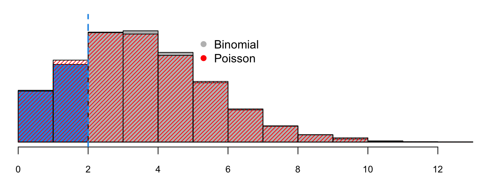


**Utilizando Simulação:**

Podemos ainda estimar essa probabilidade via simulação. Para isso, basta gerar uma grande quantidade de realizações da v.a. Binomial, com parâmetros  $n = 200$ e $p = 0,98$.


```r
Nsim <- 1000 # no. de voos simulados
Nrep <- 100  # no. de replicações
simula_voo <- matrix(rbinom(Nsim*Nrep, size = 200, prob = 0.98),
                     ncol = Nrep)
              # cada coluna armazena uma replicação de
              # 'Nsim' voos simulados

# condição de overbooking:
overbook <- simula_voo > 197

# calcula freq. de overbooking observada
# para cada replicação de 'Nsim' voos simulados
frel_overbook <- colMeans(overbook) 

# Histograma com as estimativas para P[X > 197]
hist(frel_overbook, freq=FALSE,
     density = 25,
     yaxt = "n",
     main = "Freq. relativa de 'overbooking'", 
     xlab = "", ylab = "",
     col="gray")
abline(v = mean(frel_overbook), col = 2, lty = "dashed", lwd = 3)
```


Os valores simulados são organizados na matriz `simula_voo`, tal que cada coluna corresponde a uma replicação da simulação de `Nsim` voos simulados. Há portanto, um total de `Nsim` linhas e `Nrep` colunas.

Cada elemento de `simula_voo` corresponde ao número de passageiros que se apresentaram para o embarque em um voo simulado. Verificamos se cada um desses voos resultou em *overbooking* e registramos a frequência relativa de *overbooking* em cada coluna, isto é, em cada replicação da simulação. Cada frequência relativa calculada corresponde a uma estimativa para a probabilidade de $X > 197$. Com isso, obtemos um número igual a `Nrep` estimativas para esta probabilidade. O histograma representa a distribuição das frequências relativas de *overbooking* observadas nas `Nrep` replicações. Veja que o centro da distribuição amostral é bem próximo do valor de probabilidade que desejamos calcular.


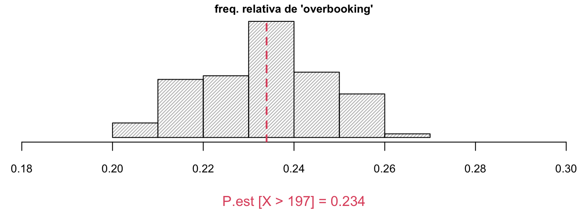


## Métodos Descritivos para Avaliar Normalidade


Embora não seja a melhor maneira de fazer isso, podemos avaliar a normalidade dos dados observando o **histograma** ou **gráfico de frequência relativa**. Se os dados forem aproximadamente normalmente distribuídos, espera-se que o histograma seja unimodal em torno da média, simétrico, com caudas curtas.

É importante verificar a **amplitude interquartis** e também o desvio-padrão amostral para os dados. Para dados com distribuição aproximadamente Normal, a razão entre a amplitude interquartis e o desvio padrão amostral deve estar em torno de 1,3.

E finalmente, o método descritivo mais utilizado para avaliar normalidade é o **gráfico de quantis**, que compara os quantos amostrais com os teóricos da distribuição normal correspondente. Se os dados tem distribuição aproximadamente normal, os pontos no gráfico de quantis estão dispostos em uma linha reta. 

Vejamos a aplicação desses métodos em um conjunto de dados.


::: {.example #unnamed-chunk-23}
:::


Os dados se referem a 100 medidas de consumo de combustível de um tipo de automóvel de passeio. O primeiro passo consiste em carregar os dados e analisar o resumo numérico.


```r
# carrega dados
consumo <- scan("data/CONSUMO.txt")

# produz resumo numérico dos dados
summary(consumo)
```

```
##    Min. 1st Qu.  Median    Mean 3rd Qu.    Max. 
##   12.76   15.17   15.73   15.73   16.29   19.09
```


Como uma primeira verificação de normalidade, vamos examinar o histograma que representa a distribuição dos valores de consumo de combustível registrados. A curva normal correspondente é sobreposta ao histograma. Claramente, a distribuição dos dados de consumo de combustível é unimodal em torno da média (que vale 15.73, conforme mostra o resumo numérico dos dados); além disso, a distribuição é aparentemente simétrica (a média é igual à mediana) com formato aproximado de sino.


```r
# constroi histograma de freq. relativa
hist(consumo, freq = FALSE,  main = "", 
     ylab = "Freq. Relativa", xlab = "km/l")

  m <- mean(consumo)
  s <- sd(consumo)
  curve(dnorm(x, m, s), add = TRUE, col = "red", lwd = 2)
```


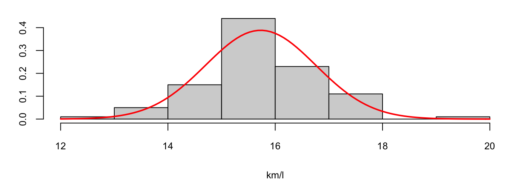


```r
# calcula amplitude interquartis
IQR <- diff(quantile(consumo, probs = c(0.25, 0.75))) 
# razão entre amplitude interquartis e desvio-padrão amostral
IQR/sd(consumo)
```

```
##      75% 
## 1.092566
```


A razão entre a amplitude interquartis e o desvio-padrão amostral é um pouco menor que 1.3; isso significa que a distribuição amostral é um pouco menos espalhada que a distribuição normal.

Por fim, analisemos o gráfico de quantis, também chamado de gráfico de probabilidades.


```r
# produz gráfico de quantis
qqnorm(consumo, 
       main = "", 
       pch = 19)
# adiciona reta de referência
qqline(consumo, col = "red")
```


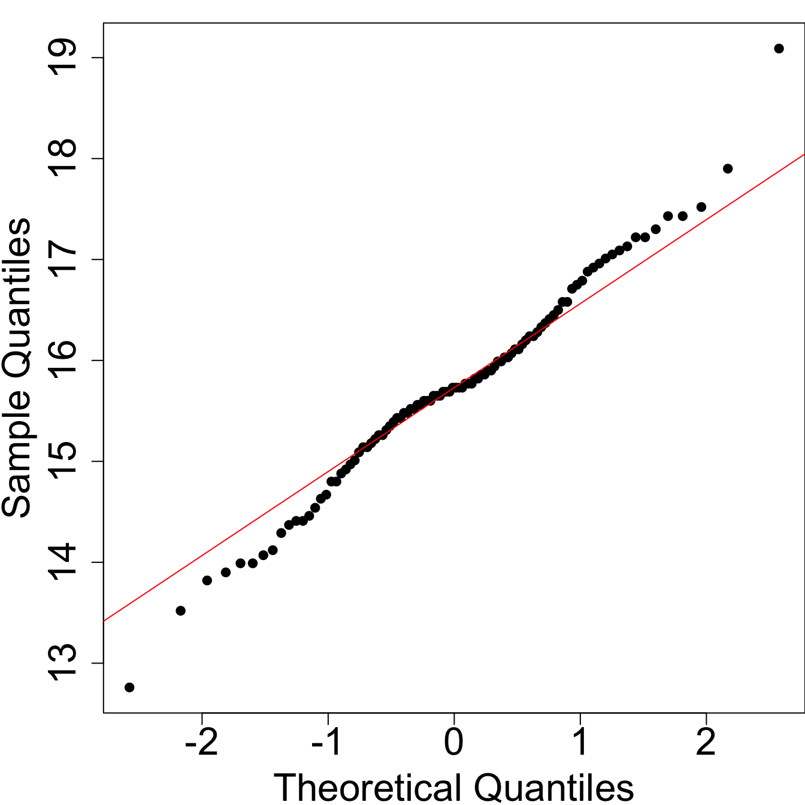


Em um gráfico de quantis, o eixo vertical corresponde às observações do conjunto  ordenadas do menor ao maior valor; no eixo horizontal temos os escores-z esperados das observações, sob a hipótese de normalidade. Quando os dados têm distribuição aproximadamente normal, os valores observados serão próximos dos valores esperados. Desta forma, quando o gráfico que quantis evidencia pontos dispostos em uma linha reta; desvios significativos de uma tendência linear indicam não-normalidade.

Esses métodos de verificação apresentados são bastante simples e, no entanto, poderosos, mas têm natureza simplesmente descritiva. Isso significa que não conferem validade estatística aos achados. Sendo assim, embora pouco provável, é possível que os dados sejam oriundos de uma distribuição não normal, mesmo que os resultados dessas técnicas descritivas apontem para uma aparente normalidade. Portanto, não podemos afirmar que os dados são, de fato, normalmente distribuídos com base no emprego de métodos descritivos; podemos apenas afirmar que parece razoável crer que os dados são normalmente distribuídos.

Existem métodos formais, baseados em testes de hipóteses, para avaliar a significância estatística dessa inferência. No entanto, testes de normalidade tendem a ser muito sensíveis a pequenos desvios de normalidade, o que quer dizer que eles tendem a rejeitar a hipótese de normalidade para qualquer distribuição que não seja perfeitamente simétrica e unimodal, especialmente quando muitas observações estão disponíveis.
