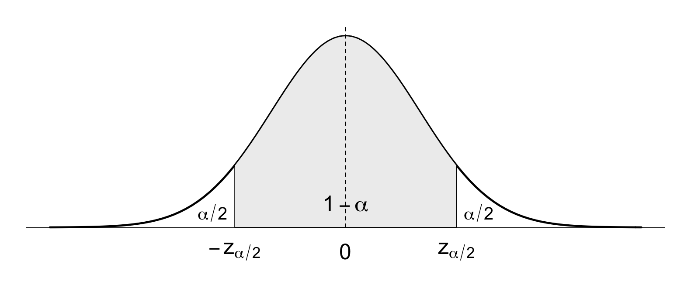
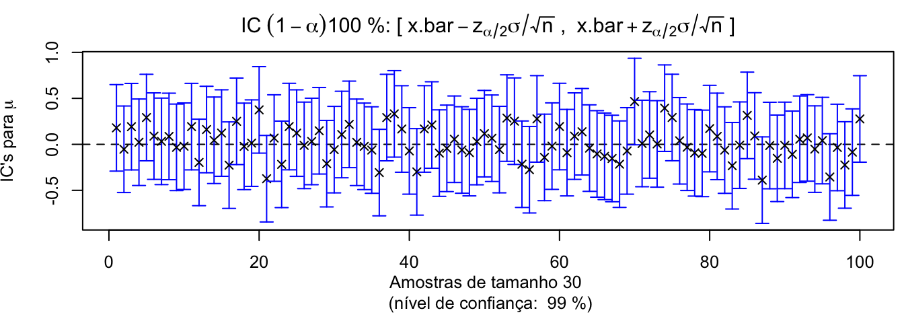
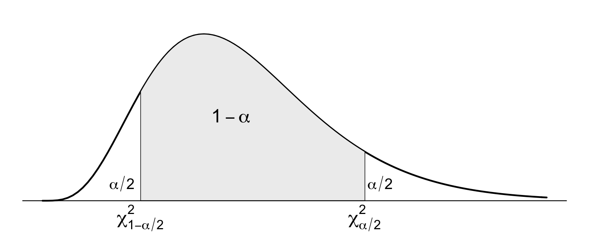

# Intervalos de Confiança


No capítulo anterior, aprendemos que, para realizar inferências a respeito de quantidades populacionais, utilizamos amostras retiradas da população de interesse. Vimos que é possível escolher entre diversas opções de estimadores e que é desejável que estes possuam certas características como não tendenciosidade, consistência e eficiência. Aprendemos dois métodos clássicos para construir estimadores que permitem obter estimativas pontuais para quantidades populacionais.  

No entanto, estimadores pontuais não fornecem informação a respeito da precisão e confiabilidade da estimativa obtida. A acurácia da estimativa pontual aumenta com o tamanho da amostra, mas é pouco provável que mesmo o estimador pontual não-tendencioso mais eficiente seja capaz de estimar o parâmetro populacional com exatidão. Sendo assim, em vez de fornecer um único valor numérico como estimativa para este parâmetro, é preferível determinar uma faixa de valores plausíveis para o parâmetro populacional em questão. Veremos a seguir como realizar estimação por intervalos. 


## Estimação por Intervalos


A estimação por intervalos consiste em determinar uma faixa de **valores plausíveis** (com probabilidade conhecida)  para o parâmetro populacional de interesse, $\theta$:


\begin{align*}
  P[\hat\Theta_{inf} < \theta < \hat\Theta_{sup}] = 1-\alpha, \quad 0 < \alpha < 1
\end{align*}


onde:

$\widehat\Theta_{inf}$; $\widehat\Theta_{sup}$:  limites de confiança (v.a.'s: variam com a amostra)    

$1 - \alpha$:  nível de confiança (é um valor de probabilidade)

Os limites que definem o intervalo dependem do valor para a estatística $\hat\Theta$ calculado   para uma determinada amostra aleatória,  bem como da distribuição amostral de $\hat\Theta$.

Como sabemos, diferentes amostras produzem diferentes valores para a estatística $\hat\Theta$, isto é, diferentes estimativas pontuais para o parâmetro $\theta$. A estimativa pontual corresponde ao centro do intervalo delimitado por $\hat\Theta_{inf}$ e $\hat\Theta_{sup}$. Sendo assim, esses limites (chamados de limites de confiança) também variam de amostra para amostra, sendo, portanto, também variáveis aleatórias. 

Imagine, que aquele alienígena interessado em estimar a altura média populacional $\mu$ dos seres humanos, tenha obtido uma amostra aleatória que produziu uma estimativa pontual para $\mu$ igual a 1,68m. Conhecendo a distribuição amostral da estatística utilizada (que neste caso, é a média amostral) e escolhendo o nível de confiança desejado, é possível determinar os limites de confiança do intervalo para a altura média populacional. 

Os valores dos limites do intervalo $\hat\Theta_{inf}$ e $\hat\Theta_{sup}$ devem ser tais que a probabilidade de $\theta$ se encontrar entre esses limites seja igual ao nível de confiança deste intervalo, dado por $1 - \alpha$.  Isso significa que a probabilidade de obter uma amostra aleatória que produza um intervalo que contém o real valor do parâmetro populacional $\theta$ vale $1-\alpha$.

Para um certo nível de confiança $1-\alpha$, o intervalo encontrado para uma determinada amostra disponível 

$$\hat\theta_{inf} < \theta < \hat\theta_{sup},$$ 

é chamado **intervalo de confiança** $100(1-\alpha)$% para $\theta$. Se $\alpha$ vale 5%, temos um intervalo de confiança 95%. Para $\alpha$ igual a 1%, temos um intervalo de confiança 99%. Quanto mais largo o intervalo de confiança, maior nossa certeza de ter encontrado um intervalo que inclui o parâmetro $\theta$ desconhecido. 

É claro que o alienígena ficará mais feliz em ter 95% de certeza de que a altura média populacional dos seres humanos se encontra entre 1,64m e 1,72 mdo que ter 99% de certeza de que este parâmetro populacional se encontra 1,50m e 1,86m. Numa situação extrema e absurda, podemos afirmar ter 100% de confiança de que a reta real inclui o valor do parâmetro populacional desconhecido. Embora tenhamos certeza absoluta de estarmos corretos ao fazer esta afirmação, na prática, ela não nos serve de nada. Idealmente, desejamos obter o intervalo de confiança mais curto (ou seja, de maior precisão), com o maior nível de confiança possível. Isto é possível se obtivermos uma amostra bastante informativa, isto é, contendo muitas observações. Existe um custo associado à obtenção de dados. Portanto, por vezes, restrições no tamanho da amostra que é possível coletar impedem de se obter um intervalo preciso sem sacrificar o nível de confiança associado.


## Procedimento para Construção de IC's


Utilizamos o seguinte procedimento para construir intervalos de confiança para um parâmetro populacional $\theta$ desconhecido, a partir dos dados de uma a.a. $X_1, X_2, \ldots, X_n$ i.i.d $f_X(\cdot)$:

1) Definir a estatística $W = g(X_1, X_2, \ldots, X_n)$, cuja distribuição seja conhecida e não dependa de $\theta$.

2) Com base na distribuição amostral de $W$, calcular $\hat\theta_{inf}$ e $\hat\theta_{sup}$ tais que
  $$P[\hat\Theta_{inf} < \theta < \hat\Theta_{sup}] = 1-\alpha$$
  
3)   Definir o intervalo de confiança $100(1-\alpha)\%$ para $\theta$ como: 
$$\{\theta: \hat\theta_{inf} < w(x_1, x_2, \ldots, x_n) < \hat\theta_{sup}\}$$

Em outras palavras, define-se uma estatística $W$ que será utilizada para estimar o parâmetro populacional $\theta$. Esta estatística pode ser determinada através dos métodos de construção de estimadores que estudamos anteriormente. Ou seja, a estatística é um estimador do parâmetro $\theta$.

Conhecendo a distribuição amostral da estatística $W$ e escolhendo o nível de confiança desejado $1-\alpha$, calculamos os limites de confiança do intervalo aleatório (dados por $\hat\Theta_{inf}$ e $\hat\Theta_{sup}$ ), de forma que a probabilidade de observar $\theta$ entre estes limites seja igual a $1-\alpha$. Note que essa afirmação só é válida antes que a amostra tenha sido observada. Após determinados os limites numéricos do intervalo, a partir dos dados de uma certa amostra observada, o intervalo deixa de ser aleatório. Então não faz sentido em falar que há uma probabilidade de que o parâmetro populacional se encontre dentro desses limites; ou o parâmetro populacional está no intervalo, ou não está. Nós apenas desconhecemos essa informação. Sendo assim, um intervalo de confiança NÃO deve ser interpretado como o intervalo de valores tais que a probabilidade de que o parâmetro populacional se encontre entre seus limites vale $(1-\alpha) 100$%. Esta é a interpretação correta para um intervalo Bayesiano posterior, que nós não estudaremos aqui. Para a estatística clássica, um intervalo de confiança apenas sugere que se o processo de amostragem for replicado um grande número de vezes, $(1-\alpha)100$% dos intervalos gerados a partir de diferentes amostras contém o parâmetro real populacional de interesse.

A seguir, veremos como construir IC's para média populacional quando  a variância populacional é conhecida; se a variância populacional for desconhecida e a população de origem for normal, construímos IC's de maneiras diferentes dependendo se o tamanho da amostra  é grande ou pequeno; e, ainda, consideraremos a construção de IC's para outros parâmetros populacionais: a proporção populacional e a variância populacional de uma população normal.


### CASO 1: IC para $\mu$ com $\sigma^2$ conhecida {-}


Este é o caso mais simples de construção de IC's e representa uma situação um tanto irreal. Ora,  queremos realizar inferência a respeito da média populacional e consideramos a variância populacional conhecida. Claramente, é bem pouco provável que a dispersão de uma população seja conhecida, quando nem seu centro o é. De toda forma, é pedagogicamente instrutivo iniciar por este caso.

De nossas discussões anteriores, sabemos que um estimador pontual interessante para a média populacional $\mu$ consiste na média amostral $\bar{X}_n$, pois este estimador é não viesado e é o mais eficiente (ou seja, tem menor variância dentre os estimadores não-viesados de $\mu$). De acordo com o TLC, também sabemos que a distribuição amostral da média amostral calculada para os valores de uma amostra aleatória coletada a partir de uma população arbitrária se aproxima de uma distribuição Normal com valor esperado $\mu$ e variância $\sigma^2/n.$

Sejam $X \sim N(\mu, \sigma^2)$, $\sigma^2$ **conhecida** e $\overline{x}_n$ o valor observado para a média de uma a.a. de tamanho $n$. O IC $100(1-\alpha)\%$ para a $\mu$ é dado por:

$$\overline{x}_n \pm z_{\alpha/2} \frac{\sigma}{\sqrt{n}},$$
onde $z_\alpha/2$ corresponde ao quantil da distribuição Normal padronizada que deixa à sua direita uma área igual a $\alpha/2$.  





\begin{align*}
&1-\alpha &z_{\alpha/2}\\
&90\%     &1,645\\
&95\%     &1,960\\
&99\%     &2,575\\
\end{align*}


O intervalo simétrico é o que tem menor comprimento possível: $L = 2z_{\alpha/2} \frac{\sigma}{\sqrt{n}}$. 

O IC para $\mu$ é construído da seguinte maneira:

Seja a média amostral $\bar{X}_n$. O TLC garante que:

$$Z = \frac{\bar{X}_n - \mu}{\sigma/\sqrt{n}} \sim N(0,1)$$

É necessário determinar os quantis da distribuição normal padronizada tais que:
$$P[-z_{\alpha/2} < Z < z_{\alpha/2}]  = 1-\alpha$$
Substituindo o valor de $Z$, temos:

$$-z_{\alpha/2} < \frac{\bar{X}_n - \mu}{\sigma/\sqrt{n}} < z_{\alpha/2}$$
De forma que obtemos o seguinte IC $100(1-\alpha)$% para $\mu$:
$$\bar{X}_n - z_{\alpha/2}\frac{\sigma}{\sqrt{n}} < \mu < \bar{X}_n  + z_{\alpha/2}\frac{\sigma}{\sqrt{n}}$$


É importante enfatizar que utilizamos o TLC para construir este intervalo de confiança; portanto o nível de confiança é acurado apenas para amostras grandes (ou seja, quando o número de observações é pelo menos 30) retiradas de populações arbitrárias. Se a população de origem é normal, o nível de confiança é exato, pois a distribuição amostral da estatística é normal, independentemente do tamanho da amostra. Para amostras pequenas de populações arbitrárias, a distribuição amostral de $\bar{X}_n$ depende da população de origem.


#### Ilustração {-}


A figura ilustra 100 intervalos de confiança 95% construídos a partir de 100 diferentes amostras aleatórias de tamanho 30, retiradas de uma população normal padronizada. Se a média populacional não fosse conhecida, poderíamos estimá-la através de uma estimativa pontual. Os pontos em forma de 'x' na figura representam os valores de média amostral calculados para cada amostra que foi obtida. Note que diferentes amostras  produzem valores distintos de média amostral e também para os limites de confiança, isto é, produzem diferentes intervalos, embora todos de mesma largura, já que o nível de confiança foi fixado em 95%. A maioria dos intervalos contém o valor real do parâmetro populacional (que neste caso, vale zero), mas nem todos. Como o nível de confiança é 95%, espera-se que cerca de 95 dos 100 intervalos contruídos a partir de diferentes amostras contenham o valor de $\mu$. No entanto, quando coletamos uma única amostra, e construímos um único IC95% para o parâmetro populacional não temos como determinar se ele está ou não contido no intervalo em questão.

A figura abaixo mostra os resultados do mesmo procedimento realizado anteriormente, só que agora para nível de confiança 99%. Neste caso, espera-se que cerca de 99 dos 100 IC's construídos para diferentes amostras contenham o valor real do parâmetro populacional $\mu$.





O intervalo de confiança nos dá uma estimativa da precisão da estimativa pontual. Se o valor do parâmetro pooulacional $\mu$ estiver no centro do intervalo de confiança construído, então estimamos $\mu$ a partir de $\bar{X}_n$ de maneira exata, sem erro. Raramente, no entanto,  este será o caso, de forma que a estimativa pontual tem um erro associado. O valor do erro da estimativa é dado pela diferença absoluta entre $\bar{X}_n$ e o valor real do parâmetro $\mu$. Este erro é, no máximo, igual ao valor da semi-largura do intervalo de confiança construído:

Se $\bar{X}$ for utilizado como estimador de $\mu$:

+ podemos ter 100( $1-\alpha$ )% de certeza de que o erro $= |\bar{X} - \mu|$ não excederá $z_{\alpha/2}\frac{\sigma}{\sqrt{n}}$: 
  erro $< e = z_{ \alpha/2}\frac{\sigma}{\sqrt{n}}$


É possível determinar o tamanho da amostra necessário para garantir que a estimativa terá um erro máximo igual a $e$. Basta resolver a expressão do erro para $n$ e arredondar o valor de $n$ encontrado para o maior inteiro mais próximo: 

+ podemos ter 100( $1-\alpha$ )% de certeza de que o erro não excederá um valor específico $e$ se o tamanho da amostra for 
  $n = \left( \frac{z_{\alpha/2}\sigma}{e} \right)^2$.
  
Note que, para determinar o tamanho de amostra, é necessário conhecer o valor da variância populacional, $\sigma^2$. Dificilmente isso ocorrerá na prática. Sendo assim, geralmente realiza-se um experimento piloto, coletando-se uma amostra contendo pelo menos 30 observações e, a partir dela estima-se o valor de $\sigma$. Utilizando a estimativa de $\sigma$ é possível determinar aproximadamente o número necessário de observações para garantir o nível de acurácia desejado.


::: {.example #unnamed-chunk-3}
:::


A concentração de uma determinada substância presente na água distruibuída para o consumo dos habitantes de uma cidade foi medida em 36 pontos, obtendo-se o valor médio de 2,6mg/l. Assuma que o desvio-padrão populacional seja conhecido e valha 0,3.

+ Determine os IC's 95% e 99% para a concentração média dessa substância na água distribuída para a população.

+ Qual deve ser o menor tamanho de amostra para que tenhamos 95% de confiança de que o erro na estimativa encontrada para $\mu$ seja no máximo 0,05?


::: {.solution}
:::


emos: $n = 36; \; \bar{x} = 2,6; \; \sigma = 0,3$.

**PARTE 1: Para o nível de confiança 95%, temos:** 

$\alpha = 1- 0,95  = 0,05 \; \overset{tabela}{\Rightarrow} \; -z_{0,025} = -1,96; \; z_{0,975} = 1,96$  

Portanto, 
IC 95%: $2,6 - (1,96) (0,3/\sqrt{36}) < \mu < 2,6 + (1,96) (0,3/\sqrt{36})\\ \Rightarrow \quad 2,50 < \mu < 2,70$


**PARTE 2: Determinando o tamanho de amostra para obter erro < 0,05 com 95% de confiança:** 

Temos: $n = 36; \; \bar{x} = 2,6; \; \sigma = 0,3$.  

erro < $e = z_{\alpha/2}\frac{\sigma}{\sqrt{n}} = 0,05 \; \Rightarrow  n = \left(z_{\alpha/2}\frac{\sigma}{0,05}\right)^2 =138,3 \quad \therefore n = 139$  

No R: 

```r
alpha <- 0.05; n <- 36; xn.bar <- 2.6; sigma <- 0.3  # dados do problema
z <- qnorm(1 - alpha/2)  # quantil de N(0,1) que deixa área alpha/2 à sua direita  
c(xn.bar - z * sigma/sqrt(n), xn.bar + z * sigma/sqrt(n)) # IC 95%
z * sigma/sqrt(n)        # erro máximo
erro <- 0.05
n.aa <- (z*sigma/erro)^2 # tamanho de amostra necessário
```

**Conclusão:**

Temos 95% de certeza de que:
+ a concentração média da substância na água distribuída para a população se encontra no intervalo (2,50; 2,70)
+ a média amostral $\bar{x} =$ 2,6 difere da média populacional $\mu$ em no máximo 0,1 <br>(erro máximo): $e = z_{\alpha/2}\frac{\sigma}{\sqrt{n}} = 1,96 \frac{0,3}{\sqrt{36}} = 1,96 \cdot 0,05 \approx 0,1$  
+  é necessário obter uma amostra com pelo menos 139 observações para garantir erro na estimativa menor que 0,05.
  

Para o nível de confiança 99%, basta fazer $\alpha = 0,01$. Assim, temos 99% de certeza de que:
+ a concentração média da substância na água distribuída para a população se encontra no intervalo (2,47; 2,73)
+ a média amostral $\bar{x} =$ 2,6 difere da média populacional $\mu$ em no máximo 0,13 <br>(erro máximo):

  $e = z_{\alpha/2}\frac{\sigma}{\sqrt{n}} = 2,57 \frac{0,3}{\sqrt{36}} = 2,57 \cdot 0,05 \approx 0,13$

Note como, para um nível de confiança mais elevado, o IC se tornará mais largo e, consequentemente, também o erro será maior (maior confiança implica em menor precisão para mesmo conjunto de dados).  


### CASO 2.1: IC para $\mu$ com $\sigma^2$ desconhecida {-}


Geralmente, queremos realizar inferência a respeito da média populacional quando a variância populacional é também desconhecida. Novamente, utilizaremos a média amostral como estimador da média populacional, substituindo o valor de $\sigma$ por sua estimativa $s$. Neste caso, é importante recordar que a  média amostral studentizada, isto é, quando a padronização da média amostral é realizada substituindo a  variância populacional desconhecida pela variância amostral, tem distribuição t-Student com $n-1$ graus de liberdade. Sendo assim, o intervalo de confiança para a média populacional é obtido de maneira semelhante ao caso anterior, exceto que agora os quantis são retirados da distribuição t-Student correspondente:

Seja
$X \dot{\sim} N(\mu, \sigma^2)$, $\sigma^2$ .ired-inline[desconhecida].  
Sejam $\overline{x}_n$ e $s^2_n$ a média e a variância de uma a.a. de tamanho $n$.

O IC $100(1-\alpha)\%$ para a $\mu$ é dado por:
$$\overline{x}_n \pm t_{\alpha/2} \frac{s_n}{\sqrt{n}}$$
em que $t_{\alpha/2}$ é o quantil adequado da distribuição t-Student com $\nu = n-1$ graus de liberdade.

No caso anterior, em que a variância populacional era conhecida, empregamos o TLC para obter a distribuição amostral da estatística. Note que, no caso em que a variância populacional é desconhecida, precisamos da hipótese de normalidade (pelo menos aproximada) da população original para garantir que a distribuição da estatística segue distribuição t-Student.


### CASO 2.2: IC para $\mu$ com $\sigma^2$ desconhecida (amostras grandes) {-}


No caso de amostras grandes, mesmo que a variância populacional seja desconhecida, podemos utilizar os quantis da distribuição normal padronizada para determinar intervalos de confiança para a média populacional. Isto é possível pois, para amostras de tamanho maior ou igual a  30, obtidas a partir de uma população com distribuição pelo menos aproximadamente normal, a distribuição t-Student se aproxima da distribuição normal padronizada.

Seja
$X \dot{\sim} N(\mu, \sigma^2)$, $\sigma^2$ .ired-inline[desconhecida].  
Sejam $\overline{x}_n$ e $s_n^2$ a média  a variância de uma a.a. grande ( $n \geq 30$ ).

Recomenda-se utilizar o seguinte IC $100(1-\alpha)\%$ para a $\mu$:
$$\overline{x}_n \pm z_{\alpha/2} \frac{{s_n}}{\sqrt{n}}$$


::: {.example #unnamed-chunk-6}
:::


Um fabricante de um certo tipo de dispositivo eletrônico deseja avaliar o desempenho de seu produto. Uma medida de desempenho corresponde ao tempo médio entre falhas do dispositivo. A fim de estimar o valor desta quantidade, um engenheiro registrou o tempo entre falhas para uma a.a. contendo 45 unidades deste dispositivo. As seguintes estatísticas foram calculadas:

$$\bar{x} = 1762 h \quad \textsf{e} \quad s = 215h$$

+ Estime o tempo médio entre falhas utilizando um IC 90%.  
+ Sabe-se que se o dispositivo estiver funcionando corretamente, o tempo médio real entre falhas deverá ser de pelo menos 1700h. Com base no intervalo calculado no item anterior, o que se pode inferir a respeito da qualidade dos dispositivos fabricados?


::: {.solution}
:::


Temos: $n = 45; \; \bar{x} = 1762h; \; s = 215h$. No entanto, nada foi afirmado a respeito da distribuição original. No entanto, já que n > 30, a média amostral studentizada tem distribuição t-Student com n-1 = 44 graus de liberdade.

Sendo assim, para um IC 90%: 
$\alpha = 1- 0,90  = 0,1 \; \overset{\textsf{tabela t:}\nu = 44}{\Rightarrow} \; t_{\alpha/2; \nu} = 1,684$  

Portanto, 
IC 90%: $\quad \bar{x} \pm t_{\alpha/2; \nu} \frac{s_n}{\sqrt{n}}: \quad 1762 \pm 1,684 \frac{215}{\sqrt{45}} \quad \Rightarrow \quad 1762 \pm 54h$

.font80[Temos 90% de confiança que o intervalo (1708, 1816) contém o tempo médio entre falhas. Como todos os valores no IC excedem 1700h, podemos inferir que os dispositivos funcionam adequadamente com 90% de certeza.]


No R: 


```r
alpha <- 0.1; n <- 45; xn.bar <- 1762; sn <- 215  # dados do problema  
t_est <- qt(1 - alpha/2, df = n-1)  # quantil de t(df=n-1)  
c(xn.bar - t_est * sn/sqrt(n), xn.bar + t_est * sn/sqrt(n)) # IC 90%
```


### CASO 3: IC para $p$ (proporção populacional) {-}


Um estimador pontual da probabilidade de sucesso em um experimento binomial é a proporção amostral de sucessos. Se o experimento binomial for tal que a probabilidade de sucesso não seja próxima de 0 ou 1, podemos estabelecer IC's para o parâmetro $p$ considerando a distribuição amostral de $\hat{P}$. De acordo com o TLC, para $n$ suficientement grande, $\hat{P}$ tem distribuição amostral Normal com média $p$ e variância $p(1-p)/n$.


1) Estatística: $\widehat{P} = \frac{X}{n}$ (proporção amostral),  
  $X=$ no. de sucessos ~ Bin(n, p) tal que $E[\widehat{P}] = p; \quad Var[\widehat{P}] = \frac{p(1-p)}{n}$.
  
  <br>
  Padronizando $\widehat{P}$, temos: 
  
  $$\frac{\widehat{P}-p}{\sqrt{p(1-p)/n}}$$
  
Portanto, o IC para o parâmetro $p$ pode ser obtido a partir de uma a.a. utilizando os quantis da distribuição normal padronizada, como segue. Note que o erro padrão é função de $\hat{p}$ e $\hat{q}$. Isto se deve pois não é muito simples isolar o parâmetro $p$ na desigualdade. Para $n$ suficientemente grande, no entanto, o erro introduzido com esta aproximação é pequeno.

2) O IC $100(1-\alpha)\%$ para $p$ é dado por:
$$\widehat{p} \pm  z_{\alpha/2} \sqrt{\frac{\hat{p}\hat{q}}{n}}$$

**OBS:**  
+ Quando $n \downarrow$ e $p \rightarrow 0$ (ou $p \rightarrow 1$), este procedimento não é válido;
+ Regra de bolso: deve-se ter $n\hat{p} \geq 5$ e $n\hat{q} \geq 5$.


::: {.example #unnamed-chunk-9}
:::


Em uma a.a. de tamanho n = 500 de famílias assinantes de TV a cabo em SJC, um total de x = 340 possuíam assinatura de um canal de filmes.

+ Qual o IC 95% para a proporção na população de assinantes de TV a cabo em SJC que têm acesso ao canal?
+ Qual o erro máximo que se comete com esta estimativa?
+ Qual o tamanho da amostra mínimo que garanta confiança de 95% de que o erro máximo desta estimativa seja de 0,02?


::: {.solution}
:::


Temos: $n = 500; \; x = 340;\; \hat{p} = 340/500 = 0,68$. 

**PARTE 1: Para um IC 95%**   

$\alpha = 1 - 0,95  = 0,05 \; \overset{\textsf{tabela normal}}{\Rightarrow} \; z_{\alpha/2} = 1,96$  

Portanto, 
IC 95%: $\quad \hat{p} \pm z_{\alpha/2} \sqrt{\frac{\hat{p}(1-\hat{p})}{n}}: \quad 0,68 \pm 1,96 \sqrt{\frac{0,68 \cdot 0,32}{500}} \quad \Rightarrow \quad 0,68 \pm 0,04$

Temos 95% de certeza que a proporção de assinantes que possuem o canal encontra-se no intervalo (0,64; 0,72).

No R:  

```r
alpha <- 0.05; n <- 500; x <- 340; p_hat <- x/n  # dados do problema  
z <- qnorm(1 - alpha/2)  # quantil de N(0,1)  
# IC:
c(p_hat - z * sqrt(p_hat*(1-p_hat)/n), p_hat + z * sqrt(p_hat*(1-p_hat)/n))
```

**PARTE 2: Erro de estimação**

Temos 95% de confiança que o erro máximo para a estimativa $\hat{p} = 0,68$ vale:  
$e = z_{\alpha/2}\sqrt{\frac{\hat{p}(1-\hat{p})}{n}} = 0,04$

**PARTE 3: Tamanho da amostra necessário para obter erro < 0,02 com 95% de confiança:**

$erro < e =  z_{\alpha/2}\sqrt{\frac{\hat{p}(1-\hat{p})}{n}} = 0,02 \\ \Rightarrow  n = \left(\frac{z_{\alpha/2}}{e}\right)^2 \hat{p}(1-\hat{p}) = \left(\frac{1,96}{0,02}\right)^2 0,68\cdot 0,32 = 2089,8 \therefore n = 2090$  

Uma amostra de tamanho n = 2090 garante 95% de confiança de cometer erro máximo de 0,02 ao estimar que a proporção populacional de assinantes que possuem o canal vale 0,68.


### CASO 3: IC para $\sigma^2$ {-}


Quando uma amostra aleatória é retirada de uma população Normal, podemos estimar a variância populacional $\sigma^2$ utilizando o estimador não-viesado variância amostral. Conforme vimos anteriormente, a  estatística $Q^2$ tem distribuição Qui-Quadrado com $n-1$ graus de liberdade, de forma que é possível obter um intervalo de confiança para $\sigma^2$ a partir da distribuição amostral da estatística $Q^2$.

Seja
$X \sim N(\mu, \sigma^2)$. 
Seja $S_n^2$ a variância amostral para uma a.a. de tamanho n.

$$Q^2 = \frac{(n-1)S^2_n}{\sigma^2} \sim \chi^2_{\nu=n-1}$$

Portanto, o IC $100(1-\alpha)\%$ para $\sigma^2$ é dado por:

$$\frac{(n-1)S^2_n}{\chi^2_{\alpha/2}} \leq \sigma^2 \leq \frac{(n-1)S^2_n}{\chi^2_{1-\alpha/2}}$$





Um IC aproximado para $\sigma$ é obtido tomando-se a raiz quadrada de cada limite do intervalo construído para $\sigma^2$.


O IC para a variância populacional de uma população Normal é obtido da seguinte maneira:

Seja a variância amostral $S^2_n  = \frac{1}{n-1}\sum (X_i - \bar{X}_n)^2$. Sabemos que:

$$Q^2 = \frac{(n-1) S^2_n}{\sigma^2} \sim \chi^2_{\nu=n-1}$$


Portanto, podemos encontrar os quantis da distribuição Qui-quadrado, tais que:
$$P[\chi^2_{1-\alpha/2} < Q^2 < \chi^2_{\alpha/2}]  = 1-\alpha$$

Substituindo o valor de $Q^2$ e isolando $\sigma^2$, obtemos o seguinte IC $100(1-\alpha)$% para $\sigma^2$:
$$\frac{(n-1)S^2_n}{\chi^2_{\alpha/2}} < \sigma^2 < \frac{(n-1)S^2_n}{\chi^2_{1-\alpha/2}}$$


::: {.example #unnamed-chunk-12}
:::


O sistema indicador de combustível de uma aeronave baseia-se na utilização de sensores, cujas medidas de resistência elétrica são convertidas para a quantidade de combustível equivalente através de uma curva de calibração característica.

A fim de avaliar a precisão desse sistema, um engenheiro observou os valores de resistência registrados (em Ohms) nos sistemas de 10 aeronaves, para uma certa quantidade de combustível pré-estabelecida:

$$46,4\; 46,1\; 45,8\; 47,0\; 46,1\; 45,9\; 45,8\; 46,9\; 45,2\; 46,0$$

Qual o IC 95% para a variância do sistema indicador, para a quantidade de combustível considerada?
Assuma população normalmente distribuída.


::: {.solution}
:::


Temos: $n = 10; \; s_n^2 = 0,286$. Vamos supor X ~ Normal.

IC 95%: $\alpha = 1 - 0,95 = 0,05 \; \Rightarrow \; \alpha/2 = 0,025$;   $\nu = n- 1 = 9$ g.d.l.

$\chi^2_{inf} = \chi^2_{1- \alpha/2, \nu}=  \chi^2_{0,975, 9} \overset{\textsf{tabela  }\chi^2_{\nu}}{=} 2,700 \quad  \chi^2_{sup} = \chi^2_{\alpha/2, \nu} = \chi^2_{0,025, 9} \overset{\textsf{tabela  }\chi^2_{\nu}}{=} 19,023$  

Portanto:
$(n-1)\frac{S_n^2}{\chi^2_{\alpha/2}} < \sigma^2 < (n-1)\frac{S_n^2}{\chi^2_{1-\alpha/2}} \; \Rightarrow \; 9 \cdot \frac{0,286}{19,023} < \sigma^2 < 9 \cdot \frac{0,286}{2,700}$

Temos 95% de certeza que a variância do sistema indicado de combustível encontra-se no intervalo (0,135; 0,953).

No R:  


```r
x <- c(46.4, 46.1, 45.8, 47.0, 46.1, 45.9, 45.8, 46.9, 45.2, 46.0) # a.a.  
alpha <- 0.05; sn2 <- var(x); n <- length(x) # dados do problema    
chi2s <- qchisq(1 - alpha/2, df = n-1); chi2i <- qchisq(alpha/2, df = n-1)     
c((n-1)*sn2/chi2s, (n-1)*sn2/chi2i) # IC 95%
```
