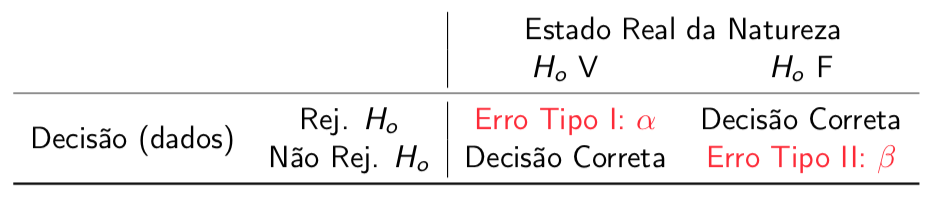
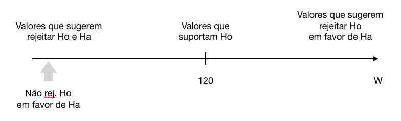
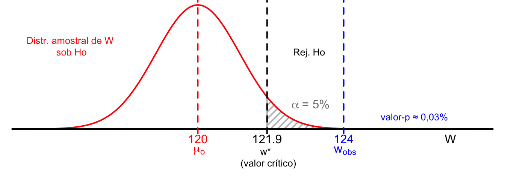
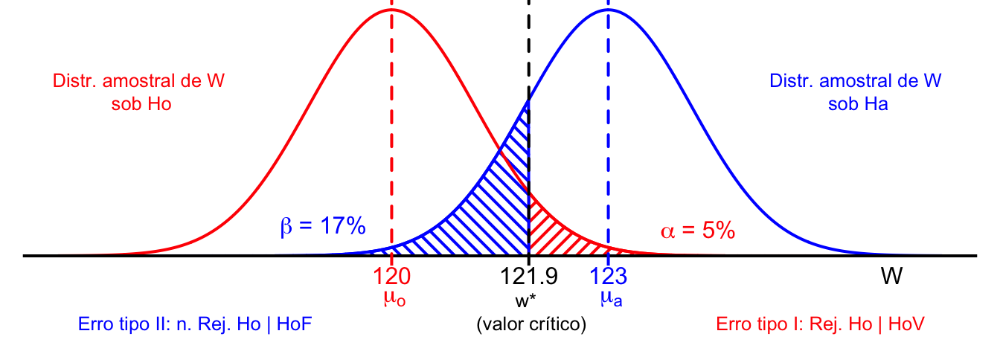
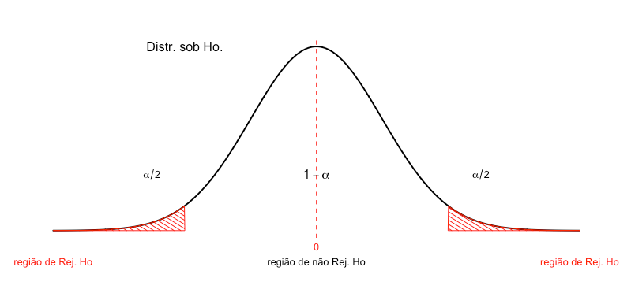

# Testes de Hipóteses


Até agora, aprendemos como realizar inferência a respeito de certas características
de uma população na forma de estimativas numéricas:

- pontuais; ou através de  
- intervalos de confiança

Há certas inferências, no entanto, que envolvem a comparação ou a escolha entre
duas teorias, ou hipóteses concorrentes! 

Por exemplo, em vez de tentar estimar a eficácia de uma vacina, um pesquisador pode querer avaliar com base em evidências empíricas se é plausível acreditar que a vacina é eficaz contra um certo vírus. Neste tipo de problema de inferência, cria-se uma conjectura a respeito do estado real da natureza (que no exemplo, que se refere à eficácia da vacina), coletam-se dados e uma decisão  é tomada com base nas evidências empíricas obtidas.   

O processo de 

(i) formular as possíveis conclusões que podem ser obtidas a partir de um certo 
experimento aleatório e   
(ii) escolher uma dentre as alternativas disponíveis 

...é chamado de *Teste de Hipóteses*.

Vejamos um outro exemplo para ilustrar este processo:

A Rodovia dos Imigrantes liga a cidade de São Paulo ao litoral paulista. A fim de incentivar que os motoristas respeitem os limites de velocidade, foram instalados radares ao longo da rodovia.

Num certo trecho da rodovia, cujo limite de velocidade para veículos de passeio é de 120km/h,
a velocidade dos veículos medida por três radares é modelada pela amostra aleatória:

$$X_1, X_2, X_3$$

Os motoristas são multados por excesso de velocidade com base no valor da média dessas velocidades.

A partir de que valor de velocidade média registrada os motoristas devem ser multados por ultrapassar o limite de velocidade, admitindo-se que 5% dos motoristas serão multados injustamente?


Vamos construir um modelo para os dados, a fim de analisá-los utilizando técnicas estatísticas apropriadas.

**Modelo para os Dados**

Nossos dados consistem em uma amostra aleatória contendo 3 observações para a velocidade de um veículo, registrada por 3 radares. Cada valor $x_i$ corresponde ao valor de velocidade registrada pelo radar $i$. Vamos, ainda, supor que o veículo mantenha velocidade constante no trecho que compreende os três radares.

Dados (amostra): $x_1, x_2, x_3$

A variabilidade observada nos dados obtidos nesse experimento pode ser descrito através de um modelo matemático. A fim de construir este modelo, vamos imaginar que a velocidade medida não necessariamente corresponde à velocidade real do veículo; pode ser que haja um erro de medida associado ao instrumento utilizado, que é o radar.
Sendo assim, a velocidade medida pelo radar é igual à velocidade média real do veículo mais um erro de medida do instrumento.

[VELOCIDADE MEDIDA] = [VELOCIDADE MÉDIA REAL] + [ERRO DE MEDIDA] 

Podemos representar essa relação matematicamente:
$$X_i = \mu + \epsilon_i, \quad i = 1,2,3$$

onde:
$X_i$: representa o valor de velocidade medido pelo radar $i$  
$\mu$: é a velocidade média real do veículo  
  (esse é um parâmetro populacional considerado fixo (ou constante), porém desconhecido, pois não sabemos qual a velocidade real do veículo. Esse parâmetro precisa ser estimado com base nos dados da amostra coletada.)
  
$\epsilon_i$: são perturbações aleatórias que correspondem aos erros de medida de cada um dos radares.  

Se cada radar estiver calibrado corretamente, podemos modelar o erro de medida através de v.a.'s $\epsilon_i$,  $\; i = 1,2,3$ tal que
$$E[\epsilon_i] = 0, \quad Var[\epsilon_i] = \sigma^2: \qquad \epsilon_{i} \sim N(0, \sigma^2)$$

Esse modelo descreve a variabilidade na velocidade registrada para os diferentes radares como sendo um desvio aleatório com relação à média dessa população (isto é, a velocidade média real do veículo). Esse desvio aleatório tem média nula, de forma que não há erro sistemático na velocidade registrada pelo radar e vamos considerar que as variâncias sejam idênticas.


Vimos anteriormente (motivados pelo TLC) que erros em medidas físicas como esta podem
ser adequadamente modelados por uma distribuição normal. Assumindo variância conhecida ( $\sigma^2 = 4$, por exemplo), temos que $X_1, X_2, X_3$ constituem uma a.a. retirada de uma população Normal com média $\mu$, desconhecida, e variância comum igual a 4. 

Portanto, supondo a variância conhecida ( $\sigma^2 =4$ ):
$$X_1, X_2, X_3 \quad i.i.d. \quad N(\mu, \sigma^2=4)$$


## Formulação de Hipóteses Estatísticas


Uma hipótese estatística corresponde a uma conjectura a respeito dos parâmetros de uma distribuição ou de um modelo; a avaliação, ou o teste desta hipótese, está associado a uma decisão a ser tomada.

Por exemplo, podemos questionar se é plausível crer que a velocidade média do veículo não excede o limite de 120km/h. Um veículo não será multado a menos que tenhamos evidências suficientemente fortes de que sua velocidade é maior que o limite estabelecido, ou seja, a decisão será por não multar o veículo a menos que estejamos convencidos de que sua velocidade está alta demais.

O processo de avaliação da plausabilidade de uma conjectura é um problema de decisão, formulado formalmente através do seguinte teste de hipóteses:

**Hipótese Nula (Ho):**  $\mu = 120$    
a velocidade real do veículo é (menor ou) igual  a 120km/h  
(decisão: não multar)  

**Hipótese Alternativa (Ha):**  $\mu > 120$   
a velocidade real do veículo é superior a 120km/h  
(decisão: multar)


A Hipótese Nula (representada por Ho) corresponde ao status quo considerado, é o estado da natureza que acreditamos ser verdadeiro a menos que tenhamos evidências empíricas fortes o suficiente para nos convencer do contrário e, assim, rejeitá-la.

Já a Hipótese Alternativa (representada por Ha) é a realidade alternativa considerada, ou seja, é a realidade em que estamos dispostos a crer, se as evidências empíricas nos conduzirem a rejeitar a nossa crença atual, dada pela Ho. Note que não estamos dispostos a trocar nossa crença atual por outra possibilidade qualquer. Estamos considerando apenas a possibilidade alternativa dada por Ha. Por isso, Ha deve ser cuidadosamente escolhida de acordo com o problema em questão.

O processo de decisão em um teste de hipóteses é semelhante ao de um julgamento:
Assumimos Ho verdadeira até que "se prove" o contrário, ou seja, até que se tenha evidências fortes o suficiente para "condená-la", ou seja, rejeitar Ho em favor de Ha.

Precisamos definir como utilizar os dados coletados para colocar à prova a hipótese nula e o que significa obter "evidências fortes o suficiente" para rejeitá-la.


## Estatística do Teste


Considere um conjunto de dados modelado como a realização de uma a.a. $X_1, X_2, \ldots  X_n$ de uma população $f_X(x)$.

A estatístcia do teste é qualquer função das observações da amostra:

$$W = g(X_1, X_2, \ldots, X_n)$$

No exemplo, queremos comparar a velocidade média real do veículo $\mu$ ao limite de velocidade de 120km/h. Mas a velocidade média real é desconhecida. Nós não a observarmos. Portanto, precisamos estimar essa média populacional a partir dos dados de que dispomos, isto é, das observações na amostra coletada.

Vimos que um estimador não-viesado para a média populacional é a média amostral, que corresponde à média aritmética dos valores da amostra. Assim, podemos estimar $\mu$ utilizando o estimador $\bar{X}_3$, que neste caso corresponde à média aritmética das velocidades registradas pelos três radares. O valor calculado de $\bar{X}_3$ pode ser utililizado para decidir se temos evidências para crer que a velocidade média registrada pelos radares não foi observada por acaso.

De maneira geral, utilizamos o valor da estatística $W$ calculado para os valores da amostra para decidir se a hipótese nula é estatisticamente compatível com as evidências empíricas obtidas. $W$ é a chamada ESTATÍSTICA DO TESTE. A estatística $W$ é uma v.a., já que é função exclusiva dos valores observados na amostra e, portanto, tem uma distribuição amostral.

No exemplo, para decidir se a velocidade média observada nos leva à conclusão de que a velocidade média real do veículo está acima do limite de 120km/h, precisamos calcular a probabilidade de ter observado essa velocidade média amostral por ação do mero acaso, já que existe variabilidade intrínseca no processo de amostragem.

Suponha que um veículo passa todos os dias pela mesma estrada com a mesma velocidade média. Se hoje eu obtiver uma amostra com 3 medidas de velocidade e amanhã outras 3 e, assim por diante, concordamos que cada amostra será composta por conjuntos distintos de 3 elementos, correto? Sendo assim, a média aritmética resultante para os valores observados para a primeira amostra provavelmente será diferente daquela calculada para o segundo conjunto e, assim sucessivamente.

Assumimos que as observações da amostra foram coletadas de maneira independente a partir de uma distribuição Normal com variância conhecida 4. Portanto, o TLC nos garante que a média amostral têm distribuição Normal com centro na média populacional correspondente $\mu$ e variância igual à variância populacional dividida pelo número de elementos da amostra, $\sigma^2/3$.


No exemplo:
$$W = \bar{X}_3 = \frac{X_1 + X_2 + X_3}{3} \sim N(\mu, 4/3)$$

Precisamos determinar **com base na distribuição amostral da estatística**:  
+ que valores de $W$ nos dão evidências que suportam Ho e  
+ que valores de $W$ dão evidências para rejeitar Ho em favor de Ha.


## Erros de Decisão





$\alpha =$ P[erro tipo I] = P[rej. Ho | Ho V]

$\beta =$ P[erro tipo II] = P[não rej. Ho | Ho F]

$\pi = 1-\beta$ = Poder do Teste = P[rej. Ho | Ho F]

Num problema de teste de hipóteses, estamos diante da seguinte situação: existe o estado real da natureza, que pode ser: (1) a Ho é verdadeira, o que significa que o veículo está abaixo do limite de velocidade, ou (2) a Ho é falsa (isto é, o veículo está acima do limite de velocidade).  O estado real da natureza é desconhecido. Não conhcemos  a velocidade real do veículo; só sabemos ao certo o que se observa nos dados da amostra. Ao mesmo tempo, precisamos tomar uma decisao: rejeitar ou não rejeitar a Ho. 

Se  rejeitamos a Ho e o estado real da natureza é que a Ho é falsa, então eu acertamos em nossa decisão. Isso significa que decidimos acreditar que a velocidade do veículo está acima do limite quando ela de fato está e, portanto, a multa é aplicada corretamente. Se rejeitamos a Ho e o estado real da natureza é que a Ho é verdadeira, então a decisão tomada foi errada. Fomos levados a crer (a partir dos dados da amostra observada) que o veículo estava com velocidade acima do limite, mas ele não estava. Nessa situação, cometemos um erro, e a multa é aplicada injustamente, pois a partir das evidências empíricas obtidas, não fomos capazes de perceber o real estado da natureza. Esse erro tem nome: **Erro do Tipo I**.

Quando cometemos erro do tipo I, somos levados a crer, com base nas evidências empíricas (os resultados do experimento) que o veículo está mais rápido do que deveria. Só que isso aconteceu fortuitamente, por acaso, pois o estado real da natureza é que o veículo está numa velocidade admissível.

Uma outra decisão é possível: não rejeitar a Ho. Tomamos esta decisão quando as evidências empíricas  nos levam a crer que o veículo está a uma velocidade abaixo do limite. Se  decidirmos não rejeitar a Ho e o estado real da natureza for a Ho é verdadeira, então tomamos uma decisão correta. Um veículo com velocidade adequada não é multado. Por outro lado, se decidimos não rejeitar Ho e a Ho é falsa, erramos na decisão tomada, pois um veículo que dirigia de maneira inadequada deixou de ser multado. Esse é o **Erro do tipo II**. Neste caso,  os dados não foram capazes de mostrar o real estado da natureza, que corresponde à situação em que a velocidade do veículo é superior a 120 km/h.

Cada um desses erros pode acontecer com uma certa probabilidade. E o teste de hipóteses é formulado de modo que o erro mais temido seja o erro do tipo I. O teste é bem sucedido quando somos capaz de rejeitar a Ho. Assim, é possível controlar o risco máximo de cometer erro tipo I em $\alpha$ (por exemplo 5%). $\alpha$ é o **Nível de Significância** do teste e corresponde ao maior risco que se aceita correr de cometer erro do tipo I. A probabilidade de cometer erro tipo II é chamada de $\beta$. Só corremos o risco de cometer erro do tipo II se não conseguirmos rejeitar a Ho. Já o **poder do teste** é uma medida da resolução ou sensibilidade do teste, ou seja, da capacidade de perceber corretamente que a Ho é falsa; é a probabilidade de tomar corretamente a decisão de rejeitar a Ho.

Essas probabilidades precisam ser calculadas com base na distribuição amostral  da estatística do teste. A distribuição amostral a ser empregada vai depender da estatística considerada, bem como das informações que temos disponíveis a respeito das populações de onde foram retiradas as amostras.

No exemplo, só vamos rejeitar a hipótese nula de que $\mu$ = 120 se o valor observado da estatística $W $ estiver "muito longe" do centro de sua distribuição amostral. Precisamos definir o que é "muito longe" a fim de tomar a decisão de rejeitar ou não a Ho! Mas essa decisão será tomada sob uma condição de incerteza, pois o estado real da natureza é desconhecido. Apenas conhecemos o que observamos da natureza. E será que as observações coletadas refletem adequadamente o estado real da natureza?


## Região Crítica





Precisamos avaliar quais os valores que poderiam ser tipicamente observados para a estatística do teste, quando a Ho é verdadeira. A região crítica é aquela definida para valores de $W$ estatisticamente incompatíveis com a Ho, ou seja, aqueles que nos motivam a rejeitar Ho em favor de Ha.

Note que valores de $W$ próximos de 120 são compatíveis com a Ho; portanto, nesta região não há motivos para desconfiar da veracidade da Ho. Vivemos bem com a decisão de não rejeitar a Ho quando $W$ assume valores próximos de 120.

Quando $W$ assume valores muito diferentes de 120, começamos a desconfiar de que talvez nossa crença em Ho não faça muito sentido... mas, só nos sentimos inclinados a rejeitar Ho em favor de Ha para valores de $W$  muito maiores do que 120. Para valores de $W$ muito menores que 120, desconfiamos de Ho, mas essa evidência não favorece a Ha. Como só é possível trocar Ho por Ha, neste caso, não faz sentido rejeitar a Ho em favor de Ha.

Vamos calcular então, para que valores de $W$ rejeitamos a Ho em favor da Ha!

Para isso, é necessário definir o risco máximo que estamos dispostos a correr de cometer o erro tipo I, que consiste em rejeitar Ho quando não deveríamos (isto é, multar um veículo injustamente). Ou seja, precisamos estabelecer o nível de significância $\alpha$ do teste. Para o exemplo, o risco máximo tolerado é 5%. 

Escolhido o nível de significância do teste, é necessário determinar o valor $w^\star$ que define a região crítica para o nível de significância 5%. Isso significa que a probabilidade de observar valores de $W$ mais extremos que $w^\star$ é igual a 5% quando a Ho é verdadeira. 

Sabemos que $W$ tem distribuição amostral Normal com média $\mu$ que, sob a Ho, vale 120 e cuja variância é igual a 4/3. Portanto, a probabilidade de observar $W ≥ w^\star$ é equivalente à probabilidade de observar valores da estatística normal padronizada $Z ≥ z^\star$ , que corresponde ao valor de  $w^\star$ padronizado. Podemos determinar, então, o valor de $w^\star$ que faz essa probabilidade ser igual a 5%. A fim de encontrar o valor limite $w^\star$, tal que
$$P[W \geq w^\star | \textsf{Ho V}] = 0,05$$

precisamos resolver:
$$P\left[ Z \geq z^\star = \frac{w^\star - E[W]}{\sqrt{\textsf{Var}[W]}}\right] = 0,05,
  \quad \textsf{em que} \quad Z \sim N(0,1).$$

Portanto, temos $z_{0,05} = 1,645$ e
$$z^\star = \frac{w^\star - E[W]}{\sqrt{\textsf{Var}[W]}} = \frac{w^\star - 120}{2/\sqrt{3}} = 1,645 
  \qquad \therefore \quad
  w^\star = 121,9.$$


A Região crítica é o conjunto de valores observados para a estatística $W$ do teste 
que correspondem à rejeição de Ho em favor de Ha. Ela pode ser definida a partir da distribuição amostral da estatística do teste.


No exemplo, a região crítica é definida pelos valores de $W \geq 121,9$ (sombreada na figura). Se o valor da estatística calculado para os dados experimentais se encontrar nessa região, consideraremos que está "longe demais" para que a diferença observada seja devida simplesmente ao acaso. O valor de $W$ (121,9) que define a fronteira de decisão entre rejeitar ou não rejeitar a hipótese nula é chamado **valor crítico**.

A região crítica depende do nível de significância $\alpha$ e da estatística do teste $W$,
de forma que a probabilidade de observar valores da estatística na região de rejeição é no máximo $\alpha$, quando Ho é verdadeira.

Portanto, para um nível de significância do teste de 5%, rejeitamos a Ho de que  $\mu= 120$ em favor da Ha de que $\mu > 120 $ para $W ≥ 121,9$. Isso quer dizer que toda vez que obtivermos uma velocidade média calculada a partir dos registros dos três radares maior ou igual a 121,9, o veículo será multado por excesso de velocidade. Utilizando esta regra de decisão, é possível garantir que no máximo 5% dos motoristas serão multados injustamente.   


## Valor-p


Outra opção é basear nossa decisão, não limitando o risco máximo de cometer erro tipo I, mas avaliando o **risco real** de cometer erro tipo I. Esse risco real é o valor-p. O valor-p corresponde ao nível de significância observado:  

$$\textsf{valor-p} = P[W \geq W_{obs} |\textsf{Ho V}]$$

Suponha que, para um determinado veículo tenha sido registrado $w_{obs} = 124$.  
Então:


\begin{align*}
    \textsf{valor-p} 
    &= P[W \geq 124 | Ho] = P\left[ \frac{W - 120}{2/\sqrt{3}} \geq \frac{124-120}{2/\sqrt{3}} \right]\\
    &= P[Z \geq 3,46] \approx 0,0003 < \alpha  = 0,05!
\end{align*}





O valor observado para a estatística do teste define uma área na cauda da distribuição. Essa área o valor-p. Se a área é pequena, nosso risco real de cometer erro do tipo I é pequeno.  O valor-p representa uma medida da força das evidências nos dados de que Ho é falsa. 

Quanto menor o valor-p, maiores as evidências contra Ho, 
pois mais raro seria o evento de obter uma amostra que produz o valor de $W = w_{obs}$ se a Ho fosse verdadeira. 

Sendo assim, vamos tomar a decisão de rejeitar a Ho com mais tranquilidade se o valor-p for baixo, o que significa que nosso risco real de estar tomando essa decisão de maneira equivocada é baixo.

Neste exemplo, como o valor-p (que é o nível de significância observado) é menor que o nível de significância do teste $\alpha$, rejeitamos Ho no nível $\alpha$, pois se a Ho fosse verdadeira, a amostra que produziu o valor de $W = 124$ seria mais rara do que estamos dispostos a admitir. Apenas 0,03% de todas as amostras aleatórias seriam capazes de produzir um valor de média amostral igual a 124km/h, se a velocidade média real fosse igual a 120km/h. Lembre-se que o valor máximo admissível é dado pelo valor crítico $w^\star$, determinado pelo nível de significância do teste, que corresponde ao risco máximo tolerável de rejeitar de maneira equivocada a Ho. 

O valor-p obtido de 0,03%, muito menor que o nível de significância do teste $\alpha$, nos diz que o risco real de cometer erro do tipo I é bem menor que aquele que estaríamos dispostos a correr ao rejeitar Ho. Portanto, com este valor-p podemos rejeitar a Ho com maior tranquilidade ainda. 

Se o valor-p for elevado, por exemplo 15%, 20%, então o risco real de estar cometendo um erro ao decidir rejeitar Ho começa a ficar desconfortavelmente alto e pode ser preferível tomar a decisão de não rejeitar Ho. Essa decisão, por sua vez, também está sujeita a incertezas. Vejamos como calcular a probabilidade de cometer erro tipo II, que corresponde a não rejeitar Ho quando deveríamos.


## Qual a probabilidade de cometer erro do tipo II? {-}


Ou seja, qual o percentual de veículos com excesso de velocidade que não serão multados?

Ao estabelecer um nível de significância $\alpha$, controlamos o risco máximo
de cometer erro do tipo I, que consiste em rejeitar Ho quando a Ho é verdadeira (isto é, quando a multa é aplicada injustamente).

Como calculamos a probabilidade de cometer erro do tipo II, que consiste em não rejeitar Ho quando ela é FALSA (ou seja, quando a multa não é aplicada para um veículo infrator)?

Em primeiro lugar, essa pergunta só pode ser feita quando não somos capazes de rejeitar  Ho no teste de hipóteses.  Em segundo lugar, esta pergunta só pode ser respondida considerando-se alternativas específicas. Para isso, vamos considerar duas possibilidades para a hipótese alternativa:

H1: $\mu = 125$  
H2: $\mu = 123$


#### (1) H1: $\mu = 125$ {-}


Para o primeiro caso, quando a Ho é falsa, e o estado real da natureza corresponde a $\mu = 125$, a probabilidade de não sermos capazes de rejeitar a Ho corresponde à probabilidade de obter uma amostra que produz um valor para a estatística $W$ inferior a 121,9 (o valor crítico, que define a fronteira da região de rejeição de Ho), quando a velocidade média real é de 125km/h. Portanto,

Se Ho é falsa e $\mu = 125$, temos:

\begin{align*}
P[\text{Erro Tipo II}] 
&= P [\text{não rej. Ho | Ho F}] = \beta\\
&= P [\text{não receber multa estando acima do limite de velocidade}]\\
&= P [W < 121,9 | \mu= 125]\\
&= P \left[\frac{W - 125}{2/\sqrt{3}} < \frac{121,9 - 125}{2/\sqrt{3}} \right]\\   
&= \Phi (-2,68) = 0,0036 \approx 0,4\%.  
\end{align*}


Portanto, apenas aproximadamente 0,4% de todos os veículos que estiverem a uma velocidade de 125km/h deixarão de ser multados por excesso de velocidade. Como esta probabilidade é baixa, isso significa que somos capazes de perceber que a velocidade de 125km/h é estatisticamente maior que 120km/h. 

No R:  


```r
pnorm(q = 121.9, mean = 125, sd = sqrt(4/3))
```


#### (2) H2: $\mu = 123$ {-}


Quando a Ho é falsa, e o estado real da natureza corresponde a mu = 123km/h, a probabilidade de não sermos capazes de rejeitar Ho corresponde à probabilidade de obter uma amostra que produz um valor para a estatística $W$ inferior a 121,9 (o valor crítico, que define a fronteira da região de rejeição de Ho) quando o veículo tem velocidade média real de 123km/h. Portanto,

Se Ho é falsa e $\mu = 123$, temos:


\begin{align*}
P[\text{Erro Tipo II}] 
&= P [\text{não rej. Ho | Ho F}] = \beta\\
&= P [\text{não receber multa estando acima do limite de velocidade}]\\
&= P [W < 121,9 | \mu= 123]\\
&= P \left[\frac{W - 123}{2/\sqrt{3}} < \frac{121,9 - 123}{2/\sqrt{3}} \right]\\   
&= \Phi (-0.95) = 0,1711 \approx 17\%.  
\end{align*}


Isto quer dizer que cerca de 17% de todos os veículos que estiverem a uma velocidade de 123km/h deixarão de ser multados por excesso de velocidade. Note que ficou mais difícil de identificar que o estado real da natureza corresponde à hipótese alternativa de $\mu = 123$, pois ela se confunde com maior facilidade com a condição dada pela hipótese nula.

No R:

```r
pnorm(q = 121.9, mean = 123, sd = sqrt(4/3))
```


## Poder do Teste


O teste de hipótese é governado pelo seu nível de significância, que corresponde ao risco máximo de tomar uma decisão errada ao rejeitar indevidamente a hipótese nula. Agora, qual a capacidade de o teste rejeitar Ho se, de fato, ela é falsa? A probabilidade de rejeitar corretamente a hipótese nula para uma certa condição alternativa específica corresponde ao poder do teste. Portanto,

Qual a capacidade de o teste rejeitar Ho se, de fato, temos $\mu=125$?


\begin{align*}
P[\text{Poder do Teste}] 
&= P [\text{rej. Ho | Ho F}] = 1 - \beta\\
&= P [\text{multar quando deveria}]\\
&= P [W > 121,9 | \mu= 125]\\
&= 1-0,0036 = 0,9964  \approx 99,64\%.  
\end{align*}


No R:


```r
1 - pnorm(q = 121.9, mean = 125, sd = sqrt(4/3))
```


O poder do teste representa a sensibilidade do teste, fornecendo uma medida da diferença entre Ho e Ha. Testes diferentes podem ser comparados com relação ao seu poder e considera-se um teste razoável aquele com poder ≥ 0,8.

Como exercício, calcule o poder do teste para o caso em que a hipótese alternativa corresponde a $\mu = 123$.


## Resumo Gráfico 





Aqui temos um resumo gráfico de testes de hipóteses. Neste caso, estamos testando o seguinte conjunto de hipóteses:

Ho: $\mu  = 120$  
Ha: $\mu  > 120$   

Este teste controla em $\alpha =$ 5% o risco de cometer erro do tipo I. O valor para a estatística que define a área $\alpha$, em vermelho, é o valor crítico $w^\star$, que define a fronteira de decisão. 

Portanto, quando o estado real da natureza for a Ho é verdadeira (correspondente à distribuição vermelha), se obtivermos um valor de estatística $W$ do teste na região sombreada de vermelho, seremos levados a rejeitar a Ho, pois esse valor de estatística cai na região de rejeição, mas esta decisão terá sido errada. Neste caso, cometemos erro do tipo I. No exemplo, a probabilidade deste erro vale $\alpha =$ 5%.

Por outro lado, se o valor da estatística do teste observado for inferior ao valor crítico $w^\star$, decidiremos não rejeitar Ho, pois estamos na região de não rejeição da Ho. Se o estado da natureza for a Ho é verdadeira (correspondente à distribuição vermelha), teremos tomado uma decisão correta ao não rejeitar Ho.


No entanto, quando o estado da natureza for a Ho é falsa e vale a Ha (agora, correspondente à distribuição azul), podemos rejeitar a Ho corretamente quando o valor da estatística do teste observado é superior ao valor crítico $w^\star$ ou, podemos não rejeitar a Ho, cometendo assim erro do tipo II, quando o valor da estatística do teste observado for inferior ao valor crítico $w^\star$. No exemplo, para a hipótese alternativa $\mu =$ 123, a probabilidade de cometer erro do tipo II é dada pela área sombreada de azul, que corresponde a $\beta$ e vale 17%.

Nunca saberemos ao certo se estamos cometendo erro do tipo I ou II, pois não conhecemos o estado real da natureza, ou seja, não sabemos se estamos na distribuição vermelha ou na distribuição azul. Mas conseguimos pautar nossas decisões calculando os riscos de cometer esses erros. 

Algumas reflexões são importantes:

+ A probabilidade de cometer erro do tipo II depende o valor real que  $\mu$ assume
na hipótese alternativa. Neste caso a Ha corresponde a $\mu > \mu_o = 123$.  

+ Se a Ho é falsa, $\beta$ aumenta quando o valor real do parâmetro se aproxima do valor hipotético (isto é quando a Ha se aproxima da  Ho). Quanto maior a distância entre Ho e Ha, menor o valor de $\beta$.  Quanto mais próximo $\mu_a$ estiver de $\mu_o$, maior o valor de $\beta$, isto é, maior a probabilidade de cometer erro do tipo II, pois maior a dificuldade de distinguir os dois estados da natureza representados pelas duas hipóteses. 

+ Uma vez estabelecido o nível de significância $\alpha$ do teste, a probabilidade de cometer erro do tipo I é fixado em no máximo $\alpha$.

+ A probabilidade de cometer erro do tipo II pode ser arbitrariamente próxima de $1-\alpha$, conforme aproximamos $\mu_a$ de $\mu_o$. Por exemplo, como exercício para casa, calcule a probabilidade de erro do tipo II quando $\mu_a  = 120,1$.

+ Os Erros dos tipos I e II estão relacionados.  A redução da probabilidade de um deles resulta em aumento na probabilidade do outro: a probabilidade de cometer erro do tipo I (dada por $\alpha$) sempre pode ser reduzida ajustando-se o valor crítico (reduzindo a região crítica), acompanhado de um aumento na probabilidade de cometer erro do tipo II (dada por beta). Por outro lado, podemos reduzir $\beta$ aumentando a região crítica; mas isso é possível apenas pagando-se o preço de aumentar também $\alpha$. 

Mas queremos $\alpha$ e $\beta$ ambos pequenos...

+ Bem, só podemos diminuir a probabilidade de cometer os dois erros, aumentando o tamanho da amostra $n$, isto é, obtendo mais informação. O aumento do tamanho da amostra reduz $\alpha$  e $\beta$ simultaneamente.


## Testes Mono- e Bi-Caudais


Um teste de hipótese sempre é definido por duas hipóteses concorrentes: Ho e Ha. Para  a hipótese nula, usa-se sempre a igualdade, pois assim, controlamos $\alpha$. A escolha de uma hipótese alternativa mono- ou bi-caudal depende da conclusão a que se quer chegar, caso Ho seja rejeitada (controla a região crítica).

O exemplo que vimos consistida em um teste mono-caudal superior, ou seja, quando a hipótese nula é rejeitada se há evidências que levam a crer que o valor do parâmetro é maior que aquele assumido na hipótese nula.

Há ocasiões em que a hipótese nula é rejeitada quando há evidências de que o valor real do parâmetro se afasta do valor hipotético de Ho em qualquer direção. Neste caso, é adequado utilizar um teste bicaudal.


**Testes Mono-Caudais**

Ho: $\theta = \theta_o$  
Ha: $\theta > \theta_o$  

ou

Ho: $\theta = \theta_o$  
Ha: $\theta < \theta_o$ 


**Testes Bi-Caudais**

Ho: $\theta = \theta_o$  
Ha: $\theta \neq \theta_o$ ( $\theta > \theta_o$ ou $\theta < \theta_o$  )\


### Região de Rejeição para um Teste Bi-caudal {-}





No caso de um teste bi-caudal, a região de rejeição da Ho também precisa ser redefinida com base na distribuição amostral adequada. Assim como no caso de um teste mono-caudal, vamos tomar nossa decisão limitando o risco de cometer erro tipo I em no máximo $\alpha$. Isso significa que consideraremos que a distância admissível para a não rejeição da Ho é aquela determinada pelos valores da estatística que delimitam a área $1-\alpha$ em torno do centro da distribuição. Nas caudas sobram áreas iguais a $\alpha/2$ de cada lado.

A região das caudas (em vermelho) é a chamada região de rejeição, pois se o valor da estatística calculado para os dados experimentais se encontrar nessa região, consideraremos que está longe demais do valor assumido pela hipótese nula, para que a diferença observada seja devida simplesmente ao acaso. 

Em outras palavras, se os dados da amostra produzem um valor da estatística do teste na região de rejeição, considera-se ter evidências suficientemente fortes para rejeitar a Ho, aceitando correr um risco máximo igual a $\alpha$ de cometer um erro ao tomar essa decisão de rejeitar Ho.

O valor-p é definido exatamente de maneira análoga, definindo-se corretamente a região de não rejeição da hipótese nula, ou seja, neste caso a área correspondente ao valor-p também deve compreender as duas caudas da distribuição. 


## Procedimento para Testes de Hipóteses (utilizando o nível de significância) 


Podemos realizar dois procedimentos distintos para conduzir um teste de hipóteses a respeito de um parâmetro populacional $\theta$ de interesse. O primeiro aqui descrito, é baseado no nível de significância estabelecido para o teste.

1) Estabelecer Ho e Ha;

2) Escolher nível de significância $\alpha$; 

3) Escolher estatística $W$ apropriada para o teste;

4) Determinar região crítica (rejeição de Ho) baseada em $\alpha$;

5) Calcular o valor da estatística do teste ( $w_{obs}$ ):  
  + Rejeita-se Ho se $w$ pertence à região crítica  
  + Caso contrário, não é possível rejeitar Ho
  
6) Obter conclusões científicas a partir do resultado do teste. 


O teste de hipóteses inicia com a escolha das hipóteses nula e alternativa. Na hipótese nula, sempre colocamos a igualdade pois, desta forma, somos capazes de controlar o risco máximo de rejeitá-la erroneamente. A hipótese alternativa deve ser formulada tendo em vista a rejeição da hipótese nula. A favor de que explicação para o estado real da natureza estamos dispostos de trocar a explicação atual fornecida pela hipótese nula? 

Lembre-se de que, e isto é de extrema importância, para que um teste de hipótese seja bem sucedido, ele deve rejeitar a hipótese nula. Esta é a única maneira de controlarmos o risco de cometer erro do tipo I. Se a hipótse nula não é rejeitada, podemos até calcular a probabilidade de cometer erro do tipo II, mas não temos controle sobre esse risco. Pior ainda, é que a não-rejeição da Ho não implica na veracidade da Ho; apenas indica que não fomos capazes de obter evidências suficientemente fortes para refutar (respeitando-se um certo nível de incerteza) nossa conjectura e, or este motivo, nunca devemos escrever ou falar "aceitar a Ho"; a expressão correta é "não rejeitar a Ho".  O objetivo de todo teste de hipóteses é rejeitar a hipótese nula em favor da hipótese alternativa escolhida. Quando não conseguimos rejeitar a hipótese nula, chegamos a um resultado inconclusivo! Chegamos à conclusão de que não temos evidências fortes o suficiente para deixar de acreditar na explicação para o estado real da natureza fornecida pela Ho.

Estabelecidas as hipóteses nula e alternativa, é necessário escolher um nível de significância fixo para o teste. Este é o risco máximo tolerado de cometer erro do tipo I.

Utilizando os métodos de construção de estimadores vistos anteriormente, podemos escolher ou construir um estimador $\hat\theta$ adequado para o parâmetro populacional $\theta$ sendo avaliado. O estimador é a estatística do teste. É importante ser capaz de determinar a distribuição amostral da estatística do teste, pois é a partir dessa distribuição e do nível de significância escolhido que podemos determinar a região de rejeição da hipótese nula.

Calcula-se o valor da estatística para o conjunto de observações disponíveis na amostra disponível e toma-se a decisão objetiva de rejeitar ou não rejeitar a hipótese nula, dependendo se o valor observado da estatística estiver ou não inserido na região crítica.

Com estes resultados, é possível obter as conclusões científicas relativas ao fenômeno sendo investigado.


## Procedimento para Testes de Hipóteses (utilizando valor-p) 


Existe uma outra abordagem alternativa para conduzir um teste de hipóteses, com base no valor-p. Embora o procedimento seja semelhante, é filosoficamente diferente do anterior. 

1) Estabelecer Ho e Ha;

2) Escolher estatística $W$ apropriada para o teste;

3) Calcular o valor da estatística do teste ( $w_{obs}$ ):  

4) Calcular valor-p da estatística;
  
5) Utilizar valor-p obtido e conhecimento a respeito do sistema analisado para chegar a uma conclusão científica.  


Aqui também o procedimento tem início com a escolha das hipóteses nula e alternativa, tendo em vista as mesmas considerações do caso anterior. A escolha da estatística do teste e o cálculo do seu valor para o conjunto de dados disponíveis na amostra também devem ser realizados como antes. 

No entanto, note que não escolhemos um valor fixo para o nível de significância do teste. Isso significa que, na abordagem do valor-p, não se busca controlar o risco máximo de cometer erro do tipo I e também que não há uma decisão objetiva a ser tomada com relação à rejeição ou não da hipótese nula. 

Pelo contrário, determina-se o nível de significância observado (o valor-p) associado ao valor calculado para a estatística do teste para os dados na amostra. A decisão de rejeitar ou não a hipótese nula é tomada a partir da análise **subjetiva** do valor-p obtido e do conhecimento do analista a respeito do fenômeno sendo investigado. Rejeita-se a hipótese nula em favor da hipótese alternativa se o valor-p for considerado baixo o suficiente, isto é, se o risco real de cometer erro do tipo I for considerado tolerável com base na experiência do analista. 


## IC vs TH 


IC e TH consistem em procedimentos de inferência estatística relacionados entre si, embora sejam conduzidos com diferentes propósitos:

Construímos intervalos de confiança para obter uma gama de valores plausíveis para um determinado parâmetro populacional $\theta$. A plausabilidade é medida pelo nível de confiança $1-\alpha$ do intervalo. 


Note que um intervalo de confiança NÃO deve ser interpretado como o intervalo de valores tal que a probabilidade de que o parâmetro populacional se encontre entre seus limites vale $(1-\alpha)100\%$. Em estatística clássoca, um intervalo de confiança apenas sugere que se o processo de amostragem for replicado um grande número de vezes, espera-se que cerca de $(1-\alpha)100\%$ dos intervalos gerados a partir de diferentes amostras contenham o parâmetro real populacional de interesse.

Por outro lado, realizamos um teste de hipótese para decidir se é plausível acreditar que o parâmetro populacional sendo investigado assume um determinado valor conjecturado. A plausabilidade é medida pelo nível de significância $\alpha$ do teste.

Note que, quando um mesmo parâmetro populacionalé analisado, ambos os procedimentos são realizados com base na mesma estatística. Para realizar inferências a respeito da média populacional $\mu$, utilizamos a média amostral, quer para construir um IC para $\mu$, quer para testar uma hipótese a respeito de $\mu$. De fato, é possível perceber que os dois procedimentos podem nos levar a um entendimento equivalente a respeito do parâmetro populacional, a partir de pontos de vista diferentes. Por exemplo, quando testamos a hipótese de que a média populacional é igual a um certo valor $\mu_o$, versus a hipótese alternativa de que $\mu$ é diferente de $\mu_o$, num nível de significância $\alpha$, é o mesmo  que construir um IC com nível de confiança $1-\alpha$ e rejeitar a hipótese nula caso o valor conjecturado $\mu_o$ se encontre fora do intervalo construído.
