--- 
Encoding: UTF-8
title: "GED-13: Probabilidade e Estatística"
author: "Prof. Denise Beatriz Ferrari"
date: "2o. semestre/2020"
institute: "Instituto Tecnológico de Aeronáutica"
site: bookdown::bookdown_site
output: bookdown::gitbook
documentclass: book
bibliography: [book.bib, packages.bib]
biblio-style: apalike
link-citations: yes
description: "Apostila do curso de GED-13: Probabilidade e Estatística."
---


# Objetivos do Curso {-}

Este curso tem como objetivo preparar os alunos para:

+ resolver problemas que envolvam a análise de dados, quer acadêmicos (como aqueles encontrados em projetos de pesquisa) ou prático;

+ tomar decisões com base em dados ou evidências;  

+ consumir de maneira mais crítica análises estatísticas realizadas por outras pessoas, apresentadas em artigos científicos, relatórios e em publicações de cunho mais geral.

<!--chapter:end:index.Rmd-->

# Introdução

## Estatística e o Raciocínio Científico 

A prática Científica e de Engenharia comumente envolve o uso de dados experimentais para chegar a alguma conclusão a respeito do fenômeno de interesse do investigador.  Este é um processo de inferência, que constitui parte fundamental do método científico. E o papel da Estatística nesse processo é justamente o que veremos a seguir.


<div class="figure">
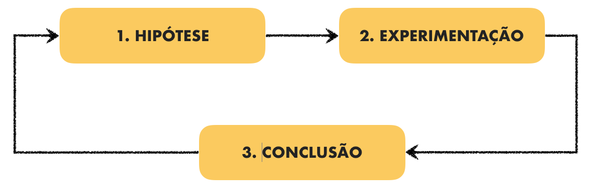
<p class="caption">(\#fig:ch1-metodo-cientifico)Método Científico: processo iterativo indutivo-dedutivo.</p>
</div>


Podemos definir Ciência como sendo um corpo de conhecimentos sistematizados adquiridos via observação, identificação, pesquisa e explicação de determinados fenômenos e fatos, e formulados de maneira metódica e racional.

O método de investigação científica sempre começa por uma pergunta. Formula-se uma hipótese, que nada mais é que uma conjectura a respeito de como determinado fenômeno funciona. A partir do pensamento crítico, então, a hipótese é desafiada e testada objetivamente através de observações e experimentos, ou seja, através de evidências. Se a explicação original sobreviver ao teste, pode ser aceita como válida; caso contrário, novas conjecturas ou hipóteses precisam ser formuladas para explicar o fenômeno sendo investigado e novamente o ciclo se repete; este é, portanto, um processo iterativo.

O raciocínio dedutivo é utilizado para chegar a uma conclusão lógica a partir de premissas verdadeiras. No método científico, empregamos o raciocínio dedutivo quando dada a hipótese considerada, criamos a expectativa de observar um certo resultado para o experimento. Se a hipótese for verdadeira, o resultado é uma consequência lógica verdadeira. Parte-se do geral (a teoria, a hipótese) para o específico (as observações, as evidências empíricas).


Já através do raciocínio indutivo, tenta-se chegar a generalizações a partir de um conjunto de observações, um conjunto de dados. Portanto, indução consiste na elaboração de hipóteses e teorias para explicar um determinado fenômeno que se observa; esta atividade sempre envolve incertezas, devido às imperfeições do processo de observação e experimentação e também à incompletude e imperfeição da informação que temos disponível (afinal de contas, observamos apenas uma seleção, um subconjunto, de todos os resultados possíveis e, muitas vezes, é impossível reproduzir de maneira exata o fenômeno sendo investigado através de um experimento planejado).

Sendo assim, as práticas científicas apóiam-se no emprego do Método Científico para construir novos conhecimentos. Note que o método científico em si não produz as respostas à questão científica, mas propõe um método sistemático para chegar a essas respostas.

O método científico é caracterizado pela formulação e avaliação de hipóteses e teorias, a observação e experimentação sistemática do fenômeno sendo investigado, além do emprego dos raciocínios dedutivo e indutivo para chegar a conclusões objetivas e válidas.

A função da Estatística, como disciplina, consiste em tornar os estágios de experimentação e conclusão objetivos, rigorosos e eficientes. A Estatística permite responder de maneira satisfatória a três perguntas: 

(1) Qual a melhor maneira de coletar os dados? 

(2) Como os dados devem ser analisados? 

(3) O que se pode concluir a partir da análise?


## O que é Estatística?

O uso corriqueiro da palavra "estatística" normalmente se refere a uma coleção de números ou valores relativos a nascimentos, mortes, populações, acidentes, esportes e assim por diante... ou seja, coloquialmente, acabamos utilizando a palavra estatística como um sinônimo de "dados". Porém, nosso entendimento será um pouco mais amplo: entendemos Estatística como a ciência responsável por planejar estudos e experimentos, coletar dados, classificar, resumir, modelar e analisar esses dados com o propósito de auxiliar o processo de tomada de decisão e de descoberta científica, quando a informação disponível é limitada e variável (ou seja, quando há informação incompleta e imperfeita). Por este motivo, podemos definir Estatística como sendo a ciência do aprendizado pela experiência, isto é, aprendemos a partir de evidências, a partir da análise de dados.

Vivemos em um mundo cada vez mais sofisticado quantitativamente. À medida em que engenheiros e cientistas se deparam com o desafio de manipular, analisar e extrair informação de uma quantidade cada vez maior de dados, a Estatística assume um papel científico proporcionalmente importante na fusão de dados, quantificação de incertezas e, principalmente, como ferramenta de apoio ao processo de tomada de decisão com base em evidências.

Sendo assim, neste curso estudaremos ferramentas estatísticas para gerar informação a partir de dados, a fim de auxiliar o processo de tomada de decisão na presença de incertezas e variabilidade, ou seja, quando a informação é incompleta e imperfeita.

Esse processo de transformação de dados em informação envolve coletar, organizar, processar e disponibilizar essa informação obtida para torná-la compreensível e útil.

## O Papel da Probabilidade em Estatística

A teoria de probabilidades teve origem no século XVII com a troca de correspondência entre os dois grandes matemáticos franceses, Blaise Pascal e Pierre de Fermat, que na tentativa de resolver dois problemas envolvendo jogos de azar acabaram desenvolvendo as bases matemáticas para a teoria. Embora o início dessa disciplina não pareça muito nobre ou digno, o fato é que esses estudos iniciais acabaram por chamar a atenção de outros matemáticos ilustres como Huyghens, Bernoulli e DeMoivre para a necessidade de estabelecer uma teoria matemática de probabilidades. 

Hoje, a teoria de probabilidades é um ramo da matemática bem estabelecido e encontra aplicações em praticamente todas as áreas do conhecimento humano, de física às artes, além de estar presente em nossa experiência cotidiana, desde a previsão do tempo diária, à avaliação de riscos associados a novos tratamentos médicos.

Essa ampla aplicação da teoria de probabilidades, em parte, decorre do princípio fundamental da inferência estatística, que se resume à seguinte frase: ESTATÍSTICA utiliza PROBABILIDADE para descrever, compreender e quantificar incertezas.

Bem, claro que essa não é a única coisa que os estatísticos fazem; também desenhamos algumas figuras de vez em quando, mas calcular probabilidades definitivamente é algo que todos os estatísticos fazem e é algo em que investimos uma quantidade significativa do nosso tempo.


Como nós veremos adiante, probabilidade é um conceito matemático bem definido. Já o que se entende por incerteza pode ter diferentes interpretações. Na verdade, este é um conceito sutil que divide o mundo da estatística em dois:

+ o mundo da Estatística Clássica (ou frequentista); e

+ o mundo da Estatística Bayesiana.


Neste curso, estudaremos métodos de inferência estatística segundo o paradigma clássico.

## Elementos Fundamentais em Estatística

### População e Amostra {-}

Na terminologia estatística, o conjunto de dados que desejamos descrever, aquele que caracteriza em sua totalidade o fenômeno sendo investigado é chamado **população**. A população pode ser finita ou infinita, real ou conceitual. 

Uma **população finita** é aquela em que é possível determinar o número de elementos que a compõe. Um exemplo de população finita é o conjunto dos alunos do 2o ano de engenharia de uma determinada escola. 

Em uma **população infinita** não é possível enumerar todos os seus elementos. Por exemplo, os itens produzidos (existentes ou não) por um certo processo industrial constitui uma população infinita. O conjunto de todas as estrelas no universo também pode ser considerado uma população infinita. 

Uma população conceitual é aquela que não necessariamente existe de maneira concreta na ocasião em que os dados são coletados (talvez porque seja uma população crescente, como a coleção de todos os indivíduos nascidos ou que ainda nascerão em uma determinada localidade). Quando os elementos que compõe a população existem de maneira tangível ou concreta, esta é dita uma população real.

Podemos definir **amostra** como sendo um subconjunto de indivíduos selecionados a partir da população de interesse. A fim de que as inferências estatísticas realizadas com base na amostra sejam confiáveis, é necessário que a amostra seja representativa da população de onde foi retirada. Para isso, é necessário que os elementos que compõe a amostra, os dados que serão utilizados para realizar inferência, sejam selecionados de uma maneira adequada. Como é possível fazer isso? É possível evitar introdução de viés na amostra utilizando uma estratégia chamada aleatorização; isso significa que os indivíduos que comporão a amostra devem ser sorteados. A maneira mais simples de selecionar aleatoriamente uma amostra é através de um processo de amostragem aleatória simples, em cada indivíduo na população tem a mesma chance de ser selecionado para compor a amostra e não existe relação intencional entre os indivíduos na amostra.


É fundamental notar que inferências realizadas com base em dados amostrais são sujeitas a incertezas, pois uma amostra, por mais representativa que seja, não é capaz de fornecer uma imagem perfeita da população de interesse.

As **unidades experimentais** correspondem aos elementos, os objetos ou indivíduos que compõe a amostra e a partir dos quais são coletadas as medidas que compõe o conjunto de dados a ser analisado. Uma unidade experimental pode ser um paciente num teste clínico, uma combinação de tipo de solo + fertilizante num estudo agronômico e, assim por diante. Uma **observação** consiste no conjunto de medidas registradas para uma unidade experimental; representa, portanto toda a informação relativa a uma certa unidade experimental. Em um paciente submetido a um teste clínico, podemos estar interessados em monitorar o nível de glicose no sangue, o nível de colesterol e o peso, por exemplo; a observação para o i-ésimo paciente corresponde ao conjunto de valores apresentados pelo paciente para cada uma dessas quantidades.

### Variáveis  {-}

As variáveis correspondem aos atributos monitorados nas unidades experimentais.
Para o nosso teste clínico, as variáveis seriam nível de glicose no sangue, nível de colesterol e peso. As variáveis podem ter diferentes níveis de refinamento em suas medidas. 

**Variáveis categóricas** (qualitativas) são aquelas que podem ser divididas em classes ou categorias. Elas são ditas nominais quando não há ordenamento intrínseco entre as classes. Por exemplo, para um carro, modelo é uma variável categórica, em que cada modelo corresponde a uma classe diferente e, como não há um ordenamento natural das diferentes classes, esta é uma variável **nominal**. Quando há ordenamento intrínseco entre as classes, a variável categórica é dita **ordinal**. Por exemplo, a variável nível educacional assumindo três níveis (fundamental, médio, superior, pós-graduação) pressupõe uma ordem, em que o nível superior é mais alto que o nível médio que, por sua vez, é mais alto que o nível fundamental. Note que as distâncias entre os níveis não são iguais. 

Quando distâncias iguais entre diferentes níveis de uma variável tem mesmo valor, teríamos uma **variável numérica**, ou quantitativa. Por exemplo, a variável renda medida em números de salários mínimos é uma variável numérica. As variáveis numéricas são ditas discretas quando assumem uma quantidade finita ou infinita e enumerável de valores distintos; e contínuas, se assumem um número infinito não enumerável de valores. Essa classificação é importante pois os procedimentos estatísticos adequados dependem da natureza das variáveis sendo analisadas.


### Dados e Fontes de Dados {-}

Os dados utilizados na análise podem ser originados de fontes primárias (quando a coleta dos dados faz parte da investigação científica, por exemplo através de experimentos planejados ou estudos observacionais) ou fontes secundárias (quando os dados foram obtidos a partir de outras fontes, tais como relatórios, periódicos, publicações oficiais, entre outros).  Os dados podem ser obtidos de diversas maneiras, incluindo experimentos planejados e estudos observacionais. 

Em um **estudo experimental**, o investigador ativamente manipula certas variáveis associadas ao estudo (os chamados fatores) e, então, registra os valores observados para as respostas associadas aos indivíduos investigados. Um esforço ativo é realizado para controlar todas as outras fontes de variabilidade que podem afetar a resposta sendo investigada. Por este motivo, um efeito observado na resposta pode ter causa atribuída à variação dos fatores controlados. A partir de estudos experimentais é possível estabelecer relações de causa-e-efeito entre variáveis. Por exemplo, é possível conduzir um experimento para avaliar se a inclusão de um certo aditivo exerce influência na resistência de um material. Se o experimento tiver sido realizado de maneira controlada de forma a eliminar efeitos de perturbações espúrias, é possível concluir que variações observadas na resistência do material são decorrentes da inclusão do aditivo, ou seja, foram provocadas pela presença do aditivo. 

Em um **estudo observacional**, por outro lado, o pesquisador registra a informação a respeito dos indivíduos investigados sem nenhuma interferência no processo que gera a informação. O pesquisador é um observador passivo dos eventos. Neste caso, muito cuidado é necessário para evitar vieses e problemas de amostragem que podem comprometer a qualidade dos dados, com relação a sua representatividade. Estudos observacionais podem ser comparativos ou descritivos. Nos estudos comparativos, vários grupos são comparados com relação a um atributo em comum, por exemplo, podemos desejar realizar a comparação dos salários inicias de engenheiros graduados em faculdades publicas ou privadas. Já nos estudos descritivos o objetivo é caracterizar uma população ou processo com base em certos atributos nesta população ou processo, como por exemplo, estudar as condições de saúde das crianças menores de 5 anos em famílias sem plano de saúde.

Uma limitação severa dos estudos observacionais está associada ao fato de que as respostas observadas podem ter sido afetadas por outras variáveis não incluídas no estudo. Sendo assim, dados obtidos a partir de estudos observacionais não permitem estabelecer relações de causa-e-efeito entre fatores, apenas associações (pois como o investigador não tem controle sobre as circunstâncias em que os dados foram gerados, muitas fontes espúrias, desconhecidas, de variabilidade podem ser as causadoras do efeito observado). 

Por exemplo, imagine que um estudo observacional que monitorou o uso de protetor solar e a ocorrência de câncer de pele, tenha levado à conclusão de que quanto maior o uso de protetor solar, maior a chance de a pessoa desenvolver cancer de pele. É possível concluir que o uso de protetor solar *causa* cancer de pele? Há evidências científicas de que, na verdade, o uso de protetor solar reduz o risco de desenvolver  câncer de pele. Então, pode ser que haja uma outra variável não incluída no estudo que explique essa aparente associação entre uso de protetor solar e ocorrência de cancer de pele. Uma informação não registrada, por exemplo, é a exposição do indivíduo ao sol. Quanto maior a exposição ao sol, maior a chance de que o indivíduo utilize proteção solar e, também, maior a chance de que desenvolva cancer de pele. Exposição ao sol foi uma variável omitida do estudo que se relaciona a ambas as variáveis para as quais se tenta estabelecer uma relação; esta é uma variável chamada variável de confusão.

## Tipos de Problemas

A ciência Estatística comumente é aplicada a dois tipos de problemas: 

**Exploração:** as atividades associadas ao que se chama hoje no mundo de *data science*, ou ciência de dados, de *analytics*. Basicamente, essas atividades estão associadas ao primeiro encontro com os dados, em que desejamos resumir, descrever, explorar e formular hipóteses ou conjecturas a respeito dos dados.

**Inferência:** temos acesso a um conjunto de dados, que de maneira alguma representa a totalidade ou população de interesse (isto é, temos uma amostra) e, com base nas observações dessa amostra queremos chegar a conclusões que sejam válidas para toda a população de que essa amostra faz parte, queremos generalizar, estimar uma quantidade populacional desconhecida, prever um comportamento não observado do sistema investigado e, finalmente, tomar uma decisão em um cenário de incerteza.

## O Processo de Análise de Dados

O processo de análise de dados é aquele através do qual dados são transformados em informação para dar suporte à tomada de decisões.

Nosso estudo de Estatística será conduzido considerando uma sequência de passos normalmente realizados quando tentamos aprender algo a partir de evidências empíricas (isto é, a partir de dados). E, como podemos imaginar, este ciclo de aprendizado tem conexões fortes com o método científico, compreendendo a formulação da questão científica, planejamento da coleta de dados (ou seja, o protocolo experimental), a coleta de dados propriamente dita, análise e interpretação dos dados e, finalmente, a comunicação dos resultados.

<!--IMG-->
<div class="figure">
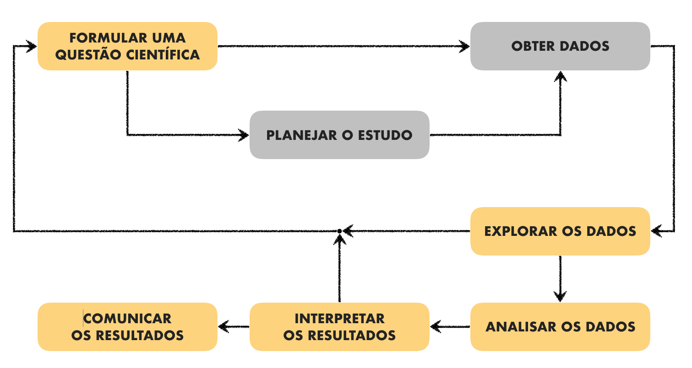
<p class="caption">(\#fig:ch1-analise-dados)O processo de análise de dados.</p>
</div>


O processo inicia com a definição do problema (ou da pergunta científica que se deseja responder). Com vistas a fornecer respostas para a pergunta formulada ou o objetivo do estudo é necessário desenvolver um plano para obtenção dos dados, quer por meio de um estudo observacional ou de um experimento. Tendo os dados disponíveis, é necessário prepará-los para a análise; e esta etapa normalmente envolve algum tipo de resumo e exploração dos dados. Em seguida os dados precisam então passar por um processo de modelagem e análise, dentro do contexto dos objetivos da investigação a fim de que seja possível obter uma interpretação para os resultados obtidos da análise e, assim, comunicá-los à audiência de interesse.

De fato, a menos que o problema esteja claramente definido e que os dados tenham sido coletados da maneira adequada, a interpretação dos resultados da análise realizada pode acabar sendo comprometida por ser baseada em dados que não têm relação com o problema, ou que porventura sejam incompletos ou contenham informações incorretas. Com isso, informações enganosas podem levar a ações equivocadas por parte do tomador de decisão. Para cada uma dessas atividades é de suma importância que o método científico seja aplicado, ou seja, gera-se uma expectativa (constrói-se uma hipótese), submete-se essa expectativa a uma prova (confronta-se evidências e expectativas) e chega-se a uma conclusão (é necessário rever expectativas ou obter mais evidências, ou modificar os métodos de se obter as evidências). O ciclo do método científico é repetido até que expectativas e evidências estejam de acordo.


Por exemplo, na etapa da formulação da pergunta científica, devemos avaliar se a pergunta científica considerada é relevante para a audiência de interesse. Essa hipótese precisa ser colocada à prova através de observação ou experimentação (neste caso, deve-se consultar a literatura ou especialistas a fim de avaliar a relevância da pergunta). Caso se chegue a conclusão de que a pergunta é irrelevante, pode ser necessário revisar a pergunta científica.

Na etapa de exploração dos dados, devemos nos questionar se os dados são apropriados para responder à pergunta de interesse. Para isso, realiza-se análise exploratória dos dados; a partir daí, pode-se chegar à conclusão de que é necessário rever a pergunta científica, ou coletar mais dados.

A análise dos dados geralmente envolve a construção de modelos estatísticos formais. Neste caso é preciso questionar se o modelo inicial é satisfatório. Essa hipótese é desafiada ajustando-se outros modelos, ou através de análise de sensibilidade. Caso a hipótese de adequação do modelo seja derrotada, o modelo inicial deve ser revisto e, assim por diante.

A primeira etapa do processo é a exploração dos dados. Vejamos então alguns métodos para a exploração, resumo e descrição de dados.

## Métodos para Exploração, Resumo e Descrição de Dados

Vamos assumir, então, que temos em mãos um conjunto de dados de interesse, e que desejamos extrair informação a partir deles.  

Consideraremos apenas de dados *estruturados*, que são aqueles podem ser organizados em uma tabela. No entanto, tentar obter informação a partir de dados tabulados nem sempre é uma tarefa simples, quando por exemplo, o conjunto de dados é muito grande. 

Antes de mais nada, precisamos fazer a distinção entre parâmetros e estatísticas.

**Parâmetros**  são quantidades relativas a uma população, que normalmente são desconhecidas, pois é comum não observarmos a totalidade dos elementos que compõe a população.

**Estatísticas**, por sua vez, são quantidades calculadas a partir de uma amostra. Portanto, não representam de maneira perfeita a população.

Se o conjunto de dados representa uma população, ferramentas exploratórias podem ser muito úteis para caracterizar essa população. Mas, como frequentemente, os dados constituem uma amostra, tais ferramentas exploratórias também podem ser utilizadas para auxiliar o processo de inferência, através da formulação de hipóteses (e, note, apenas para esse propósito).


### Análise Exploratória de Dados ("Exploratory Data Analysis", EDA) {-}

O objetivo de realizar análise exploratória de dados é o de ganhar uma melhor compreensão sobre os dados que se têm disponíveis.

Análise Exploratória de Dados envolve examinar: 

(1) a estrutura e componentes do conjunto de dados (isto é, observamos que variáveis temos disponíveis, quantas observações há na massa de dados, como estão formatados e outras características da massa de dados); 

(2) como se caracteriza a variabilidade (ou distribuição) das variáveis observadas; e 

(3) se há indícios de associações ou relações entre diferentes variáveis.

Esta análise preliminar deve ser realizada com 3 propósitos fundamentais:  

(1) determinar se existem problemas com os dados (e aqui é necessário avaliar se as medidas estão de acordo com o que deveriam? se as ordens de magnitude são compatíveis com o esperado, se a gama de valores observados é adequada? se há dados faltantes? se há erros de registro evidentes?). 

(2) EDA também serve para determinar se a pergunta de interesse pode ser respondida com os dados disponíveis (isto é, os dados são adequados, são suficientes para responder à pergunta original? podem ser utilizados para responder a outras questões? é necessário obter mais dados ou outros dados? outras perguntas são mais interessantes?) e, finalmente 

(3) Obter respostas preliminares à pergunta científica.

Note que EDA não deve ser utilizada para realizar inferência (generalizações) ou previsões, ou seja, não serve para chegar a conclusões científicas definitivas.

#### Resumos Exploratórios {-}

Podemos construir resumos exploratórios numéricos ou gráficos. O principal objetivo de obter resumos exploratórios é o de melhorar a compreensão dos dados que se tem disponíveis para análise, a fim de priorizar as análises a serem realizadas em sequência. Os procedimentos mais adequados dependem da natureza das variáveis analisada, isto é, se se tratam de variáveis categóricas ou numéricas.

Resumos numéricos correspondem a estatísticas, ou seja, são valores calculados a partir do conjunto de dados em análise que nos permitem adquirir conhecimento a respeito de características importantes dos dados.

Ao descrever variáveis qualitativas, são definidas categorias ou classes de forma que cada observação pertence a apenas uma classe. Sendo assim, este tipo de variável pode ser explorado numericamente através de tabelas de frequência, que registram o número de observações (ou a proporção de observações) em cada categoria diferente.


Resumos gráficos permitem visualizar os dados e ganhar noções sobre sua natureza de maneira muito intuitiva. 

Veremos a seguir diversas ferramentas estatísticas básicas utilizadas para explorar um conjunto de dados, utilizando para isso o ambiente computacional R/RStudio.


**Medidas de Localização (Centro da Distribuição)**

a. Média (aritmética)  

A média aritmética ou, simplesmente, média, é uma maneira muito comum de representar o centro da distribuição dos dados. Ela representa o centro de massa ou ponto de equilíbrio dos dados, mas é uma medida muito sensível a assimetrias na distribuição, ou à presença de pontos extremos que exercem influência no valor da soma, de forma que sua interpretação pode acabar sendo enganosa.

\begin{align*}
  \bar{X} = \frac{1}{n}\sum_{i=1}^{n}X_i
\end{align*}

b. Mediana  

Se os dados são ordenados em ordem crescente, a mediana é o valor que divide os valores observados em duas metades, ou seja, 50% das observações apresentam valor inferior à mediana e 50% das observações apresentam valor superior à mediana. Essa é uma medida de centro resistente a assimetrias e pontos extremos, pois cada observação apresenta o mesmo peso na determinação da mediana. Por este motivo, esta é uma estatística chamada robusta.

c. Moda  

A moda é uma medida bem menos utilizada que as outras duas, exceto em situações em que a frequência relativa de ocorrências é importante, e ela representa o pico da distribuição, ou seja, o valor mais frequentemente observado no conjunto de dados.

Em suma, a medida de localização adequada para um certo conjunto de dados depende exatamente do tipo de informação descritiva que se deseja obter.


<!--IMG-->
<div class="figure">
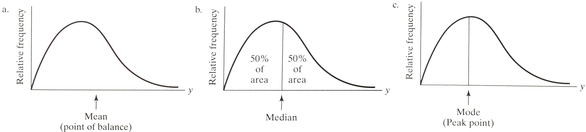
<p class="caption">(\#fig:ch1-medidas-localizacao)Medidas de centro ou localização.</p>
</div>


**Medidas de Dispersão (Variabilidade)**

Além de descrever o centro da distribuição, é importante compreender como os dados se espalham ou variam em torno desse centro. Para isso podemos utilizar as medidas de dispersão variância, desvio-padrão e amplitude.

a. Variância  

A variância corresponde à distância média quadrática das observação à média, ou seja, é a soma das distâncias (ou desvios) quadráticas de cada observação à média, dividida por n-1, não por n. A razão disso ficará mais clara no futuro.

\begin{align*}
  S^2 = \frac{1}{n-1}\sum_{i=1}^n (X_i - \bar{X})^2
\end{align*}

b. Desvio-padrão  

O desvio-padrão é dado pela raiz quadrada da variância e representa quão próximo em média os dados estão do centro da distribuição.

\begin{align*}
  S = \sqrt{S^2} = \sqrt{\frac{1}{n-1}\sum_{i=1}^n (X_i - \bar{X})^2}
\end{align*}

c. Amplitude  

A amplitude é a diferença entre o máximo e o mínimo valor observado para os dados. Esta é uma medida de dispersão também robusta, pois diferentes conjuntos de dados podem apresentar mesma amplitude e diferentes comportamentos para a variabilidade. Em geral, a amplitude é útil como medida de dispersão no caso de amostras pequenas, em que se tem poucas observações.

**Medidas de Posição Relativa**

Com os dados ordenados em ordem crescente, é possível descrever a posição de uma observação com relação às demais observações no conjunto de dados.

a. Quantis/percentis/quartis  

Os quartis são as posições que dividem a massa de dados em quartos. Sendo assim, 1/4 (ou 25%) das observações se encontram abaixo do 1o quartil (também chamado quartil inferior ou Q1) e 1/4 (ou 25%) das observações se encontram acima do 3o. quartil (o quartil superior, também chamado de Qo). A diferença entre o 3o e o 1o quartis é chamada amplitude inter-quartis. O primeiro quartil também é chamado de percentil 25% ou quantil 0,25. Note que a mediana corresponde ao 2o quartil ou ao percentil 50% ou ao quantil 0,5.

<!--IMG-->
<div class="figure">
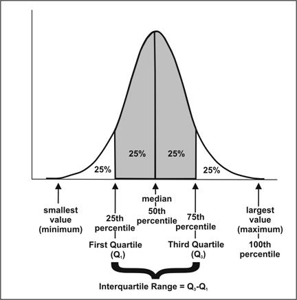
<p class="caption">(\#fig:ch1-medidas-posicao-relativa)Quantis, percentis, quartis.</p>
</div>

b. Escores-z  

Já os escores-z medem a posição das observações com relação a média, em números de desvios-padrão. Valores negativos para o escore-z indicam que a observação correspondente encontra-se abaixo da média. Valores positivos, indicam que a observação se encontra acima da média. Quanto maior o valor do escore-z em módulo, mais distante da média se encontra a observação.

\begin{align*}
  z_i = \frac{X_i - \bar{X}}{S}
\end{align*}

Segundo a Regra Empírica, a maior parte das observações em um conjunto de dados deve se encontrar a uma distância de dois desvios-padrão da média (isto é, os escores-z serão menores que 2, em valor absoluto) e quase a totalidade das observações deve estar a uma distância de 3 desvios-padrão da média (ou seja, terão escores-z inferiores a 3, em valor absoluto).


**Observações Extremas (*Outliers*)**

Por vezes, observações inconsistentes estão presentes da massa de dados. Essa inconsistência pode se manifestar através de um valor de observação atipicamente grande ou pequeno, relativamente às demais observações no conjunto de dados. Tais observações são chamadas *outliers*, pontos extremos ou observações extremas.

*Outliers* normalmente podem ter uma das possíveis causas:

(1) A observação pode ter sido incorretamente medida, registrada ou lida pelo computador;  
(2) A observação pode pertencer a uma população distinta; ou  
(3) A observação é correta, mas representa um evento raro.


O método mais usual para detecção de *outliers* é o cálculo do escore-z. Desta maneira, *outliers* apresentam valores absolutos de escore-z maiores que 3. Outro procedimento é baseado na ferramenta gráfica chamada *boxplot*, que veremos com mais detalhes em seguida.    

::: {.example #unnamed-chunk-1 name="Prevalência de Diabetes Mellitus entre as mulheres indígenas Pima"}
:::


Fonte: Smith, JW; Everhat, JE; Dickson, WC; Knowler, WC; Johhannes, RS (1988). Using the ADAP learning algorithm to forecast the onset of diabetes mellitus. In: *Proceedings of the Symposium on Computer Applications and Medical Care (pp. 261-265).*

Vamos utilizar a massa de dados `pima` para ilustrar o processo de análise exploratória de dados. Diversas restrições foram aplicadas na seleção das observações a partir de um conjunto contendo um número maior de observações. Todas as pacientes têm idade superior a 21 anos e são de origem Pima.


<!--IMG-->
<div class="figure">

<p class="caption">(\#fig:ch1-pima-uci)Conjunto de dados `pima`, disponível no repositório de dados da UCI.</p>
</div>


Este conjunto de dados foi obtido a partir do repositório de dados da Universidade da Californa Irvine, que contém uma grande quandidade de conjuntos de dados disponíveis para diversos tipos de análise. O objetivo inicial desse estudo era construir um algoritmo capaz de prever se a paciente mostra sinais de diabetes mellitus, de acordo com os critérios estabelecidos pela OMS, isto é se o teste oral de tolerância a glicose, ou TTOG, apresenta resultado igual ou superior a 200mg/dl. Os dados disponíveis foram pré-selecionados a partir de uma massa de dados que continha um número maior de observações.

Temos aqui algumas informações preliminares: Há um total de 768 observações registradas para 8 variáveis de interesse. E precisamos estar preparados para lidar com dados faltantes, conforme nos informa o resumo dos dados.


**Variáveis**

`times_pregnant`: número de gravidezes  
`glucose_tot`: concentração de glicose no plasma a 2h no TTOG  
`diastolic_pb`: pressão sanguínea diastólica (mmHg)  
`triceps`: espessura de dobra cutânea de tríceps (mm)  
`insulin`: dosagem de insulina 2h em soro (µU/ml)  
`mass_index`: índice de massa corporal (kg/m^2)  
`pedigree`: função de pedigree para diabetes   
`age`: idade (anos)  
`class`: diabetes (0 ou 1) 

As variáveis são estas. A princípio podemos identificar algumas variáveis numéricas e uma variável categórica (que corresponde à classificação da paciente em diabética ou não). 

#### Análise Exploratória da Base da Dados `pima` {-}

O primeiro passo consiste em limpar a área de trabalho, utilizando o comando `rm(list = ls())`, para então ler os dados que se encontram no arquivo `pima-indians-diabetes.data`. Nota que os dados estão dentro de uma pasta chamada `pima-indians-diabetes`, que por sua vez, encontra-se dentro de uma pasta chamada `data`, que é o local onde eu armazeno minhas massas de dados.
Eu leio esses dados e os armazeno em um objeto do tipo tabela, chamada `pima`. Eu sei, de antemão, que não há cabeçalho no arquivo de entrada, ou seja, a primeira linha do arquivo não corresponde aos nomes das variáveis; as colunas não têm nomes - por isso, faço `col_names = FALSE`.


```r
# Limpa área de trabalho
rm(list=ls())

library(tidyverse)

# Carrega os dados e armazena em um objeto do tipo tabela
pima <- read_csv("data/pima-indians-diabetes/pima-indians-diabetes.data", 
                 col_names = FALSE)
```

Veja que podemos obter algumas informações do objeto `pima`, simplesmente digitando `pima`. Verificamos que há um total de 768 linhas e 9 colunas. Cada coluna da tabela corresponde a uma variável (atributo) e as linhas correspondem a diferentes observações, ou seja, toda informação coletada para cada um dos indivíduos avaliados. As variáveis não tem nomes que façam sentido e todas foram codificadas como variáveis numéricas contínuas, doubles, ou números reais `<dbl>`. 


```r
pima
```

```
## # A tibble: 768 × 9
##       X1    X2    X3    X4    X5    X6    X7    X8    X9
##    <dbl> <dbl> <dbl> <dbl> <dbl> <dbl> <dbl> <dbl> <dbl>
##  1     6   148    72    35     0  33.6 0.627    50     1
##  2     1    85    66    29     0  26.6 0.351    31     0
##  3     8   183    64     0     0  23.3 0.672    32     1
##  4     1    89    66    23    94  28.1 0.167    21     0
##  5     0   137    40    35   168  43.1 2.29     33     1
##  6     5   116    74     0     0  25.6 0.201    30     0
##  7     3    78    50    32    88  31   0.248    26     1
##  8    10   115     0     0     0  35.3 0.134    29     0
##  9     2   197    70    45   543  30.5 0.158    53     1
## 10     8   125    96     0     0   0   0.232    54     1
## # … with 758 more rows
```

Vamos dar nomes às variáveis. Para isso, utilizamos o comando `colnames` no objeto `pima` e atribuímos a esse objeto o vetor contendo os nomes das variáveis.


```r
# Atribui nomes às colunas da tabela
colnames(pima) <- c("times_pregnant","glucose_tot", "diastolic_pb",
                    "triceps", "insulin", "mass_index", "pedigree",
                    "age", "class")
pima
```

```
## # A tibble: 768 × 9
##    times_pregnant glucose_tot diastolic_pb triceps insulin mass_index pedigree
##             <dbl>       <dbl>        <dbl>   <dbl>   <dbl>      <dbl>    <dbl>
##  1              6         148           72      35       0       33.6    0.627
##  2              1          85           66      29       0       26.6    0.351
##  3              8         183           64       0       0       23.3    0.672
##  4              1          89           66      23      94       28.1    0.167
##  5              0         137           40      35     168       43.1    2.29 
##  6              5         116           74       0       0       25.6    0.201
##  7              3          78           50      32      88       31      0.248
##  8             10         115            0       0       0       35.3    0.134
##  9              2         197           70      45     543       30.5    0.158
## 10              8         125           96       0       0        0      0.232
## # … with 758 more rows, and 2 more variables: age <dbl>, class <dbl>
```

Também percebemos que há valores medidos para as variáveis `diastolic_pb`, `insulin`, `triceps` e `mass_index` iguais a zero. Será que correspondem a erro de codificação? Valores não observados? Há mais um problema com os dados: a variável `class` é categórica e precisa ser codificada adequadamente como fator; precisamos corrigir isto, bem como os outros problemas com a massa de dados.


```r
# recodifica `class` como sendo fator
pima$class <- as.factor(pima$class) 

# muda os rótulos dos níveis do fator
levels(pima$class) <- c("neg", "pos")

# Verifica recodificação  
pima
```

```
## # A tibble: 768 × 9
##    times_pregnant glucose_tot diastolic_pb triceps insulin mass_index pedigree
##             <dbl>       <dbl>        <dbl>   <dbl>   <dbl>      <dbl>    <dbl>
##  1              6         148           72      35       0       33.6    0.627
##  2              1          85           66      29       0       26.6    0.351
##  3              8         183           64       0       0       23.3    0.672
##  4              1          89           66      23      94       28.1    0.167
##  5              0         137           40      35     168       43.1    2.29 
##  6              5         116           74       0       0       25.6    0.201
##  7              3          78           50      32      88       31      0.248
##  8             10         115            0       0       0       35.3    0.134
##  9              2         197           70      45     543       30.5    0.158
## 10              8         125           96       0       0        0      0.232
## # … with 758 more rows, and 2 more variables: age <dbl>, class <fct>
```

#### Resumos numéricos {-}

Um resumo numérico simples pode ser obtido utilizando a função `summary`:


```r
summary(pima)
```

```
##  times_pregnant    glucose_tot     diastolic_pb       triceps     
##  Min.   : 0.000   Min.   :  0.0   Min.   :  0.00   Min.   : 0.00  
##  1st Qu.: 1.000   1st Qu.: 99.0   1st Qu.: 62.00   1st Qu.: 0.00  
##  Median : 3.000   Median :117.0   Median : 72.00   Median :23.00  
##  Mean   : 3.845   Mean   :120.9   Mean   : 69.11   Mean   :20.54  
##  3rd Qu.: 6.000   3rd Qu.:140.2   3rd Qu.: 80.00   3rd Qu.:32.00  
##  Max.   :17.000   Max.   :199.0   Max.   :122.00   Max.   :99.00  
##     insulin        mass_index       pedigree           age        class    
##  Min.   :  0.0   Min.   : 0.00   Min.   :0.0780   Min.   :21.00   neg:500  
##  1st Qu.:  0.0   1st Qu.:27.30   1st Qu.:0.2437   1st Qu.:24.00   pos:268  
##  Median : 30.5   Median :32.00   Median :0.3725   Median :29.00            
##  Mean   : 79.8   Mean   :31.99   Mean   :0.4719   Mean   :33.24            
##  3rd Qu.:127.2   3rd Qu.:36.60   3rd Qu.:0.6262   3rd Qu.:41.00            
##  Max.   :846.0   Max.   :67.10   Max.   :2.4200   Max.   :81.00
```

Para a variável categórica, a função `summary` retorna o número de observações em cada classe.

Para as variáveis quantitativas, a função `summary` fornece o chamado resumo de 5-números (mais a média) . Temos valores mínimo, máximo, 1o. e 3o. quartis, mediana e média. Para os dados analisados, observamos 5 variáveis com valor mínimo igual a zero: `times_pregnant`, `glucose_tot`, `diastolic_pb`, `triceps`, `insulin`, `mass_index`.


Num exercício de validação externa, podemos concluir que possivelmente há algo de errado com as variáveis `glucose_tot`, `diastolic_pb`, `triceps`, `insulin`, `mass_index`, pois não seria natural observar valores iguais a zero para essas quantidades. Provavalmente há erro na codificação de valores faltantes. Antes de corrigir este problema, vejamos como utilizar ferramentas gráficas para visualizar dados qualitativos.


**Tabela de Frequência e Barplot**  

Podemos também contar as ocorrências de todos os valores que a variável assume e incluir uma representação gráfica.

Essa visualização é especialmente útil quando temos uma variável categórica com mais de duas classes.


```r
# Conta ocorrências em cada uma das classes
pima %>%
  select(class) %>% 
  table %>%
  print %>%
  barplot
```


```
## class
## neg pos 
## 500 268
```

<div class="figure">

<p class="caption">(\#fig:bar-plot-pima)Número de ocorrências em cada classe.</p>
</div>

**Não utilize gráficos de pizza para visualizar dados!** Gráficos de pizza não são muito úteis para gerar visualizações de dados, pois é mais difícil comparar os tamanhos dos grupos em uma escala não linear do que utilizando um barplot, especialmente quando as categorias têm proporções muito parecidas.

Vamos analisar agora as variáveis quantitativas. Iniciemos com a  investigação da variável `diastolic_pb`:


```r
# Conta ocorrências de zeros
pima %>% summarise(count = sum(diastolic_pb == 0))
```

```
## # A tibble: 1 × 1
##   count
##   <int>
## 1    35
```

Temos um total de 35 observações faltantes para a variável `diastolic_pb`. Podemos, ainda, identificar quantos valores únicos há para essa variável (neste caso, 47).


```r
# Conta quantidade de valores distintos
pima %>% summarise(n = n_distinct(diastolic_pb))
```

```
## # A tibble: 1 × 1
##       n
##   <int>
## 1    47
```

É possível realizar procedimento análogo para as demais variáveis.

Vamos recodificar os zeros para representar valores não observados, onde couber e, em seguida, podemos verificar novamente o resumo dos dados.


```r
# Recodifica dados faltantes como 'NA' (not available)
pima <- pima %>%
  mutate(diastolic_pb = replace(diastolic_pb, diastolic_pb == 0, NA)) %>%
  mutate(glucose_tot = replace(glucose_tot, glucose_tot == 0, NA)) %>%
  mutate(triceps = replace(triceps, triceps == 0, NA)) %>%
  mutate(insulin = replace(insulin, insulin == 0, NA)) %>%
  mutate(mass_index = replace(mass_index, mass_index == 0, NA))
summary(pima) # resumo
```

```
##  times_pregnant    glucose_tot     diastolic_pb       triceps     
##  Min.   : 0.000   Min.   : 44.0   Min.   : 24.00   Min.   : 7.00  
##  1st Qu.: 1.000   1st Qu.: 99.0   1st Qu.: 64.00   1st Qu.:22.00  
##  Median : 3.000   Median :117.0   Median : 72.00   Median :29.00  
##  Mean   : 3.845   Mean   :121.7   Mean   : 72.41   Mean   :29.15  
##  3rd Qu.: 6.000   3rd Qu.:141.0   3rd Qu.: 80.00   3rd Qu.:36.00  
##  Max.   :17.000   Max.   :199.0   Max.   :122.00   Max.   :99.00  
##                   NA's   :5       NA's   :35       NA's   :227    
##     insulin         mass_index       pedigree           age        class    
##  Min.   : 14.00   Min.   :18.20   Min.   :0.0780   Min.   :21.00   neg:500  
##  1st Qu.: 76.25   1st Qu.:27.50   1st Qu.:0.2437   1st Qu.:24.00   pos:268  
##  Median :125.00   Median :32.30   Median :0.3725   Median :29.00            
##  Mean   :155.55   Mean   :32.46   Mean   :0.4719   Mean   :33.24            
##  3rd Qu.:190.00   3rd Qu.:36.60   3rd Qu.:0.6262   3rd Qu.:41.00            
##  Max.   :846.00   Max.   :67.10   Max.   :2.4200   Max.   :81.00            
##  NA's   :374      NA's   :11
```

Aparentemente, o problema foi resolvido. Podemos agora construir alguns resumos gráficos.


#### Resumos Gráficos {-}

**Boxplots**  

O *boxplot* é uma ferramenta gráfica, que fornece um resumo da distribuição dos valores da variável sendo analisada. O *boxplot* nos dá 5 estatísticas e também mostra possíveis valores extremos (os chamados *outliers*). A linha no centro da caixa corresponde à mediana.  A caixa é delimitada pelos quartis inferior e superior.  Portanto, 50% das observações se encontram entre os valores que determinam as extremidades da caixa. O comprimento da caixa é chamado distância ou amplitude inter-quartis (ou IQR) e corresponde à diferença entre os quartis superior e inferior.

As linhas horizontais que se afastam da caixa são os *whiskers*, cujo comprimento máximo vale 1,5 * IQR em cada direção, de forma que a distância máxima entre as extremidades dos *whiskers* vale 4 * IQR (comprimento máximo do *whisker* inferior vale 1,5 IQR, a caixa tem largura IQR e o comprimento máximo do *whisker* superior vale 1,5 IQR). Se a observação mais extrema em qualquer das direções estiver a uma distância da caixa menor que 1,5 * IQR, então o alcance do respectivo *whisker* vai até essa observação. Qualquer valor além dos *whiskers* é marcado como um ponto extremo, ou outlier.

<!--IMG-->
<div class="figure">

<p class="caption">(\#fig:ch1-elementos-boxplot)Elementos de um boxplot.</p>
</div>


Vamos construir boxplots para a variável `insulin`, utilizando a função `boxplot.` 


```r
ggplot(pima, aes(x = insulin)) +
  geom_boxplot() +
  labs(x = "insulin")
```


No gráfico, percebemos alguns valores de insulina bastante elevados (e pode até valer a pena uma análise mais cuidadosa em um momento posterior). Para o exemplo, já tínhamos calculado anteriormente na tabela de resumos numéricos o valor do 1o quartil, que vale Q1 = 76.25. Esse valor está representado pela extremidade inferior da caixa (localizada à esquerda). A mediana vale Q2 = 125 e está representada graficamente pela linha no interior da caixa. O 3o quartil, cujo valor é Q3 = 190 corresponde à extremidade superior da caixa (à direita). A amplitude interquartis é dada pela diferença entre o 3o e o 1o quartil e vale IQR =  Q3(190) - Q1(76,25) = 113,75. Esse é o comprimento da caixa. Como não há pontos extremos à esquerda, o whisker inferior corresponde ao menor valor observado para os dados, o valor mínimo, igual 14. No caso do whisker superior, há alguns possíveis outliers à direita, portanto, o whisker superior  vale 1,5*IQR igual a  360,625. O valor máximo observado para esses dados é 846, e está representado como o ponto mais extremo à direita.

É importante examinar os dados com relação à existência de possíveis outliers pois eles podem indicar:

(1) forte assimetria na distribuição das observações;    
(2) erros (de medida, de registro ou leitura);   
(3) ou mesmo, podem revelar propriedades interessantes e inesperadas da massa de dados (talvez a observação pertença a uma outra população).  


**Histogramas**

Uma outra maneira de representar a distribuição dos valores observados para  uma variável é através de um histograma, que pode ser gerado utilizando a função `hist`. O histograma é útil para descrever a forma da distribuição.

Por exemplo, vemos que a distribuição de insulina é assimétrica; a maioria das mulheres observadas apresenta valores de insulina abaixo de 250, mas há algumas poucas observações com valores de insulina bastante elevados. A distribuição de insulina apresenta cauda longa à direita. Já a distribuição de glicose apresenta maior simetria.


```r
ggplot(pima, aes(x = insulin)) +
  geom_histogram() +
  labs(x = "insulin")
```


```r
ggplot(pima, aes(x = glucose_tot)) +
  geom_histogram() +
  labs(x = "glucose_tot")
```


Podemos adicionar marcações nos gráficos. Por exemplo, vamos adicionar uma reta vertical marcando o valor da média dos valores observados para cada uma das variáveis analisadas. 


Aqui, a média está sinalizada pelas retas verticais vermelhas:


```r
xbar <- mean(pima$insulin, na.rm = TRUE)
ggplot(pima, aes(x = insulin)) +
  geom_histogram() +
  labs(x = "insulin") +
  geom_vline(aes(xintercept = xbar), col = 'red')                            #<<
```


```r
xbar <- mean(pima$glucose_tot, na.rm = TRUE)
ggplot(pima, aes(x = glucose_tot)) +
  geom_histogram() +
  labs(x = "glucose_tot") +
  geom_vline(aes(xintercept = xbar), col = 'red')                            #<<
```


**Histogramas e Gráficos de Densidade**

Que tal obter um pouco mais de detalhes com a função `rug()`, que nos mostra cada uma das observações? Aqui, além de adicionarmos as observações na margem inferior, também ajustamos a largura das bandas. Note que o histograma é muito sensível à largura (ou discretização) das bandas, de forma que se não for adequadamente ajustado, pode trazer informações enganosas. No caso de glicose, o histograma resultante perdeu muito de sua informação. Tente gerar outros histogramas, variando o valor de `binwidth`. 


Também temos sobreposição a cada histograma da respectiva curva de densidade, que corresponde a uma suavização do histograma. Para isso, também foi modificado o eixo vertical que, em vez de representar o número de observações em cada faixa, agora apresenta a frequencia relativa (isto é, o no. de observações na faixa, didivido pelo no. total de observações).


```r
xbar <- mean(pima$insulin, na.rm = TRUE)
ggplot(pima, aes(x = insulin)) +
  geom_histogram(aes(y = ..density..),                                       #<<
                 binwidth = 45) +                                            #<<
  labs(x = "insulin") +
  geom_vline(aes(xintercept = xbar), col = 'red') + 
  geom_rug(sides = 'b', col = 'blue') +                                      #<<
  geom_density(alpha = 0.1, fill = 'blue')                                   #<<
```


```r
xbar <- mean(pima$glucose_tot, na.rm = TRUE)
ggplot(pima, aes(x = glucose_tot)) +
  geom_histogram(aes(y = ..density..),                                       #<<
                 binwidth = 45) +                                            #<<
  labs(x = "glucose_tot") +
  geom_vline(aes(xintercept = xbar), col = 'red') + 
  geom_rug(sides = 'b', col = 'blue') +                                      #<<
  geom_density(alpha = 0.1, fill = 'blue')                                   #<<
```


**Resumos Multidimensionais**

Podemos também utilizar boxplots para comparar duas distribuições. Por exemplo, podemos querer saber como se comparam os valores de insulina para mulheres diabéticas e não-diabéticas.


```r
ggplot(pima, aes(x = insulin, y = class, fill = class)) +
  geom_boxplot() +
  labs(x = "insulin", x = "class")
```


Podemos perceber que a mediana observada para os valores de insulina para mulheres diabéticas é um pouco maior que aquela para mulheres não-diabéticas. Embora não seja possível afirmar que existe uma diferença estatisticamente significativa entre os dois grupos, esta é uma hipótese interessante, que pode ser testada formalmente posteriormente. Vamos adicionar uma reta no valor de glicose igual a 200 mg/dl (valor de referência no TTOG):


```r
ggplot(pima, aes(x = insulin, y = class, fill = class)) +
  geom_boxplot() +
  labs(x = "insulin", x = "class") +
  geom_vline(aes(xintercept = 200), lwd = 1, lty = 'dashed', col = 1)
```


É possível modificar a cor, espessura e tipo dessa reta. Fica como exercício.

Pode ser útil construir múltiplos histogramas ou curvas de densidade, para diferentes categorias. Podemos sobrepor as duas distribuições, para tornar a comparação imediata.


```r
ggplot(pima, aes(insulin, fill = class)) + 
  geom_histogram(aes(y = ..density..), binwidth = 40) 
```


```r
ggplot(pima,  aes(insulin, fill = class)) + 
  geom_density(alpha = 0.2) 
```


**Relações entre Variáveis**

Para variáveis contínuas, é interessante observar gráficos de dispersão, a fim de avaliar relações entre pares de variáveis:


```r
ggplot(pima, aes(x = insulin, y = glucose_tot)) + 
  geom_point() +
  labs(x = "insulin", x = "glucose_tot")
```


Podemos adicionar mais informação ao gráfico, com retas:


```r
ggplot(pima, aes(x = insulin, y = glucose_tot)) +  
  geom_point() +
  geom_vline(aes(xintercept = 200), col = 1) +                               #<<
  labs(x = "insulin", x = "glucose_tot")
```


Podemos adicionar uma terceira dimensão, utilizando cores:


```r
ggplot(pima, aes(x = insulin, y = glucose_tot, 
                 color = class)) +                                           #<<
  geom_point() +
  labs(x = "insulin", x = "glucose_tot")
```


Podemos adicionar uma quarta dimensão com diferentes tamanhos para os pontos: 


```r
ggplot(pima, aes(x = insulin, y = glucose_tot,                               #<<
                 color = class, size = age)) +                               #<<
  geom_point() +
  labs(x = "insulin", x = "glucose_tot")
```


Assim, chegamos ao fim de nossa primeira análise exploratória de dados.   
E este é apenas o começo...

<!--chapter:end:01-ch1.Rmd-->

# Introdução à Teoria de Probabilidades


## Breve Histórico


A Teoria de Probabilidades é a disciplina matemática que trata de fenômenos aleatórios, através da construção dos chamados modelos probabilísticos.

Atribui-se a Aristóteles a declaração de que, para a melhor compreensão de algo, é necessário observar suas origens e seu desenvolvimento. Sendo assim, para que tenhamos uma melhor apreciação da Teoria Matemática de Probabilidades, é interessante observar suas origens.


### Chance e Incerteza {-}


Chance e incerteza são conceitos tão antigos quanto a civilização; os seres humanos sempre estiveram sujeitos e, por este motivo, sempre se esforçaram para compreender e reduzir as incertezas presentes em seu ambiente, a fim de garantir sua sobrevivência.

As primeiras civilizações agrícolas, por exemplo, eram profundamente sensíveis a flutuações climáticas. Uma enchente poderia destruir toda a reserva de grãos necessária para alimentar um povoado; uma seca poderia ser igualmente destrutiva, tornando os estoques de água insuficientes para atender de maneira satisfatória as necessidades locais. Doenças, conflitos e escassez de recursos necessários tornavam a existência humana extremamente incerta e frágil. E, assim, em resposta a essas vulnerabilidades, com o tempo, os seres humanos passaram a desenvolver meios de prever mudanças em seu ambiente a fim de melhor se proteger.


### Jogos de Azar {-}


Também, desde tempos remotos, os seres humanos conscientemente e intencionalmente produziram aleatoriedade utilizando dados, ossos de animais, conchas ou outros objetos com diversas finalidades, como para proporcionar entretenimento, para prever o futuro ou como uma maneira de se comunicar com o sobrenatural.

As civilizações antigas da Grécia, Roma e Egito, por exemplo, utilizavam astrágalos (pequenos ossos do calcanhar de certos animais que serviam como dados assimétricos de 4 lados) para realizar divinações ou previsões; e era popular entre os antigos egípcios (e me refiro a um período por volta de 2000 anos AC) um jogo de azar chamado "cães e chacais"; 

O dado cúbico foi desenvolvido por volta de 1500 AC. Os jogos de azar envolvendo dados eram uma obsessão tão grande entre os antigos romanos, que se tornaram ilegais, exceto em ocasiões especiais, como durante grandes eventos como o festival Saturnalia, torneios de gladiadores ou corridas.

O fato é que, através da prática de jogos de azar, os seres humanos desenvolveram intuição a respeito da aleatoriedade e das probabilidades, associadas, neste caso, à frequência de observação de certos eventos imprevisíveis. No entanto, apesar desse envolvimento com processos aleatórios controlados, as pessoas ainda não compreendiam a aleatoriedade em termos matemáticos.


### Origem da Teoria Matemática de Probabilidades {-}


O desenvolvimento de uma teoria matemática de probabilidades é um evento muito mais recente na história humana. Apenas no século XVI é que surgiram os primeiros estudos matemáticos a respeito de eventos envolvendo incertezas ou o acaso. Luca Paccioli (1445-1514), Nicolò Tartaglia (1499-1557), Girolamo Cardano (1501-1576) e Galileu Galilei (1564-1642) foram os primeiros matemáticos proeminentes que calcularam probabilidades associadas a diferentes jogos de azar; eles também tentaram construir bases matemáticas para o cálculo de probabilidades.

Ainda assim, a primeira contribuição significativa para a construção de fundamentos matemáticos para a teoria de probabilidades se deu em 1654, através de uma troca de correspondência entre os matemáticos franceses Blaise Pascal (1623-1662) e Pierre de Fermat (1601-1665) que, na necessidade de determinar a probabilidade de certos resultados obtidos em jogos de azar, acabaram construindo métodos para a enumeração combinatória das possibilidades.

Tal discussão foi motivada por um desafio proposto por Antoine Gombaud, autodenominado Chevalier de Méré, ao seu amigo Blaise Pascal. De Méré foi um escritor e filósofo conhecido, uma figura importante na corte do rei Luis XIV, além de um aficcionado por jogos de azar.

De Méré apresentou a Pascal dois problemas para os quais não conseguia encontrar a solução correta:  

(1) O problema dos dados e;   
(2) O problema dos pontos.  

No problema dos dados, de Méré desejava determinar o número crítico de lançamentos, isto é, o número de jogadas necessárias para alcançar 50% de chance de obter pelo menos um sucesso em dois jogos de dados. Ele não compreendia "Por que era mais fácil obter pelo menos um ‘6’ em 4 lançamentos de um dado do que pelo menos um ‘duplo 6’ em 24 lançamentos de um par de dados?” Este problema ficou conhecido como "O Paradoxo de de Méré".

Já no problema dos pontos, a questão colocada era como repartir de maneira justa, entre dois jogadores, o prêmio de um torneio que é interrompido antes que chegue ao fim. Diferentes noções de justiça podem ser utilizadas para determinar como o prêmio deve ser dividido; por exemplo, os jogadores podem partilhar igualmente o prêmio; ou, o jogador com maior pontuação pode levar todo o dinheiro...  A solução proposta por Pascal foi absolutamente revolucionária na história da teoria de probabilidades. Ele sugeriu que o prêmio fosse dividido de acordo com a expectativa de vitória de cada jogador, com base em suas pontuações no momento em que o jogo foi interrompido, ou seja, deveria ser calculada considerando a probabilidade de cada um dos jogadores vencer, dado o atual estágio do torneio, em que há ainda um certo número de jogos ou pontos para atingir. 

No futuro, nós falaremos mais sobre esta e também a respeito de outras contribuições de Pascal tanto para a Teoria Matemática de Probabilidades, bem como para a Teoria de Decisão.


### Formalização Matemática {-}


Como veremos mais adiante, há várias maneiras de interpretar o conceito probabilidade e, a partir do século XVII, diversos matemáticos se debruçaram sobre o problema de como formalizá-lo, alcançando maior ou menor sucesso.

Uma das dificuldades no desenvolvimento de uma teoria matemática das probabilidades consistia em obter uma definição de probabilidade precisa o bastante para ser usada em matemática, e abrangente o suficiente para ser aplicável a uma grande variedade de problemas. 

Este objetivo só foi finalmente alcançado com a definição axiomática, proposta por Andrei Kolmogorov e publicada em 1933 no livro "Fundamentos de Teoria de Probabilidades". Neste trabalho, ele declara acreditar que "a Teoria das Probabilidades, como disciplina matemática, poderia e deveria ser desenvolvida exatamente como a Geometria ou a Álgebra, a partir de axiomas", com base nos quais todos os desenvolvimentos subsequentes deveriam ser obtidos.

Contando com uma definição formal e abrangente, a teoria de probabilidades passou a ser aplicada nas mais diversas áreas do conhecimento e atividade humanos, incluindo engenharia, economia, negócios, ciêcias, psicologia e tantas outras, de forma que o conhecimento de Teoria de Probabilidades é algo indispensável nos dias de hoje.


## Definições Iniciais


Um modelo probabilístico consiste em uma descrição matemática de uma situação de incerteza. Isto significa que podemos utilizá-lo para:
  
(1) Investigar e descobrir padrões regulares em eventos aleatórios — eventos que, a princípio, são imprevisíveis; e também para  

(2) Descrever incerteza em termos matemáticos; quer dizer, queremos ser capazes de quantificar as incertezas.  

A fim de descrever a estrutura geral de tais modelos e suas propriedades, precisamos ter claras algumas definições iniciais.

Os modelos probabilísticos são descritos a partir de alguns ingredientes básicos, representados neste diagrama. São eles: um experimento aleatório, associado a um espaço amostral, que por sua vez é composto por uma coleção de eventos, e uma lei de probabilidade definida em todos os eventos.

Examinaremos, a seguir, cada um desses elementos.


<div class="figure">
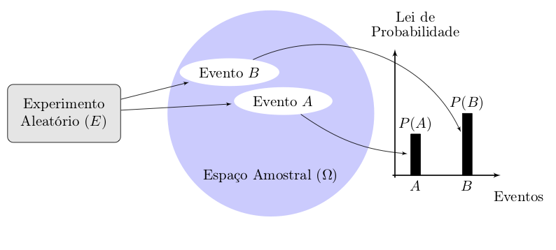
<p class="caption">(\#fig:ch2-probabilidade-modelo)Elementos básicos de um modelo probabilístico.</p>
</div>


### Experimento Aleatório  {-}

  
O primeiro elemento é o chamado experimento aleatório, que vamos representar de maneira genérica pela letra “E”. Um experimento aleatório representa um processo cujo resultado a ser obtido é desconhecido e imprevisível e que pode (pelo menos conceitualmente) ser repetido indefinidamente sob condições idênticas. As condições em que o experimento é realizado não garantem a ocorrência de um certo resultado, ou seja, a ocorrência do resultado é incerta. Vamos considerar que sempre é possível obter um resultado que pertence a um conjunto fixo e conhecido de possibilidades.

Vamos considerar o seguinte experimento aleatório, que consiste em lançar um dado e registrar o resultado obtido. Bem, nós conhecemos os resultados possíveis deste experimento; sabemos que podemos obter qualquer um dos resultados 1 ou 2 ou 3 ou 4 ou 5 ou 6. Porém, antes de o dado ser lançado, e observarmos o número efetivamente obtido, é impossível prever com certeza qual será o resultado do lançamento do dado. Percebemos também que, a princípio, ou pelo menos mentalmente, é possível repetir um experimento como esse indefinidamente, nas mesmas condições. Isto quer dizer que poderíamos, em teoria, lançar um dado uma quantidade interminável de vezes e registrar os resultados obtidos. Note que ao realizar esse experimento apenas uma vez, apenas um desses resultados é observado. Isso nos leva à próxima definição.


### Espaço Amostral e Evento  {-}

  
A coleção de todos os resultados elementares possíveis de um experimento aleatório constituem um conjunto chamado espaço amostral, representado pela letra grega $\Omega$. Qualquer conjunto contendo resultados possíveis do experimento aleatório (isto é, qualquer subconjunto do espaço amostral) constitui um evento, que representaremos pelas letras maiúsculas do alfabeto latino (A, B, C, D etc.).

Esses eventos podem ser simples (quando não podem ser decompostos em eventos mais elementares) ou compostos. De forma geral, um certo evento (A) corresponde a um conjunto de resultados de um experimento aleatório que satisfaz determinadas condições.

- evento impossível  
- evento união  
- envento interseção  
- evento complementar  
- eventos mutuamente exclusivos   
- partição do espaço amostral  


::: {.example #unnamed-chunk-1}
:::
  

Experimento Aleatório:  E = lançar um dado e observar o resultado  
Eventos simples: 1, 2, 3, 4, 5, 6  
Espaço Amostral: $\Omega$  = {1, 2, 3, 4, 5, 6}  

Neste exemplo do lançamento de um dado, o espaço amostral é composto por todos os resultados possíveis, ou seja, é o conjunto que contém os elementos 1, 2, 3, 4, 5 e 6. 

Outros Eventos:  
  
A = resultado par = {2, 4, 6}  
B = resultado ímpar = {1, 3, 5}  
C = resultado > 3 = {4, 5, 6}  
D = resultado igual a 1 = {1}   
G = resultado < 2 e par = { }  

Para esse experimento, podemos estar interessados na situação em que o resultado obtido é um número par. Vamos representar esta situação pelo evento A, que consiste no conjunto contendo os valores 2, 4 e 6. Um outro evento B pode representar a situação em que o resultado é um número ímpar. Então, o evento B corresponde ao conjunto contendo os valores 1, 3 e 5. Podemos definir outros eventos, tais como (1) um evento C, que representa a situação em que o resultado obtido é um número maior que 3 (2) ou um outro evento D, que representa a situação em que o resultado é igual a 1 ou, ainda, (3) um evento G, que representa a situação em que o resultado é menor que 2 e, ao mesmo tempo, par. Note que o evento G é impossível de ser observado e constitui um conjunto vazio, que não contém nenhum elemento.

Descrevemos o espaço amostral em termos da definição matemática de conjunto. Portanto, podemos manipular matematicamente os eventos utilizando álgebra de conjuntos. É desejável, então, neste ponto, fazer uma revisão de álgebra de conjuntos, que nós não abordaremos aqui. Fica como tarefa para casa.

Mesmo para um experimento aleatório trivial, é importante identificar corretamente os eventos simples. Por exemplo, imagine o experimento aleatório que consiste em lançar duas moedas e registrar todos os eventos simples associados a esse experimento. A primeira impressão é de que os eventos possíveis são observar duas caras, observar duas coroas e observar uma cara e uma coroa. No entanto, o último evento pode ser decomposto em dois eventos simples: (Cara e Coroa) e (Coroa e Cara). Portanto, os eventos simples associados a este experimento são: (cara,cara), (coroa, coroa), (cara, coroa) e (coroa, cara).


::: {.example #unnamed-chunk-2}
:::


Experimento Aleatório:  E = lançar duas moedas e observar os resultados


<div class="figure">
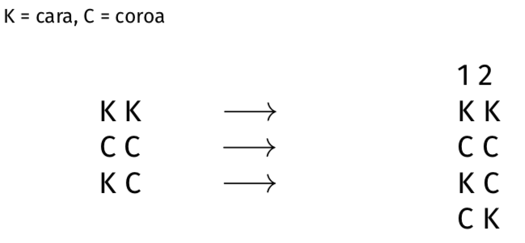
<p class="caption">(\#fig:ch2-experimento-moeda)Eventos simples associados ao experimento.</p>
</div>


#### Eventos Especiais {-}


Alguns eventos são especiais:
  
**Evento Impossível** $\varnothing$   

O evento impossível (também chamado evento nulo) é aquele representado por um conjunto vazio (por exemplo, o resultado do lançamento do dado ser maior que 6 — sabemos que não é possível obter esse resultado); 

**União** $A \cup B$   

A união de dois eventos A e B corresponde à ocorrência simultânea dos eventos A e B OU quando apenas um dos dois eventos ocorre, ou seja:  
  OU ocorre apenas A OU ocorre apenas B OU ocorrem simultaneamente A e B.  
Por exemplo, se o evento A  corresponde a dizer que o resultado do lançamento de um dado é par, A é o conjunto dos elementos {2, 4, 6}. Se o evento B corresponder aos resultados ímpares, B é o conjunto dos elementos {1, 3, 5}. Então A U B é o conjunto dos resultados {1, 2, 3, 4, 5, 6}.  

A = {2, 4, 6}   
B = {1, 3, 5}  $\qquad \Rightarrow {A\cup B}$ = {1, 2, 3, 4, 5, 6} = $\Omega$
  
**Interseção** $A \cap B$  

Já a interseção de dois eventos A e C corresponde à ocorrência simultânea dos eventos A e C.  
Se A é o conjunto dos resultados pares e C é o conjunto dos resultados maiores que 3, então A interseção C corresponde ao conjunto dos resultados {4, 6}

A = {2, 4, 6}   
C = {4, 5, 6}  $\qquad \Rightarrow {A\cup C}$ = {4, 6}

**Eventos Mutuamente Exclusivos** $A \cap B = \varnothing$  

Dois eventos A e B são ditos mutuamente exclusivos quando a ocorrência de um deles implica na não ocorrência do outro. Neste caso, é impossível observar a ocorrência simultânea de A e B. Assim, a intersecção entre os conjuntos que os definem é o conjunto vazio. 
Os eventos A (= o resultado é par)   e   B (= o resultado é ímpar) são mutuamente exclusivos: 
  
  $A \cap B = \{2, 4, 6\} \cap \{1, 3, 5\} = \{ \}$,  pois observar um resultado par implica em não observar um resultado ímpar.

**Partição do Espaço Amostral**   

Os eventos A e B definidos anteriormente apresentam uma característica especial: são mutuamente exclusivos e coletivamente exaustivos (ou seja,a interseção de A e B é o conjunto vazio e a união de A e B corresponde ao espaço amostral). Neste caso, dizemos que A e B formam uma partição do espaço amostral.

  $A \cap B = \{\}$  
  $A \cup B = \Omega$

Duas definições adicionais importantes para Teoria de Probabilidades são idênticas àquelas correspondentes em Teoria de Conjuntos:
  
**Evento Complementar**  $A^\prime = A^C$   

O complementar de um evento A, representado por ($A^\prime$ ou $A^C$), corresponde ao evento que ocorre apenas se A não ocorrer.

**Diferença entre Eventos** $A - B = A \cap B^C$    

A diferença entre dois eventos A e B, representada por $A-B$ corresponde ao evento que ocorre quando A ocorre mas B não ocorre.
A diferença $A-B$ pode ser representada matematicamente pela interseção entre o evento A e o complementar de B.  

A = {2, 4, 6}   
B = {1, 3, 5}  $\qquad \Rightarrow  {A - B}$ = {2, 4, 6} $\cap$ {2, 4, 6} = {2, 4, 6}


A tabela abaixo mostra a equivalência entre os conceitos fundamentais de teoria de conjuntos e a terminologia utilizada em teoria de probabilidades.


### Lei de Probabilidade  {-}


A Lei de Probabilidade  $P[A]$  atribui a todo evento no espaço amostral um número não negativo que codifica, isto é, que  define a medida de incerteza associada a cada evento no espaço amostral. Na ilustração, altura da barra está associada à propensão da ocorrência dos eventos A e B, ou seja, das probabilidades de observar os eventos A e B, respectivamente.

Precisamos definir qual medida de incerteza será utilizada para a análise de um determinado experimento aleatório. É importante uma escolha cuidadosa, pois tudo que a teoria matemática faz é calcular valores com base na medida definida. Diferentes interpretações são possíveis e veremos algumas a seguir. 


## Interpretações de Probabilidade


> *"Probability is the most important concept in modern science, especially as nobody has the slightest notion what it means."*
>
> ---Bertrand Russell, 1929 Lecture<br><br>
  
Vimos que probabilidade é utilizada como uma medida de incerteza. No entanto, existem diferentes maneiras de pensar a respeito de probabilidades e é preciso compreender que interpretações são adequadas a cada situação, ou seja,  é necessário definir qual medida de incerteza será utilizada para a análise de uma determinada situação aleatória. É importante uma escolha cuidadosa, pois tudo que a teoria matemática de probabilidades faz é calcular valores com base na medida definida.

Vamos fazer um exercício de imaginar qual seria a resposta para cada uma das perguntas a seguir:
  
(1) Suponha que você tenha uma caixa com 4 bolas brancas e 8 bolas vermelhas. Você retira uma bola da caixa, selecionada ao acaso. Qual a probabilidade de que a bola sorteada seja branca?  
(2) Você lança uma moeda 20 vezes e obtém 19 caras. Qual a probabilidade de que o resultado do próximo lançamento seja cara?  
(3) Qual a probabilidade de que você consiga ser aprovado num processo seletivo para estágio de verão, dado que o outro candidato também parece ser muito qualificado?
(4) Qual a probabilidade de chover amanhã?  
(5) Qual a probabilidade de que existam civilizações parecidas com a nossa em outras partes do universo?
  
Corriqueiramente ouvimos perguntas como essas. Mas o que elas significam?
  
É possível perceber que, nas perguntas formuladas, não temos o mesmo entendimento do que significa probabilidade em cada uma das situações consideradas; e, além disso, pode ser muito difícil quantificar a incerteza associada a algumas dessas perguntas. 

É importante compreender como o nosso entendimento a respeito do significado da probabilidade se relaciona com o mundo real e, mais ainda, como o conhecimento da probabilidade de um determinado evento pode ser útil ao tomar decisões relacionadas a esse evento. Veremos a seguir diferentes interpretações do conceito de probabilidade, que podem ser úteis para responder a diferentes tipos de pergunta que envolvem situações de incerteza.


### Interpretação Clássica (*a priori*): Laplace, 1812 {-}


$$P_N(A) = \frac{n_A}{N}$$
  
onde:
  
$n_A$: número de resultados favoráveis   
$N$: número de resultados possíveis  

+ igualmente prováveis    
+ mutuamente exclusivos e    
+ coletivamente exaustivos  

A interpretação clássica, ou a priori, de probabilidade deve-se a Laplace e constitui a primeira tentativa rigorosa de definir probabilidade.   

Antes de Laplace, a teoria de probabilidades consistia apenas na análise matemática de jogos de azar específicos. Laplace introduziu uma grande quantidade de novas idéias e técnicas matemáticas em seu livro "Teoria Analítica das Probabilidades" e mostrou aplicações científicas e práticas, como teoria dos erros, mecânica estatística, ciências atuariais, entre outros. Laplace foi um matemático prodigioso, que deu contribuições a todos os problemas matemáticos existentes em sua época.  

De acordo com a interpretação clássica, o primeiro passo consiste em representar o espaço amostral (o espaço de possibilidades) como um conjunto de eventos igualmente prováveis, mutuamente exclusivos e coletivamente exausivos, isto é, devemos ter uma partição do espaço amostral em eventos equiprováveis. Desta forma, a probabilidade de observar um certo evento A é definida como a razão entre o número de resultados favoráveis (em que se observa A) e o número total de resultados possíveis. Como o espaço amostral é definido antes (ou independentemente) da realização do experimento aleatório, esta definição determina probabilidades _a priori_.   

O que significa dizer que um resultado é "favorável"? 

Vamos supor que um dado honesto seja lançado e deseja-se determinar a probabilidade de observar um resultado ímpar. Este experimento aleatório está associado a um espaço amostral, que pode ser definido de diversas maneiras: resultado ímpar ou par; resultado menor ou maior ou igual a 4, e assim por diante. No entanto, se quisermos ser capazes de utilizar a definição clássica de probabilidade, precisamos de uma representação do espaço amostral formada por uma partição de eventos equiprováveis.

Como o dado é honesto, é conveniente representar o espaço amostral como sendo composto pelos números de um a seis. A definição clássica de probabilidade pode, então, ser utilizada, pois estes resultados têm a mesma chance de manifestar-se, a ocorrência de qualquer um dessses resultados implica na não ocorrência dos demais; e eles representam todas as possibilidades (assumindo que o dado não possa parar de maneira estável em um vértice ou aresta). Os resultados favoráveis ao evento "o resultado é ímpar" são 1, 3 e 5; que correspondem a 3 dos 6 resultados possíveis; portanto, a probabilidade de obter resultado ímpar é 3/6 = 0,5.

Note que a definição clássica toma por hipóteses uma série de condições para o experimento aleatório em análise:
  
Primeiro, que o número de resultados possíveis deve ser finito.

Outra questão a se considerar é como decidir se os resultados individuais que compõe o espaço amostral são realmente equiprováveis. Isto é determinado pelo chamado "princípio da indiferença" que afirma que: dois resultados devem ter a mesma probabilidade de ocorrência se não podem ser diferenciados a não ser por seus nomes ou rótulos. Como esse argumento pode ser utilizado para quaisquer dois resultados do experimento com o dado, chega-se à conclusão de todos os resultados devem ter mesma probabilidade.

Essa definição, embora seja matematicamente consistente, apresenta algumas limitações: não pode ser aplicada para calcular a probabilidade de eventos associados a um experimento com um número infinito de resultados possíveis; não é capaz de definir a probabilidade de eventos supostamente não equiprovávesi e note que esta é também uma definição circular: o conceito de equiprobabilidade de resultados é baseado no conceito de probabilidade que queremos definir.

**Premissas:**  
  
+ Número N finito de resultados possíveis   
+ Hipótese de equiprobabilidade de resultados    
+ Princípio da "Indiferença"    

**Dificuldades:**  
  
+ Não faz sentido para N infinito  
+ Definição circular  
+ Não se aplica a eventos supostamente não equiprováveis 


### Interpretação Empírica ou de Frequência Relativa (*a posteriori*): Richard V. Mises, 1919 {-}


$$P_N(A) = \lim_{N\to\infty}\frac{n(A)}{N}$$
  
onde:   
$n_A:$ número de ocorrências do evento $A$   
$N:$ número de realizações do experimento aleatório  

De acordo com a definição empírica, a probabilidade de um certo evento A corresponde à frequência relativa da ocorrência deste evento quando o experimento aleatório é realizado um número suficientemente grande de vezes, em condições uniformes. 

Segundo esta definição, a fim de calcular a probabilidade de obter um resultado ímpar no lançamento de um dado, deveríamos repetir este experimento um grande número de vezes e calcular a razão entre o número de vezes em que foi observado um resultado ímpar e o número de vezes que o experimento foi realizado.

Este é o tipo de interpretação de probabilidade que implicitamente está sendo utilizado ao realizarmos testes clínicos para determinar a eficácia de uma nova vacina, por exemplo.

A definição de frequência relativa difere da definição clássica das seguintes maneiras:
  
i. Ela não se refere ao princípio da indiferença; pelo contrário, as probabilidades de ocorrência dos eventos não podem ser determinadas antes da realização do experimento, através da simples análise do espaço amostral e, por esta razão, as probabilidades nesta definição são determinadas 'a posteriori'. 

ii. Probabilidades não podem ser definidas para uma única realização do experimento. Não existe probabilidade de obter um resultado ímpar em um único lançamento de um dado honesto.

Esta definição se apóia no "princípio da regularidade estatística", que determina que eventos aleatórios apresentam uma certa regularidade ao serem realizados um número muito grande de vezes. 

Quando um experimento aleatório é replicado, os resultados diferem de maneira imprevisível de uma realização para outra. Uma sequência de realizações constitui, então, um caminho aleatório; e diferentes caminhos aleatórios (isto é, diferentes sequências de realizações do mesmo experimento) são únicos, distintos entre si, mas apresentam um comportamento estável no longo prazo; desta forma, a frequência relativa de ocorrência de um certo evento se estabiliza quando o número total de realizações do experimento aumenta e, assim se aproxima de um limite, que define a probabilidade deste evento.

Von Mises acreditava que um valor numérico de probabilidade somente fazia sentido no caso de um experimento replicável. Sendo assim, para ele, a teoria de probabilidades não tinha nada a ver com a probabilidade de o seu time de futebol preferido vencer o campeonato brasileiro. No entanto, é claro que as pessoas associam valores numéricos para as probabilidades em tais situações, na hora de fazerem suas apostas, por exemplo. Para Von Mises, porém, probabilidades desta natureza estão fora do domínio da teoria de probabilidades.

E este é exatamente o tipo de situação tratado pelo conceito subjetivo de probabilidade, apresentada em seguida.

**Premissas:**   
  
+ Número "suficientemente" grande de realizações do experimento aleatório   
+ Condições uniformes para realização do experimento  
+ Princípio da "Regularidade Estatística"   

**Dificuldades:**  
  
+ Definição de um número "suficientemente" grande    
+ Não se aplica a eventos que não podem ser repetidos   


### Interpretação Subjetiva {-}


De acordo com a interpretação subjetiva, probabilidades correspondem a níveis de convicção (ou crença) a respeito da ocorrência de acontecimentos imprevisíveis, ou da veracidade de uma hipótese ou de uma afirmação. Em outras palavras, probabilidades representam um julgamento individual a respeito da chance de ocorrência do evento. 

De acordo com este paradigma, as probabilidades devem refletir o conhecimento e a experiência pessoal do indivíduo que faz a afirmação probabilística. Por este mesmo motivo, não há garantias de que um único valor seja atribuído para a probabilidade de um certo evento por diferentes sujeitos.

Por exemplo, um médico cirurgião, baseado em sua experiência e nas informações de que dispõe, afirma que a chance de um determinado procedimento ser bem sucedido é de 90%. Já um outro especialista poderia atribuir um valor diferente de probabilidade para o mesmo evento.

**Premissas:**  
  
+ Probabilidade assinalada a um determinado evento é baseada nas experiências pessoais e informação individual sobre o processo  
+ Não há aferição do resultado  
+ Pode ser matematicamente formalizado sob determinadas condições de consistência        

**Dificuldades**  
  
+ Humanos são seres inconsistentes e contraditórios   
+ Não há garantias de obtenção de resultados únicos   


### Resumo {-} 

  
Vimos três interpretações para o conceiro de probabilidade. 

A interpretação clássica de probabilidade permite o cálculo de probabilidades com base na análise da estrutura do problema. Para que seja possível utilizar essa interpretação, é preciso definir de antemão o espaço amostral associado ao experimento aleatório em termos de eventos equiprováveis. 

A interpretação de frequência relativa é útil quando a situação aleatória em análise pode ser entendida como um experimento possível de ser realizado repetidas vezes em condições idênticas. Neste caso a probabilidade de um evento corresponde à proporção dos experimentos em que o evento ocorre.

Já a interpretação subjetiva corresponde ao julgamento pessoal que pode ser empregado para avaliar a chance de ocorrência única de um evento, de acordo com a experiência do avaliador e das informações de que dispõe.

As três maneiras de interpretar probabilidades permitem quantificar incertezas em uma grande variedade de situações. O fato é que as diferentes interpretações de probabilidade não competem entre si; pelo contrário, são complementares no sentido em que nos auxiliam a quantificar as incertezas associadas a diferentes tipos de situações imprevisíveis, e nos permitem uma melhor compreensão intuitiva de como os valores numéricos de probabilidade se relacionam ao o mundo real e como podem ser utilizados para nos auxiliar no processo de tomada de decisão.


## Definição Axiomática


A definição matemática (ou axiomática) de probabilidade foi proposta por Andrey Kolmogorov em 1933. Esta definição estabelece um conjunto de regras universais, que se aplicam a qualquer interpretação de probabilidade. Essa é, portanto, uma definição matemática, que estabelece as condições para uma função matemática qualquer ser considerada uma função probabilidade. 

Para definir função probabilidade, é necessário definir o espaço de eventos, que corresponde ao conjunto que contém todos os eventos possíveis de um experimento aleatório. 

**Espaço de Eventos** $\mathcal{A}$

Uma coleção de eventos é $\mathcal{A}$ quando são satisfeitas as seguintes condições:
  
+ $\Omega \in \mathcal{A}$
+ Se $A \in \mathcal{A} \Longrightarrow A^C \in \mathcal{A}$
+ Se $A, B \in \mathcal{A}$ $\Longrightarrow A \cup B \in \mathcal{A}$ 
  
O espaço de eventos $\mathcal{A}$ não deve ser confundido com o espaço amostral $\Omega$, pois enquanto o espaço amostral de um experimento aleatório contém todos os  resultados possíveis deste experimento (isto é, a coleção de todos os eventos simples), o espaço de eventos contém todos os conjuntos de resultados do experimento, isto é, todos os subconjuntos do espaço amostral. O espaço de eventos e inclui o espaço amostral $\Omega$ e é fechado para o complemento e para a união de eventos. 

**Função Probabilidade**
  
  $P: \mathcal{A} \longrightarrow \Re$
  
i. Se $A \in \mathcal{A} \Longrightarrow P[A] \geq 0$  

ii. $P[\Omega] = 1$  

iii. $A_1, A_2, \ldots,$ eventos tais que $A_i \cap_{i \neq j} A_j = \varnothing$  
  $\Longrightarrow P\left[ \cup_{i=1}^\infty A_i\right] = \sum_{i=1}^{\infty} P[A_i]$
  
Então, uma função real $P$ definida no espaço de eventos do experimento aleatório é função probabilidade se satisfaz as seguintes condições: (i). a probabilidade de ocorrência de qualquer evento é sempre um número não negativo; (ii). se um evento é certo, então sua probabilidade vale 1 (em outras palavras, toda vez que o experimento aleatório é realizado, alguma coisa acontece);  e, finalmente,  (iii). para qualquer sequência infinita de eventos mutuamente exclusivos, vale a propriedade adiditva de probabilidade, isto é, a probabilidade de algum deles ocorrer é igual à soma das probabilidades individuais.

Note que a definição axiomática não nos ensina como escolher essa função; ela não nos ensina como calcular o valor de $P$ para um determinado evento conhecido $\mathcal{A}$; e também não nos revela a natureza de processos aleatórios.

A definição matemática garante, no entanto, que qualquer função que satisfaça os três axiomas, terá certas propriedades que intuitivamente associamos a uma probabilidade, sob quaisquer das interpretações descritas anteriormente. 

**Propriedades de Função Probabilidade**

A partir dos três axiomas que definem função probabilidade, é possível deduzir outras propriedades dessa função.

i. $P[\varnothing] = 0$  
  
ii. $P\left[\cup_{i=1}^{n}A_i\right] = \sum_{i=1}^{n} P[A_i]\quad$ (se $A_1, A_2, \ldots, A_n$ mutuamente exclusivos)  
$\Rightarrow \quad P[B] = P[B\cap A] + P[B\cap A^C]$
  
iii. $P[A] + P[A^C] = 1$ 
  
iv. $0 \leq P[A] \leq 1$    
  
v. $P[A \cup B] = P[A] + P[B] - P[A \cap B]\quad$ (.ired[Regra da Adição]) 

vi. outras propriedades  

Por exemplo,  primeira propriedade afirma que a probabilidade de observar o evento impossível é zero; a segunda propriedade nos garante que se um experimento pode ser repetido indefinidamente, então, para uma coleção finita de eventos mutuamente exclusivos, a proporção das vezes que a união dos eventos ocorre é igual à soma das proporções das ocorrências individuais desses eventos; a soma das probabilidades de eventos complementares vale 1; a probabilidade de ocorrência de um evento A, qualquer, é sempre um número entre 0 e 1; a probabilidade da união de dois eventos A e B, é a soma das probabilidades dos eventos menos a probabilidade da ocorrência simultânea dos dois eventos.

Faremos uso desses e de outros teoremas para resolver problemas de cálculo de probabilidades.


## Revisitando o Paradoxo de De Méré: O Problema dos Dados


> *"A probabilidade de obter pelo menos um ‘6’ em 4 lançamentos seguidos de um dado deveria ser a mesma de obter pelo menos um ‘6 duplo’ em 24 lançamentos de um par de dados"*
>
> ---Chevalier de Méré (Antoine Gombaud, 1607-1684)

Na França do século XVII, jogos de azar (*jeux de hasard*) eram uma prática disseminada entre a nobreza e esta era considerada, sobretudo, uma atividade refinada na corte do rei Luis XIV, a tal ponto de ser reconhecida como a única forma "honrada" de um nobre endividado (algo muito comum na época) obter algum dinheiro. Em realidade, etiqueta, jogos e divertimentos foram maneiras sutis que Louis XIV encontrou de manipular e enfraquecer econômicamente a nobreza, que passou a ser endividada demais para armar exércitos que pudessem se levantar contra o rei, e cujo destino dependia da capacidade de agradá-lo.

Embora não fosse de origem nobre, Antoine Gombaud, conhecido como Chevalier de Méré era um filósofo e escritor conhecido, além de uma figura importante na corte do rei-sol, onde atuava como conselheiro em situações delicadas e árbitro em conflitos entre nobres. Ele era também um aficcionado por jogos de azar.

Diz-se que ele consistentemente ganhava dinheiro em um jogo de azar, apostando que obteria pelo menos um '6' em quatro lançamentos de um dado. A fim de incluir mais jogadores (e, assim, ganhar mais dinheiro), modificou o jogo, passando a apostar que obteria pelo menos um 'duplo 6' em 24 lançamentos de um par de dados. A nova estratégia não funcionou na prática e de Méré passou a acumular enormes prejuízos! Ele tinha a impressão que 25 (não 24) lançamentos seriam necessários para que o novo jogo lhe fosse favorável, mas não conseguia identificar o erro em sua solução matemática...Desesperado, procurou a ajuda de seu amigo matemático Blaise Pascal que, intrigado com o problema, passou a se corresponder com Pierre de Fermat, em busca de uma solução.

**Estratégia de solução (errada) proposta por De Méré**  

> "*Ao lançar um dado, tenho 1/6 de chance de obter um '6'. <br>Como 3 x 1/6 = 50% e 4 x 1/6 = 67%, preciso jogar o dado 4 vezes para tornar o jogo favorável para mim!*"

Este é o número crítico de lançamentos para este jogo; é o número que faz o jogo se tornar favorável para o jogador. Ele agora deseja encontrar o número crítico de lançamentos para o jogo modificado...E, assim, prossegue:
  
> "*Quando jogo um par de dados, tenho 36 possibilidades, ou seja, seis vezes mais possibilidades que no jogo anterior.  Portanto, é necessário lançar o par de dados  6 x 4 = 24 vezes, para ter chance maior do que 50% de obter pelo menos um 'duplo 6'.*"

Obviamente, esta solução está errada. 

Vamos retomar o problema dos dados proposto pelo Chevalier de Méré ao seu amigo, o matemático Blaise Pascal, e reconstruir a solução correta para esse problema, utilizando diferentes estratégias. A primeira estratégia a ser considerada será através do emprego da interpretação clássica de probabilidade.

**Solução via interpretação clássica**

EXPERIMENTO 1:   
Jogue um dado honesto 4 vezes e observe a quantidade de ocorrências do número '6'.

Espaço amostral: $\Omega_1$ = {A0, A1, A2, A3, A4}, em que:
  
Ai:  conjunto dos resultados em que são obtidas _i_ ocorrências do número '6'   

O experimento 1 representa o jogo original, em que apenas um dado é lançado 4 vezes e a quantidade de vezes que aparece o número 6 nesses 4 lançamentos é registrado. Os resultados possíveis são: 
  
- nenhum '6' foi observado, que representamos por A0    
- apenas um '6' foi observado, representado por A1   
- dois '6' foram obtidos, correspondendo a A2    
- três '6' obtidos, evento dado por A3; ou, finalmente    
- o valor '6' foi obtido em todos os 4 lançamentos; evento este representado por A4.  

A fim de utilizar a interpretação clássica, é necessário escrever o espaço amostral em termos de um conjunto finito de resultados possíveis igualmente prováveis.   

Note que os eventos A0, A1, A2, A3, A4 que compõem o espaço amostral não
são equiprováveis. Precisamos, então, reescrever os eventos que compõe o espaço amostral, a fim de que ele seja definido em termos de resultados equiprováveis.  

Vamos reescrever cada um dos eventos A0, A1, A2 etc enumerando todos os eventos simples que os compõe:
  
A0:  conjunto dos resultados em que nenhum '6' ocorre   
A0 = {(1, 1, 1, 1), (1, 2, 1, 1), (1, 1, 2, 1), (1, 1, 1, 2),..., (5, 5, 5, 5)} 

A1: conjunto dos resultados em que ocorre um unico '6'    
A1 = {(6, 1, 1, 1), (1, 6, 1, 1), (1, 1, 6, 1), (1, 1, 1, 6),..., (5, 5, 5, 6)}

A2: conjunto dos resultados em que ocorrem dois '6'   
A2 = {(6, 6, 1, 1), (6, 1, 6, 1), (6, 1, 1, 6),..., (5, 5, 6, 6)}

A3: conjunto dos resultados em que ocorrem três '6'  
A3 = {(6, 6, 6, 1), (6, 1, 6, 6), (1, 6, 6, 6),..., (5, 6, 6, 6)}  

A4: conjunto dos resultados em que ocorrem quatro '6'  
A4 = {(6, 6, 6, 6)}

Sendo assim,
A0 é dado pelo conjunto das sequências de 4 lançamentos que não contém nenhum resultado '6'

O mesmo é feito para os demais eventos, de forma que o novo espaço amostral é dado por:
  
  $\Omega_1^\prime$ =   
  {(1, 1, 1, 1), (1, 2, 1, 1), (1, 1, 2, 1), (1, 1, 1, 2), (1, 3, 1, 1),..., (5, 5, 5, 5),   
    (6, 1, 1, 1), (1, 6, 1, 1), (1, 1, 6, 1), (1, 1, 1, 6), (6, 2, 1, 1),..., (5, 5, 5, 6),  
    (6, 6, 1, 1), (6, 1, 6, 1), (6, 1, 1, 6), (1, 6, 6, 1), (1, 6, 1, 6),..., (5, 5, 6, 6),  
    (1, 6, 6, 6), (6, 1, 6, 6), (6, 6, 1, 6), (6, 6, 6, 1),..., (6, 6, 6, 5), (6, 6, 6, 6)}

Pela definição clássica de probabilidades:  
  
  $$\text{PC.1 = n.favoráveis/n.possíveis}$$  

onde:
  
  $$\text{n.possíveis} =  {N[\Omega_1^\prime]= 6 \times 6 \times 6 \times 6 = 6^4}$$ 
  
Cada um dos elementos simples que compõe o espaço amostral representa uma  possível sequência de números resultantes de 4 lançamentos de uma dado. 

Esses resultados são equiprováveis e, por este motivo, agora podemos definir a probabilidade de interesse, isto é, de obter pelo menos um '6' em 4 lançamentos de um dado como sendo a razão entre o número de resultados favoráveis e o número de resultados possíveis.

O número de resultados possíveis é dado pelo tamanho do espaço amostral e vale $6^4$, pois temos 6 possibilidades para cada lançamento do dado.

Precisamos determinar agora o número de eventos favoráveis.

Os resultados favoráveis são aqueles em que pelo menos uma '6' foi obtido, ou seja, são obtidos pela união dos eventos A1, A2, A3, A4: 
  
$$\text{Af.1 = A1 U A2 U A3 U A4}$$
  
Precisamos agora determinar o número de resultados favoráveis, ou seja, o tamanho do conjunto Af.1. Esta quantidade pode ser mais facilmente calculada utilizando-se a definição de evento complementar:  o número de eventos favoráveis é igual número de resultados possíveis (o tamanho do espaço amostral) menos o tamanho do conjunto A0, em que nenhum resultado '6' é observado nos 4 lançamentos. Assim, o número de resultados favoráveis é dado por:  
  
$$\text{n.favoraveis = N[Af.1]} =  {N[\Omega_1^\prime] - N[A0] = 6^4 - (5 \times 5 \times 5 \times 5) = 6^4 - 5^4}$$
  
Portanto:
  
$$\text{PC.1} =  {1 - (5/6)^4 = 0.518}$$
O tamanho do espaço amostral foi calculado anteriormente e vale $6^4$ e o tamanho do conjunto A0 é daddo por $5^4$, pois como nenhum '6' pode ser observado, isso significa que, para cada um dos 4 lançamentos tínhamos apenas 5 resultados possíveis, os números de 1 a 5. 

Dessa forma, o número de resultados favoráveis é $6^4$ - $5^4$.

Portanto, a probabilidade de obter pelo menos um '6' em 4 lançamentos é 51,8%. O jogo é favorável para o Chevalier, mas não da maneira que ele supunha...

Vamos fazer agora, da mesma forma, a análise para o jogo modificado: um par de dados é lançado 24 vezes e são registradas as ocorrências de 'duplos 6'.

EXPERIMENTO 2:   
Jogue um par de dados honestos 24 vezes e observe os resultados em que se obteve pelo menos um 'duplo 6'.  

Espaço amostral: $\Omega_2$ = {B0, B1, B2, B3, B4, B5, B6, ..., B24}, em que:  
  
Bi:  conjunto dos resultados em que são obtidas _i_ ocorrências de 'duplos 6'.

Semelhantemente ao experimento 1, os eventos Bi que compõe o espaço amostral, embora representem todos os resultados possíveis do experimento 2, não são equiprováveis e, por este motivo, não podemos utilizar a definição clássica para calcular a probabilidade de obter pelo menos um 'duplo 6' nos 24 lançamentos.

Precisamos então, reescrever o espaço amostral para esse experimento em termos de eventos equiprováveis... mas eu vou deixar essa tarefa de exercício para vocês!

A partir de um espaço amostral composto por eventos que têm iguais probabilidades de ocorrer, é possível utilizar a definição clássica para calcular a probabilidade de interesse através da razão entre o número de resultados favoráveis (em que pelo menos um 'duplo 6' foi obtido na sequência de 24 lançamentos) e o número de resultados possíveis (tamanho do espaço amostral).

Pela definição clássica de probabilidades:
  
$$\text{PC.2 = n.favoráveis/n.possíveis}$$  
  
A cada um dos 24 lançamentos temos 6 possibilidades para o primeiro dado e 6 possibilidades para o segundo dado. Portanto, o número de resultados possíveis é dado por:
  
$$\text{n.possíveis} =  {N[\Omega_2]= (6\times 6)^{24} = 36^{24}}$$
  
O número de resultados favoráveis pode ser facilmente calculado utilizando-se a definição de evento complementar, isto é, o número dos resultados possíveis, menos o número de resultados "desfavoráveis", dado pelo tamanho do conjunto B0. Assim, o número de resultados favoráveis é dado por:
  
$$\text{n.favoraveis} =  {N[\Omega_2] - N[B0]}$$ 
  
Em cada lançamento do par de dados, são possíveis 36 resultados, em que apenas um resultado corresponde a um 'duplo 6'. 

Para que nenhum 'duplo 6' tenha sido obtido na sequência de 24 lançamentos do par de dados, temos que observar algum dos 35 resultados alternativos em cada uma das 24 vezes. Sendo assim, o evento B0, que corresponde à situação em que nenhum 'duplo 6' é obtido nos 24 lançamentos, pode ser observado de $35^{24}$ maneiras:
  
$$\text{N[B0]} =  {[(6 \times 6) - 1]^{24} = 35^{24}}$$

Então o número de resultados favoráveis vale:

$$\text{n.favoráveis} =  {36^{24} - 35^{24}}$$
  
Portanto, a probabilidade de obter pelo menos um 'duplo 6' em 24 lançamentos é igual a 1 - a probabilidade de não obter nenhum 'duplo 6', dada por:
  
$$\text{PC.2} =  {1 - (35/36)^{24} = 0.491}$$

De fato, De Méré teve evidências empíricas de que o novo jogo lhe era desfavorável. A probabilidade de vencer ao lançar 24 vezes um par de dados é menor que 50%. E, assim, para que o jogo se tornasse favorável, seriam necessários 25 lançamentos do par de dados... 

Que tal calcular a probabilidade de vencer a aposta em 25 lançamentos?
  
De Méré obteve evidências empíricas de que seu cálculo de probabilidades estava errado. E, de maneira não intencional, aplicou a interpretação de frequência relativa para chegar a essa conclusão.

A princípio, precisaríamos repetir cada um dos experimentos um grande número de vezes e observar a frequência relativa em que se observam os resultados favoráveis a fim de calcular os valores de probabilidade correspondentes.

Felizmente, dispomos de um atalho: SIMULAÇÃO

**Solução via interpretação de frequência relativa (simulação)**
  
Vamos considerar os dois eventos que representam os resultados de cada um dos jogos de dados do Chevalier de Méré. O experimento 1 consiste em lançar um dado honesto 4 vezes e observar a quantidade de ocorrências do número '6'. O experimento 2 corresponde a lançar um par de dados honestos 24 vezes e observar os resultados em que se obteve pelo menos um 'duplo 6'.

E1 = pelo menos um ‘6’ em 4 lançamentos de um dado  
E2 = pelo menos um ‘duplo 6’ em 24 lançamentos de um par de dados

Estamos interessados em determinar as probabilidades de vencer nos dois jogos, isto é, observar os eventos E1 e E2 nos experimentos 1 e 2, respectivamente. Desejamos calcular: P[E1] e P[E2].

Para isso, vamos utilizar o software R para simular a realização desses dois jogos um grande número de vezes, digamos 1000 vezes. É como se tívessemos 1000 dias e em cada um desses dias, jogássemos uma partida dos dois jogos.

Em seguida, registraremos o número de ocorrências de cada um dos eventos E1 e E2 na longa sequência de realizações dos experimentos, isto é em quantas das 1000 vezes em que jogamos cada jogo, conseguimos ganhar. A probabilidade dos eventos será aproximada pela frequência relativa de ocorrência de E1 e E2.

Vamos definir algumas variáveis: 
  
  `nRep` é o número de replicações de cada um dos experimentos, ou seja, o no. de vezes que cada um dos experimentos será realizado.

`n1` e `n2` correspondem ao no. de lançamentos dos dados nos experimentos 1 e 2, respectivamente.

Então, vamos fazer: `nRep = 1000`, `n1 = 4` e `n2 = 24`.

As respostas serão as frequências relativas de ocorrência dos eventos E1 e E2. Então, vamos criar os vetores que armazenarão essas quantidades em nossa simulação: `frel.E1` e `frel.E2`. E vamos criar variáveis intermediárias que registrarão se a cada partida, o Chevalier ganhou ou não.  Feito isto, vamos realizar os experimentos 1 e 2.


```r
# Variáveis
# nRep: no. de replicações do experimento
# n1: no. de lançamentos de 1 dado no Experimento 1
# n2: no. de lançamentos de 2 dados no Experimento 2
nRep <- 1000
n1 <- 4
n2 <- 24

# Respostas
# frel.E1: frequencia relativa do evento E1 para o Experimento 1
# frel.E2: frequencia relativa do evento E2 para o Experimento 2
frel.E1 <- c()
frel.E2 <- c()

# Variáveis intermediárias: registram a cada jogo se o Chevalier venceu
ganhou.E1 <- c()
ganhou.E2 <- c()
```


EXPERIMENTO 1:  
Lançar um dado honesto 4 vezes e observar a quantidade de ocorrências do número '6'. 

O experimento é replicado `nRep` vezes. Para cada uma das replicações, simulamos 4 lançamentos de um dado; o que corresponde a sortear com reposição 4 números de 1 a 6. Isso é obtido utilizando a função `sample`.

Em seguida, realizamos um teste lógico para verificar se pelo menos um '6' foi obtido nos 4 lançamentos. Primeiro, testamos se em cada lançamento foi obtido  um número '6'; isto é feito pelo comando `res.E1 == 6`. Esse procedimento resulta em uma sequência de 4 valores `TRUE` ou `FALSE`, dependendo se esta condição foi atendida. Não estamos interessados na quantidades de lançamentos que resultaram em um '6'; apenas se houve pelo menos um '6'. A soma desses valores lógicos, então, vai indicar exatamente isso; se houve pelo menos um '6' nos 4 lançamentos. O vetor `ganhou.E1` vai acumulando valores lógicos `TRUE` ou `FALSE`, conforme em cada partida tenha sido obtido pelo menos um resultado '6'.

Após todas as `nRep` realizações, calcula-se a frequência relativa de ganhos.


```r
# Realiza Experimento 1 `nRep` vezes
for(i in 1:nRep){
  # lança `n1`  vezes um dado 
  # e registra resultados
  res.E1 <- sample(1:6, n1, replace = TRUE)  
  # Saiu pelo menos um '6'? 
  # Registra `TRUE` ou `FALSE`
  ganhou.E1 <- c(ganhou.E1, sum(res.E1 == 6) != 0)
}

# Registra frequencia relativa de ganhos    
frel.E1 <- cumsum(ganhou.E1)/1:nRep

# Gráfico de Freq. Relativa
plot(frel.E1, pch = "*", cex.axis = 0.7, las = 1, 
     ylim = c(0,1), yaxp = c(0, 1, 20),
     ylab = "freq. relativa de ganhos: E1", xlab = "Realizações do Experimento")
abline(h = 1 - (5/6)^n1,  lty = "dashed", lwd = 2, col = "red")
```


<div class="figure">

<p class="caption">(\#fig:ch2-demere-experimento1-res)Evolução dos valores de frequência relativa de ganhos para E1.</p>
</div>


Observe o gráfico que mostra a evolução do valores de frequência relativa calculados. Há uma grande variabilidade para os valores de frequência relativa, correspondendo a um número pequeno de replicações do experimento, mas a frequência relativa tende a estabilizar-se, conforme o número de replicações aumenta. Este limite é o valor que aproxima a probabilidade que desejamos calcular. A reta vermelha horizontal mostra o valor de probabilidade teórico calculado anteriormente, utilizando a definição clássica.

Para o segundo experimento, o procedimento é praticamente idêntico ao anterior, exceto que agora o teste lógico para verificar se o Chevalier venceu a partida consiste em observar a soma dos resultados. Soma igual à 12 indica a ocorrência de um 'duplo 6'.

EXPERIMENTO 2:   
Lançar um par de dados 24 vezes e observar a quantidade de ocorrências de um 'duplo 6'.  


```r
frel.E2 <- ganhou.E2 <- c()

# Realiza Experimento 2 `nRep` vezes
for(i in 1:nRep){
  # lanca `n2`  vezes um par de dados e registra resultados
  res.E2 <- cbind(sample(1:6, n2, replace = TRUE), 
                  sample(1:6, n2, replace = TRUE)) 
  # Saiu pelo menos uma soma '12' (duplo '6')?
  # Registra `TRUE` ou `FALSE`
  ganhou.E2 <- c(ganhou.E2, sum(rowSums(res.E2) == 12) != 0)
}

# Registra frequencia relativa de ganhos    
frel.E2 <- cumsum(ganhou.E2)/1:nRep

# Gráfico de Freq. Relativa
plot(frel.E2, pch = "*", cex.axis = 0.7, las = 1, 
     ylim = c(0,1), yaxp = c(0, 1, 20),
     ylab = "freq. relativa de ganhos: E2", xlab = "Realizações do Experimento")
abline(h = 1 - (35/36)^n2, lty = "dashed", lwd =2, col = "red")
```


<div class="figure">

<p class="caption">(\#fig:ch2-demere-experimento2-res)Evolução dos valores de frequência relativa de ganhos para E2.</p>
</div>


Novamente, o gráfico mostra a evolução do valores de frequência relativa calculados como função do número de replicações do experimento; e o mesmo padrão de comportamento é observado. A flutuação nos valores de frequência relativa é elevada para um número pequeno de replicações do experimento, mas também observamos uma estabilização desses valores, conforme aumenta o número de realizações do experimento, tendendo para o valor de probabilidade que desejamos calcular.

**Regularidade Estatística**  

Os gráficos de frequência relativa obtidos para os experimentos, que nós observamos para os dois experimentos, representam apenas um caminho aleatório para cada simulação. Cada simulação consiste em realizar, neste caso, `nRep` replicações de cada um dos jogos.

Se repetirmos esse processo um número muito grande de vezes, isto é, realizar novas simulações, dos mesmos experimentos, teremos novos e diferentes caminhos aleatórios, ou seja, os caminhos aleatórios variam de simulação para simulação.

A questão agora é: como se comporta a variabilidade desses caminhos alternativos? Será que existe um padrão no comportamento aleatório desses caminhos; em outras palavras, existe uma distribuição de probabilidade no espaço dos caminhos possíveis? O princípio da regularidade estatística nos diz que sim... É difícil perceber isso olhando para o caminho aleatório inteiro, mas podemos olhar para uma posição específica do caminho aleatório: vamos olhar para a posição final!
  
Encontramos regularidade estatística quando realizamos um grande número de replicações independentes da simulação e olhamos para a distribuição nas posições finais. Façamos isto, então! 

EXPERIMENTO 1:    


<div class="figure">

<p class="caption">(\#fig:ch2-regularidade-experimento1)Regularidade Estatística: E1.</p>
</div>


Cada linha no gráfico à esquerda corresponde a um caminho aleatório diferente. Ao todo, temos 100 caminhos aleatórios, ou simulações, cada uma correspondendo a 1000 realizações do Experimento 1. A reta horizontal tracejada é o valor de probabilidade teórico, calculado a partir da definição clássica.

As linhas verticais tracejadas indicam duas fatias que vamos analisar desse experimento: uma correspondendo a um caminho de tamanho 100, isto é com 100 realizações do experimento; e a outra, a um caminho de tamanho 1000, ou seja, considerando as 1000 realizações do experimento.

Aqui percebemos claramente a regularidade estatística: quando repetimos o experimento um pequeno número de vezes (ou seja, quando o caminho aleatório é "curto"), a frequência relativa calculada a partir desse pequeno número de realizações varia bastante de um caminho para outro; no entanto, a variabilidade para os diferentes valores de frequência relativa é muito menor, quando calculados com base em 1000 realizações.

Isso torna-se ainda mais claro, comparando os histogramas para os valores de frequência relativas calculados a partir das 100 simulações do experimento 1, com 100 e 1000 realizações desse experimento.

As linhas verticais tracejadas coloridas correspondem aos quantis da distribuição amostral associada (isto é, dos valores observados) que englobam 95% das observações; ou seja, 95% dos valores de frequência relativa calculados com base em 100 realizações do experimento 1 encontram-se entre os valores delimitados pelas linhas tracejadas vermelhas. O mesmo raciocínio pode ser aplicado para as linhas verticais azuis.

Note que o espalhamento para o histograma correspondendo a 100 realizações (em vermelho) é muito mais disperso que aquele para 1000 realizações do experimento; isso significa que aumentamos a precisão da estimativa da probabilidade desejada conforme aumentamos o número de realizações do experimento.

EXPERIMENTO 2:    


<div class="figure">

<p class="caption">(\#fig:ch2-regularidade-experimento2)Regularidade Estatística: E2.</p>
</div>


O mesmo procedimento foi realizado para o experimento 2 e percebemos que
conclusões semelhantes podem ser obtidas.


<!--chapter:end:02-ch2.Rmd-->

# Probabilidade Condicional e Independência


Até agora, tratamos de probabilidades da seguinte maneira:  primeiro, associado a um experimento aleatório, define-se um espaço amostral $\Omega$  para, em seguida, calcular todas as probabilidades de interesse com relação a esse espaço amostral.

Em muitas situções, no entanto, temos a possibilidade de **atualizar**, isto é, modificar o espaço amostral à luz de nova informação.

Em tais casos, é desejável sermos capazes de também atualizar os cálculos das probabilidades de interesses.

Isso significa que agora calcularemos probabilidades condicionais, ou seja, probabilidades que dependem de certos acontecimentos que sabemos terem ocorrido.

Sendo assim, probabilidades condicionais nos permitem analisar os resultados de um experimento aleatório (o que quer dizer que podemos calcular probabilidades), quando existe **intervenção** no espaço amostral; o espaço amostral foi modificado com a informação adicional que se obteve.

Nos exemplos a seguir, os eventos condicionantes, ou os acontecimentos prévios estão ressaltados em negrito. Esses eventos constituem informação adicional a respeito dos experimentos aleatórios investigados.

   
::: {.example #unnamed-chunk-1}
:::


Um dado é lançado duas vezes e **sabe-se que a soma dos resultados vale 9**. Qual a probabilidade de que o primeiro resultado tenha sido 6? 

O experimento aleatório consiste em lançar um dado duas vezes e observar o resultado do primeiro lançamento. Queremos calcular a probabilidade de que este resultado tenha sido '6'. 

Sem nenhuma informação adicional, sabemos que esta probabilidade vale 1/6, se o dado for honesto. Para chegar a esta conclusão, basta analisarmos o espaço amostral associado ao experimento, como mostra o diagrama, a seguir. 


Nesse diagrama, temos uma representação do espaço amostral original: o eixo vertical (D1) representa os resultados possíveis para o primeiro dado, e no eixo horizontal (D2), temos os resultados possíveis para o segundo dado. Temos um total de 36 resultados possíveis para esse experimento (que correspondem às combinações dos seis resultados possíveis para cada um dos dados); e, deste total, é possível observar o resultado '6' para o primeiro dado de seis maneiras diferentes. 

Mas, temos a informação adicional de que a soma dos resultados vale '9'. O que essa informação adicional faz?... Ela restringe o meu espaço amostral original. Agora, nós sabemos que nem todas as possibilidades originais continuam sendo possíveis. 

Ao fornecer a informação adicional de que a soma dos dois resultados vale '9', o espaço amostral sofre uma modificação; dos 36 resultados incialmente possíveis, são compatíveis com a nova informação, apenas quatro resultados, representados em azul. Agora, das novas possibilidades, apenas em uma o resultado do primeiro dado é o número '6'; portanto, a probabilidade de obter '6' no primeiro dado é ser atualizada e agora vale 1/4.

Veja que, pelo fato de ter uma informação adicional, não é mais possível calcular a probabilidade de que o primeiro resultado tenha sido '6', com base no universo original, no espaço amostral associado ao experimento de lançar o dado duas vezes e observar o resultado do primeiro dado... agora, é necessário **condicionar** ao fato de que agora sabe-se que a soma dos dois resultados vale '9'.


::: {.example #unnamed-chunk-2}
:::


**Um objeto é detectado por um radar**. Qual a probabilidade de que seja um avião?

Este experimento aleatório consiste em observar um radar e verificar se houve detecção de um avião. Note que é possível que haja um avião e que o radar não seja capaz de detectá-lo; mas também é possível que o radar detecte a presença de um objeto que não é um avião. 

Por que a probabilidade desejada é uma probabilidade condicional? Qual é o evento que está modificando o espaço amostral original, ou seja, qual é o evento condicionante? Este evento é justamente a informação adicional adquirida. Neste caso, essa informação corresponde ao fato de que a detecção ocorreu. 

Portanto, o espaço amostral original sofre uma alteração, já que eliminamos a possibilidade de um avião passar sem ser detectado e, com isso, a probabilidade associada ao evento desejado também é modificada.

Agora, sabendo que houve a detecção (e conhecendo com que probabilidade isto ocorre), resta calcular a probabilidade de que o objeto detectado seja um avião.


::: {.example #unnamed-chunk-3}
:::


Qual a probabilidade de que o paciente esteja doente, **dado que o teste deu negativo?**

Neste exemplo, temos uma situação semelhante à do exemplo anterior: um paciente desconfia de que esteja doente e se submete a um teste laboratorial. Antes de realizar o teste, tem uma determinada probabilidade de estar doente, determinada pela incidência da doença na população a que pertence. Ele faz um teste e o resultado é negativo.  À luz deste resultado, qual é a probabilidade de que ele **esteja doente**, e que o resultado corresponda a um falso negativo? A informação fornecida pelo resultado do teste é útil? 

Dependendo da qualidade do teste, sim. Pois os testes comumente têm uma certa sensibilidade (que corresponde à capacidade do teste identificar corretamente a presença da doença; é o verdadeiro positivo) e uma especificidade (que corresponde à capacidade do teste dar resultado negativo quando o paciente não tem a doença sendo investigada; o verdadeiro negativo). Sendo assim, conhecendo as características teste, a incidência da doença na população de interesse e a informação de que o resultado deu negativo, temos elementos para atualizar nosso cálculo da probabilidade de que o paciente esteja, de fato, doente, a despeito do resultado negativo obtido.

Novamente, estamos diante de uma situação em que ocorre intervenção no espaço amostral.

Nós podemos, então, atualizar as probabilidades de eventos, quando obtemos nova informação, através do cálculo de probabilidades condicionais. 


## Probabilidade Condicional


Sejam A e B dois eventos associados a um experimento aleatório E e definidos em um espaço amostral $\Omega$; ; então A e B são dois conjuntos de resultados possíveis para esse experimento aleatório. 

Define-se a **probabilidade condicional do evento A ao evento B** como sendo a razão entre a probabilidade da ocorrência simultânea dos eventos A e B e a probabilidade de ocorrência do evento B.

$$P[A|B] \stackrel{\Delta}{=} \frac{P[AB]}{P[B]}, \quad P[B] > 0 $$
onde P[A|B] é a probabilidade condicional de A, dado B.  

O evento A é chamado **evento condicionado**.  
O evento B é chamado **evento condicionante** ou **espaço amostral reduzido**.

A probabilidade condicional $P[A|B]$ é a probabilidade de o evento A ocorrer, DADO QUE (sabendo-se que) o evento B ocorreu.

Queremos calcular a probabilidade de ocorrência do evento A condicionada à ocorrência anterior do evento B. Portanto, A é chamado evento condicionado e B é o evento condicionante, ou seja, é aquele que ocorreu. Obviamente, a probabilidade de B deve ser maior que zero, pois não podemos condicionar a ocorrência de um evento à ocorrência de algo que é impossível de acontecer, ou seja, que tem probabilidade zero.

O evento B passa a ser o novo espaço amostral. Temos certeza da ocorrência do evento B, considerando que a informação adicional seja verdadeira. Assim, a probabilidade de B dado que B ocorreu vale 1. A probabilidade condicional é a proporção desse novo espaço amostral B "ocupada" pelo evento A (lógico que isso só acontece com a interseção entre A e B). Então, a probabilidade de A dado B representa quanto da chance de ocorrência de B pode ser representada como a chance de ocorrência de AB.

Uma informação adicional sempre restringe o número de possibilidades do espaço amostral original.  Quando condicionamos a ocorrência do evento A à ocorrência do evento B, isso significa que eliminamos todos os outros resultados prévios possíveis que não incluam B. Com isso, estamos transformando ou reduzindo o espaço amostral ao evento B. Uma informação adicional sempre restringe o número de possibilidades do espaço amostral original. Por esse motivo, B também é chamado de espaço amostral reduzido.

**Regra do Produto**

Na definição de probabilidade condicional, se passarmos o denominador multiplicando para o outro lado da igualdade, temos a chamada **regra do produto**, que expressa a probabilidade de A e B ocorrerem simultaneamente em função de probabilidades condicionais. 

Posso condicionar a ocorrência de A com relação a B. Então a probabilidade de A e B ocorrerem simultaneamente é a probabilidade condicional de A dado B, vezes a probabilidade de o evento condicionante B ocorrer. 

Mas também posso escrever a probabilidade de A e B em termos da probabilidade condicional de B dado A vezes a probabilidade de A, que agora é o evento condicionante.

$P[AB] = P[A|B] P[B] = P[B|A] P[A] \qquad$ (Regra do Produto)


### Propriedades {-}


Probabilidade condicional é função probabilidade; isto significa que ela é uma medida de incerteza válida e, portanto precisa satisfazer os três axiomas de Kolmogorov.

Isso quer dizer que: (i) probabilidade condicional precisa ser um número não negativo; (ii) a probabilidade do espaço amostral condicionada à ocorrência do evento B vale 1; e  (iii) se tivermos uma coleção infinita de eventos mutuamente exclusivos, então a probabilidade da união desses eventos mutuamente exclusivos condicionada a um evento B vai ser igual à soma das probabilidades condicionais de cada um desses eventos.

(1) $P[A|B] \geq 0$ 

(2) $P[\Omega|B] = 1$   

(3) $A_1, A_2, \ldots$ tais que $A_i \cap A_j = \varnothing, \; \forall i\neq j \Rightarrow \; P[\cup_i A_i |B] = \sum_i P[A_i|B]$  

(4) $P[A^c|B] = 1 - P[A|B]$ <br>   
No entanto, geralmente, $P[A|B^c] \neq 1 - P[A|B]$
    
(5) $P[A \cup B|C] = P[A|C] + P[B|C] - P[A B|C], \; P[C]>0$  

(6) $AB = \varnothing \; \Rightarrow \; P[A|B] = 0$  

(7) $B \subset A \; \Rightarrow \; P[A|B] = 1$  


Como probabilidade condicional satisfaz os três axiomas que definem função probabilidade, 
também satisfaz às propriedades decorrentes dos axiomas. Existe um número muito grande de propriedades, das quais apenas algumas são apresentadas aqui... É importante estudar cuidadosamente essas propriedades.

Em tempo, vale uma última observação: Não existe relação entre as probabilidades condicionais e as probabilidades a priori correspondentes. Então a probabilidade condicional de A dado B pode ser menor ou maior ou igual à probabilidade de A, não condicionada, de forma que podemos ter:  

$\quad P[A|B] < P[A] \quad$ ou $\quad P[A|B] > P[A] \quad$ ou $\quad P[A|B] = P[A]$ 

O conceito de probabilidade condicional leva à noção de independência de eventos, conforme veremos a seguir.


## Independência de Eventos


Um outro conceito associado a probabilidade condicional que precisamos discutir é o conceito de independência.

Dois eventos A e B são independentes quando (e essa condição é necessária e suficiente) ao obter uma informação adicional, a probabilidade original (a priori) não se modifica.

A probabilidade de A condicionada a ocorrência de B é igual à probabilidade a priori de A; o mesmo ocorre, se o evento condicionante passa a ser A e o condicionado é o evento B. 

Consequentemente, a probabilidade da ocorrência simultânea de dois eventos A e B é igual ao produto das probabilidades de cada um desses eventos.

Portanto, dois eventos A e B são ditos **independentes** se, e somente se:

$$P[A|B] = P[A]; \qquad  P[B|A] = P[B]$$

$$\Longrightarrow P[AB] 
  = P[A|B] P[B] = P[B|A] P[A]
  = P[A] P[B]$$

Quando dois eventos são estatisticamente independentes, a ocorrência de um não exerce nenhuma influência na probabilidade de ocorrência do outro. É importante ter em mente que independência é hipótese (não é de natureza estatística).


### Propriedades {-}


Seguem então algumas propriedades associadas a eventos independentes:

(1) Para qualquer evento A, contido no espaço amostral $\forall A \subset \Omega$:  
+ $A$ e $\varnothing$ são independentes  
+ $A$ e $\Omega$ são independentes

(2) E, se tivermos dois eventos independentes A e B, contidos no espaço amostral, $\forall A, B \subset \Omega$, com $A$ e $B$ independentes:
+ ${A^c}$ e ${B^c}$  
+ ${A}$ e ${B^c}$  
+ ${A^c}$ e ${B}$  .... também são independentes.

Essas propriedades são válidas para um par de eventos independentes. 

Vejamos agora as condições de independência quando temos uma coleção maior de eventos, digamos $n$ eventos. 

Para garantir independência aos pares basta garantir que a probabilidade da ocorrência simultânea de um par qualquer desses eventos é o produto das probabilidades marignais de cada um dos eventos:

(3) ${A_1, A_2, \ldots A_n}$ são independentes aos pares se
    $${P[A_iA_j] = P[A_i]P[A_j], \quad \forall i \neq j}$$
    
Note que essa condição que era necessária e suficiente para garantir independência de um par de eventos, agora não vai garantir que todos os eventos que compõe essa coleção sejam mutuamente independentes.     

Para garantir que essa coleção seja globalmente independente, precisamos garantir independência dois-a-dois, três-a-três e assim, sucessivamente, até n-a-n. Então a probabilidade de interseção (i.e., a probabilidade conjunta) vai ser igual ao produto das probabilidades marginais para cada subconjunto dessa coleção. 

(4) ${A_1, A_2, \ldots A_n}$ são **globalmente independentes** se  
    ${\forall k \leq n}$, quaisquer que sejam os eventos ${A_{i(1)}, A_{i(2)}, \ldots, A_{i(k)}}$, temos:
    $${P[A_{i(1)} A_{i(2)} \ldots A_{i(k)}] = P[A_{i(1)}] \cdots P[A_{i(k)k}]},$$
    onde ${i(j) \neq i(m)}$ se ${i \neq j}$.

Temos um número muito grande de condições a verificar para garantir independência mútua de todos os eventos que compõe essa coleção: 

${\sum_{k=2}^n \binom{n}{k} = \sum_{k=0}^n \binom{n}{k} -  \binom{n}{0} - \binom{n}{1} = 2^n - n -1}$ (T.Bin. de Newton)

Essas condições correspondem a todas as igualdades de produtos que precisamos verificar: 2-a-2, 2-a-2 e, assim por diante. Se os eventos forem globalmente independentes, podemos tomar conjuntos de eventos 2-a-2, 3-a-3, ..., n-a-n e a probabilidade de interseção é o produto das probabilidades marginais.


### Independência Condicional {-}


Se dois eventos A e B são independentes quando condicionados a um terceiro evento C, isto é, quando a probabilidade de ocorrência simultânea de A e B, sabendo que C ocorreu é igual ao produto das probabilidades condicionais de A dado C e B dado C, os eventos A e B são ditos **condicionalmente independentes**, isto é, dois eventos A e B são ditos condicionalmente independentes com relação a um evento C se

$${P[AB|C] = P[A|C]P[B|C]}$$


### Eventos Independentes x Eventos Mutuamente Exclusivos {-}


Para finalizar, é importante a atenção para um ponto que pode causar confusão a muitos alunos: não devemos confundir eventos independentes e eventos mutuamente exclusivos. 

Eventos independentes são aqueles para os quais a ocorrência de um não exerce nenhuma influencia na ocorrência do outro; já eventos mutuamente exclusivos são aqueles em que há dependência perfeita, ou seja, a ocorrência de um garante (dá a certeza da)  impossibilidade da ocorrência do outro. Eles nunca podem ocorrer simultaneamente.


::: {.example #unnamed-chunk-4 name="Aplicação: Confiabilidade de Sistemas"}
:::


Uma aplicação interessante de independência de eventos é a análise de confiabilidade de sistemas. A confiabilidade é medida pela probabilidade de que o sistema não falhe, ou em outras palavras, de que o sistema continue a operar.

Normalmente, queremos determinar a confiabilidade de um sistema a partir das confiabilidades conhecidas das partes (individuais ou subsistemas) que compõe esse sistema de interesse. E essa informação pode ser utilizada, por exemplo, para decidir dentre algumas alternativas aquela que atende aos requisitos de projeto da melhor maneira.

Neste sentido, é comum adotar a seguinte nomenclatura: a probabilidade de falha do componente também é chamada taxa de falha do componente. 

**Confiabilidade do sistema** = P[sistema funcionar] = P[sistema não falhar] = 1 - Ps

Vamos considerar, para fins de ilustração, um sistema formado por apenas dois componentes: A e B. Esses componentes podem estar dispostos dentro do sistema em série ou em paralelo. 


E vamos definir os seguintes eventos de interesse:

A = componente 'A' falha  
B = componente 'B' falha

Quando os componentes estão distribuídos em série o sistema só funciona se A e B estiverem ambos funcionando simultaneamente. Portanto, se pelo menos um dos componentes que estão organizados em série falhar, o sistema falha. Então o sistema falha se A falha ou se B falha, ou se A e B falham simultaneamente. Sendo assim, a probabilidade de falha do sistema com componentes em série é dada pela probabilidade da união dos eventos A e B. Empregando as propriedades decorrentes da definição axiomática, essa probabilidade é dada por:

**Em série:** Ps = P[A U B] = P[A] + P[B] - P[AB]

Este resultado pode ser facilmente visualizado utilizando um diagrama de Venn.

Por outro lado, para o sistema em paralelo, o sistema só falha se for observada a falha simultânea dos dois componentes. Caso contrário, se pelo menos um deles funcionar, o sistema continua funcionando. Sendo assim, a probabilidade de o sistema com componentes em paralelo falhar corresponde à probabilidade de A e B falharem ao mesmo tempo. Assumindo independência do funcionamento dos componentes, essa probabilidade é igual ao produto das probabilidade de falha de cada um dos componentes A e B.


**Em paralelo:** Ps = P[AB] = P[A] x P[B] (sob independência)

Por esse motivo, os sistemas em paralelo são chamados sistemas redundantes!


::: {.example #unnamed-chunk-5}
:::


Um certo avião com quatro turbinas precisa de duas ou mais turbinas funcionando para garantir a segurança de vôo. Um outro avião tem duas turbinas e precisa de pelo menos uma turbina funcionando para voar em segurança. Considere que as turbinas sejam independentes e cada uma tem uma probabilidade $p$ de funcionar corretamente durante um vôo. *Qual avião é mais seguro e em que condições?*

Este é um exemplo simples que envolve o conceito de independência para comparar a confiabilidade dos dois tipos de aeronaves.

Vamos iniciar pela solução analítica desse problema.

**Solução analítica**

Em primeiro lugar, precisamos definir os eventos associados ao experimento aleatório. Assim, sejam  os seguintes eventos:

T2 = o avião de 2 turbinas (A2) faz pouso forçado  
T4 = o avião de 4 turbinas (A4 )faz pouso forçado  

Precisamos calcular a probabilidade de pouso forçado para cada um dos tipos de aeronaves, P[T2] e P[T4]. 

Quando temos pouso forçado para o avião de duas turbinas?
Quando uma ou as duas turbinas falham. Ou seja em termos dos eventos complementares, a probabilidade de pouso forçado é igual a 1 - a probabilidade de o sistema funcionar. O sistema funciona com uma ou duas turbinas funcionando. Então a probabilidade de pouso forçado para A2 vale:


\begin{align*}
P[T2]
&= 1 - P[\text{uma turbina funcionando OU duas turbinas funcionando}]\\
&= 1 - P[\text{uma turbina funcionando}] - P[\text{duas turbinas funcionando}]\\
&= {1-{{2}\choose{1}}(1-p)p + p^2 = 1 + p^2 - 2p}
\end{align*}


Vamos entender o que representam essas parcelas: no primeiro termo, temos uma turbina funcionando e duas turbinas disponíveis; a p[uma turbina funcionar] vale $p$ e de não funcionar vale $1-p$; portanto, temos o produto $(1-p) \times p$, mas precisamos identificar de quantas maneiras podemos ter uma turbina funcionando de um total de duas turbinas disponíveis: esse número é dado pela combinação de 2 1-a-1. No caso de duas turbinas funcionando, a probabilidade é $p \times p = p^2$. Portanto, a probabilidade de pouso forçado para o avião de duas turbinas é $1 + p^2 - 2p$.

O avião de 4 turbinas faz pouso forçado quando três ou quatro turbinas falham. Utilizando o raciocínio análogo ao do caso anterior, a probabilidade de pouso forçado para A4 vale:


\begin{align*}
P[T4] 
&= 1 - P[\text{duas funcionando OU três funcionando OU quatro  funcionando}]\\
&= 1 - P[\text{duas funcionando}] - P[\text{três funcionando}] - P[\text{quatro funcionando}]\\
&= 1 - {{4}\choose{2}}p^2(1-p)^2 - {{4}\choose{3}}p^3(1-p) - p^4 = 1 - 3p^4 + 8 p^3 - 6p^2
\end{align*}


O avião de 4 turbinas é mais seguro que o avião de 2 turbinas se, e somente se, P[T4] < P[T2]. Fica como exercício verificar que isso é verdade para $p > 2/3$. Note que este resultado se baseia na hipótese de independência de funcionamento das turbinas!

Abaixo, temos uma representação gráfica da solução analítica (e o código utilizado para obtê-la): a curva em azul corresponde à probabilidade de pouso forçado para o aviao de 2 turbinas e a curva em vermelho é a probabilidade de pouso forçado para o aviao de 4 turbinas. Note que quando a probabilidade de falha de cada turbina é maior que 2/3 (valor representado pela reta tracejada vertical) o avião de quatro turbinas passa a ser mais seguro, pois sua probabilidade de pouso forçado é menor que aquela para o aviao de 2 turbinas.


```r
library(tidyverse)
theme_set(theme_minimal()) # para gráficos com fundo branco

# funções para probabilidades teoricas
x <- seq(0, 1, by = 0.01)
p4.fcn <- function(p) 1 - 3*p^4 + 8 * p^3 - 6 * p^2
p2.fcn <- function(p) 1 + p^2 - 2 * p

# tabela de dados
turbinas <- data.frame(x = x, p4 = p4.fcn(x), p2 = p2.fcn(x))

# cores para curvas e legenda
colors <- c("T4" = "red", "T2" = "blue")

# gráfico da solução analítica
ggplot(turbinas, aes(x=x)) + 
  geom_line(aes(y = p4, color = "T4"), size = 1.5) + 
  geom_line(aes(y = p2, color="T2"), size = 1.5) +
  geom_vline(aes(xintercept = 2/3), lty = 'dashed')+
  labs(x = "P[funcionamento de cada turbina]", 
       y = "P[pouso forçado]", color = "Legenda") +
  scale_color_manual(values = colors)
```


**Solução computacional**  

Vamos resolver agora este problema através de simulação. Primeiro, Vamos construir uma função para simular voos para cada uma das aeronaves: ela se chama `simula.voo` e recebe como argumentos a probabilidade de cada turbina funcionar perfeitamente e o no. de voos simulados `nS`.


```r
simula.voo <- function(p, nS){
    ### Args:
    # p      : probabilidade de funcionamento perfeito (cada turbina)
    # nS     : no. de voos simulados
    ### Resposta:
    # ans$frel.2 : freq. relativas de pousos forcados para avião com 2 turbinas
    # ans$frel.4 : freq. relativas de pousos forcados para avião com 4 turbinas
    ans <-c()
    # Atribui status para as turbinas de cada aviao para cada um 
    # dos `nS` voos realizados. 
    # Os resultados sao registrados em matrizes:
    # cada linha corresponde a um voo simulado; 
    # cada coluna corresponde a uma turbina
    voos.2 <- matrix(sample(c(0,1), 2*nS, replace=TRUE, prob=c(1-p, p)), 
                     ncol = 2, nrow = nS)  # aviao de 2 turbinas
    voos.4 <- matrix(sample(c(0,1), 4*nS, replace=TRUE, prob=c(1-p, p)), 
                     ncol = 4, nrow = nS)  # aviao de 4 turbinas
    # Verifica se o voo foi mal sucedido (pouso forcado)
    voo.fail.2 <- rowSums(voos.2) < 1
    voo.fail.4 <- rowSums(voos.4) < 2
    # Calcula frequencia relativa de pousos forcados
    ans$frel.2 <- cumsum(voo.fail.2)/(1:nS)
    ans$frel.4 <- cumsum(voo.fail.4)/(1:nS)
    # Retorna as frequencias relativas de pousos forçados
    return(ans)
}
```


Vamos utilizar a função construída para simular voos e estimar a probabilidade de pousos forçados para cada um dos tipos de aeronaves. Ao utilizar essa função apenas uma vez, temos apenas uma estimativa das probabilidades desejadas, com base em um caminho aleatório de tamanho `nS`. A fim de construir uma distribuição aproximada de frequências relativas que estimam a probabilidade de pouso forçado, precisamos repetir esse procedimento um número `nRep` grande de vezes, para cada valor de probabilidade `p` de funcionamento das turbinas. Para isso, será criada uma função que realiza uma simulação de Monte Carlo, ou seja vamos replicar os `nS` voos simulados `nRep` vezes.

A função abaixo realiza `nRep` replicações de `nS` vôos simulados:


```r
simula.MC <- function(p, nRep, nS){
  ans <- c()
  # gera estrutura para receber resultados
  frel.2 <- frel.4 <- c()  # cada coluna corresponde a um voo simulado
                           # cada linha corresponde a uma replicação  
  # Realiza simulacao de Monte Carlo
  for (i in 1:nRep){
    voos <- simula.voo(p, nS)
    frel.2 <- rbind(frel.2, voos[[1]])
    frel.4 <- rbind(frel.4, voos[[2]])
  }
  # Retorna frequencias relativas
  ans$frel.2 <- frel.2
  ans$frel.4 <- frel.4
  return(ans)
}
```


A seguir, vamos definir o número de replicações `nRep` e o número de vôos simulados. A fim de ilustrar o processo, vamos simular com probabilidade de funcionamento individual das turbinas igual a 50% (ou seja, vc joga uma moeda honesta para determinar se cada turbina vai funcionar...)


```r
# Setup da simulação
nRep <- 100    # no. de replicacoes do experimento
nS   <- 2000   # no. de voos simulados
p    <- 0.5   

# Roda simulação
sim.data <- simula.MC(p, nRep, nS)

# Armazena resultados da simulação
# Frequencias relativas de pousos forçados
frel.2 <- sim.data$frel.2  # avião de 2 turbinas
frel.4 <- sim.data$frel.4  # avião de 4 turbinas
```


Neste exemplo, os caminhos aleatórios, a partir dos quais as frequências relativas de pousos forçados são calculadas, têm tamanho 2000 e um total de 100 replicações, que correspondem ao número de caminhos percorridos.

O código abaixo produz as figuras que analisaremos em seguida.


```r
### Gráficos `sample paths` (caminhos aleatórios)
plot(NULL, type="n", main = "",
     xlim = c(0, nS), ylim = c(0,1),
     xlab = "no. voos simulados",
     ylab = "Freq. relativa pousos forçados")

# Para aviao de 2 turbinas
for(i in 1: nRep) lines(frel.2[i,], col="blue") 
# Para aviao de 4 turbinas
for(i in 1: nRep) lines(frel.4[i,], col="red")

# probabilidades teóricas
abline(h = c(p2.fcn(p), p4.fcn(p)), 
       lty = "dashed", col = c("blue", "red"), lwd = 2)
# Legenda
leg.text <- c("2 turbinas", "4 turbinas")
legend("topright", leg.text, 
       bty = "n", pch = c(19,19), col = c("blue", "red"))

### Histogramas
# Para aviao de 2 turbinas
hist(frel.2[,nS], 
     xlim = c(0, 1), col = "blue",  
     density = 45,  # preenche com linhas coloridas
     main = "",
     xlab = "Freq. relativa de pousos forçados")
# Para aviao de 4 turbinas
hist(frel.4[,nS], add = TRUE, density = 45,
     xlim = c(0, 1), col = "red", 
     main = " ", xlab = "")
# probabilidades teóricas
abline(v = c(p2.fcn(p), p4.fcn(p)),  
       lty = "dashed", col = c("blue", "red"), lwd = 2)
# Legenda
leg.text <- c("2 turbinas", "4 turbinas")
legend("topright", leg.text, 
       bty = "n", pch = c(19,19), col = c("blue", "red"))
```


<div class="figure">

<p class="caption">(\#fig:ch3-confiabilidade-sol-comp-0-5)Resultados da simulação para p = 0,5.</p>
</div>


O gráfico da esquerda mostra os 100 caminhos aleatórios que foram percorridos para os 2000 voos simulados. Em vermelho temos a evolução dos valores calculados para as frequências relativas de pousos forçados para o avião de 4 turbinas e em azul, para o avião de 2 turbinas. Como era de se esperar, a frequência de pousos forcados é maior para o avião de 4 turbinas. As retas horizontais tracejadas correspondem aos valores teóricos. O gráfico à direita mostra as distribuições de frequência relativa de pousos forçados para cada aeronave, para caminhos aleatórios de tamanho `nS`.

O mesmo processo é repetido para p = 2/3:


<div class="figure">

<p class="caption">(\#fig:ch3-confiabilidade-sol-comp-2-3)Resultados da simulação para p = 2/3.</p>
</div>


Note que agora os caminhos aleatórios se confundem e as frequências relativas de pouso forçado tem aproximadamente mesma distribuição para os dois tipos de aeronaves. Este é o valor de `p` para o qual as duas aeronaves tem mesma confiabilidade.


<div class="figure">

<p class="caption">(\#fig:ch3-confiabilidade-sol-comp-0-8)Resultados da simulação para p = 0,8.</p>
</div>


Agora, para p = 0,8, veja como a frequência relativa de pousos forçados para a aeronave de duas turbinas passa a ser maior que aquela para a aeronave de 4 turbinas; isso significa que o avião com 4 turbinas passa a ter maior confiabilidade.


<div class="figure">

<p class="caption">(\#fig:ch3-confiabilidade-sol-comp-0-9)Resultados da simulação para p = 0,9.</p>
</div>


Finalmente, para p = 0,9, fica um pouco mais difícil de visualizar (teríamos que mudar as escalas dos gráficos, mas para fins de comparação, foram mantidas as mesmas escalas para todos os gráficos), mas ambas as confiabilidades se aproximam de 1, com o avião de 4 turbinas se mostrando mais seguro. 

Você pode modificar os parâmetros utilizados na simulação, `p`, `nS` e `nRep` e tentar entender como as conclusões obtidas a partir dos resultados da simulação são afetadas. 

<!--chapter:end:03-ch3.Rmd-->

# Teoremas Fundamentais da Probabilidade


Veremos agora dois resultados em teoria de probabilidades que, somados ao conceito de independência, nos permitem resolver problemas de probabilidade bastante complexos; eles são os chamados teoremas fundamentais da probabilidade: o Teorema da Probabilidade Total e o Teorema de Bayes. Eles se apóiam na construção de uma partição adequada do espaço amostral. 

**Partição do Espaço Amostral**

Uma partição de ${\Omega}$ é um conjunto de eventos ${A_1, A_2, \ldots}$, tais que:

(i). ${P[A_i] > 0, \quad \forall i}$  

(ii). ${A_1, A_2, \ldots}$ são mutuamente exclusivos: ${A_i \cap A_j = \varnothing, \quad \forall i\neq j}$

(iii).  ${A_1, A_2, \ldots}$ são coletivamente exaustivos: ${\cup_{i} A_i = \Omega}$

Em outras palavras, (i) a probabilidade de cada um desses eventos deve ser maior do que zero; (ii) essa coleção é formada por eventos mutuamente exclusivos, o que quer dizer que nenhum par deles pode ocorrer simultaneamente (a interseção entre eles é nula); e, (iii)  esses eventos são coletivamente exaustivos, o que significa que a união de todos eles cobre de maneira completa o espaço amostral.

Temos abaixo exemplos gráficos de algumas partições possíveis. A primeira consiste em uma partição do espaço amostral em apenas dois eventos (neste caso, a partição é formada por um evento e o seu complementar); no segundo exemplo, temos uma partição finita e no terceiro, temos uma partição infinita.


<div class="figure">
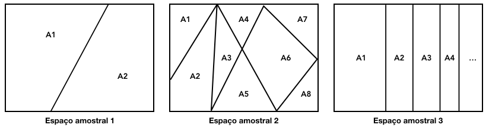
<p class="caption">(\#fig:ch4-particao)Exemplos de partições do espaço amostral.</p>
</div>


## Teorema da Probabilidade Total: ...dividir para conquistar!


O primeiro resultado a ser analisado é o teorema da probabilidade total, inspirado pelo princípio que os antigos romanos chamavam de "dividir para conquistar", ilustrado no diagrama abaixo.


<div class="figure">

<p class="caption">(\#fig:ch4-TPT)Ilustração do Teorema da Probabilidade Total.</p>
</div>


Queremos calcular a probabilidade do evento B, representado no diagrama pela elipse em vermelho. No entanto, pode ser que seja muito difícil calcular essa probabilidade a partir da análise do espaço amostral. Então vamos tentar analisar o espaço amostral por partes: a caixa retangular representa o espaço amostral $\Omega$; vamos, então, escolher uma coleção de eventos $A_1, A_2, A_3, \ldots$, para os quais conseguimos calcular as probabilidades, de tal forma que esta coleção forme uma partição do espaço amostral, ou seja, esses eventos são mutuamente exclusivos e coletivamente exaustivos. 

**Partição do Espaço Amostral:** $\Omega = \cup_i A_i$  

De que maneira isto nos ajuda a calcular a probabilidade do evento B? Bem, como a união de todos os eventos $A_i$ corresponde ao espaço amostral, vamos então reescrever o evento B em termos dessa partição:

$B = B\cap \Omega = B \cap (\cup_i A_i) = \cup_i (BA_i) = (A_1B) \cup (A_2B) \cup \ldots \cup (A_kB)$  

O evento $B$ pode ser escrito como a interseção de $B$ com o espaço amostral, que por sua vez, é equivalente à união dos eventos que formam a partição. Sendo assim, o evento $B$ pode ser representado pela união das interseções de $B$ com cada um dos eventos que formam a partição. Note que, como os eventos que formam a partição são mutuamente exclusivos, também são mutuamente exclusivas as interseções dos eventos da partição com o evento $B$.

Sendo assim, utilizando as propriedades derivadas dos axiomas, podemos concluir que a probabilidade de $B$ vai ser igual a soma de cada uma das probabilidade de $A_i$ interseção $B$:

$P[B] = \sum_{i=1}^{k} P[A_iB]$  

Ainda assim, pode ser que não tenhamos meios de calcular as probabilidades dos termos $A_i\cap B$. Utilizando a regra do produto, podemos reescrever cada probabilidade conjunta de $A_i\cap B$ como sendo o produto da probabilidade condicional de B com relação ao evento da partição $A_i$ pela probabilidade de ocorrência de $A_i$. Obviamente, as probabilidades dos eventos que formam a partição são não nulas, pois nenhum evento que forma a partição pode ser o evento impossível.

De maneira resumida, o teorema da probabilidade total nos diz que podemos particionar o espaço amostral de uma maneira que nos seja conveniente (isto é, de forma que possamos calcular as probabilidades dos eventos que compõe a partição) para que, a partir daí, possamos calcular mais facilmente a probabilidade do evento $B$.

Se $P[A_i] >0, \quad i= 1, \ldots, k$:
$\quad P[B] = \sum_{i=1}^{k} P [B\cap A_i] = \sum_{i=1}^{k} P[B|A_i] P[A_i]$


## Teorema de Bayes: ...aprendendo pela experiência


Esse teorema representa o aprendizado pela experiência, em que experiência se refere a novas evidências, ou informação adicional que é obtida. O teorema de Bayes é comumente utilizado para realizar inferência, em que existe um certo número de causas que podem produzir um determinado efeito. O teorema de Bayes se aplica a situações em que  observamos o efeito e desejamos inferir a causa que o provocou.

Observamos o efeito representado pelo evento $B$; isso significa que o evento B constitui a evidência obtida e agora queremos determinar que possível causa, dentre os eventos $A_1, A_2, \ldots, A_k$, o provocou. Conhecemos as probabilidades a priori $P[A_i]$ das possíveis causas; elas são as probabilidades válidas antes da obtenção da nova evidência.

Com a observação do efeito $B$, obtemos informação adicional. Portanto, é necessário atualizar a crença a respeito das possíveis causas à luz dessa nova evidência.  Isto se dá através do cálculo das probabilidades *a posteriori* (que são probabilidades condicionais) de cada uma das possíveis causas, dado que o efeito $B$ foi observado. 


<div class="figure">
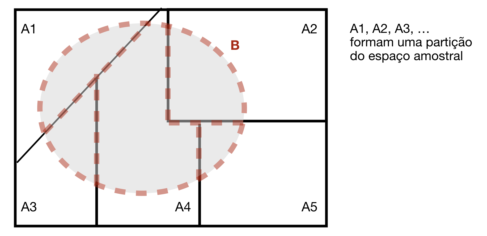
<p class="caption">(\#fig:ch4-TBayes)Ilustração do Teorema de Bayes.</p>
</div>

Novamente, temos uma partição adequada do espaço amostral formada pelos eventos A1,...,Ak associados às causas; o evento B representa o efeito. Tanto os eventos que formam a partição, quanto o evento B não podem ser o evento impossível, então esses eventos têm valor de probabilidade maior do que zero.

$P[B] > 0$;   
$P[A_i] > 0, \quad i =1, \ldots,k$  

A probabilidade a posteriori desejada é a probabilidade condicional de a causa $A_j$ estar presente dado que o efeito B foi observado, e corresponde à razão entre a probabilidade conjunta de $A_j$ e $B$ dividida pela probabilidade de ocorrência do evento $B$. 

$$ P[A_j|B] = \frac{P[A_jB]}{P[B]} =\frac{P[B|A_j]P[A_j]}{\sum_{i=1}^{k} P[B|A_i] P[A_i]},  \qquad \forall \; j= 1, \ldots, k$$

onde:  

$P[A_i], P[A_j]$ : probabilidades *a priori*   
$P[B|A_i]:$ prob. de observar o efeito B quando a causa ${A_i}$ está presente;   
$P[A_j|B]:$ prob. de que a causa ${A_j}$ esteja presente, dado que o efeito ${B}$ foi observado.

No teorema de Bayes, a probabilidade conjunta do numerador foi reescrita com o auxílio da regra do produto como sendo a probabilidade condicional do efeito B dado que a causa $A_j$ estava presente vezes a probabilidade de a causa $A_j$ estar presente; no denominador, a probabilidade de $B$ foi reescrita na forma do teorema da probabilidade total, ou seja, em termos da partição do espaço amostral como função das possíveis causas.


::: {.example #unnamed-chunk-1 name="Utilizando os teoremas fundamentais da probabilidade para realizar inferência"}
:::


Vamos supor que um paciente tenha sido submetido a um exame de raio-X e que uma mancha tenha sido observada. Esta é a evidência, o efeito que foi observado, o evento $B$.

Vamos supor, ainda, que estejamos interessados em determinar o que pode ter provocado esse efeito. Aí entra a necessidade da escolha inteligente de uma partição do espaço amostral; precisamos escolher uma partição do espaço amostral que ajuda a resolver o problema de nosso interesse.

Queremos determinar as chances de que essa mancha seja explicada por uma das potenciais causas apresentadas abaixo; essas possíveis causas precisam ser mutuamente exclusivas e coletivamente exaustivas a fim de constituir uma partição do espaço amostral:

+ Causa A1: o paciente tem COVID-19   
+ Causa A2: o paciente tem tuberculose   
+ Causa A3: outra causa   

Note que estamos preocupados em identificar se a mancha foi provocada por COVID-19 ou tuberculose; não estamos preocupados com as outras inúmeras possíveis explicações para a ocorrência de uma mancha num exame de raio-x. Não me interessa se o paciente está com pneumonia, se o paciente aspirou algum corpo estranho ou se o aparelho de raio-x está com defeito. Por esse motivo, a minha partição é formada pelos eventos: causa A1 (o paciente tem covid-19), causa A2 (o paciente tem tuberculose) ou causa A3 (a mancha foi provocada por outra causa).

Queremos então, calcular as probabilidades *a posteriori* dessas causas, dado que observamos uma mancha no exame de raio-X. Essas probabilidades podem ser calculadas utilizando o teorema de Bayes, mas para isso, são necessárias  algumas informações: precisamos conhecer as probabilidades *a priori* de cada uma das causas consideradas, bem como a probabilidade de observar uma mancha no raio-X,  independentemente da causa.

Considerando a história médica do paciente e, com base apenas no conhecimento da incidência dessas doenças na população brasileira, sabe-se que ele pode ter as possíveis condições (causas) com as seguintes probabilidades:

$${P[A1] = 0,02;  \quad  P[A2] = 0,01;  \quad  P[A3] = 0,97}$$ 
A avaliação do exame de raio-X nem sempre é perfeita e, por este motivo, nem sempre é possível chegar à conclusão correta. Tem-se as seguintes probabilidades de observar uma mancha no exame, dado que está presente cada uma das causas:

$${P[B|A1] = 0,90;  \quad  P[B|A2] = 0,95;  \quad  P[B|A3] = 0,07}$$ 

Na posse dessas informações, e *dado que a mancha foi observada, qual a probabilidade de o paciente ter COVID-19?*

Queremos: $P[A1|B]$

O primeiro passo consiste em representar no espaço amostral a partição considerada, composta pelos eventos $A1$, $A2$ e $A3$; e também vamos representar no espaço amostral o evento $B$. As interseções entre os eventos que formam a partição do espaço amostral e o evento $B$ formam uma partição de $B$. E, assim, podemos reescrever o evento $B$ em termos dessa partição.

Espaço amostral: $\Omega$  


<div class="figure">

<p class="caption">(\#fig:ch4-raio-x-venn)Representação do espaço amostral para o exemplo do raio-X.</p>
</div>


$A1$, $A2$, $A3$ formam uma partição de ${\Omega}$  
$A1B$, $A2B$, $A3B$ formam uma partição de $B$:  $A1B \cup A2B \cup A3B = B$

Usando a definição de probabilidade condicional, a probabilidade de que o paciente tenha COVID-19, dado que a mancha foi observada é dada pela razão da probabilidade da ocorrência simultânea de COVID-19 e de uma mancha no raio-X e a probabilidade de haver uma mancha no exame de raio-X. Com o auxílio da regra do produto, o numerador é reescrito em termos da probabilidade condicional de observar uma mancha no exame de raio-X, quando o paciente está acometido de COVID-19 vezes a probabilidade de que o paciente tenha COVID-19. E o denominador pode ser calculado através do teorema da probabilidade total, com base na partição do espaço amostral considerada.

$$P[A1|B] = \frac{P[A1B]}{P[B]} \stackrel{regra\\ prod.}{=}\frac{P[B|A1] P[A1]}{P[B]}$$

Precisamos calcular a probabilidade $P[B]$ utilizando uma partição adequada.  

Partição de $B$: $\quad B = A1B \cup A2B \cup A3B$

Portanto, 


\begin{align*}
P[B] 
&= P[A1B ∪ A2B ∪ A3B]\\
&= P[A1B] + P[A2B] + P[A3B]\\
&= P[B|A1] P[A1] + P[B|A2] P[A2] + P[B|A3] P[A3]\\
&= 0,9 \times 0,02 + 0,95 \times 0,01 + 0,07 \times 0,97 = 0,0954
\end{align*}


$P[B]$ é a probabilidade da união dos eventos que constituem uma partição de $B$; como esses eventos são mutuamente exclusivos, a probabilidade da união é igual à soma das probabilidades de cada um deles. E essas probabilidades conjuntas podem ser reescritas em função das probabilidades condicionais e probabilidades *a priori* conhecidas de cada uma das causas estar presente. Então, a probabilidade de ocorrência de uma mancha no exame de raio-X, qualquer que seja a causa, vale  aproximadamente 9,5%.

E, assim,

$$P[A1|B] = \frac{P[B|A1]P[A1]}{P[B]}=\frac{0,9 \times 0,02}{0,0954} = \frac{0,0180}{0,0954} = 0,1887.$$

Portanto, a probabilidade de o paciente ter COVID-19, dado que a mancha foi observada vale aproximadamente 19%. Podemos repetir o mesmo procedimento para as outras causas, obtendo as seguintes probabilidades:  
$P[A2|B] = 0,0996$ e $P[A3|B] = 0,7117$.

Chegamos à conclusão que a probabilidade de o paciente ter tuberculose é de cerca de 10% e a probabilidade de o paciente não ter essas doenças é próxima de 71%, dado que foi detectada uma mancha no exame de raio-X.

Podemos fazer algumas reflexões a respeito desses resultados obtidos: antes do exame de raio-X, havia uma probabilidade *a priori* igual a 2% de o paciente ter COVID-19. Após o resultado positivo do exame (a observação da mancha), essa probabilidade passou a ser de aproximadamente 19% de que o paciente esteja com COVID-19. Nossa crença a respeito da presença da causa COVI-19 aumentou de 2% para 19%, após as evidências que foram obtidas.  Esta é exatamente a ideia central que o Teorema de Bayes representa e que esse exemplo bem ilustra: quando novas evidências são obtidas, a crença original (*a priori*) é atualizada (*a posteriori*) . No exemplo, se o médico desejar ter mais certeza de que o paciente, de fato, tem COVID-19, novas evidências são necessárias (ou seja, o paciente pode ser submetido a exames adicionais). E, assim, a probabilidade de o paciente ter COVID-19 pode ser novamente atualizada.

<!--chapter:end:04-ch4.Rmd-->

# Variáveis Aleatórias e Distribuições


A partir de agora, nosso estudo de teoria de probabilidades começa a ficar mais interessante, pois  vamos introduzir o conceito de variáveis aleatórias, que nos permitirá analisar situações de incerteza muito mais complexas do que vimos até então.

Iniciaremos relembrando brevemente o que vimos dos fundamentos de teoria de probabilidades.

Vimos que, para um experimento aleatório E, ao determinar o espaço amostral associado a este experimento (que consiste no conjunto de todos os resultados possíveis) e, ao definir a função de probabilidade a cada evento do espaço amostral (que representa a crença na propensão da ocorrência de cada evento do espaço amostral) temos uma descrição probabilística completa da situação de incerteza representada pelo experimento:

$E$: experimento aleatório;  
$\Omega$: espaço amostral associado a E; e   
$P$: função de probabilidade definida em todo evento $A \in \Omega$   
...fornecem uma **descrição probabilística completa** do experimento em questão!

Por exemplo, se considerarmos o experimento aleatório que consiste em lançar uma moeda honesta e observar o resultado obtido, a descrição completa dessa situação de incerteza é dada pelo espaço amostral (que contém todos os resultados possíveis do experimento, que neste caso, é o conjunto dos resultados cara ou coroa), bem como a definição da lei de probabilidade associada a cada elemento no espaço amostral:

$E$: Lançar uma moeda honesta e observar o resultado.  
$\Omega = \{cara, coroa\}$  
$P[cara] = 1/2$  
$P[coroa] = 1/2$  

Agora, imagine que estejamos diante de uma situação um pouco mais complexa, em que se deseja conduzir uma pesquisa de opinião a fim de obter informação a respeito do apoio de um grupo a uma certa causa. Para isso, uma amostra de 50 pessoas pertencentes a esse grupo que serão entrevistadas foi selecionada. Cada pessoa entrevistada vai, então, manifestar a sua opinião, respondendo: "sou favorável" ou "não sou favorável" à causa em análise.

De que maneira podemos representar o espaço amostral associado a esse experimento?

Registrando o valor "1" para representar uma resposta positiva e o valor "0" para representar uma resposta negativa, o espaço amostral associado a este experimento é definido por todas as n-uplas de tamanho 50, que representam todas as respostas possíveis para os 50 indivíduos que compõe a amostra:

$$\Omega = \{ (0, 0, \ldots, 0), (1, 0, \ldots, 0), \ldots, (0, 0, \ldots, 1), (1, 1, \ldots, 0), \ldots, (1, 1, \ldots, 1)\}$$

Podemos ter todas as respostas negativas; ou podemos observar apenas uma resposta positiva e, neste caso, precisamos registrar se foi o primeiro entrevistado a dar seu voto favorável, ou apenas o segundo, ou apenas o terceiro, e assim sucessivamente, até o último entrevistado; ou podemos ter apenas duas respostas positivas e, assim, por diante, até chegar ao último resultado possível, que corresponde a todos os 50 indivíduos entrevistados apresentando seu apoio em favor da causa.  

A cada elemento desse espaço amostral está associado um valor definido pela lei de probabilidade e, a partir daí, podemos calcular qualquer probabilidade relativa a este experimento. Não há problema algum com esse procedimento, exceto pelo fato de que este espaço amostral tem $2^{50}$ elementos! E, com isso, precisaríamos definir $2^{50}$ valores de probabilidade, um para cada elemento que compõe o espaço amostral.

No entanto, a questão que de fato importa é a seguinte: será que nós estamos realmente interessados na **descrição probabilística completa** desse experimento? Ou será que estamos interessados em apenas um **aspecto específico** do experimento? Será que é necessário descrever completamente esse experimento aleatório, ou podemos analisar apenas os aspectos de interesse?

Por exemplo, se estivermos interessados em responder apenas à pergunta: *"Qual a probabilidade de que no mínimo 26 das 50 pessoas apoiem a causa?"*  Como é possível transformar o espaço amostral para simplificar sua análise, reduzindo-o a fim analisar apenas os aspectos de interesse?

Podemos definir uma variável que captura a essência do problema:

$X$ = no. de pessoas que apóiam a causa, dentre as 50 entrevistadas.

O experimento aleatório associado consiste em:

$E$ = entrevistar 50 pessoas e registrar o número de respostas favoráveis.

Agora, o espaço amostral correspondente é dado por:

$$\Omega = \{0, 1, 2, \ldots, 50\}$$

...que é muito menor e, portanto, mais fácil de lidar!

Isso equivale a construir um novo experimento aleatório que agora consiste em entrevistar 50 pessoas e registrar, não a resposta de cada indivíduo, mas apenas o total de respostas favoráveis. Com isso, temos um novo espaço amostral associado a esse novo experimento. Neste caso, o espaço amostral passa ser composto pelos resultados 0, 1, 2, até 50 (representando, respectivamente os resultados em que nenhum, um, dois até 50 respostas favoráveis foram obtidas). Este novo espaço amostral tem apenas 51 elementos e, portanto, é muito mais fácil de analisar e de determinar os valores de probabilidade associados a cada elemento desse novo espaço amostral!

Portanto, chegamos à conclusão de que escolha do espaço amostral associado a uma situação de incerteza não é única, mas depende da quantidade de detalhes do fenômeno aleatório que queremos incluir no nosso modelo. Ao definir a quantidade $X$, definimos um mapeamento ou uma função do espaço original para um novo espaço amostral que pode ser mais facilmente analisado do que o espaço amostral original, como veremos a seguir.


## Variáveis Aleatórias  


### Definição (caso unidimensional)  {-}


Uma variável aleatória (v.a.) é uma **função** que associa cada elemento do espaço amostral (descrito com palavras) a um número real, i.e., **v.a. é uma representação matemática dos eventos de um espaço amostral**, ou seja, embora o nome dessa quantidade seja *variável*, ela é uma *função* que vai associar a cada elemento $s$ do espaço amostral um número real $x$, que corresponde ao valor assumido pela função $X(s)$. 

Assim, a função variável aleatória tem o domínio no espaço amostral, e o contra-domínio no conjunto dos números reais. Portanto, a probabilidade do evento $s$, que é um elemento do espaço amostral, é igual à probabilidade de que a variável aleatória $X$ associada a esse evento assuma o valor $x$; e essa probabilidade é representada simplesmente por $p(x)$. E, é claro, $p(x)$ deve satisfazer os axiomas de Kolmogorov a fim de que seja uma função probabilidade válida.


**Notação:**

$X(\cdot): \Omega \rightarrow \Re$ 

onde $s$ é qualquer evento em $\Omega$

Probabilidade do evento $s$:
$\{X(s) = x\} \; \Rightarrow \; P[X(s) = x] = P[X = x] = p(x)$


Aqui há uma observação importante a ser feita: representaremos uma variável aleatória, isto é, a função, por letra maiúscula, $X$; já o valor observado dessa função, que corresponde a uma realização dessa variável aleatória, ou os valores que essa variável aleatória pode assumir, serão representados por letras minúsculas, $x$.


### Tipos de Variáveis Aleatórias {-}


Neste curso, trataremos de variáveis aleatórias quantitativas. E essas variáveis quantitativas podem ser classificadas como sendo discretas ou contínuas.


**V.A.'s Discretas**

Uma v.a. $X$ é dita **discreta** quando o espaço amostral associado a ela é enumerável, podendo ser finito ou infinito, isto é, se assumir um número **finito** ou **infinito e enumerável** de varlores reais distintos $x_1, x_2, \ldots, x_n, \ldots$. Este é o caso quando anlisamos um processo aleatório que envolve a contagem do número de certas ocorrências: por exemplo, quando quero monitorar o número de caras em 10 lançamentos de uma moeda honesta, ou quantas vezes tenho que lançar uma bola de basquete até que eu acerte a cesta, ou posso estar interessada no número de pessoas que chegaram a uma agência bancária entre meio dia de 1h da tarde e assim por diante. Ou seja, estou modelando um processo aleatório que envolve contagem.  

**V.A.'s Contínuas**

Uma v.a. $X$ é dita **contínua** quando está associada a um espaço amostral não enumerável, ou seja, temos uma quantidade infinita de elementos e é impossível enumerável-los, ou seja, se assumir um número  **infinito não-enumerável** de varlores reais e a probabilidade de que $X$ assuma um valor em particular é nula. Este é o caso quando estamos diante de uma situação em que o resultado do experimento aleatório é uma medição, por exemplo: o tempo de duração de um atendimento médico, o comprimento de uma peça produzido por um determinado processo industrial, o tempo de vida de um equipamento eletrônico e assim por diante.

Vejamos alguns exemplos de variáveis aleatórias discretas e contínuas:


::: {.example #unnamed-chunk-1}
:::


Componentes eletrônicos fabricados em uma linha de produção são submetidos a inspeção, sendo classificados como defeituosos ou não-defeituosos (só existem essas duas possibilidades). Suponha que a probabilidade de um item defeituoso seja 0,1.

O espaço amostral associado a esse experimento é formado por dois únicos resultados possíveis: o item é classificado como defeituoso ou não-defeituoso; e, portanto, está associado a uma v.a. discreta, pois temos um conjunto de resultados possíveis finito e enumerável:

${\Omega = \{D, N\}}$   (discreto: no. finito de possibilidades)

Podemos definir a variável aleatória $X$ que vai assumir valor zero, se o item é defeituoso; e  valor um, se o item é não defeituoso. 

$${X = \left\{
      \begin{array}{ll}
      0, & \textsf{ se o componente é defeituoso}\\
      1, & \textsf{ se o componente é não-defeituoso}
      \end{array} \right.}$$

Com isso, cria-se uma função (a variável aleatória $X$) que mapeia cada elemento do espaço amostral a um número real.

Podemos representar as probabilidades dos eventos do espaço amostral em termos da variável aleatória definida: a probabilidade de o item ser defeituoso corresponde à probabilidade de que $X$ assuma valor 0 (que vale 0,1);  a probabilidade de o item ser não-defeituoso corresponde à probabilidade de que $X$ assuma valor 1 (que vale 0,9). Podemos também representar graficamente os valores de probabilidade associados aos valores da va. $X$.  

$P[D] = P[X = 0] = 0,1$  
$P[N] = P[X = 1] = 0,9$


::: {.example #unnamed-chunk-2}
:::


Vamos imaginar que estejamos interessados agora em outro aspecto do mesmo experimento aleatório: monitorar o número de itens produzidos até observar o primeiro defeituoso. Isto define a variável aleatória de interesse.

$X$ = no. de itens produzidos até a observação do primeiro defeituoso.

O espaço amostral, nesse caso, é formado pelos seguintes eventos: se o primeiro item produzido for defeituoso, temos o evento 'D' e acabou o experimento; se o primeiro item for não defeituoso e o segundo for defeituoso temos o evento 'ND', e assim, sucessivamente. Pode até ser que não se observe nenhum item defeituoso, indefinidamente... Perceba que este espaço amostral tem um número infinito de elementos. No entanto, podemos enumerá-los. E, como temos um conjunto enumerável de possibilidades a variável aleatória $X$ aqui representada, é uma v.a. discreta.

+ Espaço amostral: ${\Omega = \{D, ND, NND, NNND, \ldots\}}$   
+ ${X(\underbrace{NNN \ldots N}_{i-1}D) = i}$


::: {.example #unnamed-chunk-3}
:::


Seja a v.a. definida pelo tempo de espera (em segundos) para que duas mensagens cheguem a uma caixa de email. Esta é uma medida de tempo e vamos assumir que nosso cronômetro tenha precisão infinita. Então, o espaço amostral é definido por um intervalo, que tem uma quantidade infinita e não enumerável de possibilidades. Portanto, a va. $X$ associada a esse espaço amostral é contínua. 

+ Espaço amostral: ${\Omega = \{ x \in \Re: x \geq0\}}$ (contínuo)


::: {.example #unnamed-chunk-4}
:::


Sabe-se que uma máquina de envase de suco de laranja preenche os recipientes com um volume entre 0,9L e 1,1L. Seja $X$ a v.a. que registra o volume de suco no recipiente. Novamente, assumiremos que nosso instrumento de medição tem precisão infinita. O espaço amostral é definido por todos os volumes possíveis entre 0,9 e 1,1L. Esse é um espaço amostral com um número infinito e incontável de possbilidades e, portanto, a variável $X$ é uma v.a. contínua.

+ Espaço amostral: ${\Omega = \{ x \in \Re: 0,9 < x < 1,1 \}}$ (contínuo)

Começamos a perceber que essas v.a.'s definidas nos exemplos anteriores passam a transformar um espaço amostral em outro que seja mais conveniente, para os propósitos da investigação de interesse.

Em outras palavras, as v.a.'s servem para reduzir a complexidade do espaço amostral associado a um experimento aleatório, ao proporcionar uma descrição matemática mais sucinta, com menor nível de detalhamento do que a descrição completa do fenômeno aleatório sendo investigado, e que se relaciona mais diretamente com os aspectos de interesse desse experimento.

Ao criar um artifício matemático que simplifica os cálculos de probabilidade, obviamente há um preço a ser pago: precisamos agora **determinar a distribuição de probabilidades** associada à v.a. $X$ que, para uma v.a. discreta, corresponde aos valores de probabilidade associados cada valor que essa v.a. assume. É isso o que veremos a seguir.


## Distribuições de Probabilidade


### Função Distribuição de Probabilidade (fdp): caso discreto {-}


Uma vez definida a variável aleatória $X$, o espaço amostral $\Omega$ perde sua importância;  para descrever toda a informação probabilística a respeito da variável aleatória discreta $X$, basta identificar todos os valores discretos $x_1, x_2, \ldots$, que a variável aleatória $X$ pode assumir e os valores de probabilidade correspondentes. Essa informação está contida na função distribuição de probabilidade de $X$, dada pela função:


\begin{align*}
  f_X(\cdot): \Re \rightarrow [0,1] \quad \text{tq} \quad {f_X(x)} =
  \left\{
  \begin{array}{ll}
    P[X=x_j], & \text{ se } x = x_j, \\
    0, & \text{ se } x \neq x_j
  \end{array} 
  \right.
  \\
  \quad j = 1, 2, \ldots, n, \ldots
\end{align*}  


$f(x)$ tem como domínio o conjunto dos números reais (e isto é uma consequência da definição de variável aleatória que, por sua vez, tem domínio no espaço amostral e contradomínio na reta real). Como os valores da função distribuição de probabilidade, no caso discreto, representam valores de probabilidade, a fdp tem contradomínio no intervalo real de 0 a 1.

A função distribuição de probabilidade vai corresponder ao valor da probabilidade para cada um dos pontos em que a v.a. discreta $X$ está definida; e vale zero, para valores diferentes daqueles que a v.a. $X$ pode assumir (isso significa que a probabilidade de que $X$ assuma um valor não admissível é zero, ou seja, a probabilidade de um resultado impossível vale zero!) 

Sendo assim, a fdp indica como a probabilidade total está distribuída por todos os valores que a v.a. $X$ pode assumir;  os valores de uma v.a. discreta geralmente são chamados de **pontos de massa** e, por este motivo, também é comum que a fdp seja chamada **função massa de probabilidade**.

Precisamos garantir que a fdp seja uma função probabilidade, ou seja, que respeite as condições dadas pelos axiomas de Kolmogorov. Sendo assim, essa função não pode assumir valores negativos; ela vale zero para os pontos em que a v.a. $X$ não está definida; e, finalmente, a soma de todos os valores de probabilidade para os pontos em que ela está definida vale 1:

1. ${f_X(x_j) \geq 0}$ para  ${j = 1, 2, \ldots, n, \ldots}$  
2. ${f_X(x_j) = 0}$ para  ${x \neq x_j; \quad j = 1, 2, \ldots, n, \ldots}$  
3. ${\sum_j f_X(x_j) = 1}$


::: {.example #unnamed-chunk-5 name="Computadores defeituosos"}
:::


Um lote de 8 computadores em uma loja contém 3 defeituosos.
Um cliente seleciona 2 destes computadores ao acaso para comprar.  
Qual a distribuição de probabilidade para o número de computadores defeituosos comprados?


::: {.solution}
:::


Em primeiro lugar, precisamos identificar qual é a v.a. de interesse e quais os valores que essa variável aleatória pode assumir. Às vezes, essa tarefa se torna mais fácil identificando o espaço amostral associado ao experimento aleatório em questão. 

Note que a pergunta já orienta a identificação da variável aleatória envolvida. Então, vamos escolher a v.a. $X$ como sendo o número de computadores defeituosos comprados pelo cliente. Ele comprará 2 computadores e, dentre eles, pode ser que nenhum seja defeituoso, ou apenas um deles seja defeituoso ou os dois computadores comprados sejam defeituosos; isso, por sua vez, define o espaço amostral associado a este experimento. Portanto:

$X$ = no. de computadores defeituosos comprados pelo cliente  
${\Omega = \{0,1,2\}}$  

A fim de determinar a fdp de $X$, devemos calcular os valores das probabilidades para todos os elementos do espaço amostral:


\begin{align*}
 & f_X(0) = P[X=0] = \frac{\binom{3}{0}\binom{5}{2}}{\binom{8}{2}} = \frac{10}{28}\\
 & f_X(1) = P[X=1] = \frac{\binom{3}{1}\binom{5}{1}}{\binom{8}{2}} = \frac{15}{28}\\
 & f_X(2) = P[X=2] = \frac{\binom{3}{2}\binom{5}{0}}{\binom{8}{2}} = \frac{3}{28}
\end{align*}


A probabilidade de que nenhum computador seja defeituoso é a probabilidade de que a v.a. $X$ assuma valor igual a zero. Essa probabilidade pode ser calculada pela definição clássica, como sendo a razão entre o número de resultados favoráveis e o número de resultados possíveis. No denominador de $f_X(0)$ temos um total de 8 computadores, dos quais escolheremos 2. O número de maneiras com que isso pode ser feito é dado pela combinação de 8, 2-a-2. Já no numerador, temos o no de resultados favoráveis: neste caso, nenhum computador defeituoso será selecionado a partir dos 3 defeituosos disponíveis e os dois computadores comprados serão selecionados a partir dos 5 não-defeituosos que existem na loja. Portanto, temos o produto da combinação de 3, 0-a-0 e da combinação de 5, 2-a-2. Isso nos dá uma probabilidade de 10/28.

Um procedimento análogo é realizado para os demais valores assumidos pela v.a. $X$. Para $X=1$, temos um computador selecionado a partir dos 3 defeituosos da loja e um computador selecionado a partir dos 5 não-defeituosos. O denominador é o mesmo, pois o número de resultados possíveis não se altera. A probabilidade de comprar apenas um computador defeituoso vale, então, 15/28. E, no caso de $X = 2$,  os dois computadores comprados são selecionados a partir do total de 3 defeituosos da loja.

Podemos organizar os valores de probabilidade calculados  em uma tabela, a fim de tornar mais explícita a apresentação da distribuição de probabilidade de $X$, ou, ainda, através de um gráfico de frequências.


<div class="figure">

<p class="caption">(\#fig:ch5-comp)Função distribuição de probabilidade do número de computadores defeituosos comprados.</p>
</div>


### Função Distribuição de Probabilidade (fdp): caso contínuo {-}


Vamos definir agora a função distribuição de probabilidade para variáveis aleatórias contínuas. 
Primeiro, vamos lembrar que variáveis aleatórias contínuas são associadas a processos aleatórios que descrevem algum tipo de medição. Se nós pensarmos bem, todas as medições são, de fato discretas (já que não temos precisão infinita), então, em princípio, tudo pode ser modelado por variáveis aleatórias discretas. O contínuo, na realidade não existe; v.a.’s contínuas são uma abstração matemática que ajudam a simplificar os cálculos. 

Podemos entender v.a.'s contínuas como o resultado de um processo de refinamento (infinito) de v.a.'s discretas. Vejamos, através de um exemplo, o que isso quer dizer:

Suponha que  uma v.a. discreta $X$, associada a um determinado experimento aleatório, cujos detalhes não nos interessam nesse momento, assuma o valor 3,5 com probabilidade $p$. Imagine que os valores assumidos por esta va são o resultado de uma medição e, que conseguimos melhorar nosso processo de medição, de tal forma que agora conseguimos obter o valor de mais uma casa decimal. Isso significa que o valor de  probabilidade $p$ associado ao valor 3,5 terá que ser distribuído entre todos os valores obtidos a partir do refinamento. Então, $p$ deve corresponder à soma das probabilidades de observar os valores entre 3,50 e 3,59. Cada um desses valores vai ocorrer com uma probabilidade, $p_i$:

$${p = P[X = 3,50] + P[X = 3,51] + ... + P[X = 3,59] = \sum_{i=1}^{10} p_i}$$

Se for possível uma nova melhoria no processo de medição, de forma que uma casa decimal adicional seja obtida, teremos para cada $p_i$ um refinamento equivalente, ou seja, o valor de cada probabilidade $p_i$ deverá ser redistribuído. A cada novo refinamento, o valor da probabilidade $p_i$ vai ficando cada vez menor. Se o processo de refinamento continua indefinidamente, cada $p_i$ tende a zero.  

A probabilidade de que $X$ assuma um valor com maior precisão (com mais casas decimais) vai se aproximando de zero e, no entanto, a probabilidade de que os valores possíveis para a v.a. se encontrem um determinado intervalo fixo que vai de $[a,b]$, neste exemplo  $a=3,50$  a $b=3,59$, se estabiliza.

Assim, a definição de função distribuição de probabilidade para o caso contínuo é um pouco diferente daquela que vimos para o caso discreto.

Para uma variável aleatória contínua, a fdp, também chamada de .stand-out[função densidade de probabilidade], é definida como sendo a função que tem domínio no conjunto dos reais (assim como antes, já que o domínio depende da definição da função v.a.), mas o contradomínio não é o intervalo entre 0 e 1; agora,$f$ pode assumir qualquer valor real não negativo.

Seja $X$ uma v.a. contínua. Definimos a fdp de $X$ como sendo a função:

${f_X(\cdot): \Re \rightarrow [0,\infty)}$ tal que, para quaisquer números ${a \leq b}$


\begin{align*}
  P[a \leq X \leq b] =\int_{a}^{b} f_X(u) du
\end{align*}


Veja, também, que agora a fdp para uma v.a. contínua não é definida como um valor de probabilidade. A probabilidade de que $X$ se encontre em uma faixa de valores que vai de $a$ até $b$ é dada pela integral definida de $a$ até $b$ da fdp de $X$.  

As condições para que esta função seja uma função probabilidade também decorrem da definição axiomática de Kolmogorov e consistem em: que a função $f_X(x)$ não assuma valores negativos; a integral de $f_X(x)$ sobre todo o seu domínio deve ser igual a 1; e , finalmente, a probabilidade de que $X$ assuma um valor fixo igual à constante real $C$ é nula (isso significa que, num espaço amostral infinito, a probabilidade de observar **exatamente** um valor real $C$ vale zero):

1. ${f_X(x) \geq 0, \; \forall x \in \Re}$   
2. ${\int_{-\infty}^{\infty} f_X(x) dx= 1}$    
3. ${P[X=c] =0, \; \forall c \in \Re}$  

Como consequência dessa definição, ao calcular a probabilidade de que $X$ se encontre num intervalo real que vai de $a$ até $b$, não faz diferença se as extremidades do intervalo são abertas ou fechadas. Portanto, para quaisquer números $\mathsf{a < b}$:

$${P[a \leq X \leq b] = P[a < X \leq b] = P[a \leq X < b] = P[a < X < b]}$$  
Desta maneira, decorre da definição que a  probabilidade de que $X$ se encontre no intervalo $[a,b]$ é dada pela área sob a curva da fdp de $X$ no intervalo $[a,b]$, como ilustra a figura.


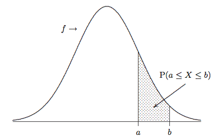


A fdp para uma v.a. contínua não pode ser entendida como a probabilidade de $X$ assumir um determinado valor.

$$P[a - \epsilon \leq X \leq a+ \epsilon] = \int_{a-\epsilon}^{a+\epsilon} f_X(u) du \stackrel{\epsilon \rightarrow 0}{\approx} 2 \epsilon f_X(a)$$

Para um intervalo de comprimento $2\epsilon$ centrado em $a$, conforme a largura do intervalo diminui (ou seja, fazendo $\epsilon$ tender a zero), o valor de probabilidade também tende a zero. Sendo assim, a fdp de $X$ em $a$ pode ser entendida como uma medida relativa da chance de que $X$ se encontre em uma .stand-out[vizinhança] de $a$ e pode assumir um valor arbitrariamente grande para $X=a$.


::: {.example #unnamed-chunk-7 name="Projétil"}
:::


Queremos construir um modelo probabilístico para o seguinte experimento:
um projétil atinge um disco de raio $r$ de maneira completamente arbitrária (isso significa que qualquer ponto do disco é igualmente provável e o projétil não pode cair fora do disco). Estamos interessados na distância $X$ entre o ponto atingido pelo projétil e o alvo (centro do disco). A fdp de $X$ é dada por:


\begin{align*}
  f_X(x) = 
  \left\{
  \begin{array}{ll}
    \frac{2x}{r^2}, & 0 \leq x \leq r \\
    0, & \text{caso contrário}
  \end{array} 
  \right.
\end{align*}  


1. Verifique que a condição (2) é válida.   
2. Calcule $P[0 < X \leq r/2]$.  


::: {.solution}
:::


1. Condição (2): $\int_{-\infty}^{\infty} f_X(x) dx = 1$

$$\int_{-\infty}^{\infty} f_X(x) dx = \int_{0}^{r} \frac{2x}{r^2} dx = \frac{2}{r^2}\left[\frac{1}{2}x^2\right]_{0}^{r} = \frac{1}{r^2} [r^2 - 0] = 1  \qquad \therefore \qquad \text{OK!}$$

2. Para determinar a probabilidade de que o projétil esteja a uma distância máxima do cento igual à metade do raio do disco, vamos calcular a integral de zero a $r/2$ da fdp de $X$. 

$$P[0 < X \leq r/2] =  \int_{0}^{r/2} \frac{2x}{r^2} dx = \frac{2}{r^2}\left[\frac{x^2}{2}\right]_{0}^{r/2} = \frac{1}{r^2}\left[\frac{r^2}{4} - 0 \right] = \frac{1}{4}$$

Veja que esta probabilidade encontrada independe do raio $r$ do disco!


### Função Distribuição Acumulada (FDA) {-}


É possível representar a distribuição de probabilidade de uma v.a. através de uma medida acumulada, a chamada **função distribuição acumulada**, ou FDA. Diferentemente da fpd, a FDA é **unicamente determinada** para cada v.a. e pode ser utilizada para calcular probabilidades associadas a essa v.a.

A FDA de uma v.a. $X$, representada por ${F_X(\cdot)}$ é a função:

\begin{align*}
  &{} {F_X(\cdot): \Re \rightarrow [0, 1]\qquad \text{tq} \qquad
      F_X(x) = P[X \leq x], \quad -\infty < x < \infty}
\end{align*}

A FDA de uma v.a. $X$  consiste em uma função com domínio no conjunto dos reais, que assume valores no intervalo $[0,1]$, pois representa um valor de probabilidade, independentemente se a v.a. é discreta ou contínua. A FDA é definida como sendo a probabilidade de que a v.a. $X$ assuma um valor menor ou igual a $x$, para qualquer valor de $x$ real. Para que seja FDA, a função  $F_X(x)$ deve satisfazer as seguintes condições:

1. ${F_X(\cdot)}$ é monotônica não-descrescente: $\;{F_X(x_1) < F_X(x_2), \; x_1 < x_2}$

2. ${F_X(-\infty) = \lim_{x \rightarrow -\infty}F_X(x) = 0}$  e ${F_X(+\infty)  = \lim_{x \rightarrow +\infty}F_X(x) = 1}$

3. ${F_X(\cdot)}$ é contínua pela direita: ${F_X(x) = \lim_{0<h \rightarrow 0} F_X(x+h)}$

A FDA precisa ser uma função monotônica não decrescente, de forma que, dados dois números reais $x_1$ estritamente menor que $x_2$, então a função em $x_1$ tem de ser estritamente menor que a função em $x_2$. Como a FDA representa uma probabilidade acumulada, $F_X(-\infty) = 0$ significa que em $-\infty$ nenhum valor de probabilidade foi acumulado (a probabilidade de observar um valor menor ou igual a menos infinito é zero); por outro lado, quando vamos para a outra extremidade da reta real, representada por $\infty$, todo o domínio foi varrido e todos os valores de probabilidade já foram acumulados, portanto $F_X(\infty) = 1$. Além disto, a FDA é uma função contínua pela direita. Toda função que satisfaça essas condições é uma FDA.

Seguem algumas consequências dessas condições:


::: {.theorem #unnamed-chunk-9}
:::


Dado ${x}$ qualquer,
    $${P[X > x] = 1- F_X(x)}$$


::: {.theorem #unnamed-chunk-10}
:::


Dados ${x_1}$ e ${x_2}$ tais que ${x_1 < x_2}$,

$${P[x_1< X \leq x_2] = P[X \leq x_2] - P[X \leq x_1]}$$

Esta situação é ilustrada na figura pela área em vermelho menos a área em azul, que corresponde à área sob a fdp entre $x_1$ e $x_2$.


+ ${F_X(\cdot)}$ pode ser obtida a partir de ${f_X(\cdot)}$ e vice-versa.

É necessário fazer a distinção entre o caso discreto e o caso contínuo.

**Caso Discreto:**  

i. Dada ${f_X(\cdot)}$,  
   ${F_X(x) = P[X \leq x] = \sum_{x_j <x}f_X(x_j)}$

ii. Dada ${F_X(\cdot)}$,  
    ${f_X(x_j) = F_X(x_j) - \lim_{0<h \rightarrow 0} F_X(x_j - h)}$ 
    
Para o caso discreto, para obter a FDA a partir da fdp, basta somar as probabilidades nos valores que satisfazem a condição desejada. Para obter a fdp a partir da FDA, vamos utilizar a diferença dos valores de FDA em $x_j$ e o valor da FDA em $X$ imediatamente inferior a $x_j$.  

**Caso Contínuo:**

i. Dada ${f_X(\cdot)}$,  
   ${F_X(x) = P[X \leq x] = \int_{-\infty}^{x} f_X(u) du}$

ii. Dada ${F_X(\cdot)}$,  
    ${f_X(x) = \frac{dF_X(x)}{dx}}$

Para o caso contínuo, dada a fdp, a FDA em $x$ é dada pela integral de -infinito e o valor de $x$ desejado. Para obter a fdp a partir da FDA, basta tomar a derivada da FDA com relação a $x$. 

A seguir, são apresentados alguns exemplos de aplicação imediata desses conceitos.


::: {.example #unnamed-chunk-11 name="Computadores defeituosos, continuação"}
:::


a. Determine a FDA para a v.a.  
$X$ = no. de  computadores defeituosos comprados pelo cliente

b. Usando $F_X(x)$, verifique que $f_X(2) = 3/28$


::: {.solution}
:::


a. FDA de $X$:


Resposta: 

\begin{align*}
  {F_X(x)} =
  \begin{cases}
    0,       & \mathsf{x < 0}\\
    10/28,   & \mathsf{0 \leq x < 1}\\
    25/28,   & \mathsf{1 \leq x < 2}\\
    1,       & \mathsf{x \geq 2}\\
  \end{cases}
\end{align*}

b. ${f_X(2) = F_X(2) - F_X(1) = 1 - 25/28 = 3/28 \qquad \therefore}$ OK!


::: {.example #unnamed-chunk-13 name="Projétil, continuação"}
:::


+ Determine a FDA para a v.a.  $X$ = distância do projétil ao alvo

+ Usando ${F_X(x)}$, calcule ${P[r/2 < X \leq r]}$


::: {.solution}
:::


+ FDA de $X$:  
Temos: $\quad f_X(x) = \left\{ \begin{array}{ll} \frac{2x}{r^2}, & 0 < x < r\\ 0, & \textsf{caso contrário} \end{array} \right.$  

Portanto:
$$F_X(x) = P[X\leq x] = \int_{-\infty}^{x} f(u)du =
  \begin{cases}
    0, & \phantom{0 \leq \;} x \leq 0\\ 
    \int_{0}^{x} \frac{2u} {r^2} du  = \frac{2}{r^2} \left[ \frac{u^2}{2} \right]_{0}^{x} = \frac{x^2}{r^2}, & 0 \leq x < r \\
    1, & \phantom{0 \leq \;} x \geq r\\
  \end{cases}$$

+ $P[r/2 < X \leq r] = F_X(r) - F_X(r/2) = \frac{r^2}{r^2} - \frac{r^2}{4r^2} = 1 - \frac{1}{4} = \frac{3}{4}$  

Também independe do raio do disco...


## Valor Esperado e Variância


Até agora vimos que a distribuição de probabilidade de uma v.a. pode ser representada de várias formas: através da fdp; ou de uma medida acumulada, através da FDA; ou ainda graficamente ou através de valores tabelados (de maneira exata, para uma v.a. discreta e aproximadamente, para uma va contínua).

Tanto a função distribuição de probabilidade quanto a função distribuição acumulada são modelos matemáticos construídos com a finalidade de **resumir** ou representar matematicamente fenômenos aleatórios. No entanto, dependendo da complexidade da situação, especificar tais funções de maneira completa pode ser uma empreitada extremamente difícil. Então, novamente, devemos nos perguntar se é realmente necessário construir uma representação completa da situação de incerteza sendo investigada. Pode ser interessante observar, por exemplo, determinadas características dessa distribuição que nos ajudam a formar uma ideia a respeito da incertezas associadas à situação de interesse, sem a necessidade de construir uma descrição completa. 

Neste sentido, precisamos tratar, então, de dois conceitos muito importantes em teoria de probabilidades: **valor esperado** e  **variância**.

Para cada distribuição de probabilidade, no mundo de estatística paramétrica, temos   quantidades chamadas **parâmetros da distribuição**; são os parâmetros que determinam a distribuição de probabilidade e estes parâmetros estão associados aos diferentes **momentos** da distribuição (esse é um conceito que veremos mais adiante).

O valor esperado, por exemplo, corresponde ao primeiro momento da v.a. e está associado à localização do centro da distribuição, indicando quais são os valores típicos da v.a. em questão.
Já a variância está associada ao segundo momento da v.a e nos dá uma medida da dispersão ou do espalhamento dessa v.a.

O fato é que, ainda que não forneçam uma descrição completa, valor esperado e variância resumem características importantes da distribuição, que podem ser muito úteis no processo de tomada de decisão.


### Valor Esperado {-}


Seja $X$ uma v.a. O **valor esperado** de $X$, representado por ${\mu_X}$ ou ${E[X]}$, é definido como:

**Caso Discreto:**  
${E[X] = \sum_x x\cdot f_X(x)}, \quad$ para os pontos ${x}$  em que ${X}$  é definida.

**Caso Contínuo:**    
${E[X] = \int_{-\infty}^\infty x\cdot f_X(x) d(x)}, \quad$ onde ${f_X(x)}$ é a fdp de ${X}$.

É necessário verificar a existência do valor esperado através das condições abaixo, pois há certas distribuições para as quais não existe valor esperado.

**Existência de E[X]:** 
+ caso discreto: ${\sum_x |x|f_X(x) < \infty}$  
+ caso contínuo: ${\int_{-\infty}^{\infty} |x|f_X(x)dx < \infty}$ 

Vejamos, a seguir, alguns exemplos.


::: {.example #unnamed-chunk-15 name="Computadores defeituosos, continuação"}
:::


Vamos retomar o exemplo dos computadores defeituosos. A loja tem um total de 8 computadores, dos quais 3 são defeituosos. Um cliente compra dois dos computadores disponíveis. Qual o número de computadores defeituosos que se espera observar na compra do cliente?

A v.a. de interesse é o número de computadores defeituosos que o cliente acaba comprando. 


::: {.solution}
:::


Temos:  
$X$ = no. de computadores defeituosos comprados pelo cliente.   
A fdp dessa v.a. foi determinada anteriormente, de forma que o valor esperado de $X$ pode ser calculado através da soma ponderada de cada valor que $X$ pode assumir, em que os pesos correspondem às probabilidades de observar cada um dos valores assumidos pela v.a.:

i. Distribuição de probabilidade:  


ii. Valor esperado:  

\begin{align*}
\mu = {E[X]} &= {\sum_x x \cdot f_X(x)}\\
    &= {0\cdot f_X(0) + 1\cdot f_X(1) + 2\cdot f_X(2)}\\
    &= {0 + \frac{15}{28} + \frac{6}{28} = \frac{21}{28}}\\
    &= \text{0,75}
\end{align*}

Portanto, chegamos a conclusão de que o valor esperado vale 0,75, ou seja, se uma amostra de tamanho 2 for selecionada aleatoriamente inúmeras vezes a partir de um lote contendo 5 computadores perfeitos e 3 defeituosos, espera-se que a amostra contenha, em média, 0,75 computadores defeituosos.

Algumas observações são importantes: pode ser que para uma certa compra, todos os computadores sejam defeituosos; ou, ainda, na situação do extremo oposto, que o comprador tenha tido sorte e que tenha adquirido apenas computadores em perfeito estado, ou seja, em uma certa realização desse experimento aleatório, observaremos um dos valores possíveis para a variável aleatória $X$.No entanto, se esta compra for repetida muitas e muitas vezes, o número de computadores defeituosos dentre os dois adquiridos converge, em média para 0,75. Note que o valor esperado não precisa necessariamente ser igual a um dos valores possíveis para $X$. **O valor esperado corresponde ao valor para o qual converge a média de um número muito grande de observações de uma v.a.**


::: {.example #unnamed-chunk-17 name="Projétil, continuação"}
:::


Aqui, reconsideraremos o exemplo do projétil a fim de determinar a que distância do centro espera-se que o projétil atinja o disco. A v.a. de interesse é $X$, que corresponde à distância ao centro do disco atingida pelo projétil.


::: {.solution}
:::
  

Calculamos a fdp para essa variável aleatória anteriormente. E, como a v.a. é contínua, o valor esperado é obtido integrando em todo o domínio (que, neste caso corresponde aos valores de $x$ que vão de zero a $r$) o produto de $x$ por $f_X(x)$:

i. Distribuição de probabilidade:

${f_X(x) = \frac{2x}{r^2}, \quad 0 < x < r}$

ii. Valor esperado:
\begin{align*}
\mu = {E[X]} &= {\int_{-\infty}^{\infty} x \cdot f_X(x) dx}
    = {\int_{0}^{r} x \frac{2x}{r^2} dx} = {\left.\frac{2}{r^2}\frac{x^3}{3}\right|_{0}^{r}}
    = {\frac{2}{3}r}
\end{align*}

O valor esperado é igual a 2/3 de $r$.


#### Propriedades {-}


O valor esperado tem algumas propriedades: 

+ ${E[c] = c}$, para ${c =}$ constante;  
  Obviamente, o valor esperado de uma constante é a própria constante. A v.a. não é aleatória, portanto, o que esperar da média dessa variável? Que seja igual ao único valor que pode assumir.
  
+ ${\exists \,a = }$ constante t.q. ${P[X\geq a] = 1 \Longrightarrow E[X] \geq a}$  
  ${\exists \,b = }$ constante t.q. ${P[X\leq b] = 1 \Longrightarrow E[X] \leq b}$  
  Se existir uma constante $a$ tal que é certo que $X$ assume apenas valores maiores que essa constante, então o valor esperado da v.a. também precisa ser maior que essa constante $a$. Um resultado análogo é obtido se há certeza de que $X$ assume apenas valores menores que uma certa constante $b$.

+ ${X \sim f_X(x)}$ simétrica em torno de um ponto (a cte. ${\mu}$):
  $${f_X(x) = \varphi(x-\mu) = \varphi(\mu-x) \quad \Longrightarrow \quad E[X] = \mu}$$
  Se a distribuição de $X$ é simétrica em torno de um ponto, dado pela constante $\mu$, o ponto de simetria corresponde ao valor esperado, desde que ele exista, claro.   

Suponha agora que tenhamos uma va. $X$ e sua fdp correspondente. Estamos agora interessados em calcular não o valor esperado de $X$, mas o valor esperado de alguma função $g(X)$. Como devemos proceder? Bem, podemos raciocinar que, sendo $g(X)$ também uma v.a., também tem uma distribuição de probabilidade, que pode ser obtida a partir do conhecimento da distribuição de $X$. De posse da fdp de $g(X)$, bastaria utilizar, então, a definição de valor esperado, para determinar  $E([g(X)]$. Este procedimento está absolutamente correto, mas temos uma maneira mais fácil de calcular o valor esperado de $g(X)$: como a função $g(\cdot)$ assume valor $g(x)$ quando a va. $X$ assume valor $x$, parece intuitivo que o valor esperado de $g(X)$ deve ser uma soma ponderada dos valores possíveis de $g(X)$, em que os pesos correspondem às probabilidades de observar $X=x$. É possível demonstrar que essa conjectura é verdadeira e, portanto, podemos calcular o valor esperado de uma função de uma v.a. como mostrado abaixo.  

+ ${X \sim f_X(x)}$  
  **Caso discreto:** ${E[g(X)] = \sum_x g(x)\cdot f_X(x)}$  
  **Caso contínuo:** ${E[g(X)] = \int_{-\infty}^{\infty} g(x) \cdot f_X(x) dx}$
  
Consequentemente, quando esta função é uma transformação linear, sendo o valor esperado um operador linear, o valor esperado da transformação é igual à transformação aplicada ao valor esperado:  

+ ${g(X) = a X + b, \; a,b}$ constantes ${\Longrightarrow E[g(X)] = aE[X]+b}$

Na versão multidimensional dessa propriedade, se tivermos um conjunto de v.a.'s para as quais existe valor esperado (elas nem precisam ter a mesma distribuição) então o valor esperado de uma função linear dessas va's é igual à mesma função linear aplicada aos valores esperados das va's.

+ ${X_1, \ldots, X_n}\;$ v.a.'s t.q. ${\exists \, E[X_i], i=1, \ldots, n}$, $\quad{\forall \,a_1, \ldots, a_n, b}$ constantes  
  ${\Longrightarrow E[a_1 X_1 + \ldots + a_n X_n + b] = a_1 E[X_1] + \ldots + a_n E[X_n] + b}$  

E, finalmente, o valor esperado da soma de qualquer número de v.a.'s é igual à soma dos valores esperados individuais. 

+ ${X_1, \ldots, X_n}\;$ v.a.'s t.q. ${\exists \, E[X_i], i=1, \ldots, n}$  
  ${\Longrightarrow E[X_1 + X_2 + \ldots + X_n] = E[X_1] + \ldots + E[X_n]}$

Estes são resultados simples e extremamente relevantes, que utilizaremos muitas e muitas vezes.


### O Problema dos Pontos e a Aposta de Pascal {-}


Blaise Pascal (1623-1662) foi o primeiro a descrever como obter o valor esperado de uma aposta.  O chamado "Problema dos Pontos" foi uma das questões propostas pelo Chevalier de Méré a Pascal, que envolvia a partilha justa do prêmio de um jogo de apostas que terminava prematuramente, entre dois jogadores. Em sua troca de correspondências, Pascal e Fermat desenvolveram três argumentos para chegar à solução matemática deste problema. Em sua carta de 29 de julho de 1654 a Pierre de Fermat, Pascal desenvolveu a ideia de igualar o valor do jogo à sua **"esperança matemática"**, que poderia ser calculada a partir do produto da probabilidade de vencer pelo valor da aposta. Assim, o prêmio deveria ser dividido de acordo com a expectativa de vitória de cada jogador no momento em que o jogo foi interrompido. Com isso, Pascal inventou o conceito de "Valor Esperado" como conhecemos hoje. Posteriormente, Jakob Bernoulli I denominou o valor esperado de o "princípio fundamental da arte" em seu trabalho *Ars Conjectandi* (1713).

Posteriormente, Pascal utilizou seu conceito de esperança matemática no raciocínio que ficou conhecido como a "Aposta de Pascal" e que, provavelmente é o primeiro problema moderno de análise de decisão. Em sua aposta, Pascal argumenta que a expectativa de ganho (felicidade eterna) é maior supondo a existência de Deus, do que pela sua negação. Seu argumento é muito simples; segundo ele: se Deus existe e a pessoa decide apostar que não existe e vive uma vida pautada por más ações, o preço do erro de decisão é enorme (basicamente a condenação por toda a eternidade). Por outro lado, se Deus não existe e a pessoa acredita que sim, não há grandes consequências associadas a esta decisão errada. Sendo assim, Pascal conclui que, na ausência de informação adicional, é vantajoso acreditar na existência de Deus. Em vez de tentar provar a existência de Deus, ele argumenta que uma pessoa racional deveria pautar sua vida e suas ações com sobriedade e correção, mesmo que a verdade a respeito da existência de Deus não pudesse ser conhecida de fato.

É interessante que esse raciocínio continua relevante e, talvez seja até mais útil para tomar decisões do dia-a-dia, ou questões científicas, do que aquela originalmente proposta por Pascal. Este é o caso, por exemplo, quando analisamos o debate sobre aquecimento global e mudanças climáticas. Assim como Pascal, não conseguimos ainda provas definitivas e irrefutáveis de que a ação humana é responsável pelo aquecimento global e as mudanças climáticas. Mas, assim como Pascal argumenta em sua aposta, é vantajoso acreditar que este é o caso. O argumento é tão simples quanto aquele apresentado por Pascal: se a atividade humana provoca mudanças climáticas e as pessoas decidem apostar que não, as consequências do erro de decisão são nefastas (incluindo aumento no nível dos mares e oceanos, secas, fome, conflitos e, possivelmente a extinção de nossa espécie); por outro lado, se a atividade humana não tem a ver com o processo de aquecimento global e mudanças climáticas, então o erro de decisão, que implica em levar uma vida mais sustentável, não tem um custo tão elevado. Sendo assim, sem nenhuma informação adicional, concluímos, da mesma forma que Pascal, que é racional apostar que a atividade humana está relacionada ao aquecimento global.


### Variância {-}


Enquanto o valor esperado nos dá uma medida do centro da distribuição, ou seja o valor em torno do qual os valores da v.a .se distribuem, ele nada nos informa a respeito de**como** esses valores se distribuem em torno do centro.

Uma maneira de medir a variabilidade de uma v.a. é considerando o quanto ela se afasta de sua média. A variância mede, então, o espalhamento médio quadrático das dos valores que a v.a. pode assumir, em tono do centro da distribuição, conforme definido abaixo.

Seja $X$ uma v.a. com média ${\mu_X = E[X]}$. A **variância** de $X$, representada por ${\sigma_X^2}$ ou ${Var[X]}$, é definida como:

**Caso Discreto:**  
${Var[X] = E[(X-\mu_x)^2] = \sum_x (x-\mu_x)^2 \cdot f_X(x)}$,  para os pontos em que $X$  é definida.

**Caso Contínuo:**   
${Var[X] = E[(X-\mu_x)^2] = \int_{-\infty}^{\infty} (x-\mu_x)^2 \cdot f_X(x)}$,  onde $f_X(x)$  é a fdp de $X$.


#### Propriedades {-}


+ ${Var[X] \geq 0}$  
  A variância corresponde à esperança de uma função quadrática, portanto não pode assumir valores negativos.

+ ${Var[X] = 0 \iff \exists \, c=}$ constante, t.q. ${P[X=c]=1}$  
  Se a variância é nula, isso implica que a variável em questão não é aleatória, assumindo apenas um valor constante $c$ e vice-versa.

+ ${Var[X] = E[X^2] -\big(E[X]\big)^2 = E[X^2] - \mu_x^2}$, se ${\exists \, E[X^2]}$  
  A variância da v.a. $X$ é igual ao valor esperado de $X^2$ menos o quadrado do valor esperado de $X$. Esta é uma maneira alternativa e, na prática, mais fácil de calcular a variância de uma v.a.
  
Uma identidade útil a respeito de variâncias é a seguinte:

+ ${Y = aX+b}$, $\mathsf{a,b}$ constantes ${\Longrightarrow Var[Y] = a^2 Var[X]}$

Para a variância de uma função $g(\cdot)$ de $X$, basta utilizar a definição de valor esperado aplicada ao quadrado da diferença entre $g(X)$ e o valor esperado de $g(X)$, $\mu_{g(X)}$:

+ ${X \sim f_X(x) \quad \Longrightarrow \quad Var[g(X)] = E\{[g(X) - \mu_{g(x)}]^2\}}$:

  **Caso discreto:** ${Var[g(X)] = \sum_x [g(X) - \mu_{g(x)}]^2 \cdot f_X(x)}$

  **Caso contínuo:** ${Var [g(X)] = \int_{-\infty}^{\infty} [g(X) - \mu_{g(x)}]^2 \cdot f_X(x) dx}$  
  
  
### Desvio-padrão {-}


O desvio-padrão é uma outra medida do espalhamento de uma v.a., definido como:

$${\sigma_x = +\sqrt{Var[X]}}$$


Desta maneira, o desvio-padrão é dado nas mesmas unidades da v.a., o que torna seu uso em muitas aplicações preferível à variância.


#### Padronização{-}


A padronização é uma transformação de escala e localização. A variável aleatória é centralizada com relação à sua média, e re-escalada de forma a tornar seu valor esperado nulo e variância unitária:

Se $X$ é uma v.a. com ${E[X] = \mu_x}$ e ${Var[X] = \sigma^2_x}$, então  
$${Y = \frac{X - \mu_x}{\sigma_x}}$$
é uma v.a. **padronizada**, i.e., ${E[Y] = 0}$ e ${Var[Y] = 1}$.


## Momentos


Além das medidas de localização e dispersão apresentadas anteriormente, existem outras medidas que descrevem diferentes características de uma distribuição.

Os vários momentos de uma variável aleatória representam uma classe importante de esperanças que podem ser utilizadas para descrever completamente uma distribuição de probabilidade. Isso é o que veremos a seguir.

Para qualquer variável aleatória $X$ e qualquer número inteiro positivo $k$, o valor esperado de $X^k$ é chamado **momento de ordem k** de $X$.  

O momento de ordem ${k \in \mathcal{Z}_+}$ de $X$ existe se, e somente se, 
$${E[|X|^k] < \infty}$$

e, neste caso, é dado por:

$${\mu_k^\prime = E[X^k]}$$

Em particular, o momento de primeira ordem da variável aleatória X corresponde à sua média.

O momento central de ordem k, corresponde ao momento de ordem $k$ da v.a. tomado com relação a sua média. Assim, de acordo com essa terminologia, a variância da variável aleatória $X$ corresponde ao seu segundo momento central.

O momento .stand-out[central] de ordem k de $X$ é dado por:

$${\mu_k^{} = E[(X - \mu)^k]}$$

Já vimos dois momentos importantes: a média (que corresponde ao primeiro momento de uma variável aleatória e descreve a localização do centro de sua distribuição) e a variância (que corresponde ao segundo momento central e descreve o espalhamento ou dispersão dos valores assumidos pela variável aleatória em torno de seu centro). 

No século XIX, era uma prática comum entre os estatísticos tratar qualquer distribuição de frequência como sendo normal ou Gaussiana, isto é, tendo forma de sino: histogramas multimodais (aqueles com múltiplos picos) eram ajustados com misturas de gaussianas, assimetrias eram removidas através de transformações que garantissem a normalidade da distribuição e simetria era vista como uma evidência irrefutável da normalidade da população.

Foi neste contexto que Karl Pearson propôs (1894) um sistema de curvas (de distribuições) com diversas formas possíveis, de forma a permitir uma representação mais acurada dos dados observados, utilizando para isso momentos de ordem mais elevada. Esse sistema de curvas era completamente determinado por quantidades associadas ao terceiro e quarto momentos centrais de uma variável aleatória.


### Assimetria (*skewness*) e Excesso (*kurtosis*) {-}


Os momentos centrais de 3a. e 4a. ordem estão associados aos conceitos de assimetria e excesso.


<div class="figure">

<p class="caption">(\#fig:ch5-skewness-kurtosis)Assimetria e Excesso. [Fonte](https://dataanalyticsedge.com/2017/06/16/descriptive-statistics-in-r/)</p>
</div>


O termo "skewness" se refere à falta de simetria de uma distribuição. As medidas de assimetria indicam a diferença da distribuição das observações, se comparadas à distribuição normal (que tem forma de sino e é simétrica). Em uma distribuição simétrica, os valores de média, mediana e moda são idênticos. 

Para distribuições com assimetria negativa, o valor da moda é maior que a média e a mediana se encontra entre a média e a moda; a distribuição apresenta cauda inferior (à esquerda) longa, de forma que a média é deslocada para baixo. Por outro lado, para distribuições com assimetria positiva, a média é maior que moda e a mediana se encontra entre a moda e a média. Distribuições com assimetria positiva admitem valores muito maiores que a maior parte das observações, de forma que a cauda à direita é mais longa e a média é deslocada para cima.  

Distribuições assimétricas surgem em diversas situações como, por exemplo, quando a variável aleatória de interesse é renda, preço de imóveis, duração ou vida de um produto, idade no instante da aposentadoria entre outras.

Enquanto "skewness" mede a assimetria de uma distribuição, "kurtosis" ou curtose é uma propriedade de distribuições simétricas e se refere ao nível de achatamento da distribuição, com relação à distribuição normal.

Distribuições mais espalhadas e achatadas que a distribuição normal são chamadas platicúrticas e apresentam valores negativos de curtose; distribuições mais concentradas em torno da média, isto é, que apresentam um pico mais elevado, são chamadas leptocúrticas e apresentam valor de curtose elevado. A distribuição normal, utilizada como referência, é chamada mesocúrtica. Valores elevados para a curtose podem estar associados à presença de observações extremas (*outliers*).


## Desigualdades de Markov e Chebyshev


Até agora, vimos que, a fim de calcular probabilidades, precisamos conhecer a distribuição de probabilidade associada a uma determinada variável aleatória. Entretanto, é comum nos depararmos com a situação em que não conseguimos determinar a distribuição de probabilidade, mas o valor esperado e/ou a variância da variável aleatória são conhecidos. Nesses casos, embora não sejamos capazes de calcular de maneira exata, ainda é possível estabelecer limites para certas probabilidades.

Por exemplo, nossa intuição nos diz que deve ser raro observar uma v.a. se desviar demasiadamente de seu valor esperado, ou seja, não esperamos observar outliers com muita frequência. Mas qual a probabilidade de observar um valor atípico de uma variável aleatória? Ou seja, qual a probabilidade de que ela assuma um valor maior que uma certa quantidade?

Veremos a seguir como dois resultados simples e universais, conhecidos como desigualdades de Markov e Chebyshev fornecem argumentos matemáticos sólidos para confirmar tais conjecturas e responder a perguntas como essas, quando aplicados a amostras aleatórias.


### Desigualdade de Markov {-}


Sejam:
O espaço de probabilidades ${(\Omega, \mathcal{A}, P)}$  
A variável aleatória ${X: \Omega \rightarrow \Re}$  
A função real ${g(\cdot): \Re \rightarrow \Re_{+}}$  

Então:
$${P[g(X) \geq k] \leq \frac{E[g(X)]}{k};  \quad \forall k>0}$$

A desigualdade de Markov, que é mais comumente enunciada na forma do corolário abaixo.


::: {.corollary #unnamed-chunk-19}
:::


Dada a v.a. $X$, para ${g(X) = X: \qquad P[X \geq k] \leq \frac{E[X]}{k};  \quad \forall k>0}$

Sendo assim, a desigualdade de Markov nos dá um limite superior para a probabilidade de uma variável aleatória não negativa ser maior ou igual a uma constante positiva $k$. Note que este limite superior é .stand-out[universalmente] válido, ou seja, independe da distribuição de $X$.

Estamos especialmente interessados em valores elevados de $k$. Quando $k$ é menor ou igual ao valor esperado de $X$, a desigualdade não nos dá nenhuma informação, pois sabemos de antemão que essa probabilidade deve ser menor ou igual a 1.

Utilizando a desigualdade de Markov, podemos verificar resultados interessantes: por exemplo, para qualquer variável aleatória não-negativa $X$, cuja média vale 1, o maior valor possível para a probabilidade de que $X$ seja maior ou igual a 100, é 0,01.

Uma consequência da desigualdade de Markov é a desigualdade de Chebyshev, que veremos a seguir. Essa desigualdade recebe o nome do matemático russo Pafnuty Chebyshev, que a enunciou pela primeira vez (sem demonstrá-la) em 1874. Dez anos depois, um aluno de Chebyshev, Andrey Markov, demonstrou a desigualdade em sua tese de Doutorado.


### Desigualdade de Chebyshev {-}


Vamos considerar que valem as condições da desigualdade de Markov, mas que, além do valor esperado da variável aleatória, também conhecemos sua variância e ambos $\mu$ e $\sigma^2$ são finitos:

\begin{align*}
{g(X) = (X - \mu)^2}, \quad &\text{onde} \quad {\mu = E[X] < \infty}\\
{k = \theta^2 \sigma^2},\quad &\text{onde} \quad {\sigma^2 = Var[X] < \infty}
\end{align*}

Então, da desigualdade de Markov: 

$${P[|X-\mu|\geq \theta\sigma] \leq \frac{1}{\theta^2}; \quad \forall \theta>0}$$ 
consequentemente: ${P[\mu - \theta\sigma < X < \mu + \theta\sigma] \geq 1 - \frac{1}{\theta^2}}$ 

Para $\theta = 1: \;$ o resultado é óbvio.    
Para $\theta = 2: \; P[\mu - 2\sigma < X < \mu + 2\sigma] \geq 75\%$       
Para $\theta = 3: \; P[\mu - 3\sigma < X < \mu + 3\sigma] \geq 89\%$  

A desigualdade de Chebyshev nos diz que a probabilidade de que $X$ se afaste de sua média pelo menos uma quantidade de $\theta$ desvios-padrão é menor que $1/\theta^2$. Em outras palavras, a probabilidade de que $X$ esteja a uma distância de sua média menor que $\theta$ desvios é de pelo menos $1 - 1/\theta^2$.


Assim, a desigualdade de Chebyshev nos diz, em particular, que para qualquer conjunto de dados, independentemente da distribuição de probabilidade associada à v.a. em análise, pelo menos 75% das observações se encontram a uma distância máxima de dois desvios de sua média; e pelo menos 89% de todas as observações se encontram a uma distância máxima de três desvios de sua média.


::: {.example #unnamed-chunk-20}
:::


Suponha que, em média, a demanda diária por um certo item seja de 28 unidades, com variância 16. Quantos itens devem ser disponibilizados diariamente para atender à demanda diária em pelo menos 90% das vezes?


::: {.solution}
:::


Seja a v.a. $X$ = demanda diária, tal que ${\mu = E[X] = 28}$ e ${\sigma^2 = Var[X] = 16}$. Queremos $k$ tal que ${P[X \leq k] \geq 0.90}$, que equivale a ${P[X \geq k] \leq 0.10}$.

**Utilizando a Desigualdade de Markov**

\begin{align*}
{P[X \geq k] \leq \frac{E[X]}{k} = \frac{28}{k} = 0.1 \quad \therefore k = 280 \quad \Rightarrow P[X \geq 280] \leq 0.1}
\end{align*}

Aplicando a desigualdade de Markov, chegamos à conclusão de que são necessários 280 itens a fim de que a demanda seja satisfeita em pelo menos 90% das vezes. Note que esse é um limite bastante conservador. Ora, a demanda média diária é de 28 itens e a desigualdade nos pede para disponibilizar uma quantidade 10 vezes maior de itens. No entanto, ela se baseia em muito pouca informação: utilizamos apenas a demanda média, sem nenhuma informação a respeito da variabilidade ou da distribuição dessa variável aleatória.

Já a desigualdade de Chebyshev utiliza a informação da média e da variância. Vejamos, então, como essa informação adicional contribui para uma melhor estimativa da quantidade de itens necessários diariamente.

**Utilizando a Desigualdade de Chebyshev**

\begin{align*}
{P[|X -28|\geq m] \leq \frac{Var[X]}{m^2} = \frac{16}{m^2} = 0.1 \quad \therefore m = 4\sqrt{10} \approx 13}\\
{\Rightarrow |X -28| \geq 13 \quad \Rightarrow X \geq 41}.
\end{align*}

Pela desigualdade de Chebyshev, chegamos à conclusão de que é necessário disponibilizar pelo menos 41 itens diariamente a fim de atender à demanda em pelo menos 90% das vezes.
 
Note agora que a quantidade de itens necessários é consideravelmente menor que aquela obtida através da desigualdade de Markov. Essa quantidade de 41 itens é suficiente para satisfazer a probabilidade desejada de 90%, independentemente da distribuição da variável aleatória. Se informação adicional a respeito da distribuição puder ser obtida, é de se esperar chegar à conclusão de que um número ainda menor de itens seja suficiente para atender à demanda nas condições consideradas.


#### Resumo {-}


Em síntese, as desigualdades de Markov e Chebyshev nos permitem fazer afirmações probabilísticas quando temos muito pouca informação a respeito de uma variável aleatória. Com essas desigualdades, podemos calcular limites para probabilidades quando apenas a média, ou apenas média e variância de uma variável aleatória são conhecidas. É claro que se fosse possível determinar a distribuição de probabilidades, poderíamos calcular as probabilidades exatas e não seria necessário recorrer a esses limites.

É interessante ressaltar que esses resultados são absolutamente gerais; isso significa que valem para qualquer variável aleatória sob mínimas condições de média e variância conhecidas. E, portanto, valem para qualquer .stand-out[população] (já que v.a.'s nada mais são do que formas de representar o comportamento aleatório de uma população).

**Desigualdade de Markov:** Permite estabelecer um limite para a probabilidade de a variável aleatória $X$ (ou uma função de $X$ ) ser maior que um certo valor.

**Desigualdade de Chebyshev:** Permite estabelecer um limite para a probabilidade de a variável aleatória $X$ se encontrar a uma certa distância máxima de sua média.

<!--chapter:end:05-ch5.Rmd-->

# Modelos Probabilísticos: Distribuições Associadas a Processos de Bernoulli


Consideraremos alguns modelos probabilísticos que merecem uma atenção especial. Algumas distribuições aparecem frequentemente em aplicações, por dois motivos: 

(1) ou porque o mecanismo probabilístico que define o problema em análise é tal que uma dessas distribuições é, de fato, a distribuição que descreve a situação de interesse; ou, 

(2) o problema em análise é tal que pode ser adequadamente modelado por uma dessas distribuições (neste caso, o modelo matemático nos dá uma boa aproximação da situação em questão).  

Iniciaremos estudando algumas distribuições associadas aos chamados processos de Bernoulli, que talvez sejam um dos processos aleatórios mais simples.


## O Experimento de Bernoulli


Os processos de Bernoulli são construídos com base em experimentos de Bernoulli. Já encontramos esses experimentos e processos anteriormente, mas ainda não tínhamos dado um nome a eles. 

Um experimento de Bernoulli consiste em um experimento aleatório que tem apenas dois resultados possíveis que, por conveniência rotulamos de "sucesso" ou "fracasso". Como eles são mutuamente exclusivos e coletivamente exaustivos, formam uma partição do espaço amostral. Sucesso ocorre com probabilidade $p$ e, portanto, fracasso (o complementar de sucesso) ocorre com probabilidade $1-p$.

**Experimento de Bernoulli:**  

+ Dois possíveis resultados (mutuamente exclusivos):  
  $S =$ "sucesso" e $F=$ "fracasso"  
  Espaço amostral: $\Omega = \{ S, F\}$

+ Define-se: $P[S] = p$, $P[F]= 1-p$  

Obviamente, os rótulos "sucesso" e "fracasso" não necessariamente estão associados a acontecimentos bons ou ruins; temos um sucesso quando observamos a ocorrência do evento de interesse.

O lançamento de uma moeda é um exemplo: posso considerar sucesso, a ocorrência do resultado "cara". A administração de uma vacina a um paciente é outro exemplo: sucesso pode denotar a imunização do paciente.

+ Lançamento de uma moeda:   
$S =$  cara, $F =$ coroa 

+ Administração de uma vacina:   
$S =$ paciente imunizado, $F =$ paciente não imunizado


## Distribuição de Bernoulli


Em vez de utilizar a notação de eventos, que emprega os rótulos "sucesso" e "fracasso" para representar os resultados do experimento de Bernoulli, podemos utilizar uma variável aleatória para modelar essa situação. A v.a. resultante, então, terá distribuição de Bernoulli.

Uma v.a. $X$ tem distribuição de Bernoulli com parâmetro $p$ se assumir valores 0 ou 1, com probabilidade dada pela fdp $f_X(x)$ abaixo. 

Seja a v.a. $X \sim Ber(p)$:  

$X =$ resultado do experimento de Bernoulli

\begin{align*}
  &{} f_{X}(x) = \left\{
  \begin{array}{rl}
    p^x q^{1-x}, & x=0, 1\\
    0,           & c.c.
  \end{array}\right.
  \quad 0 \leq p \leq 1; \quad q=1-p\\ 
  \\
  &{} E[X] = p \qquad Var[X] = pq
\end{align*}

Note que quando $x=0$, $f_X(x) = q = 1-p$; e, quando $x=1$, $f_X(x)= p$, em que $p$ é a probabilidade de sucesso e assume qualquer valor real entre 0 e 1; e $q$ é probabilidade de fracasso.

É possível mostrar que o valor esperado desta v.a. é $p$ e que a variância vale $pq$. 

+ Muitos modelos probabilísticos importantes são baseados na regra de Bernoulli. 
+ Uma sequência de experimentos de Bernoulli independentes constituem um **Processo de Bernoulli**.

Apesar de sua simplicidade, processos de Bernoulli podem ser utilizados para representar processos aleatórios interessantes, como veremos a seguir.


::: {.example #unnamed-chunk-1}
:::


Vamos considerar a seguinte situação... completamente fictícia, claro!

Um aluno realizará um teste que consiste em 10 questões de múltipla escolha, cada uma com 4 opções, das quais apenas uma é correta. O aluno é aprovado no curso se responder pelo menos 6 questões corretamente. 

Só que tem um problema: o aluno esqueceu que tinha de fazer esta prova e está completamente despreparado para o exame e decide apelar para a sorte, ou seja, vai escolher as respostas de maneira completamente aleatória, de forma que a resposta escolhida a uma determinada questão não tem relação com as demais.

Se o aluno adotar essa estratégia desesperada, qual a probabilidade de que ele passe no curso?


::: {.solution}
:::
  

Em primeiro lugar, precisamos identificar a variável aleatória associada a este experimento. Note que a resposta a cada questão consiste em um experimento de Bernoulli, já que o aluno pode marcar a resposta certa (o que equivale a obter sucesso) ou a resposta errada (obtendo, assim, um fracasso). Desta forma, resposta a cada questão pode ser, então modelada por uma v.a. $X_i$, que tem distribuição de Bernoulli. $X_i$ assume valor 1, se a resposta à questão $i$ é correta; e 0, se a resposta à questão $i$ é errada. A probabilidade de o aluno acertar a resposta de cada uma das questões é sempre a mesma e vale 1/4.

A resposta a cada uma das questões corresponde a um experimento de Bernoulli. Então, para $i = 1, 2, \ldots, 10$, sejam as v.a.'s:


\begin{align*}
X_i = \left\{
  \begin{array}{rl}
    1, & \text{se a i-ésima resposta está correta}\\
    0, & \text{se a i-ésima resposta está errada}
  \end{array}\right.
\end{align*}


Ainda: $P[X_i = 1] = p = 1/4$, para $i = 1, 2, \ldots, 10$.

Mas não estamos interessados em saber se o aluno acertou ou errou cada uma das questões. Estamos interessados no resultado acumulado dos acertos; ou seja, no total de respostas corretas. Portanto, precisamos definir a v.a. que equivale ao total de respostas corretas:

$X =$ total de respostas corretas  
$$X = \sum_{i=1}^{10}X_i = k, \quad k = 0, 1, 2, \ldots, 10$$ 

Então, $X$ é igual à soma dos resultados de cada uma das v.a.'s $X_i$. E esta soma pode assumir um valor $k$ igual a zero, ou 1 ou 2, e assim por diante até 10, correspondendo ao número de acertos no total das 10 questões.

Queremos calcular a probabilidade de que o número de acertos no teste seja maior ou igual a 6: $P[X \geq 6]$

Para calcular esta probabilidade, precisamos seguir o procedimento usual que consiste em calcular a probabilidade de obter cada um dos valores possíveis para a v.a. $X$ (isto é, vamos construir a fdp de $X$) e, a partir, daí, calcularemos a probabilidade do evento de interesse.

A probabilidade de nenhum acerto corresponde à probabilidade de que a v.a. $X$ assuma valor igual a zero. Isso significa que o aluno errou conjuntamente todas as questões; então cada uma das v.a.'s $X_i$ vai assumir valor zero. Como as respostas para cada questão são dadas de maneira independente, a probabilidade conjunta é igual ao produto das probabilidades individuais. A probabilidade de responder incorretamente a uma questão qualquer é a probabilidade de fracasso, que vale $1-p$. E assim, chega-se à conclusão  de que  a probabilidade de o aluno errar todas as questões vale $(1-p)^{10}$ que é igual a $(3/4)^{10}$:


\begin{align*}
P[X=0]   &= \text{probabilidade de nenhuma resposta correta}\\
         &= P[X_1 = 0, X_2 = 0, \ldots, X_{10}=0],  & \textsf{(sob indep.)} \\
         &= P[X_1 = 0]\cdot P[X_2 = 0]\cdot \ldots \cdot P[X_{10} = 0]\\
         &= (1-p)^{10} = \left(3/4\right)^{10}
\end{align*}


Vamos calcular agora a probabilidade de marcar apenas uma resposta correta. Precisamos enumerar todas as maneiras de acertar apenas uma resposta, ao responder a 10 questões. Isso significa que ou o aluno acertou apenas a resposta da primeira questão (e errou todas as outras), ou acertou apenas a resposta da segunda questão, e assim por diante, até a última situação possível que corresponde ao aluno ter  errado todas as questões, exceto a última. Para cada uma dessas situações, temos um sucesso e 9 fracasso, portanto, cada situação acontece com probabilidade $p \times (1-p)^9$. 

Como existem 10 situações em que apenas um sucesso ocorre, a probabilidade de apenas um acerto em 10 tentativas vale $p \times (1-p)^9 \times 10$.


\begin{align*}
P[X=1]   &= \textsf{probabilidade de apenas uma resposta correta}\\
         &= P[X_1 = 1]\cdot P[X_2 = 0]\cdot \ldots \cdot P[X_{10} = 0]\\
         &+ P[X_1 = 0]\cdot P[X_2 = 1]\cdot \ldots \cdot P[X_{10} = 0]\\
         & \vdots\\
         &+ P[X_1 = 0]\cdot P[X_2 = 0]\cdot \ldots \cdot P[X_{10} = 1]\\
         &= p \cdot (1-p)^9 \cdot 10 = (1/4)\left(3/4\right)^{9}\cdot 10
\end{align*}


Vamos aplicar o mesmo procedimento para 2 acertos, 3 acertos e assim, sucessivamente.

Sendo assim, a probabilidade de um total de 'k' respostas corretas, é dada pela expressão a seguir:


\begin{align*}
P[X=k] &= \textsf{probabilidade de exatamente k respostas corretas}\\
       &= {\binom{10}{k}}p^k (1-p)^{10-k}
\end{align*}


Há diversas maneiras de acertar apenas $k$ questões de um total de 10. Em todas as situações temos $k$ sucessos e $10-k$ fracassos; portanto, a probabilidade de observar cada uma dessas situações vale $p^k \times (1-p)^{10-k}$; e o número de situações em que $k$ acertos ocorrem em 10 tentativas é dado pela combinação de 10 k-a-k.

Calculando para $k \geq 6$, precisamos somar as probabilidades de obter ou 6 ou 7 ou 8 ou 9 ou 10 acertos. Essa probabilidade vale:


\begin{align*}
P[X\geq 6] &= \textsf{probabilidade de pelo menos 6 respostas corretas}\\
           &= \sum_{k=6}^{10}{\binom{10}{k}}(1/4)^k\left(3/4\right)^{10-k}\\
         &= 0,0197 \quad \approx 2\% \;!!!
\end{align*}


Então, para a infelicidade deste aluno, chegamos à triste conclusão de que ele tem um pouco menos que 2% de chance de passar no curso, se responder de maneira aleatória a cada uma das questões! Não parece ser uma boa estratégia deixar o resultado da avaliação nas mãos do acaso! 


### Resumo {-}


Um processo de Bernoulli consiste em uma sequência finita ou infinita de experimentos de Bernoulli tal que cada experimento produz um sucesso com probabilidade $p$  e fracasso, com probabilidade $1-p$', independentemente do que ocorre nas outras repetições do experimento.

Então, basicamente temos usa sequência de resultados binários aleatórios independentes e estacionários.

+ Um experimento de Bernoulli é repetido  um certo número de vezes  

+ Dois resultados possíveis em cada repetição:  
  S = "sucesso" F = "fracasso"  
  
+ Hipótese de Independência  

+ Hipótese de Estacionariedade  
  $P[S]= p =$ constante para todos os experimentos 

Podemos estar interessados em diferentes aspectos associados a um processo aleatório de Bernoulli. Cada aspecto pode ser analisado através da definição de uma v.a. aleatória que represente a situação de interesse. Por exemplo, podemos querer responder à pergunta de quantos sucessos serão observados em um determinado número de repetições do experimento de Bernoulli; ou, podemos querer determinar quantos experimentos são necessários a fim de obter um sucesso; ou $k$ sucessos; ou, ainda, podemos estar interessados em determinadas probabilidades condicionais que ocorrem em um processo de Bernoulli. A partir daí, podemos generalizar para situações em que o experimento aleatório tem mais do que dois resultados possíveis.


## Distribuição Binomial


A distribuição binomial é, sem dúvida, uma das distribuições discretas mais importantes.

A v.a. $X$ tem distribuição binomial com parâmetros $n$ e $p$ se
representa o número de sucessos em $n$ replicações de um experimento de Bernoulli, em que a probabilidade de observar sucesso em cada experimento vale $p$.

A fdp da v.a. $X$ é dada pela expressão abaixo. A validade desta função para respresentar a probabilidade desejada pode ser verificada notando-se que cada sequência de resultados com $x$ sucessos no total de $n$ tentativas independentes ocorre com probabilidade $p^x \times q^{n-x}$; esse valor de probabilidade é multiplicado pelo número de tais sequências possíveis, dado pela combinação de $n$ x-a-x.

Seja a v.a. $X \sim \mathit{Bin} (n,p)$:  

$X =$ número de sucessos em um processo de Bernoulli


\begin{align*}
  &{} f_{X}(x) = \left\{
  \begin{array}{rl}
    \binom{n}{x}p^x q^{n-x}, & x = 0, 1, \ldots, n\\
    0,           & c.c.
  \end{array}\right.
  \quad 0 \leq p \leq 1; \quad q=1-p \\
  \\ \\
  &{} E[X] = np \qquad Var[X] = npq
\end{align*}


A v.a. $X$ pode assumir qualquer valor inteiro de 0 até o número de experimentos de Bernoulli, $n$. Como a fdp de uma v.a. Binomial depende apenas dos valores assumidos pelos parâmetros $n$ e $p$, é de se esperar que sua média e variância também dependam apenas dos valores que esses parâmetros assumem. De fato, o valor esperado de $X$ é dado $np$, isto é, o número esperado de sucessos esperados em $n$ experimentos de Bernoulli independentes, quando cada sucesso ocorre com probabilidade $p$ é igual a $np$. A variância de $X$ vale $npq$.

Vejamos um exemplo.


::: {.example #unnamed-chunk-3}
:::


Se a probabilidade de um paciente se recuperar de uma doença grave for de 40% e tivermos o conhecimento de 15 pacientes portadores dessa doença, podemos estar interessados em obter algumas respostas, tais como

+ qual a probabilidade de que exatamente 5 dos 15 pacientes sejam curados; ou 
+ qual a probabilidade de que pelo menos 10 deles sobrevivam; ou
+ qual a probabilidade de que de 2 a 10 pacientes se recuperem.

Note que, se pudermos assumir que a resposta de cada paciente ao tratamento da doença seja independente dos demais e que a probabilidade de recuperação seja a mesma para todos os pacientes, estamos diante de um processo de Bernoulli com parâmetros $n = 15$ e $p = 0,4$.

Podemos então utilizar a distribuição Binomial para calcular essas probabilidades de maneira exata. E vamos comparar este resultado exato com aquele que seria obtido de maneira aproximada utilizando a desigualdade de Chebyshev.


::: {.solution}
:::


Temos: $X \sim \textsf{Bin}(n,p)$, onde n = 15 (pacientes); p = 0,4 (probabilidade de cura).

+ P[exatamente 5 pacientes serem curados]:

Para responder à primeira questão, basta calcular o valor da fdp de $X$ no ponto $X = 5$:


\begin{align*}
  P[X = 5] = \textsf{Bin}(5; 15; 0,4)  = \binom{15}{5}0,4^5 0,6^{10} = 0,1859
\end{align*}


Sendo assim, a probabilidade de que exatamente 5 dos 15 pacientes sejam curados vale aproximadamente 19%.

Esse valor de probabilidade pode ser facilmente calculado no R, utilizando o comando dado abaixo:


```r
dbinom(5, 15, 0.4)
```


+ P[pelo menos 10 pacientes sobreviverem]:

Para a segunda questão, queremos a probabilidade de observar pelo menos 10 pacientes recuperados. Essa probabilidade pode ser obtida calculando a soma das probabilidades de observar de 10 a 15 sucessos ou, alternativamente, utilizando a noção de complementar, como 1 - probabilidade de observar menos que 10 recuperações, que corresponde à soma das probabilidades de observar apenas de 0 a 9 sucessos. A probabilidade desejada é de aproximadamente 3%:


\begin{align*}
  P[X \geq 10] &= 1 - P[X < 10] \\
               &= \sum_{x=10}^{15}\textsf{Bin}(x; 15, 0,4) = 1 - \sum_{x=0}^{9}\textsf{Bin}(x; 15, 0,4) \\
               &= 1 - 0,9662 = 0,0338
\end{align*}


No R, essa probabilidade pode ser obtida utilizando os seguintes comandos:


```r
1 - pbinom(9, 15, 0.4)  
sum(dbinom(10:15, 15, 0.4))
```


+ P[2 a 10 pacientes se recuperarem]:

Finalmente, a terceira pergunta envolve o cálculo da probabilidade de que a v.a. $X$ assuma um valor de 2 a 10. Novamente, podemos calcular essa probabilidade como sendo a soma das probabilidades de observar $X$ assumindo valores de 2 a 10, ou podemos utilizar a definição de FDA e calcular essa probabilidade como sendo a diferença entre o valor da FDA para $X=10$ e o valor da FDA para $X=1$. A probabilidade desejada vale aproximadamente 99%:


\begin{align*}
  P[2 \leq X \leq 10] 
  &= \sum_{x=2}^{10}\textsf{Bin}(x; 15, 0,4) 
   = \sum_{x=0}^{10}\textsf{Bin}(x; 15, 0,4) - \sum_{x=0}^{1}\textsf{Bin}(x; 15, 0,4)\\
  &= 0,9907 - 0,0052 = 0,9855
\end{align*}


Os comandos utilizados para obter esse valor de probabilidade no R são disponibilizados abaixo.


```r
sum(dbinom(2:10, 15, 0.4))
pbinom(10, 15, 0.4) - pbinom(1, 15, 0.4)
```


Agora, vamos comparar o valor de probabilidade para a última pergunta que foi obtido de maneira exata utilizando a distribuição binomial com o limite que seria definido pela desigualdade de Chebyshev, se não fosse possível utilizar a informação da distribuição da v.a. considerada. 

A desigualdade de Chebyshev faz uso do valor esperado e da variância da v.a. Sendo assim, utilizando as propriedades da distribuição binomial o valor esperado de $X$ é dado por $np = 6$; e a variância vale $npq = 3,6$. Um intervalo de largura igual a 4 desvios em torno da média, nos dá de 2 a 10 pacientes (já que a v.a. em questão é discreta). Assim, para $X$ a uma distância máxima de dois desvios de sua média, a desigualdade de Chebyshev nos dá o limite inferior de 75% de chance de observar de 2 a 10 pacientes recuperados:

$\mu = np =  15 \cdot 0,4 = 6$;  
$\sigma^2 = npq = 15 \cdot 0,4 \cdot 0,6 = 3,6 \Rightarrow \sigma = 1,897$

Consideremos o intervalo:  $\mu \pm 2\sigma$ = $(2.206, 9.794) \rightarrow (2, 10)$ : dados discretos.

**Pela Desigualdade de Chebyshev:**

A desigualdade de Chebyshev garante que há pelo menos 75% (3/4) de chance de que 2  a 10 dos 15 pacientes sobrevivam.


## Um Problema de Tomada de Decisão


Em geral, usamos distribuições de probabilidade para decidir se uma determinada hipótese é ou não plausível. Nós retornaremos a este assunto mais formalmente em inferência estatística, mas por hora, vejamos um outro exemplo, em que os valores de probabilidade calculados a partir da distribuição binomial são utilizados para auxiliar o processo de tomada de decisão.

Vamos supor que exista uma vacina para um determinado vírus, cuja eficácia seja de apenas 25%. Porém dada a alta transmissibilidade da doença, essa eficácia é insuficiente para conter uma epidemia.

Uma nova vacina é oferecida ao Ministério da Saúde (MS) e é preciso decidir se vale a pena comprar a nova vacina.

Vamos assumir ainda que, segundo recomendações técnicas, se a vacina tiver eficácia de pelo menos 30%, pode comprar a nova vacina; e, se ela tiver eficácia maior ou igual a 50%, não pode perder a oportunidade de adquirir a nova vacina. 

Portanto, antes de mais nada, precisamos determinar se a nova  vacina é mais eficaz contra o mesmo vírus que a vacina disponível... Para isso, precisamos coletar evidências empíricas, ou seja, precisamos de dados.

Uma amostra aleatória de $n = 20$ voluntários é selecionada e são observados quantos deles não contraem a doença após o período de avaliação. Claro que esse número de pessoas testadas é completamente irreal e, de maneira alguma, um estudo científico para determinar a eficácia de uma vacina com base em uma amostra tão pequena teria qualquer validade. Usamos esse número tão somente com a finalidade de simplificar os cálculos e ilustrar os procedimentos utilizados no problema de análise de decisão.

Sendo assim, esses voluntários são  monitorados de forma que se saiba, ao final do período de avaliação, quantos deles contraíram a doença. Com base na quantidade de indivíduos imunizados, podemos tomar uma decisão mais informada se vale ou não a pena adquirir a nova vacina.

Se assumirmos que a resposta de cada indivíduo é independente da do outro, e que a eficácia das vacinas não varie de indivíduo para indivíduo, estamos diante de um processo de Bernoulli de tamanho 20. Diante disso, espera-se que a vacina atual seja capaz de imunizar em média 25% do total, ou seja 5 indivíduos.

A questão agora é determinar que regra de decisão será utilizada para definir se a vacina nova é melhor ou não que a atual.

Supondo que uma amostra de tamanho 20 seja suficiente para tirarmos conclusões estatisticamente significativas, o que devemos decidir se: 

+  20 dos 20 voluntários forem imunizados?   
   Nesta situação, parece haver evidências de que a vacina nova tem eficácia superior que a atual; 
+ se nenhum dos voluntários tiver sido imunizado e, ao final do período de avaliação, todos tiverem contraído a doença?   
  Neste caso, as evidências sugerem que a vacina nova seja pior que a atual.  

Ambas as situações representam casos extremos, em que não é tão difícil assim tomar uma decisão. Há situações, no entanto, em que o processo de tomada de decisão pode assumir um caráter bem mais dramático. 

A fim de estruturar o problema com clareza para que possamos calcular os riscos associados às decisões que serão tomadas, precisamos confrontar nossos medos e avaliar **o que se teme mais**: 

(1) comprar a nova vacina acreditando que ela é mais eficaz que a atual e acabar descobrindo com o tempo que isso não é verdade, ou seja, que a eficácia da vacina é menor que 30%? 

ou 

(2) perder a oportunidade de comprar a vacina mais eficaz e sujeitar a população ao risco de uma grave epidemia?

A partir de quantos indivíduos imunizados na amostra, podemos decidir que a nova vacina é mais eficaz que a atual e que, assim, podemos decidir comprá-la?

Vamos considerar algumas decisões possíveis:

D1: Compra se observar pelo menos 8 indivíduos imunizados   
D2: Compra se observar pelo menos 9 indivíduos imunizados     
D3: Compra se observar pelo menos 10 indivíduos imunizados  

A decisão D1 consiste em comprar se pelo menos 8 voluntários da amostra tiverem sido imunizados; a decisão D2 é um pouco mais rigorosa e nos leva a comprar  a nova vacina se pelo menos 9 voluntários tiverem sido imunizados e, por fim, a decisão D3 que recomenda a compra apenas se pelo menos a metade dos indivíduos da amostra tiver sido imunizada.

Suponha que o decisor tenha optado por D2. Podemos errar ao tomar essa decisão de 2 maneiras e os erros de decisão são chamados **erro do tipo I** e **erro tipo II**.


No erro tipo I, somos levados a crer, a partir das evidências empíricas, que a nova vacina é mais eficaz que a atual, quando ela de fato, não o é. Ou seja, segundo a regra de decisão D2, observamos um número maior que 8 indivíduos imunizados na amostra, mas esse resultado deveu-se meramente ao acaso, pois a vacina administrada não era mais eficaz que a atual.

Já no erro tipo II, temos uma perda de oportunidade, isto é, a vacina é, na realidade melhor que a atual, mas não tivemos evidência disso na amostra coletada, pois apenas um número menor ou igual a 8 dos voluntários foi imunizado.


#### Resumo {-}


Temos o estado real da natureza: ou a nova vacina não é suficientemente boa (o que quer dizer que sua eficácia é menor ou igual a 30%), ou ela é melhor que a atual (isto é, sua eficácia é maior que 50%). No entanto, esse estado real da natureza é desconhecido e precisaremos tomar uma decisão com base nas evidências que conseguirmos obter a partir da observação de uma amostra. A decisão será por não comprar a nova vacina, se não tivermos evidências de uma eficácia superior; e a decisão será por comprar a nova vacina, se formos levados a crer que a nova vacina é mais eficaz que a atual. Erramos quando as evidências empíricas não apontam para o estado real da natureza. Sendo assim, erramos quando decidimos comprar a vacina nova e ela não é mais eficaz que a atual (por que as evidências empírica nos levaram a acreditar que a vacina era boa) e erramos quando decidimos não comprar a nova vacina e ela é, de fato, melhor que a atual (por que não fomos capazes de perceber este fato empiricamente).

Os erros do tipo I e II normalmente não são simétricos. Sempre há um que é mais temido que o outro. Formulamos o problema de decisão associando o erro tipo I ao erro mais grave, ou seja, aquele que trará as piores consequências.

Vamos, então, calcular as probabilidades de cometer cada um desses erros.

Cometemos erro tipo I se decidimos compra a vacina nova quando não deveríamos. Então, utilizando a regra de decisão D2, o erro tipo I vai acontecer quando observarmos na amostra um número maior que 8 indivíduos imunizados, quando a eficácia da vacina nova é, na melhor das hipóteses igual a 30%. Portanto, a probabilidade de cometer erro tipo I é dada pela probabilidade condicional de observar $X > 8$ dado que $p = 0,3$.

Utilizando a distribuição binomial com parâmetros $n = 20$ e $p = 0,3$, calculamos o risco de  cometer erro tipo I, que é da ordem de 11%: 


\begin{align*}
  P[\text{Erro Tipo I}]
    &= P[\text{comprar quando não deveria}] \\
    &= P [X > 8 | p \leq 0,30]\\
    &= P [X > 8 | p  = 0,30] &: \text{pior caso}\\
    &= 1 - \sum_{x=0}^{8} \binom{20}{x} p^x (1-p)^{(20-x)}\\
    &= 1 - 0,8867 = 0,1133
\end{align*}


Isso significa que, toda vez que decidirmos comprar a nova vacina, em aproximadamente 11% das vezes estaremos fazendo a coisa errada.

Por outro lado, cometemos erro tipo II se decidimos não comprar a vacina nova quando deveríamos. Isso ocorre quando os resultados empíricos não nos dão evidências da superioridade da eficácia da nova vacina, e observamos na amostra um número menor ou igual a 8 indivíduos imunizados, quando na verdade a eficácia da vacina nova era, no pior caso, igual a 50%. A probabilidade de cometer erro tipo II é dada pela probabilidade condicional de observar $X \leq 8$ dado que $p = 0,5$. Utilizando a distribuição binomial com parâmetros $n=20$ e $p=0,5$, chegamos à conclusão de que o risco de cometer erro tipo II é da ordem de 25%.


\begin{align*}
  P[\textsf{Erro Tipo II}] 
    &= P [\text{não comprar quando deveria}] \\
    &= P [X \leq 8 | p > p_o]\\
    &= P [X \leq 8 | p  = 0,5] &: \text{pior caso}\\
    &= \sum_{x=0}^{8} \binom{20}{x} p^x (1-p)^{(20-x)}\\
    &= 0,2517
\end{align*}


Neste caso, em cerca de 25% das vezes que recusarmos a nova vacina, estaremos rejeitando um produto melhor que o atual.

Esses riscos calculados estão associados à regra de decisão adotada.
Estamos dispostos a correr esses riscos?

Vejamos como variam os riscos de cometer erros do tipo I e do tipo II, se optarmos por outras regras de decisão.


Procedendo de maneira análoga para as decisões D1 e D3, podemos completar a seguinte tabela que mostra os riscos associados a cada uma das decisões:


Note que ao tomar uma decisão mais rigorosa, ou seja, quando decidimos comprar a vacina nova apenas com evidências mais contundentes, como no caso da regra de decisão D3, nosso risco de comprar uma vacina de eficácia duvidosa cai de 11% para um pouco menos de 5%.  No entanto, o rigor também tem seu preço. Ao utilizar essa regra de decisão, o risco de perder uma boa oportunidade aumenta de 25% para cerca de 41%. 

Por outro lado, se nos permitimos convencer da eficácia da vacina nova com base em evidências menos robustas, o risco de cometer erro tipo I aumenta de 11% para quase 23%, enquanto o risco de cometer erro tipo II cai de 25% para aproximadamente 13%.

Algumas lições importantes que devemos levar deste exemplo são as seguintes: qualquer que seja a decisão tomada, sempre há riscos envolvidos, pois a informação de que dispomos é incompleta e imperfeita. E, assim, não é possível ter certeza de que estamos tomando a decisão correta. Para que a decisão seja a melhor possível, é necessário definir qual o erro mais temido, ou seja, que erro produz as consequências mais graves que deveriam ser evitadas; e, por fim, é necessário definir de antemão qual o risco máximo tolerado para cada tipo de erro de decisão que se pode cometer, pois esses limites ajudam a balizar as decisões a serem tomadas.


## Distribuição Geométrica


Vimos anteriormente que podemos modelar o no de sucessos em um número fixo de experimentos de Bernoulli, utilizando a distribuição binomial. No entanto, podemos estar interessados em responder a outras perguntas associadas a um processo de Bernoulli. Por exemplo, podemos desejar modelar não o número de sucessos, mas **o número de experimentos de Bernoulli necessários até que se observe o primeiro sucesso**. Esta é uma questão que pertence a uma outra classe importante de problemas, associada ao tempo que se deve esperar até que observar a ocorrência de um certo evento de interesse. Esta classe de problemas surge em diferentes contextos e, portanto, eles podem ser modelados de diferentes maneiras. No contexto de um processo de Bernoulli, esse tipo de situação pode ser modelada utilizando a distribuição geométrica, como veremos a seguir.

Considere o seguinte experimento:  

Um observador posiciona-se em um cruzamento movimentado e registra se um
pedestre tentando atravessar a rua é atropelado por um veículo.

O experimento tem dois resultados possíveis:  
S = a pessoa é atropelada  
F = a pessoa não é atropelada  

O experimento consiste em registrar o número de pessoas que conseguem atravessar a rua até que a primeira pessoa seja atropelada.

Como podemos modelar este experimento?

Bem, será necessário fazer algumas simplificações para modelar esta situação: vamos assumir que cada pessoa tem a mesma chance $p$ de ser atropelada e que os atropelamentos acontecem de maneira independente uns dos outros, ou seja, não vamos ver várias pessoas sendo atropeladas juntas, nem que um atropelamento terá influência sobre um outro. 

E assim, o espaço amostral, definido pelos possíveis resultados do experimento, é formado pelos eventos S (se a primeira pessoa a atravessar é atropelada), FS (se a segunda pessoa é a primeira a ser atropelada) e, assim por diante.  

$\Omega = \{ S,  FS, FFS, \ldots\}$; em que $S$ =  a pessoa é atropelada  

Note que a esse espaço amostral está associada uma v.a. $X$ discreta (já que o conjunto é infinito porém enumerável), que representa o número de pessoas observadas até o primeiro atropelamento. Portanto, $X$ pode assumir qualquer valor no conjunto dos números inteiros maiores que zero.

$X =$ número de pessoas observadas até o primeiro atropelamento:   
$X  = i, \quad i = 1, 2, 3, \ldots$  


A fim de caracterizar probabilisticamente esta situação, precisamos calcular os valores de probabilidade associados a cada valor que a v.a. $X$ pode assumir, isto é, precisamos determinar a fdp de $X$.

A probabilidade de $X$ assumir valor 1, que representa a situação em que a primeira pessoa a atravessar a rua é a primeira a ser atropelada, vale $p$, que é a probabilidade de qualquer pessoa ser atropelada por um veículo. 

Para $X =2$, a probabilidade vale $(1-p) \times p$, pois temos um fracasso que ocorre com probabilidade $(1-p)$, seguido de um sucesso, que ocorre com probabilidade $p$.

Para $X = 3$, temos dois fracassos, seguidos de um sucesso e, portanto, a probabilidade vale $(1-p)^2 \times p$.

E prosseguimos... Então, a probabilidade de a n-ésima pessoa a atravessar a rua ser a primeira a ser atropelada vale $(1-p)^{n-1} \times p$. Note que $n-1$ pessoas conseguiram atravessar a rua sem nenhum incidente e o experimento sempre termina com um sucesso.

Então:  


\begin{align*}
&P[X = 1] = p             &: \text{a 1a. pessoa é a primeira a ser atropelada} &\\
&P[X = 2] = (1-p) p       &: \text{a 2a. pessoa é a primeira a ser atropelada}\\
&P[X = 3] = (1-p)^2 p     &: \text{a 3a. pessoa é a primeira a ser atropelada}\\
&\vdots\\
&P[X = n] = (1-p)^{n-1} p &:  \text{a n-ésima pessoa é a primeira a ser atropelada}\\
&\vdots  &n \in \mathcal{Z} > 0
\end{align*}


Portanto, a v.a. $X$ tem distribuição geométrica com parâmetro $p$ se
representa o número de experimentos de Bernoulli necessários até que se observe o primeiro sucesso, em que a probabilidade de observar um sucesso a cada experimento vale $p$.

Seja a v.a. $X \sim Geom (p)$:  

$X =$ no. de repetições de um experimento de Bernoulli até observar o primeiro sucesso

A fdp da v.a. $X$ é dada pela expressão abaixo. 


\begin{align*}
  &{} f_{X}(x) = \left\{
  \begin{array}{rl}
    q^{x-1}p , & x = 1, 2, \ldots \\
    0,           & c.c.
  \end{array}\right.
  \quad 0 \leq p \leq 1; \quad q = 1-p \\
  \\
  &{} E[X] = \frac{1}{p} \qquad Var[X] = \frac{1-p}{p^2}
\end{align*}


Da maneira que definimos o experimento, a v.a. $X$ pode assumir qualquer valor inteiro maior que zero. No entanto, é possível definir a v.a. Geométrica como o número de tentativas **antes** do primeiro sucesso, de forma que o suporte da função passa a incluir o zero.

Para a versão da v.a. aleatória apresentada, o valor esperado de $X$ é dado $1/p$, e a variância de $X$ vale $(1-p)/p^2$.


### Propriedade de Ausência de Memória {-}


A distribuição geométrica tem uma propriedade muito interessante que se chama "Ausência de Memória", isto é, a distribuição "esquece" o que aconteceu no passado. Esta propriedade é enunciada da seguinte forma:

Temos, para n, k = 1, 2, ...

$$P[X > n+k |X> k] = P[X > n]$$

É possível chegar a essa igualdade a partir da definição de probabilidade condicional:


\begin{align*}
  P[X > n+k |X > k] &= \frac{P[X > n+k] \cap P[X > k]}{P[X > k]}\\
                    &= \frac{P[X > n+k]}{P[X > k]}\\
                    &= \frac{(1-p)^{n+k}}{(1-p)^k} = (1-p)^n = P[X > n].
\end{align*}


Assim, para dois números inteiros positivos $n$ e $k$, a probabilidade de observar $n$ fracassos adicionais, dado que $k$ fracassos já ocorreram, é igual à probabilidade de observar $n$ fracassos no início da sequência de experimentos de Bernoulli.

Em outras palavras, a probabilidade de observar uma sequência de fracassos só depende do tamanho dessa sequência, não da sua posição. O processo de Bernoulli sempre se reinicia. Essa propriedade decorre da hipótese de independência dos experimentos que compõe o Processo de Bernoulli. E a família de distribuições geométricas é a única família de distribuições discretas com esta propriedade! 

E uma nota é importante: podemos chamar as distribuições de probabilidade de famílias de distribuições, pois, na verdade, cada distribuição de probabilidades define uma família, já que cada combinação de valores dos parâmetros define uma única distribuição. 

A distribuição geométrica comumente é utilizada para modelar o tempo de vida de sistemas, quando essa medida de tempo é tomada de forma discreta (por exemplo, em dias, meses, anos etc.). Mas, para isso, é necessário que seja válida a hipótese de que o sistema em questão não envelheça, ou seja, a distribuição geométrica não é adequada para modelar tempo de vida em situações em que a probabilidade de que o sistema falhe aumenta com o tempo. Outras distribuições podem ser utilizadas com esse propósito, como veremos no futuro.


## Outras Distribuições


Há outras distribuições que podem ser desenvolvidas a partir de, ou em analogia aos Processos de Bernoulli, que representam diferentes aspectos desses processos que podem nos interessar. 

Nós não entraremos em muitos detalhes, mas é importante pelo menos apresentá-las, a fim de que possamos reconhecer que é possível modelar probabilisticamente diferentes situações de interesse.


### Distribuição Binomial Negativa (ou Distribuição de Pascal) {-}


A distribuição binomial negativa (também chamada distribuição de Pascal) consiste em uma generalização da distribuição geométrica. Em vez de estarmos interessados em modelar o número de repetições do experimento de Bernoulli necessárias para observar o primeiro sucesso, agora estamos interessados em observar os $k$ primeiros sucessos.

Portanto a v.a. $X$ segue distribuição binomial negativa com parâmetros $k$ e $p$ se representa o número de repetições necessárias de um experimento de Bernoulli  até obter o $k-$ésimo sucesso.

A fdp da v.a. binomial negativa é dada por:

$$f_X(x; k, p) = \binom{x-1}{k-1} p^kq^{x-k} \quad 0 \leq p = 1-q \leq 1; \quad x = k, k+1, k+2, \ldots$$

Podemos também compará-la também com a distribuição binomial. Enquanto a distribuição binomial conta o número de sucessos em um número **fixo de experimentos** de Bernoulli, a distribuição binomial negativa modela o número de experimentos necessários para observar um determinado **número fixo** $k$ **de sucessos**. 


### Distribuição Multinomial {-}


Podemos imaginar uma outra situação, em que generalizaremos o experimento de Bernoulli. Agora, consideraremos um experimento que pode ter não apenas dois, mas um número $m$ finito de resultados possíveis. Um experimento como esse é chamado de **experimento multinomial**.

A v.a. $X_i$ com distribuição multinomial serve de modelo para a seguinte situação: há um total de $n$ experimentos independentes. Cada um desses experimentos pode resultar em uma de $m$ possibilidades. A probabilidade do resultado $i$ vale $p_i$ em cada repetição do experimento (ou seja, também temos independência e estacionariedade). 

A v.a. $X_i$ conta o número de ocorrências de cada resultado possível nas $n$ repetições do experimento multinomial.

$$\mathbf{X} = (X_1, X_2, \ldots, X_m); \qquad
   \mathbf{p} = (p_1, p_2, \ldots, p_m)$$

$$f_{\mathbf{X}}(\mathbf{x}; \mathbf{p}, n) = \frac{n!}{x_1!x_2! \ldots x_m!} p_1^{x_1} p_2^{x_2} \ldots p_m^{x_m} \;:\qquad  \sum_{i=1}^{m} x_i = n, \;\sum_{i=1}^{m} p_i = 1.$$

Suponha que desejamos avaliar a robustez de um componente aeronáutico complexo quando sofre uma colisão com um objeto (por exemplo, um pássaro). O componente pode ser danificado de várias maneiras, cada uma com uma probabilidade diferente. Podemos utilizar a distribuição multinomial se estivermos interessados em modelar as ocorrências de determinadas combinações dos possíveis danos causados ao componente.  


### Distribuição Multinomial Negativa {-}


Outra distribuição interessante associada a uma variação do experimento de Bernoulli é a distribuição Multinomial Negativa. Ela consiste em uma generalização da distribuição binomial negativa, que modelava o número de repetições do experimento de Bernoulli necessário para observar $k$ sucessos. 

No caso da distribuição Multinomial Negativa, temos um experimento multinomial e desejamos modelar o número de ocorrências de cada resultado possível observado em um número de repetições do experimento multinomial necessário para observar uma certa quantidade fixa $k_0$ de ocorrências de um desses resultados possíveis, $X_0$:

$$\mathbf{X} = (X_0, X_1, X_2, \ldots, X_m); \qquad %\]
   \mathbf{p} = (p_0, p_1, p_2, \ldots, p_m); \qquad p_0 = 1 - \sum_{i=1}^m p_i$$

$$E[\mathbf{X}] = \frac{k_0}{p_0} \mathbf{p}; \qquad
    Var[\mathbf{X}] = \frac{k_0}{p_0^2} \mathbf{p}\mathbf{p}^\prime + \frac{k_0}{p_0} \textsf{diag}(\mathbf{p})$$
    
    
### Distribuição Hipergeométrica {-}


A distribuição hipergeométrica nos dá uma certa probabilidade condicional que ocorre em um processo de Bernoulli. Dado que sabemos haver $k$ sucessos em $N$ repetições do experimento de Bernoulli, desejamos modelar a probabilidade de observar $x$ sucessos nas primeiras $n$ repetições do experimento. 

A v.a. $X$ com distribuição hipergeomética modela o número de sucessos obtidos nas $n$ primeiras repetições do experimento de Bernoulli, dado que sabemos haver $K$ sucessos em $N$ repetições do experimento:  

$$f_X(x; N, K, n) = \frac{{\binom{n}{x}}{\binom{N-n}{K-x}}}{\binom{N}{K}}; \quad 0 \leq x \leq K$$

No denominador, temos o espaço amostral que consiste em todas as maneiras que podemos selecionar $K$ sucessos nas $N$ repetições do experimento. O número de maneiras de obter $x$ sucessos nas $n$ primeiras repetições do experimento é dado pela combinação de $n$, $x$-a-$x$; e a próxima combinação corresponde ao número de maneiras de obter os $K-x$ sucessos restantes nas $N-n$ repetições restantes.

Note que essa é a mesma probabilidade que se obtém ao modelar o número de sucessos em uma sequência de sorteios realizados **sem reposição** (diferentemente da distribuição binomial, em que os sorteios eram realizados com reposição). Neste sentido, essa distribuição encontra muitas aplicações em amostragem de populações finitas e é melhor compreendida através do exemplo clássico do modelo de urna.

**Modelo de Urna**

Suponha que em uma grande urna existam $N$ bolas idênticas, das quais $K$ são vermelhas. Uma pessoa retira da urna, ao acaso e simultaneamente, $n$ bolas (isso equivale a dizer que os sorteios das bolas são realizado sem reposição) e queremos saber qual a probabilidade de que na amostra retirada $x$ bolas sejam vermelhas.

$$\frac{\binom{N}{K}{\binom{N-K}{n-x}}}{\binom{N}{n}}$$
$N$ bolas, das quais $K$ sucessos; sorteia $n$, das quais $x$ sucessos

Como os sorteios são realizados sem reposição, os experimentos de Bernoulli são dependentes, pois a probabilidade de sucesso não se mantém mais constante ao longo do tempo.    


### Distribuição Hipergeométrica Negativa {-}


E, finalmente, temos a distribuição Hipergeométrica Negativa, raramente descrita em textos de graduação, que modela quantos itens devem ser selecionados a partir de uma população finita a fim de observar o $k$-ésimo sucesso quando a amostragem é realizada sem reposição.

As distribuições Hipergeomética Negativa e Hipergeométrica têm uma relação análoga entre aquela  existente entre as distribuição binomial negativa e binomial, isto é, enquanto a distribuição hipergeométrica modela o no. de sucessos em uma quantidade fixa de sorteios sem reposição, a distribuição hipergeométrica negativa modela o número necessário de sorteios sem reposição para obter uma quantidade fixa de sucessos.

[Ver artigo]


## Resumo {-}


Um processo de Bernoulli é um processo aleatório caracterizado pela ocorrência de "sucessos" e "fracassos" em uma série de repetições de experimentos discretos tais que:

i. Existem apenas dois resultados possíveis, rotulados como "sucesso" e "fracasso";  
ii. As repetições do experimento são mutuamente independentes; e  
iii. As probabilidades de "sucesso" e "fracasso" são as mesmas para  todos os experimentos.

Desenvolvemos diversas distribuições de probabilidade associadas a diferentes aspectos de um processo de Bernoulli:


#### (1) Distribuição Binomial {-}  


  Se estivermos interessados no número total de sucessos em uma determinada quantidade $n$ fixa de repetições do experimento de Bernoulli, temos uma v.a. que tem distribuição binomial com parâmetros $n$ e $p$, em que $p$  é a probabilidade de obter sucesso em cada experimento.  
  $X$ = número total de sucessos em $n$ repetições do experimento de Bernoulli 
  $X \sim Bin (n, p)$

#### (2) Distribuição Geométrica {-}  


  Se quisermos modelar o número de experimentos de Bernoulli necessários para observar o primeiro sucesso, temos  uma v.a. que tem distribuição geométrica com parâmetro $p$.  
  $X$ = número de experimentos necessários até observar o primeiro sucesso 
  $X \sim Geo (p)$

#### (3) Distribuição Binomial Negativa {-}


  Podemos querer modelar o numero de repetições do experimento de Bernoulli necessários até observar não 1 sucesso, mas $k$ sucessos. Neste caso, podemos empregar uma v.a. que tem distribuição binomial negativa com parâmetros  $k$ e $p$.  
  $X$ = número de experimentos necessários até observar $k$ sucessos  
  $X \sim BinNeg (k, p)$ 

E também vimos algumas variações:

Se tivermos um **experimento multinomial**, que consiste em um experimento aleatório com um número $m$ fixo de resultados possíveis, cada um ocorrendo com uma determinada probabilidade, podemos identificar as seguintes distribuições associadas a este tipo de experimento:


#### (1) Distribuição Multinomial {-}


  O número total de ocorrências de cada um desses resultados possíveis pode ser modelado através de uma v.a. que tem distribuição multinomial, com parâmetros $p$ e $n$, em que $p$ é o vetor das probabilidades dos resultados possíveis e $n$ é o numero de repetições do experimento multinomial;  
  $\mathbf{X} = (X_1, X_2, \ldots, X_m)$ =  número total de ocorrências de cada um de $m$ possíveis resultados de um experimento de De Moivre (multinomial)  
  $\mathbf{X} \sim Multin (\mathbf{p}, n)$
  

#### (2) Distribuição Multinomial Negativa {-} 


Quando desejamos modelar o número de ocorrências de cada um dos resultados possíveis observado em um número de repetições do experimento multinomial necessário para observar um certo número fixo de ocorrências de um desses resultados possíveis, temos uma v.a. com distribuição multinomial negativa.  
  $\mathbf{X} = (X_1, X_2, \ldots, X_m)$ =  número total de ocorrências de cada um de $m$ possíveis resultados de um experimento multinomial até obter $k_0$ ocorrências do resultado $X_0$  
  $\mathbf{X} \sim MultinNeg (\mathbf{p}, k_0)$

Outras variações podem ser obtidas considerando experimentos de Bernoulli **dependentes**.


#### (1) Distribuição Hipergeométrica {-}


Se estivermos interessados no numero total de sucessos em um número fixo de repetições de um experimento de Bernoulli, quando a amostragem é realizada sem reposição (o que quer dizer que a probabilidade de sucesso é alterada a cada sorteio), podemos empregar uma v.a. que segue distribuição hipergeométrica, com parâmetros $N$, $K$ e $n$, em que $N$ é o tamanho da população, $K$ é o número de sucessos na população e $n$ é o número de experimentos realizados.
  $X$ = número total de sucessos em $n$ repetições de um experimento de Bernoulli quando a amostragem é realizada sem reposição  
  $X \sim HiperGeo (N, K, n)$


#### (2) Distribuição Hipergeométrica Negativa {-}


Quando estamos interessados no número de sorteios sem reposição necessários até observar $k$ sucessos, temos um v.a. Hipergeométrica negativa, com parâmetros $N$, $K$ e $k$.
  $X$ = número de repetições de um experimento de Bernoulli com amostragem sem reposição até obter $k$ sucessos  
  $X \sim HiperGeoNeg (N, K, k)$   
  
 
Em seguida, estudaremos um outro tipo de processo aleatório, o chamado **Processo de Poisson**, para o qual também analisaremos vários aspectos e desenvolveremos as distribuições de probabilidade associadas.  

<!--chapter:end:06-ch6.Rmd-->

# Modelos Probabilísticos: Distribuições Associadas a Processos de Poisson


No capítulo anterior, estudamos algumas distribuições associadas aos chamados processos de Bernoulli, formados por sequências de experimentos aleatórios independentes, para os quais há apenas dois resultados possíveis, rotulados "sucesso" e "fracasso", de forma que a probabilidade de "sucesso" é a mesma para todos os experimentos. Estes processos aleatórios foram estudados por muitos matemáticos como Jakob Bernoulli I, Abraham de Moivre, entre muitos outros. 

Na primeira metade do século XIX, o matemático francês Siméon-Denis Poisson,  (1781-1840) analisou uma longa sequência de experimentos de Bernoulli (ou seja,  em que $n$ é grande), para os quais a probabilidade $p$ de sucesso em cada experimento era muito pequena. Assim, encontrou uma forma limite para a distribuição Binomial que recebeu seu nome, ficando conhecida como distribuição de Poisson.


## Uma aproximação para a Distribuição Binomial


Vamos considerar uma v.a. $X$ que tem distribuição Binomial com parâmetros $n$ e $p$, tal que $n$ é muito grande ( $n \rightarrow \infty$ ) e $p$ muito pequeno ( $p \rightarrow 0$ ), de forma que o número esperado de sucessos $\lambda = np$, seja constante. 

Substituindo $p$ por $\lambda/n$, é possível escrever a probabilidade de observar $x$ sucessos como segue:


\begin{align*}
  X \sim \mathit{Bin}(n, p): \quad P[X = x] &= \frac{n!}{(n-x)!x!} p^x (1-p)^{n-x}\\
           &= \frac{n!}{(n-x)!x!} \left(\frac{\lambda}{n}\right)^x \left(1-\frac{\lambda}{n}\right)^{n-x}\\
           &= \frac{n(n-1)\ldots(n-x+1)}{n^x} \frac{\lambda^x}{x!} \frac{(1- \lambda/n)^n}{(1- \lambda/n)^x}\\
  \begin{array}{l} 
    n \rightarrow \infty, \; p \rightarrow 0\\ 
    np \stackrel{n \rightarrow \infty}{\longrightarrow}\lambda = cte.
  \end{array}&\longrightarrow \frac{\lambda^x}{x!}e^{-\lambda}\\\\
\end{align*}


Vamos analisar os termos da expressão para $P[X=x]$, ao se manter $x$ e $\lambda$ constantes e fazendo $n$ tender ao infinito $n\rightarrow \infty$:
+ o termo $n/n$ é exatamente igual a 1;  
+ cada um dos termos $n-1/n$, $n-2/n$, até $(n-x+1)/n$ tende a 1;  
+ o limite de $(1 - \lambda/n)^n$ quando $n \rightarrow \infty$ é o limite exponencial fundamental e, portanto, este limite vai a $e^{-\lambda}$; e, finalmente, 
+ o denominador $(1 - \lambda/n)^x$ tem limite igual a 1 quando $n \rightarrow \infty$, já que $\lambda$ e $x$ são mantidos constantes.

Portanto, a probabilidade de observar exatamente $x$ sucessos em uma longa sequência de experimentos de Bernoulli tende a $(\lambda^x/x!) e^{-\lambda}$. Esta é a chamada distribuição de Poisson. Note que ela depende apenas do produto $\lambda = np$, não de $n$ e $p$, separadamente. Esta aproximação é válida quando $np \approx 5$, ou seja, quando $n\geq 50$ e $p \leq 0.1$, ou $n \geq 100$ e $p \leq 0.05$. Se estivermos diante de uma situação em que a probabilidade de sucesso é muito elevada, próxima de um, basta inverter os rótulos "sucesso" e "fracasso" e a aproximação continua sendo válida, claro! 


## Distribuição de Poisson


Uma v.a. $X$ com distribuição de Poisson com parâmetro $\lambda > 0$ tem fdp dada por: 

Seja a v.a. $X \sim Pois(\lambda)$

$X =$ no. de ocorrências em uma longa sequência de experimentos de Bernoulli.


\begin{align*}
  &{} f_{X}(x) = \left\{
  \begin{array}{rl}
    \frac{\lambda^x}{x!} e^{-\lambda}, & x = 0, 1, \ldots\\
    0,           & c.c.
  \end{array}\right.
  \quad \lambda > 0
  \\ \\
  &{} E[X] = \lambda \qquad Var[X] = \lambda
\end{align*}


A v.a. de Poisson modela o número de sucessos em uma longa sequência de experimentos de Bernoulli, em que a chance de sucesso em cada experimento é muito pequena. Sendo assim, sua distribuição pode ser entendida como descrição do número de ocorrências de um evento raro, quando se submete a uma grande exposição ao fenômeno que produz tais eventos.

Como modela a contagem de um número de ocorrências, a v.a. $X$ pode assumir qualquer valor inteiro não negativo. A média, ou o número esperado de ocorrências, é dado pela constante $\lambda$, que é o mesmo valor da variância desta v.a.

A distribuição de Poisson pode ser utilizada também para modelar os chamados "never events", que consistem em erros médicos que nunca deveriam ocorrer, como por exemplo, realizar uma cirurgia na parte errada do corpo do paciente, ou trocar mãe e bebê em uma maternidade.

Esta distribuição foi desenvolvida por Poisson em 1837 em um livro que escreveu, mostrando o uso de teoria de probabilidades em aplicações jurídicas, embora o próprio Poisson nunca mais tenha apresentado este resultado em qualquer de suas numerosas publicações matemáticas.

A distribuição de Poisson começou a ganhar notoriedade apenas depois da publicação,  em 1898, de um trabalho desenvolvido pelo estatístico russo Ladislaus Bortkiewicz (1868-1931), que mostrou pela primeira vez como esta distribuição poderia ser utilizada para explicar a regularidade estatística observada na ocorrência de certos eventos raros, como nós veremos no exemplo a seguir.


::: {.example #unnamed-chunk-1}
:::


No final do século XIX, unidades de cavalaria estavam presentes em grande parte dos exércitos e, vez por outra, alguém em uma dessas unidades acabava morrendo como consequência de um coice de cavalo recebido. Bortkiewicz registrou as ocorrências de tais mortes para 14 unidades de cavalaria do exército prussiano durante o período de 20 anos de 1875 a 1894, obtendo um total de 280 observações, e analisou os dados estatisticamente. 

A chance de um soldado ser morto por um coice de cavalo em um determinado ano era extremamente baixa, mas como o número de soldados nas unidades era muito grande, o número de mortes deveria seguir a distribuição de Poisson. Os dados coletados por Bortkiewicz são apresentados na tabela apresentada a seguir. A primeira coluna corresponde ao número de mortes observadas; a segunda coluna registra a frequência observada para cada quantidade de mortes. O total de mortes registrado é de 196 (que corresponde a $91 \times 1 + 32 \times 2 + 11 \times 3 + 2 \times 4$ ), portanto o número de mortes por unidade por ano é 196/280 = 0.7.  Bortkiewicz utilizou esse valor como uma estimativa para $\lambda$. 


<div class="figure">

<p class="caption">(\#fig:ch7-prussian-cavalry-horse-kick-table)Fonte: Bortkewitsch, L (1898). *Das Gesetz der kleinen Zahlen*. In: Bulmer, MG. (1979) *Principles of Statistics*, Dover Publications.</p>
</div>


A coluna com as frequências esperadas foi obtida utilizando $\lambda = 0,7$ no cálculo das probabilidades que seriam obtidas a partir da distribuição de Poisson (multiplicando cada valor por 280). Então, o valor 139 corresponde à probabilidade de não observar nenhuma morte (que vale aproximadamente 49,7%) vezes 280. Os outros valores são obtidos de maneira análoga. Você pode tentar realizar o exercício de calcular os outros valores da coluna. Se calcularmos a variância para os dados observados temos um valor igual a 0,75 (o que é compatível com a distribuição de Poisson). Note a semelhança entre os valores observados e os valores estimados utilizando o modelo matemático. 

De fato, é possível testar a hipótese de que os dados seguem a distribuição de Poisson e chegar à conclusão de que não há diferença estatisticamente significativa entre os valores estimados e os valores observados. E isto foi feito por um dos grandes nomes da Estatística do século XX, Sir Ronald Fisher, que foi o primeiro a demonstrar quantitativamente a adequação do modelo probabilístico de Poisson a este conjunto de dados, utilizando o teste de aderência Qui-quadrado.

A distribuição de Poisson é uma das mais importantes na prática, devido à sua ampla aplicação nas mais diversas áreas científicas que incluem genética, astronomia, geologia, finanças e muitas outras, além de grande importância na análise de sistemas de filas, presentes em sistemas de produção, logística, transporte, comunicação, entre tantos outros. Alguns exemplos de situações que podem ser satisfatoriamente modeladas pela v.a. de Poisson incluem: o número de mensagens de email que chegam a um servidor; o número de pessoas que chegam a um estabelecimento comercial; o número de asteróides que atingem o planeta terra (pode ser analisado com relação ao domínio do tempo ou localização); o número de imperfeições em um material; a quantidade de organismos em uma quantidade de fluido, e assim, por diante.

Basicamente, cada uma dessas situações e inúmeras outras podem ser modeladas aproximadamente por uma distribuição de Poisson pelo mesmo motivo: o fato de a distribuição de Poisson ser uma aproximação para a distribuição Binomial.  


## O Processo de Poisson


A distribuição de Poisson também pode ser utilizada para modelar a contagem de "sucessos" ocorrendo em um outro tipo de processo aleatório, chamado Processo de Poisson. Diferentemente de um processo de Bernoulli, em que a contagem se dava em um domínio discreto, em um processo de Poisson as ocorrências se dão em um domínio contínuo (que pode ser tempo, comprimento, área, volume etc). Por conveniência (e sem perda de generalidade), vamos analisar o caso em que observamos certas ocorrências de um fenômeno de interesse no tempo.

Vamos ilustrar um processo de Poisson considerando a seguinte situação: Suponha que observamos a chegada de pessoas a um local onde se encontra um caminhão pipa que fornece água para famílias de uma certa localidade. Vamos registrar o número de famílias que chegam a esse posto  num determinado período de tempo, que pode ser, por exemplo, um dia.

Historicamente, sabe-se que, *em média*, 10 famílias costumam buscar água neste local diariamente. O caminhão tem capacidade de abastecer no máximo 15 famílias. Então, se houver uma demanda superior a 15, as famílias excedentes terão que ser redirecionadas a outro local.

*Qual a probabilidade de que, em um determinado dia, algumas famílias tenham que ser desviadas para outro posto?* Portanto, queremos determinar a probabilidade de que a demanda exceda a capacidade de atendimento do posto.

Então, estamos monitorando o processo de chegada de pessoas a este posto e podemos facilmente imaginar que esse processo não é completamente previsível. Podemos considerar que as famílias chegam ao local em instantes aleatórios, $T_1, T_2, T_3 \ldots$ , durante o intervalo de tempo $(0, t]$ que, no nosso caso, corresponde ao período de operação diária do caminhão pipa. As ocorrências no tempo podem ser representadas da seguinte maneira:


Vamos considerar uma *ocorrência*  como sendo a chegada de uma família até o posto e vamos iniciar a contagem das ocorrências no instante $t = 0$. O número de ocorrências  $N(t)$ é um processo estocástico de contagem se satisfaz às  condições apresentadas a seguir.


Se iniciamos a contagem de ocorrências no instante de tempo igual a 0, então o número $N(t)$ de ocorrências registradas  no instante $t\geq0$ é o resultado de um processo aleatório $\{N(t): t \geq 0\}$, tal que:

+ $N(0) = 0$  
+ $N(t) \in \{0, 1, 2, \ldots\}$  
+ $u < t \Rightarrow N(u) \leq N(t)$   

Portanto, onúmero de ocorrências no instante inicial é igual a zero, o que, para o nosso exemplo, significa que não há famílias esperando no posto antes de iniciar o período de operação do caminhão pipa; o número de ocorrências em cada instante de tempo $t$ é um número inteiro não negativo; e para um determinado instante $u$ anterior ao instante $t$, o número de ocorrências no instante $u$ será menor ou igual ao número de ocorrências no instante $t$.

Sejam $t, s >0$ instantes quaisquer após o instante inicial $t_0 = 0$:


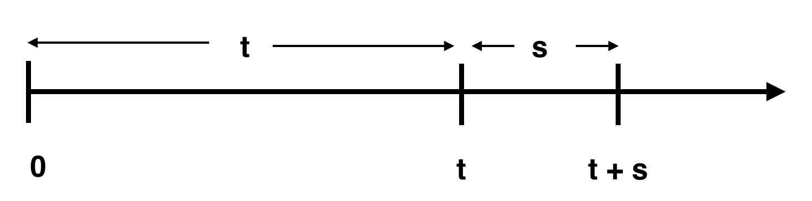


+ o intervalo $(0,t]$ tem comprimento $t$;  
+ o intervalo $(t, t+s]$ tem comprimento $s$; de forma que  
+ o número de ocorrências entre os instantes $t$ e $t+s$ vale $N(t+s) - N(t)$.

Um processo estocástico de contagem apresenta incrementos independentes quando o número de ocorrências em intervalos disjuntos são independentes e apresenta incrementos estacionários quando o número de ocorrências em um intervalo só depende do comprimento do intervalo. Um dos processos estocásticos de contagem mais importantes é o **Processo de Poisson**, que apresenta as seguintes características:

+ **(Homogeneidade, estacionariedade fraca)** A probabilidade de exatamente uma ocorrência em um pequeno intervalo de comprimento $h$ é aproximadamente proporcional ao  comprimento do intervalo:
  $$P[N(h) = 1] = \lambda h + o(h); \qquad \lim_{h \rightarrow 0}  \frac{o(h)}{h} = 0$$

+ A probabilidade de **mais de uma ocorrência** em um pequeno intervalo de comprimento $h$ é desprezível:
  $$P[N(h) > 1] = o(h)$$ 
  
+ **(Independência, ausência de memória)** O número de ocorrências em qualquer intervalo de comprimento $h$ é 
  independente do histórico de ocorrências em outros instantes fora deste intervalo.  

Portanto, um processo de contagem aleatório é um Processo de Poisson se é possível assumir que: 

(i) a probabilidade de observar *exatamente uma ocorrência* em um pequeno intervalo de comprimento $h$ é aproximadamente proporcional ao comprimento desse intervalo, de forma que, para pequenos valores de $h$,  essa probabilidade vale $\lambda h$ mais algo que é muito menor se comparado a $h$ ( $\lambda$ é a constante de proporcionalidade, chamada de taxa do processo e
a função $o(h)$ é uma função nula, que vai mais rapidamente para zero que $h$ ); 

(ii) a probabilidade de observar duas ou mais ocorrências em um pequeno intervalo é desprezível, o que significa que a probabilidade de duas ou mais ocorrências simultâneas é nula; e, finalmente, 

(iii) as ocorrências se dão de maneira independente, de forma que o que quer que aconteça em determinado intervalo, isto não tem efeito probabilístico em outros intervalos não sobrepostos a este.


Sob essas condições, precisamos determinar, para qualquer valor de $k$, a probabilidade de **exatamente** $k$ ocorrências em um intervalo de comprimento $t+h$:

$$P_k(t+h) = P[N(t+h) = k]$$

Façamos, então, para $k=0$, $k=1$ e, assim, sucessivamente.

+ Para $k = 0$:


\begin{align*}
  P_0(t+h) &= P[\text{nenhuma ocorrência no intervalo } (0, t+h]]\\
           &= P[\text{nenhuma ocorrência em } (0, t] \cap 
                \text{nenhuma ocorrência em } (t, t+h] ]\\
  \stackrel{\text{(indep.)}}{} 
           &= P[\text{nenhuma ocorrência em } (0, t]] \cdot  
              P[\text{nenhuma ocorrência em }(t, t+h]]\\  
           &= P_0(t) \cdot P_0(h)
\end{align*}


Mas,


\begin{align*}
  P_0(h)  &= P[\text{nenhuma ocorrência no intervalo } (t, t+h]]\\
          &= 1 - P [\text{pelo menos uma ocorrência em }(t, t+h]]\\
          &= 1 - P[\text{exatamente uma ocorrência em } (t, t+h]] \\
          & \phantom{= 1\;}- P[\text{pelo menos duas ocorrências em }(t, t+h]]\\
          &= 1 - \lambda h - o(h) - o(h)
\end{align*}


Portanto,


\begin{align*}
  P_0(t+h) &= P_0(t) \cdot P_0(h)  \\
           &= P_0(t) \cdot (1 - \lambda h - o(h) - o(h))\\
           &= P_0(t) - \lambda h P_0(t) - P_0(t) (o(h) + o(h))\\
\end{align*}


Dividindo toda a expressão por $h$:

$$\frac{P_0(t+h) - P_0(t)}{h} = - \lambda P_0(t) - P_0(t) \frac{o(h) + o(h)}{h}$$

Tomando o limite quando $h \rightarrow 0:$

$$\lim_{h \rightarrow 0} \frac{P_0(t+h) - P_0(t)}{h} = - \lambda P_0(t)$$
Obtemos:

$P_0^\prime(t) = - \lambda P_0(t)$

Sob a condição inicial $P_0(0) = 1$, esta é uma equação diferencial cuja solução é:

$$P_0(t) = e^{-\lambda t}$$
Analogamente,

+ Para $k = 1$:


\begin{align*}
  P_1(t+h) &= P_1(t)\cdot P_0(h) + P_0(t)\cdot P_1(h)\\ 
           &= P_1(t)(1 - \lambda h - o(h)) + P_0(t)(\lambda h + o(h))\\   
\end{align*}


Que leva à equação diferencial:

$P_1^\prime(t) = - \lambda P_1(t) + \lambda P_0(t)$

Cuja solução, sob a condição inicial $P_1(0) = 0$, é:

$$P_1(t) = (\lambda t) e^{-\lambda t}$$

É possível mostrar que:

$P_k^\prime(t) = - \lambda P_k(t) + \lambda P_{k-1}(t), \quad$ para $k = 2, 3, \ldots$

Este sistema de equações diferenciais tem solução:

$$P_k(t) = \frac{(\lambda t)^k}{k!} e^{-\lambda t}$$

Se
$P[N(t)=k]:$ probabilidade de exatamente $k$ ocorrências em um intervalo de tempo qualquer de comprimento $t\geq 0$

então:
$$\sum_{k=0}^\infty P[N(t)=k] = 1,$$
ou seja, em cada intervalo de comprimento $t$, devemos ter exatamente ou 0, ou 1, ou 2 etc ocorrências.

Note que $P[N(t)=k]$ é fdp com relação a $k$, mas não é fdp com relação a $t$. Podemos garantir apenas que:
$$0 \leq \int_{t=0}^\infty P[N(t)=k] dt < \infty$$

A distribuição de probabilidade para o número de ocorrências em um intervalo de tempo de comprimento $t$ é dada por:

$$P[X = k] = \frac{(\lambda t)^k}{k!} e^{-\lambda t}$$
Portanto, para o exemplo de motivação, definindo a v.a.

$X =$ no. de famílias que chegam ao posto a uma taxa $\lambda = 10$/dia; $t=1$ dia.

A probabilidade de que algumas famílias precisem ser desviadas para outro local é igual à probabilidade de que mais do que 15 famílias cheguem ao local em um dia. Utilizando o complementar, essa probabilidade é igual a 1 - a probabilidade de $X \leq 15$, que vale aproximadamente 5%: 


\begin{align*}
P[X > 15] = 1 - P[X \leq 15] = 1 - \sum_{x=0}^{15}\frac{e^{-\lambda}}{x!}\lambda^x 
          = 1 - 0,9513 = 0,0487 \approx 5\% 
\end{align*}


Como acabamos de ver, um processo de Poisson consiste em um experimento em que ocorrências de um determinado fenômeno aleatório que possui certas características especiais se dão em um domínio contínuo. A v.a. de Poisson é utilizada para modelar o número dessas ocorrências. 

Agora, suponha que uma dessas ocorrências tenha apenas sido observada. Por exemplo, uma família tenha acabado de chegar ao posto onde se encontra o caminhão pipa. O que podemos afirmar sobre o tempo de espera até a chegada da próxima família? Podemos perceber que se as chegadas acontecem de maneira aleatória, de forma que o instante dessas ocorrências é também uma variável aleatória. Portanto, resta determinar qual a distribuição do tempo de espera até observar a próxima ocorrência em um Processo de Poisson? Este aspecto do processo de Poisson é modelado pela distribuição Exponencial.


## Distribuição Exponencial


Para um processo de Poisson, consideremos $X$ o instante de ocorrência do primeiro evento.  Se o primeiro evento ocorrer após o instante $t$, isso significa que nenhuma ocorrência no processo de Poisson foi observada no intervalo que vai de 0 a $t$. Portanto, a probabilidade de observar a primeira ocorrência após o instante $t$ vale: 

$P[X > t] = P[$ nenhuma ocorrência no intervalo  $(0,t]] = P_{0}(t) = e^{-\lambda t}$

A função distribuição acumulada para essa v.a. corresponde à probabilidade de que o tempo de espera seja no máximo igual a $t$, que é o complementar da probabilidade calculada anteriormente. Assim, a FDA de $X$ vale: 

$P[X \leq t] = F_{X}(t) = 1 - P[X > t] = 1 - e^{-\lambda t}, \quad t >0$.

A fdp de $X$ pode ser obtida derivando-se a FDA:

$$f_{X}(x) =\frac{dF_X(x)}{dx} = \lambda e^{-\lambda x}, \quad x > 0$$

Sendo assim, uma v.a. $X$ que representa o tempo de espera entre ocorrências sucessivas em um processo de Poisson tem distribuição exponencial com parâmetro $\lambda$, em que $\lambda$ é a taxa de ocorrência no processo de Poisson. Por se tratar de um tempo de espera, a v.a. pode assumir valores reais não negativos, de acordo com fdp $f_X(x)$, dada abaixo. 

Seja a v.a. $X \sim Exp(\lambda)$

$X =$ tempo de espera entre ocorrências sucessivas em um processo de Poisson


\begin{align*}
  &{} f_{X}(x) = \left\{
  \begin{array}{rl}
    \lambda e^{-\lambda x}, & x \geq 0\\
    0,           & c.c.
  \end{array}\right.
  \quad \lambda > 0
  \\ \\
  &{} E[X] = \frac{1}{\lambda} \qquad Var[X] = \frac{1}{\lambda^2}
\end{align*}


É possível mostrar que o valor esperado desta v.a. é $1/\lambda$, ou seja, o tempo médio de espera é o inverso da taxa média de ocorrências, e que a variância vale $1/\lambda^2$.

Vimos anteriormente que o processo de Poisson pode ser visto como um limite para um processo de Bernoulli, portanto há analogias entre esses dois tipos de processos aleatórios e também entre as distribuições associadas a eles.

A distribuição de Poisson é análoga à distribuição Binomial; ambas descrevem o número de ocorrências (ou sucessos). A distribuição exponencial pode ser vista como uma análoga contínua da distribuição geométrica; ambas descrevem o tempo de espera. Uma v.a. com distribuição geométrica estava associada a um processo de Bernoulli e descrevia o número de experimentos necessários até obter o primeiro sucesso (ou seja, num domínio discreto); já a distribuição exponencial descreve o tempo de espera até observar  a primeira ocorrência em um processo de Poisson, cujo domínio é contínuo.

Como podemos suspeitar, existe também relação limite entre as distribuições geométrica e exponencial. Se $Y$ for uma v.a. com distribuição geométrica e probabilidade de sucesso igual a $\lambda/n$, então a distribuição de $Y/n$ converge para a distribuição exponencial com parâmetro $\lambda$.


### Propriedade de Ausência de Memória {-}


Geralmente, em Engenharia, modelos matemáticos servem de representações simplificadas de fenômenos observados no mundo real. Tais simplificações frequentemente são resultantes de nossa incapacidade de perceber e representar o fenômeno em sua totalidade, ou podem ser necessárias para tornar o problema matematicamente tratável. No entanto, sempre há o risco de super-simplificar o problema, de forma que as conclusões obtidas a partir da solução matemática podem acabar vagamente relacionadas ao problema real. Então, no processo de modelagem matemática de um fenômeno real, é necessário dosar de maneira adequada o nível de simplificação do modelo a fim de que ele seja tratável, mas não tanto que se acabe por resolver perfeitamente um problema que não existe. Uma simplificação comumente adotada na modelagem de certos fenômenos aleatórios é de que a v.a. tem distribuição exponencial. Como vimos, esta variável aleatória descreve tempo de espera e, por este motivo, é frequentemente utilizada em confiabilidade para modelar o tempo de vida de sistemas.  

Assim como sua correspondente discreta, a distribuição exponencial também possui a propriedade de ausência de memória, enunciada a seguir:

$$P[X \geq t + s | X \geq t]  = P [X \geq s], \quad \forall t, s \geq 0$$

Se modelarmos a vida de um componente por uma v.a. $X$ com distribuição exponencial, a propriedade de ausência de memória afirma o seguinte: a probabilidade de que o componente funcione um período de pelo menos $t+s$, dado que funcionou pelo menos até o instante $t$ é igual à probabilidade inicial de que dure pelo menos até o instante $s$. Em outras palavras, se o componente durou até o instante $t$, então a distribuição do restante de vida é igual à distribuição da vida original. Ou seja, a vida residual do componente tem fdp independente da idade do componente, o componente "não lembra" que já funcionou até o instante $t$, ele não sofre desgaste, é tão bom quanto um novo. Dizemos que a função taxa de falha para a distribuição exponencial é constante e vale $\lambda$.

Esta é uma hipótese um tanto restritiva que implicitamente precisamos aceitar  como válida ao utilizar a distribuição Exponencial para modelar a vida de componentes, instrumentos ou sistemas. Por este motivo, a distribuição exponencial deve ser utilizada com cautela, já que há inúmeras situações em que esta hipótese não é válida. Neste caso, o modelo exponencial não é adequado e outros modelos para tempo de vida são  possíveis, tais como a distribuição de Weibull, que é uma generalização da distribuição exponencial. A distribuição de Weibull é bastante flexível e permite representar sistemas com função taxa de falha crescente (para valores do parâmetro $\beta > 1$ ), constante ( $\beta= 1$ ) e decrescente ( $\beta < 1$ ).


#### Distribuição Exponencial: {-}     


$F_X(x) = P[X \leq x] = 1 - e^{-\lambda x}$ : função taxa de falha constante = $\lambda$


### Distribuição de Weibull: {-}   


$F_X(x) = P[X \leq x] = 1 - e^{-(x/\eta)^\beta}; \; x \geq 0, \beta >0, \eta >0$ : função taxa de falha crescente $(\beta > 1)$, constante $(\beta=1)$, decrescente $(\beta < 1)$

O caso de função taxa de falha crescente é bastante intuitivo e representa situações em que o sistema se degrada e sofre desgaste com o tempo. O caso de função taxa de falha decrescente representa situações em que o sistema "melhora" com o tempo. Um exemplo clássico é um sistema que apresenta um período de mortalidade infantil. Este tipo de falha normalmente está associado a erro de projeto, baixo controle de qualidade ou defeitos de material,  de forma que quando o período inicial é superado, o sistema apresenta menor taxa de falha conforme o tempo passa. 

Vejamos alguns exemplos.


::: {.example #unnamed-chunk-2}
:::


Suponha que é razoável modelar o tempo de espera por atendimento em um banco por uma v.a. com distribuição exponencial, com média 10 min (isto é, $\lambda = 1/10$). 

+ Qual a probabilidade de que um cliente espere por um tempo maior do que 15 min?

+ Qual a probabilidade de que um cliente espere por um tempo maior do que 15 min, dado que já está esperando há 10 min?


::: {.solution}
:::


Representamos o tempo que o cliente espera na fila do banco por uma v.a. $X$ com distribuição Exponencial. O tempo médio de espera é de 10 min, portanto o parâmetro $\lambda$ da distribuição vale 1/10.

Seja $X$ =  tempo que o cliente espera na fila do banco  
$X \sim Exp(\lambda = 1/10)$.

+ Queremos $P[X > 15]$:  
$P[X > 15] = 1 - P[X \leq 15] = e^{-\lambda t} = e^{- 15/10} \approx 0.223$  
Portanto, esta probabilidade é de aproximadamente 22,3%.

+ Queremos $P[X > 15 | X > 10]$:    
$P[X > 15 | X > 10] = P[X > 10 + 5 | X > 10] = P[X > 5] = e^{-5\lambda}= e^{-5/10}$ $\approx 0.607$  

Pela propriedade de ausência de memória, como a distribuição exponencial não se lembra de que o  cliente já está esperando há 10 min, a probabilidade de que espere por pelo menos 5 min adicionais é igual à probabilidade de ele esperar pelo menos 5 min no momento em que entra no banco. Neste caso, a probabilidade desejada vale aproximadamente 60%.

Os comandos para obter esses valores de probabilidade utilizando o software R, são dados abaixo.


```r
1 - pexp(15, rate = 1/10)  
1 - pexp(5, rate = 1/10)
```


O próximo exemplo traz uma ilustração simples de aplicação de distribuição exponencial em confiabilidade.


::: {.example #unnamed-chunk-5}
:::


Um sistema contém componentes cuja vida (em anos) é dada pela v.a. $T$, que segue distribuição exponencial com média 5.

Se 5 desses componentes são instalados em diferentes sistemas, qual a probabilidade de que pelo menos 2 deles continuem funcionando ao final de 8 anos?


::: {.solution}
:::


Sabemos que o tempo de falha de cada um dos componentes pode ser adequadamente modelado por uma va exponencial com média 5, de forma que a taxa de falha, $\lambda$ vale 1/5. Portanto, temos: $T \sim Exp(\lambda = 1/5)$.

Em primeiro lugar, precisamos calcular a probabilidade de que a falha em um desses componentes ocorra após um período de 8 anos, isto é, precisamos calcular $P[T \geq 8]$. 

Para um componente:  
$P[T \geq 8] = \frac{1}{5} \int_{8}^{\infty} e^{-t/5} dt = e^{8/5} \approx 0.2$

Mas nós ainda não resolvemos o problema completamente... essa é apenas a probabilidade de que um componente dure pelo menos 8 anos!

Queremos a probabilidade de que pelo menos dois de um total de 5 desses componentes instalados em sistemas independentes durem pelo menos 8 anos. Ou seja, temos uma outra variável aleatória. Os sistemas são idênticos e funcionam de forma independente.  Precisamos definir uma v.a. $X$ com distribuição binomial, com parâmetros $n =5$ (esse é o número de repetições do experimento de Bernoulli) e probabilidade de sucesso (que neste caso significa funcionar por pelo menos 8 anos) igual a 0,2.  Portanto, a probabilidade desejada é $P[X \geq 2]$.

Seja $X=$ número de componentes funcionando ao final de 8 anos  
$X \sim Bin(n = 5, p = 0.2)$


\begin{align*}
  P[X \geq 2] = \sum_{x=2}^{5}Bin(n=5, p=0.2)
              &= 1- \sum_{x=0}^{1}Bin(n=5, p=0.2)\\
              &= 1 - 0.7373 = 0.2627\\  
\end{align*}


A probabilidade de que pelo menos 2 dos 5 componentes instalados continuem funcionando ao final de 8 anos vale aproximadamente 26%.

Vejamos, agora, um outro exercício interessante que faz uso da propriedade de ausência de memória.


::: {.example #unnamed-chunk-7}
:::


Em um pronto-atendimento oftalmológico há dois consultórios médicos e os pacientes podem ser atendidos por qualquer um dos dois plantonistas. Quando o paciente C chega até a clínica, descobre que os dois consultórios já estão ocupados, um pelo paciente A e o outro, pelo B. O paciente C é informado que será atendido assim que terminar a consulta de um dos pacientes A ou B. 

Suponha que o tempo de duração de uma consulta seja uma v.a. com distribuição exponencial com média $1/\lambda$. 

*Qual a probabilidade de que, dos três pacientes, C seja o último a deixar a clínica?*


::: {.solution}
:::


A resposta pode se obtida utilizando a propriedade de ausência de memória, seguindo este raciocínio: no momento em que um dos consultórios for liberado e o paciente C iniciar o atendimento, um dos outros dois pacientes A ou B, digamos B, terá deixado a clínica enquanto o paciente A ainda estará sendo atendido. No entanto, devido à propriedade de ausência de memória, o tempo remanescente de atendimento do paciente A tem distribuição exponencial com média $1/\lambda$, independentemente do tempo que a consulta já durou. Ou seja, a situação aleatória se comporta como se o atendimento do paciente A tivesse acabado de iniciar, no mesmo instante em que o atendimento do paciente C foi iniciado. Sendo assim, a probabilidade de que o paciente A deixe a clínica antes do paciente C é de 50%.


## Distribuição Gama


Assim como encontramos analogias entre a distribuição exponencial e a distribuição geométrica, em um processo de Poisson, a distribuição correspondente à binomial negativa no processo de Bernoulli é a distribuição Gama. Essa v.a. modela o tempo de espera até observar um certo número de ocorrências em um processo de Poisson.

Sendo assim, uma v.a. $X$ tem distribuição gama com parâmetros $\alpha$ e $\beta$ em que $\alpha$ é o número de ocorrências desejadas (também chamado parâmetro de forma) e $\beta$ é o inverso da taxa de ocorrência do processo de Poisson (também chamado de parâmetro de escala). Por se tratar de um tempo de espera, a v.a. pode assumir valores reais não negativos, de acordo com fdp $f_X(x)$ abaixo. 

Seja a v.a. $X \sim Gama(\alpha, \beta)$

$X =$ tempo de espera até $\alpha$-ésima ocorrência em um processo de Poisson


\begin{align*}
  &{} f_{X}(x) = \left\{
  \begin{array}{rl}
    \frac{1}{\beta^\alpha\Gamma(\alpha)}x^{\alpha -1} e^{-x/\beta}, & x \geq 0\\
    0,           & c.c.
  \end{array}\right.
  \quad \alpha, \; \beta > 0
  \\ \\
  &{} E[X] = \alpha\beta \qquad Var[X] = \alpha\beta^2
\end{align*}


**OBS: Função Gama**
$$\Gamma(\alpha) = \int_{0}^{\infty} x^{\alpha -1} e^{-x} dx, \; \alpha >0  \quad \textsf{ tq: } \quad \begin{array}{l}
    \alpha \in \mathcal{Z}^{+}: \Gamma(\alpha) = (\alpha-1)! \quad (\textsf{dist. Erlang})\\
    \Gamma(1/2) = \sqrt{\pi}
  \end{array}$$


A distribuição gama tem valor esperado $\alpha \beta$ (o mesmo que $\alpha/\lambda$ ) e variância $\alpha \beta^2$ (ou seja, $\alpha/\lambda^2$ ). 
Obviamente, quando $\alpha = 1$, temos a distribuição exponencial. Quando $\alpha$ é um número inteiro positivo, a distribuição resultante também é chamada de distribuição de Erlang, em referência ao engenheiro dinamarquês Agner Erlang (1878-1929), que deu contribuições pioneiras para o desenvolvimento da teoria de filas.


::: {.example #unnamed-chunk-9}
:::


Suponha que chamadas chegando a uma central de atendimento sigam um processo de Poisson com taxa de 5 telefonemas por minuto.

Qual a probabilidade de que não mais que um minuto se passe até dois telefonemas sejam recebidos?


::: {.solution}
:::


Seja $X=$ tempo até que 2 chamadas sejam recebidas.  
Temos uma va gama, com parâmetros $\alpha = 2$ e $\beta = 1/\lambda = 1/5$.

$X \sim Gama(\alpha = 2, \beta = 1/\lambda = 1/5)$

$P[X \leq 1] = \int_{0}^{1} \frac{1}{\beta^2}x e^{-x/\beta} dx = 25 \int_{0}^{1} x e^{-5x} dx = 1 - e^{-5}(1+5) = 0.96$

Portanto, a probabilidade de que $X$ seja menor ou igual a 1 vale aproximadamente 96%. Este valor de probabilidade pode ser facilmente obtido com o auxílio do R, utilizando o código abaixo.


```r
pgamma(1, shape = 2, scale = 1/5)
```


::: {.example #unnamed-chunk-12}
:::


Vejamos agora uma aplicação da distribuição Gama a um problema de tomada de decisão:

Vamos supor que as reclamações de clientes a respeito de um certo produto sejam adequadamente modeladas de acordo com um processo de Poisson, de forma que o período entre duas reclamações sucessivas siga a distribuição gama com parâmetros $\alpha = 1$ e $\beta = 4$. Isto nos daria uma expectativa de 4 meses até observar a primeira reclamação.

Não satisfeito com essa situação, o fabricante implementou modificações no controle de qualidade do processo de produção, de forma que, após essas modificações, a primeira reclamação ocorreu somente após 12 meses.

Antes que essa modificação seja implementada em outras plantas da empresa, é necessário determinar se este aparente aumento no tempo de espera até a primeira reclamação  foi resultado das modificações no processo produtivo, ou seja, queremos saber se o novo controle de qualidade foi efetivo.


::: {.solution}
:::


Antes de modelar o problema matematicamente, precisamos identificar que aspecto desse problema nos ajuda a tomar essa decisão.

Veja que estamos monitorando uma v.a. $X$, que descreve o tempo de espera até a primeira reclamação.

Se o processo modificado for idêntico ao original, observaremos um tempo de espera de 12 meses com alta probabilidade; isso implica que o novo controle de qualidade não foi efetivo e que o processo é descrito pela distribuição Gama com parâmetros $\alpha = 1$ e $\beta = 4$. Neste caso, podemos concluir que observar um tempo de espera de 12 meses é algo corriqueiro, que não estamos diante de uma situação incomum. Esta seria uma observação completamente compatível com o esperado para um processo como esse.

Por outro lado, se chegarmos à conclusão de que a probabilidade de observar a primeira reclamação após 12 meses é muito baixa, significa que estamos diante de uma de duas situações: (i) ou acabamos de presenciar a ocorrência de um evento raro; ou (ii) o processo não se comporta da maneira que imaginávamos, de forma que a distribuição que representava o comportamento aleatório não se aplica mais e, portanto, o novo controle de qualidade de fato, modificou o processo produtivo.

Portanto, precisamos calcular a probabilidade $P[X \geq 12]$ para que possamos chegar a uma conclusão.

Utilizando as informações apresentadas e, com o auxílio do software R (veja o código fornecido abaixo), obtemos um valor de probabilidade ligeiramente inferior a 5%.


```r
1 - pgamma(12, shape = 1, scale = 4)
```


Isso significa que, se o processo produtivo não tiver sido efetivamente modificado com a implantação do novo controle de qualidade, em cerca de 5% das vezes, observaremos um tempo de espera de 12 meses até a primeira reclamação. 

Quão rara é essa situação? A resposta a essa pergunta depende do risco que estamos dispostos a correr ao tomar essa decisão.  Se considerarmos que a probabilidade 5% é pequena o bastante para que essa situação não seja considerada corriqueira, então é razoável concluir que a mudança no controle de qualidade foi, de fato, efetiva.

<!--chapter:end:07-ch7.Rmd-->

# Modelos Probabilísticos: Distribuição Normal


## Distribuição Normal


Diferentemente das distribuições notáveis que estudamos até agora, a distribuição normal não foi construída como um modelo para uma situação aleatória bem definida; pelo contrário, trata-se de um modelo teórico, ou seja, consiste em uma abstração matemática. Ainda assim, a distribuição normal é uma das distribuições mais importantes para a Estatística, pois é útil para representar diversos fenômenos aleatórios que se manifestam no mundo real, além de modelar adequadamente a distribuição de probabilidades de estatísticas comumente utilizadas para realizar inferência.


### ...(Mais) Uma Aproximação para a Distribuição Binomial {-}


Vimos anteriormente que perguntas do tipo "qual a probabilidade de obter $k$ resultados favoráveis em $n$ repetições de um experimento de Bernoulli", poderiam ser respondidas utilizando a distribuição binomial, segundo a expressão matemática a seguir

$$P[X = k] = \frac{n!}{(n-k)!k!} p^k (1-p)^{n-k}$$

O problema é que quando o número $n$ de repetições do experimento de Bernoulli é grande, o cálculo dessa probabilidade torna-se proibitivamente intenso sem o auxílio de uma calculadora ou de outras ferramentas computacionais.

Abraham De Moivre (1667-1754) foi o primeiro a chegar à formulação matemática da distribuição normal, ainda no século XVIII. Com a revogação do Édito de Nantes em 1865 pelo rei Luis XIV, estima-se que cerca de 200 a 900 mil protestantes franceses tenham deixado o país nas duas décadas seguintes. Esta lei tinha sido promulgada quase um século antes e conferia liberdade religiosa aos huguenotes. Com o fim da garantia de liberdade religiosa na França, De Moivre se viu forçado a buscar exílio na Inglaterra onde, mesmo sendo um país protestante, não se viu livre de sofrer preconceito por causa de sua origem francesa. Por conta disso, embora fosse um matemático talentoso, além de ter conexões importantes (ele foi amigo pessoal de Edmond Halley, Isaac Newton e James Stirling), De Moivre nunca conseguiu um emprego permanente e ganhava a vida precariamente trabalhando como tutor de matemática e prestando consultoria aos apostadores que frequentavam os cafés de Londres. Estes jogadores geralmente estavam interessados em responder a perguntas do tipo "qual a probabilidade de obter 60 ou mais caras em 100 lançamentos de uma moeda honesta?". Vimos que probabilidades deste tipo podem ser calculadas de maneira exata utilizando a distribuição binomial dada na expressão matemática apresentada acima. A ocupação de De Moivre exigia que ele frequentemente realizasse esses penosos cálculos de probabilidades envolvendo a distribuição binomial.

De Moivre notou que conforme o número $n$ de repetições do experimento Bernoulli aumentava, a distribuição do número total de sucessos se aproximava de uma curva suave. 


Se ele apenas fosse capaz de encontrar uma formulação matemática para esta curva, poderia calcular de maneira muito mais rápida as probabilidades de interesse. E foi exatamente isso o que ele fez em 1733, e a expressão matemática que desenvolveu para representar essa curva é o que hoje chamamos de **distribuição Normal**. 

Uma v.a. $X$ com distribuição Normal com parâmetros $\mu$ e $\sigma$ tem fdp dada pela expressão abaixo:

Seja a v.a. $X \sim N(\mu, \sigma^2)$:


\begin{align*}
  & f_{X}(x) =  \frac{1}{\sqrt{2\pi}\sigma} e^{-\frac{1}{2}\left(\frac{x-\mu}{\sigma}\right)^2}, \begin{array}{rl} & -\infty < x  < \infty\\
               & \mu \in \mathcal{R}, \; \sigma > 0.
  \end{array}
  \\ \\ \\
  & E[X] = \mu \qquad Var[X] = \sigma^2
\end{align*}


Esta densidade define, na verdade, uma família de distribuições já que cada distribuição corresponde a uma das infinitas combinações possíveis de valores para os parâmetros $\mu$ e $\sigma$. O valor esperado da distribuição normal é $\mu$ e a variância é e $\sigma^2$, ou seja, temos uma distribuição completamente determinada pelo primeiro momento e o segundo momento central, que correspondem às duas medidas descritivas mais utilizadas: localização e dispersão.


A família de distribuições normais é formada por curvas simétricas em forma de sino, cuja moda (a abcissa que corresponde ao ponto de máximo) coincide com a média e também com a mediana, que correspondem ao ponto de simetria da distribuição, $\mu$.

A curva normal possui dois pontos de inflexão dados por $\mu - \sigma$ e $\mu + \sigma$, ou seja, são os pontos que se encontram a uma distância de um desvio da média (na figura, esses pontos são representados pelas retas pontilhadas coloridas), que definem aproximadamente 2/3 da área sob cada uma das curvas.

A curva normal tende assintoticamente a zero conforme se afasta do valor médio, o que significa que valores próximos à média são observados com grande frequência e raramente ocorrem valores afastados do centro.

Como é uma fdp, a área total sob da curva normal vale 1. E o achatamento da curva depende do valor do parâmetro $\sigma$; quanto maior o valor de $\sigma$, maior o espalhamento e, assim, mais achatada é a curva.

Esta é, sem dúvida, a família de distribuições de probabilidades mais importante para a Estatística por vários motivos: primeiro, porque muitos fenômenos encontrados no mundo real tem comportamento aleatório pelo menos aproximadamente normal; segundo, e mais importante, devido às suas características matemáticas, grande parte da teoria de inferência estatística paramétrica se baseia na distribuição normal; muitas variáveis aleatórias de interesse, incluindo diversas estatísticas comumente utilizadas para realizar inferência possuem distribuições que podem ser aproximadas por uma curva normal.

De fato, uma das primeiras aplicações da distribuição normal foi na análise de erros de medidas em observações astronômicas, devidos a imperfeições dos instrumentos e também dos observadores. Ainda no século XVII, Galileu Galilei (1564-1642) notou que esses erros eram geralmente simétricos e que erros de pequena magnitude ocorriam com maior frequência que erros muito grandes. Esta conjectura levou ao desenvolvimento de inúmeras distribuições candidatas para representar o comportamento aleatório dos erros, mas foi somente no início do século XIX que Carl Friedrich Gauss (1777-1855) chegou independentemente à formulação matemática da distribuição normal, ao  perceber  que tais erros seguiam essa distribuição. No entanto, por não ter desenvolvido uma prova que considerasse válida, em 1809 Gauss publicou o resultado como uma nota de fim de capítulo de um livro sobre a teoria do movimento de corpos celestes (*Teoria Motus Corporum Celestium*). E assim a descoberta ficou por um tempo esquecida.

O resgate da distribuição normal deveu-se a Laplace, que demonstrou uma versão mais geral do resultado de De Moivre. Enquanto De Moivre tinha mostrado que o número de sucessos em um processo de Bernoulli de tamanho $n$ tinha distribuição aproximadamente normal, apoiando-se no resultado de Gauss, Laplace chegou em 1810 à mesma conclusão, com respeito ao total ou à media das observações, independentemente da distribuição dessas observações. 

Em outras palavras, ele mostrou que mesmo que uma variável aleatória não seguisse a distribuição normal, as médias de amostras retiradas dessa população teriam distribuição aproximadamente normal e essa aproximação seria tão melhor quanto maior o tamanho da amostra. Este resultado, de extrema importância para a Estatística, é o chamado .stand-out[Teorema do Limite central], que estudaremos mais adiante. O Teorema do Limite central, por exemplo, fornece o alicerce teórico para a evidência empírica de que, na prática, muitos fenômenos aleatórios naturais seguem, pelo menos de maneira aproximada, a distribuição normal.

Devido às grandes contribuições de Gauss e Laplace para sua formulação matemática, a distribuição normal é também conhecida como distribuição Gaussiana ou distribuição de Gauss-Laplace. O termo "normal" seria cunhado por Karl Pearson apenas no início do século XX.  


### Cálculo de Probabilidades {-}


Como a distribuição normal é contínua, podemos calcular probabilidades associadas a intervalos de valores que a v.a. pode assumir. Sendo assim, 

$$P[x_1 < X < x_2] = \frac{1}{\sqrt{2\pi}\sigma} \int_{x_1}^{x_2} exp\left[-\frac{1}{2}\left(\frac{x-\mu}{\sigma}\right)^2\right]dx$$

que corresponde à probabilidade de que $X$ assuma valores no intervalo que vai de $x_1$ a $x_2$ corresponde à área sombreada na figura abaixo, de forma que é necessário calcular a integral da fdp de $X$ de $x_1$ até $x_2$. Lembre-se ainda que podemos calcular essa área como a diferença entre os valores da função distribuição acumulada nesses dois pontos.


No entanto, as integrais da densidade normal não podem ser resolvidas analiticamente, de forma que os valores de probabilidade associados a essa distribuição podem ser obtidos de maneira aproximada, através de valores tabelados, ou, ainda podem ser facilmente calculados com o auxílio de pacotes estatísticos computacionais, como o R. 


### Padronização {-}


Na impossibilidade de utilização de algum software estatístico, a padronização é um recurso importante para o cálculo de probabilidades envolvendo a distribuição Normal. A padronização consiste em uma transformação de escala e origem da variável aleatória, de forma que a v.a. transformada tem média zero e variância unitária. Assim, diz-se que a v.a. foi padronizada. A v.a. resultante é adimensional. Note que essa transformação pode ser aplicada a qualquer variável aleatória.

A v.a. *normal padronizada* tem distribuição normal com média zero e variância igual a 1 e é representada pela letra $Z$.  Para esta v.a., temos valores tabelados para sua distribuição, de forma a tornar possível calcular valores de probabilidade associados qualquer distribuição da família de distribuições normais.


\begin{align*}
  X \sim N(\mu, \sigma^2) \quad \Longrightarrow \quad 
  & Z = \frac{X - \mu}{\sigma} \sim N(\mu_Z = 0, \sigma_Z^2 = 1)\\
  & \varphi(z) = f_Z (z) = \frac{1}{\sqrt{2\pi}}e^{-\frac{1}{2}z^2}\\
  & \Phi(z) = F_Z(z) = P[Z \leq z], \; \forall z \in \Re
\end{align*}


Utilizamos $varphi(z)$ e $\Phi(z)$ para representar, respectivamente, a fdp e a FDA da v.a. normal padronizada.

Como a distribuição normal é simétrica, as áreas nas extremidades dos quantis $-z_\alpha$ e $z_\alpha$ são iguais e valem $\alpha$. Consequentemente, a área interior delimitada pelos quantis $-z_\alpha/2$ e $z_\alpha/2$ vale $1 - \alpha$. 


Da simetria:  

+ $P[X \leq -z_\alpha] = P[Z \geq z_\alpha] = \alpha$  
+ $P[-z_{\alpha/2} < Z < z_{\alpha/2}] = 1 - \alpha$


::: {.example #unnamed-chunk-5}
:::


A tabela de distribuição normal nos dá as probabilidades acumuladas, ou seja, no miolo da tabela temos os valores de $P[Z \leq z] = \Phi(z)$. Podemos utilizá-la para calcular valores de probabilidades:

(a)   
$P[Z \leq 1.25] = \Phi(1.25)$


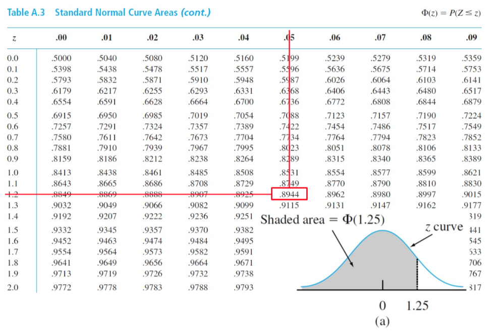


Para determinar o valor desta probabilidade, procuro na vertical a unidade e a primeira casa decimal do quantil desejado (1,2) e na horizontal, o valor da segunda casa decimal (0,05). O valor na interseção de linha e coluna corresponde ao valor de probabilidade acumulada para esse quantil. 

Essa probabilidade pode ser facilmente obtida utilizando o comando abaixo no software R.


```r
pnorm(1.25)
```


(b)  
$P[Z > 1.25] = 1- P[Z \leq 1.25] = 1 - \Phi(1.25)$


Precisamos calcular a área correspondente à cauda superior. Então, como a tabela dá a área acumulada, preciso calcular o complementar daquilo que nos é dado na tabela:

$P[Z > 1.25] = 1 - P[Z ≤ 1.25] = 1 - \Phi(1.25) = 1 - 0.8944  = 0.1056$

Podemos calcular essa probabilidade com o auxílio do software R, de acordo com o comando fornecido abaixo:


```r
1 - pnorm(1.25)
```

(c)   
 $P[Z \leq - 1.25] =  \Phi(-1.25) = 1 - \Phi(1.25)$
 


Precisamos calcular a área correspondente à cauda inferior correspondente ao quantil -1,25.  Mas, como as margens da tabela só me dão quantis positivos, é necessário utilizar-se da simetria da distribuição normal: sabemos que a área à esquerda do quantil -1,25 é igual à área à direita do quantil 1,25, portanto:

$P[Z ≤ -1.25] =  P[Z > 1.25] = 1 - P[Z ≤ 1.25] = 1 - \Phi(1.25) = 0.1056$ 
(igual ao mesmo valor de probabilidade do item anterior, claro!)

Novamente, é recomendável utilizar o software R para calcular essa probabilidade, de acordo com o comando fornecido abaixo.


```r
pnorm(-1.25)
```


(d)   
$P[-0.38 \leq Z \leq 1.25] =  \Phi(1.25) - \Phi(-0.38) = \Phi(1.25) + \Phi(0.38) - 1$


Finalmente, queremos a probabilidade de que $Z$ esteja no intervalo que vai de -0,38 a 1,25. Então, podemos subtrair as duas áreas acumuladas:

$P[Z ≤ 1.25] - P[Z ≤ -0.38]$

Como não temos na tabela os quantis negativos, é necessário expressar $P[Z ≤ -0.38]$ em termos do quantil positivo 0,38, com base na simetria da distribuição.

Então,  
$P[Z ≤ -0.38] = P[Z > 0.38] = 1 - P[Z ≤ 0.38]$

Portanto,

$P[-0.38 ≤ Z ≤ 1.25] = \Phi(1.25)  + \Phi(0.38) - 1$

O software R novamente simplifica muito o cálculo desta probabilidade, bastando utilizar o comando dado abaixo:


```r
pnorm(1.25) - pnorm(-0.38)
```


### Regra Empírica {-}


Comumente estamos interessados em determinar a probabilidade de que uma 
v.a. assuma valores a uma certa distância de $k$ desvios-padrão de sua média. Tais limites são conhecidos como *limites de tolerância*.

Vimos anteriormente que a Desigualdade de Chebyshev nos permite determinar limites inferiores para esses valores de probabilidade, qualquer que seja a distribuição da v.a., quando conhecemos apenas o valor esperado e a variância da v.a. 

Qualquer distribuição normal, independentemente dos valores assumidos por seus parâmetros $\mu$ e $\sigma$, possui a mesma probabilidade a uma distância fixa, dada em termos de número de desvios de sua média. 


\begin{align*}
  X \sim N(\mu, \sigma^2) \quad \Longrightarrow \quad 
  &Z \sim N(0,1):\\ 
  &P[|X -\mu| \leq k\sigma] = P[|Z| \leq k], \quad \forall k>0
\end{align*}


Para a distribuição normal, 68% (ou seja aproximadamente 2/3) das observações encontram-se a uma distância de 1 desvio-padrão de sua média; 95% das observações se encontram dentro dos limites de aproximadamente -2 a +2 desvios da média e, finalmente 99,7% (ou quase a totalidade) das observações se encontra a uma distância de 3 desvios da média. Sendo assim, espera-se que apenas cerca de 0,3% de todos os valores se encontrem a uma distância da média superior a três desvios. Então, embora o suporte da distribuição normal seja toda a reta real, na prática, a largura da distribuição normal é seis sigma.

A associação dos valores de probabilidade 68, 95 e 99,7 da distribuição normal aos respectivos fatores-k é chamada de *Regra Empírica*, exatamente por causa da grande utilização da distribuição normal para representar a distribuição das observações obtidas empiricamente nas mais diversas aplicações práticas.


Como curiosidade, veja como esses limites se comparam com aqueles obtidos através da Desigualdade de Chebyshev, em que os mesmos valores de probabilidade são garantidos para intervalos muito mais largos. 


### Coeficiente de Variação {-}


A distribuição normal é frequentemente utilizada para modelar vas que assumem apenas valores positivos (como área, altura, peso, distância, entre outras). O problema é que o suporte da distribuição normal é a reta real, o que significa que a v.a. normalmente distribuída pode assumir qualquer valor real, positivo ou negativo.

Como podemos contornar essa dificuldade?

Precisamos garantir que a probabilidade de observar um valor negativo seja desprezível. A regra de bolso nos diz que isso ocorre quando o coeficiente de variação, dado pela razão entre o desvio-padrão e a média, $\sigma$ sobre $\mu$ é menor que 0,3.

$$CV = \frac{\sigma}{\mu} <  0,3$$


::: {.example #unnamed-chunk-10}
:::


Peças em projeto aeronáutico comumente são unidas através de rebitagem. O cliente define a especificação do diâmetro dos rebites em 3,0 $\pm$ 0,01 mm. Qualquer rebite cujo diâmetro se encontre dentro da especificação será aceitável. 

Considerando o diâmetro dos rebites uma v.a. normalmente distribuída com média $\mu =$ 3,0 e desvio-padrão $\sigma =$ 0,005, que proporção de rebites será rejeitada?


::: {.solution}
:::


São aceitáveis os rebites cujos diâmetros se encontram no intervalo (2,99; 3,01).  
Portanto, queremos a probabilidade de rejeitar um determinado rebite, dada por:  
1 - P[2,99 < X < 3,01]

**Solução Manual**  
1. Padronizar a v.a. para uso da tabela normal  ( $\mu=$ 3 e $\sigma =$ 0,005):  
$z_1$ = (2,99 - µ)/σ = -2.0  $\quad z_2$ = (3,01 - µ)/σ = 2.0   
2. Buscar na tabela valores de probabilidade:  
P[Z < $z_1$ ] = 0,02275 e P[Z < $z_2$ ] = 0,97725   
3. Probabilidade desejada:  
1 - P[2,99 < X < 3,01] = 1 - P[-2 < Z < 2] = 1 - (0,97725 - 0,02275) = 0,0455 $\quad \therefore \quad \approx$ 4,55%

Portanto, espera-se que em média 4,55% dos rebites sejam rejeitados.

No R, é possível calcular esta probabilidade utilizando o comando abaixo:


```r
1 - (pnorm(3.01, mean = 3, sd = 0.005) - pnorm(2.99, mean = 3, sd = 0.005))
```


## Aproximação para Distribuições Discretas


A distribuição Normal comumente é utilizada para aproximar distribuições discretas simétricas. No entanto, como a distribuição normal é *contínua*, é necessário incluir uma correção para levar em conta a continuidade da distribuição. Essa correção é necessária toda as vezes que aproximamos uma população discreta por uma distribuição contínua.

Essa correção foi proposta por Augustus de Morgan em 1838, na tentativa de aperfeiçoar a aproximação de De Moivre para a distribuição Binomial, com base na ideia de que cada probabilidade binomial deveria ser interpretada como uma área de base unitária.  


Seja $X \sim p_X(x)$ a v.a. discreta de interesse. A distribuição de $X$ é representada pelo histograma.

Queremos calcular a probabilidade: $P[i \leq X \leq j], \quad i < j;\; i,j \in \mathcal{Z}$

i. Do histograma, pode-se determinar esta probabilidade de maneira .stand-out[extata], calculando-se:  
$$P[i \leq X \leq j] = \sum_{x=i}^j p_X(x)$$


ii. Suponha $f_X(x)$ uma boa aproximação para $p_X(x)$. A fim de calcular a probabilidade associada à v.a. discreta a partir da aproximação pela função contínua $f_X(x)$, a área sob a curva contínua precisa ser obtida através da integral entre os limites $i$ e $j$ desejados, com o acréscimo de 1/2 (a metade da base) em cada direção:  
$$P[i \leq X \leq j] = \int_{x=i-1/2}^{j+1/2} f_X(x) dx$$


### Aproximação para a Distribuição Binomial {-}


Como De Moivre demonstrou, uma v.a. binomial com parâmetros $n$ e $p$ pode ter sua distribuição satisfatoriamente aproximada pela  distribuição Normal para valores elevados de $n$; isto é, para $n ≥ 30$ e quando ambos os produtos $np$ e $nq$ valem pelo menos 5:

$X \sim Bin (n, p)$

Se $n \geq 30; \; np \geq 5; \; nq \geq 5$:

$$X \sim Bin(n, p) \longrightarrow N(\mu = np, \sigma^2 = npq) \\ \frac{X - np}{\sqrt{npq}} \stackrel{\cdot}{\sim} N(0,1)$$

Nestas circunstâncias, a distribuição binomial apresenta forma de sino, com média  $pq$ e variância $npq$, de forma que, ao aplicar a transformação de padronização à v.a. $X$, a distribuição da v.a. resultante é aproximadamente normal padronizada.


::: {.example #unnamed-chunk-14}
:::


Companhias aéreas costumam praticar "overbooking", vendendo um número de passagens  superior ao número de assentos disponíveis na aeronave, a fim de maximizar seu retorno, já que existe a expectativa de que nem todos os passageiros se apresentem na hora do embarque. Tais passageiros são classificados como "no-show".

Suponha que tenham sido emitidas 200 passagens para um voo com capacidade para 197 passageiros e que  a taxa de "no-show" para este voo seja de 2%.

Qual a probabilidade de que haja *overbooking* para este voo, de forma que nem todos os passageiros que se apresentarem para embarque poderão viajar?


::: {.solution}
:::


Se considerarmos que os passageiros viajam sozinhos, sem acompanhantes, e que chegaram de maneira independente ao aeroporto, podemos modelar o número de "shows", isto é, o número de passageiros que se apresentam para o embarque como uma v.a. com distribuição Binomial, com parâmetros $n= 200$ e $p = 0.98$:

$X =$  número de "shows" (passageiros que se apresentam para embarque)  
$p =$ probabilidade de "show" $= 1 - 0,02 = 0,98$  

Portanto: $X \sim Bin ( n = 200, p = 0,98 )$

Queremos calcular a probabilidade de que o número de "shows" seja maior que a capacidade do voo, que vale 197: $P[X > 197]$


Dadas as características do problema, podemos resolvê-lo de diferentes maneiras. Primeiro, vamos considerar a solução analítica exata, utilizando a distribuição Binomial.

**Cálculo exato utilizando a Distribuição Binomial:**

Neste caso, precisamos somar os valores de probabilidade binomial para valores de $X$ que vão de 198 a 200. Fazendo isto, chegamos à conclusão de que há aproximadamente 23,5% de chance de overbooking.

$P[X > 197] = \sum_{x=198}^{200} Bin (x, n, p) = \sum_{x=198}^{200}  \frac{n!}{(n-x)!x!} p^x (1-p)^{n-x} = \ldots$   
$\approx 23.5\%$

Os cálculos são facilmente realizados com o auxílio do software R, utilizando qualquer dos comandos alternativos dados abaixo.


```r
sum(dbinom(198:200, size = 200, prob = 0.98))  
pbinom(200, 200, 0.98) - pbinom(197, 200, 0.98)
```

**Utilizando a Aproximação Normal:**

Já que o número de passagens vendidas é elevado, podemos tentar utilizar a aproximação para uma distribuição Normal com média $\mu = np = 196$ e variância igual $npq$:

$\mu = np = 200 \times 0.98 = 196$  
$\sigma = \sqrt{npq} = \sqrt{200 \times 0.98 \times 0.02} = 1.98$ 

Para que a aproximação seja adequada, precisamos verificar as condições de que $np$ e $nq$ sejam ambos maiores que 5. Estas condições garantem que a distribuição binomial seja simétrica, com forma aproximada de sino:

$np = 200 \times 0.98 = 196; \quad nq = 200 \times 0.02 = 4$. 


Para este exemplo, a distribuição binomial não é simétrica. Veja no gráfico, como a cauda da distribuição binomial (em cinza) é mais curta à direita. Ainda assim, prosseguiremos.

Ao aproximar a distribuição binomial (que é discreta) pela distribuição normal (que é contínua), precisamos realizar a correção para a continuidade.

Desejamos calcular a probabilidade $P[X > 197]$ (sinalizada em azul no gráfico). Portanto, o quantil considerado para a aproximação normal deverá ser de $197 + 1/2$. Padronizando este valor, temos o escore-z (que corresponde ao quantil da distribuição normal padronizada) dado por $z_2$: 

$x_2 = 197 + 0.5 = 197.5 \\ \Rightarrow \; Z \sim N(0, 1): \qquad z_2 = \frac{(197.5 - 196)}{1.98} = 0.7576$


Portanto,  
$$P[X > 197] \approx P[Z > z_1] = 1 - \Phi(z_1)  \approx 22.4\%,$$

ou seja, a probabilidade desejada vale aproximadamente 22,4% e pode ser obtida numericamente no software R utilizando o comando fornecido abaixo.


```r
1 - pnorm(197.5, mean = 196, sd = 1.98)  # com correção para continuidade
```


Esta aproximação apresenta erro da ordem de 1 ponto percentual com relação ao valor exato calculado a partir da distribuição Binomial, devido à inadequação do ajuste.

**Utilizando a Aproximação de Poisson:**

Podemos também aproximar a distribuição Binomial pela distribuição de Poisson quando $n$ é grande e $p$ é pequeno. Neste caso, vamos aproximar a distribuição do número de passageiros que não se apresentam para o embarque, que será representado pela v.a. $Y$. Para cada passageiro, esta probabilidade é $q$ e vale 0,02. Portanto, o parâmetro da distribuição de Poisson correspondente é $\lambda = nq = 4$:

+ $Y \sim Pois(\lambda)$: número de "no-shows"
+ Condição: $\lambda = nq = 200 \times 0.02 = 4$

Sendo assim, para que haja *overbooking*, o número de "no-shows" deve ser menor ou igual a 2 e, portanto, a probabilidade desejada segundo a aproximação de Poisson vale cerca de 23,8%, conforme mostram os cálculos abaixo.

$P[X > 197] \approx P[Y \leq 2] = \sum_{x=0}^{2} Pois (x, \lambda = nq) =\ldots \approx 23.8\%$

Este valor de probabilidade é obtido utilizando o software R através do seguinte comando:


```r
sum(dpois(0:2, lambda = 4))
```


Veja graficamente a semelhança das duas distribuições. Neste exemplo, a distribuição  de Poisson se mostrou uma aproximação mais adequada que a distribuição Normal. A área sombreada em azul, representa a probabilidade de interesse calculada.


**Utilizando Simulação:**

Podemos ainda estimar essa probabilidade via simulação. Para isso, basta gerar uma grande quantidade de realizações da v.a. Binomial, com parâmetros  $n = 200$ e $p = 0,98$.


```r
Nsim <- 1000 # no. de voos simulados
Nrep <- 100  # no. de replicações
simula_voo <- matrix(rbinom(Nsim*Nrep, size = 200, prob = 0.98),
                     ncol = Nrep)
              # cada coluna armazena uma replicação de
              # 'Nsim' voos simulados

# condição de overbooking:
overbook <- simula_voo > 197

# calcula freq. de overbooking observada
# para cada replicação de 'Nsim' voos simulados
frel_overbook <- colMeans(overbook) 

# Histograma com as estimativas para P[X > 197]
hist(frel_overbook, freq=FALSE,
     density = 25,
     yaxt = "n",
     main = "Freq. relativa de 'overbooking'", 
     xlab = "", ylab = "",
     col="gray")
abline(v = mean(frel_overbook), col = 2, lty = "dashed", lwd = 3)
```


Os valores simulados são organizados na matriz `simula_voo`, tal que cada coluna corresponde a uma replicação da simulação de `Nsim` voos simulados. Há portanto, um total de `Nsim` linhas e `Nrep` colunas.

Cada elemento de `simula_voo` corresponde ao número de passageiros que se apresentaram para o embarque em um voo simulado. Verificamos se cada um desses voos resultou em *overbooking* e registramos a frequência relativa de *overbooking* em cada coluna, isto é, em cada replicação da simulação. Cada frequência relativa calculada corresponde a uma estimativa para a probabilidade de $X > 197$. Com isso, obtemos um número igual a `Nrep` estimativas para esta probabilidade. O histograma representa a distribuição das frequências relativas de *overbooking* observadas nas `Nrep` replicações. Veja que o centro da distribuição amostral é bem próximo do valor de probabilidade que desejamos calcular.


## Métodos Descritivos para Avaliar Normalidade


Embora não seja a melhor maneira de fazer isso, podemos avaliar a normalidade dos dados observando o **histograma** ou **gráfico de frequência relativa**. Se os dados forem aproximadamente normalmente distribuídos, espera-se que o histograma seja unimodal em torno da média, simétrico, com caudas curtas.

É importante verificar a **amplitude interquartis** e também o desvio-padrão amostral para os dados. Para dados com distribuição aproximadamente Normal, a razão entre a amplitude interquartis e o desvio padrão amostral deve estar em torno de 1,3.

E finalmente, o método descritivo mais utilizado para avaliar normalidade é o **gráfico de quantis**, que compara os quantos amostrais com os teóricos da distribuição normal correspondente. Se os dados tem distribuição aproximadamente normal, os pontos no gráfico de quantis estão dispostos em uma linha reta. 

Vejamos a aplicação desses métodos em um conjunto de dados.


::: {.example #unnamed-chunk-23}
:::


Os dados se referem a 100 medidas de consumo de combustível de um tipo de automóvel de passeio. O primeiro passo consiste em carregar os dados e analisar o resumo numérico.


```r
# carrega dados
consumo <- scan("data/CONSUMO.txt")

# produz resumo numérico dos dados
summary(consumo)
```

```
##    Min. 1st Qu.  Median    Mean 3rd Qu.    Max. 
##   12.76   15.17   15.73   15.73   16.29   19.09
```


Como uma primeira verificação de normalidade, vamos examinar o histograma que representa a distribuição dos valores de consumo de combustível registrados. A curva normal correspondente é sobreposta ao histograma. Claramente, a distribuição dos dados de consumo de combustível é unimodal em torno da média (que vale 15.73, conforme mostra o resumo numérico dos dados); além disso, a distribuição é aparentemente simétrica (a média é igual à mediana) com formato aproximado de sino.


```r
# constroi histograma de freq. relativa
hist(consumo, freq = FALSE,  main = "", 
     ylab = "Freq. Relativa", xlab = "km/l")

  m <- mean(consumo)
  s <- sd(consumo)
  curve(dnorm(x, m, s), add = TRUE, col = "red", lwd = 2)
```


```r
# calcula amplitude interquartis
IQR <- diff(quantile(consumo, probs = c(0.25, 0.75))) 
# razão entre amplitude interquartis e desvio-padrão amostral
IQR/sd(consumo)
```

```
##      75% 
## 1.092566
```


A razão entre a amplitude interquartis e o desvio-padrão amostral é um pouco menor que 1.3; isso significa que a distribuição amostral é um pouco menos espalhada que a distribuição normal.

Por fim, analisemos o gráfico de quantis, também chamado de gráfico de probabilidades.


```r
# produz gráfico de quantis
qqnorm(consumo, 
       main = "", 
       pch = 19)
# adiciona reta de referência
qqline(consumo, col = "red")
```


Em um gráfico de quantis, o eixo vertical corresponde às observações do conjunto  ordenadas do menor ao maior valor; no eixo horizontal temos os escores-z esperados das observações, sob a hipótese de normalidade. Quando os dados têm distribuição aproximadamente normal, os valores observados serão próximos dos valores esperados. Desta forma, quando o gráfico que quantis evidencia pontos dispostos em uma linha reta; desvios significativos de uma tendência linear indicam não-normalidade.

Esses métodos de verificação apresentados são bastante simples e, no entanto, poderosos, mas têm natureza simplesmente descritiva. Isso significa que não conferem validade estatística aos achados. Sendo assim, embora pouco provável, é possível que os dados sejam oriundos de uma distribuição não normal, mesmo que os resultados dessas técnicas descritivas apontem para uma aparente normalidade. Portanto, não podemos afirmar que os dados são, de fato, normalmente distribuídos com base no emprego de métodos descritivos; podemos apenas afirmar que parece razoável crer que os dados são normalmente distribuídos.

Existem métodos formais, baseados em testes de hipóteses, para avaliar a significância estatística dessa inferência. No entanto, testes de normalidade tendem a ser muito sensíveis a pequenos desvios de normalidade, o que quer dizer que eles tendem a rejeitar a hipótese de normalidade para qualquer distribuição que não seja perfeitamente simétrica e unimodal, especialmente quando muitas observações estão disponíveis.

<!--chapter:end:08-ch8.Rmd-->

# Distribuições Amostrais


## Introdução à Inferência Estatística


Chegamos agora no momento em precisamos fazer a conexão entre a teoria de probabilidades que vimos até agora (que culminou com o estudo de diversos modelos de distribuições) e a teoria de inferência estatística que veremos em seguida. 

Anteriormente, estudamos diversas ferramentas matemáticas para descrever e estudar populações. No entanto, na prática, nem sempre temos conhecimento perfeito a respeito das populações de interesse.

Conduzimos experimentos a fim de obter informação a respeito de populações que não são perfeitamente compreendidas. Experimentos produzem dados, que por sua vez, constituem na matéria prima de que se utilizam os métodos estatísticos, na tarefa de realizar inferência a respeito da população sendo investigada. 

Para entendermos o tipo de problema que buscamos resolver, vamos considerar o seguinte exemplo:

Imagine que você é um produtor e possui 10 milhões de bulbos que produzem tulipas brancas ou vermelhas. Mas um de seus encarregados inadvertidamente misturou os bulbos.
E agora você precisa saber:

> De um total de 10 milhões de bulbos que produzem tulipas brancas ou vermelhas, que percentual produzirá tulipas brancas?

A única maneira de responder **com certeza** a esta pergunta é plantando exatamente todos os 10 milhões de bulbos e observando quantos produzem flores brancas, certo?

Bem, esta estratégia não parece viável, especialmente se quisermos vender os bulbos pois, desta maneira, o produto é destruído no processo de avaliação. E mesmo que esse não fosse o caso, deve haver um jeito de responder a esta pergunta sem ter de despender tanto esforço.

Que tal realizar o seguinte experimento: plantar alguns bulbos e, com base na observação desse pequeno número de resultados, chegar a uma conclusão com relação aos 10 milhões de bulbos.
Parece uma boa idéia, certo?

Mas o fato é que nunca poderemos ter certeza (ou seja, fornecer uma previsão exata) sobre o número de bulbos que produzirão flores brancas. Não é possível ter certeza absoluta, mas dependendo de como o experimento é realizado, podemos ter uma certa **confiança** (ou seja, seremos capazes de obter uma medida probabilística) no resultado esperado para o total dos 10 milhões de bulbos. Este é um processo de **inferência indutiva**.

> A inferência indutiva consiste no processo de obter informação a partir de evidências.

Neste tipo de inferência, busca-se chegar a conclusões plausíveis para um universo, a partir de evidências observadas para um subconjunto deste universo; ou seja, queremos fazer previsões ou generalizações das evidências empíricas que foram obtidas.

Existe outro tipo de inferência também, chamada de **inferência dedutiva**. Diferentemente da inferência indutiva, a inferência dedutiva consiste num processo de obter informação a partir de um conjunto de premissas verdadeiras. 

Este tipo de inferência tem como exemplo clássico o silogismo, que consiste em um processo dedutivo em que se chega a uma conclusão lógica a partir de duas proposições consideradas verdadeiras.


::: {.example #unnamed-chunk-1 name="Silogismo"}
:::


I. Afirmação Geral  
II. Afirmação Específica  
III. Conclusão


Parte-se de uma verdade geral, válida para um universo e são obtidas conclusões para uma parte deste universo, como no exemplo a seguir: Se é verdade que alienígenas são perigosos e que marcianos são um tipo de alienígenas, conclui-se que marcianos também são perigosos. Essa conclusão é uma verdade lógica irrefutável, se as premissas em que se baseia forem verdadeiras.

Em forma de silogismo:

I. Todas as visitas de alienígenas são um risco  para a humanidade    
II. Marcianos são alienígenas    
III. As visitas de marcianos são  um risco para a humanidade  

Esses dois tipos de inferências diferem no sentido em que as conclusões obtidas a partir de um processo de inferência indutiva são prováveis; já as conclusões obtidas a partir de um processo de inferência dedutiva são irrefutáveis!


A lógica matemática, por exemplo, se apoia na inferência dedutiva para provar teoremas; as ciências empíricas, por outro lado, se apoiam na inferência indutiva para construir novos conhecimentos. As premissas de um argumento dedutivo válido proporcionam suporte absoluto para a conclusão, que consiste em uma consequência lógica verdadeira, estabelecida pela veracidade das premissas. A lógica indutiva estende essa ideia para argumentos um pouco mais fracos; ela se baseia em evidências, não em verdades absolutas. Em um argumento indutivo, as evidências dão suporte para que seja plausível crer na veracidade da conclusão, embora não se possa garantir que a conclusão seja verdadeira. O grau de confiança é medido em alguma escala numérica. E uma das maneiras mais utilizadas para medir essa crença na plausibilidade das conclusões de um processo de inferência indutiva é dada em termos de probabilidades.


### Inferência Estatística {-}


>A inferência estatística consiste no processo de interpretar evidências na presença de incertezas.]

De fato, um dos objetivos da Estatística é justamente fornecer um conjunto de técnicas que permitam:

i. realizar **inferências indutivas** a partir de evidências empíricas, i.e., dados amostrais; e

ii. **medir o grau de incerteza** de tais inferências.

Esta incerteza é medida em termos de probabilidades e este é o motivo por que investimos tanto tempo estudando teoria de probabilidades!

É importante ressaltar que **sempre há incerteza ao realizar inferência indutiva**:
simplesmente, não é possível fazer generalizações absolutamente certas. Podemos fazer generalizações incertas, e o grau de incerteza pode ser medido se os dados que compõe a amostra tiverem sido selecionados observando-se certos princípios.

Como selecionar a amostra que será examinada? É isso o que veremos a seguir.


## Amostras e Distribuições Amostrais


Uma amostra consiste em um subconjunto de indivíduos que compõe a população de interesse.
Utilizamos amostras para  obter informação a respeito dessa população em diversas circunstâncias: quando há escassez de recursos e tempo, ou quando a população é infinita (e portanto não pode ser complemente observada). Amostragem pode, ainda, ser o único procedimento possível para obter informação quando os indivíduos que compõe a população são destruídos no processo de observação, como no caso de ensaios destrutivos.

A partir de agora, passaremos a estudar técnicas capazes de extrair informação a partir de dados amostrais, de forma que possamos realizar **algumas inferências** a respeito de **certas características da população** que originou a amostra disponível. Podemos, por exemplo, desejar estimar uma determinada quantidade populacional, ou avaliar se uma hipótese a respeito da população parece ou não plausível. 

É fundamental notar que inferências realizadas com base em dados amostrais são sujeitas a erros, pois nenhuma amostra, por mais representativa que seja, é capaz de fornecer uma imagem perfeita da população de interesse.

Quando podemos, então, confiar em uma amostra? Isso depende de como a amostra foi selecionada.


### Amostra Aleatória {-}


Podemos confiar em uma amostra (dentro de certos limites que podem ser calculados) se **cada indivíduo da população tem a mesma chance de ser selecionado para compor a amostra**. Uma amostra coletada desta maneira é chamada amostra aleatória (a.a.). 

O procedimento empregado para obtenção de uma a.a. é o seguinte:

1. Atribui-se um número para cada elemento da população.
2. Determina-se o tamanho da amostra. (utilizando um método adequado).   
3. Emprega-se procedimento aleatório para sortear elementos que comporão a amostra. 

Embora esta ideia pareça bastante simples, na prática nem sempre esta é uma tarefa simples de realizar. Por este motivo, existem outros esquemas de amostragem (tais como amostragem sistemática, amostragem estratificada, amostragem por conglomerados etc.) que não estudaremos neste curso.

Se a v.a. $X$ representa a característica de interesse de uma população representada matematicamente pela distribuição $f_X(x)$, então um conjunto de $n$ observações que compõe uma a.a. pode ser entendido como uma sequencia de $n$ v.a.'s independentes e identicamente distribuídas de acordo com $f_X(x)$:  

Seja $X \sim f_X(\cdot)$ a característica em análise da população de interesse. 

Então, as v.a.'s   

$X_1, X_2, \ldots, X_n$ i.i.d. $f_X(\cdot)$ formam uma a.a. de tamanho $n$ desta população.

**OBS:**  
Utilizamos letras maiúsculas para representar as v.a.'s que representam matematicamente os elementos que compõe a amostra; e letras minúsculas, para representar os valores numéricos efetivamente assumidos pelas v.a.'s, que correspondem aos valores numéricos registrados na amostra que foi coletada.

+ as v.a.'s $X_i$, $i =1, 2, \ldots, n$ correspondem à representação simbólica do valor numérico assumido pelo i-ésimo elemento da amostra;  
+ após a efetiva coleta dos dados, tem-se um conjunto de valores numéricos $x_1, x_2, \ldots, x_n$.


### Parâmetos vs. Estatísticas {-}


Utilizaremos amostras para realizar inferências a respeito de uma população. O que isso quer dizer? 
No mundo de estatística paramétrica, isso quer dizer que utilizaremos quantidades calculadas a partir dos valores observados na amostra para chegar a conclusões a respeito de parâmetros populacionais.

Os **parâmetros populacionais** são quantidades fixas que caracterizam uma população, modelada matematicamente por uma distribuição de probabilidade. Essas quantidades populacionais são tipicamente desconhecidas, caso contrário não seria necessário realizar qualquer inferência. 

Já uma **estatística** corresponde a qualquer função dos valores conhecidos, observados, em uma amostra que tenha sido obtida a partir da população de interesse. Sendo assim, uma estatística é uma quantidade amostral.

Note que os valores calculados para uma estatística variam de amostra para amostra e sua variabilidade deve ser levada em conta nos procedimentos de inferência realizados. Portanto, uma estatística é também uma v.a. e sua variabilidade amostral pode ser descrita matematicamente em termos de uma distribuição de probabilidades. 

A distribuição de probabilidades de uma estatística tem um nome e chama-se **distribuição amostral**.


### Distribuição Amostral{-}


Sejam:
$X \sim f_X(x)$, v.a.  
$X_1, X_2, \ldots, X_n$ i.i.d. $f_X(x)$:  a.a. de tamanho $n$.  
$W$ uma estatística qualquer, i.e., função de $X_1, X_2, \ldots, X_n$:  
$$W = g (X_1, X_2, \ldots, X_n)$$
Define-se:

$f_W(w)$: distribuição amostral de $W$;  
$\sigma[W]$: erro-padrão de $W$.

Em outras palavras, se tivermos uma amostra aleatória de tamanho $n$ obtida de uma população $f_X(x)$, qualquer função $W$ dos valores da amostra, $W = g(X_1, X_2, \ldots X_n)$ é uma v.a. que tem distribuição de probabilidade $f_W(w)$ chamada **distribuição amostral**. O desvio-padrão da distribuição amostral de uma estatística é chamado **erro padrão**:


A distribuição amostral de uma estatística $W$ depende do:

+ tamanho $n$ da amostra;  
+ tamanho da população; e  
+ método de amostragem (ou seja, de como foi realizada a coleta dos dados).

::: {.example #unnamed-chunk-2 name="Medidas de Antebraço"}
:::

Fonte: Hand, D et al. (1993). Handbook of Small Data Sets, CRC Press.

Vamos ilustrar os conceitos apresentados analisando os dados analisados por Karl Pearson e Alice Lee em 1903, no trabalho intitulado "On the Laws of Inheritance in Man" e republicados 90 anos depois na referência fornecida acima.

Suponha que estejamos interessados no comprimento de antebraços de indivíduos adultos do sexo masculino e desejamos chegar a alguma conclusão a respeito dessa quantidade. Por exemplo, desejamos responder à seguinte pergunta:

> Qual o comprimento médio do antebraço de um indivíduo adulto do sexo masculino?

Para isso, utilizaremos os dados que correspondem às medidas (em pol.) de antebraços coletadas de um total de 140 indivíduos adultos do sexo masculino. Esta é uma amostra, mas, para fins de ilustração, vamos supor que esta é nossa população.

Vamos então realizar inferência a partir de amostras retiradas desta "pseudo-população".

**Pseudo-População:**


```r
(forearm <- scan("data/FOREARM.dat"))
```

```
##   [1] 17.3 18.4 20.9 16.8 18.7 20.5 17.9 20.4 18.3 20.5 19.0 17.5 18.1 17.1 18.8
##  [16] 20.0 19.1 19.1 17.9 18.3 18.2 18.9 19.4 18.9 19.4 20.8 17.3 18.5 18.3 19.4
##  [31] 19.0 19.0 20.5 19.7 18.5 17.7 19.4 18.3 19.6 21.4 19.0 20.5 20.4 19.7 18.6
##  [46] 19.9 18.3 19.8 19.6 19.0 20.4 17.3 16.1 19.2 19.6 18.8 19.3 19.1 21.0 18.6
##  [61] 18.3 18.3 18.7 20.6 18.5 16.4 17.2 17.5 18.0 19.5 19.9 18.4 18.8 20.1 20.0
##  [76] 18.5 17.5 18.5 17.9 17.4 18.7 18.6 17.3 18.8 17.8 19.0 19.6 19.3 18.1 18.5
##  [91] 20.9 19.8 18.1 17.1 19.8 20.6 17.6 19.1 19.5 18.4 17.7 20.2 19.9 18.6 16.6
## [106] 19.2 20.0 17.4 17.1 18.3 19.1 18.5 19.6 18.0 19.4 17.1 19.9 16.3 18.9 20.7
## [121] 19.7 18.5 18.4 18.7 19.3 16.3 16.9 18.2 18.5 19.3 18.1 18.0 19.5 20.3 20.1
## [136] 17.2 19.5 18.8 19.2 17.7
```

```r
summary(forearm)
```

```
##    Min. 1st Qu.  Median    Mean 3rd Qu.    Max. 
##    16.1    18.1    18.8    18.8    19.6    21.4
```


Aqui temos o conjunto das 140 observações coletadas. Como estamos assumindo que esta seja nossa população, vamos chamá-la de **pseudo-população**. O valor calculado para a média será considerado o valor populacional, que suporemos desconhecido e a respeito do qual desejamos realizar inferência. Para isso, vamos supor que não conhecemos a população e que retiraremos dela algumas amostras aleatórias.

**Amostragem:**

Vamos retirar um total de 100 amostras aleatórias a partir dessa população, cada uma contendo 10 observações. O que estas amostras nos dizem a respeito da média populacional?


```r
# Obtenção de 100 a.a.'s de tamanho 10
AA10 <- replicate(100, sample(forearm, size = 10, replace = TRUE))
```


Abaixo temos os valores de média amostral calculados para cada uma das 100 amostras. Temos, portanto, um total de 100 valores de médias amostrais. A média populacional valia 18,8 polegadas. Percebemos que algumas amostras levaram a valores de média próximos (ou até exatamente iguais) ao valor populacional, mas nem todos. Há uma flutuação estatística nos valores amostrais, pois as observações que compõe as amostras são diferentes. 


```r
# Médias amostrais
(AA10_means <- colMeans(AA10))
```

```
##   [1] 18.18 19.20 17.98 18.86 18.60 18.90 18.69 18.62 18.86 18.91 18.95 19.25
##  [13] 18.47 18.41 18.86 18.84 19.13 18.55 18.83 19.34 19.03 18.63 18.93 19.17
##  [25] 18.59 18.66 20.00 18.80 19.07 18.53 19.23 18.52 19.00 18.59 18.51 19.08
##  [37] 18.60 19.12 18.90 17.97 18.96 18.49 18.65 18.73 19.19 18.90 19.01 19.42
##  [49] 19.01 19.10 18.75 18.51 19.37 18.86 18.86 19.07 18.57 19.00 18.81 19.08
##  [61] 19.10 19.44 18.65 18.63 18.31 18.82 18.07 18.47 19.07 19.14 18.63 18.68
##  [73] 18.59 18.91 19.24 18.77 18.90 19.30 19.11 19.42 18.51 18.77 19.42 18.30
##  [85] 19.27 18.76 18.24 18.95 18.82 18.92 18.97 18.62 18.80 19.19 18.07 18.66
##  [97] 18.74 18.45 18.67 18.73
```


Veja, por exemplo, os valores observados para duas dessas amostras:


```r
# Duas a.a.'s obtidas
t(AA10[,1:2])
```

```
##      [,1] [,2] [,3] [,4] [,5] [,6] [,7] [,8] [,9] [,10]
## [1,] 17.4 19.9 18.3 19.0 18.4 18.7 16.3   19 16.3  18.5
## [2,] 19.0 19.0 19.1 18.9 20.2 20.4 19.0   19 18.5  18.9
```


A estatística média amostral é uma v.a. e, portanto, tem uma distribuição de probabilidade associada. Vejamos, então, a distribuição amostral da média amostral.

**Distribuições Amostrais:**

Vamos construir histogramas para os valores observados para 100 amostras, com tamanhos $n=10$, $n=20$ e $n=30$: 


```r
# n = 10
hist(AA10_means,freq = FALSE, 
     main = "n = 10", ylab = "", xlab = "comprimento (pol.)")
abline(v = mean(forearm), col = 2)
# n = 20
hist(AA20_means,freq = FALSE, 
     main = "n = 20", ylab = "", xlab = "comprimento (pol.)")
abline(v = mean(forearm), col = 2)
# n = 30
hist(AA30_means,freq = FALSE, 
     main = "n = 30", ylab = "", xlab = "comprimento (pol.)")
abline(v = mean(forearm), col = 2)
```


Os histogramas mostram as frequências relativas para os valores das estatísticas $\bar{X}_{10}$  $\bar{X}_{20}$ e $\bar{X}_{30}$ (médias amostrais com base em amostras de tamanho 10, 20 e 30, respectivamente), observados para cada conjunto de 100 amostras; mas não correspondem às distribuições amostrais destas estatísticas. São apenas estimativas destas distribuições. 

A fim de obter a distribuição amostral da estatística média amostral $\bar{X}_n$, precisaríamos representar os valores de médias amostrais calculados a partir de todas as possíveis amostras de tamanho $n$ obtidas a partir da população investigada. Perceba que a distribuição amostral varia conforme muda o tamanho das amostras consideradas. O que você nota de diferente neles?


## Distribuição da Média Amostral


A seguir, generalizaremos as observações que fizemos anteriormente e chegaremos à Lei dos Grandes números e ao Teorema do Limite Central que, sem dúvida, constituem dois dos resultados mais importantes para inferência estatística. Ambos nos dizem o que acontece com a média amostral à medida que obtemos mais e mais dados.


### Propriedades da Média Amostral {-}


Vamos considerar um experimento aleatório que pode ser realizado, identicamente e independentemente, inúmeras, quantas vezes desejarmos. Vamos descrever essa situação supondo a existência de uma sequência de variáveis aleatórias, $X_1, X_2, \ldots  X_n$, e vamos assumir que essas variáveis aleatórias têm média e variância finitas, dadas, respectivamente por $\mu$ e $\sigma^2$. Sob essas condições, estudaremos o comportamento da média amostral, conforme o tamanho $n$ da amostra aumenta.

Portanto, seja a a.a.: $X_1, X_2, \ldots, X_n$ i.i.d. $f_X(x)$, t.q. $E[X] = \mu$ e $Var[X] = \sigma^2$.

**Média Amostral:**

$$\overline{X}_n = (X_1 + X_2 + \ldots + X_n)/n$$

+ $E[\bar{X}_n] = \mu$  
+ $Var[\bar{X}_n]  = \sigma^2/n$  

Por definição, a média populacional corresponde ao valor esperado da variável aleatória $X$. O mesmo ocorre para a média amostral: o valor esperado da média amostral è igual à média populacional, $\mu$.

Mas há uma diferença crucial entre as v.a.'s $X_i$ e $\bar{X}_n$: a tendência de uma v.a. assumir valores próximos de seu valor esperado é quantificada pela variância. A variância de $X_i$ vale $\sigma^2$; já a variância de $\bar{X}_n$ vale $\sigma^2/n$!

Portanto, a média amostral apresenta menor variabilidade que qualquer uma das v.a.'s individuais que compõe a amostra. Quando tomamos a média, a variância se reduz, de tal forma que fazendo $n$ tender a infinito, a variância da média amostral tende a zero. Isto significa que, ao repetir o experimento aleatório um número suficientemente grande de vezes (ou seja, ao obter uma amostra aleatória suficientemente grande) podemos tornar a variância da média amostral tão pequena quanto se queira.


### Lei dos Grandes Números {-}


Sejam $X_1, X_2, \ldots, X_n$  i.i.d. $f_X(\cdot)$, com média populacional $\mu$. 

Então:

$$P\left[|\bar{X}_n - \mu| < \epsilon \right] \stackrel{n \rightarrow \infty}{\longrightarrow} 1, \quad \forall \epsilon > 0$$

A Lei dos Grandes Números (LGN) garante que, conforme o tamanho de uma a.a. (conjunto de variáveis aleatórias independentes e identicamente distribuídas) aumenta, sua média converge para a média populacional.

Este teorema foi provado pela primeira vez por Jakob Bernoulli em 1713 (para o caso especial de uma amostra aleatória retirada de uma distribuição de Bernoulli) e consiste em uma representação matemática da interpretação de frequência relativa da probabilidade, que formaliza nossa intuição de que no longo prazo, as frequências relativas convergem para a média. 

Sendo assim, a Lei dos Grandes Números é de fundamental importância para a prática científica em geral. Se considerarmos que dados são obtidos a partir de um grande número de replicações independentes de um experimento (que pode ter sido realizado através de simulação ou em um laboratório, ou observado no mundo real), cada vez que utilizamos a frequência relativa de ocorrências de um evento de interesse para estimar sua probabilidade, estamos implicitamente invocando a Lei dos Grandes Números.


::: {.example #unnamed-chunk-9}
:::


Vamos ilustrar a Lei dos Grandes Números através de um exemplo computacional. Primeiro, devemos escolher uma população idealizada. Em seguida, fingindo não conhecer esta população, vamos retirar amostras (de diferentes tamanhos) desta população, e calcular as respectivas médias amostrais. A Lei dos Grandes Números garante que, conforme o tamanho da amostra aumenta, a média amostral deve se aproximar da média populacional.

Vamos considerar três populações idealizadas: Binomial, Exponencial e Normal.
Para cada uma das ilustrações, foram geradas 100 amostras de tamanhos variando de 1 até 1000.

**CASO 1: População Binomial (n = 20, p = 0.5)**

No primeiro caso, vamos considerar a população idealizada Binomial com parâmetros n = 20 e p = 0.5. Veja que, conforme o tamanho da a.a. aumenta, as médias amostrais convergem para a média populacional que vale $np = 10$, com varibilidade decrescente.


```r
n       <- 20     # tamanho do experim.
p       <- 0.5    # prob. sucesso
aa_size <- 1000   # tamanho da amostra
nSim    <- 100    # no. replicações

gen_path <- function(aa_size, n, p){
  return(cumsum(rbinom(aa_size, n, p))/1:aa_size)
}
  
media_amostral <- replicate(100, gen_path(aa_size, n, p))

plot(NULL, type="n", 
     xlim = c(0, aa_size), 
     ylim = range(media_amostral),
     xlab = "tamanho da amostra",
     ylab = "Média amostral")
for(s in 1: nSim) lines(media_amostral[,s], col="gray")
abline(h = n*p, lty = "dashed", lwd = 2)
```


**CASO 2: População Exponencial (lambda = 2)**

No segundo caso, temos uma população exponencial com parâmetro lambda = 2. Observamos a mesma convergência da média amostral para o valor 1/lambda = 0.5, que corresponde à média populacional. 


```r
lambda  <- 2
aa_size <- 1000   # tamanho da amostra
nSim    <- 100    # no. replicações

gen_path <- function(aa_size, lambda){
  return(cumsum(rexp(aa_size, lambda))/1:aa_size)
}
  
media_amostral <- replicate(nSim, gen_path(aa_size, lambda))

plot(NULL, type="n", 
     xlim = c(0, aa_size), 
     ylim = range(media_amostral),
     xlab = "tamanho da amostra",
     ylab = "Média amostral")
for(s in 1: nSim) lines(media_amostral[,s], col="gray")
abline(h = 1/lambda, lty = "dashed", lwd = 2)
```


**CASO 3: População Normal (0, 1)**

Finalmente, a terceira população idealizada é normal padronizada. E, assim como nos casos anteriores, observamos a convergência da média amostral para a média populacional, conforme o tamanho da amostra aumenta.


```r
mu      <- 0      # media populacional
sigma   <- 1      # desvio-padrão populacional
aa_size <- 1000   # tamanho da amostra
nSim    <- 100    # no. replicações

gen_path <- function(aa_size, mu, sigma){
  return(cumsum(rnorm(aa_size, mu, sigma))/1:aa_size)
}
  
media_amostral <- replicate(nSim, gen_path(aa_size, mu, sigma))

plot(NULL, type="n", 
     xlim = c(0, aa_size), 
     ylim = range(media_amostral),
     xlab = "tamanho da amostra",
     ylab = "Média amostral")
for(s in 1: nSim) lines(media_amostral[,s], col="gray")
abline(h = mu, lty = "dashed", lwd = 2)
```


Como pudemos perceber nestas ilustrações, a lei dos grandes números sugere que, se a média populacional $\mu$ for desconhecida, podemos realizar inferências a respeito deste parâmetro a partir da observação do comportamento da média amostral. Esta observação é central a muitos dos procedimentos que utilizaremos daqui por diante.

Ainda assim, por mais interessante e útil que seja este resultado, algumas perguntas permanecem sem resposta:

- Quão rápido a média amostral tende para a média populacional?
- O que se pode afirmar a respeito da distribuição da média amostral conforme o tamanho da amostra aumenta?

Estas respostas podem ser satisfatoriamente respondidas pelo próximo resultado: o aguardado Teorema do Limite Central!


## Teorema do Limite Central


Seja $\overline{X}_n$ a média amostral de uma a.a. de tamanho $n$ obtida a partir de uma população $f_X(x)$, **qualquer**, com média $\mu$ e variância $\sigma$, ambas finitas.

Então:


\begin{align*}
  Z_n 
  = \frac{\overline{X}_n - E[\overline{X}_n]}{\sqrt{\mathit{Var}[\overline{X}_n]}}
  = \frac{\overline{X}_n - \mu}{\sigma/\sqrt{n}} 
  \; \underset{n\rightarrow \infty}{\longrightarrow} \; N(0,1) 
\end{align*}


De forma que: 
$$\overline{X}_n \; \dot{\sim} \; N(\mu, \sigma^2/n)$$

O Teorema do Limite Central (TLC) afirma que o comportamento aleatório da média amostral se assemelha ao comportamento aleatório de uma variável aleatória normalmente distribuída. E isto é verdade, idependentemente da população da qual é retirada a amostra aleatória.

Sendo assim, este resultado nos permite aproximar uma variedade de probabilidades que, de outra maneira, poderiam ser intratáveis. Para que essa aproximação seja válida, precisamos ter uma amostra de tamanho suficientemente grande; e este número depende da distribuição populacional. Em geral, uma regra de bolso diz é que a aproximação normal é válida para médias amostrais calculadas a partir de amostras com 30 ou mais observações.

Vamos ilustrar o TLC através de um exemplo computacional, assim como fizemos para a LGN. Vamos considerar três populações idealizadas: Uniforme, Exponencial e Normal.


::: {.example #unnamed-chunk-16}
:::


Simular a distribuição amostral de $\overline{X}_n$ para as seguintes amostras aleatórias:

1. $X_1, X_2, \ldots, X_n$ i.i.d. U(0,1)   
2. $X_1, X_2, \ldots, X_n$ i.i.d. Exp(2)  
3. $X_1, X_2, \ldots, X_n$ i.i.d. N(0,1)   

para os tamanhos de amostra n = 10, 25, 50, 500.

**CASO 1: População Uniforme (0, 1)**


**CASO 2: População Exponencial (lambda = 2)**


**CASO 3: População Normal (0, 1)**


Essas ilustrações permitem perceber como as distribuições das médias amostrais convergem para a distribuição Normal conforme aumenta o tamanho da amostra, exatamente como afirma o TLC, exceto no caso da população normal, em que a distribuição da média amostral é Normal, independentemente do tamanho da amostra.

O TLC tem uma longa história. Como vimos anteriormente, para o caso especial em que a v.a. tem distribuição de Bernoulli com probabilidade de sucesso igual a $p$, a versão do TLC para o total amostral foi desenvolvida por De Moivre em 1733, como uma aproximação para a distribuição Binomial. A primeira contribuição para uma versão mais geral para o TLC foi feita por Laplace em 1810, mas resultados definitivos só foram obtidos na primeira metade do século XX.

A beleza do TLC consiste no fato de que, a partir de praticamente nenhuma hipótese, exceto independência e existência de média e variância, chegamos na normalidade da distribuição da média amostral, qualquer que seja a população de origem. O ponto importante é que a normalidade é decorrente da soma de perturbações independentes (mas essas perturbações precisam ser pequenas, daí a necessidade de variância finita). Mas esse encanto não deve ofuscar nosso senso prático. É necessário também ter em mente as limitações deste resultado. Embora o TLC nos dê uma aproximação geral, não há meios de determinar quão boa é a aproximação, ou qual o tamanho de amostra mínimo necessário para obter uma boa aproximação, exceto analisando-se caso a caso, já que isto sim depende da população original. Além disso, com a grande disponibilidade atual de recursos computacionais,  aproximações como o TLC, de certa forma, perdem um pouco sua importância prática. 

Embora o TLC não assuma normalidade da população que originou a amostra, essa hipótese é necessária para obter a distribuição amostral de outras estatísticas que não a média amostral, como veremos mais adiante.


::: {.example #unnamed-chunk-20}
:::


Um pacote de granola tem peso aproximadamente normalmente distribuído com média 800g e desvio-padrão 40g. Qual a probabilidade de que uma a.a. contendo 16 pacotes tenha peso médio inferior a 775g?


::: {.solution}
:::


Dados do problema:  

$X$ = peso de um pacote de granola $\stackrel{\cdot}{\sim} N(\mu = 800, \sigma^2 = 40^2)\qquad$  
a.a. $X_1, X_2, \ldots, X_n, \; n=16$.

Queremos: $P[\bar{X}_n < 775]$

Neste caso, não precisamos do TLC, pois a população tem distribuição aproximadamente normal. Sendo assim:

$\bar{X}_n \stackrel{\cdot}{\sim} N(E[\bar{X}_n], Var[\bar{X}_n]): \qquad$
$E[\bar{X}_n] = \mu = 800$  e
$Var[\bar{X}_n] = \sigma^2/n = 40^2/16= 100$

Portanto:
$$P[\bar{X}_n < 775] = P\left[\frac{\bar{X}_n - E[\bar{X}_n]}{\sqrt{Var[\bar{X}_n]}} = Z < \frac{775 -800}{10}\right] = P[Z < -2.5] = 0.0062$$

Conclusão:

Há aproximadamente 0,62% de chance de observar uma a.a. de 16 pacotes de granola com peso médio inferior a 775g.

no R:   


```r
pnorm(775, mean = 800, sd = 10)
```


::: {.example #unnamed-chunk-23}
:::


Um determinado processo de fabricação produz peças cilíndricas para uso na indústria aeronáutica. O engenheiro responsável acredita que o diâmetro médio de todas as peças produzidas por tal processo esteja de acordo com a especificação e seja de 5cm.  Sabe-se ainda que o desvio-padrão do processo vale 0,1cm. 

Um experimento é conduzido em que 100 peças produzidas por tal processo são escolhidas aleatoriamente. O diâmetro de cada uma das peças da amostra é medido.  O experimento resulta  em um valor médio para o diâmetro das peças de 5,027cm.


A informação obtida através da análise da amostra valida ou refuta a conjectura do engenheiro responsável? 


::: {.solution}
:::


Seja $X$ = diâmetro de uma peça cilíndrica  tq. $\mu =$ 5cm; $\sigma =$ 0,1cm   
(não há informação a respeito da distribuição desta v.a.)  
a.a. $X_1, X_2, \ldots, X_n, \; n=100$.

Para a estatística média amostral $\bar{X}_n$, temos:  
$E[\bar{X}_n] = \mu = 5$ e $\sigma[\bar{X}_n] = \sigma/\sqrt{n} = 0.1/\sqrt{100} = 0.01$

A fim de verificar se os dados amostrais refutam ou validam a conjectura de que $\mu = 5$, precisamos responder à seguinte pergunta:

>  Qual a probabilidade de observar $|\bar{X}_n - \mu| \geq 0,027$, em uma a.a. de tamanho $n=100$, quando $\mu = 5$?

+ Se a probabilidade for baixa, refuta-se a conjectura;
+ Se a probabilidade for alta, valida-se a conjectura.

A média amostral observada para a amostra coletada dista da média esperada de $|\bar{x}_n - \mu| = 0.027$.  

Portanto:

$$|W| = \frac{|\bar{X}_n - \mu|}{\sigma} = \frac{|5.027 - 5|}{0.01} = 2.7$$

então: $w_1 = -2.7$ e $w_2 = 2.7$


Vamos calcular a probabilidade de observar uma amostra com essa característica (assumindo que a população tenha média $\mu$ e desvio-padrão $\sigma$):


\begin{align*}
  P[|\bar{X}_n - \mu| \geq 0.027] = P[|W| \geq 2.7]
  &= P[W \leq w_1] + P[W \geq w_2] \\
  &= 2 P[W \leq -2.7] = 2 \cdot 0.003467 \approx 0.007.
\end{align*}


Conclusão:

Para as condições consideradas, a probabilidade de que a média amostral $\bar{X}_n$ se afaste 0.027cm da especificação 5cm é de aproximadamente 0,7%. Isto significa que espera-se observar uma diferença como esta em apenas 7 a cada 1000 amostras (de tamanho 100).

Portanto, não parece plausível validar a conjectura do engenheiro de que as peças estejam sendo produzidas dentro da especificação.

no R:  


```r
2*(1 - pnorm(5.027, mean = 5, sd = 0.01))
2*pnorm(-2.7)
```


Suponha agora que nova informação tenha sido obtida e passou-se a acreditar que o processo tem desvio-padrão $\sigma = 0.2$cm e a média continua sendo $\mu =5$cm:


\begin{align*}
\mu = 5       & \qquad \Rightarrow \quad E[\bar{X}_n] = 5
\sigma = 0.2  & \qquad \Rightarrow \quad \sigma[\bar{X}_n] = 0.2/\sqrt{100} = 0.02
\end{align*}


$$w_1 = \frac{-0.027}{0.02} =  -1.35 \qquad w_2 = \frac{0.027}{0.02} = 1.35$$
Portanto,  

$$P[|\bar{X}_n - 5| \geq 0.027] =  2 P[W \leq -1.35] = 2 \cdot 0.088508 = 0.177 \approx 18\%$$

E agora, o que se pode concluir?...


## Distribuições Amostrais Associadas a Populações Normais


Distribuições amostrais de estatísticas importantes nos permitem aprender sobre os parâmetros de distribuições. Vimos que podemos utilizar a média amostral para realizar inferências a respeito da média populacional. Seria natural que pudéssemos utilizar a variância amostral para realizar inferências a respeito da variância populacional.

No entanto, não existem teoremas análogos ao TLC que garantam uma aproximação para a distribuição amostral da variância amostral ou para outras estatísticas importantes (mesmo quando $n \rightarrow \infty$ ), quando a população original é arbitrária.

Ainda assim, algumas distribuições amostrais exatas podem ser obtidas para estatísticas calculadas a partir de amostras retiradas de uma população normal. Estas estatísticas são chamadas Qui-Quadrado, T-Student e F-Snedecor.


### Distribuição Qui-Quadrado {-}


Sejam  $X_1, X_2, \ldots, X_n$ i.i.d. $N(\mu, \sigma^2)$. Então:

$$Q^2 = \frac{(n-1)S_n^2}{\sigma^2} = \sum_{i=1}^{n}\frac{(X_i - \bar{X}_n)^2}{\sigma^2} \sim \chi^2_\nu$$

onde:  
$\nu = n-1$: no. de graus de liberdade  
$S_n^2 = \frac{1}{n-1} \sum_{i=1}^n (X_i - \overline{X}_n)^2$: variância amostral.


Em outras palavras, se uma a.a. com $n$ observações $X_1, X_2, \ldots X_n$ é selecionada a partir de uma população Normal com média $\mu$ e variância $\sigma^2$, então a distribuição amostral da estatística $Q^2$ segue a distribuição Qui-Quadrado com $\nu = n-1$ graus de liberdade. 

O número de g.d.l. da distribuição $\chi^2$  pode ser interpretado como uma medida de informação, da seguinte maneira: a uma a.a. de tamanho $n$ estão associados $n$ graus de liberdade, já que cada uma das observações que compõe a amostra foi obtida de maneira independente. Quando não conhecemos a média populacional $\mu$, precisamos estimá-la utilizando a média amostral, $\bar{X}_n$. Ao estimar a variância populacional $\sigma^2$ utilizando a variância amostral $S_n^2$, temo um total de $n-1$ g.d.l, já que $S_n^2$ é função da média amostral. Perdemos um grau de liberdade para cada parâmetro populacional estimado a partir do mesmo conjunto de dados. 


#### Propriedades {-}


A distribuição $\chi^2$ tem algumas propriedades interessantes:

+ Se $Z \sim N(0,1)$ então $Z^2 \sim \chi^2_1$  
  i.e., quadrado de uma v.a. normal padronizada tem distribuição $\chi^2$ com 1 g.d.l.

+ Se $X_1, \ldots, X_n$ independentes, com $X_i \sim \chi^2_{\nu_i}$ então $X_1 + \ldots + X_n \sim \chi^2_{\nu_1 + \ldots + \nu_n}$  
  i.e., a soma de v.a.'s $\chi^2$ independentes também tem distribuição $\chi^2$ , e o número de graus de liberdade da soma corresponde à soma dos números de g.d.l.


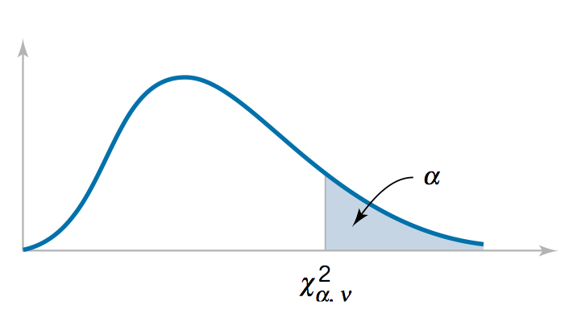


+ 95% da área da distribuição encontra-se entre $\chi^2_{0,975}$ e $\chi^2_{0,025}$:  
  A distribuição Qui-Quadrado é assimétrica e tem suporte no conjunto dos números reais não negativos. Ela deixa uma área igual a $\alpha$ à direita do quantil $\chi^2_\alpha$ , de forma que 95% da área sob a curva de densidade $\chi^2$ se encontra entre os percentis 97,5% e 2,5%. 

Portanto, para um certo número de graus de liberdade, $\nu$:

+ Se $Q^2 > \chi^2_{0,025; \nu}$: resultado improvável (P < 0,025), a menos que $\sigma^2 \downarrow$  
+ Se $Q^2 < \chi^2_{0,975; \nu}$: resultado improvável (P < 0,025), a menos que $\sigma^2 \uparrow$  


Podemos utilizar esta distribuição para realizar inferência a respeito da variância populacional. Para um certo número de graus de liberdade, $\nu$: se o valor observado da estatística $Q^2$ se encontrar à direita do percentil 2,5% temos um resultado bastante improvável (já que a área à direita do valor da estatística é inferior a 2,5%), a menos que a variância populacional seja menor que o imaginado. Um raciocínio análogo se aplica para valores observados da estatística $Q^2$ menores que o percentil 97,5%. Isso significa que é possível observar $Q^2$ à esquerda de do percentil 97,5% e à direita do percentil 2,5%, quando $\sigma^2$ está correto, mas é mais provável que nossa ideia a respeito deste parâmetro esteja errada.
  

::: {.example #unnamed-chunk-27}
:::


Uma companhia produz medicamentos que contém 8g de um determinado composto em um frasco do medicamento. Engenheiros da qualidade determinaram que o processo estará operando em conformidade com o especificado se a variabilidade real $\sigma^2$ do composto por frasco for menos que 0,0025. 

Uma a.a. de 10 frascos  é selecionada e a quantidade do composto em cada frasco é medida. 
Assuma que a quantidade do composto seja normalmente distribuída. 
Estamos interessados na variância amostral, $Sn^2$. 

Se, de fato, $\sigma^2 =$ 0,001, qual a probabilidade de que $S_n^2$ exceda 0,0025? 


::: {.solution}
:::


Temos: $X_1, X_2, \ldots, X_{n=10} \sim N(\mu, \sigma^2)$.  
Queremos: $P[S_n^2 > 0.0025]$: 

+ Para calcular esta probabilidade, utilizaremos a estatística: 
$$Q^2 = (n-1) S_n^2/\sigma^2 \sim \chi^2_{\nu = n-1}$$
Portanto:  


\begin{align*}
  P[S_n^2 > 0.0025]
  &= P\left[(n-1)\frac{S_n^2}{\sigma^2} > (n-1)\frac{0.0025}{\sigma^2}\right]; \quad n = 10; \sigma^2 = 0.001\\
  &= P\left[\chi^2 > 9 \frac{0.0025}{0.001}\right] = P[\chi^2 > 22.5]\\
\end{align*}


Da tabela, $\nu=9$, $\chi^2_\alpha = 22.5$. Precisamos encontrar o valor de $\alpha$ (probabilidade).

Na linha de $\nu =9$, temos apenas $\chi^2_{0.01} = 21.67$ e $\chi^2_{0.005} = 23.59$.
Podemos interpolar os valores de probabilidade associados a esses quantis, ou encontrar uma faixa de valores em que se encontra a probabilidade desejada:

$0.005 < P[\chi^2 > 22.5] < 0.01$, se a variância populacional for de fato $\sigma^2 = 0.001$.


no R:   


```r
1 - pchisq(22.5, df = 9)  
```


### Distribuição t-Student {-}


Sejam $X_1, X_2, \ldots, X_n$ i.i.d. $N(\mu, \sigma^2)$. 

Se $\sigma$ conhecido: $\quad \frac{\overline{X}_n - \mu}{\sigma/\sqrt{n}}   \sim N(0,1)$

Se $\sigma$ **desconhecido** (em geral, este é o caso):

$$T = \frac{\overline{X}_n - \mu}{S_n/\sqrt{n}}   \sim t_\nu$$


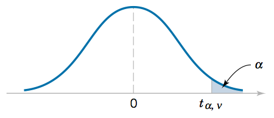


onde: 

$\nu = n-1$: no. de graus de liberdade  

Simetria: $t_{1-\alpha,\nu} = - t_{\alpha, \nu}$

Em outras palavras, se $X_1, X_2, \ldots X_n$ constituem uma a.a. de uma população Normal com média $\mu$ e variância $\sigma^2$, sabemos, independentemente do TLC, que a estatística padronizada tem distribuição normal padronizada. Quando o valor de $\sigma$ é conhecido, podemos utilizar essa estatística para realizar inferência a respeito da média populacional $\mu$, já que esta é a única quantidade populacional desconhecida.

Na maioria dos casos práticos em que se deseja realizar inferência a respeito da média populacional, no entanto, é irreal acreditar que a variância populacional $\sigma^2$ seja conhecida. Na realidade, se temos dúvidas a respeito da localização do centro da distribuição, o que dizer a respeito de sua dispersão? Como podemos realizar inferência a respeito de $\mu$, neste caso?

Este problema foi investigado por William Gosset (que publicou seus resultados sob o pseudônimo de Student) no início do século XX. Este trabalho resultou no desenvolvimento da distribuição t-Student. Gosset fez o óbvio: olhou para a distribuição amostral da estatística $T$, em que a variância populacional desconhecida $\sigma^2$ é substituída pelo estimador variância amostral. Ele percebeu que a distribuição da estatística $T$ tinha uma forma semelhante à da distribuição normal, exceto por apresentar um maior achatamento e, portanto, caudas mais longas, explicadas pela maior variabilidade observada em decorrência da incerteza associada ao desconhecimento e consequente necessidade de estimar a variância populacional. De fato, ele desenvolveu uma formulação matemática para a distribuição da estatística $T$, que ficou conhecida como distribuição t-Student.

Em suma, a distribuição t−Student é útil para realizar inferências a respeito da média populacional (ou entre diferenças de duas médias populacionais) quando a variância populacional $\sigma^2$ é desconhecida.

É importante observar que, para amostras de tamanho pequen,o a variância amostral $S_n^2$ flutua muito de amostra para amostra, de forma que a distribuição $t$ correspondente é muito mais achatada que a distribuição normal padronizada. Conforme o tamanho da amostra aumenta, a distribuição t se aproxima da distribuição normal padronizada, de forma que é indiferente utilizar a distribuição t ou normal padronizada para realizar inferência a respeito da média populacional com base em amostras grandes. Para amostras pequenas (com n < 30), deve-se utilizar a distribuição t-Student.


::: {.example #unnamed-chunk-30}
:::


Determine o valor de $k$ de forma que 
$$P[k < T < -1,761] = 0.045$$
para uma a.a. $X_1, \ldots, X_n$ de tamanho $n=15$ selecionada a partir de uma distribuição normal, em que 
$$T = \frac{\overline{X}_n - \mu}{S_n/\sqrt{n}}.$$


::: {.solution}
:::


Se a população é normal, então a estatística $T \sim t_\nu$ onde:  $\nu = n -1 = 14$ g.d.l.  

Temos: $-1.761 = -t_\alpha = t_{1-\alpha}$ (simetria)  

Da tabela da distribuição t-Student: $\nu = 14 \; \Rightarrow t_\alpha = 1.761 \quad \therefore \alpha = 0.05$

Seja $k = - t_\beta: \quad 0.045 =  \alpha - \beta = 0.05 - \beta \; \therefore \beta = 0.005$.  

Portanto: $k = - t_\beta = - 2.977$.


**OBS:**  Exatamente 95% dos valores da distribuição $t-$Student com $\nu = n-1$ g.d.l. encontram-se entre $-t_{0.025}$ e $t_{0.025}$ (valores tabelados). E, assim, valores observados para a estatística $T$ fora deste intervalo caracterizam eventos **raros**.

no R: 


```r
pt(-1.761, 14) - pt(-2.977, 14)
```


::: {.example #unnamed-chunk-33}
:::


Um engenheiro afirma que a concentração média (populacional) de uma determinada substância química é de 500mg/ml de solução. Considere  que a distribuição da concentração desta substância seja aproximadamente normal.

A fim de avaliar esta conjectura, todo mês ele mede a concentração média de uma amostra obtida a partir de 25 frascos de solução. Se o valor $T$ calculado estiver entre $-t_{0,05}$ e $t_{0,05}$, a hipótese é mantida.

A que conclusão pode-se chegar a partir de uma amostra cuja concentração média vale $\overline{x} = 518$mg/ml, com desvio-padrão de $s=40$mg/ml? 


::: {.solution}
:::


Temos:
$\mu = 500$mg/ml; n = 25 $\Rightarrow \nu = 25-1 = 24$; 

Para a amostra obtida: $\overline{x} = 518$mg/ml e $s=40$mg/ml.

O engenheiro está satisfeito se $-t_{0.05; 24} < T < t_{0.05; 24}$.  
Da tabela da distribuição t-Student, $t_{0.05; 24} = 1.711$. 

$$T = \frac{518 - 500}{40/\sqrt{25}} = 2.25 > t_{0,05}!$$

Portanto, a hipótese de que $\mu=500$ml/mg não parece ser válida.   
É mais provável que  $\mu>500$ml/mg.


no R:   


```r
c(qt(0.05, 24), qt(0.95, 24))
```


## Aproximando Distribuições Amostrais via Simulação de Monte Carlo


Vimos que as distribuições amostrais relacionam o que se espera de uma amostra às características da população.  Vimos também que é possível determinar as distribuições amostrais exatas de algumas estatísticas obtidas a partir de amostras retiradas de populações normais.

No entanto, distribuições amostrais de estatísticas podem ser determinadas matematicamente apenas em casos muito simples e para uma quantidade limitada de estatísticas. Uma estratégia  alternativa é utilizar simulação para obter uma distribuição amostral aproximada para uma estatística arbitrária, calculada a partir de uma amostra retirada de uma população também arbitrária.

Se nem simulação for possível, ainda nos resta o recurso de obter uma descrição aproximada utilizando a regra empírica, no caso de distribuições simétricas e unimodais, ou a regra de Chebyshev, no caso de distribuições completamente arbitrárias, para as quais se conhece apenas média e variância.

Vejamos como obter aproximações para as distribuições amostrais de algumas estatísticas utilizando simulação de Monte Carlo. Para isso, consideraremos amostras de tamanho fixo igual a 30, retiradas de três populações idealizadas:  a população uniforme entre 0 e 1, a população exponencial com parâmetro $\lambda = 2$ e população normal padronizada.


### Distribuição Aproximada da Mediana Amostral {-}


#### População Idealizada: U(0,1) {-}


#### População Idealizada: Exp(2) {-}


#### População Idealizada: N(0,1) {-}


É possível demonstrar que a distribuição amostral da mediana se aproxima de uma distribuição normal, embora a média amostral apresente variâncias menores. Para outras estatísticas, não há garantia de convergência da distribuição amostral.


### Distribuição Aproximada do Desvio-Padrão Amostral {-}


#### População Idealizada: U(0,1) {-}


#### População Idealizada: Exp(2) {-}


#### População Idealizada: N(0,1) {-}


### Distribuição Aproximada da Variância Amostral {-}


#### População Idealizada: U(0,1) {-}


#### População Idealizada: Exp(2) {-}


#### População Idealizada: N(0,1) {-}


### Distribuição Aproximada do MAD (Desvio Mediano Absoluto) {-}


#### População Idealizada: U(0,1) {-}


#### População Idealizada: Exp(2) {-}


#### População Idealizada: N(0,1) {-}


### Distribuição Aproximada da Amplitude Inter-Quartis (IQR) {-}


#### População Idealizada: U(0,1) {-}


#### População Idealizada: Exp(2) {-}


#### População Idealizada: N(0,1) {-}


Neste capítulo, vimos alguns dos conceitos fundamentais mais importantes para o Estudo de Estatística. A seguir, veremos como utilizar as distribuições amostrais de estatísticas para realizar inferências a respeito de parâmetros populacionais desconhecidos.

<!--chapter:end:09-ch9.Rmd-->

# Estimação Pontual


No capítulo anterior, vimos que um conjunto de observações pode ser entendido como uma realização de uma amostra aleatória coletada a partir de uma população com certa distribuição de probabilidade. E, considerando que esse conjunto de dados constitui uma amostra representativa da população em questão, podemos utilizá-la para fazer inferências. 

Neste sentido, realizamos inferência para transformar dados em conhecimentos, onde o conhecimento é comumente representado em termos de entidades que não estão presentes nos dados, mas estão presentes nos modelos que  utilizamos para interpretar os dados.

Em estatística clássica, assumimos que o estado da natureza (representado através de parâmetros de um modelo) é fixo, embora desconhecido. Portanto, na abordagem clássica, podemos realizar inferência de duas maneiras: 
(i) estimando o valor desconhecido de uma quantidade populacional, ou    
(ii) tomando uma decisão com relação a uma conjectura a  respeito de uma quantidade populacional.

Neste capítulo, trataremos do problema de estimação que, na estatística clássica, se baseia em duas perguntas fundamentais:

> 1. Como determinamos estimadores?  
> 2. Como avaliamos estimadores?

Veremos os conceitos de estimador e estimativa, bem como discutiremos algumas propriedades desejáveis dos estimadores para, finalmente, aprendermos como construir estimadores para certas características populacionais.

Para isso, consideremos o seguinte exemplo:

Suponha que observamos o processo de chegada de clientes a um café. E, que mais especificamente, estamos interessados em determinar: (i) taxa de chegada dos clientes; e (ii) o percentual de tempo em que nenhum novo cliente chega ao estabelecimento ( $p_o$ ).

Vimos anteriormente que, se as chegadas ocorrem completamente ao acaso no tempo e,
guardadas as hipóteses de homogeneidade e independência, o processo de chegada pode ser modelado como um processo de Poisson.


Portanto, definindo a va.  
$X$ = número de chegadas ao café (durante um certo intervalo de tempo),

então 

$X \sim Pois( \lambda )$, com $\lambda$ desconhecido.  

Utilizando o modelo de Poisson:

+ a taxa de chegada é dada pelo parâmetro $\lambda$, que corresponde ao valor esperado da distribuição;    
+ $p_o$ corresponde à probabilidade P[X = 0] = $e^{-\lambda}$.  

Inicia-se, então, a contagem do tempo e observa-se o processo de chegada por um certo período, registrando-se os valores numéricos 

$$x_1, x_2, \ldots, x_n,$$

onde:

$x_i=$ número **observado** de chegadas no $i$-ésimo instante, a partir do início da contagem do tempo.


Este exemplo ilustra a situação geral em que o conjunto de dados obtido

$$x_1, x_2, \ldots, x_n,$$

é modelado como a **realização de uma amostra aleatória**

$$X_1, X_2, \ldots, X_n,$$

retirada de uma população completamente determinada por um conjunto de parâmetros.

Note que antes de os valores serem efetivamente observados, as observações que compõe uma a.a. genérica de tamanho $n$ são representadas por letras maiúsculas.

Precisamos, então, **estimar**, com base nas quantidades observadas:

+ o parâmetro $\lambda$, e  
+ uma função do parâmetro, $p_o = e^{-\lambda}$


## Estimador e Estimativa


De maneira geral, suponha que desejamos estimar uma quantidade ou parâmetro populacional representado por $\theta$. Por exemplo, $\theta$ poderia ser a média populacional $\mu$, ou a variância populacional $\sigma^2$, ou ainda uma outra quantidade associada a essa população, como a probabilidade $p_o$ no exemplo anterior. Sendo assim, se $\theta$ for o parâmetro populacional de interesse, então:

Um **ESTIMADOR** de $\theta$, representado por $\hat\Theta$, é uma função dos valores conceituais, não-observados, de uma a.a.. O estimador é uma "regra" que nos ensina como utilizar as observações da a.a. para calcular um valor numérico que estima o parâmetro populacional em questão.

Já uma **ESTIMATIVA**, representada por $\hat\theta$, corresponde a um valor numérico calculado a partir dos valores efetivamente observados de uma a.a. em particular, utilizando a regra prescrita pelo estimador. Diferentes amostras aleatórias resultarão em diferentes estimativas para um mesmo parâmetro populacional, quando se utiliza o mesmo estimador. Qualquer que seja a regra ou o estimador utilizado, o resultado da estimativa depende apenas dos valores observados na amostra.

Imagine, por exemplo, que um alienígena deseja estimar a altura média dos seres humanos. Neste caso, o parâmetro que se deseja estimar é a média populacional $\mu$. Podemos eleger como estimador a média amostral $\bar{X}_n$. Isto significa que estimaremos a altura média populacional calculando a média aritmética dos valores observados na amostra; esta é a regra prescrita pelo estimador "média amostral". Então, coletamos uma amostra aleatória de, digamos, 20 indivíduos dessa população, calculamos a média aritmética dessas 20 observações, obtendo uma estimativa de 1,72m para a altura média populacional; uma outra amostra aleatória distinta, também contendo 20 observações, poderia nos ter dado uma estimativa de, por exemplo, 1,68m para a altura média populacional. 

Cada estimativa corresponde a um valor numérico; portanto, a estimativa $\hat\theta$ representa uma realização do estimador $\hat\Theta$. Já um estimador é uma estatística, isto é, uma função dos valores não observados de uma a.a.. Antes de os dados serem coletados, os valores da amostra aleatória são considerados v.a.'s retirados de maneira independente de uma distribuição comum. E, como qualquer função de v.a.'s é uma v.a., um estimador é também uma v.a. Portanto, um estimador possui uma distribuição amostral. Assim, a distribuição amostral do estimador descreve de maneira completa seu comportamento aleatório. Sabemos, pelo TLC, por exemplo, que o estimador média amostral tem distribuição aproximadamente normal para amostras de tamanho elevado. A ideia é, então, escolher um estimador $\hat\Theta$ capaz de nos dar boas indicações (ou estimativas) a respeito do valor "real" do parâmetro populacional $\theta$, com base nas informações disponíveis em uma amostra.


#### Estimando $\lambda$ {-}


Retomando o exemplo do café, como podemos proceder para estimar $\lambda$?

Bem, sabemos que a distribuição de Poisson tem média e variância iguais ao parâmetro populacional que a define,  $\lambda$. Já que a média populacional vale  $\lambda$, a Lei dos Grandes Números sugere que a média amostral seja um estimador natural para a média populacional. Por outro lado, o parâmetro  $\lambda$ também representa variância populacional no modelo de Poisson.  Portanto, as características da distribuição de Poisson sugerem que temos dois estimadores naturais para  $\lambda$: 

+ média amostral: 
$$\bar{X}_n = \frac{1}{n}\sum_{i=1}^n X_i$$

+ variância amostral: 
$$S_n^2 = \frac{1}{n-1}\sum_{i=1}^n (X_i - \bar{X}_n)^2$$

E as opções não param por aí... Outros estimadores também seriam possíveis! De toda forma, consideraremos apenas esses dois candidatos.


#### Estimando $p_o$ {-}


Estamos interessados também em outra quantidade populacional,  $p_o$, que corresponde à probabilidade de nenhuma ocorrência. Segundo o modelo de Poisson, esta probabilidade é dada por uma função do parâmetro $\lambda$, e vale $e^{-\lambda}$. 

Sendo assim, também temos dois estimadores naturais para  $p_o$:

+ frequência relativa de zeros observados na a.a.: 
$$\frac{\textsf{no. de observações na a.a. em que }X_i = 0}{n}$$

+ uma função do estimador de $\lambda$ (já que utilizamos a média amostral $\bar{X}_n$ para estimar a média populacional $\lambda$, podemos estimar $p_o$ substituindo o parâmetro populacional $\lambda$ na expressão de  $p_o$ pelo estimador média amostral):
$$e^{-\bar{X}_n}$$

Aqui também seria possível escolher outros estimadores, mas nos limitaremos a esses dois.


Temos inúmeras opções disponíveis de estimadores para os parâmetros populacionais de interesse; podemos empregar até mesmo funções de estimadores. Algumas questões importantes são as seguintes: 

+ *Como escolher um estimador adequado?*  
+ *Quando um estimador é melhor do que outro?*  
+ *Existe um estimador que seja o "melhor de todos"?*  
+ *Podemos determinar qual das estimativas obtidas a partir de uma mesma a.a., utilizando diferentes estimadores, se aproxima mais do valor "real" do parâmetro populacional de interesse?* 

No nosso exemplo, desejamos estimar o parâmetro $\lambda$ e, para isso, elegemos os estimadores média amostral e variância amostral para obter estimativas para o valor de $\lambda$ a partir dos valores observados para uma certa a.a.. Então, suponha que tenhamos registrado 30 observações e que tenhamos obtido as estimativas média amostral = 2,03 e variância amostral = 1,62 para essa amostra. Será que é possível determinar qual dessas estimativas (2,03 ou 1,62) se aproxima mais do valor real e desconhecido do parâmetro $\lambda$?

A resposta a esta pergunta é NÃO! As observações que compõe uma a.a. e, consequentemente, as estimativas obtidas a partir dela, são sujeitas à aleatoriedade. Portanto, não é possível afirmar com certeza qual dos valores estimados é mais próximo do valor real de lambda!

É, possível, no entanto, fazer afirmações probabilísticas a respeito da distância dessas estimativas ao valor real do parâmetro de interesse. Para isso, é necessário investigar o comportamento aleatório dos estimadores, através do conhecimento de sua distribuição amostral. E assim, sermos capazes de identificar se possuem certas características consideradas desejáveis para um estimador. É isso o que veremos a seguir.


## Propriedades de Estimadores


Há ocasiões em que muitos estimadores alternativos podem ser utilizados para estimar uma mesma quantidade populacional desconhecida. É necessário, portanto, estabelecer alguns critérios para comparar os estimadores e decidir se algum ou qual deles possui características desejáveis para um estimador. As propriedades de um estimador ideal que veremos a seguir foram conceitos introduzidos por sir Ronald Fisher na primeira metade do século XX.

A fim de discutir tais as propriedades desejadas de estimadores, vamos retomar nosso exemplo do café. Suponha que observamos as chegadas ao café que ocorreram durante 30 minutos e registramos o número de chegadas a cada minuto. Assim, obtemos um conjunto de dados, que corresponde a uma realização de uma a.a. $X_1, X_2, \ldots, X_n$, de tamanho $n=30$ de uma população com distribuição de Poisson com parâmetro ( $\lambda$ ). Com base nesta amostra, queremos estimar as quantidades populacionais de interesse: $\lambda$ e $p_o$


#### Estimando $\lambda$  {-}


Temos dois estimadores candidatos para o parâmetro $\lambda$: média amostral e variância amostral.
Qual deles devemos escolher?

Vamos utilizar simulação para nos ajudar a escolher os estimadores para os parâmetros desejados:

A título de ilustração, vamos supor que o valor real do parâmetro seja $\lambda = \ln10$;
então, vamos fingir que não conhecemos essa informação e vamos fazer um pequeno jogo de adivinhação:

+ Amostramos 30 observações a partir da população Poisson com parâmetro $\lambda = \ln10$;  
+ Calculamos os valores de $\bar{X}_n$ e $S_n^2$ para a amostra coletada; e  
+ Repetimos os dois passos anteriores um número muito grande de vezes.  

O que estamos fazendo dessa maneira? Estamos obtendo um número muito grande de valores de $\bar{X}_n$ e $S_n^2$  a fim de que possamos construir histogramas para os valores calculados para essas duas quantidades; esses histogramas estimam as distribuições amostrais das estatísticas consideradas.


```r
lambda <- log(10)  # lambda real (desconhecido)
nS     <- 1000     # no. de a.a's coletadas
nobs   <- 30       # no. de obs. em cada amostra 
                   # (tamanho da a.a.)

# (1) obteção das amostras aleatórias
aa <- matrix(rpois(nobs*nS, lambda), ncol = nobs) 
# cada uma das 'nS' linhas recebe 
# uma amostra de tamanho 'nobs'

# (2) cálculo das estatisticas para as amostras
X_bar <- apply(aa, 1, mean)
Sn2   <- apply(aa, 1, var) 

# (3) distribuição amostral das estatisticas
# a. média amostral:
hist(X_bar, freq = FALSE,
     density = 45, col = "gray",
     main = "")
abline(v = lambda, col = 2, lty = "dashed")      # lambda "real" em  vermelho
abline(v = mean(X_bar), col = 4, lty = "dashed") # media dist. amost.em  azul

# b. variância amostral:
hist(Sn2, freq = FALSE,
     density = 45, col = "gray",
     main = "")
abline(v = lambda, col = 2, lty = "dashed")      # lambda "real" em  vermelho
abline(v = mean(Sn2), col = 4, lty = "dashed")   # media dist. amost. em  azul
```


Os dois gráficos com as distribuições amostrais estimadas para os estimadores média amostral e variância amostral foram obtidos com o código em R fornecido acima. Neles, é possível observar como variam os valores estimados de $\lambda$ para os diferentes estimadores, aplicados a uma grande quantidade de amostras aleatórias distintas, geradas a partir de simulação.

Para algumas amostras é possível perceber que os valores estimados diferiram consideravelmente do valor real de lambda, $\ln10$ que vale aproximadamente 2,3, independentemente do estimador utilizado. 

Queremos um estimador que, em média (ou seja, quando obtemos muitas e muitas amostras da população de origem), ofereça resultados satisfatórios, isto é, que não erre de maneira sistemática ao estimar o valor real do parâmetro de interesse.

De certa forma, os dois estimadores considerados (média amostral e variância amostral) são satisfatórios neste sentido. Note que os valores estimados para $\lambda$ parecem flutuar em torno do valor “real” em ambos os casos.

De fato, é possível demonstrar (e isso fica como exercício para casa) que
os valores esperados da média amostral e da variância amostral valem $\lambda$, ou seja, as distribuições amostrais de ambos os estimadores estão centradas no parâmetro que se quer estimar:

$$E[\bar{X}_n]=\lambda; \qquad E[S^2_n]=\lambda$$

Isto significa que os estimadores média amostral e variância amostral não apresentam uma tendência sistemática de produzir estimativas nem maiores (superestimadas) nem menores (subestimadas) do parâmetro de interesse, $\lambda$.


### Não-Tendeciosidade (exatidão) {-}


Esta é uma característica muito desejável em um estimador, chamada não-tendenciosidade ou exatidão. 
Um estimador é dito exato, ou não-tendencioso, ou não-viesado, ou não-viciado, quando sua distribuição amostral está centrada no parâmetro que se presta a estimar. Neste caso, o viés, que mede o desvio sistemático deste estimador ao parâmetro populacional, vale zero.

+ um estimador não-viesado é aquele que não tende a subestimar ou superestimar o valor real do parâmetro populacional, $\theta$  

+ a distribuição amostral de $\hat\Theta$ está centrada em $\theta$

$$E[\hat\Theta] = \theta \quad \Longrightarrow \quad \text{Viés} = b(\hat\Theta) = E[\hat\Theta] - \theta = 0$$


Ótimo, quer dizer que encontramos dois estimadores não-tendenciosos para o parâmetro $\lambda$! 

Isso significa que é indiferente escolher um dos dois? 

A resposta é NÃO! Existem outras características que também são importantes para um estimador.

Observe novamente os histogramas para os valores obtidos para os dois
estimadores. Qual a diferença entre eles?


Ambos apresentam uma certa variabilidade em torno do valor real de $\lambda$. No entanto, perceba que a variação nos valores calculados para a média amostral é menor que a variação nos valores calculados para a variância amostral. De fato, basta comparar os valores das variâncias amostrais dos dois estimadores, registradas abaixo de cada um dos histogramas. Isto indica que o estimador média amostral produz estimativas, em geral, mais próximas do valor real do parâmetro lambda que a variância amostral. E esta é uma outra característica desejável de um estimador.


### Eficiência (precisão) {-}


A eficiência é uma medida relativa de precisão de dois estimadores não tendenciosos. É dito mais eficiente o estimador não tendencioso que apresentar menor variância amostral.

+ dados dois estimadores .ired-inline[não-tendenciosos], $\hat\Theta_1$ e $\hat\Theta_2$, com variâncias amostrais dadas por $S_1^2$ e $S_2^2$:  


$\qquad \qquad S_1^2 < S_2^2 \quad \Longrightarrow \quad \hat{\Theta}_1$ é mais eficiente que $\hat{\Theta}_2$


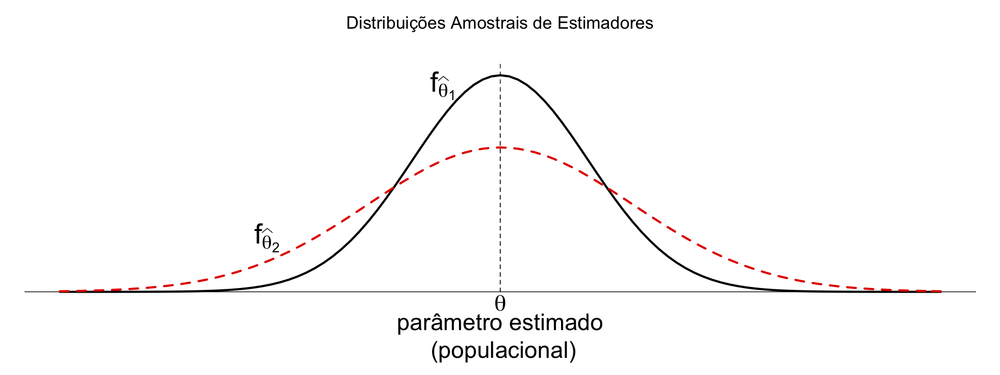


#### Estimando $p_o$ {-}  


Agora, vamos estimar a quantidade populacional $p_o$, que corresponde à probabilidade de nenhuma chegada no intervalo de tempo considerado (note que, como esta quantidade populacional é uma probabilidade, é um número entre 0 e 1!).

Consideraremos dois estimadores candidatos:

$$S = \frac{\textsf{no. de observações na a.a. em que }X_i = 0}{n} \qquad \textsf{e} \qquad W = e^{-\bar{X}_n}$$

O que podemos esperar desses estimadores?

Novamente, utilizaremos simulação para nos auxiliar a responder a esta pergunta, seguindo o mesmo procedimento realizado anteriormente:

+ supor $\lambda = \ln 10$ (desconhecido)  tal que $p_o = 0.1$
+ amostrar n = 30 observações a partir de Pois ( $\lambda = \ln 10$ )  
+ calcular valores os que $S$ e $W$ assumem para as observações da a.a.  
+ repetir esse procedimento um grande número de vezes
+ construir a distribuição amostral para cada estimador


```r
lambda <- log(10)  # lambda real (desconhecido)
po <- exp(-lambda) # po real (desconhecido)

# Define Estimadores (funcoes de a.a.'s)
# Estimador freq. relativa de 0's
S_fcn <- function(x) return(sum(x == 0)/length(x))
# Estimador e^{-X_bar}
W_fcn <- function(x) return(exp(-mean(x)))

# (2) cálculo das estatisticas para as amostras
S_hat <- apply(aa, 1, S_fcn)
W_hat <- apply(aa, 1, W_fcn) 

# (3) distribuição amostral das estatisticas
# a) S
hist(S_hat, freq = FALSE,
     density = 45, col = "gray",
     main = "")
abline(v = po, col = 2,  lty = "dashed")         # po "real" em  vermelho
abline(v = mean(S_hat), col = 4, lty = "dashed") # media dist. amost. em  azul
# b) W
hist(W_hat, freq = FALSE,
     density = 45, col = "gray",
     main = "")
abline(v = po, col = 2,  lty = "dashed")         # po "real" em  vermelho
abline(v = mean(W_hat), col = 4, lty = "dashed") # media dist. amost. em  azul
```


Os gráficos com as distribuições amostrais estimadas foram obtidos com o código em R fornecido acima. Os valores estimados para $p_o$ parecem flutuar em torno do valor “real” (0,1) que pretendem estimar. Será verdade? Precisamos calcular o viés destes estimadores.

Definindo:
$Y =$ número de observações em uma amostra aleatória de tamanho $n$ em que $X_i = 0$ (sucesso), então, chegamos à conclusão de que 

$$Y \sim Bin(n, p_o)$$

É possível demonstrar (e isto fica como exercício para casa) que o estimador S, dado pela proporção de sucessos é não viesado, ou seja tem valor esperado igual a $p_o$:

$$S = \frac{Y}{n} \qquad \Rightarrow \qquad E[S] = p_o$$

Portanto, o estimador $S$ é não-viesado.

Agora, analisemos o estimador $W = e^{-\bar{X}_n}$. A partir da análise visual da distribuição amostral estimada, Podemos ter a impressão de que $W$ é também um estimador não-viesado. Mas isto não é verdade! É possível mostrar que:
$$E[W] = E[e^{-\bar{X}_n}] = e^{-n\lambda(1- e^{-1/n})}
  \quad \underset{n \rightarrow \infty}{\longrightarrow} e^{-\lambda} = p_o$$

No entanto, embora o estimador $W$ seja tendencioso, ele tem uma característica interessante: é possível mostrar que este estimador produz estimativas que convergem para o valor real de $p_o$, conforme aumenta o tamanho da amostra $n$. Sendo assim, embora o estimador seja positivamente viesado (tende a superestimar o parâmetro real), o viés tende a zero à medida em que o tamanho da amostra aumenta.


### Consistência {-}


Diz-se que um estimador é consistente quando as estimativas por ele produzidas convergem em probabilidade para o valor real do parâmetro, conforme aumenta o tamanho da amostra. Isso significa que tanto o viés quanto a variância do estimador tendem a zero, para amostras grandes.

+ à medida que o tamanho da amostra $n$ aumenta, o valor esperado do estimador consistente tende para o parâmetro populacional e a variância do estimador cai a zero: 

$$\underset{n\rightarrow \infty}{\lim} P[|\hat{\Theta}_n -\theta| < \epsilon] = 1,  \quad \{\hat\Theta_n , n\geq0\}$$


Veja no gráfico abaixo como o valor esperado de $W$ converge para o valor real de $p_o = 0,1$, conforme tomamos amostras de tamanho crescente.


```r
lambda <- log(10)  # lambda real
po <- exp(-lambda) # po real

# Valor esperado do estimador e^{-X_bar}
W_expectation <- function(x, lambda){ 
  return(exp(-(x*lambda)*(1-exp(-1/x))))
  }

# Gráfico de E[W] x n
plot(W_expectation(1:100, lambda), type="l",
     col = "gray", lwd = 3,
     ylab = "E [ W(n) ]",
     xlab = "tamanho da amostra, n",
     main = "")
abline(h = po, col = 2, lty = "dashed")   # po "real" em  vermelho
```


::: {.example #unnamed-chunk-8}
:::


Seja $X_1, X_2, \ldots, X_n$ uma a.a. de uma distribuição com média $\mu$ e variância $\sigma^2$.

Responda:

1) A estatística $\overline{X}_n$ é um estimador não-tendencioso de $\mu$?    
2) A estatística $S_n^2$ é um estimador não-viesado de $\sigma^2$?    
3) A estatística $S_n$ é um estimador não-viciado de $\sigma$?    

**OBS:**  
Se $\hat{\Theta}$ é um estimador não-viesado de $\theta$, $g(\hat{\Theta})$ não-necessariamente é um estimador não-viesado de $g(\theta)$.  

Para o caso particular em que $g(\hat{\Theta}) = a\hat{\Theta} + b$, a não-tendenciosidade é transmitida. 


::: {.solution}
:::


**1)**   
$X_1, X_2, \ldots, X_n  \overset{ind.}{\sim} f_X:$ $E[X_i] = \mu$ e $\textsf{Var}[X_i] = \sigma^2$, $i = 1, 2, \ldots, n$.

> A estatística $\bar{X}_n$ é um estimador não-tendencioso de $\mu$?

Temos: 
\begin{align*}
  E[\bar{X}_n] = E\left[\frac{1}{n}\sum X_i\right] = \frac{1}{n} \sum E[X_i] = \frac{1}{n} \sum \mu = \frac{1}{n} (n \cdot \mu) = \mu
\end{align*}

Portanto, $\bar{X}_n$ é um estimador não tendencioso de $\mu$.

**2)**  
$X_1, X_2, \ldots, X_n  \overset{ind.}{\sim} f_X:$ $E[X_i] = \mu$ e $Var[X_i] = \sigma^2$, $i = 1, 2, \ldots, n$.

> A estatística $S_n^2$ é um estimador não-viesado de $\sigma^2$?

Temos: $Var[Y] = E[Y^2] - (E[Y])^2 \Rightarrow  E[Y^2] = Var[Y] - (E[Y])^2 = \sigma^2 + \mu^2$
\begin{align*}
  E[S_n^2] 
  &= E\left[\frac{1}{n-1}\sum (X_i - \bar{X})^2\right]\\ 
  &= E\left[\frac{1}{n-1}\left(\sum X_i^2 - \frac{(\sum X_i)^2}{n}\right)\right]\\
  &= \frac{1}{n-1}\left[ \sum E[X_i^2] - \frac{E[(\sum X_i)^2]}{n} \right]
\end{align*}

\begin{align*}
  E[S_n^2] 
  &= \frac{1}{n-1}\left[ \sum (\sigma^2 + \mu^2) - \frac{Var[\sum X_i] + (E[\sum X_i])^2}{n}  \right]\\ 
   &= \frac{1}{n-1}\left[n(\sigma^2 + \mu^2) - \frac{1}{n} (n\sigma^2 + (n\mu)^2) \right]\\
  &= \frac{1}{n-1}\left[ n\sigma^2 + n\mu^2 - \sigma^2 - n\mu^2 \right] = \frac{1}{n-1}\left[(n-1)\sigma^2 \right] = \sigma^2
\end{align*}

Portanto, $S_n^2$ é um estimador não tendencioso de $\sigma^2$. 

Já $S_n$ é um estimador tendencioso de $\sigma$: $E[S_n] \neq \sigma$ (viés $\downarrow$ quando $n \uparrow$).


### Erro Médio Quadrático {-}


Nem sempre é possível obter um estimador que seja ao mesmo tempo não-tendencioso e eficiente. Além disso, pode ser difícil comparar um estimador viesado com pequena variância a um estimador não-tendencioso, mas que produz estimativas com grande dispersão.

Portanto, é desejável combinar as propriedades de não tendenciosidade e mínima variância para avaliar a qualidade de um estimador.  Esta combinação pode ser obtida através do erro médio quadrático, que corresponde à soma da variância e do viés quadrático. Sendo assim, o erro médio quadrático pode ser utilizado como uma medida relativa de eficiência na comparação de dois ou mais estimadores. Um estimador torna-se mais eficiente a medida que seu erro médio quadrático diminui.

+ O erro médio quadrático (MSE, *mean squared error*)  corresponde ao valor médio dos desvios quadráticos entre $\hat{\Theta}$ e $\theta$.

$$MSE [\hat{\Theta}] = E[(\hat\Theta - \theta)^2] = \mathit{Var}[\hat\Theta] + \left(b[\hat\Theta]\right)^2$$


::: {.example #unnamed-chunk-10}
:::


Sejam $\Theta_1$ e $\Theta_2$ estimadores independentes não-tendenciosos de $\theta$, com variâncias conhecidas dadas por $\sigma_1^2$ e $\sigma_2^2$.

1)  Mostre que qualquer estimador na forma
  $$\Theta^\star = \lambda \Theta_1 + (1-\lambda) \Theta_2$$
  é também não tendencioso.

2) Qual o valor de $\lambda$ que confere a $\Theta^\star$ o menor erro médio quadrático?  


## Métodos Clássicos de Estimação de Parâmetros


Como vimos anteriormente, em alguns casos é fácil decidir como estimar certos parâmetros populacionais e as escolhas de estimadores podem ser bastante intuitivas, de forma que surgem candidatos naturais a estimadores para uma certa quantidade populacional. No entanto, há situações mais complexas em que apenas a intuição não nos servirá de muito auxílio. É necessário, portanto, estabelecer alguns métodos sistemáticos para construir estimadores para parâmetros populacionais.
Veremos a seguir dois métodos clássicos, o método dos momentos e o método da máxima verossimilhança.


### Método dos Momentos {-}


O método dos momentos é, talvez, o método de construção de estimadores mais antigo a fazer parte da caixa de ferramentas estatísticas, tendo sido desenvolvido por Karl Pearson, no final do século XIX. 
Este método de estimação baseia-se na Lei dos Grandes Números que, como vimos anteriormente, afirma que a média amostral converge para o valor esperado populacional conforme o número de observações na amostra aumenta. Sendo assim, na sua forma mais simples, o método dos momentos consiste em uma técnica que nos permite estimar os momentos de uma população com base nos momentos estimados a partir de uma amostra retirada desta população.

Seja $X_1, X_2, \ldots, X_n$ i.i.d. $f_X(x| \theta_1, \theta_2, \ldots, \theta_k)$, com $\theta = (\theta_1, \theta_2, \ldots, \theta_k)$ desconhecido.

O k-ésimo momento populacional é definido como:
$$\mu_k^\prime(\theta_1, \theta_2, \ldots, \theta_k) = E[X^k]$$

O k-ésimo momento amostral (para uma a.a. de tamanho n) é definido como:
   $$m_k^\prime  = \frac{1}{n}\sum_{i=1}^n X_i^k$$

O método dos momentos consiste em igualar os $k$ primeiros momentos amostrais aos $k$ primeiros momentos populacionais, ou seja, fazer, $m_k^\prime = \mu_k^\prime(\theta_1, \theta_2, \ldots, \theta_k)$ e resolver para $\theta_1, \theta_2, \ldots, \theta_k$; temos assim, $k$ equações a $k$ incógnitas (as incógnitas correspondem justamente aos $k$ parâmetros populacionais desconhecidos). Em geral, este procedimento leva a um conjunto de $k$ equações simultâneas não-lineares em $k$ variáveis.
 
 
O Método dos Momentos é capaz de gerar estimadores de maneira simples e intuitiva que, na maioria dos casos, são consistentes, ou seja, convergem em probabilidade para o valor real do parâmetro, conforme aumenta o tamanho da amostra. No entanto, em muitos casos, os estimadores obtidos através do método dos momentos não apresentam características desejáveis, podendo ser viesados ou ineficientes. Apesar desses inconvenientes, o método dos momentos é uma ferramenta bastante útil e amplamente utilizada, podendo ser empregado quando outros métodos de estimação de parâmetros mostram-se inviáveis.


::: {.example #unnamed-chunk-11 name="Distribuição Normal"}
:::


Vejamos um exemplo de como obter os estimadores para a média e variância populacionais a partir de uma amostra aleatória obtida a partir de uma distribuição Normal, utilizando para isso o Método dos Momentos. Como a distribuição Normal possui dois parâmetros desconhecidos, precisaremos utilizar os dois primeiros momentos.

Seja $X_1, X_2, \ldots, X_n$ i.i.d. $N(\mu, \sigma^2)$, com $\mu,\; \sigma^2$ desconhecidos.

Momentos populacionais: $\mu_1^\prime = \mu \quad \textsf{e} \quad \mu_2^\prime = \sigma^2 + \mu^2$

Portanto, igualando aos momentos amostrais, temos:
$$\mu = \frac{1}{n} \sum_{i=1}^n X_i \quad \textsf{e} \quad \sigma^2 + \mu^2 = \frac{1}{n} \sum_{i=1}^n X_i^2$$

Resolvendo para $\mu$ e $\sigma^2$, temos:  
\begin{align*}
&\hat{\mu} = \bar{X}_n = \frac{1}{n} \sum_{i=1}^n X_i 
&\hat{\sigma}^2 = S^{\prime 2} = \frac{1}{n} \sum_{i=1}^n (X_i - \bar{X})^2
\end{align*}

Note que o estimador $\hat\sigma^2$ para a variância populacional é viesado, o que significa que o centro de sua distribuição amostral não coincide com o parâmetro $\sigma^2$ que ele se presta a estimar. Você consegue determinar o viés deste estimador?


### Método da Máxima Verossimilhança {-}


O Método da Máxima Verossimilhança é, sem dúvida, o mais utilizado para construir estimadores. O  princípio em que se baseia e a derivação das propriedades dos estimadores obtidos por este método são resultado do trabalho de sir Ronald Fisher, na primeira metade do século XX. A lógica de Fisher pode ser entendida considerando o seguinte raciocínio:

Um conjunto de $n$ observações $X_1, X_2,\ldots X_n$, obtidas de maneira independente de uma população comum $f_X(x| \theta_1, \theta_2, \ldots, \theta_k)$, com $\theta = (\theta_1, \theta_2, \ldots, \theta_k)$ desconhecido, constitui uma a.a. desta população. 

Então a probabilidade de observar estes conjunto de valores independentes de $X$ é dada pela distribuição conjunta $f(X_1, X_2, \ldots, X_n|\theta)$, que é igual ao produto das distribuições marginais, já que as variáveis aleatórias $X_1, X_2, \ldots X_n$ são independentes. 

Para uma determinada amostra, esta distribuição conjunta é uma função apenas dos parâmetros populacionais desconhecidos dado pelo vetor $\theta$, a que Fisher chamou de **Função de Verossimilhança**. 

A função de verossimilhança para uma a.a. é dada por:

$$f(X_1, X_2, \ldots, X_n| \theta) = \prod_{i = 1}^{n} f(X_i| \theta) = L(\theta)$$

Ele sugeriu então, que o valor de $\theta$ deve ser tal que maximiza a função de verossimilhança, de forma que a amostra obtida seja uma amostra bastante provável, dado o parâmetro estimado para esta população, não uma amostra rara.

O objetivo, então, é maximizar a função $L(\theta)$ para um certo conjunto de dados (uma amostra). Em muitos casos, este problema se reduz a um exercício simples de cálculo diferencial. Note que a primeira derivada nula é uma condição necessária, mas não suficiente, para garantir que um máximo foi encontrado. 

Portanto, o estimador de máxima verossimilhança é aquele que maximiza a probabilidade de obter os dados observados:
$$\frac{\partial L(\theta)}{\partial \theta_i}=0, i = 1, \ldots, k \quad \Rightarrow \quad  \hat\theta(\mathbf{x}) = \arg \underset{\theta}{\max} L(\theta|\mathbf{x})$$

Em geral, os estimadores de máxima verossimilhança coincidem com os estimadores obtidos pelo Método dos Momentos, embora o conjunto de equações simultâneas obtidas pelo Método da Máxima Verossimilhança seja mais difícil de resolver que aquele obtido para o Método dos Momentos.

Fisher mostrou, ainda, que para amostras grandes os estimadores de máxima verossimilhança costumam apresentar características muito desejáveis:

- são assimptoticamente não tendenciosos (consistentes);  
- são assimptoticamente eficientes,  de forma que apresentam a menor variância dentre todos os estimadores não viesados (BUE, "best unbiased estimators"); e, além disso,
- respeitam o **Princípio da Invariância**:  
  $\hat\theta(\mathbf{x})$ é estimador de MV de $\theta \Rightarrow g(\hat\theta(\mathbf{x}))$ é estimador de MV de $g(\theta)$

Uma observação final, digna de nota, é a seguinte: ao utilizar o princípio da máxima verossimilhança, estamos assumindo que existe um máximo global para esta função. Especialmente para dimensões elevadas (isto é, quando há  diversos parâmetros a serem estimados), a função de verossimilhança pode possuir diversos ótimos locais, de forma que encontrar o máximo global pode se converter em um problema computacional complexo.

Para observações independentes, como vimos, a função de verossimilhança consiste no produto das distribuições marginais. O máximo desta função pode ser obtido igualando as diferenciais parciais de $L$ com relação a cada parâmetro desconhecido a zero. Obter esta solução pode ser difícil, mesmo quando temos apenas um parâmetro a ser estimado. Como o $\log L$ é uma função monotônica crescente de $L$, resolver a equação obtida igualando a derivada do logaritmo da função de verossimilhança a zero é uma tarefa mais simples, que resulta na mesma solução. Assim, para maximizar a função de verossimilhança, é comum fazer $\partial\log L(\theta)/\partial\theta_i = 0$, em vez de $\partial L(\theta)/\partial \theta_i = 0, \; i = 1, \ldots, k$.


::: {.example #unnamed-chunk-12 name="Distribuição Normal"}
:::


Assim como fizemos para o método dos momentos, vejamos um exemplo de como obter os estimadores de máxima verossimilhança para a média e variância populacionais a partir de uma amostra aleatória obtida a partir de uma distribuição Normal.

Sejam $X_1, X_2, \ldots, X_n  \overset{i.i.d.}{\sim} N(\mu, \sigma^2)$. 

A função de verossimilhança para esta a.a. é:

$$L(\mu, \sigma^2) = \prod_{i = 1}^{n} N(X_i; \mu, \sigma^2) 
                   = \left( \frac{1}{\sigma\sqrt{2\pi}} \right)^n
                     \exp\left[ -\frac{1}{2\sigma^2} \sum_{i =1}^{n} (X_i - \mu)^2\right]$$
                     
Tomando as derivadas parciais do logaritmo de $L$ ( $l = \log L$ ) com respeito a $\mu$ e $\sigma^2$, chegamos ao seguinte sistema de equações a duas incógnitas:


\begin{align*}
  \frac{\partial l}{\partial \mu} = \frac{1}{\sigma^2} \sum(X_i - \mu) =0\\
  \frac{\partial l}{\partial \sigma^2} = \frac{n}{2\sigma^2} + \frac{1}{2\sigma^4} \sum(X_i - \mu)^2 =0
\end{align*}


Resolvendo para $\mu$ e $\sigma^2$, obtemos:


\begin{align*}
&\hat{\mu} = \bar{X} = \frac{1}{n} \sum X_i \\
&\hat{\sigma}^2 = S^{\prime 2} = \frac{1}{n} \sum (X_i - \bar{X})^2
\end{align*}


Lembre-se que é necessário verificar se estes correspondem a pontos de máximo, através da avaliação das segundas derivadas.

Note que, neste caso, os estimadores de máxima verossimilhança para média e variância populacionais de uma distribuição Normal são os mesmos daqueles obtidos pelo Método dos Momentos, embora isso nem sempre ocorra.

<!--chapter:end:10-ch10.Rmd-->

# Intervalos de Confiança


No capítulo anterior, aprendemos que, para realizar inferências a respeito de quantidades populacionais, utilizamos amostras retiradas da população de interesse. Vimos que é possível escolher entre diversas opções de estimadores e que é desejável que estes possuam certas características como não tendenciosidade, consistência e eficiência. Aprendemos dois métodos clássicos para construir estimadores que permitem obter estimativas pontuais para quantidades populacionais.  

No entanto, estimadores pontuais não fornecem informação a respeito da precisão e confiabilidade da estimativa obtida. A acurácia da estimativa pontual aumenta com o tamanho da amostra, mas é pouco provável que mesmo o estimador pontual não-tendencioso mais eficiente seja capaz de estimar o parâmetro populacional com exatidão. Sendo assim, em vez de fornecer um único valor numérico como estimativa para este parâmetro, é preferível determinar uma faixa de valores plausíveis para o parâmetro populacional em questão. Veremos a seguir como realizar estimação por intervalos. 


## Estimação por Intervalos


A estimação por intervalos consiste em determinar uma faixa de **valores plausíveis** (com probabilidade conhecida)  para o parâmetro populacional de interesse, $\theta$:


\begin{align*}
  P[\hat\Theta_{inf} < \theta < \hat\Theta_{sup}] = 1-\alpha, \quad 0 < \alpha < 1
\end{align*}


onde:

$\widehat\Theta_{inf}$; $\widehat\Theta_{sup}$:  limites de confiança (v.a.'s: variam com a amostra)    

$1 - \alpha$:  nível de confiança (é um valor de probabilidade)

Os limites que definem o intervalo dependem do valor para a estatística $\hat\Theta$ calculado   para uma determinada amostra aleatória,  bem como da distribuição amostral de $\hat\Theta$.

Como sabemos, diferentes amostras produzem diferentes valores para a estatística $\hat\Theta$, isto é, diferentes estimativas pontuais para o parâmetro $\theta$. A estimativa pontual corresponde ao centro do intervalo delimitado por $\hat\Theta_{inf}$ e $\hat\Theta_{sup}$. Sendo assim, esses limites (chamados de limites de confiança) também variam de amostra para amostra, sendo, portanto, também variáveis aleatórias. 

Imagine, que aquele alienígena interessado em estimar a altura média populacional $\mu$ dos seres humanos, tenha obtido uma amostra aleatória que produziu uma estimativa pontual para $\mu$ igual a 1,68m. Conhecendo a distribuição amostral da estatística utilizada (que neste caso, é a média amostral) e escolhendo o nível de confiança desejado, é possível determinar os limites de confiança do intervalo para a altura média populacional. 

Os valores dos limites do intervalo $\hat\Theta_{inf}$ e $\hat\Theta_{sup}$ devem ser tais que a probabilidade de $\theta$ se encontrar entre esses limites seja igual ao nível de confiança deste intervalo, dado por $1 - \alpha$.  Isso significa que a probabilidade de obter uma amostra aleatória que produza um intervalo que contém o real valor do parâmetro populacional $\theta$ vale $1-\alpha$.

Para um certo nível de confiança $1-\alpha$, o intervalo encontrado para uma determinada amostra disponível 

$$\hat\theta_{inf} < \theta < \hat\theta_{sup},$$ 

é chamado **intervalo de confiança** $100(1-\alpha)$% para $\theta$. Se $\alpha$ vale 5%, temos um intervalo de confiança 95%. Para $\alpha$ igual a 1%, temos um intervalo de confiança 99%. Quanto mais largo o intervalo de confiança, maior nossa certeza de ter encontrado um intervalo que inclui o parâmetro $\theta$ desconhecido. 

É claro que o alienígena ficará mais feliz em ter 95% de certeza de que a altura média populacional dos seres humanos se encontra entre 1,64m e 1,72 mdo que ter 99% de certeza de que este parâmetro populacional se encontra 1,50m e 1,86m. Numa situação extrema e absurda, podemos afirmar ter 100% de confiança de que a reta real inclui o valor do parâmetro populacional desconhecido. Embora tenhamos certeza absoluta de estarmos corretos ao fazer esta afirmação, na prática, ela não nos serve de nada. Idealmente, desejamos obter o intervalo de confiança mais curto (ou seja, de maior precisão), com o maior nível de confiança possível. Isto é possível se obtivermos uma amostra bastante informativa, isto é, contendo muitas observações. Existe um custo associado à obtenção de dados. Portanto, por vezes, restrições no tamanho da amostra que é possível coletar impedem de se obter um intervalo preciso sem sacrificar o nível de confiança associado.


## Procedimento para Construção de IC's


Utilizamos o seguinte procedimento para construir intervalos de confiança para um parâmetro populacional $\theta$ desconhecido, a partir dos dados de uma a.a. $X_1, X_2, \ldots, X_n$ i.i.d $f_X(\cdot)$:

1) Definir a estatística $W = g(X_1, X_2, \ldots, X_n)$, cuja distribuição seja conhecida e não dependa de $\theta$.

2) Com base na distribuição amostral de $W$, calcular $\hat\theta_{inf}$ e $\hat\theta_{sup}$ tais que
  $$P[\hat\Theta_{inf} < \theta < \hat\Theta_{sup}] = 1-\alpha$$
  
3)   Definir o intervalo de confiança $100(1-\alpha)\%$ para $\theta$ como: 
$$\{\theta: \hat\theta_{inf} < w(x_1, x_2, \ldots, x_n) < \hat\theta_{sup}\}$$

Em outras palavras, define-se uma estatística $W$ que será utilizada para estimar o parâmetro populacional $\theta$. Esta estatística pode ser determinada através dos métodos de construção de estimadores que estudamos anteriormente. Ou seja, a estatística é um estimador do parâmetro $\theta$.

Conhecendo a distribuição amostral da estatística $W$ e escolhendo o nível de confiança desejado $1-\alpha$, calculamos os limites de confiança do intervalo aleatório (dados por $\hat\Theta_{inf}$ e $\hat\Theta_{sup}$ ), de forma que a probabilidade de observar $\theta$ entre estes limites seja igual a $1-\alpha$. Note que essa afirmação só é válida antes que a amostra tenha sido observada. Após determinados os limites numéricos do intervalo, a partir dos dados de uma certa amostra observada, o intervalo deixa de ser aleatório. Então não faz sentido em falar que há uma probabilidade de que o parâmetro populacional se encontre dentro desses limites; ou o parâmetro populacional está no intervalo, ou não está. Nós apenas desconhecemos essa informação. Sendo assim, um intervalo de confiança NÃO deve ser interpretado como o intervalo de valores tais que a probabilidade de que o parâmetro populacional se encontre entre seus limites vale $(1-\alpha) 100$%. Esta é a interpretação correta para um intervalo Bayesiano posterior, que nós não estudaremos aqui. Para a estatística clássica, um intervalo de confiança apenas sugere que se o processo de amostragem for replicado um grande número de vezes, $(1-\alpha)100$% dos intervalos gerados a partir de diferentes amostras contém o parâmetro real populacional de interesse.

A seguir, veremos como construir IC's para média populacional quando  a variância populacional é conhecida; se a variância populacional for desconhecida e a população de origem for normal, construímos IC's de maneiras diferentes dependendo se o tamanho da amostra  é grande ou pequeno; e, ainda, consideraremos a construção de IC's para outros parâmetros populacionais: a proporção populacional e a variância populacional de uma população normal.


### CASO 1: IC para $\mu$ com $\sigma^2$ conhecida {-}


Este é o caso mais simples de construção de IC's e representa uma situação um tanto irreal. Ora,  queremos realizar inferência a respeito da média populacional e consideramos a variância populacional conhecida. Claramente, é bem pouco provável que a dispersão de uma população seja conhecida, quando nem seu centro o é. De toda forma, é pedagogicamente instrutivo iniciar por este caso.

De nossas discussões anteriores, sabemos que um estimador pontual interessante para a média populacional $\mu$ consiste na média amostral $\bar{X}_n$, pois este estimador é não viesado e é o mais eficiente (ou seja, tem menor variância dentre os estimadores não-viesados de $\mu$). De acordo com o TLC, também sabemos que a distribuição amostral da média amostral calculada para os valores de uma amostra aleatória coletada a partir de uma população arbitrária se aproxima de uma distribuição Normal com valor esperado $\mu$ e variância $\sigma^2/n.$

Sejam $X \sim N(\mu, \sigma^2)$, $\sigma^2$ **conhecida** e $\overline{x}_n$ o valor observado para a média de uma a.a. de tamanho $n$. O IC $100(1-\alpha)\%$ para a $\mu$ é dado por:

$$\overline{x}_n \pm z_{\alpha/2} \frac{\sigma}{\sqrt{n}},$$
onde $z_\alpha/2$ corresponde ao quantil da distribuição Normal padronizada que deixa à sua direita uma área igual a $\alpha/2$.  


\begin{align*}
&1-\alpha &z_{\alpha/2}\\
&90\%     &1,645\\
&95\%     &1,960\\
&99\%     &2,575\\
\end{align*}


O intervalo simétrico é o que tem menor comprimento possível: $L = 2z_{\alpha/2} \frac{\sigma}{\sqrt{n}}$. 

O IC para $\mu$ é construído da seguinte maneira:

Seja a média amostral $\bar{X}_n$. O TLC garante que:

$$Z = \frac{\bar{X}_n - \mu}{\sigma/\sqrt{n}} \sim N(0,1)$$

É necessário determinar os quantis da distribuição normal padronizada tais que:
$$P[-z_{\alpha/2} < Z < z_{\alpha/2}]  = 1-\alpha$$
Substituindo o valor de $Z$, temos:

$$-z_{\alpha/2} < \frac{\bar{X}_n - \mu}{\sigma/\sqrt{n}} < z_{\alpha/2}$$
De forma que obtemos o seguinte IC $100(1-\alpha)$% para $\mu$:
$$\bar{X}_n - z_{\alpha/2}\frac{\sigma}{\sqrt{n}} < \mu < \bar{X}_n  + z_{\alpha/2}\frac{\sigma}{\sqrt{n}}$$


É importante enfatizar que utilizamos o TLC para construir este intervalo de confiança; portanto o nível de confiança é acurado apenas para amostras grandes (ou seja, quando o número de observações é pelo menos 30) retiradas de populações arbitrárias. Se a população de origem é normal, o nível de confiança é exato, pois a distribuição amostral da estatística é normal, independentemente do tamanho da amostra. Para amostras pequenas de populações arbitrárias, a distribuição amostral de $\bar{X}_n$ depende da população de origem.


#### Ilustração {-}


A figura ilustra 100 intervalos de confiança 95% construídos a partir de 100 diferentes amostras aleatórias de tamanho 30, retiradas de uma população normal padronizada. Se a média populacional não fosse conhecida, poderíamos estimá-la através de uma estimativa pontual. Os pontos em forma de 'x' na figura representam os valores de média amostral calculados para cada amostra que foi obtida. Note que diferentes amostras  produzem valores distintos de média amostral e também para os limites de confiança, isto é, produzem diferentes intervalos, embora todos de mesma largura, já que o nível de confiança foi fixado em 95%. A maioria dos intervalos contém o valor real do parâmetro populacional (que neste caso, vale zero), mas nem todos. Como o nível de confiança é 95%, espera-se que cerca de 95 dos 100 intervalos contruídos a partir de diferentes amostras contenham o valor de $\mu$. No entanto, quando coletamos uma única amostra, e construímos um único IC95% para o parâmetro populacional não temos como determinar se ele está ou não contido no intervalo em questão.

A figura abaixo mostra os resultados do mesmo procedimento realizado anteriormente, só que agora para nível de confiança 99%. Neste caso, espera-se que cerca de 99 dos 100 IC's construídos para diferentes amostras contenham o valor real do parâmetro populacional $\mu$.


O intervalo de confiança nos dá uma estimativa da precisão da estimativa pontual. Se o valor do parâmetro pooulacional $\mu$ estiver no centro do intervalo de confiança construído, então estimamos $\mu$ a partir de $\bar{X}_n$ de maneira exata, sem erro. Raramente, no entanto,  este será o caso, de forma que a estimativa pontual tem um erro associado. O valor do erro da estimativa é dado pela diferença absoluta entre $\bar{X}_n$ e o valor real do parâmetro $\mu$. Este erro é, no máximo, igual ao valor da semi-largura do intervalo de confiança construído:

Se $\bar{X}$ for utilizado como estimador de $\mu$:

+ podemos ter 100( $1-\alpha$ )% de certeza de que o erro $= |\bar{X} - \mu|$ não excederá $z_{\alpha/2}\frac{\sigma}{\sqrt{n}}$: 
  erro $< e = z_{ \alpha/2}\frac{\sigma}{\sqrt{n}}$


É possível determinar o tamanho da amostra necessário para garantir que a estimativa terá um erro máximo igual a $e$. Basta resolver a expressão do erro para $n$ e arredondar o valor de $n$ encontrado para o maior inteiro mais próximo: 

+ podemos ter 100( $1-\alpha$ )% de certeza de que o erro não excederá um valor específico $e$ se o tamanho da amostra for 
  $n = \left( \frac{z_{\alpha/2}\sigma}{e} \right)^2$.
  
Note que, para determinar o tamanho de amostra, é necessário conhecer o valor da variância populacional, $\sigma^2$. Dificilmente isso ocorrerá na prática. Sendo assim, geralmente realiza-se um experimento piloto, coletando-se uma amostra contendo pelo menos 30 observações e, a partir dela estima-se o valor de $\sigma$. Utilizando a estimativa de $\sigma$ é possível determinar aproximadamente o número necessário de observações para garantir o nível de acurácia desejado.


::: {.example #unnamed-chunk-3}
:::


A concentração de uma determinada substância presente na água distruibuída para o consumo dos habitantes de uma cidade foi medida em 36 pontos, obtendo-se o valor médio de 2,6mg/l. Assuma que o desvio-padrão populacional seja conhecido e valha 0,3.

+ Determine os IC's 95% e 99% para a concentração média dessa substância na água distribuída para a população.

+ Qual deve ser o menor tamanho de amostra para que tenhamos 95% de confiança de que o erro na estimativa encontrada para $\mu$ seja no máximo 0,05?


::: {.solution}
:::


emos: $n = 36; \; \bar{x} = 2,6; \; \sigma = 0,3$.

**PARTE 1: Para o nível de confiança 95%, temos:** 

$\alpha = 1- 0,95  = 0,05 \; \overset{tabela}{\Rightarrow} \; -z_{0,025} = -1,96; \; z_{0,975} = 1,96$  

Portanto, 
IC 95%: $2,6 - (1,96) (0,3/\sqrt{36}) < \mu < 2,6 + (1,96) (0,3/\sqrt{36})\\ \Rightarrow \quad 2,50 < \mu < 2,70$


**PARTE 2: Determinando o tamanho de amostra para obter erro < 0,05 com 95% de confiança:** 

Temos: $n = 36; \; \bar{x} = 2,6; \; \sigma = 0,3$.  

erro < $e = z_{\alpha/2}\frac{\sigma}{\sqrt{n}} = 0,05 \; \Rightarrow  n = \left(z_{\alpha/2}\frac{\sigma}{0,05}\right)^2 =138,3 \quad \therefore n = 139$  

No R: 

```r
alpha <- 0.05; n <- 36; xn.bar <- 2.6; sigma <- 0.3  # dados do problema
z <- qnorm(1 - alpha/2)  # quantil de N(0,1) que deixa área alpha/2 à sua direita  
c(xn.bar - z * sigma/sqrt(n), xn.bar + z * sigma/sqrt(n)) # IC 95%
z * sigma/sqrt(n)        # erro máximo
erro <- 0.05
n.aa <- (z*sigma/erro)^2 # tamanho de amostra necessário
```

**Conclusão:**

Temos 95% de certeza de que:
+ a concentração média da substância na água distribuída para a população se encontra no intervalo (2,50; 2,70)
+ a média amostral $\bar{x} =$ 2,6 difere da média populacional $\mu$ em no máximo 0,1 <br>(erro máximo): $e = z_{\alpha/2}\frac{\sigma}{\sqrt{n}} = 1,96 \frac{0,3}{\sqrt{36}} = 1,96 \cdot 0,05 \approx 0,1$  
+  é necessário obter uma amostra com pelo menos 139 observações para garantir erro na estimativa menor que 0,05.
  

Para o nível de confiança 99%, basta fazer $\alpha = 0,01$. Assim, temos 99% de certeza de que:
+ a concentração média da substância na água distribuída para a população se encontra no intervalo (2,47; 2,73)
+ a média amostral $\bar{x} =$ 2,6 difere da média populacional $\mu$ em no máximo 0,13 <br>(erro máximo):

  $e = z_{\alpha/2}\frac{\sigma}{\sqrt{n}} = 2,57 \frac{0,3}{\sqrt{36}} = 2,57 \cdot 0,05 \approx 0,13$

Note como, para um nível de confiança mais elevado, o IC se tornará mais largo e, consequentemente, também o erro será maior (maior confiança implica em menor precisão para mesmo conjunto de dados).  


### CASO 2.1: IC para $\mu$ com $\sigma^2$ desconhecida {-}


Geralmente, queremos realizar inferência a respeito da média populacional quando a variância populacional é também desconhecida. Novamente, utilizaremos a média amostral como estimador da média populacional, substituindo o valor de $\sigma$ por sua estimativa $s$. Neste caso, é importante recordar que a  média amostral studentizada, isto é, quando a padronização da média amostral é realizada substituindo a  variância populacional desconhecida pela variância amostral, tem distribuição t-Student com $n-1$ graus de liberdade. Sendo assim, o intervalo de confiança para a média populacional é obtido de maneira semelhante ao caso anterior, exceto que agora os quantis são retirados da distribuição t-Student correspondente:

Seja
$X \dot{\sim} N(\mu, \sigma^2)$, $\sigma^2$ .ired-inline[desconhecida].  
Sejam $\overline{x}_n$ e $s^2_n$ a média e a variância de uma a.a. de tamanho $n$.

O IC $100(1-\alpha)\%$ para a $\mu$ é dado por:
$$\overline{x}_n \pm t_{\alpha/2} \frac{s_n}{\sqrt{n}}$$
em que $t_{\alpha/2}$ é o quantil adequado da distribuição t-Student com $\nu = n-1$ graus de liberdade.

No caso anterior, em que a variância populacional era conhecida, empregamos o TLC para obter a distribuição amostral da estatística. Note que, no caso em que a variância populacional é desconhecida, precisamos da hipótese de normalidade (pelo menos aproximada) da população original para garantir que a distribuição da estatística segue distribuição t-Student.


### CASO 2.2: IC para $\mu$ com $\sigma^2$ desconhecida (amostras grandes) {-}


No caso de amostras grandes, mesmo que a variância populacional seja desconhecida, podemos utilizar os quantis da distribuição normal padronizada para determinar intervalos de confiança para a média populacional. Isto é possível pois, para amostras de tamanho maior ou igual a  30, obtidas a partir de uma população com distribuição pelo menos aproximadamente normal, a distribuição t-Student se aproxima da distribuição normal padronizada.

Seja
$X \dot{\sim} N(\mu, \sigma^2)$, $\sigma^2$ .ired-inline[desconhecida].  
Sejam $\overline{x}_n$ e $s_n^2$ a média  a variância de uma a.a. grande ( $n \geq 30$ ).

Recomenda-se utilizar o seguinte IC $100(1-\alpha)\%$ para a $\mu$:
$$\overline{x}_n \pm z_{\alpha/2} \frac{{s_n}}{\sqrt{n}}$$


::: {.example #unnamed-chunk-6}
:::


Um fabricante de um certo tipo de dispositivo eletrônico deseja avaliar o desempenho de seu produto. Uma medida de desempenho corresponde ao tempo médio entre falhas do dispositivo. A fim de estimar o valor desta quantidade, um engenheiro registrou o tempo entre falhas para uma a.a. contendo 45 unidades deste dispositivo. As seguintes estatísticas foram calculadas:

$$\bar{x} = 1762 h \quad \textsf{e} \quad s = 215h$$

+ Estime o tempo médio entre falhas utilizando um IC 90%.  
+ Sabe-se que se o dispositivo estiver funcionando corretamente, o tempo médio real entre falhas deverá ser de pelo menos 1700h. Com base no intervalo calculado no item anterior, o que se pode inferir a respeito da qualidade dos dispositivos fabricados?


::: {.solution}
:::


Temos: $n = 45; \; \bar{x} = 1762h; \; s = 215h$. No entanto, nada foi afirmado a respeito da distribuição original. No entanto, já que n > 30, a média amostral studentizada tem distribuição t-Student com n-1 = 44 graus de liberdade.

Sendo assim, para um IC 90%: 
$\alpha = 1- 0,90  = 0,1 \; \overset{\textsf{tabela t:}\nu = 44}{\Rightarrow} \; t_{\alpha/2; \nu} = 1,684$  

Portanto, 
IC 90%: $\quad \bar{x} \pm t_{\alpha/2; \nu} \frac{s_n}{\sqrt{n}}: \quad 1762 \pm 1,684 \frac{215}{\sqrt{45}} \quad \Rightarrow \quad 1762 \pm 54h$

.font80[Temos 90% de confiança que o intervalo (1708, 1816) contém o tempo médio entre falhas. Como todos os valores no IC excedem 1700h, podemos inferir que os dispositivos funcionam adequadamente com 90% de certeza.]


No R: 


```r
alpha <- 0.1; n <- 45; xn.bar <- 1762; sn <- 215  # dados do problema  
t_est <- qt(1 - alpha/2, df = n-1)  # quantil de t(df=n-1)  
c(xn.bar - t_est * sn/sqrt(n), xn.bar + t_est * sn/sqrt(n)) # IC 90%
```


### CASO 3: IC para $p$ (proporção populacional) {-}


Um estimador pontual da probabilidade de sucesso em um experimento binomial é a proporção amostral de sucessos. Se o experimento binomial for tal que a probabilidade de sucesso não seja próxima de 0 ou 1, podemos estabelecer IC's para o parâmetro $p$ considerando a distribuição amostral de $\hat{P}$. De acordo com o TLC, para $n$ suficientement grande, $\hat{P}$ tem distribuição amostral Normal com média $p$ e variância $p(1-p)/n$.


1) Estatística: $\widehat{P} = \frac{X}{n}$ (proporção amostral),  
  $X=$ no. de sucessos ~ Bin(n, p) tal que $E[\widehat{P}] = p; \quad Var[\widehat{P}] = \frac{p(1-p)}{n}$.
  
  <br>
  Padronizando $\widehat{P}$, temos: 
  
  $$\frac{\widehat{P}-p}{\sqrt{p(1-p)/n}}$$
  
Portanto, o IC para o parâmetro $p$ pode ser obtido a partir de uma a.a. utilizando os quantis da distribuição normal padronizada, como segue. Note que o erro padrão é função de $\hat{p}$ e $\hat{q}$. Isto se deve pois não é muito simples isolar o parâmetro $p$ na desigualdade. Para $n$ suficientemente grande, no entanto, o erro introduzido com esta aproximação é pequeno.

2) O IC $100(1-\alpha)\%$ para $p$ é dado por:
$$\widehat{p} \pm  z_{\alpha/2} \sqrt{\frac{\hat{p}\hat{q}}{n}}$$

**OBS:**  
+ Quando $n \downarrow$ e $p \rightarrow 0$ (ou $p \rightarrow 1$), este procedimento não é válido;
+ Regra de bolso: deve-se ter $n\hat{p} \geq 5$ e $n\hat{q} \geq 5$.


::: {.example #unnamed-chunk-9}
:::


Em uma a.a. de tamanho n = 500 de famílias assinantes de TV a cabo em SJC, um total de x = 340 possuíam assinatura de um canal de filmes.

+ Qual o IC 95% para a proporção na população de assinantes de TV a cabo em SJC que têm acesso ao canal?
+ Qual o erro máximo que se comete com esta estimativa?
+ Qual o tamanho da amostra mínimo que garanta confiança de 95% de que o erro máximo desta estimativa seja de 0,02?


::: {.solution}
:::


Temos: $n = 500; \; x = 340;\; \hat{p} = 340/500 = 0,68$. 

**PARTE 1: Para um IC 95%**   

$\alpha = 1 - 0,95  = 0,05 \; \overset{\textsf{tabela normal}}{\Rightarrow} \; z_{\alpha/2} = 1,96$  

Portanto, 
IC 95%: $\quad \hat{p} \pm z_{\alpha/2} \sqrt{\frac{\hat{p}(1-\hat{p})}{n}}: \quad 0,68 \pm 1,96 \sqrt{\frac{0,68 \cdot 0,32}{500}} \quad \Rightarrow \quad 0,68 \pm 0,04$

Temos 95% de certeza que a proporção de assinantes que possuem o canal encontra-se no intervalo (0,64; 0,72).

No R:  

```r
alpha <- 0.05; n <- 500; x <- 340; p_hat <- x/n  # dados do problema  
z <- qnorm(1 - alpha/2)  # quantil de N(0,1)  
# IC:
c(p_hat - z * sqrt(p_hat*(1-p_hat)/n), p_hat + z * sqrt(p_hat*(1-p_hat)/n))
```

**PARTE 2: Erro de estimação**

Temos 95% de confiança que o erro máximo para a estimativa $\hat{p} = 0,68$ vale:  
$e = z_{\alpha/2}\sqrt{\frac{\hat{p}(1-\hat{p})}{n}} = 0,04$

**PARTE 3: Tamanho da amostra necessário para obter erro < 0,02 com 95% de confiança:**

$erro < e =  z_{\alpha/2}\sqrt{\frac{\hat{p}(1-\hat{p})}{n}} = 0,02 \\ \Rightarrow  n = \left(\frac{z_{\alpha/2}}{e}\right)^2 \hat{p}(1-\hat{p}) = \left(\frac{1,96}{0,02}\right)^2 0,68\cdot 0,32 = 2089,8 \therefore n = 2090$  

Uma amostra de tamanho n = 2090 garante 95% de confiança de cometer erro máximo de 0,02 ao estimar que a proporção populacional de assinantes que possuem o canal vale 0,68.


### CASO 3: IC para $\sigma^2$ {-}


Quando uma amostra aleatória é retirada de uma população Normal, podemos estimar a variância populacional $\sigma^2$ utilizando o estimador não-viesado variância amostral. Conforme vimos anteriormente, a  estatística $Q^2$ tem distribuição Qui-Quadrado com $n-1$ graus de liberdade, de forma que é possível obter um intervalo de confiança para $\sigma^2$ a partir da distribuição amostral da estatística $Q^2$.

Seja
$X \sim N(\mu, \sigma^2)$. 
Seja $S_n^2$ a variância amostral para uma a.a. de tamanho n.

$$Q^2 = \frac{(n-1)S^2_n}{\sigma^2} \sim \chi^2_{\nu=n-1}$$

Portanto, o IC $100(1-\alpha)\%$ para $\sigma^2$ é dado por:

$$\frac{(n-1)S^2_n}{\chi^2_{\alpha/2}} \leq \sigma^2 \leq \frac{(n-1)S^2_n}{\chi^2_{1-\alpha/2}}$$


Um IC aproximado para $\sigma$ é obtido tomando-se a raiz quadrada de cada limite do intervalo construído para $\sigma^2$.


O IC para a variância populacional de uma população Normal é obtido da seguinte maneira:

Seja a variância amostral $S^2_n  = \frac{1}{n-1}\sum (X_i - \bar{X}_n)^2$. Sabemos que:

$$Q^2 = \frac{(n-1) S^2_n}{\sigma^2} \sim \chi^2_{\nu=n-1}$$


Portanto, podemos encontrar os quantis da distribuição Qui-quadrado, tais que:
$$P[\chi^2_{1-\alpha/2} < Q^2 < \chi^2_{\alpha/2}]  = 1-\alpha$$

Substituindo o valor de $Q^2$ e isolando $\sigma^2$, obtemos o seguinte IC $100(1-\alpha)$% para $\sigma^2$:
$$\frac{(n-1)S^2_n}{\chi^2_{\alpha/2}} < \sigma^2 < \frac{(n-1)S^2_n}{\chi^2_{1-\alpha/2}}$$


::: {.example #unnamed-chunk-12}
:::


O sistema indicador de combustível de uma aeronave baseia-se na utilização de sensores, cujas medidas de resistência elétrica são convertidas para a quantidade de combustível equivalente através de uma curva de calibração característica.

A fim de avaliar a precisão desse sistema, um engenheiro observou os valores de resistência registrados (em Ohms) nos sistemas de 10 aeronaves, para uma certa quantidade de combustível pré-estabelecida:

$$46,4\; 46,1\; 45,8\; 47,0\; 46,1\; 45,9\; 45,8\; 46,9\; 45,2\; 46,0$$

Qual o IC 95% para a variância do sistema indicador, para a quantidade de combustível considerada?
Assuma população normalmente distribuída.


::: {.solution}
:::


Temos: $n = 10; \; s_n^2 = 0,286$. Vamos supor X ~ Normal.

IC 95%: $\alpha = 1 - 0,95 = 0,05 \; \Rightarrow \; \alpha/2 = 0,025$;   $\nu = n- 1 = 9$ g.d.l.

$\chi^2_{inf} = \chi^2_{1- \alpha/2, \nu}=  \chi^2_{0,975, 9} \overset{\textsf{tabela  }\chi^2_{\nu}}{=} 2,700 \quad  \chi^2_{sup} = \chi^2_{\alpha/2, \nu} = \chi^2_{0,025, 9} \overset{\textsf{tabela  }\chi^2_{\nu}}{=} 19,023$  

Portanto:
$(n-1)\frac{S_n^2}{\chi^2_{\alpha/2}} < \sigma^2 < (n-1)\frac{S_n^2}{\chi^2_{1-\alpha/2}} \; \Rightarrow \; 9 \cdot \frac{0,286}{19,023} < \sigma^2 < 9 \cdot \frac{0,286}{2,700}$

Temos 95% de certeza que a variância do sistema indicado de combustível encontra-se no intervalo (0,135; 0,953).

No R:  


```r
x <- c(46.4, 46.1, 45.8, 47.0, 46.1, 45.9, 45.8, 46.9, 45.2, 46.0) # a.a.  
alpha <- 0.05; sn2 <- var(x); n <- length(x) # dados do problema    
chi2s <- qchisq(1 - alpha/2, df = n-1); chi2i <- qchisq(alpha/2, df = n-1)     
c((n-1)*sn2/chi2s, (n-1)*sn2/chi2i) # IC 95%
```

<!--chapter:end:11-ch11.Rmd-->

# Testes de Hipóteses


Até agora, aprendemos como realizar inferência a respeito de certas características
de uma população na forma de estimativas numéricas:

- pontuais; ou através de  
- intervalos de confiança

Há certas inferências, no entanto, que envolvem a comparação ou a escolha entre
duas teorias, ou hipóteses concorrentes! 

Por exemplo, em vez de tentar estimar a eficácia de uma vacina, um pesquisador pode querer avaliar com base em evidências empíricas se é plausível acreditar que a vacina é eficaz contra um certo vírus. Neste tipo de problema de inferência, cria-se uma conjectura a respeito do estado real da natureza (que no exemplo, que se refere à eficácia da vacina), coletam-se dados e uma decisão  é tomada com base nas evidências empíricas obtidas.   

O processo de 

(i) formular as possíveis conclusões que podem ser obtidas a partir de um certo 
experimento aleatório e   
(ii) escolher uma dentre as alternativas disponíveis 

...é chamado de *Teste de Hipóteses*.

Vejamos um outro exemplo para ilustrar este processo:

A Rodovia dos Imigrantes liga a cidade de São Paulo ao litoral paulista. A fim de incentivar que os motoristas respeitem os limites de velocidade, foram instalados radares ao longo da rodovia.

Num certo trecho da rodovia, cujo limite de velocidade para veículos de passeio é de 120km/h,
a velocidade dos veículos medida por três radares é modelada pela amostra aleatória:

$$X_1, X_2, X_3$$

Os motoristas são multados por excesso de velocidade com base no valor da média dessas velocidades.

A partir de que valor de velocidade média registrada os motoristas devem ser multados por ultrapassar o limite de velocidade, admitindo-se que 5% dos motoristas serão multados injustamente?


Vamos construir um modelo para os dados, a fim de analisá-los utilizando técnicas estatísticas apropriadas.

**Modelo para os Dados**

Nossos dados consistem em uma amostra aleatória contendo 3 observações para a velocidade de um veículo, registrada por 3 radares. Cada valor $x_i$ corresponde ao valor de velocidade registrada pelo radar $i$. Vamos, ainda, supor que o veículo mantenha velocidade constante no trecho que compreende os três radares.

Dados (amostra): $x_1, x_2, x_3$

A variabilidade observada nos dados obtidos nesse experimento pode ser descrito através de um modelo matemático. A fim de construir este modelo, vamos imaginar que a velocidade medida não necessariamente corresponde à velocidade real do veículo; pode ser que haja um erro de medida associado ao instrumento utilizado, que é o radar.
Sendo assim, a velocidade medida pelo radar é igual à velocidade média real do veículo mais um erro de medida do instrumento.

[VELOCIDADE MEDIDA] = [VELOCIDADE MÉDIA REAL] + [ERRO DE MEDIDA] 

Podemos representar essa relação matematicamente:
$$X_i = \mu + \epsilon_i, \quad i = 1,2,3$$

onde:
$X_i$: representa o valor de velocidade medido pelo radar $i$  
$\mu$: é a velocidade média real do veículo  
  (esse é um parâmetro populacional considerado fixo (ou constante), porém desconhecido, pois não sabemos qual a velocidade real do veículo. Esse parâmetro precisa ser estimado com base nos dados da amostra coletada.)
  
$\epsilon_i$: são perturbações aleatórias que correspondem aos erros de medida de cada um dos radares.  

Se cada radar estiver calibrado corretamente, podemos modelar o erro de medida através de v.a.'s $\epsilon_i$,  $\; i = 1,2,3$ tal que
$$E[\epsilon_i] = 0, \quad Var[\epsilon_i] = \sigma^2: \qquad \epsilon_{i} \sim N(0, \sigma^2)$$

Esse modelo descreve a variabilidade na velocidade registrada para os diferentes radares como sendo um desvio aleatório com relação à média dessa população (isto é, a velocidade média real do veículo). Esse desvio aleatório tem média nula, de forma que não há erro sistemático na velocidade registrada pelo radar e vamos considerar que as variâncias sejam idênticas.


Vimos anteriormente (motivados pelo TLC) que erros em medidas físicas como esta podem
ser adequadamente modelados por uma distribuição normal. Assumindo variância conhecida ( $\sigma^2 = 4$, por exemplo), temos que $X_1, X_2, X_3$ constituem uma a.a. retirada de uma população Normal com média $\mu$, desconhecida, e variância comum igual a 4. 

Portanto, supondo a variância conhecida ( $\sigma^2 =4$ ):
$$X_1, X_2, X_3 \quad i.i.d. \quad N(\mu, \sigma^2=4)$$


## Formulação de Hipóteses Estatísticas


Uma hipótese estatística corresponde a uma conjectura a respeito dos parâmetros de uma distribuição ou de um modelo; a avaliação, ou o teste desta hipótese, está associado a uma decisão a ser tomada.

Por exemplo, podemos questionar se é plausível crer que a velocidade média do veículo não excede o limite de 120km/h. Um veículo não será multado a menos que tenhamos evidências suficientemente fortes de que sua velocidade é maior que o limite estabelecido, ou seja, a decisão será por não multar o veículo a menos que estejamos convencidos de que sua velocidade está alta demais.

O processo de avaliação da plausabilidade de uma conjectura é um problema de decisão, formulado formalmente através do seguinte teste de hipóteses:

**Hipótese Nula (Ho):**  $\mu = 120$    
a velocidade real do veículo é (menor ou) igual  a 120km/h  
(decisão: não multar)  

**Hipótese Alternativa (Ha):**  $\mu > 120$   
a velocidade real do veículo é superior a 120km/h  
(decisão: multar)


A Hipótese Nula (representada por Ho) corresponde ao status quo considerado, é o estado da natureza que acreditamos ser verdadeiro a menos que tenhamos evidências empíricas fortes o suficiente para nos convencer do contrário e, assim, rejeitá-la.

Já a Hipótese Alternativa (representada por Ha) é a realidade alternativa considerada, ou seja, é a realidade em que estamos dispostos a crer, se as evidências empíricas nos conduzirem a rejeitar a nossa crença atual, dada pela Ho. Note que não estamos dispostos a trocar nossa crença atual por outra possibilidade qualquer. Estamos considerando apenas a possibilidade alternativa dada por Ha. Por isso, Ha deve ser cuidadosamente escolhida de acordo com o problema em questão.

O processo de decisão em um teste de hipóteses é semelhante ao de um julgamento:
Assumimos Ho verdadeira até que "se prove" o contrário, ou seja, até que se tenha evidências fortes o suficiente para "condená-la", ou seja, rejeitar Ho em favor de Ha.

Precisamos definir como utilizar os dados coletados para colocar à prova a hipótese nula e o que significa obter "evidências fortes o suficiente" para rejeitá-la.


## Estatística do Teste


Considere um conjunto de dados modelado como a realização de uma a.a. $X_1, X_2, \ldots  X_n$ de uma população $f_X(x)$.

A estatístcia do teste é qualquer função das observações da amostra:

$$W = g(X_1, X_2, \ldots, X_n)$$

No exemplo, queremos comparar a velocidade média real do veículo $\mu$ ao limite de velocidade de 120km/h. Mas a velocidade média real é desconhecida. Nós não a observarmos. Portanto, precisamos estimar essa média populacional a partir dos dados de que dispomos, isto é, das observações na amostra coletada.

Vimos que um estimador não-viesado para a média populacional é a média amostral, que corresponde à média aritmética dos valores da amostra. Assim, podemos estimar $\mu$ utilizando o estimador $\bar{X}_3$, que neste caso corresponde à média aritmética das velocidades registradas pelos três radares. O valor calculado de $\bar{X}_3$ pode ser utililizado para decidir se temos evidências para crer que a velocidade média registrada pelos radares não foi observada por acaso.

De maneira geral, utilizamos o valor da estatística $W$ calculado para os valores da amostra para decidir se a hipótese nula é estatisticamente compatível com as evidências empíricas obtidas. $W$ é a chamada ESTATÍSTICA DO TESTE. A estatística $W$ é uma v.a., já que é função exclusiva dos valores observados na amostra e, portanto, tem uma distribuição amostral.

No exemplo, para decidir se a velocidade média observada nos leva à conclusão de que a velocidade média real do veículo está acima do limite de 120km/h, precisamos calcular a probabilidade de ter observado essa velocidade média amostral por ação do mero acaso, já que existe variabilidade intrínseca no processo de amostragem.

Suponha que um veículo passa todos os dias pela mesma estrada com a mesma velocidade média. Se hoje eu obtiver uma amostra com 3 medidas de velocidade e amanhã outras 3 e, assim por diante, concordamos que cada amostra será composta por conjuntos distintos de 3 elementos, correto? Sendo assim, a média aritmética resultante para os valores observados para a primeira amostra provavelmente será diferente daquela calculada para o segundo conjunto e, assim sucessivamente.

Assumimos que as observações da amostra foram coletadas de maneira independente a partir de uma distribuição Normal com variância conhecida 4. Portanto, o TLC nos garante que a média amostral têm distribuição Normal com centro na média populacional correspondente $\mu$ e variância igual à variância populacional dividida pelo número de elementos da amostra, $\sigma^2/3$.


No exemplo:
$$W = \bar{X}_3 = \frac{X_1 + X_2 + X_3}{3} \sim N(\mu, 4/3)$$

Precisamos determinar **com base na distribuição amostral da estatística**:  
+ que valores de $W$ nos dão evidências que suportam Ho e  
+ que valores de $W$ dão evidências para rejeitar Ho em favor de Ha.


## Erros de Decisão


$\alpha =$ P[erro tipo I] = P[rej. Ho | Ho V]

$\beta =$ P[erro tipo II] = P[não rej. Ho | Ho F]

$\pi = 1-\beta$ = Poder do Teste = P[rej. Ho | Ho F]

Num problema de teste de hipóteses, estamos diante da seguinte situação: existe o estado real da natureza, que pode ser: (1) a Ho é verdadeira, o que significa que o veículo está abaixo do limite de velocidade, ou (2) a Ho é falsa (isto é, o veículo está acima do limite de velocidade).  O estado real da natureza é desconhecido. Não conhcemos  a velocidade real do veículo; só sabemos ao certo o que se observa nos dados da amostra. Ao mesmo tempo, precisamos tomar uma decisao: rejeitar ou não rejeitar a Ho. 

Se  rejeitamos a Ho e o estado real da natureza é que a Ho é falsa, então eu acertamos em nossa decisão. Isso significa que decidimos acreditar que a velocidade do veículo está acima do limite quando ela de fato está e, portanto, a multa é aplicada corretamente. Se rejeitamos a Ho e o estado real da natureza é que a Ho é verdadeira, então a decisão tomada foi errada. Fomos levados a crer (a partir dos dados da amostra observada) que o veículo estava com velocidade acima do limite, mas ele não estava. Nessa situação, cometemos um erro, e a multa é aplicada injustamente, pois a partir das evidências empíricas obtidas, não fomos capazes de perceber o real estado da natureza. Esse erro tem nome: **Erro do Tipo I**.

Quando cometemos erro do tipo I, somos levados a crer, com base nas evidências empíricas (os resultados do experimento) que o veículo está mais rápido do que deveria. Só que isso aconteceu fortuitamente, por acaso, pois o estado real da natureza é que o veículo está numa velocidade admissível.

Uma outra decisão é possível: não rejeitar a Ho. Tomamos esta decisão quando as evidências empíricas  nos levam a crer que o veículo está a uma velocidade abaixo do limite. Se  decidirmos não rejeitar a Ho e o estado real da natureza for a Ho é verdadeira, então tomamos uma decisão correta. Um veículo com velocidade adequada não é multado. Por outro lado, se decidimos não rejeitar Ho e a Ho é falsa, erramos na decisão tomada, pois um veículo que dirigia de maneira inadequada deixou de ser multado. Esse é o **Erro do tipo II**. Neste caso,  os dados não foram capazes de mostrar o real estado da natureza, que corresponde à situação em que a velocidade do veículo é superior a 120 km/h.

Cada um desses erros pode acontecer com uma certa probabilidade. E o teste de hipóteses é formulado de modo que o erro mais temido seja o erro do tipo I. O teste é bem sucedido quando somos capaz de rejeitar a Ho. Assim, é possível controlar o risco máximo de cometer erro tipo I em $\alpha$ (por exemplo 5%). $\alpha$ é o **Nível de Significância** do teste e corresponde ao maior risco que se aceita correr de cometer erro do tipo I. A probabilidade de cometer erro tipo II é chamada de $\beta$. Só corremos o risco de cometer erro do tipo II se não conseguirmos rejeitar a Ho. Já o **poder do teste** é uma medida da resolução ou sensibilidade do teste, ou seja, da capacidade de perceber corretamente que a Ho é falsa; é a probabilidade de tomar corretamente a decisão de rejeitar a Ho.

Essas probabilidades precisam ser calculadas com base na distribuição amostral  da estatística do teste. A distribuição amostral a ser empregada vai depender da estatística considerada, bem como das informações que temos disponíveis a respeito das populações de onde foram retiradas as amostras.

No exemplo, só vamos rejeitar a hipótese nula de que $\mu$ = 120 se o valor observado da estatística $W $ estiver "muito longe" do centro de sua distribuição amostral. Precisamos definir o que é "muito longe" a fim de tomar a decisão de rejeitar ou não a Ho! Mas essa decisão será tomada sob uma condição de incerteza, pois o estado real da natureza é desconhecido. Apenas conhecemos o que observamos da natureza. E será que as observações coletadas refletem adequadamente o estado real da natureza?


## Região Crítica


Precisamos avaliar quais os valores que poderiam ser tipicamente observados para a estatística do teste, quando a Ho é verdadeira. A região crítica é aquela definida para valores de $W$ estatisticamente incompatíveis com a Ho, ou seja, aqueles que nos motivam a rejeitar Ho em favor de Ha.

Note que valores de $W$ próximos de 120 são compatíveis com a Ho; portanto, nesta região não há motivos para desconfiar da veracidade da Ho. Vivemos bem com a decisão de não rejeitar a Ho quando $W$ assume valores próximos de 120.

Quando $W$ assume valores muito diferentes de 120, começamos a desconfiar de que talvez nossa crença em Ho não faça muito sentido... mas, só nos sentimos inclinados a rejeitar Ho em favor de Ha para valores de $W$  muito maiores do que 120. Para valores de $W$ muito menores que 120, desconfiamos de Ho, mas essa evidência não favorece a Ha. Como só é possível trocar Ho por Ha, neste caso, não faz sentido rejeitar a Ho em favor de Ha.

Vamos calcular então, para que valores de $W$ rejeitamos a Ho em favor da Ha!

Para isso, é necessário definir o risco máximo que estamos dispostos a correr de cometer o erro tipo I, que consiste em rejeitar Ho quando não deveríamos (isto é, multar um veículo injustamente). Ou seja, precisamos estabelecer o nível de significância $\alpha$ do teste. Para o exemplo, o risco máximo tolerado é 5%. 

Escolhido o nível de significância do teste, é necessário determinar o valor $w^\star$ que define a região crítica para o nível de significância 5%. Isso significa que a probabilidade de observar valores de $W$ mais extremos que $w^\star$ é igual a 5% quando a Ho é verdadeira. 

Sabemos que $W$ tem distribuição amostral Normal com média $\mu$ que, sob a Ho, vale 120 e cuja variância é igual a 4/3. Portanto, a probabilidade de observar $W ≥ w^\star$ é equivalente à probabilidade de observar valores da estatística normal padronizada $Z ≥ z^\star$ , que corresponde ao valor de  $w^\star$ padronizado. Podemos determinar, então, o valor de $w^\star$ que faz essa probabilidade ser igual a 5%. A fim de encontrar o valor limite $w^\star$, tal que
$$P[W \geq w^\star | \textsf{Ho V}] = 0,05$$

precisamos resolver:
$$P\left[ Z \geq z^\star = \frac{w^\star - E[W]}{\sqrt{\textsf{Var}[W]}}\right] = 0,05,
  \quad \textsf{em que} \quad Z \sim N(0,1).$$

Portanto, temos $z_{0,05} = 1,645$ e
$$z^\star = \frac{w^\star - E[W]}{\sqrt{\textsf{Var}[W]}} = \frac{w^\star - 120}{2/\sqrt{3}} = 1,645 
  \qquad \therefore \quad
  w^\star = 121,9.$$


A Região crítica é o conjunto de valores observados para a estatística $W$ do teste 
que correspondem à rejeição de Ho em favor de Ha. Ela pode ser definida a partir da distribuição amostral da estatística do teste.


No exemplo, a região crítica é definida pelos valores de $W \geq 121,9$ (sombreada na figura). Se o valor da estatística calculado para os dados experimentais se encontrar nessa região, consideraremos que está "longe demais" para que a diferença observada seja devida simplesmente ao acaso. O valor de $W$ (121,9) que define a fronteira de decisão entre rejeitar ou não rejeitar a hipótese nula é chamado **valor crítico**.

A região crítica depende do nível de significância $\alpha$ e da estatística do teste $W$,
de forma que a probabilidade de observar valores da estatística na região de rejeição é no máximo $\alpha$, quando Ho é verdadeira.

Portanto, para um nível de significância do teste de 5%, rejeitamos a Ho de que  $\mu= 120$ em favor da Ha de que $\mu > 120 $ para $W ≥ 121,9$. Isso quer dizer que toda vez que obtivermos uma velocidade média calculada a partir dos registros dos três radares maior ou igual a 121,9, o veículo será multado por excesso de velocidade. Utilizando esta regra de decisão, é possível garantir que no máximo 5% dos motoristas serão multados injustamente.   


## Valor-p


Outra opção é basear nossa decisão, não limitando o risco máximo de cometer erro tipo I, mas avaliando o **risco real** de cometer erro tipo I. Esse risco real é o valor-p. O valor-p corresponde ao nível de significância observado:  

$$\textsf{valor-p} = P[W \geq W_{obs} |\textsf{Ho V}]$$

Suponha que, para um determinado veículo tenha sido registrado $w_{obs} = 124$.  
Então:


\begin{align*}
    \textsf{valor-p} 
    &= P[W \geq 124 | Ho] = P\left[ \frac{W - 120}{2/\sqrt{3}} \geq \frac{124-120}{2/\sqrt{3}} \right]\\
    &= P[Z \geq 3,46] \approx 0,0003 < \alpha  = 0,05!
\end{align*}


O valor observado para a estatística do teste define uma área na cauda da distribuição. Essa área o valor-p. Se a área é pequena, nosso risco real de cometer erro do tipo I é pequeno.  O valor-p representa uma medida da força das evidências nos dados de que Ho é falsa. 

Quanto menor o valor-p, maiores as evidências contra Ho, 
pois mais raro seria o evento de obter uma amostra que produz o valor de $W = w_{obs}$ se a Ho fosse verdadeira. 

Sendo assim, vamos tomar a decisão de rejeitar a Ho com mais tranquilidade se o valor-p for baixo, o que significa que nosso risco real de estar tomando essa decisão de maneira equivocada é baixo.

Neste exemplo, como o valor-p (que é o nível de significância observado) é menor que o nível de significância do teste $\alpha$, rejeitamos Ho no nível $\alpha$, pois se a Ho fosse verdadeira, a amostra que produziu o valor de $W = 124$ seria mais rara do que estamos dispostos a admitir. Apenas 0,03% de todas as amostras aleatórias seriam capazes de produzir um valor de média amostral igual a 124km/h, se a velocidade média real fosse igual a 120km/h. Lembre-se que o valor máximo admissível é dado pelo valor crítico $w^\star$, determinado pelo nível de significância do teste, que corresponde ao risco máximo tolerável de rejeitar de maneira equivocada a Ho. 

O valor-p obtido de 0,03%, muito menor que o nível de significância do teste $\alpha$, nos diz que o risco real de cometer erro do tipo I é bem menor que aquele que estaríamos dispostos a correr ao rejeitar Ho. Portanto, com este valor-p podemos rejeitar a Ho com maior tranquilidade ainda. 

Se o valor-p for elevado, por exemplo 15%, 20%, então o risco real de estar cometendo um erro ao decidir rejeitar Ho começa a ficar desconfortavelmente alto e pode ser preferível tomar a decisão de não rejeitar Ho. Essa decisão, por sua vez, também está sujeita a incertezas. Vejamos como calcular a probabilidade de cometer erro tipo II, que corresponde a não rejeitar Ho quando deveríamos.


## Qual a probabilidade de cometer erro do tipo II? {-}


Ou seja, qual o percentual de veículos com excesso de velocidade que não serão multados?

Ao estabelecer um nível de significância $\alpha$, controlamos o risco máximo
de cometer erro do tipo I, que consiste em rejeitar Ho quando a Ho é verdadeira (isto é, quando a multa é aplicada injustamente).

Como calculamos a probabilidade de cometer erro do tipo II, que consiste em não rejeitar Ho quando ela é FALSA (ou seja, quando a multa não é aplicada para um veículo infrator)?

Em primeiro lugar, essa pergunta só pode ser feita quando não somos capazes de rejeitar  Ho no teste de hipóteses.  Em segundo lugar, esta pergunta só pode ser respondida considerando-se alternativas específicas. Para isso, vamos considerar duas possibilidades para a hipótese alternativa:

H1: $\mu = 125$  
H2: $\mu = 123$


#### (1) H1: $\mu = 125$ {-}


Para o primeiro caso, quando a Ho é falsa, e o estado real da natureza corresponde a $\mu = 125$, a probabilidade de não sermos capazes de rejeitar a Ho corresponde à probabilidade de obter uma amostra que produz um valor para a estatística $W$ inferior a 121,9 (o valor crítico, que define a fronteira da região de rejeição de Ho), quando a velocidade média real é de 125km/h. Portanto,

Se Ho é falsa e $\mu = 125$, temos:

\begin{align*}
P[\text{Erro Tipo II}] 
&= P [\text{não rej. Ho | Ho F}] = \beta\\
&= P [\text{não receber multa estando acima do limite de velocidade}]\\
&= P [W < 121,9 | \mu= 125]\\
&= P \left[\frac{W - 125}{2/\sqrt{3}} < \frac{121,9 - 125}{2/\sqrt{3}} \right]\\   
&= \Phi (-2,68) = 0,0036 \approx 0,4\%.  
\end{align*}


Portanto, apenas aproximadamente 0,4% de todos os veículos que estiverem a uma velocidade de 125km/h deixarão de ser multados por excesso de velocidade. Como esta probabilidade é baixa, isso significa que somos capazes de perceber que a velocidade de 125km/h é estatisticamente maior que 120km/h. 

No R:  


```r
pnorm(q = 121.9, mean = 125, sd = sqrt(4/3))
```


#### (2) H2: $\mu = 123$ {-}


Quando a Ho é falsa, e o estado real da natureza corresponde a mu = 123km/h, a probabilidade de não sermos capazes de rejeitar Ho corresponde à probabilidade de obter uma amostra que produz um valor para a estatística $W$ inferior a 121,9 (o valor crítico, que define a fronteira da região de rejeição de Ho) quando o veículo tem velocidade média real de 123km/h. Portanto,

Se Ho é falsa e $\mu = 123$, temos:


\begin{align*}
P[\text{Erro Tipo II}] 
&= P [\text{não rej. Ho | Ho F}] = \beta\\
&= P [\text{não receber multa estando acima do limite de velocidade}]\\
&= P [W < 121,9 | \mu= 123]\\
&= P \left[\frac{W - 123}{2/\sqrt{3}} < \frac{121,9 - 123}{2/\sqrt{3}} \right]\\   
&= \Phi (-0.95) = 0,1711 \approx 17\%.  
\end{align*}


Isto quer dizer que cerca de 17% de todos os veículos que estiverem a uma velocidade de 123km/h deixarão de ser multados por excesso de velocidade. Note que ficou mais difícil de identificar que o estado real da natureza corresponde à hipótese alternativa de $\mu = 123$, pois ela se confunde com maior facilidade com a condição dada pela hipótese nula.

No R:

```r
pnorm(q = 121.9, mean = 123, sd = sqrt(4/3))
```


## Poder do Teste


O teste de hipótese é governado pelo seu nível de significância, que corresponde ao risco máximo de tomar uma decisão errada ao rejeitar indevidamente a hipótese nula. Agora, qual a capacidade de o teste rejeitar Ho se, de fato, ela é falsa? A probabilidade de rejeitar corretamente a hipótese nula para uma certa condição alternativa específica corresponde ao poder do teste. Portanto,

Qual a capacidade de o teste rejeitar Ho se, de fato, temos $\mu=125$?


\begin{align*}
P[\text{Poder do Teste}] 
&= P [\text{rej. Ho | Ho F}] = 1 - \beta\\
&= P [\text{multar quando deveria}]\\
&= P [W > 121,9 | \mu= 125]\\
&= 1-0,0036 = 0,9964  \approx 99,64\%.  
\end{align*}


No R:


```r
1 - pnorm(q = 121.9, mean = 125, sd = sqrt(4/3))
```


O poder do teste representa a sensibilidade do teste, fornecendo uma medida da diferença entre Ho e Ha. Testes diferentes podem ser comparados com relação ao seu poder e considera-se um teste razoável aquele com poder ≥ 0,8.

Como exercício, calcule o poder do teste para o caso em que a hipótese alternativa corresponde a $\mu = 123$.


## Resumo Gráfico 


Aqui temos um resumo gráfico de testes de hipóteses. Neste caso, estamos testando o seguinte conjunto de hipóteses:

Ho: $\mu  = 120$  
Ha: $\mu  > 120$   

Este teste controla em $\alpha =$ 5% o risco de cometer erro do tipo I. O valor para a estatística que define a área $\alpha$, em vermelho, é o valor crítico $w^\star$, que define a fronteira de decisão. 

Portanto, quando o estado real da natureza for a Ho é verdadeira (correspondente à distribuição vermelha), se obtivermos um valor de estatística $W$ do teste na região sombreada de vermelho, seremos levados a rejeitar a Ho, pois esse valor de estatística cai na região de rejeição, mas esta decisão terá sido errada. Neste caso, cometemos erro do tipo I. No exemplo, a probabilidade deste erro vale $\alpha =$ 5%.

Por outro lado, se o valor da estatística do teste observado for inferior ao valor crítico $w^\star$, decidiremos não rejeitar Ho, pois estamos na região de não rejeição da Ho. Se o estado da natureza for a Ho é verdadeira (correspondente à distribuição vermelha), teremos tomado uma decisão correta ao não rejeitar Ho.


No entanto, quando o estado da natureza for a Ho é falsa e vale a Ha (agora, correspondente à distribuição azul), podemos rejeitar a Ho corretamente quando o valor da estatística do teste observado é superior ao valor crítico $w^\star$ ou, podemos não rejeitar a Ho, cometendo assim erro do tipo II, quando o valor da estatística do teste observado for inferior ao valor crítico $w^\star$. No exemplo, para a hipótese alternativa $\mu =$ 123, a probabilidade de cometer erro do tipo II é dada pela área sombreada de azul, que corresponde a $\beta$ e vale 17%.

Nunca saberemos ao certo se estamos cometendo erro do tipo I ou II, pois não conhecemos o estado real da natureza, ou seja, não sabemos se estamos na distribuição vermelha ou na distribuição azul. Mas conseguimos pautar nossas decisões calculando os riscos de cometer esses erros. 

Algumas reflexões são importantes:

+ A probabilidade de cometer erro do tipo II depende o valor real que  $\mu$ assume
na hipótese alternativa. Neste caso a Ha corresponde a $\mu > \mu_o = 123$.  

+ Se a Ho é falsa, $\beta$ aumenta quando o valor real do parâmetro se aproxima do valor hipotético (isto é quando a Ha se aproxima da  Ho). Quanto maior a distância entre Ho e Ha, menor o valor de $\beta$.  Quanto mais próximo $\mu_a$ estiver de $\mu_o$, maior o valor de $\beta$, isto é, maior a probabilidade de cometer erro do tipo II, pois maior a dificuldade de distinguir os dois estados da natureza representados pelas duas hipóteses. 

+ Uma vez estabelecido o nível de significância $\alpha$ do teste, a probabilidade de cometer erro do tipo I é fixado em no máximo $\alpha$.

+ A probabilidade de cometer erro do tipo II pode ser arbitrariamente próxima de $1-\alpha$, conforme aproximamos $\mu_a$ de $\mu_o$. Por exemplo, como exercício para casa, calcule a probabilidade de erro do tipo II quando $\mu_a  = 120,1$.

+ Os Erros dos tipos I e II estão relacionados.  A redução da probabilidade de um deles resulta em aumento na probabilidade do outro: a probabilidade de cometer erro do tipo I (dada por $\alpha$) sempre pode ser reduzida ajustando-se o valor crítico (reduzindo a região crítica), acompanhado de um aumento na probabilidade de cometer erro do tipo II (dada por beta). Por outro lado, podemos reduzir $\beta$ aumentando a região crítica; mas isso é possível apenas pagando-se o preço de aumentar também $\alpha$. 

Mas queremos $\alpha$ e $\beta$ ambos pequenos...

+ Bem, só podemos diminuir a probabilidade de cometer os dois erros, aumentando o tamanho da amostra $n$, isto é, obtendo mais informação. O aumento do tamanho da amostra reduz $\alpha$  e $\beta$ simultaneamente.


## Testes Mono- e Bi-Caudais


Um teste de hipótese sempre é definido por duas hipóteses concorrentes: Ho e Ha. Para  a hipótese nula, usa-se sempre a igualdade, pois assim, controlamos $\alpha$. A escolha de uma hipótese alternativa mono- ou bi-caudal depende da conclusão a que se quer chegar, caso Ho seja rejeitada (controla a região crítica).

O exemplo que vimos consistida em um teste mono-caudal superior, ou seja, quando a hipótese nula é rejeitada se há evidências que levam a crer que o valor do parâmetro é maior que aquele assumido na hipótese nula.

Há ocasiões em que a hipótese nula é rejeitada quando há evidências de que o valor real do parâmetro se afasta do valor hipotético de Ho em qualquer direção. Neste caso, é adequado utilizar um teste bicaudal.


**Testes Mono-Caudais**

Ho: $\theta = \theta_o$  
Ha: $\theta > \theta_o$  

ou

Ho: $\theta = \theta_o$  
Ha: $\theta < \theta_o$ 


**Testes Bi-Caudais**

Ho: $\theta = \theta_o$  
Ha: $\theta \neq \theta_o$ ( $\theta > \theta_o$ ou $\theta < \theta_o$  )\


### Região de Rejeição para um Teste Bi-caudal {-}


No caso de um teste bi-caudal, a região de rejeição da Ho também precisa ser redefinida com base na distribuição amostral adequada. Assim como no caso de um teste mono-caudal, vamos tomar nossa decisão limitando o risco de cometer erro tipo I em no máximo $\alpha$. Isso significa que consideraremos que a distância admissível para a não rejeição da Ho é aquela determinada pelos valores da estatística que delimitam a área $1-\alpha$ em torno do centro da distribuição. Nas caudas sobram áreas iguais a $\alpha/2$ de cada lado.

A região das caudas (em vermelho) é a chamada região de rejeição, pois se o valor da estatística calculado para os dados experimentais se encontrar nessa região, consideraremos que está longe demais do valor assumido pela hipótese nula, para que a diferença observada seja devida simplesmente ao acaso. 

Em outras palavras, se os dados da amostra produzem um valor da estatística do teste na região de rejeição, considera-se ter evidências suficientemente fortes para rejeitar a Ho, aceitando correr um risco máximo igual a $\alpha$ de cometer um erro ao tomar essa decisão de rejeitar Ho.

O valor-p é definido exatamente de maneira análoga, definindo-se corretamente a região de não rejeição da hipótese nula, ou seja, neste caso a área correspondente ao valor-p também deve compreender as duas caudas da distribuição. 


## Procedimento para Testes de Hipóteses (utilizando o nível de significância) 


Podemos realizar dois procedimentos distintos para conduzir um teste de hipóteses a respeito de um parâmetro populacional $\theta$ de interesse. O primeiro aqui descrito, é baseado no nível de significância estabelecido para o teste.

1) Estabelecer Ho e Ha;

2) Escolher nível de significância $\alpha$; 

3) Escolher estatística $W$ apropriada para o teste;

4) Determinar região crítica (rejeição de Ho) baseada em $\alpha$;

5) Calcular o valor da estatística do teste ( $w_{obs}$ ):  
  + Rejeita-se Ho se $w$ pertence à região crítica  
  + Caso contrário, não é possível rejeitar Ho
  
6) Obter conclusões científicas a partir do resultado do teste. 


O teste de hipóteses inicia com a escolha das hipóteses nula e alternativa. Na hipótese nula, sempre colocamos a igualdade pois, desta forma, somos capazes de controlar o risco máximo de rejeitá-la erroneamente. A hipótese alternativa deve ser formulada tendo em vista a rejeição da hipótese nula. A favor de que explicação para o estado real da natureza estamos dispostos de trocar a explicação atual fornecida pela hipótese nula? 

Lembre-se de que, e isto é de extrema importância, para que um teste de hipótese seja bem sucedido, ele deve rejeitar a hipótese nula. Esta é a única maneira de controlarmos o risco de cometer erro do tipo I. Se a hipótse nula não é rejeitada, podemos até calcular a probabilidade de cometer erro do tipo II, mas não temos controle sobre esse risco. Pior ainda, é que a não-rejeição da Ho não implica na veracidade da Ho; apenas indica que não fomos capazes de obter evidências suficientemente fortes para refutar (respeitando-se um certo nível de incerteza) nossa conjectura e, or este motivo, nunca devemos escrever ou falar "aceitar a Ho"; a expressão correta é "não rejeitar a Ho".  O objetivo de todo teste de hipóteses é rejeitar a hipótese nula em favor da hipótese alternativa escolhida. Quando não conseguimos rejeitar a hipótese nula, chegamos a um resultado inconclusivo! Chegamos à conclusão de que não temos evidências fortes o suficiente para deixar de acreditar na explicação para o estado real da natureza fornecida pela Ho.

Estabelecidas as hipóteses nula e alternativa, é necessário escolher um nível de significância fixo para o teste. Este é o risco máximo tolerado de cometer erro do tipo I.

Utilizando os métodos de construção de estimadores vistos anteriormente, podemos escolher ou construir um estimador $\hat\theta$ adequado para o parâmetro populacional $\theta$ sendo avaliado. O estimador é a estatística do teste. É importante ser capaz de determinar a distribuição amostral da estatística do teste, pois é a partir dessa distribuição e do nível de significância escolhido que podemos determinar a região de rejeição da hipótese nula.

Calcula-se o valor da estatística para o conjunto de observações disponíveis na amostra disponível e toma-se a decisão objetiva de rejeitar ou não rejeitar a hipótese nula, dependendo se o valor observado da estatística estiver ou não inserido na região crítica.

Com estes resultados, é possível obter as conclusões científicas relativas ao fenômeno sendo investigado.


## Procedimento para Testes de Hipóteses (utilizando valor-p) 


Existe uma outra abordagem alternativa para conduzir um teste de hipóteses, com base no valor-p. Embora o procedimento seja semelhante, é filosoficamente diferente do anterior. 

1) Estabelecer Ho e Ha;

2) Escolher estatística $W$ apropriada para o teste;

3) Calcular o valor da estatística do teste ( $w_{obs}$ ):  

4) Calcular valor-p da estatística;
  
5) Utilizar valor-p obtido e conhecimento a respeito do sistema analisado para chegar a uma conclusão científica.  


Aqui também o procedimento tem início com a escolha das hipóteses nula e alternativa, tendo em vista as mesmas considerações do caso anterior. A escolha da estatística do teste e o cálculo do seu valor para o conjunto de dados disponíveis na amostra também devem ser realizados como antes. 

No entanto, note que não escolhemos um valor fixo para o nível de significância do teste. Isso significa que, na abordagem do valor-p, não se busca controlar o risco máximo de cometer erro do tipo I e também que não há uma decisão objetiva a ser tomada com relação à rejeição ou não da hipótese nula. 

Pelo contrário, determina-se o nível de significância observado (o valor-p) associado ao valor calculado para a estatística do teste para os dados na amostra. A decisão de rejeitar ou não a hipótese nula é tomada a partir da análise **subjetiva** do valor-p obtido e do conhecimento do analista a respeito do fenômeno sendo investigado. Rejeita-se a hipótese nula em favor da hipótese alternativa se o valor-p for considerado baixo o suficiente, isto é, se o risco real de cometer erro do tipo I for considerado tolerável com base na experiência do analista. 


## IC vs TH 


IC e TH consistem em procedimentos de inferência estatística relacionados entre si, embora sejam conduzidos com diferentes propósitos:

Construímos intervalos de confiança para obter uma gama de valores plausíveis para um determinado parâmetro populacional $\theta$. A plausabilidade é medida pelo nível de confiança $1-\alpha$ do intervalo. 


Note que um intervalo de confiança NÃO deve ser interpretado como o intervalo de valores tal que a probabilidade de que o parâmetro populacional se encontre entre seus limites vale $(1-\alpha)100\%$. Em estatística clássoca, um intervalo de confiança apenas sugere que se o processo de amostragem for replicado um grande número de vezes, espera-se que cerca de $(1-\alpha)100\%$ dos intervalos gerados a partir de diferentes amostras contenham o parâmetro real populacional de interesse.

Por outro lado, realizamos um teste de hipótese para decidir se é plausível acreditar que o parâmetro populacional sendo investigado assume um determinado valor conjecturado. A plausabilidade é medida pelo nível de significância $\alpha$ do teste.

Note que, quando um mesmo parâmetro populacionalé analisado, ambos os procedimentos são realizados com base na mesma estatística. Para realizar inferências a respeito da média populacional $\mu$, utilizamos a média amostral, quer para construir um IC para $\mu$, quer para testar uma hipótese a respeito de $\mu$. De fato, é possível perceber que os dois procedimentos podem nos levar a um entendimento equivalente a respeito do parâmetro populacional, a partir de pontos de vista diferentes. Por exemplo, quando testamos a hipótese de que a média populacional é igual a um certo valor $\mu_o$, versus a hipótese alternativa de que $\mu$ é diferente de $\mu_o$, num nível de significância $\alpha$, é o mesmo  que construir um IC com nível de confiança $1-\alpha$ e rejeitar a hipótese nula caso o valor conjecturado $\mu_o$ se encontre fora do intervalo construído.

<!--chapter:end:12-ch12.Rmd-->

